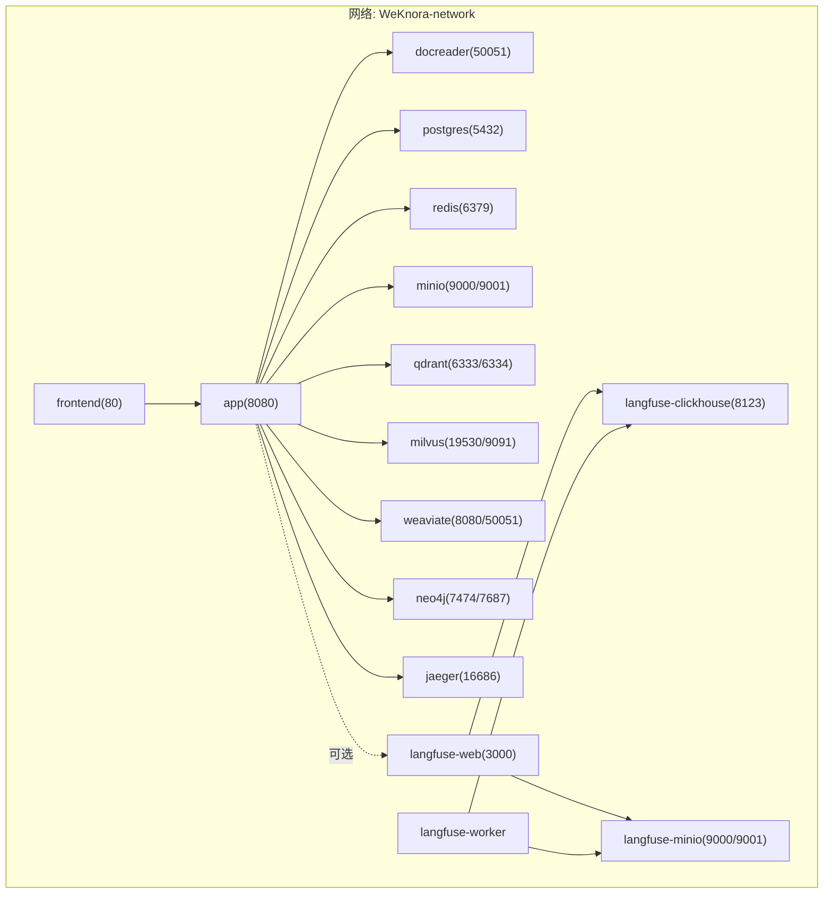
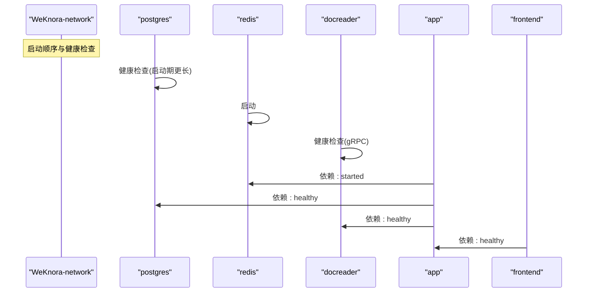
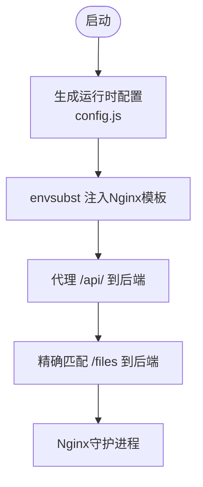
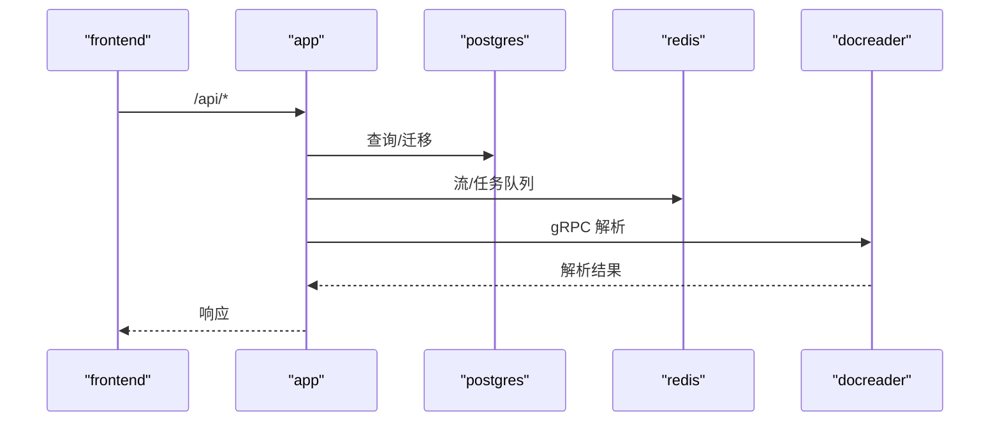
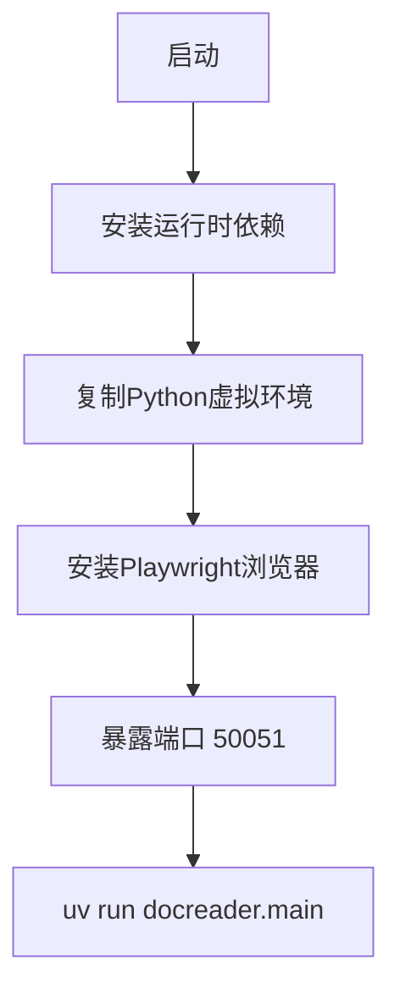
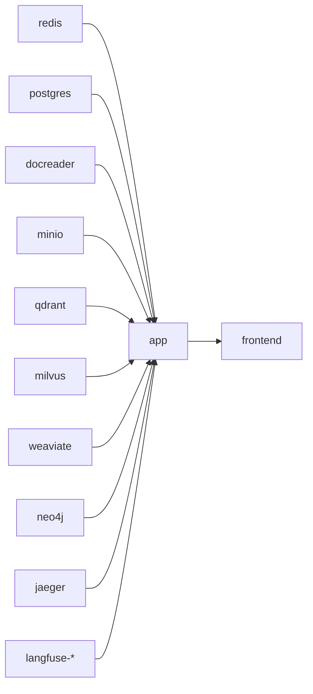

# Docker部署

<cite>
**本文引用的文件**
- [docker-compose.yml](file://docker-compose.yml)
- [docker-compose.dev.yml](file://docker-compose.dev.yml)
- [Dockerfile.docreader](file://docker/Dockerfile.docreader)
- [Dockerfile.sandbox](file://docker/Dockerfile.sandbox)
- [Dockerfile](file://frontend/Dockerfile)
- [nginx.conf](file://frontend/nginx.conf)
- [docker-entrypoint.sh](file://frontend/docker-entrypoint.sh)
- [build_images.sh](file://scripts/build_images.sh)
- [config.yaml](file://config/config.yaml)
- [Chart.yaml](file://helm/Chart.yaml)
- [values.yaml](file://helm/values.yaml)
- [README.md](file://README.md)
</cite>

## 目录
1. [简介](#简介)
2. [项目结构](#项目结构)
3. [核心组件](#核心组件)
4. [架构总览](#架构总览)
5. [详细组件分析](#详细组件分析)
6. [依赖分析](#依赖分析)
7. [性能考虑](#性能考虑)
8. [故障排除指南](#故障排除指南)
9. [结论](#结论)
10. [附录](#附录)

## 简介
本文件面向DevOps工程师与系统管理员，提供WeKnora在Docker环境下的完整部署指导。内容覆盖Docker Compose服务编排、前端与后端镜像构建、文档解析器、数据库与缓存服务的部署流程，以及环境变量、数据卷、网络与健康检查策略。同时给出单机与生产环境的差异化配置建议，并提供日志查看、调试与故障排除方法。

## 项目结构
WeKnora的Docker部署由以下关键部分组成：
- 后端应用服务（App）：提供REST API、会话处理、工具链与检索能力。
- 前端服务（UI）：基于Nginx的静态站点，负责用户界面与API反向代理。
- 文档解析器（DocReader）：gRPC服务，负责多格式文档解析与图片提取。
- 基础设施服务：PostgreSQL（ParadeDB）、Redis、MinIO、Jaeger、Neo4j、Qdrant、Milvus、Weaviate、Dex、Langfuse（可选）。
- 沙箱镜像（Sandbox）：用于Agent技能脚本的安全执行环境。
- Helm Chart：用于Kubernetes部署的配置模板。

图表来源
- [docker-compose.yml:1-613](file://docker-compose.yml#L1-L613)

章节来源
- [docker-compose.yml:1-613](file://docker-compose.yml#L1-L613)
- [docker-compose.dev.yml:1-420](file://docker-compose.dev.yml#L1-L420)
- [Chart.yaml:1-27](file://helm/Chart.yaml#L1-L27)

## 核心组件
- 前端（frontend）
  - 基于Nginx的静态站点，支持动态注入运行时配置与API反向代理。
  - 端口：80；可通过环境变量MAX_FILE_SIZE_MB调整上传限制。
- 后端（app）
  - 提供REST API、会话处理、检索与工具链；内置健康检查。
  - 端口：8080；依赖PostgreSQL、Redis、DocReader等。
- 文档解析器（docreader）
  - gRPC服务，支持PDF、Word、图片等多种格式解析；内置健康检查。
  - 端口：50051；使用独立临时目录进行中间图片输出。
- 数据库（postgres）
  - 使用ParadeDB（PostgreSQL + 向量扩展），内置健康检查与优雅停机。
- 缓存（redis）
  - 作为流与任务队列，支持可选密码。
- 存储（minio）
  - S3兼容对象存储，提供Web控制台与健康检查。
- 可观测性（jaeger）
  - 分布式追踪，提供Web UI与OTLP入口。
- 图数据库（neo4j）
  - 可选，用于知识图谱与GraphRAG。
- 向量库（qdrant、milvus、weaviate）
  - 可选，支持多种向量检索后端。
- 沙箱（sandbox）
  - 仅用于构建与拉取，实际执行时按需运行。
- Langfuse（可选）
  - 自建可观测栈，复用PostgreSQL与Redis，新增ClickHouse与MinIO。

章节来源
- [docker-compose.yml:2-171](file://docker-compose.yml#L2-L171)
- [docker-compose.yml:173-364](file://docker-compose.yml#L173-L364)
- [docker-compose.yml:200-221](file://docker-compose.yml#L200-L221)
- [docker-compose.yml:222-226](file://docker-compose.yml#L222-L226)
- [docker-compose.yml:230-251](file://docker-compose.yml#L230-L251)
- [docker-compose.yml:253-277](file://docker-compose.yml#L253-L277)
- [docker-compose.yml:278-297](file://docker-compose.yml#L278-L297)
- [docker-compose.yml:299-312](file://docker-compose.yml#L299-L312)
- [docker-compose.yml:314-341](file://docker-compose.yml#L314-L341)
- [docker-compose.yml:342-364](file://docker-compose.yml#L342-L364)
- [docker-compose.yml:161-171](file://docker-compose.yml#L161-L171)
- [docker-compose.yml:377-594](file://docker-compose.yml#L377-L594)

## 架构总览
下图展示Docker Compose服务间的依赖关系与启动顺序控制。后端服务通过depends_on与健康检查确保在前置服务可用后再启动，从而实现稳定的启动序列。

图表来源
- [docker-compose.yml:44-49](file://docker-compose.yml#L44-L49)
- [docker-compose.yml:148-154](file://docker-compose.yml#L148-L154)
- [docker-compose.yml:21-23](file://docker-compose.yml#L21-L23)
- [docker-compose.yml:173-196](file://docker-compose.yml#L173-L196)
- [docker-compose.yml:200-221](file://docker-compose.yml#L200-L221)
- [docker-compose.yml:222-226](file://docker-compose.yml#L222-L226)

章节来源
- [docker-compose.yml:1-613](file://docker-compose.yml#L1-L613)

## 详细组件分析

### 前端服务（frontend）
- 镜像与构建
  - 多阶段构建：Node构建产物，Nginx运行时。
  - 注入运行时配置至前端，支持MAX_FILE_SIZE_MB。
- 网络与代理
  - 默认监听80；通过APP_HOST/APP_PORT/APP_SCHEME代理到后端API与文件接口。
  - 支持SSE长连接配置，关闭缓冲与缓存以提升实时性。
- 健康检查
  - 通过后端健康端点进行依赖检查（当后端启用时）。

图表来源
- [Dockerfile:1-43](file://frontend/Dockerfile#L1-L43)
- [nginx.conf:1-64](file://frontend/nginx.conf#L1-L64)
- [docker-entrypoint.sh:1-19](file://frontend/docker-entrypoint.sh#L1-L19)

章节来源
- [Dockerfile:1-43](file://frontend/Dockerfile#L1-L43)
- [nginx.conf:1-64](file://frontend/nginx.conf#L1-L64)
- [docker-entrypoint.sh:1-19](file://frontend/docker-entrypoint.sh#L1-L19)

### 后端服务（app）
- 镜像与构建
  - 使用docker/Dockerfile.app构建（脚本中定义），支持多阶段与构建参数。
- 健康检查
  - HTTP GET /health，启动宽限期后开始检查。
- 环境变量与依赖
  - 数据库：PostgreSQL（ParadeDB）。
  - 缓存：Redis（支持密码与DB选择）。
  - 向量库：Qdrant、Milvus、Weaviate、Elasticsearch（可选）。
  - 对象存储：MinIO（S3兼容）。
  - 文档解析：DocReader（gRPC）。
  - 可观测：Jaeger（OTLP）。
  - 可选：Neo4j（知识图谱）、Langfuse（自建可观测栈）。
- 数据卷
  - 本地文件存储：/data/files
  - DocReader临时目录：/tmp/docreader（只读）
  - 配置挂载：/app/config/config.yaml
  - 技能目录挂载：/app/skills/preloaded（热加载）

图表来源
- [docker-compose.yml:28-171](file://docker-compose.yml#L28-L171)
- [config.yaml:1-113](file://config/config.yaml#L1-L113)

章节来源
- [docker-compose.yml:28-171](file://docker-compose.yml#L28-L171)
- [config.yaml:1-113](file://config/config.yaml#L1-L113)

### 文档解析器（docreader）
- 镜像与构建
  - 多阶段构建，轻量化运行时，移除了OCR/VLM依赖。
  - 安装grpc_health_probe用于健康检查。
- 端口与卷
  - gRPC端口：50051
  - 临时目录：/tmp/docreader
- 健康检查
  - gRPC健康探针

图表来源
- [Dockerfile.docreader:82-158](file://docker/Dockerfile.docreader#L82-L158)

章节来源
- [Dockerfile.docreader:1-158](file://docker/Dockerfile.docreader#L1-L158)
- [docker-compose.yml:173-196](file://docker-compose.yml#L173-L196)

### 基础设施服务
- PostgreSQL（ParadeDB）
  - 健康检查：pg_isready
  - 停机优雅期：1分钟
- Redis
  - 启用AOF与可选密码
- MinIO
  - 健康检查：/minio/health/live
  - 控制台端口可选暴露
- Jaeger
  - OTLP/HTTP/UDP端口开放，Web UI 16686
- Neo4j、Qdrant、Milvus、Weaviate
  - 可选组件，按需启用（profiles）

章节来源
- [docker-compose.yml:200-221](file://docker-compose.yml#L200-L221)
- [docker-compose.yml:222-226](file://docker-compose.yml#L222-L226)
- [docker-compose.yml:230-251](file://docker-compose.yml#L230-L251)
- [docker-compose.yml:253-277](file://docker-compose.yml#L253-L277)
- [docker-compose.yml:278-297](file://docker-compose.yml#L278-L297)
- [docker-compose.yml:299-312](file://docker-compose.yml#L299-L312)
- [docker-compose.yml:314-341](file://docker-compose.yml#L314-L341)
- [docker-compose.yml:342-364](file://docker-compose.yml#L342-L364)

### 沙箱镜像（sandbox）
- 用途：仅用于构建与拉取，非常驻服务；实际执行时按需运行。
- 多阶段构建，预装Node与常用CLI工具，非root用户执行。

章节来源
- [Dockerfile.sandbox:1-31](file://docker/Dockerfile.sandbox#L1-L31)
- [docker-compose.yml:161-171](file://docker-compose.yml#L161-L171)

### Langfuse自建可观测栈（可选）
- 复用现有PostgreSQL与Redis，新增ClickHouse与MinIO。
- 提供Worker与Web组件，支持S3事件与媒体上传。
- 通过profiles启用。

章节来源
- [docker-compose.yml:377-594](file://docker-compose.yml#L377-L594)

## 依赖分析
- 服务耦合与启动顺序
  - app依赖redis已启动、postgres健康、docreader健康。
  - frontend依赖app健康。
- 网络隔离
  - 所有服务位于同一bridge网络，便于内部通信。
- 数据持久化
  - 关键服务通过命名卷持久化数据（如postgres-data、redis、minio等）。

图表来源
- [docker-compose.yml:148-157](file://docker-compose.yml#L148-L157)
- [docker-compose.yml:21-26](file://docker-compose.yml#L21-L26)
- [docker-compose.yml:596-613](file://docker-compose.yml#L596-L613)

章节来源
- [docker-compose.yml:1-613](file://docker-compose.yml#L1-L613)

## 性能考虑
- 前端Nginx
  - 关闭代理缓冲与缓存，提升SSE实时性；合理设置超时与连接数。
- 后端App
  - 合理设置并发池大小与流管理器类型；根据负载调整资源请求与限制。
- 文档解析器
  - 轻量化运行时减少内存占用；Playwright浏览器按需安装。
- 数据库与向量库
  - 选择合适的向量库与索引参数；对大模型推理与嵌入进行限流与超时控制。
- 缓存与存储
  - Redis开启AOF与密码；MinIO使用独立桶与安全策略。

## 故障排除指南
- 健康检查失败
  - 查看各服务健康探针配置与日志；确认前置服务已启动且端口可达。
- 端口冲突
  - 修改映射端口或停止占用进程；确保宿主机端口未被占用。
- 文件上传失败
  - 检查MAX_FILE_SIZE_MB与Nginx client_max_body_size；确认/data/files卷权限。
- 向量库/数据库不可用
  - 检查RETRIEVE_DRIVER与对应后端地址；确认网络连通与凭据正确。
- 日志查看
  - 使用docker compose日志命令查看容器日志；必要时进入容器内查看应用日志。
- 调试技巧
  - 使用extra_hosts将host.docker.internal映射到宿主机；在开发模式下启用SSE与长连接调试。

章节来源
- [docker-compose.yml:44-49](file://docker-compose.yml#L44-L49)
- [docker-compose.yml:188-193](file://docker-compose.yml#L188-L193)
- [docker-compose.yml:212-217](file://docker-compose.yml#L212-L217)
- [docker-compose.yml:442-447](file://docker-compose.yml#L442-L447)
- [docker-compose.yml:471-475](file://docker-compose.yml#L471-L475)
- [docker-compose.yml:500-511](file://docker-compose.yml#L500-L511)
- [docker-compose.yml:562-577](file://docker-compose.yml#L562-L577)

## 结论
WeKnora提供了完整的Docker部署方案，涵盖前端、后端、文档解析器与多种基础设施服务。通过Compose的健康检查与启动顺序控制，可实现稳定可靠的容器化部署。结合Helm Chart，可在Kubernetes环境中进一步扩展与治理。建议在生产环境强化安全配置（如密码、TLS、RBAC）与监控告警体系。

## 附录

### 单机部署与生产环境差异
- 单机部署（docker-compose）
  - 使用默认profile，快速启动核心服务；适合开发测试与小规模部署。
- 生产环境（docker-compose + profiles）
  - 按需启用neo4j、minio、jaeger、langfuse等；加强安全与可观测性。
- Kubernetes（Helm）
  - 使用Chart.yaml与values.yaml进行标准化部署；支持Secret管理与Ingress配置。

章节来源
- [README.md:246-269](file://README.md#L246-L269)
- [docker-compose.yml:377-594](file://docker-compose.yml#L377-L594)
- [Chart.yaml:1-27](file://helm/Chart.yaml#L1-L27)
- [values.yaml:1-493](file://helm/values.yaml#L1-L493)

### 环境变量与配置要点
- 前端
  - MAX_FILE_SIZE_MB：前端上传限制（MB）
  - APP_HOST/APP_PORT/APP_SCHEME：后端API与文件代理目标
- 后端
  - DB_*：数据库连接
  - REDIS_*：缓存连接
  - QDRANT_* / MILVUS_* / WEAVIATE_*：向量库配置
  - STORAGE_TYPE / MINIO_*：对象存储配置
  - DOCREADER_ADDR/TRANSPORT：文档解析器地址与传输协议
  - OTEL_*：分布式追踪配置
  - ENABLE_GRAPH_RAG / NEO4J_*：知识图谱配置
  - WEKNORA_*：沙箱模式与超时、Crypto密钥等
- 基础设施
  - 各服务均有对应环境变量与健康检查配置

章节来源
- [docker-compose.yml:50-147](file://docker-compose.yml#L50-L147)
- [docker-compose.yml:204-207](file://docker-compose.yml#L204-L207)
- [docker-compose.yml:236-238](file://docker-compose.yml#L236-L238)
- [docker-compose.yml:283-284](file://docker-compose.yml#L283-L284)
- [docker-compose.yml:299-304](file://docker-compose.yml#L299-L304)
- [docker-compose.yml:315-324](file://docker-compose.yml#L315-L324)
- [docker-compose.yml:346-353](file://docker-compose.yml#L346-L353)

### 数据卷挂载策略
- /data/files：后端文件存储（本地或S3）
- /tmp/docreader：DocReader临时目录（只读）
- /app/config/config.yaml：后端配置挂载
- /app/skills/preloaded：技能目录热加载
- 各服务持久化卷：postgres-data、jaeger_data、minio_data、neo4j-data、qdrant_data、milvus_data、weaviate_data、langfuse_*等

章节来源
- [docker-compose.yml:38-43](file://docker-compose.yml#L38-L43)
- [docker-compose.yml:600-613](file://docker-compose.yml#L600-L613)

### 网络配置
- WeKnora-network：所有服务位于同一bridge网络，内部通过服务名通信。
- 外部端口映射：frontend（80）、app（8080）、minio（9000/9001）、jaeger（16686）、neo4j（7474/7687）、qdrant（6333/6334）、milvus（19530/9091）、weaviate（8080/50051）、langfuse-web（3000）、langfuse-minio（9000/9001）、langfuse-clickhouse（8123）

章节来源
- [docker-compose.yml:596-598](file://docker-compose.yml#L596-L598)
- [docker-compose.yml:9-11](file://docker-compose.yml#L9-L11)
- [docker-compose.yml:35-37](file://docker-compose.yml#L35-L37)
- [docker-compose.yml:233-235](file://docker-compose.yml#L233-L235)
- [docker-compose.yml:256-265](file://docker-compose.yml#L256-L265)
- [docker-compose.yml:289-291](file://docker-compose.yml#L289-L291)
- [docker-compose.yml:302-304](file://docker-compose.yml#L302-L304)
- [docker-compose.yml:331-333](file://docker-compose.yml#L331-L333)
- [docker-compose.yml:354-356](file://docker-compose.yml#L354-L356)
- [docker-compose.yml:559-560](file://docker-compose.yml#L559-L560)
- [docker-compose.yml:464-468](file://docker-compose.yml#L464-L468)
- [docker-compose.yml:442-447](file://docker-compose.yml#L442-L447)

### 容器健康检查机制
- app：HTTP /health
- docreader：grpc_health_probe
- postgres：pg_isready
- minio：/minio/health/live
- jaeger：Web UI可达
- langfuse-clickhouse：/ping
- langfuse-minio：mc ready

章节来源
- [docker-compose.yml:44-49](file://docker-compose.yml#L44-L49)
- [docker-compose.yml:188-193](file://docker-compose.yml#L188-L193)
- [docker-compose.yml:212-217](file://docker-compose.yml#L212-L217)
- [docker-compose.yml:242-246](file://docker-compose.yml#L242-L246)
- [docker-compose.yml:442-447](file://docker-compose.yml#L442-L447)
- [docker-compose.yml:471-475](file://docker-compose.yml#L471-L475)

### 服务依赖关系与启动顺序控制
- app依赖redis已启动、postgres健康、docreader健康
- frontend依赖app健康
- 启动宽限期与重试策略已在健康检查中配置

章节来源
- [docker-compose.yml:148-157](file://docker-compose.yml#L148-L157)
- [docker-compose.yml:21-23](file://docker-compose.yml#L21-L23)

### Docker镜像构建过程与多阶段优化
- 后端应用镜像：scripts/build_images.sh统一构建，支持多平台与构建参数传递。
- 前端镜像：多阶段构建，Nginx运行时，注入运行时配置。
- 文档解析器镜像：多阶段构建，轻量化运行时，移除OCR/VLM依赖，安装grpc_health_probe。
- 沙箱镜像：多阶段构建，预装Node与常用CLI工具，非root用户执行。

章节来源
- [build_images.sh:127-156](file://scripts/build_images.sh#L127-L156)
- [build_images.sh:158-180](file://scripts/build_images.sh#L158-L180)
- [build_images.sh:182-201](file://scripts/build_images.sh#L182-L201)
- [build_images.sh:203-222](file://scripts/build_images.sh#L203-L222)
- [Dockerfile:1-43](file://frontend/Dockerfile#L1-L43)
- [Dockerfile.docreader:1-158](file://docker/Dockerfile.docreader#L1-L158)
- [Dockerfile.sandbox:1-31](file://docker/Dockerfile.sandbox#L1-L31)

### 镜像版本管理与发布建议
- 使用scripts/build_images.sh集中管理版本与构建参数。
- 建议在CI/CD中固定镜像标签，配合Helm Chart的image.tag进行版本化发布。
- 对于Langfuse组件，注意ClickHouse与MinIO版本兼容性。

章节来源
- [build_images.sh:95-125](file://scripts/build_images.sh#L95-L125)
- [docker-compose.yml:430-431](file://docker-compose.yml#L430-L431)
- [docker-compose.yml:454-455](file://docker-compose.yml#L454-L455)

### 开发与生产环境切换
- 开发环境（docker-compose.dev.yml）
  - 仅启动基础设施服务，后端与前端在本地运行，便于快速迭代。
- 生产环境（docker-compose.yml）
  - 启动完整服务编排，支持profiles扩展功能。

章节来源
- [docker-compose.dev.yml:1-420](file://docker-compose.dev.yml#L1-L420)
- [docker-compose.yml:1-613](file://docker-compose.yml#L1-L613)

### 日志查看与调试
- 使用docker compose日志命令查看容器日志。
- 前端Nginx日志路径：/var/log/nginx/{access,error}.log。
- 后端应用日志输出至标准输出，便于容器平台收集。
- 如需进入容器调试，可使用docker exec进入容器内部。

章节来源
- [nginx.conf:13-15](file://frontend/nginx.conf#L13-L15)
- [docker-entrypoint.sh:17-18](file://frontend/docker-entrypoint.sh#L17-L18)