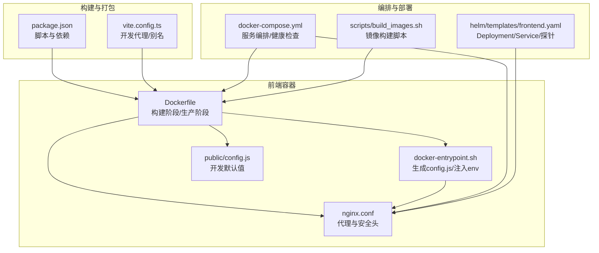
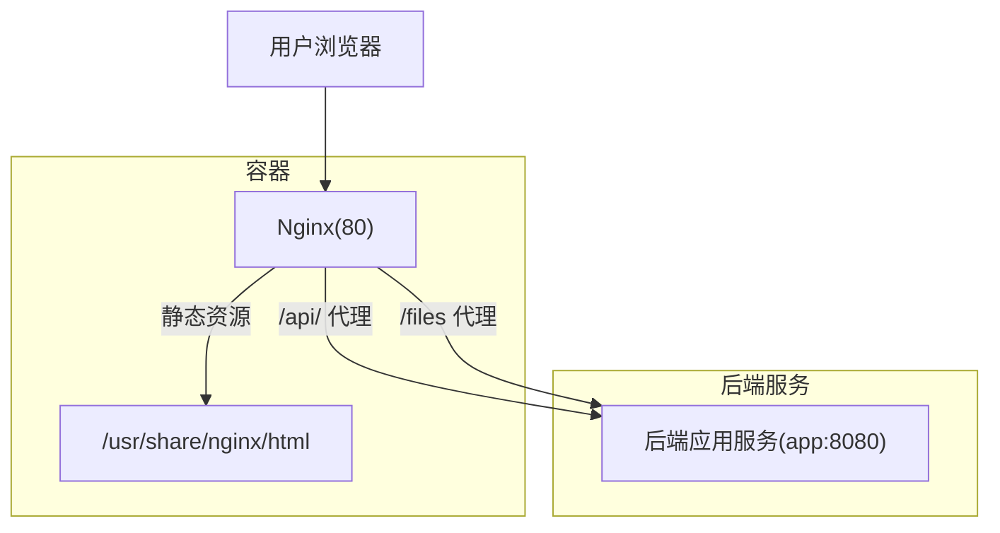
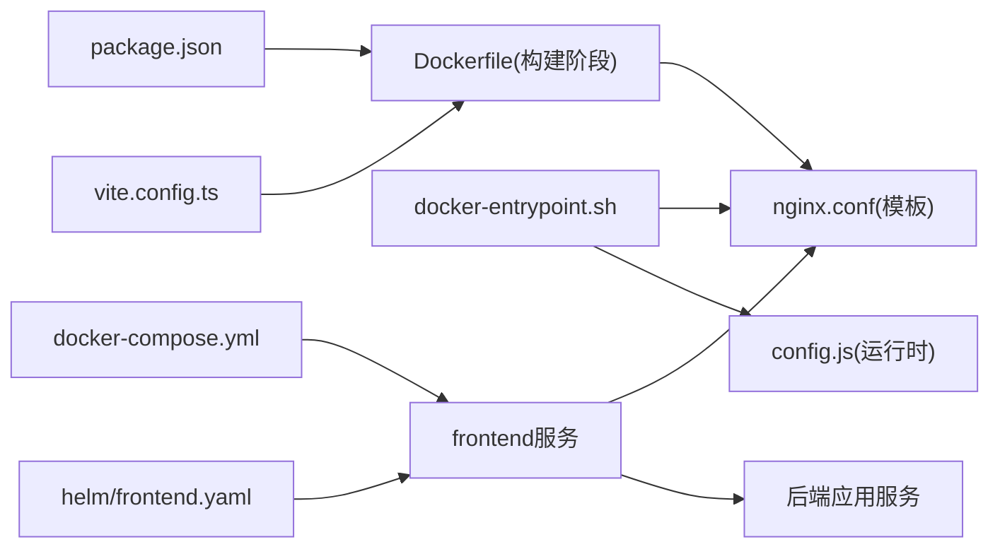

# 前端服务部署

<cite>
**本文引用的文件**
- [frontend/Dockerfile](file://frontend/Dockerfile)
- [frontend/nginx.conf](file://frontend/nginx.conf)
- [frontend/docker-entrypoint.sh](file://frontend/docker-entrypoint.sh)
- [frontend/package.json](file://frontend/package.json)
- [frontend/vite.config.ts](file://frontend/vite.config.ts)
- [frontend/public/config.js](file://frontend/public/config.js)
- [frontend/src/utils/api-base.ts](file://frontend/src/utils/api-base.ts)
- [docker-compose.yml](file://docker-compose.yml)
- [helm/templates/frontend.yaml](file://helm/templates/frontend.yaml)
- [scripts/build_images.sh](file://scripts/build_images.sh)
</cite>

## 目录
1. [简介](#简介)
2. [项目结构](#项目结构)
3. [核心组件](#核心组件)
4. [架构总览](#架构总览)
5. [组件详解](#组件详解)
6. [依赖关系分析](#依赖关系分析)
7. [性能与优化](#性能与优化)
8. [故障排查指南](#故障排查指南)
9. [结论](#结论)
10. [附录](#附录)

## 简介
本文件面向DevOps工程师，提供WeKnora前端服务的完整Docker容器化部署指导。内容涵盖前端镜像构建参数、Nginx反向代理与静态资源服务、环境变量与端口映射策略、与后端服务的通信机制与API代理、健康检查与启动顺序控制、错误处理策略、性能优化与CDN集成建议，并给出基于Compose与Helm的部署清单与最佳实践。

## 项目结构
前端部署相关的关键文件与职责如下：
- 前端镜像构建：frontend/Dockerfile
- Nginx配置模板：frontend/nginx.conf
- 容器启动入口脚本：frontend/docker-entrypoint.sh
- 前端构建与开发工具链：frontend/package.json、frontend/vite.config.ts
- 运行时配置注入：frontend/public/config.js、frontend/docker-entrypoint.sh
- Compose编排：docker-compose.yml
- Helm部署清单：helm/templates/frontend.yaml
- 镜像构建脚本：scripts/build_images.sh

图表来源
- [frontend/Dockerfile:1-43](file://frontend/Dockerfile#L1-L43)
- [frontend/nginx.conf:1-64](file://frontend/nginx.conf#L1-L64)
- [frontend/docker-entrypoint.sh:1-19](file://frontend/docker-entrypoint.sh#L1-L19)
- [frontend/public/config.js:1-5](file://frontend/public/config.js#L1-L5)
- [frontend/package.json:1-64](file://frontend/package.json#L1-L64)
- [frontend/vite.config.ts:1-56](file://frontend/vite.config.ts#L1-L56)
- [docker-compose.yml:1-613](file://docker-compose.yml#L1-L613)
- [helm/templates/frontend.yaml:1-113](file://helm/templates/frontend.yaml#L1-L113)
- [scripts/build_images.sh:182-201](file://scripts/build_images.sh#L182-L201)

章节来源
- [frontend/Dockerfile:1-43](file://frontend/Dockerfile#L1-L43)
- [frontend/nginx.conf:1-64](file://frontend/nginx.conf#L1-L64)
- [frontend/docker-entrypoint.sh:1-19](file://frontend/docker-entrypoint.sh#L1-L19)
- [frontend/package.json:1-64](file://frontend/package.json#L1-L64)
- [frontend/vite.config.ts:1-56](file://frontend/vite.config.ts#L1-L56)
- [docker-compose.yml:1-613](file://docker-compose.yml#L1-L613)
- [helm/templates/frontend.yaml:1-113](file://helm/templates/frontend.yaml#L1-L113)
- [scripts/build_images.sh:182-201](file://scripts/build_images.sh#L182-L201)

## 核心组件
- 前端镜像构建
  - 多阶段构建：Node构建产物，Nginx提供静态服务
  - 环境变量：NODE_OPTIONS、VITE_IS_DOCKER、MAX_FILE_SIZE_MB
  - 暴露端口：80
- Nginx反向代理
  - /api/ 代理至后端APP_HOST:APP_PORT（支持APP_SCHEME）
  - /files 精确匹配代理至后端文件接口
  - 安全头、日志、SSE相关代理参数
- 运行时配置注入
  - docker-entrypoint.sh生成window.__RUNTIME_CONFIG__（如MAX_FILE_SIZE_MB）
  - envsubst替换nginx模板中的环境变量
- Compose/Helm编排
  - 健康检查：frontend依赖后端健康
  - 探针：Helm中提供liveness/readiness
  - 端口映射：FRONTEND_PORT:80（Compose）或Service端口（Helm）

章节来源
- [frontend/Dockerfile:1-43](file://frontend/Dockerfile#L1-L43)
- [frontend/nginx.conf:1-64](file://frontend/nginx.conf#L1-L64)
- [frontend/docker-entrypoint.sh:1-19](file://frontend/docker-entrypoint.sh#L1-L19)
- [docker-compose.yml:2-26](file://docker-compose.yml#L2-L26)
- [helm/templates/frontend.yaml:44-70](file://helm/templates/frontend.yaml#L44-L70)

## 架构总览
前端容器作为Nginx静态资源服务器，负责：
- 提供SPA静态文件与回退路由
- 将API请求代理到后端应用服务
- 将本地存储文件请求代理到后端
- 注入运行时配置与安全头

图表来源
- [frontend/nginx.conf:17-57](file://frontend/nginx.conf#L17-L57)
- [frontend/docker-entrypoint.sh:10-18](file://frontend/docker-entrypoint.sh#L10-L18)
- [docker-compose.yml:11-26](file://docker-compose.yml#L11-L26)

## 组件详解

### 前端镜像构建配置
- 构建阶段
  - 基础镜像：node:24-alpine
  - 环境变量：NODE_OPTIONS（增大Node堆内存）、VITE_IS_DOCKER（标记Docker环境）
  - 依赖安装：启用corepack与pnpm
  - 构建产物：dist目录
- 生产阶段
  - 基础镜像：nginx:stable-alpine
  - 复制构建产物至/usr/share/nginx/html
  - 复制nginx模板至/etc/nginx/templates/default.conf.template
  - 复制启动脚本并赋权
  - 默认环境变量：MAX_FILE_SIZE_MB=50
  - 暴露端口：80
  - 入口：/docker-entrypoint.sh

章节来源
- [frontend/Dockerfile:1-43](file://frontend/Dockerfile#L1-L43)

### Nginx反向代理与静态资源服务
- 静态资源
  - 根目录：/usr/share/nginx/html
  - 回退路由：try_files $uri $uri/ /index.html
- 文件代理
  - 精确匹配location = /files，代理至APP_SCHEME://APP_HOST:APP_PORT/files
- API代理
  - location /api/ 代理至APP_SCHEME://APP_HOST:APP_PORT/api/
  - 代理头：Host、X-Real-IP、X-Forwarded-For、X-Forwarded-Proto
  - 连接与重试：proxy_connect_timeout、proxy_next_upstream、proxy_next_upstream_tries、proxy_next_upstream_timeout
  - SSE支持：HTTP/1.1、禁用Connection: close、关闭分块编码与缓冲、关闭缓存、延长读写超时
- 安全头与日志
  - X-Frame-Options、X-Content-Type-Options、X-XSS-Protection、Referrer-Policy
  - 错误与访问日志路径

章节来源
- [frontend/nginx.conf:17-57](file://frontend/nginx.conf#L17-L57)

### 运行时配置注入与环境变量
- 运行时配置
  - docker-entrypoint.sh生成window.__RUNTIME_CONFIG__（包含MAX_FILE_SIZE_MB）
  - public/config.js提供开发环境默认值，Docker环境会被覆盖
- 环境变量注入
  - docker-entrypoint.sh导出：MAX_FILE_SIZE（格式为${MAX_FILE_SIZE_MB}M）、APP_HOST、APP_PORT、APP_SCHEME
  - envsubst将模板变量替换为最终nginx.conf并写入/etc/nginx/conf.d/default.conf
- 前端API基础路径
  - getApiBaseUrl返回空字符串，表示同源请求；开发时Vite代理到后端

章节来源
- [frontend/docker-entrypoint.sh:1-19](file://frontend/docker-entrypoint.sh#L1-L19)
- [frontend/public/config.js:1-5](file://frontend/public/config.js#L1-L5)
- [frontend/src/utils/api-base.ts:1-6](file://frontend/src/utils/api-base.ts#L1-L6)
- [frontend/vite.config.ts:38-54](file://frontend/vite.config.ts#L38-L54)

### 健康检查与启动顺序控制
- Compose
  - frontend依赖app健康（service_healthy）
  - app健康检查：curl探测/health
- Helm
  - Deployment提供livenessProbe与readinessProbe（HTTP GET /）
  - 探针参数：initialDelaySeconds、periodSeconds、timeoutSeconds、failureThreshold
  - 为Nginx挂载emptyDir以满足临时目录权限需求

章节来源
- [docker-compose.yml:21-26](file://docker-compose.yml#L21-L26)
- [docker-compose.yml:44-49](file://docker-compose.yml#L44-L49)
- [helm/templates/frontend.yaml:55-70](file://helm/templates/frontend.yaml#L55-L70)
- [helm/templates/frontend.yaml:72-81](file://helm/templates/frontend.yaml#L72-L81)

### 与后端服务的通信机制与API代理
- 代理目标
  - APP_HOST、APP_PORT、APP_SCHEME来自环境变量，默认值分别为app、8080、http
- 代理行为
  - /api/ 与 /files 精确匹配代理，保留Host与标准转发头
  - 对SSE场景禁用缓冲与分块编码，保持长连接
- 开发代理
  - Vite开发服务器对/api与/files进行本地代理，便于前后端联调

章节来源
- [frontend/nginx.conf:24-57](file://frontend/nginx.conf#L24-L57)
- [frontend/vite.config.ts:42-53](file://frontend/vite.config.ts#L42-L53)
- [docker-compose.yml:11-18](file://docker-compose.yml#L11-L18)

### 端口映射策略
- Compose
  - FRONTEND_PORT:80（默认80映射到容器80）
  - APP_PORT:8080（后端服务监听端口映射）
- Helm
  - Service暴露http端口，容器端口80
  - Deployment通过values可配置Service类型与端口

章节来源
- [docker-compose.yml:9-10](file://docker-compose.yml#L9-L10)
- [docker-compose.yml:36-37](file://docker-compose.yml#L36-L37)
- [helm/templates/frontend.yaml:104-112](file://helm/templates/frontend.yaml#L104-L112)

### 错误处理策略
- Nginx错误页
  - 500/502/503/504统一指向内置50x.html
- 代理错误与重试
  - proxy_next_upstream配置常见上游错误与超时
  - 重试次数与超时时间可调
- 健康检查失败
  - Compose与Helm均提供探针，失败阈值可配置

章节来源
- [frontend/nginx.conf:59-63](file://frontend/nginx.conf#L59-L63)
- [frontend/nginx.conf:43-47](file://frontend/nginx.conf#L43-L47)
- [docker-compose.yml:44-49](file://docker-compose.yml#L44-L49)
- [helm/templates/frontend.yaml:55-70](file://helm/templates/frontend.yaml#L55-L70)

## 依赖关系分析
- 构建与运行时依赖
  - Node与pnpm用于构建前端产物
  - Nginx用于提供静态服务与反向代理
- 编排依赖
  - frontend依赖app健康（Compose）
  - Helm提供独立的探针配置
- 配置依赖
  - docker-entrypoint.sh依赖环境变量生成config.js与nginx.conf
  - nginx.conf依赖模板变量（envsubst）

图表来源
- [frontend/package.json:1-64](file://frontend/package.json#L1-L64)
- [frontend/vite.config.ts:1-56](file://frontend/vite.config.ts#L1-L56)
- [frontend/Dockerfile:1-43](file://frontend/Dockerfile#L1-L43)
- [frontend/nginx.conf:1-64](file://frontend/nginx.conf#L1-L64)
- [frontend/docker-entrypoint.sh:1-19](file://frontend/docker-entrypoint.sh#L1-L19)
- [docker-compose.yml:2-26](file://docker-compose.yml#L2-L26)
- [helm/templates/frontend.yaml:1-113](file://helm/templates/frontend.yaml#L1-L113)

章节来源
- [frontend/package.json:1-64](file://frontend/package.json#L1-L64)
- [frontend/vite.config.ts:1-56](file://frontend/vite.config.ts#L1-L56)
- [frontend/Dockerfile:1-43](file://frontend/Dockerfile#L1-L43)
- [frontend/nginx.conf:1-64](file://frontend/nginx.conf#L1-L64)
- [frontend/docker-entrypoint.sh:1-19](file://frontend/docker-entrypoint.sh#L1-L19)
- [docker-compose.yml:2-26](file://docker-compose.yml#L2-L26)
- [helm/templates/frontend.yaml:1-113](file://helm/templates/frontend.yaml#L1-L113)

## 性能与优化
- Nginx代理优化
  - SSE场景禁用缓冲与分块编码，保持长连接
  - 延长读写超时，适配流式响应
  - 关闭代理缓存，避免静态资源缓存污染
- 运行时配置
  - MAX_FILE_SIZE_MB控制client_max_body_size，避免过大上传导致内存压力
- 部署建议
  - 使用Helm时为Nginx挂载emptyDir，确保/var/cache/nginx与/var/run可写
  - CDN集成：将静态资源托管于CDN，前端仍通过Nginx回源至后端API；CDN缓存策略按文件类型与版本号控制
  - TLS终止：在边缘（Ingress/反向代理层）统一开启HTTPS，减少容器内TLS开销

章节来源
- [frontend/nginx.conf:49-57](file://frontend/nginx.conf#L49-L57)
- [frontend/docker-entrypoint.sh:10-15](file://frontend/docker-entrypoint.sh#L10-L15)
- [helm/templates/frontend.yaml:72-81](file://helm/templates/frontend.yaml#L72-L81)

## 故障排查指南
- 前端无法访问或白屏
  - 检查Nginx是否正确加载conf（envsubst是否生效）
  - 查看容器日志：error.log与access.log
- API请求失败
  - 确认APP_HOST/APP_PORT/APP_SCHEME是否正确
  - 检查后端服务健康状态与/health端点
- 上传文件失败
  - 检查MAX_FILE_SIZE_MB与client_max_body_size是否匹配
- 探针失败
  - Compose：确认app健康检查路径与条件
  - Helm：调整探针参数或检查Service/Ingress

章节来源
- [frontend/nginx.conf:13-15](file://frontend/nginx.conf#L13-L15)
- [frontend/docker-entrypoint.sh:10-18](file://frontend/docker-entrypoint.sh#L10-L18)
- [docker-compose.yml:44-49](file://docker-compose.yml#L44-L49)
- [helm/templates/frontend.yaml:55-70](file://helm/templates/frontend.yaml#L55-L70)

## 结论
WeKnora前端采用多阶段构建与Nginx静态服务+反向代理的容器化方案，具备清晰的环境变量注入、运行时配置生成与健康检查机制。通过Compose与Helm两种编排方式，可灵活适配本地开发与生产集群部署。建议结合CDN与边缘TLS终止提升性能与安全性，并根据业务流量调优代理超时与缓冲策略。

## 附录

### 环境变量与默认值对照
- MAX_FILE_SIZE_MB：默认50，影响Nginx client_max_body_size
- APP_HOST：默认app，后端服务主机名
- APP_PORT：默认8080，后端服务端口
- APP_SCHEME：默认http，后端服务协议（可设为https）

章节来源
- [frontend/docker-entrypoint.sh:6-14](file://frontend/docker-entrypoint.sh#L6-L14)
- [frontend/nginx.conf:4-5](file://frontend/nginx.conf#L4-L5)
- [docker-compose.yml:11-18](file://docker-compose.yml#L11-L18)

### 端口与服务映射
- Compose
  - 前端：FRONTEND_PORT:80
  - 后端：APP_PORT:8080
- Helm
  - Service.http.port对应容器端口80

章节来源
- [docker-compose.yml:9-10](file://docker-compose.yml#L9-L10)
- [docker-compose.yml:36-37](file://docker-compose.yml#L36-L37)
- [helm/templates/frontend.yaml:104-112](file://helm/templates/frontend.yaml#L104-L112)

### 镜像构建与发布
- 单独构建前端镜像：scripts/build_images.sh --frontend
- Compose/Helm使用镜像标签：wechatopenai/weknora-ui:${WEKNORA_VERSION:-latest}

章节来源
- [scripts/build_images.sh:182-201](file://scripts/build_images.sh#L182-L201)
- [docker-compose.yml:3](file://docker-compose.yml#L3-L3)
- [helm/templates/frontend.yaml:37-38](file://helm/templates/frontend.yaml#L37-L38)