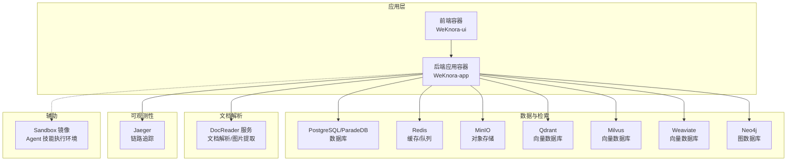
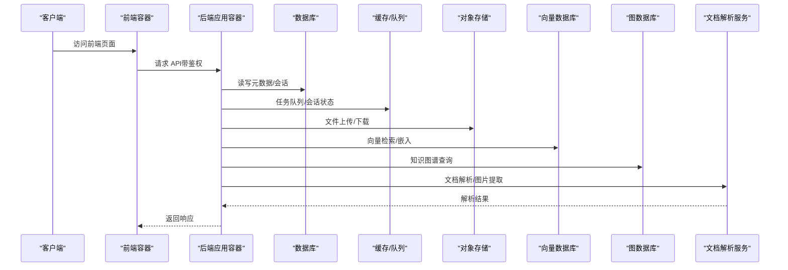
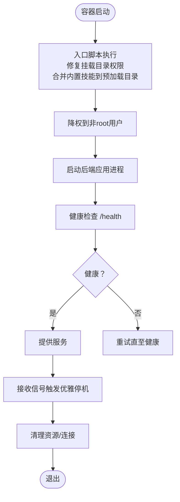
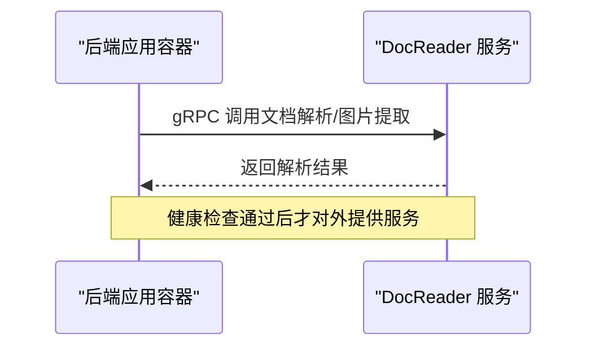
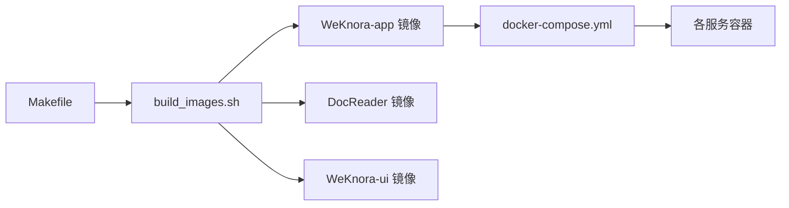

# 后端应用部署

<cite>
**本文引用的文件**
- [docker-compose.yml](file://docker-compose.yml)
- [docker\Dockerfile.docreader](file://docker/Dockerfile.docreader)
- [docker\Dockerfile.sandbox](file://docker/Dockerfile.sandbox)
- [docker\config\supervisord.conf](file://docker/config/supervisord.conf)
- [scripts\docker-entrypoint.sh](file://scripts/docker-entrypoint.sh)
- [cmd\server\main.go](file://cmd/server/main.go)
- [config\config.yaml](file://config/config.yaml)
- [go.mod](file://go.mod)
- [Makefile](file://Makefile)
- [scripts\build_images.sh](file://scripts/build_images.sh)
- [scripts\start_all.sh](file://scripts/start_all.sh)
</cite>

## 目录
1. [简介](#简介)
2. [项目结构](#项目结构)
3. [核心组件](#核心组件)
4. [架构总览](#架构总览)
5. [详细组件分析](#详细组件分析)
6. [依赖关系分析](#依赖关系分析)
7. [性能考虑](#性能考虑)
8. [故障排查指南](#故障排查指南)
9. [结论](#结论)
10. [附录](#附录)

## 简介
本文件为 WeKnora 后端应用服务的完整 Docker 部署与运维指南，覆盖 Go 应用容器构建、多阶段优化、运行时环境、健康检查、启动脚本与进程管理、数据卷与配置、日志输出、性能调优与并发控制、内存管理以及监控配置。目标读者包括开发者与运维工程师，帮助快速、稳定地在容器环境中部署与维护 WeKnora 后端。

## 项目结构
WeKnora 的后端以 Docker Compose 编排为核心，包含应用容器、文档解析服务、数据库、缓存、对象存储、可观测性栈等服务。Compose 文件定义了服务间的依赖、健康检查、环境变量与数据卷挂载，并通过脚本实现一键启动、停止、拉取镜像与环境检查。

图表来源
- [docker-compose.yml:1-613](file://docker-compose.yml#L1-L613)

章节来源
- [docker-compose.yml:1-613](file://docker-compose.yml#L1-L613)

## 核心组件
- 应用容器（WeKnora-app）
  - 通过 Dockerfile 多阶段构建，最终运行 Go 二进制，支持健康检查与优雅停机。
  - 环境变量集中于 docker-compose.yml，涵盖数据库、缓存、对象存储、向量库、可观测性、代理与安全参数。
  - 数据卷挂载包括文件存储目录与只读的 DocReader 临时目录。
- 文档解析服务（DocReader）
  - Python 多阶段构建，提供 gRPC 健康检查，支持网页解析与图片提取。
- 数据与检索
  - PostgreSQL/ParadeDB、Redis、MinIO、Qdrant、Milvus、Weaviate、Neo4j 等服务均在 Compose 中定义。
- 可观测性
  - Jaeger 提供 OTLP 接收器与 Web UI，支持链路追踪。
- Sandbox 镜像
  - 用于 Agent 技能在受限环境中执行，镜像预装 Node.js 与常用工具。

章节来源
- [docker-compose.yml:28-157](file://docker-compose.yml#L28-L157)
- [docker-compose.yml:173-196](file://docker-compose.yml#L173-L196)
- [docker-compose.yml:200-362](file://docker-compose.yml#L200-L362)
- [docker-compose.yml:253-273](file://docker-compose.yml#L253-L273)
- [docker\Dockerfile.sandbox:1-31](file://docker/Dockerfile.sandbox#L1-L31)

## 架构总览
后端应用容器作为核心服务，负责业务逻辑、路由与中间件，同时与多种外部系统交互：数据库（PostgreSQL/ParadeDB）、缓存（Redis）、对象存储（MinIO）、向量数据库（Qdrant/Milvus/Weaviate）、图数据库（Neo4j）以及文档解析服务（DocReader）。可观测性通过 Jaeger 实现链路追踪。

图表来源
- [docker-compose.yml:28-157](file://docker-compose.yml#L28-L157)
- [docker-compose.yml:173-196](file://docker-compose.yml#L173-L196)
- [docker-compose.yml:200-362](file://docker-compose.yml#L200-L362)

## 详细组件分析

### 应用容器（WeKnora-app）
- 构建与运行
  - 多阶段构建：编译 Go 二进制，最终运行时镜像精简，减少攻击面。
  - 运行时通过入口脚本进行权限降级与挂载目录所有权修复，确保宿主机挂载目录可读写。
  - 健康检查：HTTP GET /health，轮询间隔与超时可配置。
- 环境变量与配置
  - 数据库：PostgreSQL/ParadeDB 连接参数（驱动、主机、端口、用户、密码、库名）。
  - 缓存：Redis 地址、用户名、密码、DB、前缀。
  - 对象存储：MinIO 端点、凭据、桶名。
  - 向量库：Qdrant、Milvus、Weaviate 的地址、端口、集合/索引、API Key、TLS 等。
  - 图数据库：Neo4j URI、凭据、启用开关。
  - 观测性：OTLP 端点、服务名、追踪导出器、传播器等。
  - 第三方服务：DocReader 地址与传输协议、OLLAMA 基础地址、SSRF 白名单等。
  - 安全与加密：JWT 密钥、租户与系统 AES 密钥、加密主密钥与盐值。
  - 性能：并发池大小、文件大小限制、语言与时区等。
- 数据卷与挂载
  - /data/files：持久化文件存储。
  - /app/config/config.yaml：应用配置文件挂载。
  - /app/skills/preloaded：预加载技能目录挂载，支持热更新。
  - /tmp/docreader（只读）：DocReader 临时目录。
- 进程管理与优雅停机
  - 应用监听信号，支持两次信号强制关闭，确保资源清理与连接释放。
  - 入口脚本使用 gosu 降权执行，避免以 root 运行。

图表来源
- [scripts\docker-entrypoint.sh:1-44](file://scripts/docker-entrypoint.sh#L1-L44)
- [docker-compose.yml:44-49](file://docker-compose.yml#L44-L49)
- [cmd\server\main.go:72-118](file://cmd/server/main.go#L72-L118)

章节来源
- [docker-compose.yml:28-157](file://docker-compose.yml#L28-L157)
- [scripts\docker-entrypoint.sh:1-44](file://scripts/docker-entrypoint.sh#L1-L44)
- [cmd\server\main.go:43-123](file://cmd/server/main.go#L43-L123)
- [config\config.yaml:1-113](file://config/config.yaml#L1-L113)

### 文档解析服务（DocReader）
- 构建与运行
  - Python 多阶段构建，安装 Playwright 依赖，提供 gRPC 健康检查。
  - 暴露 50051 端口，支持网页解析与图片提取。
- 环境变量
  - DOCREADER_IMAGE_OUTPUT_DIR：图片输出目录（挂载到 /tmp/docreader）。
  - MAX_FILE_SIZE_MB：文件大小限制。
- 健康检查
  - 使用 grpc_health_probe 检查 gRPC 端口。

图表来源
- [docker-compose.yml:173-196](file://docker-compose.yml#L173-L196)
- [docker\Dockerfile.docreader:1-158](file://docker/Dockerfile.docreader#L1-L158)

章节来源
- [docker-compose.yml:173-196](file://docker-compose.yml#L173-L196)
- [docker\Dockerfile.docreader:1-158](file://docker/Dockerfile.docreader#L1-L158)

### 数据与检索组件
- PostgreSQL/ParadeDB
  - 健康检查：pg_isready，初始启动时间较长，重试次数适中。
  - 停机优雅期：1 分钟，避免数据损坏。
- Redis
  - 启用 AOF，设置密码，便于内网保护。
- MinIO
  - 提供 Web 控制台与 S3 API，健康检查基于存活探针。
- 向量数据库
  - Qdrant、Milvus、Weaviate 均提供健康检查与端口映射，支持 TLS 与 API Key。
- 图数据库
  - Neo4j 启用 APOC 插件，开放 Bolt 与 HTTP 端口。

章节来源
- [docker-compose.yml:200-362](file://docker-compose.yml#L200-L362)

### 可观测性（Jaeger）
- 提供 OTLP gRPC/HTTP 接收器与 Web UI，支持链路追踪与调试。
- 应用容器通过 OTEL_* 环境变量上报追踪数据。

章节来源
- [docker-compose.yml:253-273](file://docker-compose.yml#L253-L273)
- [docker-compose.yml:69-73](file://docker-compose.yml#L69-L73)

### Sandbox 镜像
- 用于 Agent 技能在受限环境中执行，预装 Node.js 与常用工具，创建非 root 用户。
- 仅用于构建/拉取，实际执行时按需启动。

章节来源
- [docker\Dockerfile.sandbox:1-31](file://docker/Dockerfile.sandbox#L1-L31)
- [docker-compose.yml:161-171](file://docker-compose.yml#L161-L171)

## 依赖关系分析
- 构建与镜像
  - Makefile 提供统一构建入口，build_images.sh 支持多镜像批量构建与清理。
  - Dockerfile.app 由脚本传递版本与构建参数，确保镜像一致性。
- 运行时依赖
  - Go 依赖通过 go.mod 管理，包含 Gin、OpenTelemetry、Redis、PostgreSQL、向量库与图数据库等客户端。
- 服务依赖
  - 应用容器对数据库、缓存、对象存储、向量库、图数据库与 DocReader 存在健康检查依赖。

图表来源
- [Makefile:102-123](file://Makefile#L102-L123)
- [scripts\build_images.sh:127-222](file://scripts/build_images.sh#L127-L222)
- [docker-compose.yml:1-613](file://docker-compose.yml#L1-L613)

章节来源
- [Makefile:102-123](file://Makefile#L102-L123)
- [scripts\build_images.sh:127-222](file://scripts/build_images.sh#L127-L222)
- [go.mod:1-325](file://go.mod#L1-L325)

## 性能考虑
- 并发与资源
  - 并发池大小：通过环境变量配置，默认值可在 Compose 中调整，建议结合 CPU 核心数与内存上限评估。
  - 文件大小限制：MAX_FILE_SIZE_MB 控制上传与解析上限，避免内存压力。
  - 向量检索与重排序：配置文件中包含阈值与 TopK 参数，影响检索质量与延迟。
- 数据库与缓存
  - PostgreSQL/ParadeDB：合理设置连接池与查询超时，避免长事务。
  - Redis：开启 AOF，设置合适内存上限与淘汰策略。
- 向量库与图数据库
  - Qdrant/Milvus/Weaviate：根据数据规模与查询模式调整集合/索引与副本数量。
  - Neo4j：启用必要插件并限制查询复杂度。
- 进程与优雅停机
  - 应用容器支持两次信号触发强制关闭，确保在负载高峰时也能平滑下线。
- 日志与可观测性
  - 启用 OpenTelemetry 并配置 OTLP 端点，结合 Jaeger Web UI 进行性能分析与问题定位。

章节来源
- [docker-compose.yml:132-146](file://docker-compose.yml#L132-L146)
- [config\config.yaml:8-38](file://config/config.yaml#L8-L38)
- [cmd\server\main.go:72-118](file://cmd/server/main.go#L72-L118)

## 故障排查指南
- 健康检查失败
  - 应用容器：检查 /health 接口返回与日志，确认数据库、缓存、对象存储与向量库可达。
  - DocReader：检查 gRPC 端口与 grpc_health_probe 是否正常。
  - 数据库/缓存/对象存储：查看对应服务健康检查与日志。
- 权限与挂载问题
  - 使用入口脚本修复挂载目录属主，确保 appuser 可读写。
  - 确认 /data/files 与 /app/skills/preloaded 的挂载路径与权限。
- 启动脚本与 Compose
  - 使用 start_all.sh 进行环境检查、拉取镜像与日志输出，定位问题。
  - 如需跳过镜像拉取，使用 --no-pull 参数。
- 优雅停机与资源清理
  - 观察应用容器日志中优雅停机阶段的清理动作，确保无资源泄漏。

章节来源
- [docker-compose.yml:44-49](file://docker-compose.yml#L44-L49)
- [docker-compose.yml:188-193](file://docker-compose.yml#L188-L193)
- [scripts\docker-entrypoint.sh:11-43](file://scripts/docker-entrypoint.sh#L11-L43)
- [scripts\start_all.sh:530-610](file://scripts/start_all.sh#L530-L610)

## 结论
WeKnora 后端应用通过多阶段 Docker 构建与 Compose 编排，实现了高内聚、低耦合的服务体系。借助完善的健康检查、优雅停机、数据卷与配置挂载、可观测性与性能调优参数，能够在生产环境中稳定运行。建议在部署时结合业务规模与硬件资源，合理设置并发池、文件大小限制与数据库/缓存参数，并定期检查日志与链路追踪，保障系统可靠性与性能。

## 附录
- 快速启动
  - 使用 start_all.sh 一键启动 Ollama 与 Docker 服务，或仅启动 Docker 服务。
  - 访问地址：前端界面、API 接口、Jaeger Web UI。
- 镜像构建
  - Makefile 与 build_images.sh 提供统一构建入口，支持清理与批量构建。
- 配置文件
  - 应用配置文件通过挂载方式注入，便于在不重建镜像的情况下调整行为。

章节来源
- [scripts\start_all.sh:714-771](file://scripts/start_all.sh#L714-L771)
- [Makefile:102-123](file://Makefile#L102-L123)
- [scripts\build_images.sh:224-283](file://scripts/build_images.sh#L224-L283)
- [docker-compose.yml:38-43](file://docker-compose.yml#L38-L43)