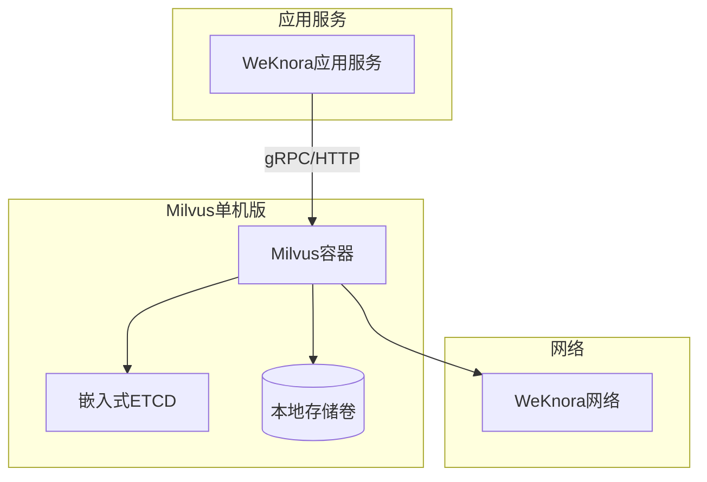
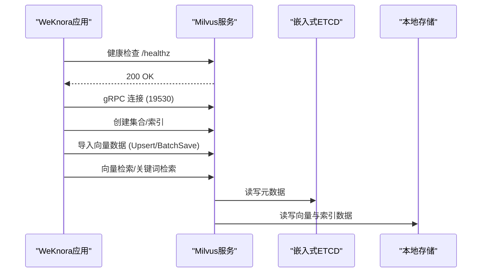
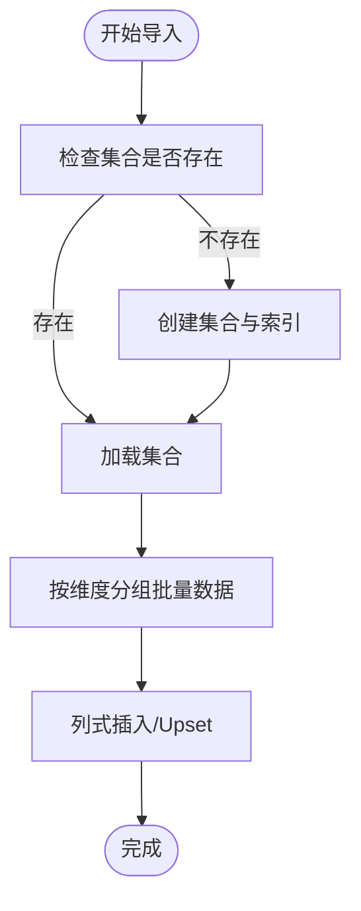
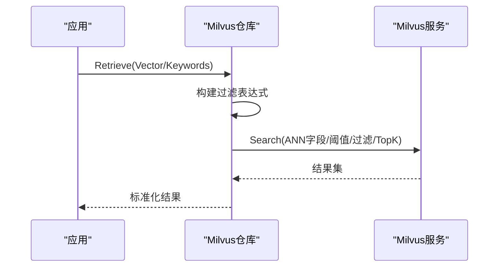
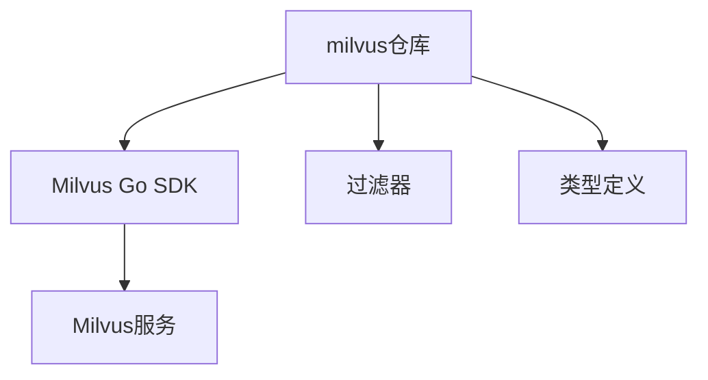

# Milvus向量数据库部署

<cite>
**本文档引用的文件**
- [docker-compose.yml](file://docker-compose.yml)
- [docker-compose.dev.yml](file://docker-compose.dev.yml)
- [repository.go](file://internal/application/repository/retriever/milvus/repository.go)
- [filter.go](file://internal/application/repository/retriever/milvus/filter.go)
- [vectorstore.go](file://internal/types/vectorstore.go)
- [vectorstore_healthcheck.go](file://internal/application/service/vectorstore_healthcheck.go)
</cite>

## 目录
1. [简介](#简介)
2. [项目结构](#项目结构)
3. [核心组件](#核心组件)
4. [架构总览](#架构总览)
5. [详细组件分析](#详细组件分析)
6. [依赖关系分析](#依赖关系分析)
7. [性能考虑](#性能考虑)
8. [故障排除指南](#故障排除指南)
9. [结论](#结论)

## 简介
本文件面向数据工程师与系统架构师，提供WeKnora项目中Milvus向量数据库的完整部署与运维指导。内容涵盖：
- Milvus单机版容器部署与Docker配置
- ETCD嵌入式存储与本地存储配置
- 健康检查机制与启动参数
- gRPC API配置与数据导入流程
- 查询优化策略与性能调优参数
- 分布式集群部署方案与数据分片策略
- 生产环境最佳实践

## 项目结构
WeKnora通过Docker Compose统一编排Milvus单机版服务，并在应用侧以Milvus仓库实现对接向量检索与导入。

**图表来源**
- [docker-compose.yml:314-340](file://docker-compose.yml#L314-L340)
- [docker-compose.dev.yml:76-103](file://docker-compose.dev.yml#L76-L103)

**章节来源**
- [docker-compose.yml:314-340](file://docker-compose.yml#L314-L340)
- [docker-compose.dev.yml:76-103](file://docker-compose.dev.yml#L76-L103)

## 核心组件
- Milvus单机版容器：使用milvusdb/milvus:v2.6.11镜像，以standalone模式运行。
- ETCD嵌入式存储：通过环境变量ETCD_USE_EMBED=true启用，数据目录为/var/lib/milvus/etcd。
- 本地存储：通过卷挂载milvus_data或milvus_data_dev至/var/lib/milvus，确保数据持久化。
- 健康检查：通过curl探测/healthz端点，端口9091。
- gRPC端口：19530，供应用侧SDK连接。

**章节来源**
- [docker-compose.yml:314-340](file://docker-compose.yml#L314-L340)
- [docker-compose.dev.yml:76-103](file://docker-compose.dev.yml#L76-L103)

## 架构总览
下图展示WeKnora应用与Milvus之间的交互路径，包括健康检查、gRPC连接与数据导入/查询流程。

**图表来源**
- [docker-compose.yml:325-330](file://docker-compose.yml#L325-L330)
- [repository.go:268-328](file://internal/application/repository/retriever/milvus/repository.go#L268-L328)
- [repository.go:656-724](file://internal/application/repository/retriever/milvus/repository.go#L656-L724)

## 详细组件分析

### Milvus单机版容器配置
- 镜像与版本：milvusdb/milvus:v2.6.11
- 运行模式：standalone
- 端口映射：19530（gRPC）、9091（健康检查）
- 存储：挂载卷milvus_data或milvus_data_dev至/var/lib/milvus
- ETCD：ETCD_USE_EMBED=true，ETCD_DATA_DIR=/var/lib/milvus/etcd
- 部署模式：DEPLOY_MODE=STANDALONE
- 健康检查：curl -f http://localhost:9091/healthz

**章节来源**
- [docker-compose.yml:314-340](file://docker-compose.yml#L314-L340)
- [docker-compose.dev.yml:76-103](file://docker-compose.dev.yml#L76-L103)

### ETCD嵌入式存储与本地存储
- ETCD嵌入式：通过环境变量ETCD_USE_EMBED启用，无需外部ETCD集群，简化部署。
- ETCD数据目录：/var/lib/milvus/etcd，配合milvus_data卷实现持久化。
- 本地存储：milvus_data卷挂载到/var/lib/milvus，包含向量、索引与日志数据。

**章节来源**
- [docker-compose.yml:320-324](file://docker-compose.yml#L320-L324)
- [docker-compose.yml:334-335](file://docker-compose.yml#L334-L335)

### 健康检查机制
- 健康检查端点：/healthz
- 检查方式：curl -f
- 重试与间隔：retries=3，interval=30s，start_period=90s
- 适用场景：容器编排健康探针，确保Milvus可用性

**章节来源**
- [docker-compose.yml:325-330](file://docker-compose.yml#L325-L330)
- [docker-compose.dev.yml:87-92](file://docker-compose.dev.yml#L87-L92)

### gRPC API配置与连接
- gRPC端口：19530
- 连接地址：MILVUS_ADDRESS（默认localhost:19530）
- 认证：Milvus SDK负责gRPC连接与认证，应用侧通过Milvus仓库实现连接
- 连接测试：服务层提供连接测试逻辑，避免与其它客户端proto命名冲突

**章节来源**
- [docker-compose.yml:100-102](file://docker-compose.yml#L100-L102)
- [vectorstore_healthcheck.go:155-177](file://internal/application/service/vectorstore_healthcheck.go#L155-L177)

### 数据导入流程
- 集合命名：基于IndexConfig.collection_name或环境变量MILVUS_COLLECTION，默认weknora_embeddings
- 维度适配：按embedding维度动态创建集合，集合名格式为“基础名_维度”
- Schema设计：包含主键ID、向量字段、文本字段（含BM25函数）、布尔字段等
- 索引策略：HNSW（向量）、BM25（文本）、自动索引（过滤字段）
- 批量导入：BatchSave按维度聚合，使用列式插入提升吞吐
- Upsert：支持重复插入更新

**图表来源**
- [repository.go:85-208](file://internal/application/repository/retriever/milvus/repository.go#L85-L208)
- [repository.go:268-328](file://internal/application/repository/retriever/milvus/repository.go#L268-L328)

**章节来源**
- [repository.go:44-78](file://internal/application/repository/retriever/milvus/repository.go#L44-L78)
- [repository.go:85-208](file://internal/application/repository/retriever/milvus/repository.go#L85-L208)
- [repository.go:268-328](file://internal/application/repository/retriever/milvus/repository.go#L268-L328)

### 查询优化策略
- 过滤条件：支持and/or/in/not in/between/like等操作符，模板参数化防止注入
- 向量检索：指定ANN字段（向量字段），支持阈值半径（radius）过滤
- 关键词检索：利用BM25函数对content字段进行稀疏向量检索
- 结果限制：TopK与输出字段控制，减少网络传输与解析开销
- 过滤字段：按知识库ID、知识ID、标签ID、启用状态等过滤

**图表来源**
- [repository.go:637-654](file://internal/application/repository/retriever/milvus/repository.go#L637-L654)
- [repository.go:656-724](file://internal/application/repository/retriever/milvus/repository.go#L656-L724)
- [repository.go:726-792](file://internal/application/repository/retriever/milvus/repository.go#L726-L792)
- [filter.go:71-135](file://internal/application/repository/retriever/milvus/filter.go#L71-L135)

**章节来源**
- [repository.go:582-635](file://internal/application/repository/retriever/milvus/repository.go#L582-L635)
- [repository.go:656-724](file://internal/application/repository/retriever/milvus/repository.go#L656-L724)
- [repository.go:726-792](file://internal/application/repository/retriever/milvus/repository.go#L726-L792)
- [filter.go:71-135](file://internal/application/repository/retriever/milvus/filter.go#L71-L135)

### 性能调优参数与存储估算
- 索引参数：HNSW索引参数（距离类型、M、efConstruction等）在仓库中通过Milvus SDK配置
- 集群参数：ShardsNum（写并行度）、ReplicaNumber（读HA内存副本数）来自IndexConfig
- 存储估算：按payload大小、向量维度、索引开销与元数据开销综合计算

**章节来源**
- [repository.go:167-175](file://internal/application/repository/retriever/milvus/repository.go#L167-L175)
- [repository.go:314-322](file://internal/application/repository/retriever/milvus/repository.go#L314-L322)
- [repository.go:911-940](file://internal/application/repository/retriever/milvus/repository.go#L911-L940)

### 集群部署方案与数据分片策略
- 单机版：DEPLOY_MODE=STANDALONE，适合开发与小规模生产
- 集群模式：通过Milvus官方集群镜像与外部ETCD部署，支持水平扩展
- 分片策略：ShardsNum控制写入并行度；ReplicaNumber控制查询节点内存副本数量
- 数据迁移：提供按知识库复制索引能力，支持跨集合批量迁移

**章节来源**
- [docker-compose.yml:324](file://docker-compose.yml#L324)
- [repository.go:314-322](file://internal/application/repository/retriever/milvus/repository.go#L314-L322)
- [repository.go:800-898](file://internal/application/repository/retriever/milvus/repository.go#L800-L898)

## 依赖关系分析
Milvus仓库依赖Milvus Go SDK，通过gRPC与Milvus服务交互；应用通过仓库接口进行数据导入与检索。

**图表来源**
- [repository.go:3-20](file://internal/application/repository/retriever/milvus/repository.go#L3-L20)
- [filter.go:1-10](file://internal/application/repository/retriever/milvus/filter.go#L1-L10)
- [vectorstore.go:1-16](file://internal/types/vectorstore.go#L1-L16)

**章节来源**
- [repository.go:3-20](file://internal/application/repository/retriever/milvus/repository.go#L3-L20)
- [filter.go:1-10](file://internal/application/repository/retriever/milvus/filter.go#L1-L10)
- [vectorstore.go:1-16](file://internal/types/vectorstore.go#L1-L16)

## 性能考虑
- 索引选择：向量检索优先使用HNSW；文本检索使用BM25；过滤字段建立自动索引
- 维度管理：按维度分集合，避免混合维度带来的索引与查询复杂度
- 批量写入：列式插入与批量Upsert提升吞吐
- 过滤优化：合理使用模板参数与表达式，避免全表扫描
- 存储规划：预留ETCD与向量数据的磁盘空间，定期清理与压缩

## 故障排除指南
- 连接失败：检查gRPC端口19530是否可达，确认MILVUS_ADDRESS配置
- 健康检查失败：查看/healthz返回状态，确认容器内服务状态
- 索引异常：检查集合是否存在、索引是否创建成功、维度是否匹配
- 查询无结果：确认过滤条件、阈值设置与TopK配置

**章节来源**
- [vectorstore_healthcheck.go:155-177](file://internal/application/service/vectorstore_healthcheck.go#L155-L177)
- [docker-compose.yml:325-330](file://docker-compose.yml#L325-L330)

## 结论
WeKnora提供了完整的Milvus单机版容器化部署方案，结合ETCD嵌入式存储与本地持久化卷，满足开发与小规模生产的部署需求。通过Milvus仓库实现统一的数据导入与检索接口，配合过滤器与索引策略，能够有效支撑向量相似度检索与关键词检索场景。对于更大规模的生产环境，建议采用Milvus官方集群部署方案，并根据业务负载调整分片与副本参数，持续监控健康状态与性能指标。