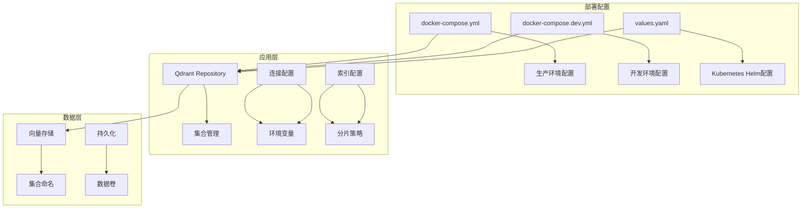
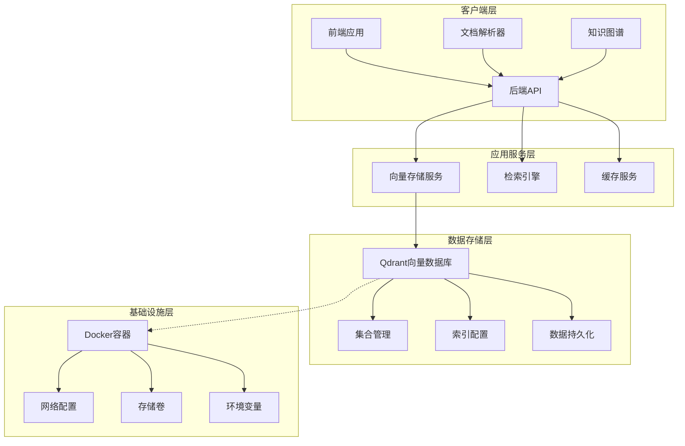
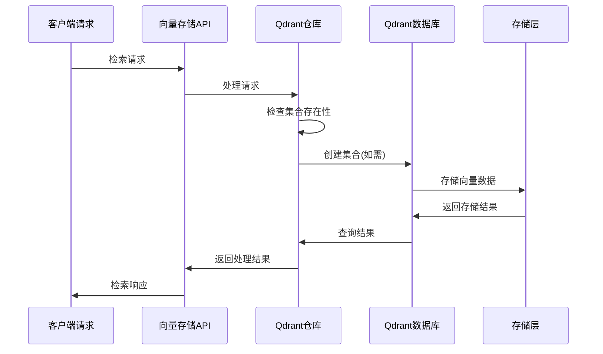
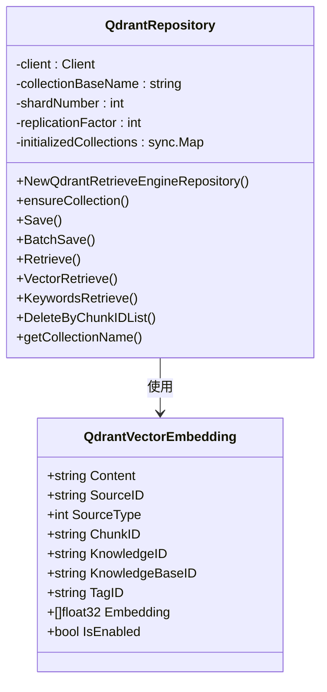
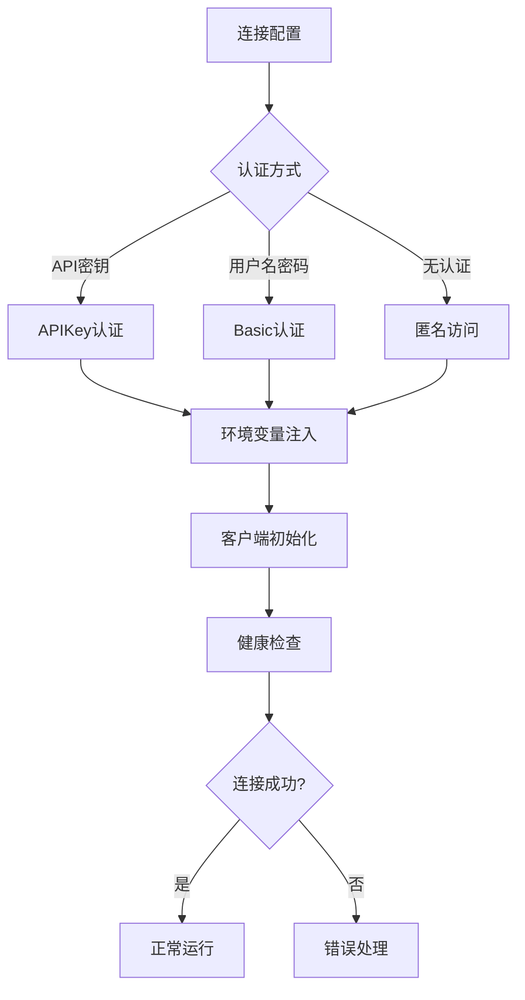
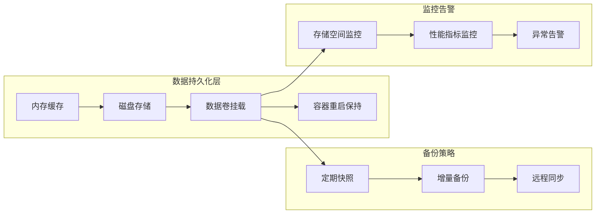
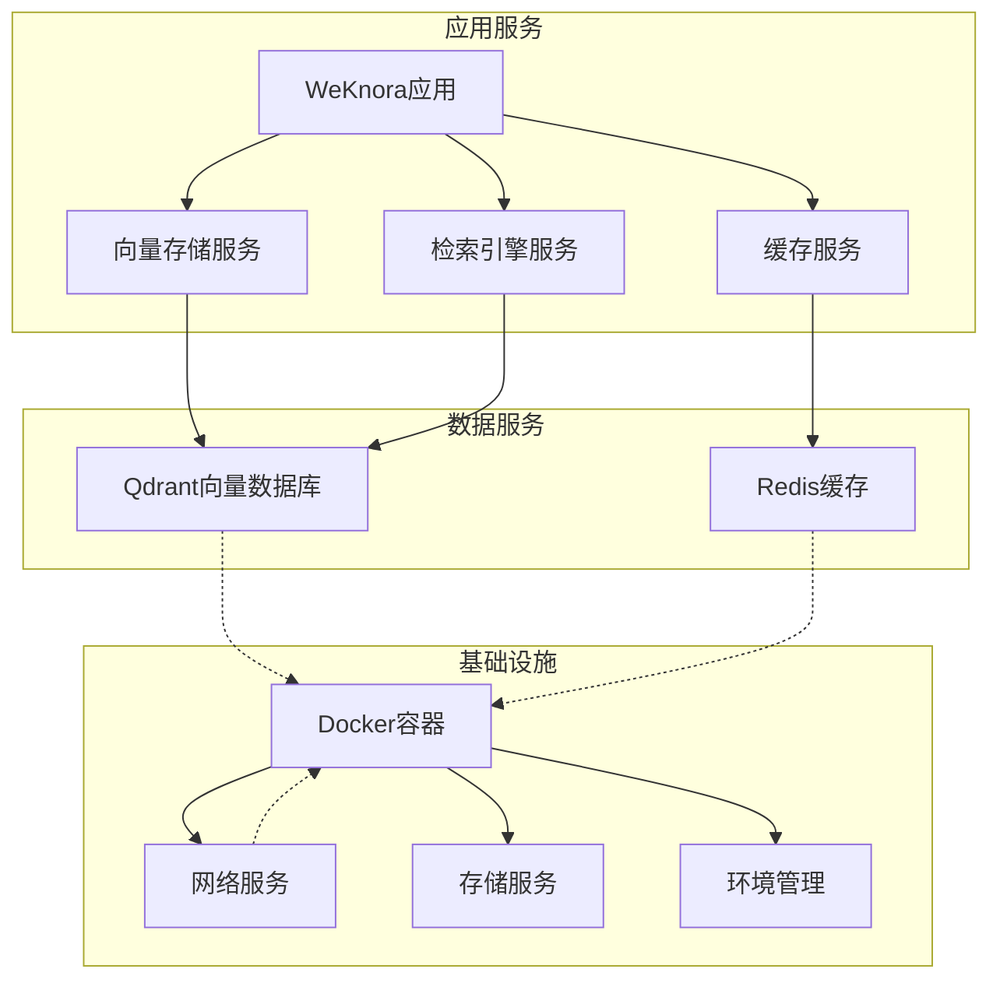
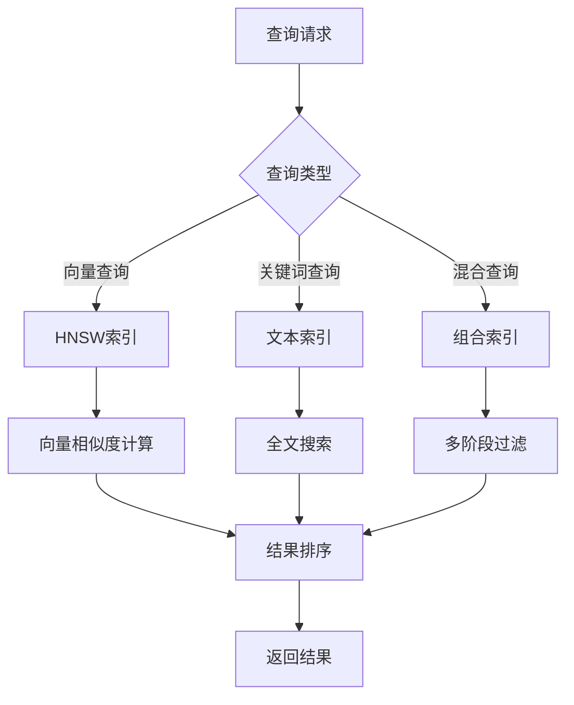
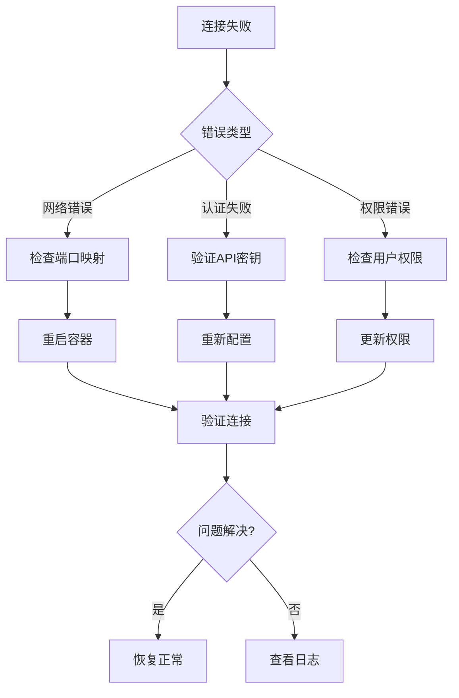

# Qdrant向量数据库部署

<cite>
**本文档引用的文件**
- [docker-compose.yml](file://docker-compose.yml)
- [docker-compose.dev.yml](file://docker-compose.dev.yml)
- [values.yaml](file://helm/values.yaml)
- [repository.go](file://internal/application/repository/retriever/qdrant/repository.go)
- [structs.go](file://internal/application/repository/retriever/qdrant/structs.go)
- [vectorstore.go](file://internal/types/vectorstore.go)
- [vectorstore_healthcheck.go](file://internal/application/service/vectorstore_healthcheck.go)
- [container.go](file://internal/container/container.go)
</cite>

## 目录
1. [简介](#简介)
2. [项目结构](#项目结构)
3. [核心组件](#核心组件)
4. [架构概览](#架构概览)
5. [详细组件分析](#详细组件分析)
6. [依赖关系分析](#依赖关系分析)
7. [性能考虑](#性能考虑)
8. [故障排除指南](#故障排除指南)
9. [结论](#结论)

## 简介

WeKnora项目中的Qdrant向量数据库部署提供了完整的容器化解决方案，支持多种部署模式和配置选项。本文档详细介绍了Qdrant容器的Docker配置、端口映射、数据持久化策略，以及集合创建、索引参数配置和向量维度设置。

Qdrant作为WeKnora的核心向量存储引擎，支持多种检索模式，包括向量相似度搜索和关键词搜索。系统通过智能的集合管理机制，根据嵌入向量的维度动态创建和管理集合，确保不同维度的向量数据得到最优存储和查询性能。

## 项目结构

WeKnora项目采用模块化的架构设计，Qdrant部署配置分布在多个关键位置：

**图表来源**
- [docker-compose.yml:299-312](file://docker-compose.yml#L299-L312)
- [docker-compose.dev.yml:61-74](file://docker-compose.dev.yml#L61-L74)
- [values.yaml:473-484](file://helm/values.yaml#L473-L484)

**章节来源**
- [docker-compose.yml:1-613](file://docker-compose.yml#L1-L613)
- [docker-compose.dev.yml:1-420](file://docker-compose.dev.yml#L1-L420)
- [values.yaml:1-493](file://helm/values.yaml#L1-L493)

## 核心组件

### Qdrant容器配置

Qdrant容器在WeKnora项目中提供了灵活的部署选项，支持单节点和集群模式：

| 组件 | 配置项 | 默认值 | 说明 |
|------|--------|--------|------|
| **容器镜像** | image | qdrant/qdrant:v1.16.2 | 指定Qdrant版本 |
| **容器名称** | container_name | WeKnora-qdrant | 容器标识符 |
| **REST端口** | 6333/tcp | 6333 | HTTP REST API端口 |
| **gRPC端口** | 6334/tcp | 6334 | gRPC API端口 |
| **数据卷** | /qdrant/storage | qdrant_data | 存储持久化目录 |

### 环境变量配置

系统通过环境变量实现灵活的配置管理：

| 环境变量 | 默认值 | 作用域 | 说明 |
|----------|--------|--------|------|
| QDRANT_HOST | localhost | 应用容器 | Qdrant服务器地址 |
| QDRANT_PORT | 6334 | 应用容器 | Qdrant服务端口 |
| QDRANT_COLLECTION | weknora_embeddings | 应用容器 | 默认集合前缀 |
| QDRANT_API_KEY | 空 | 应用容器 | API密钥认证 |
| QDRANT_USE_TLS | false | 应用容器 | 启用TLS加密 |

**章节来源**
- [docker-compose.yml:95-99](file://docker-compose.yml#L95-L99)
- [docker-compose.yml:299-312](file://docker-compose.yml#L299-L312)
- [docker-compose.dev.yml:61-74](file://docker-compose.dev.yml#L61-L74)

## 架构概览

WeKnora的Qdrant部署架构采用了多层设计，确保系统的可扩展性和可靠性：

**图表来源**
- [repository.go:32-49](file://internal/application/repository/retriever/qdrant/repository.go#L32-L49)
- [vectorstore.go:640-649](file://internal/types/vectorstore.go#L640-L649)

### 数据流处理

系统实现了智能的数据流处理机制，支持多种检索模式：

**图表来源**
- [repository.go:56-140](file://internal/application/repository/retriever/qdrant/repository.go#L56-L140)
- [repository.go:539-608](file://internal/application/repository/retriever/qdrant/repository.go#L539-L608)

## 详细组件分析

### Qdrant仓库实现

Qdrant仓库是系统的核心组件，负责管理向量数据的存储和检索：

**图表来源**
- [structs.go:9-34](file://internal/application/repository/retriever/qdrant/structs.go#L9-L34)

#### 集合管理机制

系统实现了智能的集合管理机制，根据嵌入向量的维度动态创建集合：

| 集合命名规则 | 格式 | 示例 | 用途 |
|-------------|------|------|------|
| 基础名称 | weknora_embeddings | 基础集合名 | 所有集合的前缀 |
| 维度后缀 | _{dimension} | weknora_embeddings_768 | 指定维度的集合 |
| 完整名称 | {base}_{dimension} | weknora_embeddings_1536 | 最终集合名 |

#### 索引配置参数

系统支持多种索引配置参数，用于优化查询性能：

| 参数类型 | 参数名 | 默认值 | 说明 |
|----------|--------|--------|------|
| **分片配置** | ShardNumber | 1 | 集合分片数量 |
| **复制配置** | ReplicationFactor | 1 | 数据复制因子 |
| **集合前缀** | CollectionPrefix | weknora_embeddings | 集合基础名称 |
| **距离度量** | Distance | Cosine | 向量相似度计算方法 |

**章节来源**
- [repository.go:32-49](file://internal/application/repository/retriever/qdrant/repository.go#L32-L49)
- [repository.go:51-54](file://internal/application/repository/retriever/qdrant/repository.go#L51-L54)
- [repository.go:77-85](file://internal/application/repository/retriever/qdrant/repository.go#L77-L85)

### 连接配置管理

系统提供了灵活的连接配置管理机制，支持多种认证方式：

**图表来源**
- [vectorstore.go:103-121](file://internal/types/vectorstore.go#L103-L121)
- [vectorstore_healthcheck.go:126-153](file://internal/application/service/vectorstore_healthcheck.go#L126-L153)

#### 环境变量解析

系统通过环境变量实现灵活的配置管理：

| 环境变量 | 用途 | 优先级 |
|----------|------|--------|
| QDRANT_HOST | 服务器地址 | 1 |
| QDRANT_PORT | 服务端口 | 2 |
| QDRANT_API_KEY | API密钥 | 3 |
| QDRANT_USE_TLS | TLS开关 | 4 |
| QDRANT_COLLECTION | 集合名称 | 5 |

**章节来源**
- [vectorstore.go:640-649](file://internal/types/vectorstore.go#L640-L649)
- [container.go:828-846](file://internal/container/container.go#L828-L846)

### 数据持久化策略

系统实现了多层次的数据持久化策略，确保数据的安全性和可靠性：

**图表来源**
- [docker-compose.yml:305-306](file://docker-compose.yml#L305-L306)
- [docker-compose.dev.yml:67-68](file://docker-compose.dev.yml#L67-L68)

#### 存储卷配置

| 卷类型 | 名称 | 路径 | 用途 |
|--------|------|------|------|
| 生产环境 | qdrant_data | /qdrant/storage | 主要数据存储 |
| 开发环境 | qdrant_data_dev | /qdrant/storage | 开发测试数据 |
| 配置卷 | qdrant_config | /qdrant/config | 配置文件存储 |

**章节来源**
- [docker-compose.yml:606-607](file://docker-compose.yml#L606-L607)
- [docker-compose.dev.yml:414](file://docker-compose.dev.yml#L414)

## 依赖关系分析

### 服务依赖关系

WeKnora项目中的Qdrant服务依赖关系体现了清晰的分层架构：

**图表来源**
- [docker-compose.yml:148-157](file://docker-compose.yml#L148-L157)
- [docker-compose.yml:299-312](file://docker-compose.yml#L299-L312)

### 组件耦合度分析

系统通过接口抽象实现了低耦合的设计：

| 组件 | 耦合度 | 说明 | 改进建议 |
|------|--------|------|----------|
| Qdrant仓库 | 低 | 通过接口抽象 | 继续保持接口设计 |
| 连接配置 | 中 | 依赖环境变量 | 增加配置验证 |
| 索引管理 | 低 | 独立的管理逻辑 | 优化配置缓存 |
| 数据持久化 | 低 | 通过卷挂载实现 | 增加备份策略 |

**章节来源**
- [repository.go:32-49](file://internal/application/repository/retriever/qdrant/repository.go#L32-L49)
- [vectorstore.go:103-121](file://internal/types/vectorstore.go#L103-L121)

## 性能考虑

### 存储容量估算

系统提供了智能的存储容量估算机制：

| 组件 | 计算公式 | 说明 |
|------|----------|------|
| Payload大小 | 字段长度之和 | 文本内容和元数据存储 |
| 向量大小 | 维度 × 4字节 | 浮点数向量存储 |
| HNSW索引 | 估算值 | 高级索引结构开销 |
| 总计 | 估算值 | 预估总存储需求 |

### 查询性能优化

系统通过多种机制优化查询性能：

**图表来源**
- [repository.go:539-608](file://internal/application/repository/retriever/qdrant/repository.go#L539-L608)
- [repository.go:610-706](file://internal/application/repository/retriever/qdrant/repository.go#L610-L706)

### 内存管理策略

系统实现了智能的内存管理策略：

| 策略类型 | 实现方式 | 效果 |
|----------|----------|------|
| 集合缓存 | sync.Map缓存 | 减少重复创建 |
| 连接池 | 客户端复用 | 提高连接效率 |
| 批量操作 | 分批处理 | 降低内存峰值 |
| 增量更新 | 条件更新 | 减少不必要的操作 |

**章节来源**
- [repository.go:150-163](file://internal/application/repository/retriever/qdrant/repository.go#L150-L163)
- [repository.go:889-904](file://internal/application/repository/retriever/qdrant/repository.go#L889-L904)

## 故障排除指南

### 常见问题诊断

系统提供了完善的错误处理和诊断机制：

**图表来源**
- [vectorstore_healthcheck.go:126-153](file://internal/application/service/vectorstore_healthcheck.go#L126-L153)

### 连接测试流程

系统实现了自动化的连接测试机制：

| 步骤 | 操作 | 验证 | 备注 |
|------|------|------|------|
| 1 | 初始化客户端 | 配置参数 | 检查环境变量 |
| 2 | 建立连接 | TCP连接 | 验证端口可达 |
| 3 | 认证验证 | API密钥 | 检查权限 |
| 4 | 健康检查 | 服务状态 | 获取版本信息 |
| 5 | 返回结果 | 成功/失败 | 记录错误信息 |

**章节来源**
- [vectorstore_healthcheck.go:126-153](file://internal/application/service/vectorstore_healthcheck.go#L126-L153)

### 日志记录策略

系统实现了全面的日志记录机制：

| 日志级别 | 用途 | 内容示例 |
|----------|------|----------|
| Info | 操作记录 | 集合创建、数据保存 |
| Warn | 警告信息 | 索引创建失败、性能警告 |
| Error | 错误信息 | 连接失败、查询异常 |
| Debug | 调试信息 | 详细执行过程、参数信息 |

## 结论

WeKnora项目的Qdrant向量数据库部署提供了完整、灵活且高性能的解决方案。通过智能的集合管理、灵活的配置选项和完善的监控机制，系统能够满足不同规模和场景的需求。

### 主要优势

1. **容器化部署**：通过Docker Compose和Helm提供标准化的部署方案
2. **智能配置**：支持环境变量驱动的灵活配置管理
3. **性能优化**：多层缓存和索引优化确保查询性能
4. **可靠性保障**：完善的错误处理和监控机制
5. **扩展性设计**：支持水平扩展和集群部署

### 最佳实践建议

1. **生产环境配置**：使用TLS加密和API密钥认证
2. **存储规划**：根据数据量合理规划存储卷大小
3. **监控告警**：建立完善的监控和告警机制
4. **备份策略**：制定定期备份和灾难恢复计划
5. **性能调优**：根据实际负载调整分片和复制参数

通过遵循这些最佳实践，可以确保Qdrant向量数据库在WeKnora项目中发挥最大的价值，为用户提供稳定、高效的服务体验。