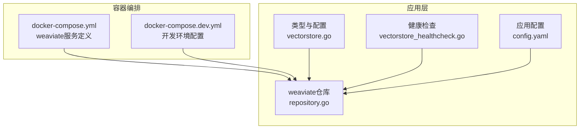
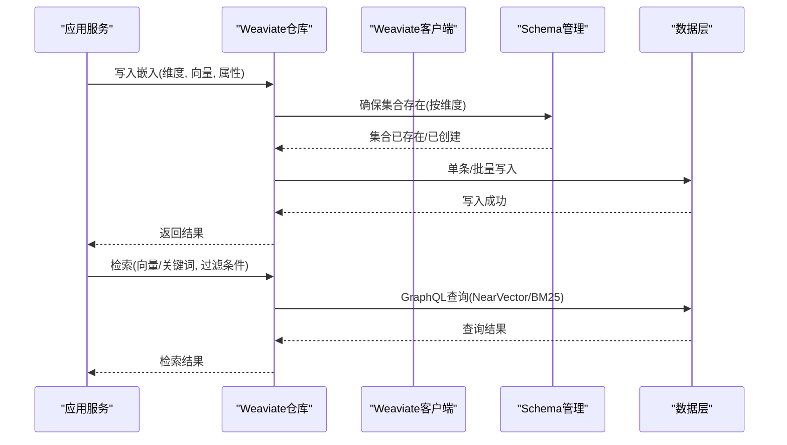
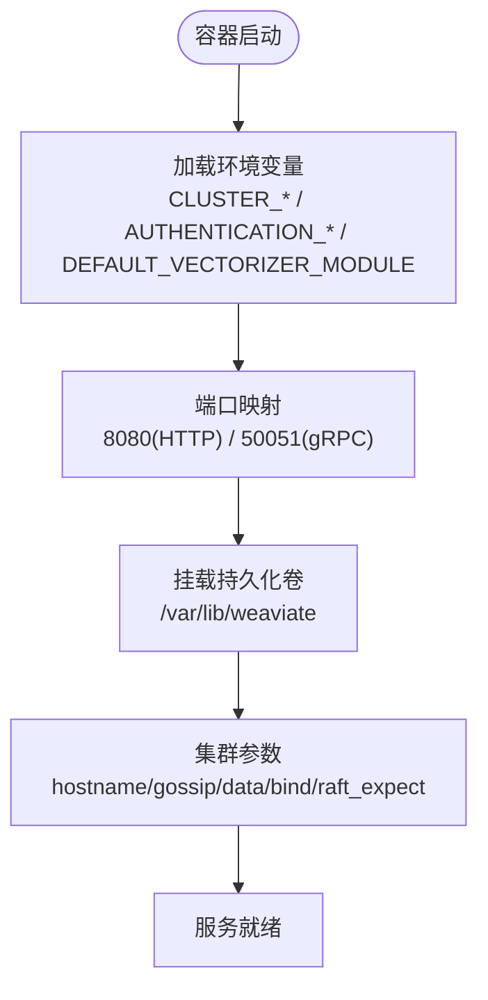
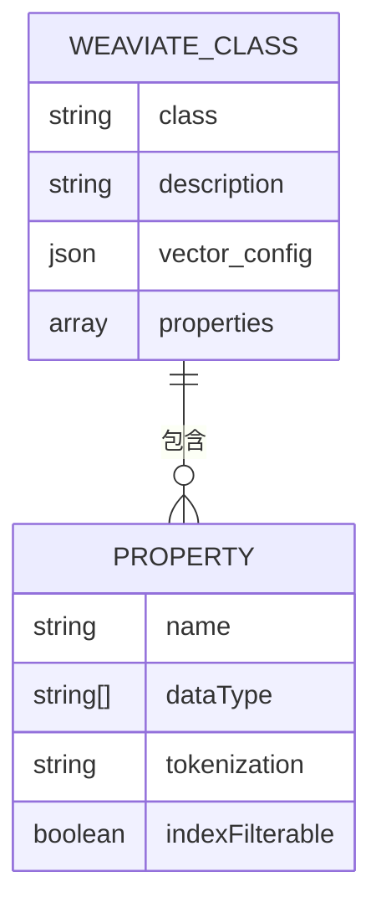
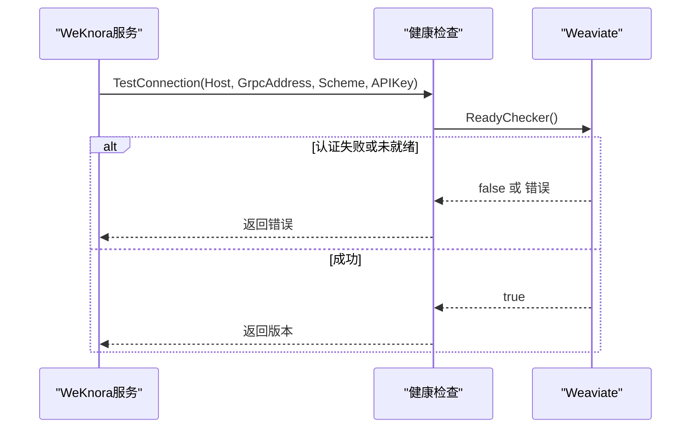
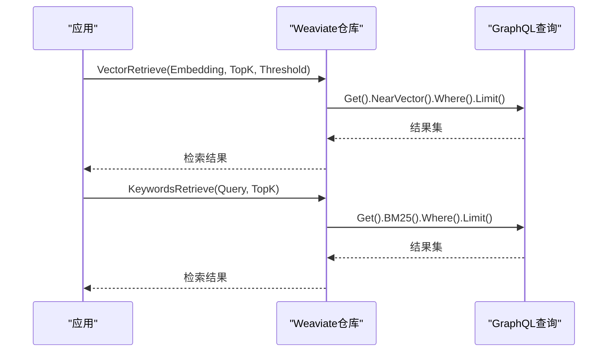
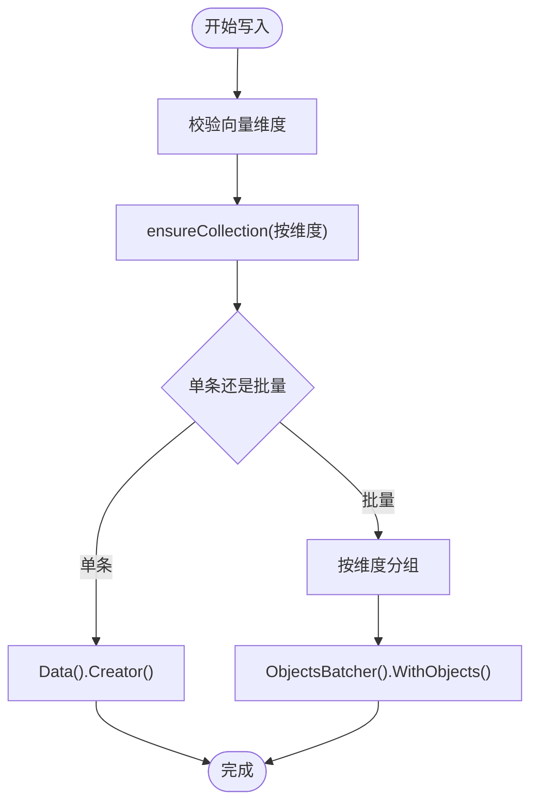
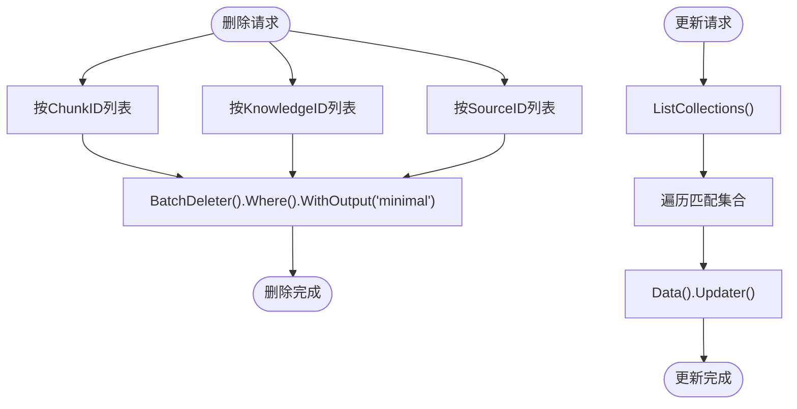
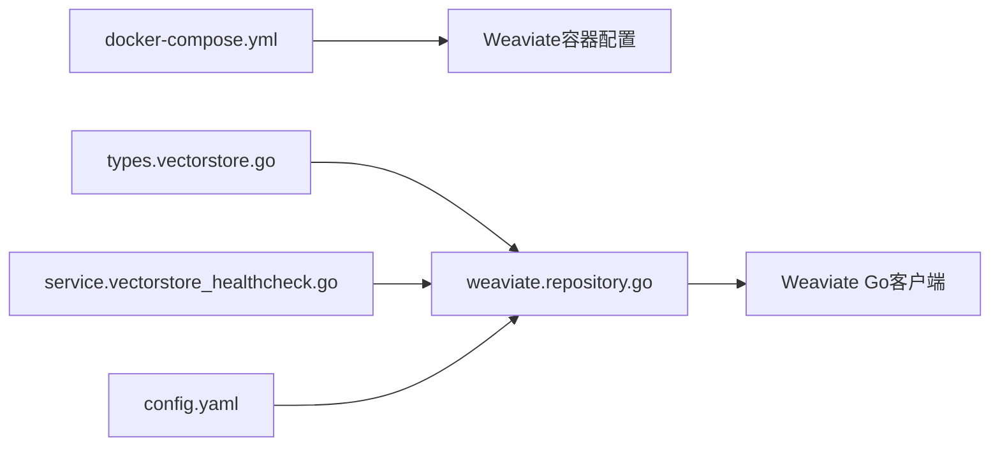

# Weaviate向量数据库部署

<cite>
**本文档引用的文件**
- [docker-compose.yml](file://docker-compose.yml)
- [docker-compose.dev.yml](file://docker-compose.dev.yml)
- [repository.go](file://internal/application/repository/retriever/weaviate/repository.go)
- [structs.go](file://internal/application/repository/retriever/weaviate/structs.go)
- [vectorstore.go](file://internal/types/vectorstore.go)
- [vectorstore_healthcheck.go](file://internal/application/service/vectorstore_healthcheck.go)
- [config.yaml](file://config/config.yaml)
</cite>

## 目录
1. [简介](#简介)
2. [项目结构](#项目结构)
3. [核心组件](#核心组件)
4. [架构总览](#架构总览)
5. [详细组件分析](#详细组件分析)
6. [依赖关系分析](#依赖关系分析)
7. [性能考虑](#性能考虑)
8. [故障排除指南](#故障排除指南)
9. [结论](#结论)

## 简介
本文件为WeKnora项目中Weaviate向量数据库的完整部署与运维指南。内容覆盖Weaviate容器配置、节点发现与集群参数、向量化模块与认证设置、REST/GraphQL接口使用、Schema定义与查询优化、性能监控与内存GC配置，以及高可用部署、扩缩容与备份策略。目标读者包括开发者与运维工程师，帮助快速完成容器化部署并实现生产级稳定运行。

## 项目结构
Weaviate作为WeKnora的可选向量存储之一，通过Docker Compose进行容器编排，并在应用层通过Weaviate Go客户端进行Schema管理与检索操作。关键位置如下：
- Docker Compose服务定义：weaviate容器、端口映射、环境变量与持久化卷
- 应用层Weaviate仓库：负责集合创建、批量写入、删除、更新与检索
- 类型与配置：向量存储类型定义、索引配置、连接参数
- 健康检查：连接测试与版本探测
- 配置文件：应用层检索阈值、TopK等参数

**图表来源**
- [docker-compose.yml:342-364](file://docker-compose.yml#L342-L364)
- [docker-compose.dev.yml:105-125](file://docker-compose.dev.yml#L105-L125)
- [repository.go:1-1065](file://internal/application/repository/retriever/weaviate/repository.go#L1-L1065)
- [vectorstore.go:532-546](file://internal/types/vectorstore.go#L532-L546)
- [vectorstore_healthcheck.go:179-228](file://internal/application/service/vectorstore_healthcheck.go#L179-L228)
- [config.yaml:1-113](file://config/config.yaml#L1-L113)

**章节来源**
- [docker-compose.yml:342-364](file://docker-compose.yml#L342-L364)
- [docker-compose.dev.yml:105-125](file://docker-compose.dev.yml#L105-L125)
- [repository.go:1-1065](file://internal/application/repository/retriever/weaviate/repository.go#L1-L1065)
- [vectorstore.go:532-546](file://internal/types/vectorstore.go#L532-L546)
- [vectorstore_healthcheck.go:179-228](file://internal/application/service/vectorstore_healthcheck.go#L179-L228)
- [config.yaml:1-113](file://config/config.yaml#L1-L113)

## 核心组件
- Weaviate容器服务：镜像版本、端口映射、环境变量与持久化卷
- Weaviate仓库实现：集合命名规则、Schema动态创建、批量写入、过滤删除、关键词与向量检索
- 类型与配置：连接参数（host、grpc地址、scheme、API Key）、索引参数（集合前缀、分片数、复制因子）
- 健康检查：连接测试、就绪检查、版本探测
- 应用配置：检索阈值、TopK等参数

**章节来源**
- [docker-compose.yml:342-364](file://docker-compose.yml#L342-L364)
- [repository.go:40-160](file://internal/application/repository/retriever/weaviate/repository.go#L40-L160)
- [vectorstore.go:532-546](file://internal/types/vectorstore.go#L532-L546)
- [vectorstore_healthcheck.go:179-228](file://internal/application/service/vectorstore_healthcheck.go#L179-L228)
- [config.yaml:11-24](file://config/config.yaml#L11-L24)

## 架构总览
Weaviate在WeKnora中的角色是向量存储与检索引擎。应用通过Weaviate Go客户端与之交互，仓库层负责：
- Schema管理：按维度动态创建集合
- 写入：单条与批量写入，支持向量与属性
- 删除：按ChunkID/KnowledgeID/SourceID批量删除
- 更新：启用状态与标签ID批量更新
- 检索：向量相似度与BM25关键词检索

**图表来源**
- [repository.go:185-286](file://internal/application/repository/retriever/weaviate/repository.go#L185-L286)
- [repository.go:540-674](file://internal/application/repository/retriever/weaviate/repository.go#L540-L674)

**章节来源**
- [repository.go:185-286](file://internal/application/repository/retriever/weaviate/repository.go#L185-L286)
- [repository.go:540-674](file://internal/application/repository/retriever/weaviate/repository.go#L540-L674)

## 详细组件分析

### Weaviate容器配置与集群
- 镜像与版本：semitechnologies/weaviate:1.28.4
- 端口映射：HTTP 8080（宿主:9035），gRPC 50051（宿主:50052）
- 持久化：/var/lib/weaviate，映射到weaviate_data卷
- 集群参数：
  - CLUSTER_HOSTNAME=node1
  - CLUSTER_GOSSIP_BIND_PORT=7000
  - CLUSTER_DATA_BIND_PORT=7001
  - RAFT_BOOTSTRAP_EXPECT=1（单节点引导）
- 认证：AUTHENTICATION_ANONYMOUS_ACCESS_ENABLED=true（开发/演示环境）
- 向量化：DEFAULT_VECTORIZER_MODULE=none，ENABLE_MODULES=none（使用应用侧向量）

**图表来源**
- [docker-compose.yml:342-364](file://docker-compose.yml#L342-L364)

**章节来源**
- [docker-compose.yml:342-364](file://docker-compose.yml#L342-L364)

### 向量化模块与Schema定义
- 向量化模块：DEFAULT_VECTORIZER_MODULE=none，ENABLE_MODULES=none，表示由应用侧提供向量
- 集合命名：基于collection_prefix与维度拼接（如"Weknora_embeddings_768"）
- Schema字段：
  - content: text（分词器gse）
  - source_id/source_type/chunk_id/knowledge_id/knowledge_base_id/tag_id/is_enabled: text/int/boolean
  - embedding: 向量字段，HNSW索引，距离度量cosine
- 分片与复制：
  - desiredCount（分片数）与Factor（复制因子）可通过索引配置传入
  - 默认使用服务器端默认值

**图表来源**
- [repository.go:80-150](file://internal/application/repository/retriever/weaviate/repository.go#L80-L150)

**章节来源**
- [repository.go:80-150](file://internal/application/repository/retriever/weaviate/repository.go#L80-L150)
- [vectorstore.go:540-544](file://internal/types/vectorstore.go#L540-L544)

### 认证与安全
- 匿名访问：AUTHENTICATION_ANONYMOUS_ACCESS_ENABLED=true（开发环境）
- API Key：WEAVIATE_API_KEY（通过应用层连接配置传递）
- 连接测试：健康检查支持API Key认证与就绪检查

**图表来源**
- [vectorstore_healthcheck.go:179-228](file://internal/application/service/vectorstore_healthcheck.go#L179-L228)

**章节来源**
- [docker-compose.yml:350](file://docker-compose.yml#L350)
- [vectorstore_healthcheck.go:179-228](file://internal/application/service/vectorstore_healthcheck.go#L179-L228)
- [vectorstore.go:666-671](file://internal/types/vectorstore.go#L666-L671)

### REST API与GraphQL接口
- REST：通过Weaviate Go客户端HTTP接口访问（如/v1/meta、/v1/ready）
- GraphQL：仓库层使用Get/BM25/NearVector查询，支持where过滤、limit与_fields
- 关键查询路径：
  - 向量检索：NearVector + where过滤 + limit
  - 关键词检索：BM25(content) + where过滤 + limit
  - 删除/更新：批量删除器与更新器

**图表来源**
- [repository.go:540-674](file://internal/application/repository/retriever/weaviate/repository.go#L540-L674)

**章节来源**
- [repository.go:540-674](file://internal/application/repository/retriever/weaviate/repository.go#L540-L674)

### 数据写入与批量操作
- 单条写入：指定ID、属性与向量
- 批量写入：按维度聚合，使用ObjectsBatcher批量提交
- 存储估算：按payload、向量大小、HNSW索引与ID追踪元数据估算

**图表来源**
- [repository.go:185-286](file://internal/application/repository/retriever/weaviate/repository.go#L185-L286)
- [repository.go:968-998](file://internal/application/repository/retriever/weaviate/repository.go#L968-L998)

**章节来源**
- [repository.go:185-286](file://internal/application/repository/retriever/weaviate/repository.go#L185-L286)
- [repository.go:968-998](file://internal/application/repository/retriever/weaviate/repository.go#L968-L998)

### 删除与更新
- 按ChunkID/KnowledgeID/SourceID批量删除
- 批量更新启用状态与标签ID（遍历所有匹配集合）

**图表来源**
- [repository.go:288-376](file://internal/application/repository/retriever/weaviate/repository.go#L288-L376)
- [repository.go:378-474](file://internal/application/repository/retriever/weaviate/repository.go#L378-L474)

**章节来源**
- [repository.go:288-376](file://internal/application/repository/retriever/weaviate/repository.go#L288-L376)
- [repository.go:378-474](file://internal/application/repository/retriever/weaviate/repository.go#L378-L474)

### 查询优化与过滤
- 基础过滤：is_enabled=true，支持knowledge_base_id/knowledge_id/tag_id等过滤
- 向量检索：NearVector + certainty阈值（与应用配置threshold对应）
- 关键词检索：BM25(content)，支持topK限制
- 字段选择：根据匹配类型选择embedding或keywords字段

**章节来源**
- [repository.go:477-519](file://internal/application/repository/retriever/weaviate/repository.go#L477-L519)
- [repository.go:540-674](file://internal/application/repository/retriever/weaviate/repository.go#L540-L674)

## 依赖关系分析
Weaviate相关组件之间的依赖关系如下：

**图表来源**
- [docker-compose.yml:342-364](file://docker-compose.yml#L342-L364)
- [vectorstore.go:532-546](file://internal/types/vectorstore.go#L532-L546)
- [repository.go:1-1065](file://internal/application/repository/retriever/weaviate/repository.go#L1-L1065)
- [vectorstore_healthcheck.go:179-228](file://internal/application/service/vectorstore_healthcheck.go#L179-L228)
- [config.yaml:11-24](file://config/config.yaml#L11-L24)

**章节来源**
- [docker-compose.yml:342-364](file://docker-compose.yml#L342-L364)
- [vectorstore.go:532-546](file://internal/types/vectorstore.go#L532-L546)
- [repository.go:1-1065](file://internal/application/repository/retriever/weaviate/repository.go#L1-L1065)
- [vectorstore_healthcheck.go:179-228](file://internal/application/service/vectorstore_healthcheck.go#L179-L228)
- [config.yaml:11-24](file://config/config.yaml#L11-L24)

## 性能考虑
- 索引参数
  - 分片数（desiredCount）：影响写入并行度与查询分布
  - 复制因子（Factor）：提升读取HA与吞吐
  - HNSW参数：efConstruction、maxConnections、ef等在Schema中配置
- 存储估算
  - payload大小 + 向量大小（维度×4字节）+ HNSW索引链接开销 + ID追踪元数据
- 查询阈值
  - 向量检索使用certainty阈值（与应用配置threshold对应）
  - 关键词检索使用BM25，限制topK
- 连接与认证
  - 建议生产关闭匿名访问，启用API Key
  - 使用健康检查确保服务就绪与版本兼容

**章节来源**
- [repository.go:80-150](file://internal/application/repository/retriever/weaviate/repository.go#L80-L150)
- [repository.go:968-998](file://internal/application/repository/retriever/weaviate/repository.go#L968-L998)
- [repository.go:540-674](file://internal/application/repository/retriever/weaviate/repository.go#L540-L674)
- [docker-compose.yml:350](file://docker-compose.yml#L350)

## 故障排除指南
- 连接失败
  - 检查容器端口映射与网络连通性
  - 确认HOST/GRPC_ADDRESS/Scheme/APIKey配置正确
  - 使用健康检查接口验证就绪状态与版本
- 权限问题
  - 开发环境匿名访问开启，生产建议关闭并配置API Key
- 集合不存在
  - 确认集合按维度自动创建逻辑是否执行
  - 检查collection_prefix与维度拼接规则
- 查询异常
  - 核对where过滤条件与字段类型
  - 调整threshold与topK参数

**章节来源**
- [vectorstore_healthcheck.go:179-228](file://internal/application/service/vectorstore_healthcheck.go#L179-L228)
- [repository.go:540-674](file://internal/application/repository/retriever/weaviate/repository.go#L540-L674)
- [docker-compose.yml:350](file://docker-compose.yml#L350)

## 结论
WeKnora通过Docker Compose快速部署Weaviate，并在应用层以Go客户端实现Schema管理与检索。生产环境中建议关闭匿名访问、启用API Key、合理配置分片与复制因子，并结合健康检查与阈值参数保障稳定性与性能。对于高可用与扩缩容，可在Weaviate集群层面扩展节点与调整Raft期望值，在应用层通过索引配置控制分片与复制因子以满足读写需求。