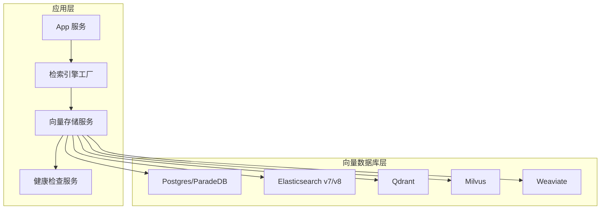
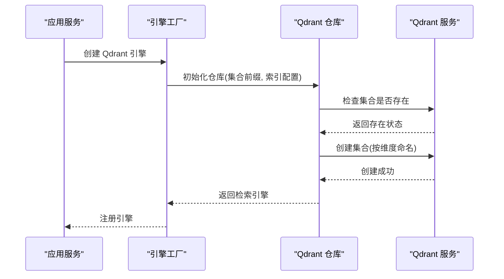
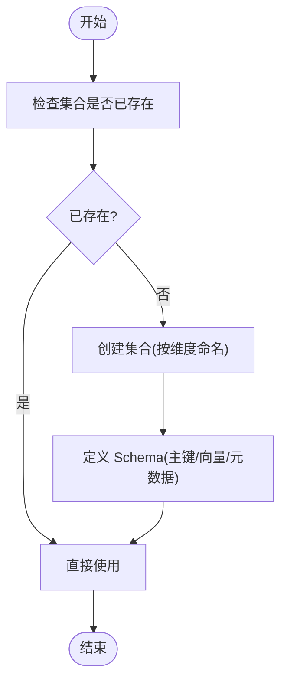
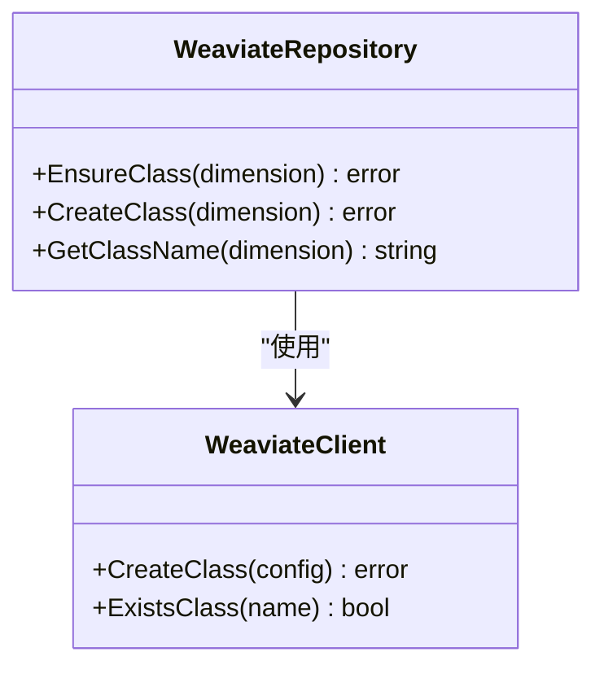
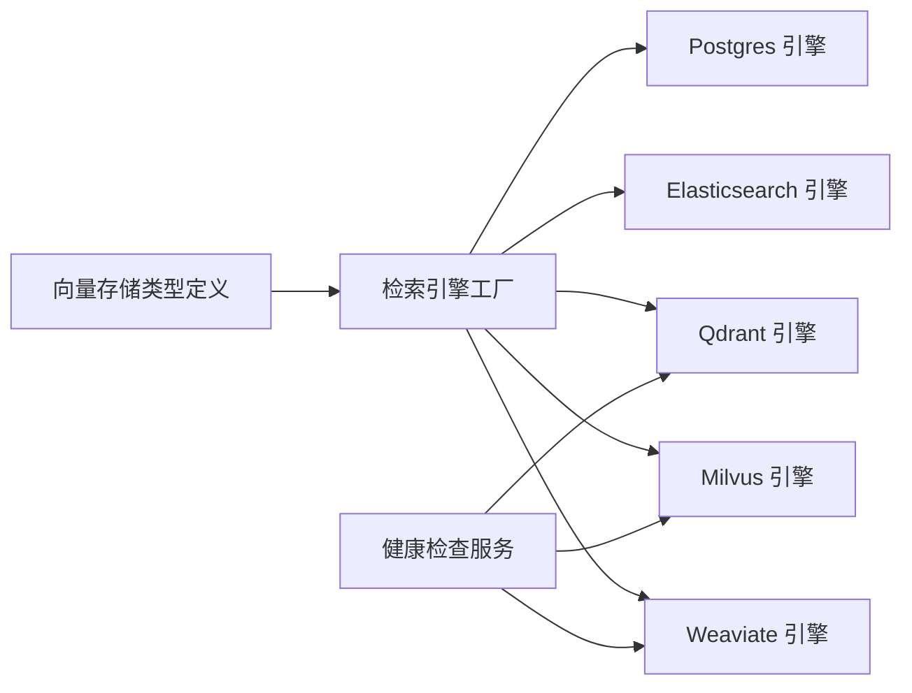

# 向量数据库服务部署

<cite>
**本文档引用的文件**
- [docker-compose.yml](file://docker-compose.yml)
- [docker-compose.dev.yml](file://docker-compose.dev.yml)
- [values.yaml](file://helm/values.yaml)
- [vectorstore.go](file://internal/types/vectorstore.go)
- [vectorstore_healthcheck.go](file://internal/application/service/vectorstore_healthcheck.go)
- [engine_factory.go](file://internal/containe/engine_factory.go)
- [container.go](file://internal/container/container.go)
- [repository.go (Qdrant)](file://internal/application/repository/retriever/qdrant/repository.go)
- [repository.go (Milvus)](file://internal/application/repository/retriever/milvus/repository.go)
- [repository.go (Weaviate)](file://internal/application/repository/retriever/weaviate/repository.go)
- [structs.go (Elasticsearch)](file://internal/application/repository/retriever/elasticsearch/structs.go)
- [structs.go (Postgres)](file://internal/application/repository/retriever/postgres/structs.go)
- [使用其他向量数据库.md](file://docs/使用其他向量数据库.md)
</cite>

## 目录
1. [简介](#简介)
2. [项目结构](#项目结构)
3. [核心组件](#核心组件)
4. [架构总览](#架构总览)
5. [详细组件分析](#详细组件分析)
6. [依赖关系分析](#依赖关系分析)
7. [性能考虑](#性能考虑)
8. [故障排除指南](#故障排除指南)
9. [结论](#结论)
10. [附录](#附录)

## 简介
本文件为 WeKnora 向量数据库服务集群的 Docker 部署指南，覆盖 Qdrant、Milvus、Weaviate 等向量数据库的容器化部署、初始化配置、集合/索引创建、数据导入机制、查询优化与性能调优、集群与分片策略、监控与容量规划等内容。目标读者包括数据科学家与系统工程师，帮助快速搭建稳定、可扩展的向量检索基础设施。

## 项目结构
WeKnora 通过 Docker Compose 提供一体化部署，包含应用服务、前端、文档解析、数据库、缓存、对象存储、分布式追踪以及多种向量数据库实例。开发与生产环境分别提供独立的编排文件，便于按需启用特定组件。

```mermaid
graph TB
subgraph "容器编排"
A[docker-compose.yml]
B[docker-compose.dev.yml]
C[values.yaml(Helm)]
end
subgraph "应用与前端"
D[app 服务]
E[frontend 服务]
F[docreader 服务]
end
subgraph "基础设施"
G[postgres/paradedb]
H[redis]
I[minio]
J[jaeger]
K[neo4j]
end
subgraph "向量数据库"
L[qdrant]
M[milvus]
N[weaviate]
end
A --> D
A --> E
A --> F
A --> G
A --> H
A --> I
A --> J
A --> K
A --> L
A --> M
A --> N
B --> D
B --> E
B --> F
B --> G
B --> H
B --> I
B --> J
B --> K
B --> L
B --> M
B --> N
C --> D
C --> E
C --> G
C --> H
C --> I
```

图表来源
- [docker-compose.yml](file://docker-compose.yml)
- [docker-compose.dev.yml](file://docker-compose.dev.yml)
- [values.yaml](file://helm/values.yaml)

章节来源
- [docker-compose.yml](file://docker-compose.yml)
- [docker-compose.dev.yml](file://docker-compose.dev.yml)
- [values.yaml](file://helm/values.yaml)

## 核心组件
- 应用服务(app): 提供 API、检索路由、向量索引管理与健康检查，内置对 PostgreSQL、Elasticsearch、Qdrant、Milvus、Weaviate 的支持。
- 前端服务(frontend): Nginx + 静态页面，代理至后端服务。
- 文档解析(docreader): gRPC 服务，负责文档内容提取与预处理。
- 数据库(Postgres/ParadeDB): 存储结构化元数据与向量嵌入，支持混合检索与全文检索。
- 缓存(Redis): 流程队列与流式任务管理。
- 对象存储(MinIO): 文件与附件存储。
- 分布式追踪(Jaeger): OpenTelemetry/OTLP 接收与可视化。
- 向量数据库(Qdrant、Milvus、Weaviate): 高性能向量检索与相似度搜索。

章节来源
- [docker-compose.yml](file://docker-compose.yml)
- [docker-compose.dev.yml](file://docker-compose.dev.yml)

## 架构总览
WeKnora 将向量检索能力抽象为统一的检索引擎接口，通过环境变量或数据库配置动态注册不同向量数据库实例。应用启动时根据 RETRIEVE_DRIVER 选择启用的引擎，并在运行时进行连接测试与版本检测，确保 SDK 适配正确。



图表来源
- [engine_factory.go](file://internal/containe/engine_factory.go)
- [vectorstore_healthcheck.go](file://internal/application/service/vectorstore_healthcheck.go)
- [vectorstore.go](file://internal/types/vectorstore.go)

## 详细组件分析

### Qdrant 部署与索引管理
- 容器配置: 提供 REST 与 gRPC 端口映射，默认数据卷挂载，支持 TLS 与 API Key 认证。
- 初始化与连接: 应用通过环境变量读取主机、端口、API Key、TLS 开关，创建客户端并注册检索引擎。
- 集合创建: 首次写入时按维度动态创建集合，集合命名规则为“前缀_维度”。
- 索引参数: 支持分片数、副本因子等配置，命名规范严格限制字符集与长度。
- 存储估算: 基于向量维度、payload 字段大小、HNSW 图链接与 ID 跟踪元数据估算总存储。



图表来源
- [engine_factory.go](file://internal/containe/engine_factory.go)
- [container.go](file://internal/container/container.go)
- [repository.go (Qdrant)](file://internal/application/repository/retriever/qdrant/repository.go)

章节来源
- [docker-compose.yml](file://docker-compose.yml)
- [container.go](file://internal/container/container.go)
- [repository.go (Qdrant)](file://internal/application/repository/retriever/qdrant/repository.go)
- [vectorstore.go](file://internal/types/vectorstore.go)

### Milvus 部署与索引管理
- 容器配置: 以单节点模式运行，内置 etcd，提供 gRPC 端口与健康检查。
- 初始化与连接: 通过地址、用户名、密码建立连接，创建检索引擎。
- 集合创建: 依据维度动态生成集合名“基础名_维度”，Schema 包含主键、向量字段与元数据字段。
- 索引参数: 支持分片数与内存副本数配置，副本数控制查询节点内存副本数量。
- 存储估算: 向量大小、IVF_FLAT 索引开销与元数据开销之和估算总存储。



图表来源
- [repository.go (Milvus)](file://internal/application/repository/retriever/milvus/repository.go)
- [engine_factory.go](file://internal/containe/engine_factory.go)

章节来源
- [docker-compose.yml](file://docker-compose.yml)
- [repository.go (Milvus)](file://internal/application/repository/retriever/milvus/repository.go)
- [engine_factory.go](file://internal/containe/engine_factory.go)

### Weaviate 部署与索引管理
- 容器配置: 默认模块关闭，匿名访问启用，支持 gRPC 地址与认证。
- 初始化与连接: 通过主机、gRPC 地址、协议与 API Key 创建客户端。
- 类创建: 首次写入时按维度创建类(Class)，配置 HNSW 索引参数(efConstruction、maxConnections、ef、距离度量)。
- 索引参数: 支持期望分片数与复制因子配置，属性包含文本内容、来源信息与过滤字段。



图表来源
- [repository.go (Weaviate)](file://internal/application/repository/retriever/weaviate/repository.go)
- [engine_factory.go](file://internal/containe/engine_factory.go)

章节来源
- [docker-compose.yml](file://docker-compose.yml)
- [repository.go (Weaviate)](file://internal/application/repository/retriever/weaviate/repository.go)
- [engine_factory.go](file://internal/containe/engine_factory.go)

### PostgreSQL/ParadeDB 集成
- 角色定位: 作为默认向量存储，无需额外连接配置，直接使用应用数据库连接。
- 表结构: embeddings 表存储向量、内容与元数据，支持分数字段用于检索结果排序。
- 检索流程: 将索引信息转换为数据库模型，执行向量相似度检索与过滤。

章节来源
- [docker-compose.yml](file://docker-compose.yml)
- [structs.go (Postgres)](file://internal/application/repository/retriever/postgres/structs.go)

### Elasticsearch 集成
- 版本检测: 通过连接测试自动识别 v7 或 v8，选择对应 SDK。
- 文档模型: 将索引信息转换为文档结构，包含向量字段与过滤属性。
- 检索流程: 基于向量字段执行相似度搜索，结合过滤条件与推荐标记。

章节来源
- [engine_factory.go](file://internal/containe/engine_factory.go)
- [structs.go (Elasticsearch)](file://internal/application/repository/retriever/elasticsearch/structs.go)

## 依赖关系分析
WeKnora 通过统一的向量存储类型定义与检索引擎工厂，将不同向量数据库抽象为可插拔组件。应用启动时根据环境变量或数据库配置动态注册引擎，并在运行时进行连接测试与版本检测。



图表来源
- [vectorstore.go](file://internal/types/vectorstore.go)
- [engine_factory.go](file://internal/containe/engine_factory.go)
- [vectorstore_healthcheck.go](file://internal/application/service/vectorstore_healthcheck.go)

章节来源
- [vectorstore.go](file://internal/types/vectorstore.go)
- [engine_factory.go](file://internal/containe/engine_factory.go)
- [vectorstore_healthcheck.go](file://internal/application/service/vectorstore_healthcheck.go)

## 性能考虑
- 索引参数调优
  - Qdrant: HNSW 的 efConstruction、maxConnections、ef 与 M 参数影响构建与查询性能；分片数与副本因子决定横向扩展与高可用。
  - Milvus: IVF_FLAT 的 nlist 影响倒排表规模与查询延迟；shards_num 提升写入并行度；replica_number 控制查询节点内存副本数量。
  - Weaviate: HNSW 的 efConstruction、maxConnections、ef 与距离度量；desired_shard_count 与 replication_factor。
- 查询优化
  - 启用过滤条件与推荐标记，减少无效扫描范围。
  - 合理设置 Top-K 与阈值，平衡召回率与响应时间。
  - 对高频查询开启缓存与连接池复用。
- 存储与容量规划
  - 基于向量维度、payload 字段与索引结构估算总存储；预留 20%-30% 空间用于索引增长。
  - 分片与副本策略应与硬件资源匹配，避免过度分片导致元数据开销过大。
- 集群与分片
  - Qdrant: 通过 shard_number 与 replication_factor 实现水平扩展与高可用。
  - Milvus: 通过 shards_num 与 replica_number 实现写入并行与读取高可用。
  - Weaviate: 通过 desired_shard_count 与 replication_factor 实现分片与副本。

## 故障排除指南
- 连接失败
  - 检查容器网络与端口映射，确认服务健康状态。
  - 验证环境变量配置(主机、端口、用户名、密码、API Key、TLS)。
- 版本不匹配
  - Elasticsearch: 通过健康检查自动识别版本，确保 SDK 与服务器版本兼容。
  - Qdrant/Milvus/Weaviate: 确认客户端与服务端版本兼容性。
- 索引创建失败
  - 检查集合/类名命名规则与字符集限制。
  - 确认维度一致性，避免跨维度写入。
- 存储不足
  - 监控数据卷使用情况，及时扩容或清理历史数据。
  - 调整索引参数与分片策略，降低索引开销。

章节来源
- [docker-compose.yml](file://docker-compose.yml)
- [docker-compose.dev.yml](file://docker-compose.dev.yml)
- [vectorstore_healthcheck.go](file://internal/application/service/vectorstore_healthcheck.go)

## 结论
WeKnora 提供了统一的向量数据库抽象与容器化部署方案，支持 Qdrant、Milvus、Weaviate 等主流向量数据库。通过环境变量与数据库配置双通道注册引擎、自动版本检测与健康检查，能够快速搭建高性能、可扩展的向量检索系统。结合合理的索引参数调优、查询优化与容量规划，可在生产环境中获得稳定的检索性能与可靠性。

## 附录

### Docker 部署要点
- 生产环境: 使用 docker-compose.yml，按需启用 minio、neo4j、jaeger 等可选组件。
- 开发环境: 使用 docker-compose.dev.yml，仅启动基础设施服务，应用与前端在本地运行。
- Helm 部署: 通过 values.yaml 配置资源、存储与安全上下文，按需启用各组件。

章节来源
- [docker-compose.yml](file://docker-compose.yml)
- [docker-compose.dev.yml](file://docker-compose.dev.yml)
- [values.yaml](file://helm/values.yaml)

### 向量数据库集成指南
- 接口实现: 实现检索引擎、存储层与服务层接口，遵循现有实现模式。
- 环境变量: 在 RETRIEVE_DRIVER 中添加新数据库驱动名称，并提供相应连接参数。
- 引擎注册: 在初始化函数中创建客户端与仓库，注册到检索引擎注册表。

章节来源
- [使用其他向量数据库.md](file://docs/使用其他向量数据库.md)