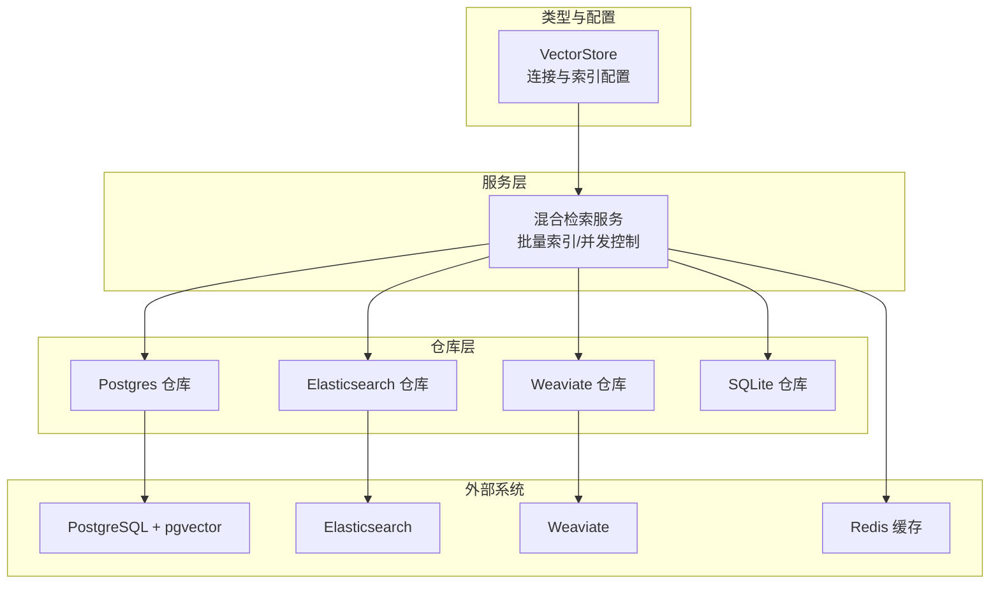
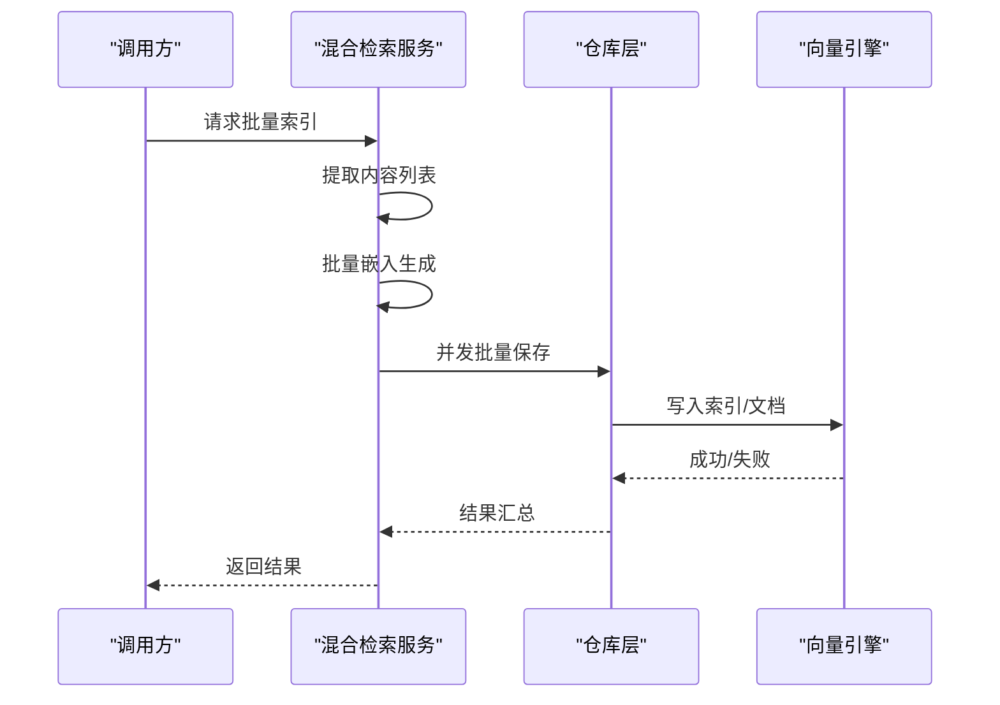
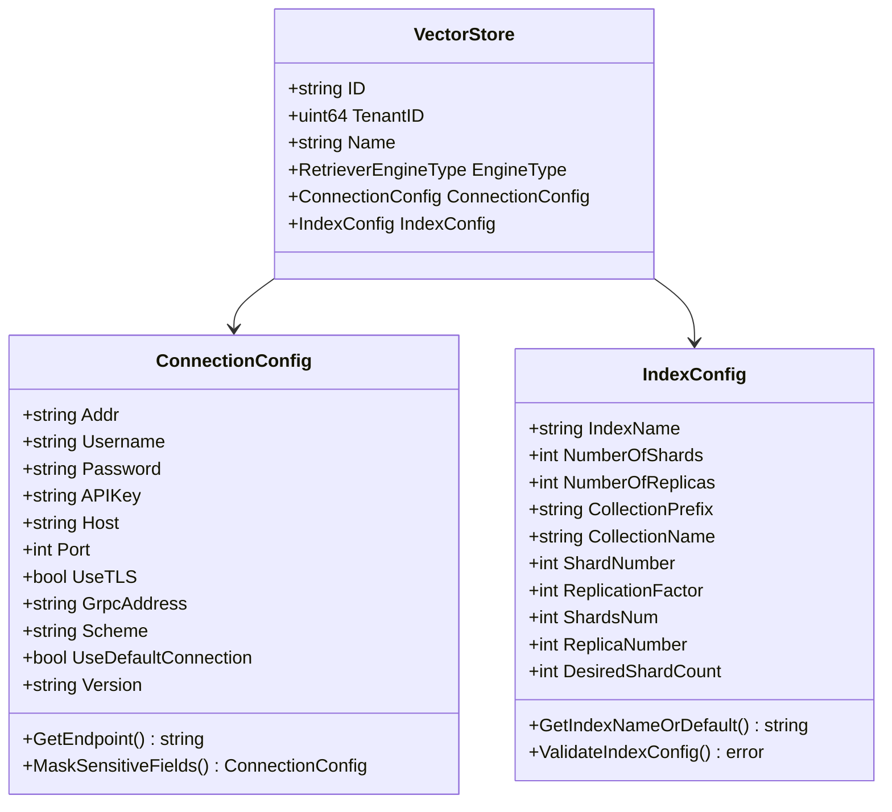
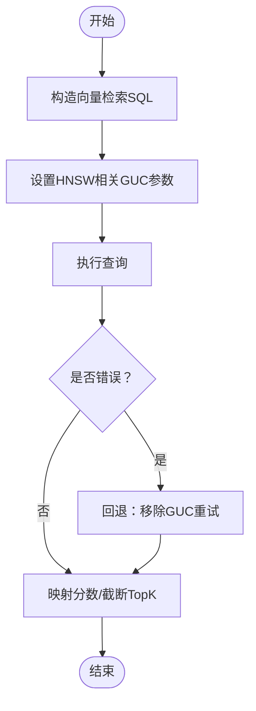
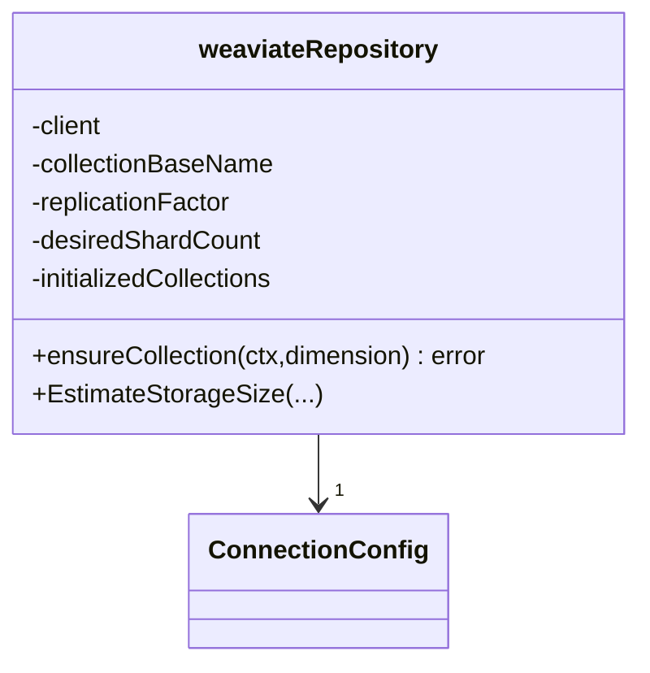
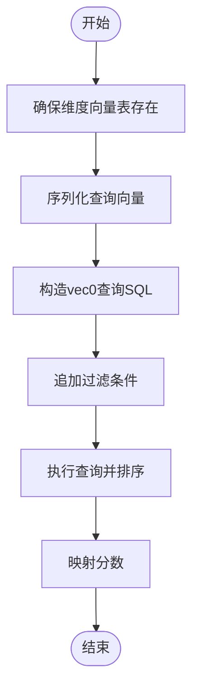
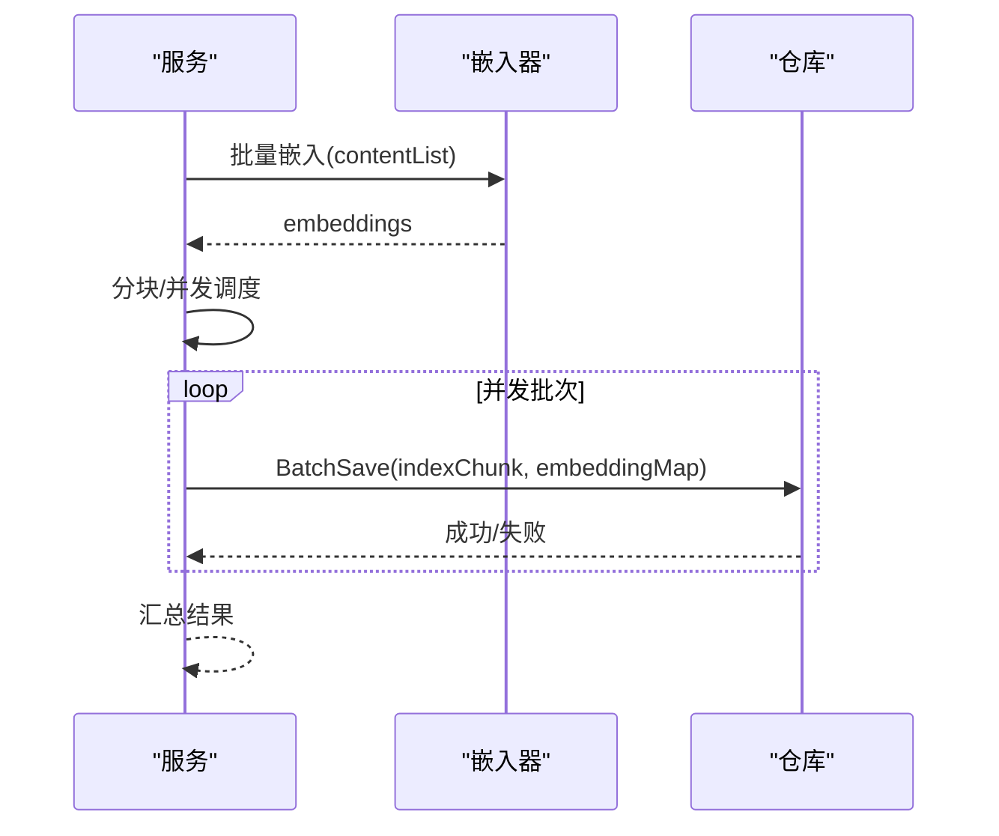
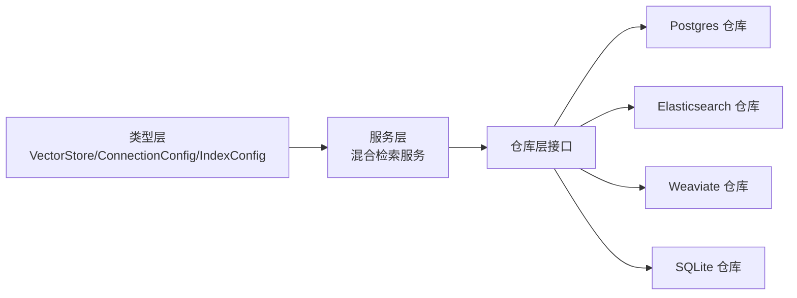

# 向量索引管理与优化

<cite>
**本文档引用的文件**
- [internal/types/vectorstore.go](file://internal/types/vectorstore.go)
- [internal/application/repository/retriever/postgres/structs.go](file://internal/application/repository/retriever/postgres/structs.go)
- [internal/application/repository/retriever/sqlite/repository.go](file://internal/application/repository/retriever/sqlite/repository.go)
- [internal/application/repository/retriever/elasticsearch/structs.go](file://internal/application/repository/retriever/elasticsearch/structs.go)
- [internal/application/repository/retriever/weaviate/repository.go](file://internal/application/repository/retriever/weaviate/repository.go)
- [internal/application/service/retriever/keywords_vector_hybrid_indexer.go](file://internal/application/service/retriever/keywords_vector_hybrid_indexer.go)
- [internal/application/service/metric_hook.go](file://internal/application/service/metric_hook.go)
- [internal/application/service/metric/precision.go](file://internal/application/service/metric/precision.go)
- [internal/application/service/metric/recall.go](file://internal/application/service/metric/recall.go)
- [internal/application/service/metric/ndcg.go](file://internal/application/service/metric/ndcg.go)
- [internal/application/service/metric/map.go](file://internal/application/service/metric/map.go)
- [docs/使用其他向量数据库.md](file://docs/使用其他向量数据库.md)
- [helm/templates/redis.yaml](file://helm/templates/redis.yaml)
</cite>

## 目录
1. [简介](#简介)
2. [项目结构](#项目结构)
3. [核心组件](#核心组件)
4. [架构总览](#架构总览)
5. [详细组件分析](#详细组件分析)
6. [依赖分析](#依赖分析)
7. [性能考量](#性能考量)
8. [故障排查指南](#故障排查指南)
9. [结论](#结论)
10. [附录](#附录)

## 简介
本文件面向数据科学家与系统工程师，围绕 WeKnora 的向量索引管理与优化提供系统性指导。内容涵盖多引擎索引策略（PostgreSQL/pgvector、Elasticsearch、Qdrant、Milvus、Weaviate、SQLite/sqlite-vec）、索引类型选择与性能参数调优、向量维度优化、相似度计算与查询算法、批量索引构建与增量更新、索引重建策略、内存与磁盘空间优化、查询缓存配置、监控指标与性能基准测试、容量规划等。

## 项目结构
WeKnora 将向量检索抽象为统一接口，按引擎实现具体仓库与服务层。关键模块包括：
- 类型与配置：向量库配置、索引配置、连接配置、引擎类型元数据
- 仓库层：各引擎的索引持久化、查询、统计与维护
- 服务层：批量索引、并发控制、复制与删除、存储估算
- 指标评估：召回、精确率、NDCG、MAP 等检索指标
- 文档与 Helm：如何集成新引擎、Redis 缓存服务

图表来源
- [internal/types/vectorstore.go:30-95](file://internal/types/vectorstore.go#L30-L95)
- [internal/application/service/retriever/keywords_vector_hybrid_indexer.go:16-34](file://internal/application/service/retriever/keywords_vector_hybrid_indexer.go#L16-L34)
- [internal/application/repository/retriever/postgres/structs.go:14-29](file://internal/application/repository/retriever/postgres/structs.go#L14-L29)
- [internal/application/repository/retriever/elasticsearch/structs.go:10-22](file://internal/application/repository/retriever/elasticsearch/structs.go#L10-L22)
- [internal/application/repository/retriever/weaviate/repository.go:37-54](file://internal/application/repository/retriever/weaviate/repository.go#L37-L54)
- [internal/application/repository/retriever/sqlite/repository.go:38-41](file://internal/application/repository/retriever/sqlite/repository.go#L38-L41)

章节来源
- [internal/types/vectorstore.go:30-95](file://internal/types/vectorstore.go#L30-L95)
- [docs/使用其他向量数据库.md:1-191](file://docs/使用其他向量数据库.md#L1-L191)

## 核心组件
- 向量库配置（VectorStore）：封装引擎类型、连接参数、索引配置，并提供校验与默认值解析。
- 索引配置（IndexConfig）：支持引擎特定字段（如分片、副本、集合名），并提供验证与解析函数。
- 混合检索服务：统一处理关键词与向量检索，支持批量嵌入生成、并发写入与存储估算。
- 引擎仓库：针对不同后端实现索引的创建、写入、查询、删除与复制。

章节来源
- [internal/types/vectorstore.go:30-95](file://internal/types/vectorstore.go#L30-L95)
- [internal/types/vectorstore.go:203-265](file://internal/types/vectorstore.go#L203-L265)
- [internal/application/service/retriever/keywords_vector_hybrid_indexer.go:16-34](file://internal/application/service/retriever/keywords_vector_hybrid_indexer.go#L16-L34)

## 架构总览
WeKnora 的向量检索采用“服务层 + 仓库层 + 外部引擎”的分层设计。服务层负责业务编排（批量索引、并发控制、复制与删除），仓库层对接具体引擎（PostgreSQL、Elasticsearch、Weaviate、SQLite），类型层提供配置与校验。

图表来源
- [internal/application/service/retriever/keywords_vector_hybrid_indexer.go:63-112](file://internal/application/service/retriever/keywords_vector_hybrid_indexer.go#L63-L112)
- [internal/application/repository/retriever/sqlite/repository.go:160-184](file://internal/application/repository/retriever/sqlite/repository.go#L160-L184)

## 详细组件分析

### 向量库配置与索引配置
- VectorStore：包含引擎类型、连接配置、索引配置；提供校验（名称、引擎类型、租户ID）与默认值解析。
- IndexConfig：支持引擎特定字段（分片数、副本数、集合前缀/名称、期望分片数等），并提供验证规则与解析函数（ResolveIndexName/ResolveCollectionName）。
- 连接配置：支持主机/端口、用户名/密码、API Key、TLS、默认连接等；敏感字段加密存储并在加载时解密。

图表来源
- [internal/types/vectorstore.go:30-95](file://internal/types/vectorstore.go#L30-L95)
- [internal/types/vectorstore.go:101-121](file://internal/types/vectorstore.go#L101-L121)
- [internal/types/vectorstore.go:203-265](file://internal/types/vectorstore.go#L203-L265)
- [internal/types/vectorstore.go:336-376](file://internal/types/vectorstore.go#L336-L376)

章节来源
- [internal/types/vectorstore.go:30-95](file://internal/types/vectorstore.go#L30-L95)
- [internal/types/vectorstore.go:101-121](file://internal/types/vectorstore.go#L101-L121)
- [internal/types/vectorstore.go:203-265](file://internal/types/vectorstore.go#L203-L265)
- [internal/types/vectorstore.go:336-376](file://internal/types/vectorstore.go#L336-L376)

### PostgreSQL/pgvector 仓库
- 存储模型：Embedding 字段使用半精度向量类型，支持维度字段与启用状态索引。
- 查询特性：通过事务设置 HNSW 参数（如 ef_search、iterative_scan）以优化查询性能；若旧版本不支持则回退。
- 分数映射：将底层相似度转换为领域分数。

图表来源
- [internal/application/repository/retriever/postgres/structs.go:14-29](file://internal/application/repository/retriever/postgres/structs.go#L14-L29)
- [internal/application/repository/retriever/postgres/structs.go:59-87](file://internal/application/repository/retriever/postgres/structs.go#L59-L87)
- [internal/application/repository/retriever/postgres/structs.go:89-103](file://internal/application/repository/retriever/postgres/structs.go#L89-L103)

章节来源
- [internal/application/repository/retriever/postgres/structs.go:14-29](file://internal/application/repository/retriever/postgres/structs.go#L14-L29)
- [internal/application/repository/retriever/postgres/structs.go:59-87](file://internal/application/repository/retriever/postgres/structs.go#L59-L87)
- [internal/application/repository/retriever/postgres/structs.go:89-103](file://internal/application/repository/retriever/postgres/structs.go#L89-L103)

### Elasticsearch 仓库
- 文档模型：包含内容、来源ID、分块ID、知识ID、标签ID、向量嵌入、启用状态等字段。
- 映射转换：提供从 IndexInfo 到 ES 文档的转换与反向转换，便于统一领域模型。

章节来源
- [internal/application/repository/retriever/elasticsearch/structs.go:10-28](file://internal/application/repository/retriever/elasticsearch/structs.go#L10-L28)
- [internal/application/repository/retriever/elasticsearch/structs.go:30-78](file://internal/application/repository/retriever/elasticsearch/structs.go#L30-L78)

### Weaviate 仓库
- 集合命名：基于集合前缀与维度动态生成集合名。
- HNSW 配置：向量索引类型为 HNSW，支持距离度量、efConstruction、maxConnections、ef 等参数。
- 复制与分片：支持复制因子与期望分片数配置；首次访问自动创建集合。
- 存储估算：根据字段大小估算存储开销。

图表来源
- [internal/application/repository/retriever/weaviate/repository.go:37-54](file://internal/application/repository/retriever/weaviate/repository.go#L37-L54)
- [internal/application/repository/retriever/weaviate/repository.go:56-160](file://internal/application/repository/retriever/weaviate/repository.go#L56-L160)
- [internal/application/repository/retriever/weaviate/repository.go:170-183](file://internal/application/repository/retriever/weaviate/repository.go#L170-L183)

章节来源
- [internal/application/repository/retriever/weaviate/repository.go:37-54](file://internal/application/repository/retriever/weaviate/repository.go#L37-L54)
- [internal/application/repository/retriever/weaviate/repository.go:56-160](file://internal/application/repository/retriever/weaviate/repository.go#L56-L160)
- [internal/application/repository/retriever/weaviate/repository.go:170-183](file://internal/application/repository/retriever/weaviate/repository.go#L170-L183)

### SQLite/sqlite-vec 仓库
- 向量表：按维度动态创建 vec0 表，距离度量可配置（余弦）。
- 关键词检索：FTS5 内容无关表，手动大文本分词以提升中文召回。
- 向量检索：使用 sqlite-vec 的 k 近邻查询，支持过滤条件与 TopK。
- 复制与删除：按维度维护向量表，复制/删除时同步清理向量与 FTS5。

图表来源
- [internal/application/repository/retriever/sqlite/repository.go:108-126](file://internal/application/repository/retriever/sqlite/repository.go#L108-L126)
- [internal/application/repository/retriever/sqlite/repository.go:389-416](file://internal/application/repository/retriever/sqlite/repository.go#L389-L416)
- [internal/application/repository/retriever/sqlite/repository.go:430-466](file://internal/application/repository/retriever/sqlite/repository.go#L430-L466)

章节来源
- [internal/application/repository/retriever/sqlite/repository.go:108-126](file://internal/application/repository/retriever/sqlite/repository.go#L108-L126)
- [internal/application/repository/retriever/sqlite/repository.go:298-375](file://internal/application/repository/retriever/sqlite/repository.go#L298-L375)
- [internal/application/repository/retriever/sqlite/repository.go:376-467](file://internal/application/repository/retriever/sqlite/repository.go#L376-L467)

### 混合检索服务与批量索引
- 单条索引：生成嵌入后写入仓库。
- 批量索引：对内容进行分块，使用池化批嵌入；并发控制（简单并发或有界并发）提升吞吐。
- 存储估算：基于嵌入维度与内容长度估算存储占用。
- 复制与删除：支持按 ChunkID/SourceID/KnowledgeID 删除与复制索引。

图表来源
- [internal/application/service/retriever/keywords_vector_hybrid_indexer.go:63-112](file://internal/application/service/retriever/keywords_vector_hybrid_indexer.go#L63-L112)
- [internal/application/service/retriever/keywords_vector_hybrid_indexer.go:114-206](file://internal/application/service/retriever/keywords_vector_hybrid_indexer.go#L114-L206)

章节来源
- [internal/application/service/retriever/keywords_vector_hybrid_indexer.go:43-59](file://internal/application/service/retriever/keywords_vector_hybrid_indexer.go#L43-L59)
- [internal/application/service/retriever/keywords_vector_hybrid_indexer.go:63-112](file://internal/application/service/retriever/keywords_vector_hybrid_indexer.go#L63-L112)
- [internal/application/service/retriever/keywords_vector_hybrid_indexer.go:234-251](file://internal/application/service/retriever/keywords_vector_hybrid_indexer.go#L234-L251)

### 检索指标与评估
- 支持指标：精确率、召回率、NDCG@3/10、MRR、MAP，以及多种 BLEU 与 ROUGE 指标。
- 计算器注册：集中注册各类指标计算器，统一计算与平均。
- 评估钩子：记录 QA 对、检索结果、重排序结果与对话响应，用于指标计算。

章节来源
- [internal/application/service/metric_hook.go:18-50](file://internal/application/service/metric_hook.go#L18-L50)
- [internal/application/service/metric_hook.go:84-113](file://internal/application/service/metric_hook.go#L84-L113)
- [internal/application/service/metric/precision.go:15-44](file://internal/application/service/metric/precision.go#L15-L44)
- [internal/application/service/metric/recall.go:15-41](file://internal/application/service/metric/recall.go#L15-L41)
- [internal/application/service/metric/ndcg.go:19-55](file://internal/application/service/metric/ndcg.go#L19-L55)
- [internal/application/service/metric/map.go:15-49](file://internal/application/service/metric/map.go#L15-L49)

## 依赖分析
- 引擎类型与配置：通过 VectorStore/ConnectionConfig/IndexConfig 统一抽象，支持多引擎切换与默认值解析。
- 仓库层耦合：各引擎仓库独立实现，仅依赖统一接口与类型层；服务层通过接口与工厂注册解耦。
- 外部依赖：PostgreSQL 使用 pgvector；Weaviate 使用官方 Go 客户端；SQLite 使用 sqlite-vec；Elasticsearch 使用文档模型映射。

图表来源
- [internal/types/vectorstore.go:30-95](file://internal/types/vectorstore.go#L30-L95)
- [internal/application/service/retriever/keywords_vector_hybrid_indexer.go:16-34](file://internal/application/service/retriever/keywords_vector_hybrid_indexer.go#L16-L34)
- [internal/application/repository/retriever/postgres/structs.go:14-29](file://internal/application/repository/retriever/postgres/structs.go#L14-L29)
- [internal/application/repository/retriever/elasticsearch/structs.go:10-22](file://internal/application/repository/retriever/elasticsearch/structs.go#L10-L22)
- [internal/application/repository/retriever/weaviate/repository.go:37-54](file://internal/application/repository/retriever/weaviate/repository.go#L37-L54)
- [internal/application/repository/retriever/sqlite/repository.go:38-41](file://internal/application/repository/retriever/sqlite/repository.go#L38-L41)

章节来源
- [internal/types/vectorstore.go:30-95](file://internal/types/vectorstore.go#L30-L95)
- [internal/application/service/retriever/keywords_vector_hybrid_indexer.go:16-34](file://internal/application/service/retriever/keywords_vector_hybrid_indexer.go#L16-L34)

## 性能考量
- 索引类型与参数
  - PostgreSQL/HNSW：通过事务设置 ef_search、iterative_scan 等参数优化查询；若引擎不支持则回退。
  - Weaviate/HNSW：配置 efConstruction、maxConnections、ef 等；支持复制因子与期望分片数。
  - SQLite/sqlite-vec：按维度创建向量表，使用 k 近邻查询；建议保留排序以稳定结果。
- 相似度与距离
  - PostgreSQL：使用半精度向量与内置距离度量（由引擎决定）。
  - Weaviate：显式配置余弦距离。
  - SQLite：余弦距离 = 1 - 余弦相似度。
- 批量与并发
  - 批量嵌入使用池化接口；并发采用 errgroup 与信号量控制，避免后端过载。
  - 批次大小与并发度需结合后端资源与延迟目标调优。
- 存储与内存
  - PostgreSQL：半精度向量节省存储；索引字段（isEnabled、tagID）建立索引。
  - SQLite：按维度维护向量表，删除/复制时同步清理；FTS5 内容无关表提升中文分词召回。
  - Weaviate：集合按维度命名，首次访问自动创建；可配置复制因子与分片数。
- 查询缓存
  - Redis 作为缓存服务部署，可用于检索结果缓存与队列管理（参考 Helm 模板）。

章节来源
- [internal/application/repository/retriever/postgres/structs.go:59-87](file://internal/application/repository/retriever/postgres/structs.go#L59-L87)
- [internal/application/repository/retriever/postgres/structs.go:430-462](file://internal/application/repository/retriever/postgres/structs.go#L430-L462)
- [internal/application/repository/retriever/weaviate/repository.go:84-96](file://internal/application/repository/retriever/weaviate/repository.go#L84-L96)
- [internal/application/repository/retriever/sqlite/repository.go:108-126](file://internal/application/repository/retriever/sqlite/repository.go#L108-L126)
- [internal/application/repository/retriever/sqlite/repository.go:430-466](file://internal/application/repository/retriever/sqlite/repository.go#L430-L466)
- [helm/templates/redis.yaml:81-124](file://helm/templates/redis.yaml#L81-L124)

## 故障排查指南
- 嵌入生成失败
  - 现象：批量嵌入多次重试仍失败。
  - 处理：检查嵌入器可用性、网络连通性与超时设置；适当降低批次大小与并发度。
- PostgreSQL 查询异常
  - 现象：HNSW GUC 参数报错或旧版本不支持。
  - 处理：自动回退至无 GUC 设置的查询路径；升级 pgvector 或调整参数。
- Weaviate 集合创建失败
  - 现象：Schema 创建失败或权限不足。
  - 处理：检查连接参数、API Key、集群状态；确认复制因子与分片数配置合理。
- SQLite 向量表创建失败
  - 现象：vec0 扩展不可用或表已存在。
  - 处理：确认 sqlite-vec 扩展安装与权限；按维度创建表并检查距离度量配置。
- 指标计算异常
  - 现象：空检索结果或空标注导致指标为 0。
  - 处理：检查 Ground Truth 与检索 ID 是否为空；确保指标输入格式正确。

章节来源
- [internal/application/service/retriever/keywords_vector_hybrid_indexer.go:77-85](file://internal/application/service/retriever/keywords_vector_hybrid_indexer.go#L77-L85)
- [internal/application/repository/retriever/postgres/structs.go:435-443](file://internal/application/repository/retriever/postgres/structs.go#L435-L443)
- [internal/application/repository/retriever/weaviate/repository.go:152-156](file://internal/application/repository/retriever/weaviate/repository.go#L152-L156)
- [internal/application/repository/retriever/sqlite/repository.go:117-124](file://internal/application/repository/retriever/sqlite/repository.go#L117-L124)

## 结论
WeKnora 通过统一的类型与接口抽象，实现了多引擎向量索引的统一管理与优化。在实际部署中，应结合业务规模与数据特征选择合适的引擎与参数，利用批量与并发策略提升索引效率，通过指标体系持续评估与优化检索质量，并配合缓存与容量规划保障系统稳定性。

## 附录
- 集成新向量数据库指南：参考文档中的接口实现步骤与注册流程，确保新引擎符合统一接口规范。

章节来源
- [docs/使用其他向量数据库.md:1-191](file://docs/使用其他向量数据库.md#L1-L191)