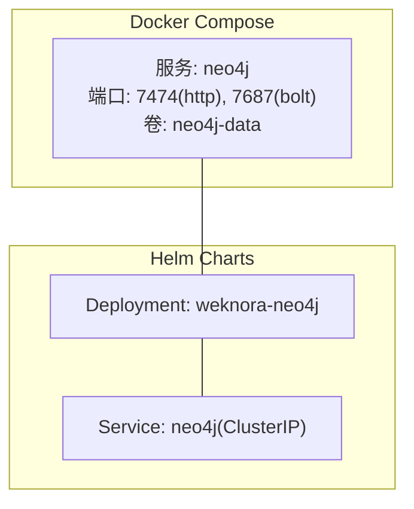
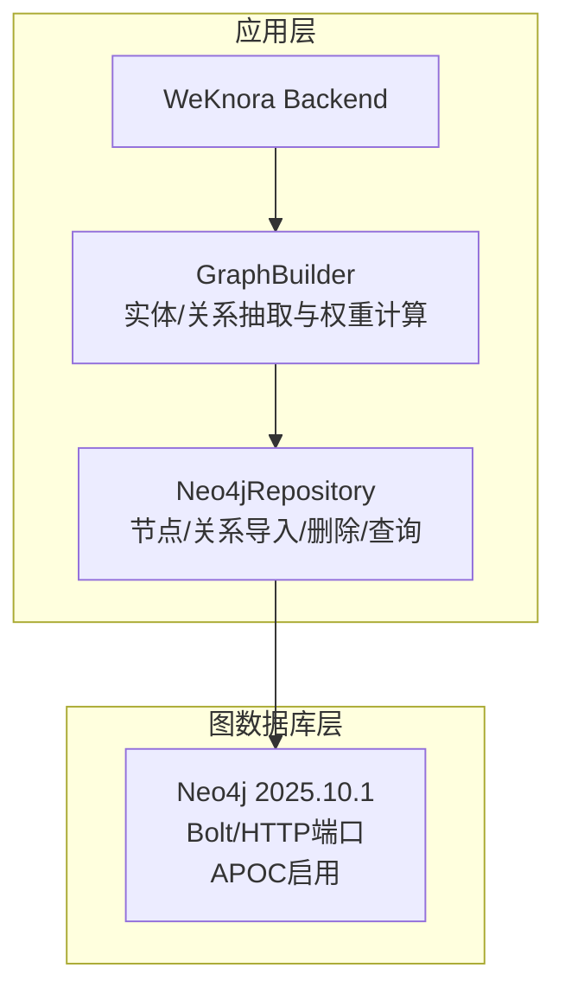
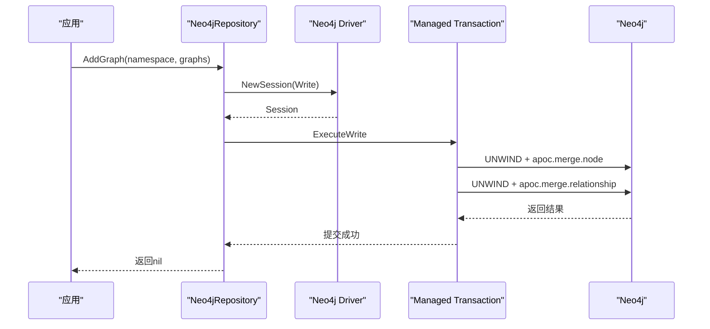
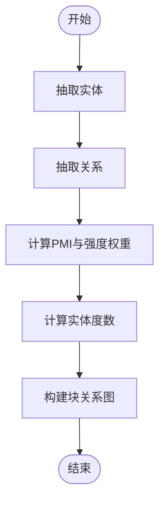
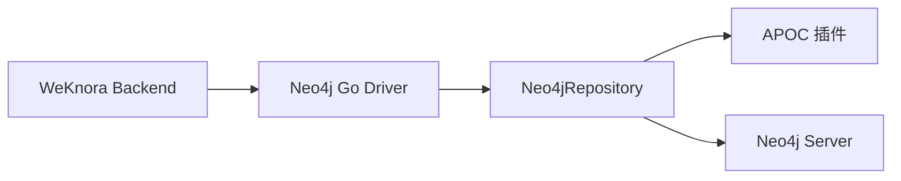

# Neo4j图数据库部署

<cite>
**本文引用的文件列表**
- [docker-compose.yml](file://docker-compose.yml)
- [helm/values.yaml](file://helm/values.yaml)
- [helm/templates/neo4j.yaml](file://helm/templates/neo4j.yaml)
- [internal/container/container.go](file://internal/container/container.go)
- [internal/application/repository/retriever/neo4j/repository.go](file://internal/application/repository/retriever/neo4j/repository.go)
- [internal/application/service/graph.go](file://internal/application/service/graph.go)
- [docs/KnowledgeGraph.md](file://docs/KnowledgeGraph.md)
- [docs/wiki/核心功能/开启知识图谱功能.md](file://docs/wiki/核心功能/开启知识图谱功能.md)
</cite>

## 目录
1. [简介](#简介)
2. [项目结构](#项目结构)
3. [核心组件](#核心组件)
4. [架构总览](#架构总览)
5. [详细组件分析](#详细组件分析)
6. [依赖关系分析](#依赖关系分析)
7. [性能考量](#性能考量)
8. [故障排查指南](#故障排查指南)
9. [结论](#结论)
10. [附录](#附录)

## 简介
本文件面向图数据库管理员与开发者，提供WeKnora项目中Neo4j图数据库的完整容器化部署与图数据管理方案。内容涵盖：
- Neo4j容器配置参数、插件安装与数据卷挂载
- Neo4j作为知识图谱存储的配置选项、APOC插件启用与图算法支持
- Neo4j与WeKnora图谱功能的连接配置、认证设置与查询优化策略
- 集群部署、高可用配置与数据备份恢复机制
- 性能监控、图查询分析与故障排查指南

## 项目结构
WeKnora通过两种方式提供Neo4j部署：
- Docker Compose：单机/本地开发场景，包含Neo4j服务定义与环境变量
- Helm Charts：Kubernetes生产场景，提供可配置的Deployment与Service

图表来源
- [docker-compose.yml:278-297](file://docker-compose.yml#L278-L297)
- [helm/templates/neo4j.yaml:9-136](file://helm/templates/neo4j.yaml#L9-L136)

章节来源
- [docker-compose.yml:278-297](file://docker-compose.yml#L278-L297)
- [helm/templates/neo4j.yaml:9-136](file://helm/templates/neo4j.yaml#L9-L136)

## 核心组件
- Neo4j容器与服务
  - Docker Compose中定义了neo4j服务，暴露HTTP与Bolt端口，挂载数据卷，启用APOC插件并配置导入导出能力
  - Helm模板中定义了Deployment与Service，同样启用APOC插件，提供健康探针与持久化卷
- WeKnora应用侧连接与图操作
  - 应用通过环境变量读取Neo4j连接信息，具备重试与认证校验逻辑
  - Neo4j仓库实现负责节点/关系导入、删除与查询，广泛使用APOC过程

章节来源
- [docker-compose.yml:278-297](file://docker-compose.yml#L278-L297)
- [helm/templates/neo4j.yaml:36-136](file://helm/templates/neo4j.yaml#L36-L136)
- [internal/container/container.go:1090-1127](file://internal/container/container.go#L1090-L1127)
- [internal/application/repository/retriever/neo4j/repository.go:1-223](file://internal/application/repository/retriever/neo4j/repository.go#L1-L223)

## 架构总览
WeKnora的图谱功能以Neo4j为核心存储，应用侧通过Neo4j Go Driver进行连接与事务操作，知识图谱构建由LLM抽取实体与关系，再批量导入Neo4j。

图表来源
- [internal/application/service/graph.go:375-497](file://internal/application/service/graph.go#L375-L497)
- [internal/application/repository/retriever/neo4j/repository.go:45-115](file://internal/application/repository/retriever/neo4j/repository.go#L45-L115)
- [internal/container/container.go:1090-1127](file://internal/container/container.go#L1090-L1127)

## 详细组件分析

### Neo4j容器配置与插件
- 端口与协议
  - HTTP: 7474（Web控制台）
  - Bolt: 7687（应用连接）
- 环境变量与认证
  - 默认用户名固定为“neo4j”，密码通过环境变量注入
  - 启用严格配置校验关闭以避免K8s注入冲突
- 插件与文件导入导出
  - 启用APOC插件，开放文件导入/导出能力，允许从Neo4j配置读取文件路径
- 数据持久化
  - Docker Compose：挂载名为neo4j-data的卷
  - Helm：支持PVC或emptyDir

章节来源
- [docker-compose.yml:283-288](file://docker-compose.yml#L283-L288)
- [helm/templates/neo4j.yaml:52-72](file://helm/templates/neo4j.yaml#L52-L72)
- [helm/templates/neo4j.yaml:95-101](file://helm/templates/neo4j.yaml#L95-L101)

### WeKnora应用侧连接与重试
- 连接参数来源
  - 从环境变量读取NEO4J_ENABLE、NEO4J_URI、NEO4J_USERNAME、NEO4J_PASSWORD
- 连接建立与认证校验
  - 循环重试，最多30次，每次间隔2秒
  - 成功后记录重试次数，失败则返回错误
- 与应用配置的关联
  - docker-compose中提供了NEO4J_URI、NEO4J_USERNAME、NEO4J_PASSWORD等变量

章节来源
- [internal/container/container.go:1090-1127](file://internal/container/container.go#L1090-L1127)
- [docker-compose.yml:125-128](file://docker-compose.yml#L125-L128)

### Neo4j仓库实现与查询流程
- 节点导入
  - 使用apoc.merge.node合并节点，属性包含名称、知识库ID、属性数组与块ID集合
  - 通过UNWIND批量导入，避免重复节点
- 关系导入
  - 通过apoc.merge.node创建源/目标节点，再apoc.merge.relationship创建关系
- 删除流程
  - 使用apoc.periodic.iterate分批删除指定命名空间下的节点与关系
- 查询流程
  - 读事务中执行MATCH查询，返回节点、关系及目标节点
  - 将Neo4j节点/关系转换为内部GraphData结构

图表来源
- [internal/application/repository/retriever/neo4j/repository.go:64-109](file://internal/application/repository/retriever/neo4j/repository.go#L64-L109)

章节来源
- [internal/application/repository/retriever/neo4j/repository.go:45-115](file://internal/application/repository/retriever/neo4j/repository.go#L45-L115)
- [internal/application/repository/retriever/neo4j/repository.go:117-161](file://internal/application/repository/retriever/neo4j/repository.go#L117-L161)
- [internal/application/repository/retriever/neo4j/repository.go:163-223](file://internal/application/repository/retriever/neo4j/repository.go#L163-L223)

### 知识图谱构建与权重计算
- 实体与关系抽取
  - 使用LLM抽取实体与关系，构建实体映射与关系映射
- 权重与度数计算
  - 基于PMI与强度计算关系权重，归一化后缩放到1-10范围
  - 计算实体入度/出度，得到组合度数
- 图构建与检索
  - 构建文档块之间的关系图，支持直接与间接关系检索

图表来源
- [internal/application/service/graph.go:375-497](file://internal/application/service/graph.go#L375-L497)
- [internal/application/service/graph.go:499-589](file://internal/application/service/graph.go#L499-L589)
- [internal/application/service/graph.go:591-628](file://internal/application/service/graph.go#L591-L628)
- [internal/application/service/graph.go:630-673](file://internal/application/service/graph.go#L630-L673)

章节来源
- [internal/application/service/graph.go:96-189](file://internal/application/service/graph.go#L96-L189)
- [internal/application/service/graph.go:191-315](file://internal/application/service/graph.go#L191-L315)
- [internal/application/service/graph.go:499-628](file://internal/application/service/graph.go#L499-L628)

### WeKnora前端与控制台验证
- 前端启用抽取开关后，系统在入库阶段自动触发实体/关系抽取
- 控制台验证：访问http://localhost:7474，执行基础查询查看节点/关系
- 常见问题：无法连接、未生成节点、查询无结果等

章节来源
- [docs/wiki/核心功能/开启知识图谱功能.md:66-98](file://docs/wiki/核心功能/开启知识图谱功能.md#L66-L98)
- [docs/KnowledgeGraph.md:1-29](file://docs/KnowledgeGraph.md#L1-L29)

## 依赖关系分析
- 应用对Neo4j的依赖
  - 通过Neo4j Go Driver建立连接，使用BasicAuth认证
  - 仓库实现依赖APOC过程进行节点/关系合并与周期性迭代删除
- Helm与Docker Compose的差异
  - Helm通过Service名称“neo4j”暴露Bolt/HTTP端口，K8s环境变量注入可能影响严格校验
  - Docker Compose直接使用环境变量，更贴近本地开发

图表来源
- [internal/container/container.go:1090-1127](file://internal/container/container.go#L1090-L1127)
- [internal/application/repository/retriever/neo4j/repository.go:1-23](file://internal/application/repository/retriever/neo4j/repository.go#L1-L23)

章节来源
- [internal/container/container.go:1090-1127](file://internal/container/container.go#L1090-L1127)
- [internal/application/repository/retriever/neo4j/repository.go:1-23](file://internal/application/repository/retriever/neo4j/repository.go#L1-L23)

## 性能考量
- 连接与认证
  - 应用侧具备重试机制，建议在K8s中确保Service名称与端口稳定，避免注入冲突
- 查询与导入
  - 使用apoc.merge.node/relationship减少重复写入
  - 分批删除使用apoc.periodic.iterate，降低锁竞争
- 资源与持久化
  - Helm模板提供资源请求/限制与持久化配置，建议根据负载调整CPU/内存与卷大小
- 监控与健康检查
  - Helm模板提供liveness/readiness探针，建议结合应用日志与Neo4j控制台监控

[本节为通用指导，无需特定文件引用]

## 故障排查指南
- 无法连接Neo4j
  - 检查NEO4J_URI、用户名与密码是否正确
  - 查看应用日志中的重试与认证校验输出
- 未生成节点/关系
  - 确认知识库已启用实体/关系抽取
  - 检查后端日志中抽取任务状态
- 查询无结果
  - 在Neo4j控制台执行基础查询验证Schema与数据
  - 检查标签与命名空间拼接是否符合预期
- K8s注入冲突
  - Helm模板已关闭严格配置校验，避免与K8s注入的NEO4J_PORT_*冲突

章节来源
- [docs/wiki/核心功能/开启知识图谱功能.md:87-93](file://docs/wiki/核心功能/开启知识图谱功能.md#L87-L93)
- [helm/templates/neo4j.yaml:60-63](file://helm/templates/neo4j.yaml#L60-L63)
- [internal/container/container.go:1090-1127](file://internal/container/container.go#L1090-L1127)

## 结论
WeKnora为Neo4j提供了完善的容器化部署方案与应用侧集成，包括：
- 明确的容器配置、插件启用与数据持久化策略
- 健壮的应用侧连接与重试机制
- 基于APOC的高效导入/删除与查询实现
- 从实体/关系抽取到权重计算的完整图谱构建流程

建议在生产环境中结合Helm模板的资源与持久化配置，配合K8s健康检查与监控，确保Neo4j的高可用与稳定性。

[本节为总结，无需特定文件引用]

## 附录

### A. Docker Compose关键配置要点
- 服务定义与端口映射
- 环境变量：NEO4J_AUTH、NEO4J_apoc_*、NEO4JLABS_PLUGINS
- 数据卷：neo4j-data
- Profile：neo4j

章节来源
- [docker-compose.yml:278-297](file://docker-compose.yml#L278-L297)

### B. Helm Charts关键配置要点
- Deployment：镜像、资源、安全上下文、探针、卷
- Service：ClusterIP，端口7474/7687
- Values：neo4j.enabled、image.tag、persistence.size、resources

章节来源
- [helm/values.yaml:424-472](file://helm/values.yaml#L424-L472)
- [helm/templates/neo4j.yaml:9-136](file://helm/templates/neo4j.yaml#L9-L136)

### C. WeKnora应用侧连接与图操作
- 连接参数来源与重试逻辑
- Neo4jRepository的导入/删除/查询实现
- GraphBuilder的实体/关系抽取与权重计算

章节来源
- [internal/container/container.go:1090-1127](file://internal/container/container.go#L1090-L1127)
- [internal/application/repository/retriever/neo4j/repository.go:45-223](file://internal/application/repository/retriever/neo4j/repository.go#L45-L223)
- [internal/application/service/graph.go:375-673](file://internal/application/service/graph.go#L375-L673)