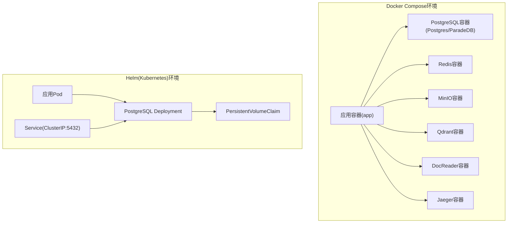
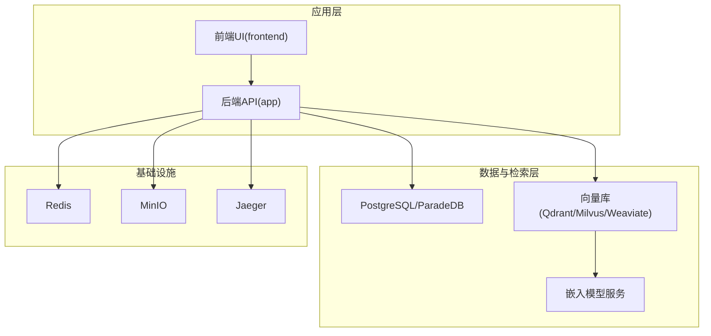
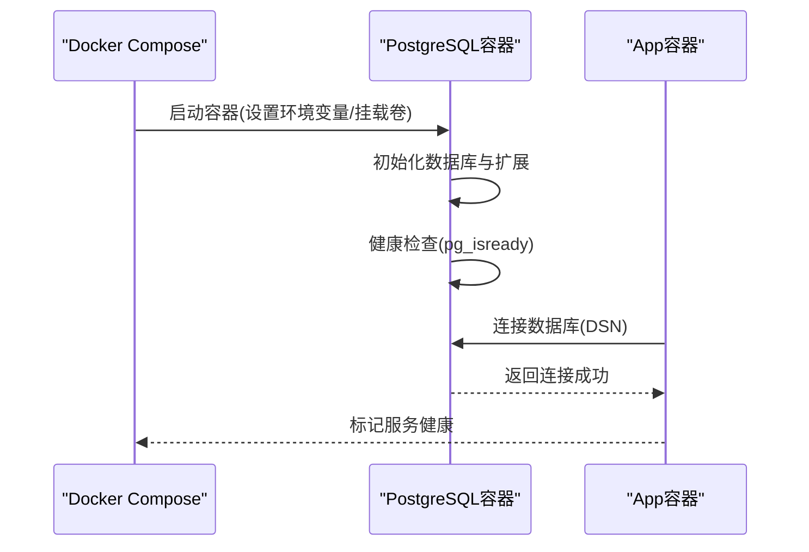
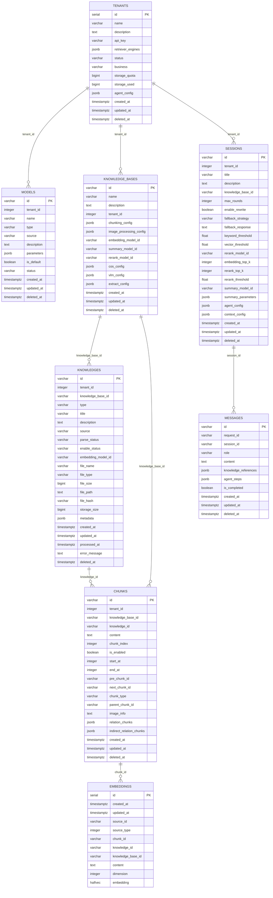
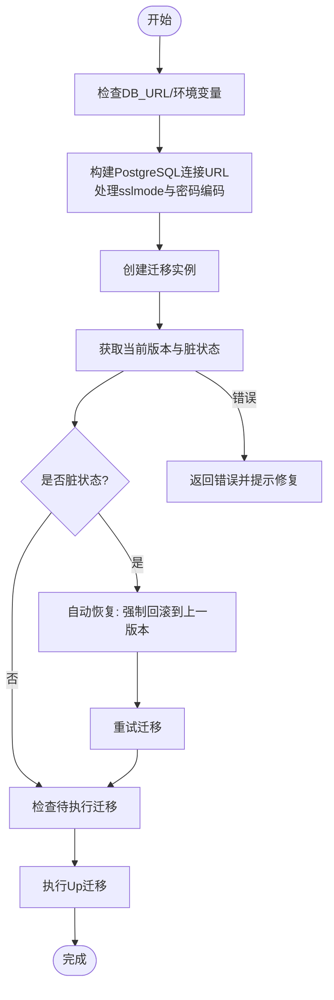
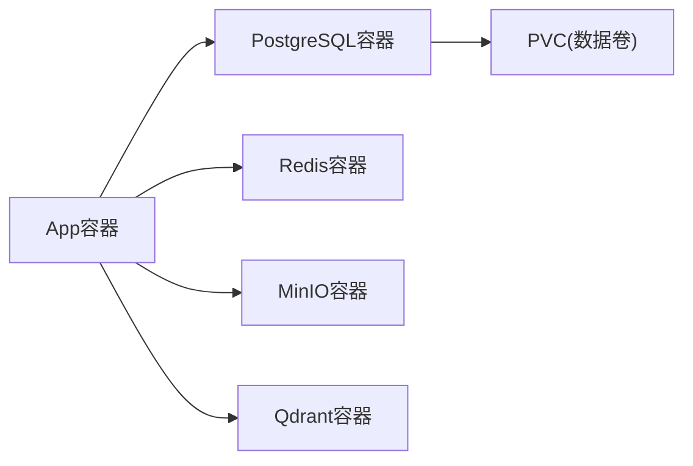

# PostgreSQL数据库部署

<cite>
**本文档引用的文件**
- [docker-compose.yml](file://docker-compose.yml)
- [docker-compose.dev.yml](file://docker-compose.dev.yml)
- [postgres.yaml](file://helm/templates/postgres.yaml)
- [values.yaml](file://helm/values.yaml)
- [migration.go](file://internal/database/migration.go)
- [migrate.sh](file://scripts/migrate.sh)
- [00-init-db.sql](file://migrations/paradedb/00-init-db.sql)
- [01-migrate-to-paradedb.sql](file://migrations/paradedb/01-migrate-to-paradedb.sql)
- [000000_init.up.sql](file://migrations/versioned/000000_init.up.sql)
- [000000_init.down.sql](file://migrations/versioned/000000_init.down.sql)
</cite>

## 目录
1. [简介](#简介)
2. [项目结构](#项目结构)
3. [核心组件](#核心组件)
4. [架构总览](#架构总览)
5. [详细组件分析](#详细组件分析)
6. [依赖关系分析](#依赖关系分析)
7. [性能考虑](#性能考虑)
8. [故障排查指南](#故障排查指南)
9. [结论](#结论)
10. [附录](#附录)

## 简介
本文件为WeKnora项目的PostgreSQL数据库（实际采用ParadeDB镜像以获得向量检索能力）部署与运维指南，覆盖容器配置参数、数据卷挂载、健康检查、初始化脚本、迁移管理策略、版本升级流程、与WeKnora应用的连接配置与性能优化、备份恢复策略、主从复制与高可用方案、监控指标与慢查询分析等内容。目标读者为数据库管理员与DevOps工程师。

## 项目结构
WeKnora通过Docker Compose与Helm两种方式提供PostgreSQL（ParadeDB）部署：
- Docker Compose：生产与开发环境统一编排，PostgreSQL容器使用ParadeDB镜像，具备向量与BM25检索能力
- Helm：Kubernetes原生部署，定义Deployment与Service，支持持久化与探针配置

**图表来源**
- [docker-compose.yml:200-221](file://docker-compose.yml#L200-L221)
- [postgres.yaml:10-128](file://helm/templates/postgres.yaml#L10-L128)

**章节来源**
- [docker-compose.yml:200-221](file://docker-compose.yml#L200-L221)
- [docker-compose.dev.yml:4-24](file://docker-compose.dev.yml#L4-L24)
- [postgres.yaml:10-128](file://helm/templates/postgres.yaml#L10-L128)
- [values.yaml:241-283](file://helm/values.yaml#L241-L283)

## 核心组件
- PostgreSQL容器（ParadeDB）
  - 镜像：paradedb/paradedb:v0.22.2-pg17（生产）或v0.22.2-pg17（开发）
  - 端口：5432
  - 环境变量：POSTGRES_USER、POSTGRES_PASSWORD、POSTGRES_DB
  - 数据卷：/var/lib/postgresql/data
  - 健康检查：pg_isready -U ${DB_USER}
  - 停机优雅退出：stop_grace_period=1m
- 初始化与迁移
  - 初始化SQL：创建扩展与核心表结构
  - 版本化迁移：基于golang-migrate的up/down迁移
  - 迁移脚本：提供便捷的migrate.sh工具
- 应用连接
  - app容器通过DB_DRIVER=postgres连接postgres服务
  - 支持RETRIEVE_DRIVER=postgres用于检索驱动

**章节来源**
- [docker-compose.yml:200-221](file://docker-compose.yml#L200-L221)
- [docker-compose.dev.yml:4-24](file://docker-compose.dev.yml#L4-L24)
- [postgres.yaml:36-89](file://helm/templates/postgres.yaml#L36-L89)
- [00-init-db.sql:1-215](file://migrations/paradedb/00-init-db.sql#L1-L215)
- [migration.go:39-208](file://internal/database/migration.go#L39-L208)
- [migrate.sh:1-122](file://scripts/migrate.sh#L1-L122)

## 架构总览
PostgreSQL作为WeKnora的数据存储核心，配合Redis缓存、MinIO对象存储、Qdrant向量库等组件，形成完整的知识检索与管理链路。应用层通过PostgreSQL进行结构化数据管理，并利用ParadeDB的向量索引与BM25全文检索能力实现高效检索。

**图表来源**
- [docker-compose.yml:28-157](file://docker-compose.yml#L28-L157)
- [docker-compose.yml:200-221](file://docker-compose.yml#L200-L221)
- [docker-compose.yml:299-364](file://docker-compose.yml#L299-L364)

## 详细组件分析

### PostgreSQL容器配置与健康检查
- 配置要点
  - 环境变量：POSTGRES_USER、POSTGRES_PASSWORD、POSTGRES_DB
  - 数据卷：postgres-data（生产）或postgres-data-dev（开发）
  - 健康检查：pg_isready -U ${DB_USER}，间隔10s，超时10s，重试3次，启动期30s
  - 停机优雅退出：stop_grace_period=1m
- Kubernetes部署
  - Deployment使用Recycle策略，确保数据库重建避免数据损坏
  - Service名称固定为postgres，便于应用引用
  - 支持持久化PVC与资源限制

**图表来源**
- [docker-compose.yml:200-221](file://docker-compose.yml#L200-L221)
- [postgres.yaml:36-89](file://helm/templates/postgres.yaml#L36-L89)

**章节来源**
- [docker-compose.yml:200-221](file://docker-compose.yml#L200-L221)
- [docker-compose.dev.yml:4-24](file://docker-compose.dev.yml#L4-L24)
- [postgres.yaml:17-24](file://helm/templates/postgres.yaml#L17-L24)
- [postgres.yaml:114-128](file://helm/templates/postgres.yaml#L114-L128)

### 数据库初始化脚本与表结构
- 初始化脚本特点
  - 创建必需扩展：uuid-ossp、vector、pg_trgm、pg_search
  - 定义核心业务表：tenants、models、knowledge_bases、knowledges、sessions、messages、chunks、embeddings
  - 为关键字段建立索引，包括BM25索引与HNSW向量索引
  - 设置序列起始值，确保ID连续性
- 表结构与索引
  - embeddings表包含BM25与HNSW索引，支持中文分词与向量检索
  - 多处JSONB字段用于灵活配置与元数据存储

**图表来源**
- [00-init-db.sql:8-215](file://migrations/paradedb/00-init-db.sql#L8-L215)

**章节来源**
- [00-init-db.sql:1-215](file://migrations/paradedb/00-init-db.sql#L1-L215)

### 迁移管理策略与版本升级流程
- 迁移框架
  - 基于golang-migrate，支持up/down与版本控制
  - 支持脏状态自动恢复（AutoRecoverDirty），通过强制回滚到上一版本后重试
  - 提供CachedMigrationVersion缓存启动时的迁移版本
- 迁移脚本
  - 版本化迁移位于migrations/versioned目录，按顺序编号
  - 提供migrate.sh工具，支持up、down、create、version、force、goto等操作
  - 自动处理SSL模式与密码URL编码
- 升级流程
  - 开发环境：使用migrate.sh up执行迁移
  - 生产环境：通过Helm部署PostgreSQL，应用启动时自动执行迁移
  - 脏状态处理：若迁移过程中出现异常，根据提示使用force命令回退到上一版本后重试

**图表来源**
- [migration.go:58-208](file://internal/database/migration.go#L58-L208)
- [migrate.sh:33-120](file://scripts/migrate.sh#L33-L120)

**章节来源**
- [migration.go:39-208](file://internal/database/migration.go#L39-L208)
- [migrate.sh:1-122](file://scripts/migrate.sh#L1-L122)
- [000000_init.up.sql:1-200](file://migrations/versioned/000000_init.up.sql#L1-L200)
- [000000_init.down.sql:1-200](file://migrations/versioned/000000_init.down.sql#L1-L200)

### 与WeKnora应用的连接配置与性能优化
- 连接配置
  - DB_DRIVER=postgres
  - DB_HOST=postgres（Compose服务名），DB_PORT=5432
  - DB_USER、DB_PASSWORD、DB_NAME通过环境变量注入
- 连接池与性能
  - 应用层使用PostgreSQL驱动，具体连接池参数在应用代码中配置
  - 建议结合应用日志与数据库慢查询日志进行性能调优
- 检索驱动
  - RETRIEVE_DRIVER=postgres用于检索驱动选择

**章节来源**
- [docker-compose.yml:61-67](file://docker-compose.yml#L61-L67)
- [docker-compose.yml:92-92](file://docker-compose.yml#L92-L92)
- [docker-compose.yml:148-152](file://docker-compose.yml#L148-L152)

### 备份恢复策略
- 备份
  - 使用pg_dump导出数据库（建议在维护窗口执行）
  - 建议对postgres-data卷进行快照备份
- 恢复
  - 使用pg_restore或psql导入备份数据
  - 从ParadeDB迁移至PostgreSQL时，可参考迁移脚本中的导入步骤
- 开发环境复用
  - 开发Compose通过langfuse-db-init容器在现有PostgreSQL中创建独立数据库，便于Langfuse与WeKnora共享同一PostgreSQL实例

**章节来源**
- [01-migrate-to-paradedb.sql:4-8](file://migrations/paradedb/01-migrate-to-paradedb.sql#L4-L8)
- [docker-compose.yml:397-428](file://docker-compose.yml#L397-L428)
- [docker-compose.dev.yml:216-246](file://docker-compose.dev.yml#L216-L246)

### 主从复制与高可用部署方案
- 当前部署
  - Docker Compose与Helm示例均为单实例部署，未启用主从复制
- 高可用建议
  - Kubernetes环境下可引入StatefulSet与副本集，结合PVC实现持久化
  - 使用PostgreSQL官方高可用方案（如Patroni、Barman等）实现主从切换
  - 配置ReadReplica与负载均衡，提升读性能
  - 健康检查与探针需与HA方案联动

**章节来源**
- [postgres.yaml:17-24](file://helm/templates/postgres.yaml#L17-L24)
- [postgres.yaml:114-128](file://helm/templates/postgres.yaml#L114-L128)

### 监控指标、慢查询分析与故障排查
- 监控指标
  - 健康检查：pg_isready
  - 连接数、查询延迟、缓冲区命中率、锁等待等可通过数据库内置视图与第三方监控工具采集
- 慢查询分析
  - 启用pg_stat_statements扩展，收集慢查询与执行计划
  - 结合应用日志定位热点查询
- 故障排查
  - 健康检查失败：检查容器日志、网络连通性、卷权限
  - 迁移失败：查看迁移日志，必要时使用migrate.sh force回退后重试
  - 权限问题：确认DB_USER、DB_PASSWORD与DB_NAME正确，以及卷权限

**章节来源**
- [docker-compose.yml:212-217](file://docker-compose.yml#L212-L217)
- [postgres.yaml:70-89](file://helm/templates/postgres.yaml#L70-L89)
- [migration.go:110-187](file://internal/database/migration.go#L110-L187)

## 依赖关系分析
- 组件耦合
  - app容器强依赖postgres服务（健康检查条件）
  - postgres与redis、minio、qdrant等组件共同构成数据与检索基础设施
- 外部依赖
  - golang-migrate用于数据库迁移
  - ParadeDB镜像提供向量与全文检索能力

**图表来源**
- [docker-compose.yml:28-157](file://docker-compose.yml#L28-L157)
- [docker-compose.yml:200-221](file://docker-compose.yml#L200-L221)

**章节来源**
- [docker-compose.yml:28-157](file://docker-compose.yml#L28-L157)
- [postgres.yaml:90-97](file://helm/templates/postgres.yaml#L90-L97)

## 性能考虑
- 索引设计
  - embeddings表使用BM25与HNSW索引，支持中文分词与向量检索
  - 关键查询字段建立复合索引，减少全表扫描
- 查询优化
  - 合理使用LIMIT与分页
  - 利用JSONB字段的索引与查询能力
- 连接与并发
  - 结合应用连接池参数与数据库最大连接数进行调优
  - 监控锁等待与长事务，避免阻塞

**章节来源**
- [00-init-db.sql:203-215](file://migrations/paradedb/00-init-db.sql#L203-L215)

## 故障排查指南
- 常见问题
  - 迁移脏状态：根据migration.go中的提示，使用migrate.sh force回退到上一版本后重试
  - 连接失败：检查DB_HOST、DB_PORT、DB_USER、DB_PASSWORD与DB_NAME
  - 健康检查失败：查看容器日志，确认PostgreSQL正常启动
- 工具与脚本
  - migrate.sh提供up/down/create/version/force/goto等操作
  - 迁移日志输出在应用启动时打印，便于定位问题

**章节来源**
- [migration.go:110-187](file://internal/database/migration.go#L110-L187)
- [migrate.sh:63-120](file://scripts/migrate.sh#L63-L120)

## 结论
WeKnora通过Docker Compose与Helm提供了标准化的PostgreSQL（ParadeDB）部署方案，结合完善的初始化脚本与迁移管理工具，满足从开发到生产的数据库需求。建议在生产环境中进一步完善高可用、备份恢复与监控告警体系，并持续优化索引与查询性能。

## 附录
- 关键路径
  - PostgreSQL容器配置：[docker-compose.yml:200-221](file://docker-compose.yml#L200-L221)、[docker-compose.dev.yml:4-24](file://docker-compose.dev.yml#L4-L24)、[postgres.yaml:36-89](file://helm/templates/postgres.yaml#L36-L89)
  - 初始化脚本：[00-init-db.sql:1-215](file://migrations/paradedb/00-init-db.sql#L1-L215)
  - 迁移管理：[migration.go:39-208](file://internal/database/migration.go#L39-L208)、[migrate.sh:1-122](file://scripts/migrate.sh#L1-L122)
  - 版本化迁移示例：[000000_init.up.sql:1-200](file://migrations/versioned/000000_init.up.sql#L1-L200)、[000000_init.down.sql:1-200](file://migrations/versioned/000000_init.down.sql#L1-L200)