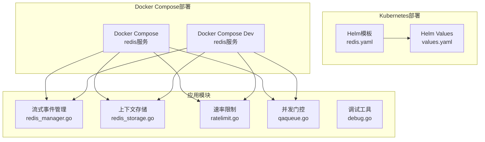
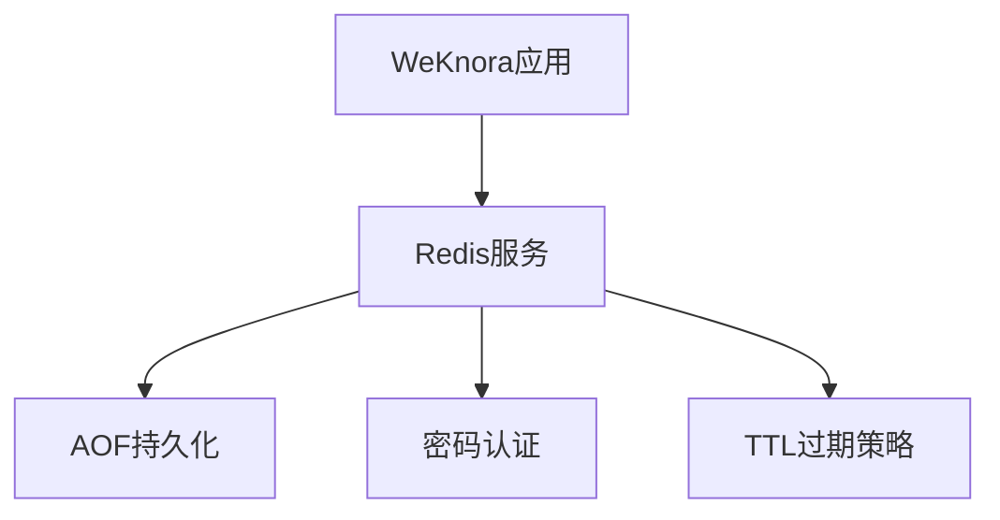
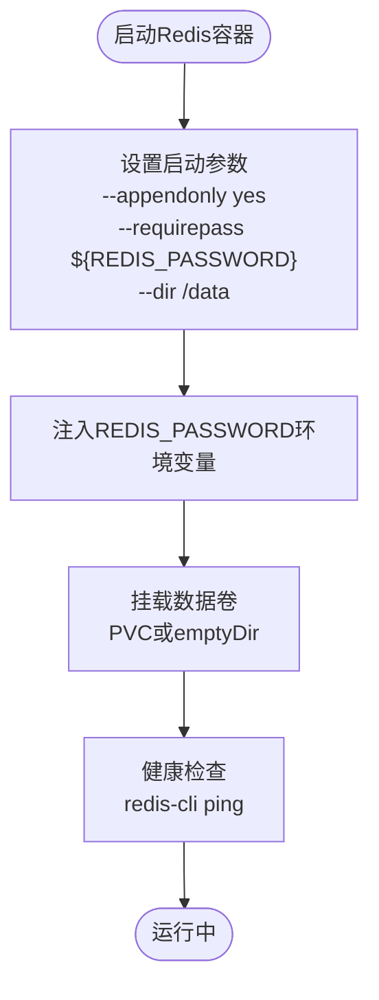
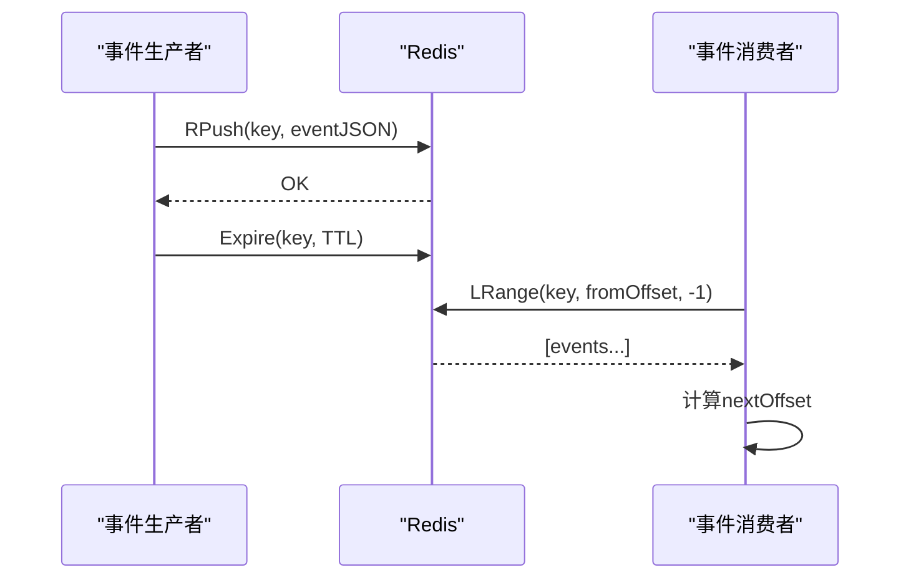
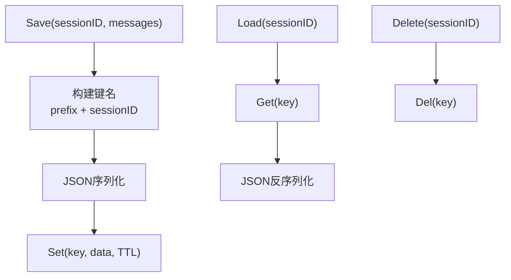
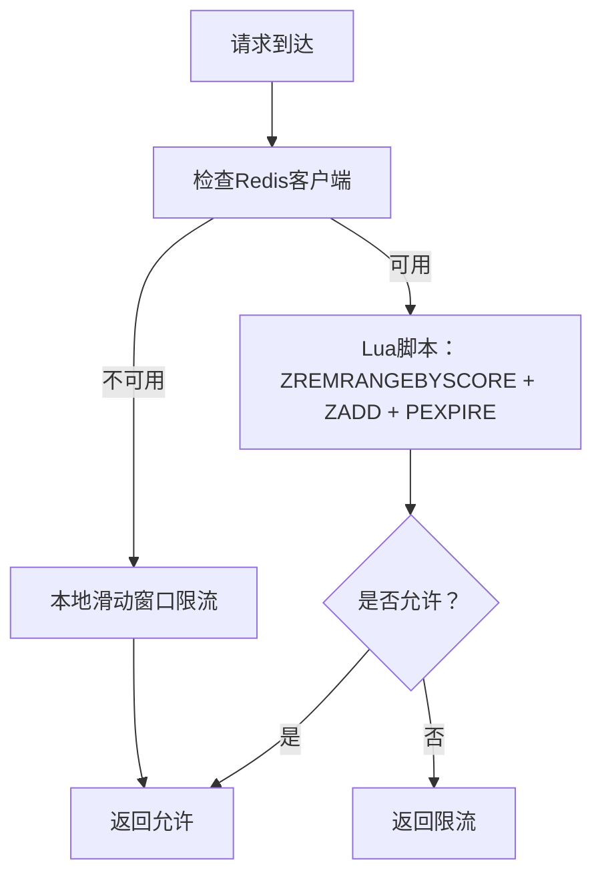
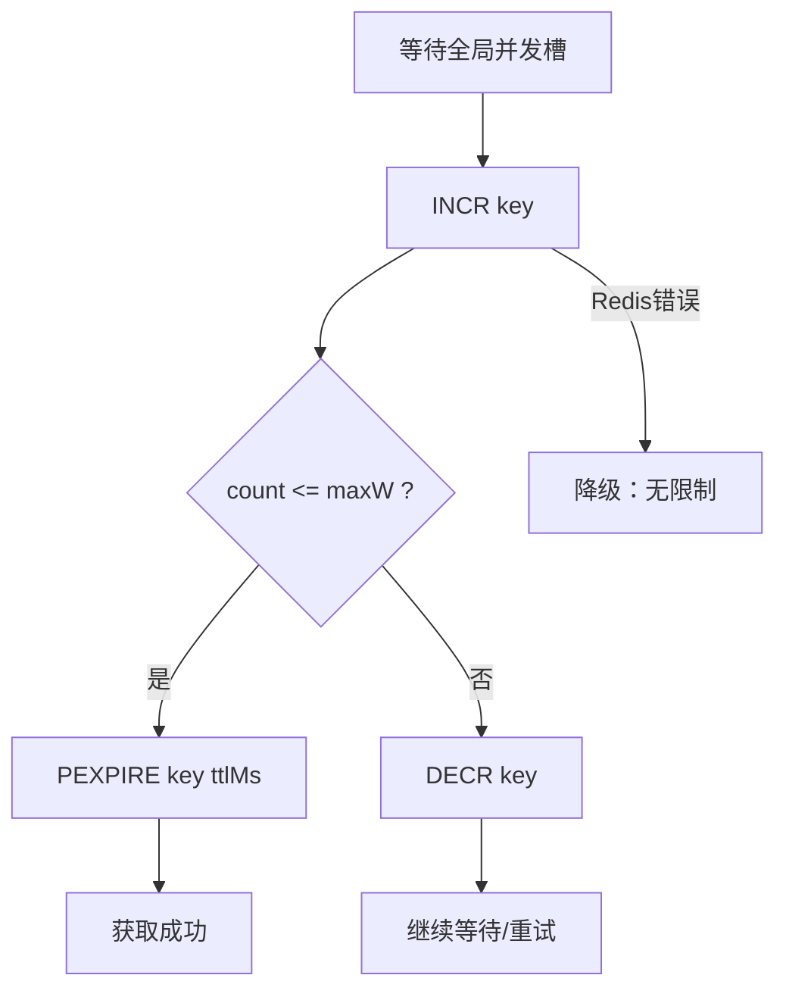
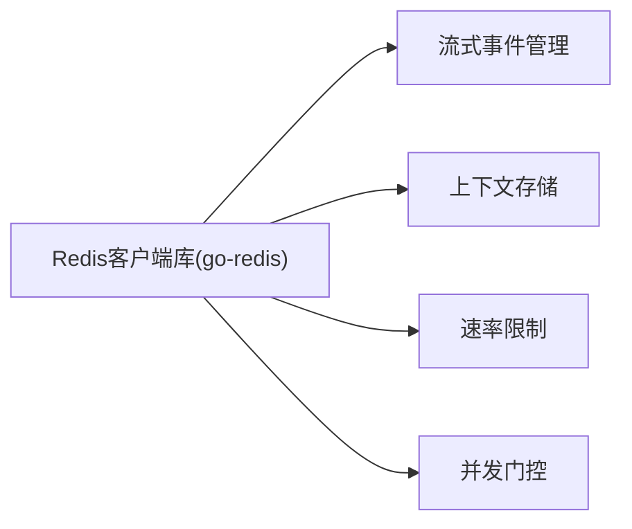

# Redis缓存服务部署

<cite>
**本文档引用的文件**
- [redis.yaml](file://helm/templates/redis.yaml)
- [values.yaml](file://helm/values.yaml)
- [docker-compose.yml](file://docker-compose.yml)
- [docker-compose.dev.yml](file://docker-compose.dev.yml)
- [redis_storage.go](file://internal/application/service/llmcontext/redis_storage.go)
- [redis_manager.go](file://internal/stream/redis_manager.go)
- [ratelimit.go](file://internal/im/ratelimit.go)
- [qaqueue.go](file://internal/im/qaqueue.go)
- [debug.go](file://internal/utils/debug.go)
</cite>

## 目录
1. [简介](#简介)
2. [项目结构](#项目结构)
3. [核心组件](#核心组件)
4. [架构总览](#架构总览)
5. [详细组件分析](#详细组件分析)
6. [依赖关系分析](#依赖关系分析)
7. [性能考虑](#性能考虑)
8. [故障排查指南](#故障排查指南)
9. [结论](#结论)

## 简介
本文件为WeKnora项目的Redis缓存服务部署与运维指南，覆盖容器化部署、配置参数、持久化策略、内存优化、认证与安全、监控与故障排查等内容。WeKnora通过Redis实现流式事件管理、异步任务队列、速率限制、全局并发门控、上下文存储等关键能力，确保高并发场景下的稳定性与一致性。

## 项目结构
WeKnora的Redis相关部署与使用分布在以下位置：
- Helm模板：定义Kubernetes中的Redis部署与服务
- Docker Compose：定义单机开发/测试环境中的Redis服务
- 应用代码：多个模块通过Redis实现流式事件、上下文存储、速率限制、并发控制等功能

**图表来源**
- [redis.yaml:1-125](file://helm/templates/redis.yaml#L1-L125)
- [values.yaml:286-341](file://helm/values.yaml#L286-L341)
- [docker-compose.yml:222-229](file://docker-compose.yml#L222-L229)
- [docker-compose.dev.yml:26-36](file://docker-compose.dev.yml#L26-L36)

**章节来源**
- [redis.yaml:1-125](file://helm/templates/redis.yaml#L1-L125)
- [values.yaml:286-341](file://helm/values.yaml#L286-L341)
- [docker-compose.yml:222-229](file://docker-compose.yml#L222-L229)
- [docker-compose.dev.yml:26-36](file://docker-compose.dev.yml#L26-L36)

## 核心组件
- 流式事件管理：使用Redis列表实现事件追加与增量拉取，支持TTL过期控制
- 上下文存储：使用Redis键值对存储会话消息，支持TTL过期与JSON序列化
- 速率限制：使用Redis有序集合实现分布式滑动窗口限流
- 并发门控：使用Redis原子计数与过期策略实现全局并发上限控制
- 调试工具：提供清理过期任务键、检查运行中任务状态等运维能力

**章节来源**
- [redis_manager.go:1-138](file://internal/stream/redis_manager.go#L1-L138)
- [redis_storage.go:1-113](file://internal/application/service/llmcontext/redis_storage.go#L1-L113)
- [ratelimit.go:1-200](file://internal/im/ratelimit.go#L1-L200)
- [qaqueue.go:291-333](file://internal/im/qaqueue.go#L291-L333)
- [debug.go:1-51](file://internal/utils/debug.go#L1-L51)

## 架构总览
WeKnora在不同环境中通过Redis实现统一的缓存与队列能力：
- Kubernetes：Helm模板部署单实例Redis，启用AOF持久化与密码认证
- Docker Compose：单机部署Redis，启用AOF与密码认证，支持开发与生产两种模式

**图表来源**
- [redis.yaml:43-50](file://helm/templates/redis.yaml#L43-L50)
- [values.yaml:372-403](file://helm/values.yaml#L372-L403)
- [docker-compose.yml:223-226](file://docker-compose.yml#L223-L226)

**章节来源**
- [redis.yaml:43-50](file://helm/templates/redis.yaml#L43-L50)
- [values.yaml:372-403](file://helm/values.yaml#L372-L403)
- [docker-compose.yml:223-226](file://docker-compose.yml#L223-L226)

## 详细组件分析

### Redis容器配置与持久化
- 镜像与版本：Helm默认使用redis:7-alpine，Docker Compose使用redis:7.0-alpine
- 启动参数：启用AOF持久化，设置数据目录，要求密码认证
- 密码注入：通过Kubernetes Secret注入REDIS_PASSWORD环境变量
- 存储卷：支持PVC或emptyDir，生产建议PVC
- 健康检查：通过redis-cli执行ping命令进行存活与就绪探针

**图表来源**
- [redis.yaml:43-50](file://helm/templates/redis.yaml#L43-L50)
- [redis.yaml:51-56](file://helm/templates/redis.yaml#L51-L56)
- [redis.yaml:86-93](file://helm/templates/redis.yaml#L86-L93)
- [redis.yaml:66-85](file://helm/templates/redis.yaml#L66-L85)

**章节来源**
- [redis.yaml:43-50](file://helm/templates/redis.yaml#L43-L50)
- [redis.yaml:51-56](file://helm/templates/redis.yaml#L51-L56)
- [redis.yaml:86-93](file://helm/templates/redis.yaml#L86-L93)
- [redis.yaml:66-85](file://helm/templates/redis.yaml#L66-L85)

### 流式事件管理（Redis Lists）
- 实现：基于Redis列表的RPush追加与LRange增量拉取
- 键命名：使用前缀+会话ID+消息ID的复合键
- TTL策略：每次追加事件后刷新键的过期时间
- 适用场景：实时事件流、增量消费、临时事件缓冲

**图表来源**
- [redis_manager.go:57-87](file://internal/stream/redis_manager.go#L57-L87)
- [redis_manager.go:89-129](file://internal/stream/redis_manager.go#L89-L129)

**章节来源**
- [redis_manager.go:1-138](file://internal/stream/redis_manager.go#L1-L138)

### 上下文存储（Redis键值对）
- 实现：使用Set存储JSON序列化的消息数组，Del删除键，Get反序列化
- TTL策略：保存时设置TTL，默认24小时
- 前缀：默认context:，可自定义
- 适用场景：会话上下文缓存、消息历史存储

**图表来源**
- [redis_storage.go:49-98](file://internal/application/service/llmcontext/redis_storage.go#L49-L98)

**章节来源**
- [redis_storage.go:1-113](file://internal/application/service/llmcontext/redis_storage.go#L1-L113)

### 速率限制（Redis ZSET滑动窗口）
- 实现：Lua脚本原子操作ZSET，清理过期成员并判断是否允许请求
- 参数：窗口大小、最大请求数、唯一成员标识（实例ID+时间戳）
- 回退：Redis不可用时降级为本地滑动窗口限流
- 适用场景：跨实例的统一速率限制

**图表来源**
- [ratelimit.go:25-51](file://internal/im/ratelimit.go#L25-L51)
- [ratelimit.go:74-99](file://internal/im/ratelimit.go#L74-L99)

**章节来源**
- [ratelimit.go:1-200](file://internal/im/ratelimit.go#L1-L200)

### 并发门控（Redis全局并发上限）
- 实现：使用INCR原子递增计数，PEXPIRE安全过期，DECR回滚
- 参数：最大并发数、TTL毫秒数
- 行为：Redis错误时降级为无限制，避免阻塞工作线程
- 适用场景：全局并发控制、削峰填谷

**图表来源**
- [qaqueue.go:291-310](file://internal/im/qaqueue.go#L291-L310)
- [qaqueue.go:312-333](file://internal/im/qaqueue.go#L312-L333)

**章节来源**
- [qaqueue.go:291-333](file://internal/im/qaqueue.go#L291-L333)

### 调试与运维工具
- 清理过期任务：扫描匹配前缀的键，检查TTL并删除过期或异常键
- 状态检查：辅助诊断运行中任务状态，便于维护与排障

**章节来源**
- [debug.go:1-51](file://internal/utils/debug.go#L1-L51)

## 依赖关系分析
- 应用模块依赖Redis客户端库进行连接与操作
- 流式事件管理与上下文存储共享相同的Redis连接配置
- 速率限制与并发门控均依赖Redis的原子Lua脚本能力
- Docker Compose与Helm模板在部署层面保持一致的Redis行为

**图表来源**
- [redis_manager.go:10-11](file://internal/stream/redis_manager.go#L10-L11)
- [redis_storage.go:11-11](file://internal/application/service/llmcontext/redis_storage.go#L11-L11)
- [ratelimit.go:9-9](file://internal/im/ratelimit.go#L9-L9)
- [qaqueue.go:9-9](file://internal/im/qaqueue.go#L9-L9)

**章节来源**
- [redis_manager.go:1-138](file://internal/stream/redis_manager.go#L1-L138)
- [redis_storage.go:1-113](file://internal/application/service/llmcontext/redis_storage.go#L1-L113)
- [ratelimit.go:1-200](file://internal/im/ratelimit.go#L1-L200)
- [qaqueue.go:1-200](file://internal/im/qaqueue.go#L1-L200)

## 性能考虑
- 连接池与超时：应用侧应合理配置连接池大小与超时参数，避免阻塞
- 键设计：采用前缀+业务维度的复合键，便于管理与清理
- TTL策略：根据业务生命周期设置合理的TTL，避免内存膨胀
- Lua脚本：优先使用原子Lua脚本减少往返开销
- AOF与RDB：生产环境建议开启AOF持久化，结合合适的fsync策略平衡性能与可靠性
- 内存优化：关注热点键与大对象，必要时拆分键或压缩数据

## 故障排查指南
- 连接失败
  - 检查REDIS_PASSWORD是否正确注入
  - 确认Redis服务可达且端口开放
  - 查看应用日志中的连接错误信息
- 数据丢失或异常
  - 核对AOF是否启用且数据目录挂载正确
  - 检查TTL设置是否过短导致提前过期
- 性能问题
  - 使用调试工具清理异常键
  - 分析热点键与慢查询
  - 调整Lua脚本与键设计
- 并发控制失效
  - 检查Redis可用性与Lua脚本执行结果
  - 观察降级路径是否被触发

**章节来源**
- [redis.yaml:66-85](file://helm/templates/redis.yaml#L66-L85)
- [debug.go:1-51](file://internal/utils/debug.go#L1-L51)

## 结论
WeKnora通过Redis实现了高可用的缓存与队列能力，涵盖流式事件、上下文存储、速率限制与并发控制等关键场景。生产部署建议采用Helm模板，启用AOF持久化与密码认证，并结合合理的TTL与键设计提升性能与稳定性。运维方面可通过调试工具与健康检查保障系统可靠运行。