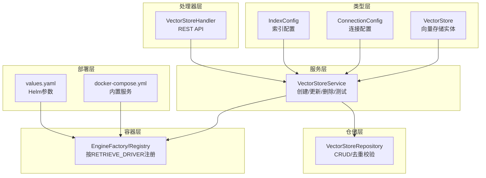
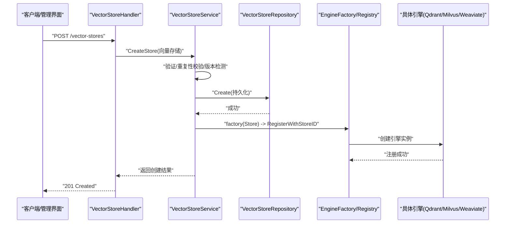
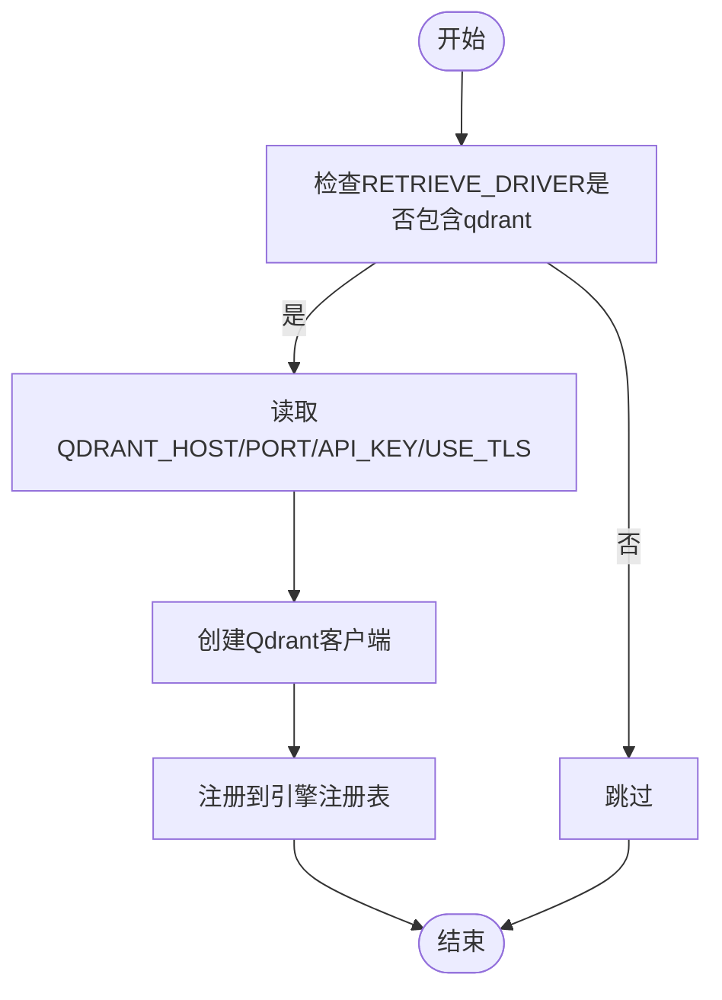
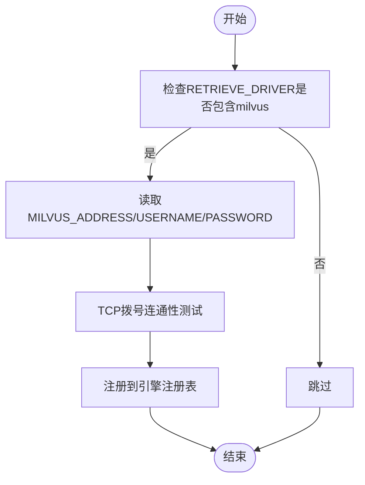
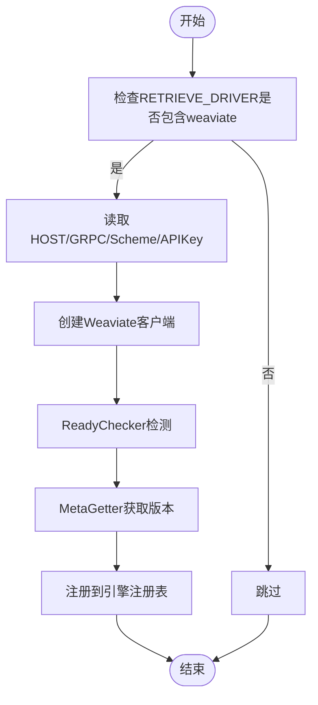
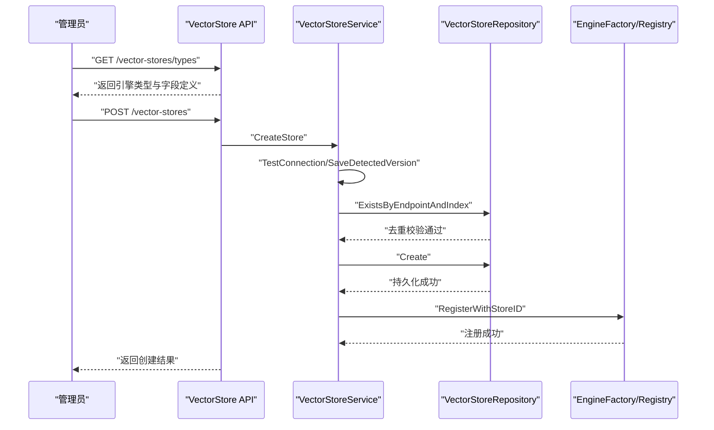
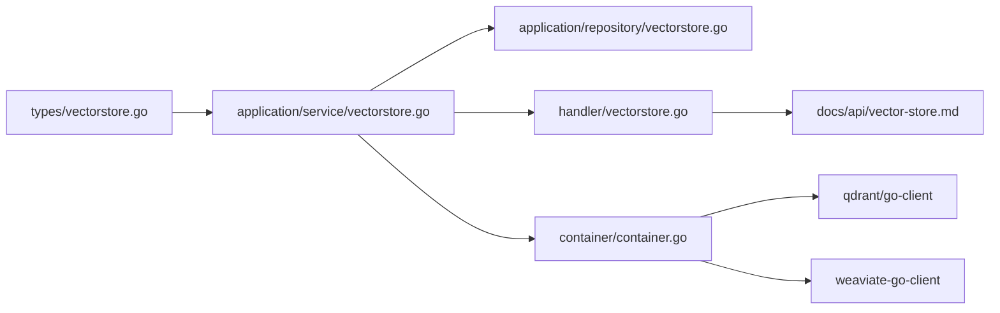

# 向量数据库部署

<cite>
**本文档引用的文件**
- [vectorstore.go](file://internal/types/vectorstore.go)
- [vectorstore.go](file://internal/application/service/vectorstore.go)
- [vectorstore_healthcheck.go](file://internal/application/service/vectorstore_healthcheck.go)
- [vectorstore.go](file://internal/handler/vectorstore.go)
- [vectorstore.go](file://internal/application/repository/vectorstore.go)
- [container.go](file://internal/container/container.go)
- [docker-compose.yml](file://docker-compose.yml)
- [docker-compose.dev.yml](file://docker-compose.dev.yml)
- [values.yaml](file://helm/values.yaml)
- [Chart.yaml](file://helm/Chart.yaml)
- [vector-store.md](file://docs/api/vector-store.md)
- [000032_vector_stores.up.sql](file://migrations/versioned/000032_vector_stores.up.sql)
- [000032_vector_stores.down.sql](file://migrations/versioned/000032_vector_stores.down.sql)
</cite>

## 目录
1. [简介](#简介)
2. [项目结构](#项目结构)
3. [核心组件](#核心组件)
4. [架构总览](#架构总览)
5. [详细组件分析](#详细组件分析)
6. [依赖关系分析](#依赖关系分析)
7. [性能考虑](#性能考虑)
8. [故障排查指南](#故障排查指南)
9. [结论](#结论)
10. [附录](#附录)

## 简介
本文件面向向量数据库管理员与AI工程师，提供WeKnora平台多后端向量存储的完整部署与运维指南。内容覆盖Qdrant、Milvus、Weaviate三种容器化向量数据库的部署策略、索引配置、查询优化与性能调优，并阐述向量检索系统如何通过统一的向量存储配置接口对接不同后端，以及连接管理、数据同步与健康检查机制。同时给出高可用部署建议、集群配置要点与数据备份策略，帮助读者构建稳定可靠的向量检索基础设施。

## 项目结构
WeKnora通过统一的向量存储类型与服务层抽象，屏蔽不同向量数据库的差异，实现“一次配置、多后端生效”。关键结构包括：
- 类型层：定义向量存储实体、连接配置与索引配置
- 服务层：提供创建、更新、删除、连接测试与版本检测
- 仓储层：负责租户维度的向量存储CRUD与重复性校验
- 处理器层：提供REST API以供前端或管理界面操作
- 容器层：在应用启动时根据环境变量动态注册对应引擎
- 部署层：提供Docker Compose与Helm两种部署方式，内置Qdrant、Milvus、Weaviate等服务

**图表来源**
- [vectorstore.go:30-50](file://internal/types/vectorstore.go#L30-L50)
- [vectorstore.go:16-34](file://internal/application/service/vectorstore.go#L16-L34)
- [vectorstore.go:12-20](file://internal/application/repository/vectorstore.go#L12-L20)
- [vectorstore.go:15-27](file://internal/handler/vectorstore.go#L15-L27)
- [container.go:836-877](file://internal/container/container.go#L836-L877)
- [docker-compose.yml:90-129](file://docker-compose.yml#L90-L129)
- [values.yaml:88-101](file://helm/values.yaml#L88-L101)

**章节来源**
- [vectorstore.go:30-50](file://internal/types/vectorstore.go#L30-L50)
- [vectorstore.go:16-34](file://internal/application/service/vectorstore.go#L16-L34)
- [vectorstore.go:12-20](file://internal/application/repository/vectorstore.go#L12-L20)
- [vectorstore.go:15-27](file://internal/handler/vectorstore.go#L15-L27)
- [container.go:836-877](file://internal/container/container.go#L836-L877)
- [docker-compose.yml:90-129](file://docker-compose.yml#L90-L129)
- [values.yaml:88-101](file://helm/values.yaml#L88-L101)

## 核心组件
- 向量存储实体与配置
  - 向量存储实体包含唯一ID、租户ID、名称、引擎类型、连接配置与索引配置等字段，并提供校验逻辑与敏感字段掩码能力。
  - 连接配置支持通用字段与各引擎特有字段（如Qdrant的host/port/use_tls、Weaviate的grpc_address/scheme、Milvus的addr/username/password等）。
  - 索引配置支持通用字段（如ES的index_name、shards/replicas）与各引擎可扩展字段（Qdrant的shard_number/replication_factor、Milvus的shards_num/replica_number、Weaviate的desired_shard_count/replication_factor）。
- 服务层
  - 提供创建、更新、删除、连接测试与版本检测能力；在创建时进行重复性校验与版本自动检测，并将成功实例注册到运行时引擎注册表。
- 仓储层
  - 实现租户维度的CRUD与重复性校验（基于连接端点与索引名组合判断）。
- 处理器层
  - 提供REST API：创建/列出/获取/更新/删除向量存储，以及连接测试与类型枚举。
- 容器层
  - 根据RETRIEVE_DRIVER环境变量动态注册对应引擎（如qdrant、milvus、weaviate），并建立连接客户端。

**章节来源**
- [vectorstore.go:30-50](file://internal/types/vectorstore.go#L30-L50)
- [vectorstore.go:101-121](file://internal/types/vectorstore.go#L101-L121)
- [vectorstore.go:203-236](file://internal/types/vectorstore.go#L203-L236)
- [vectorstore.go:36-99](file://internal/application/service/vectorstore.go#L36-L99)
- [vectorstore.go:78-101](file://internal/application/repository/vectorstore.go#L78-L101)
- [vectorstore.go:78-173](file://internal/handler/vectorstore.go#L78-L173)
- [container.go:836-877](file://internal/container/container.go#L836-L877)

## 架构总览
WeKnora的向量检索架构通过统一的向量存储配置接口对接多种后端，形成“配置即服务”的能力。下图展示了从API到引擎注册的整体流程：

**图表来源**
- [vectorstore.go:94-128](file://internal/handler/vectorstore.go#L94-L128)
- [vectorstore.go:36-99](file://internal/application/service/vectorstore.go#L36-L99)
- [vectorstore.go:22-25](file://internal/application/repository/vectorstore.go#L22-L25)
- [container.go:836-877](file://internal/container/container.go#L836-L877)

**章节来源**
- [vectorstore.go:94-128](file://internal/handler/vectorstore.go#L94-L128)
- [vectorstore.go:36-99](file://internal/application/service/vectorstore.go#L36-L99)
- [container.go:836-877](file://internal/container/container.go#L836-L877)

## 详细组件分析

### Qdrant 部署与配置
- 容器配置
  - Docker Compose中提供独立的qdrant服务，包含REST与gRPC端口映射、持久化卷与健康检查。
  - 应用侧通过环境变量QDRANT_HOST/QDRANT_PORT/QDRANT_API_KEY/QDRANT_USE_TLS控制连接。
- 引擎注册
  - 容器启动时根据RETRIEVE_DRIVER包含"qdrant"时，读取环境变量并创建Qdrant客户端，随后注册到检索引擎注册表。
- 索引与副本
  - 索引配置支持collection_prefix、shard_number与replication_factor等字段，分别对应集合前缀、分片数与副本因子。
- 查询优化与性能调优
  - 建议结合replication_factor提升查询并发与容错能力；合理设置shard_number平衡写入吞吐与查询延迟。
  - 使用API测试连接以确认版本与可用性，避免因版本不匹配导致的协议错误。

**图表来源**
- [container.go:836-877](file://internal/container/container.go#L836-L877)
- [docker-compose.yml:299-312](file://docker-compose.yml#L299-L312)
- [vectorstore.go:503-516](file://internal/types/vectorstore.go#L503-L516)

**章节来源**
- [container.go:836-877](file://internal/container/container.go#L836-L877)
- [docker-compose.yml:299-312](file://docker-compose.yml#L299-L312)
- [vectorstore.go:503-516](file://internal/types/vectorstore.go#L503-L516)

### Milvus 部署与配置
- 容器配置
  - Docker Compose提供独立milvus服务，以standalone模式运行，包含健康检查与持久化卷。
  - 应用侧通过MILVUS_ADDRESS/MILVUS_USERNAME/MILVUS_PASSWORD控制连接。
- 引擎注册
  - 当RETRIEVE_DRIVER包含"milvus"时，容器层读取环境变量并创建Milvus连接，随后注册到检索引擎注册表。
- 索引与副本
  - 索引配置支持collection_name、shards_num与replica_number，分别对应集合名、写入并行度与内存副本数量。
- 查询优化与性能调优
  - 合理设置shards_num提升写入并行度；replica_number影响读取HA与内存占用。
  - 建议使用TCP拨号进行连接测试，避免命名空间冲突导致的SDK加载问题。

**图表来源**
- [container.go:836-877](file://internal/container/container.go#L836-L877)
- [docker-compose.yml:314-341](file://docker-compose.yml#L314-L341)
- [vectorstore.go:518-530](file://internal/types/vectorstore.go#L518-L530)

**章节来源**
- [container.go:836-877](file://internal/container/container.go#L836-L877)
- [docker-compose.yml:314-341](file://docker-compose.yml#L314-L341)
- [vectorstore.go:518-530](file://internal/types/vectorstore.go#L518-L530)

### Weaviate 部署与配置
- 容器配置
  - Docker Compose提供独立weaviate服务，包含HTTP与gRPC端口映射、持久化卷与健康检查。
  - 应用侧通过WEAVIATE_HOST/WEAVIATE_GRPC_ADDRESS/WEAVIATE_SCHEME/WEAVIATE_API_KEY控制连接。
- 引擎注册
  - 当RETRIEVE_DRIVER包含"weaviate"时，容器层读取环境变量并创建Weaviate客户端，随后注册到检索引擎注册表。
- 索引与副本
  - 索引配置支持collection_prefix、desired_shard_count与replication_factor，分别对应集合前缀、期望分片数与副本因子。
- 查询优化与性能调优
  - 通过desired_shard_count与replication_factor平衡查询吞吐与容错；启用API Key认证时确保scheme正确。
  - 建议使用ReadyChecker与MetaGetter进行健康检查与版本检测。

**图表来源**
- [container.go:836-877](file://internal/container/container.go#L836-L877)
- [docker-compose.yml:342-363](file://docker-compose.yml#L342-L363)
- [vectorstore.go:532-545](file://internal/types/vectorstore.go#L532-L545)

**章节来源**
- [container.go:836-877](file://internal/container/container.go#L836-L877)
- [docker-compose.yml:342-363](file://docker-compose.yml#L342-L363)
- [vectorstore.go:532-545](file://internal/types/vectorstore.go#L532-L545)

### PostgreSQL/SQLite（作为向量存储）
- 适用场景
  - PostgreSQL/SQLite作为向量存储时，通常用于默认数据库连接或轻量级场景；通过UseDefaultConnection启用。
- 配置要点
  - PostgreSQL：当UseDefaultConnection=true时，无需额外地址；版本检测依赖默认数据库连接。
  - SQLite：文件型数据库，无需远程连接测试。
- 高可用与备份
  - 建议使用ParadeDB/PostgreSQL主从复制与定期快照；SQLite适合单实例或嵌入式场景。

**章节来源**
- [vectorstore.go:117-121](file://internal/types/vectorstore.go#L117-L121)
- [vectorstore_healthcheck.go:95-124](file://internal/application/service/vectorstore_healthcheck.go#L95-L124)

### 向量检索系统集成与连接管理
- 连接管理
  - 服务层在创建向量存储时执行连接测试与版本检测，确保引擎可用性；测试通过后将实例注册到运行时注册表。
- 数据同步
  - 仓储层提供重复性校验（基于连接端点与索引名），避免同一后端被重复注册。
- API与UI
  - 提供统一的向量存储API，支持类型枚举、连接测试与列表展示，便于前端生成配置表单。

**图表来源**
- [vector-store.md:1-29](file://docs/api/vector-store.md#L1-L29)
- [vectorstore.go:341-353](file://internal/handler/vectorstore.go#L341-L353)
- [vectorstore.go:36-99](file://internal/application/service/vectorstore.go#L36-L99)
- [vectorstore.go:78-101](file://internal/application/repository/vectorstore.go#L78-L101)

**章节来源**
- [vector-store.md:1-29](file://docs/api/vector-store.md#L1-L29)
- [vectorstore.go:341-353](file://internal/handler/vectorstore.go#L341-L353)
- [vectorstore.go:36-99](file://internal/application/service/vectorstore.go#L36-L99)
- [vectorstore.go:78-101](file://internal/application/repository/vectorstore.go#L78-L101)

## 依赖关系分析
- 组件耦合
  - 类型层与服务层强相关：服务层依赖类型层的校验与配置；仓储层依赖类型层的JSON字段序列化。
  - 处理器层依赖服务层；容器层依赖服务层创建的引擎实例并注册到注册表。
- 外部依赖
  - Qdrant：go-client
  - Weaviate：go-client v5
  - Milvus：通过TCP拨号进行连通性测试，避免命名空间冲突
- 循环依赖
  - 代码结构清晰，未发现循环依赖；类型层仅承载数据结构与校验，不包含业务逻辑。

**图表来源**
- [vectorstore.go:30-50](file://internal/types/vectorstore.go#L30-L50)
- [vectorstore.go:16-34](file://internal/application/service/vectorstore.go#L16-L34)
- [vectorstore.go:12-20](file://internal/application/repository/vectorstore.go#L12-L20)
- [vectorstore.go:15-27](file://internal/handler/vectorstore.go#L15-L27)
- [container.go:836-877](file://internal/container/container.go#L836-L877)
- [vector-store.md:1-29](file://docs/api/vector-store.md#L1-L29)

**章节来源**
- [vectorstore.go:30-50](file://internal/types/vectorstore.go#L30-L50)
- [vectorstore.go:16-34](file://internal/application/service/vectorstore.go#L16-L34)
- [vectorstore.go:12-20](file://internal/application/repository/vectorstore.go#L12-L20)
- [vectorstore.go:15-27](file://internal/handler/vectorstore.go#L15-L27)
- [container.go:836-877](file://internal/container/container.go#L836-L877)
- [vector-store.md:1-29](file://docs/api/vector-store.md#L1-L29)

## 性能考虑
- 索引与副本参数
  - Qdrant：shard_number与replication_factor直接影响查询吞吐与容错；建议根据数据规模与查询负载调整。
  - Milvus：shards_num提升写入并行度，replica_number影响读取HA与内存占用。
  - Weaviate：desired_shard_count与replication_factor平衡查询并发与副本数。
- 查询优化
  - 合理设置TopK与阈值，避免返回过多候选；在PostgreSQL场景中，针对HNSW参数进行GUC覆盖以优化查询性能。
- 连接与健康检查
  - 使用短超时的连接测试避免阻塞；对Milvus采用TCP拨号进行快速连通性验证。
- 批量插入
  - 建议分批提交、控制并发度；在Milvus中合理设置shards_num以提升写入并行度。

**章节来源**
- [vectorstore.go:203-236](file://internal/types/vectorstore.go#L203-L236)
- [vectorstore_healthcheck.go:155-177](file://internal/application/service/vectorstore_healthcheck.go#L155-L177)
- [repository.go:430-462](file://internal/application/repository/retriever/postgres/repository.go#L430-L462)

## 故障排查指南
- 常见问题
  - 连接失败：检查RETRIEVE_DRIVER与对应环境变量（QDRANT_HOST/PORT/API_KEY/USE_TLS、MILVUS_ADDRESS/USERNAME/PASSWORD、WEAVIATE_HOST/GRPC/Scheme/APIKey）。
  - 版本不匹配：使用连接测试接口检测服务器版本，避免SDK版本不兼容导致的协议错误。
  - 重复注册：确保同一后端的连接端点与索引名不重复。
- 排查步骤
  - 通过API获取支持的引擎类型与字段定义，核对前端表单配置。
  - 使用“测试连接”接口验证连通性与版本，必要时更新配置。
  - 查看容器日志与健康检查状态，定位服务异常原因。
- 回滚与恢复
  - 若注册失败，服务层记录警告并允许应用重启后自动恢复；数据库层面通过迁移脚本维护向量存储表结构。

**章节来源**
- [vectorstore.go:355-417](file://internal/handler/vectorstore.go#L355-L417)
- [vectorstore_healthcheck.go:25-50](file://internal/application/service/vectorstore_healthcheck.go#L25-L50)
- [docker-compose.yml:90-129](file://docker-compose.yml#L90-L129)

## 结论
WeKnora通过统一的向量存储配置与服务层抽象，实现了对Qdrant、Milvus、Weaviate等多种向量数据库的一致化接入。配合完善的连接测试、版本检测与注册机制，能够在不同部署环境中快速上线并稳定运行。建议在生产环境中结合业务负载合理设置索引与副本参数，完善备份与监控策略，确保向量检索系统的高可用与高性能。

## 附录

### A. 向量存储表结构与迁移
- 表结构
  - 向量存储表包含ID、租户ID、名称、引擎类型、连接配置与索引配置等字段，支持软删除与时间戳。
- 迁移
  - 提供向上/向下迁移脚本，确保表结构与应用版本一致。

**章节来源**
- [000032_vector_stores.up.sql](file://migrations/versioned/000032_vector_stores.up.sql)
- [000032_vector_stores.down.sql](file://migrations/versioned/000032_vector_stores.down.sql)

### B. 部署方式对比
- Docker Compose
  - 一键启动App、前端、向量数据库与辅助服务；适合开发与演示环境。
- Helm（Kubernetes）
  - 提供可配置的Values文件，支持生产级部署；可选择启用MinIO、Neo4j、Qdrant、Jaeger等可选组件。

**章节来源**
- [docker-compose.yml:1-613](file://docker-compose.yml#L1-L613)
- [docker-compose.dev.yml:1-420](file://docker-compose.dev.yml#L1-L420)
- [values.yaml:1-493](file://helm/values.yaml#L1-L493)
- [Chart.yaml:1-27](file://helm/Chart.yaml#L1-L27)