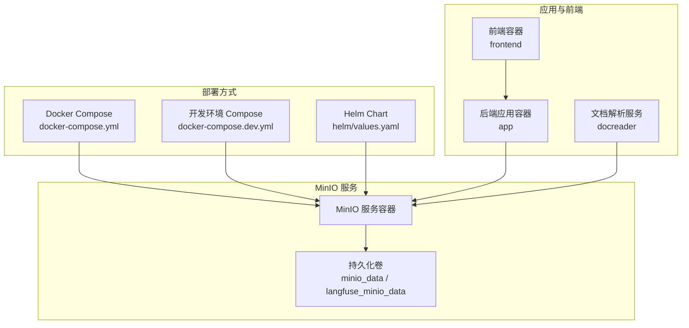
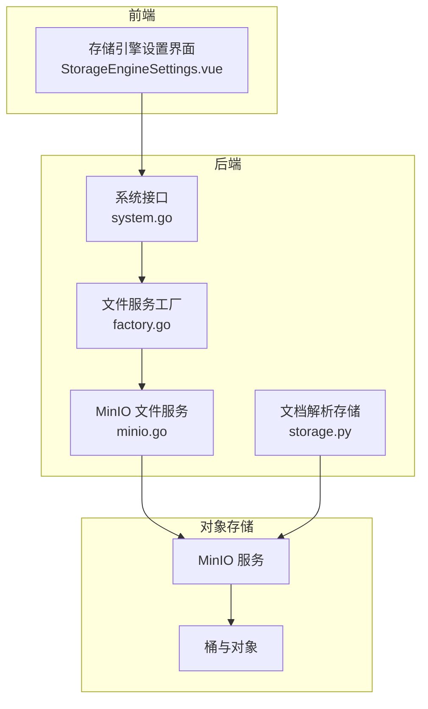
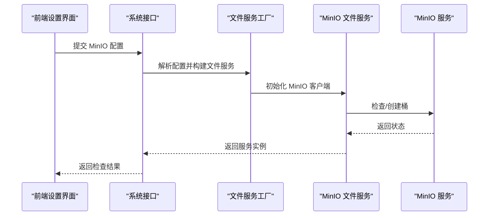
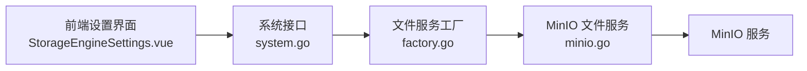

# 对象存储服务部署

<cite>
**本文档引用的文件**
- [docker-compose.yml](file://docker-compose.yml)
- [docker-compose.dev.yml](file://docker-compose.dev.yml)
- [values.yaml](file://helm/values.yaml)
- [minio.go](file://internal/application/service/file/minio.go)
- [factory.go](file://internal/application/service/file/factory.go)
- [storage.py](file://docreader/parser/storage.py)
- [StorageEngineSettings.vue](file://frontend/src/views/settings/StorageEngineSettings.vue)
- [system.go](file://internal/handler/system.go)
- [system.md](file://docs/api/system.md)
</cite>

## 目录
1. [简介](#简介)
2. [项目结构](#项目结构)
3. [核心组件](#核心组件)
4. [架构总览](#架构总览)
5. [详细组件分析](#详细组件分析)
6. [依赖关系分析](#依赖关系分析)
7. [性能考虑](#性能考虑)
8. [故障排查指南](#故障排查指南)
9. [结论](#结论)
10. [附录](#附录)

## 简介
本文件为 WeKnora 项目的对象存储服务部署指南，重点围绕 MinIO 容器化部署与集成进行系统化说明。内容涵盖：
- MinIO 容器配置参数与环境变量
- 桶权限与安全策略
- 作为文件存储后端的配置选项、访问控制与数据保护
- 与 WeKnora 文件上传下载功能的集成、认证与性能优化
- MinIO 集群部署、纠删码与备份策略建议
- 监控指标、容量管理与故障排查

## 项目结构
WeKnora 提供多种部署方式，其中 MinIO 通过 Docker Compose 与 Helm Chart 提供开箱即用的部署方案，并在应用层提供统一的文件服务抽象以适配不同存储后端。

图表来源
- [docker-compose.yml:230-251](file://docker-compose.yml#L230-L251)
- [docker-compose.dev.yml:38-59](file://docker-compose.dev.yml#L38-L59)
- [values.yaml:408-423](file://helm/values.yaml#L408-L423)

章节来源
- [docker-compose.yml:1-613](file://docker-compose.yml#L1-L613)
- [docker-compose.dev.yml:1-420](file://docker-compose.dev.yml#L1-L420)
- [values.yaml:408-423](file://helm/values.yaml#L408-L423)

## 核心组件
- MinIO 容器：提供 S3 兼容的对象存储服务，支持本地持久化与健康检查。
- 文件服务抽象：后端通过工厂模式根据配置选择存储后端（local/minio/cos/s3/oss/tos），统一接口实现上传、下载、删除与预签名链接生成。
- 文档解析模块：独立的 Python 服务，同样支持 MinIO 作为图片与临时文件的存储后端。
- 前端设置界面：允许用户在“Docker 模式”或“远程模式”下配置 MinIO 参数（端点、凭据、桶名、路径前缀、是否启用 SSL）。

章节来源
- [minio.go:1-201](file://internal/application/service/file/minio.go#L1-L201)
- [factory.go:14-131](file://internal/application/service/file/factory.go#L14-L131)
- [storage.py:132-235](file://docreader/parser/storage.py#L132-L235)
- [StorageEngineSettings.vue:146-234](file://frontend/src/views/settings/StorageEngineSettings.vue#L146-L234)

## 架构总览
WeKnora 的文件存储采用“应用层抽象 + 多后端适配”的设计，MinIO 作为可选后端之一，通过统一的文件服务接口与业务解耦。前端设置界面与后端系统接口共同完成 MinIO 的配置与连通性检测。

图表来源
- [StorageEngineSettings.vue:146-234](file://frontend/src/views/settings/StorageEngineSettings.vue#L146-L234)
- [system.go:652-676](file://internal/handler/system.go#L652-L676)
- [factory.go:52-74](file://internal/application/service/file/factory.go#L52-L74)
- [minio.go:20-61](file://internal/application/service/file/minio.go#L20-L61)
- [storage.py:132-177](file://docreader/parser/storage.py#L132-L177)

## 详细组件分析

### MinIO 容器配置与环境变量
- 端口映射：默认暴露 S3 API 端口与控制台端口，可通过环境变量覆盖。
- 认证：通过根用户与密码进行初始化，支持健康检查。
- 健康检查：对 Live 端点进行轮询，确保服务可用。
- 持久化：挂载卷至 /data，确保数据持久化。

章节来源
- [docker-compose.yml:230-251](file://docker-compose.yml#L230-L251)
- [docker-compose.dev.yml:38-59](file://docker-compose.dev.yml#L38-L59)
- [values.yaml:408-423](file://helm/values.yaml#L408-L423)

### MinIO 作为文件存储后端的集成
- 应用侧抽象：通过工厂方法根据配置选择 MinIO，读取端点、凭据、桶名与 SSL 设置。
- 连通性检测：在系统接口中对 MinIO 进行连通性检查，若指定桶不存在且允许自动创建，则尝试创建桶。
- 文件操作：支持保存文件、获取文件、删除文件与生成预签名下载链接。
- 文档解析侧：Python 文档解析模块同样支持 MinIO，自动创建桶并设置公开只读策略以便对象可被公开访问。

图表来源
- [system.go:652-676](file://internal/handler/system.go#L652-L676)
- [factory.go:52-74](file://internal/application/service/file/factory.go#L52-L74)
- [minio.go:42-81](file://internal/application/service/file/minio.go#L42-L81)

章节来源
- [factory.go:52-74](file://internal/application/service/file/factory.go#L52-L74)
- [minio.go:114-138](file://internal/application/service/file/minio.go#L114-L138)
- [minio.go:140-151](file://internal/application/service/file/minio.go#L140-L151)
- [minio.go:153-165](file://internal/application/service/file/minio.go#L153-L165)
- [minio.go:189-200](file://internal/application/service/file/minio.go#L189-L200)

### 桶权限与安全策略
- 自动创建与公开策略：当检测到桶不存在时，系统会自动创建桶，并设置公开只读策略，使对象可被公开访问。
- 路径前缀：支持为对象键添加路径前缀，便于组织与隔离命名空间。
- 预签名链接：生成带有效期的预签名下载链接，便于安全分发。

章节来源
- [minio.go:50-60](file://internal/application/service/file/minio.go#L50-L60)
- [minio.go:160-173](file://internal/application/service/file/minio.go#L160-L173)
- [minio.go:189-200](file://internal/application/service/file/minio.go#L189-L200)
- [storage.py:160-174](file://docreader/parser/storage.py#L160-L174)

### 认证与访问控制
- 凭据传递：前端设置界面支持在“远程模式”下直接输入端点、Access Key、Secret Key、桶名与 SSL 开关。
- 环境变量优先：在“Docker 模式”下，应用读取环境变量中的 MinIO 配置。
- 连通性测试：系统接口提供存储引擎连通性检查，支持自动创建桶并返回检查结果。

章节来源
- [StorageEngineSettings.vue:190-234](file://frontend/src/views/settings/StorageEngineSettings.vue#L190-L234)
- [factory.go:56-74](file://internal/application/service/file/factory.go#L56-L74)
- [system.md:171-202](file://docs/api/system.md#L171-L202)

### 数据保护机制
- 预签名链接：通过短期有效的预签名链接进行安全下载，降低直接暴露桶的风险。
- 路径前缀隔离：通过路径前缀实现租户与知识库级别的对象隔离。
- 自动创建桶：在连通性检查阶段自动创建桶，减少手工运维成本。

章节来源
- [minio.go:189-200](file://internal/application/service/file/minio.go#L189-L200)
- [minio.go:118-120](file://internal/application/service/file/minio.go#L118-L120)

### 性能优化
- 预签名链接有效期：默认 24 小时，可根据实际场景调整。
- 路径前缀与对象命名：通过 UUID 与租户/知识库维度命名，提升并发与检索效率。
- 健康检查与超时：客户端连接超时与检查超时配置，保障稳定性。

章节来源
- [minio.go:195](file://internal/application/service/file/minio.go#L195)
- [minio.go:66-81](file://internal/application/service/file/minio.go#L66-L81)

### MinIO 集群部署、纠删码与备份策略
- 集群与纠删码：MinIO 支持分布式集群与纠删码，建议在生产环境中使用纠删码以提升数据可靠性与磁盘利用率。
- 备份策略：建议结合对象版本控制与跨区域复制，定期导出关键元数据与策略信息，制定恢复演练计划。
- 本仓库提供的部署为单节点 MinIO，适用于开发与演示环境；生产环境请参考官方集群部署指南。

[本节为通用实践建议，不直接分析具体文件]

## 依赖关系分析
MinIO 在 WeKnora 中的依赖关系主要体现在应用层文件服务抽象与前端设置界面之间，二者通过系统接口与工厂模式解耦。

图表来源
- [StorageEngineSettings.vue:146-234](file://frontend/src/views/settings/StorageEngineSettings.vue#L146-L234)
- [system.go:652-676](file://internal/handler/system.go#L652-L676)
- [factory.go:52-74](file://internal/application/service/file/factory.go#L52-L74)
- [minio.go:20-61](file://internal/application/service/file/minio.go#L20-L61)

章节来源
- [factory.go:14-131](file://internal/application/service/file/factory.go#L14-L131)
- [minio.go:1-201](file://internal/application/service/file/minio.go#L1-L201)

## 性能考虑
- 预签名链接有效期：根据下载频率与安全性需求调整有效期。
- 路径前缀与对象命名：合理使用租户/知识库维度与 UUID，避免热点与长路径。
- 健康检查与超时：确保客户端连接超时与检查超时配置合理，避免长时间阻塞。
- 存储类型切换：通过环境变量与前端设置灵活切换存储类型，便于性能对比与优化。

[本节提供通用指导，不直接分析具体文件]

## 故障排查指南
- 连通性检查失败：确认端点、凭据、桶名与 SSL 设置正确；如提示桶不存在，可在系统接口中触发自动创建。
- 桶权限问题：确认桶策略为公开只读，确保对象可被公开访问。
- 前端设置不可用：检查 Docker 模式下的环境变量是否完整，或在远程模式下手动填写配置。
- 监控与日志：关注应用容器与 MinIO 容器的日志输出，定位错误原因。

章节来源
- [system.go:652-676](file://internal/handler/system.go#L652-L676)
- [minio.go:160-173](file://internal/application/service/file/minio.go#L160-L173)
- [StorageEngineSettings.vue:158-188](file://frontend/src/views/settings/StorageEngineSettings.vue#L158-L188)

## 结论
WeKnora 通过统一的文件服务抽象与系统接口，实现了对 MinIO 的无缝集成。在开发与演示环境中，单节点 MinIO 即可满足需求；在生产环境中，建议采用集群与纠删码，并完善备份与监控策略，以确保高可用与数据安全。

## 附录
- 系统接口：提供存储引擎连通性检查与桶列表查询能力。
- 前端设置：支持“Docker 模式”与“远程模式”，灵活配置 MinIO 参数。
- 文档解析：Python 文档解析模块同样支持 MinIO，便于文档处理与图片存储。

章节来源
- [system.md:171-212](file://docs/api/system.md#L171-L212)
- [StorageEngineSettings.vue:146-234](file://frontend/src/views/settings/StorageEngineSettings.vue#L146-L234)
- [storage.py:132-177](file://docreader/parser/storage.py#L132-L177)