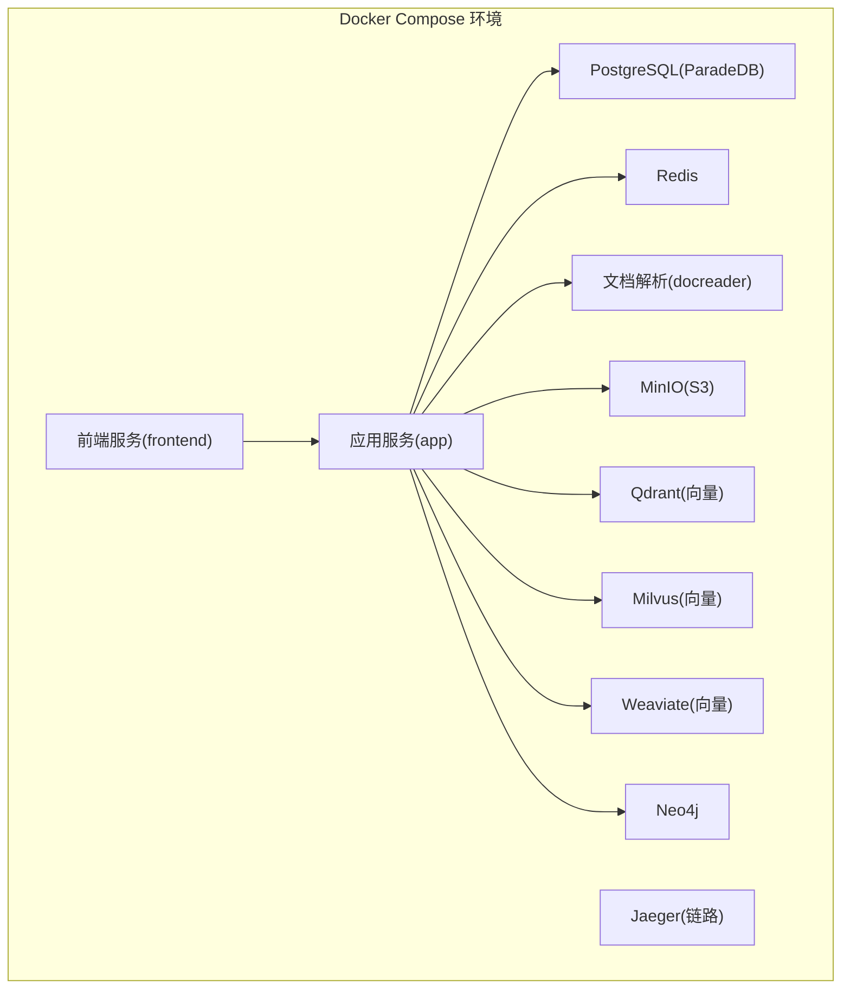
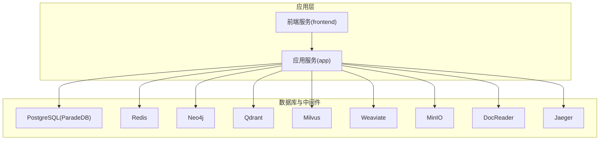
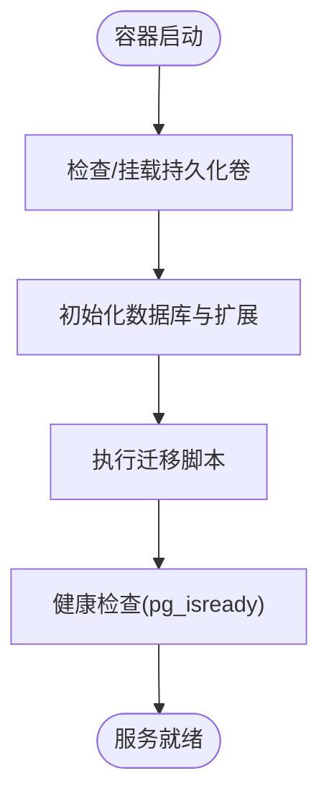
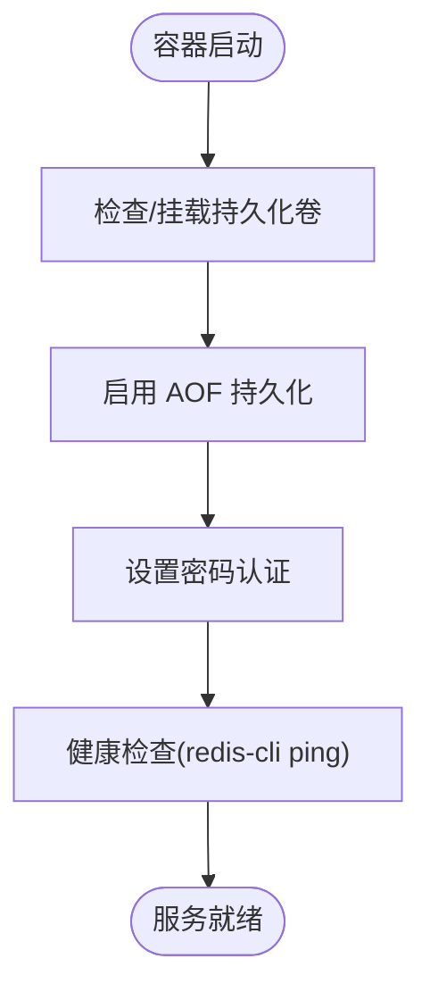
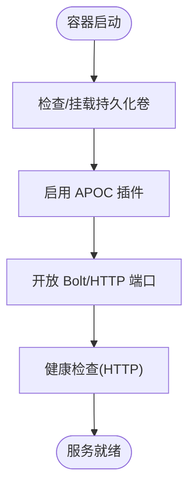
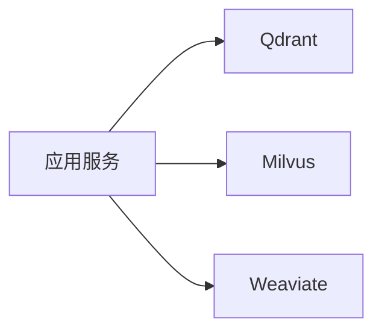
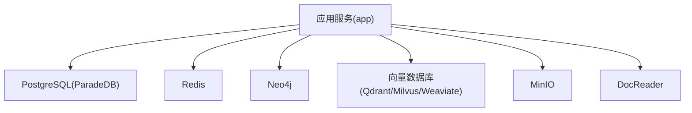

# 数据库服务部署

<cite>
**本文档引用的文件**
- [docker-compose.yml](file://docker-compose.yml)
- [docker-compose.dev.yml](file://docker-compose.dev.yml)
- [values.yaml](file://helm/values.yaml)
- [postgres.yaml](file://helm/templates/postgres.yaml)
- [redis.yaml](file://helm/templates/redis.yaml)
- [neo4j.yaml](file://helm/templates/neo4j.yaml)
- [migration.go](file://internal/database/migration.go)
- [migrate.sh](file://scripts/migrate.sh)
- [start_all.sh](file://scripts/start_all.sh)
- [docker-entrypoint.sh](file://scripts/docker-entrypoint.sh)
- [00-init-db.sql](file://migrations/paradedb/00-init-db.sql)
- [01-migrate-to-paradedb.sql](file://migrations/paradedb/01-migrate-to-paradedb.sql)
- [config.yaml](file://config/config.yaml)
</cite>

## 目录
1. [简介](#简介)
2. [项目结构](#项目结构)
3. [核心组件](#核心组件)
4. [架构总览](#架构总览)
5. [详细组件分析](#详细组件分析)
6. [依赖关系分析](#依赖关系分析)
7. [性能考虑](#性能考虑)
8. [故障排查指南](#故障排查指南)
9. [结论](#结论)
10. [附录](#附录)

## 简介
本文件为 WeKnora 数据库服务集群的完整 Docker 部署与运维指南，覆盖 PostgreSQL（ParadeDB）、Redis、Neo4j 等数据库容器的部署配置、数据持久化策略、初始化脚本与迁移管理、备份恢复机制、数据库间连接配置与网络通信、性能调优参数、资源限制与监控配置，以及高可用部署方案与故障转移策略。内容面向数据库管理员与 DevOps 工程师，提供从单机开发到生产级部署的全流程实践。

## 项目结构
WeKnora 采用 Docker Compose 与 Helm 双轨部署方案：
- Docker Compose：适用于本地开发与快速验证，提供一键启动核心数据库与服务。
- Helm：面向 Kubernetes 生产部署，提供声明式资源编排、持久化卷、安全上下文与弹性伸缩能力。

**图表来源**
- [docker-compose.yml:1-613](file://docker-compose.yml#L1-L613)

**章节来源**
- [docker-compose.yml:1-613](file://docker-compose.yml#L1-L613)
- [docker-compose.dev.yml:1-420](file://docker-compose.dev.yml#L1-L420)

## 核心组件
- PostgreSQL（ParadeDB）：提供向量检索与 BM25 全文搜索能力，支持中文分词与半精度向量索引。
- Redis：提供流式任务队列与缓存，启用 AOF 持久化与密码保护。
- Neo4j：用于知识图谱存储与查询，启用 APOC 插件与 Bolt/HTTP 端口。
- 向量数据库：支持 Qdrant、Milvus、Weaviate 等多种实现，满足不同场景需求。
- 文档解析：独立的 gRPC 服务，负责文档内容抽取与预处理。
- MinIO：S3 兼容对象存储，支持事件与媒体上传。
- Jaeger：分布式链路追踪，便于定位性能瓶颈与错误路径。

**章节来源**
- [docker-compose.yml:200-312](file://docker-compose.yml#L200-L312)
- [docker-compose.yml:278-364](file://docker-compose.yml#L278-L364)

## 架构总览
下图展示 WeKnora 数据库服务集群的容器交互与数据流向：

**图表来源**
- [docker-compose.yml:28-157](file://docker-compose.yml#L28-L157)
- [docker-compose.yml:200-312](file://docker-compose.yml#L200-L312)

## 详细组件分析

### PostgreSQL（ParadeDB）部署与持久化
- 镜像与版本：使用 ParadeDB 官方镜像，内置向量扩展与 BM25 全文搜索。
- 持久化：通过命名卷 postgres-data 实现数据持久化，避免容器重建丢失数据。
- 健康检查：基于 pg_isready 的健康检查，合理设置间隔、超时与重试，确保启动稳定性。
- 端口映射：默认 5432，可在开发环境通过环境变量调整。
- 初始化与迁移：配合应用启动时的迁移脚本，自动创建表结构与索引。

**图表来源**
- [docker-compose.yml:200-221](file://docker-compose.yml#L200-L221)
- [00-init-db.sql:1-215](file://migrations/paradedb/00-init-db.sql#L1-L215)

**章节来源**
- [docker-compose.yml:200-221](file://docker-compose.yml#L200-L221)
- [postgres.yaml:1-129](file://helm/templates/postgres.yaml#L1-L129)
- [00-init-db.sql:1-215](file://migrations/paradedb/00-init-db.sql#L1-L215)

### Redis 部署与持久化
- 镜像与版本：使用官方 Redis Alpine 镜像，启用 AOF 持久化与密码认证。
- 持久化：通过命名卷 redis-data 实现 RDB/AOF 持久化，保障数据安全。
- 健康检查：基于 redis-cli ping 的就绪探针，确保连接可用。
- 端口映射：默认 6379，支持外部访问与监控。

**图表来源**
- [docker-compose.yml:222-229](file://docker-compose.yml#L222-L229)
- [redis.yaml:1-125](file://helm/templates/redis.yaml#L1-L125)

**章节来源**
- [docker-compose.yml:222-229](file://docker-compose.yml#L222-L229)
- [redis.yaml:1-125](file://helm/templates/redis.yaml#L1-L125)

### Neo4j 部署与持久化
- 镜像与版本：使用官方 Neo4j 镜像，启用 APOC 插件以支持文件导入导出。
- 持久化：通过命名卷 neo4j-data 实现图数据持久化。
- 端口映射：Bolt 7687 与 HTTP 7474，便于客户端连接与 Web UI 访问。
- 健康检查：基于 HTTP GET 的就绪探针，确保服务可用。

**图表来源**
- [docker-compose.yml:278-297](file://docker-compose.yml#L278-L297)
- [neo4j.yaml:1-137](file://helm/templates/neo4j.yaml#L1-L137)

**章节来源**
- [docker-compose.yml:278-297](file://docker-compose.yml#L278-L297)
- [neo4j.yaml:1-137](file://helm/templates/neo4j.yaml#L1-L137)

### 向量数据库（Qdrant/Milvus/Weaviate）
- Qdrant：REST 与 gRPC 端口可配置，默认持久化至 qdrant_data。
- Milvus：单机模式，内置 etcd，持久化至 milvus_data。
- Weaviate：禁用模块化，持久化至 weaviate_data。

**图表来源**
- [docker-compose.yml:299-364](file://docker-compose.yml#L299-L364)

**章节来源**
- [docker-compose.yml:299-364](file://docker-compose.yml#L299-L364)

### 文档解析服务（DocReader）
- 独立 gRPC 服务，提供文档内容解析与图片提取。
- 健康检查：基于 gRPC 健康探针，确保服务可用。
- 持久化：临时目录挂载至 docreader-tmp，避免容器重建丢失中间结果。

**章节来源**
- [docker-compose.yml:173-198](file://docker-compose.yml#L173-L198)

### MinIO（S3 兼容存储）
- 提供对象存储能力，支持事件与媒体上传。
- 端口：默认 9000（API）与 9001（控制台）。
- 持久化：通过 minio_data 实现数据持久化。

**章节来源**
- [docker-compose.yml:230-251](file://docker-compose.yml#L230-L251)

### Jaeger（分布式追踪）
- 提供链路追踪与可观测性，端口映射覆盖 OTLP/HTTP/UDP。
- 持久化：通过 jaeger_data 实现数据持久化。

**章节来源**
- [docker-compose.yml:253-276](file://docker-compose.yml#L253-L276)

### 应用服务（App）与前端（Frontend）
- 应用服务：负责业务逻辑、数据库连接、向量检索与知识图谱集成。
- 前端服务：提供 Web 界面，代理后端 API。

**章节来源**
- [docker-compose.yml:2-26](file://docker-compose.yml#L2-L26)
- [docker-compose.yml:28-157](file://docker-compose.yml#L28-L157)

## 依赖关系分析
应用服务对数据库与中间件的依赖关系如下：

**图表来源**
- [docker-compose.yml:148-157](file://docker-compose.yml#L148-L157)

**章节来源**
- [docker-compose.yml:148-157](file://docker-compose.yml#L148-L157)

## 性能考虑
- PostgreSQL（ParadeDB）
  - 启用中文分词器与 BM25 索引，优化中文检索性能。
  - 半精度向量索引（hnsw）结合维度参数，平衡检索精度与性能。
  - 建议：根据数据规模调整共享内存与工作进程参数，启用连接池与只读副本。

- Redis
  - 启用 AOF 持久化与密码认证，兼顾可靠性与安全性。
  - 建议：根据并发量调整 maxmemory 与淘汰策略，开启 RDB 快照作为补充。

- Neo4j
  - 启用 APOC 插件，支持批量导入导出。
  - 建议：根据图规模调整 heap 与 page cache，启用 WAL 与备份策略。

- 向量数据库
  - Qdrant：合理设置段大小与复制因子，启用压缩与增量索引。
  - Milvus：单机模式适合开发测试，生产建议分布式部署。
  - Weaviate：禁用模块化减少开销，按需启用向量化模块。

- 网络与通信
  - 所有服务均在同一 Docker 网络内，容器间通过服务名互访，降低延迟。
  - 建议：在生产环境中启用 TLS 与网络策略，限制不必要的端口暴露。

[本节为通用性能建议，无需特定文件引用]

## 故障排查指南
- 迁移失败与脏状态处理
  - 应用启动时自动执行数据库迁移，若出现脏状态，可启用自动恢复或手动强制回滚至上一版本。
  - 提供脚本工具支持迁移命令（up/down/create/version/force/goto），便于快速修复。

- 容器健康检查失败
  - PostgreSQL：检查 pg_isready 健康检查配置与权限。
  - Redis：检查密码认证与 AOF 持久化状态。
  - Neo4j：检查 APOC 插件与端口映射。

- 数据持久化问题
  - 确认命名卷已正确挂载，避免容器重建导致数据丢失。
  - 在 Kubernetes 环境中，检查 PVC 绑定状态与存储类配置。

- 启动脚本与入口点
  - 应用容器入口点负责修复挂载目录权限与合并内置技能，确保文件系统一致性。
  - 启动脚本提供环境检查、容器列表、镜像拉取与日志输出等功能，便于快速诊断。

**章节来源**
- [migration.go:39-208](file://internal/database/migration.go#L39-L208)
- [migrate.sh:63-120](file://scripts/migrate.sh#L63-L120)
- [docker-entrypoint.sh:1-44](file://scripts/docker-entrypoint.sh#L1-L44)
- [start_all.sh:530-610](file://scripts/start_all.sh#L530-L610)

## 结论
WeKnora 提供了从 Docker Compose 到 Helm 的完整数据库服务部署方案，涵盖 PostgreSQL（ParadeDB）、Redis、Neo4j 以及多种向量数据库的容器化配置与持久化策略。通过自动化迁移、健康检查与启动脚本，显著降低了部署与运维复杂度。生产环境建议结合 Kubernetes 与 Helm，启用持久化卷、安全上下文与资源限制，并制定完善的备份与故障转移策略，确保系统的高可用与可维护性。

[本节为总结性内容，无需特定文件引用]

## 附录

### 数据库初始化与迁移
- 初始化 SQL：创建扩展、表结构与索引，支持中文分词与向量检索。
- 迁移脚本：提供从 PostgreSQL 迁移到 ParadeDB 的示例流程与验证语句。

**章节来源**
- [00-init-db.sql:1-215](file://migrations/paradedb/00-init-db.sql#L1-L215)
- [01-migrate-to-paradedb.sql:1-70](file://migrations/paradedb/01-migrate-to-paradedb.sql#L1-L70)

### 配置文件与环境变量
- 应用配置：集中于 config.yaml，定义对话、知识库与租户等行为参数。
- 环境变量：通过 .env 文件注入数据库连接、存储类型与可观测性参数。

**章节来源**
- [config.yaml:1-113](file://config/config.yaml#L1-L113)

### Kubernetes 部署要点
- Helm Values：定义镜像、资源请求/限制、持久化卷大小与节点选择策略。
- 模板：PostgreSQL、Redis、Neo4j 的 Deployment 与 Service，确保服务发现与健康检查。

**章节来源**
- [values.yaml:241-472](file://helm/values.yaml#L241-L472)
- [postgres.yaml:1-129](file://helm/templates/postgres.yaml#L1-L129)
- [redis.yaml:1-125](file://helm/templates/redis.yaml#L1-L125)
- [neo4j.yaml:1-137](file://helm/templates/neo4j.yaml#L1-L137)