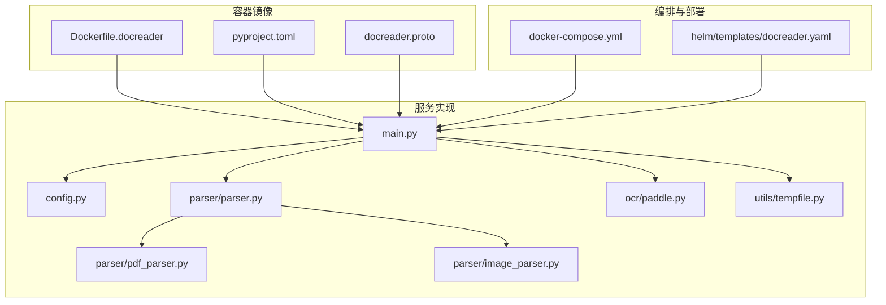
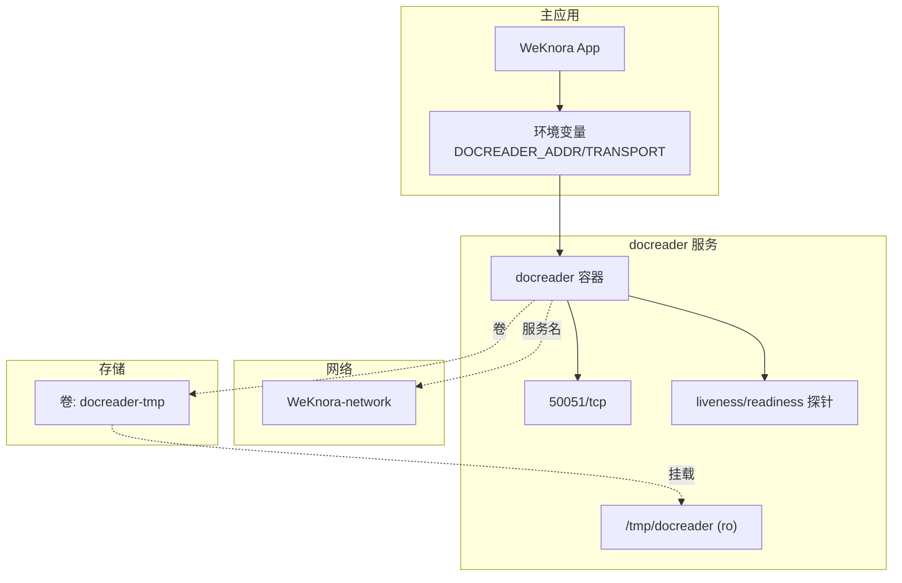
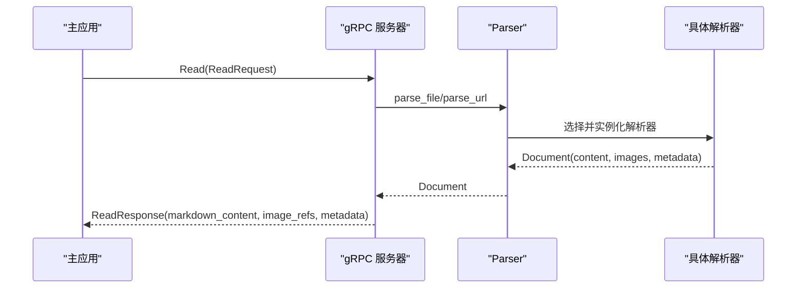
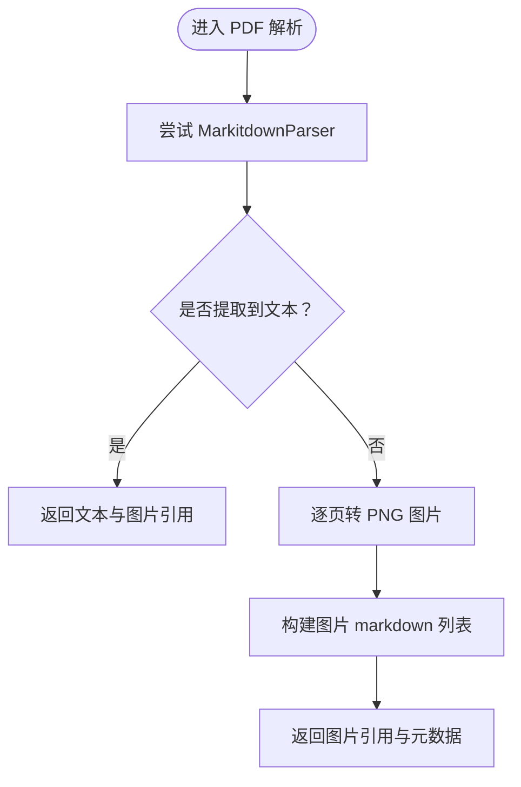
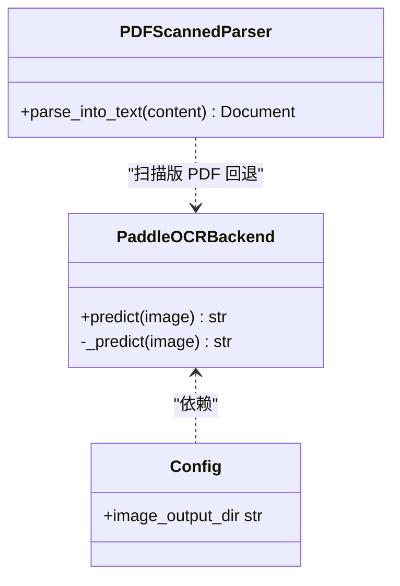
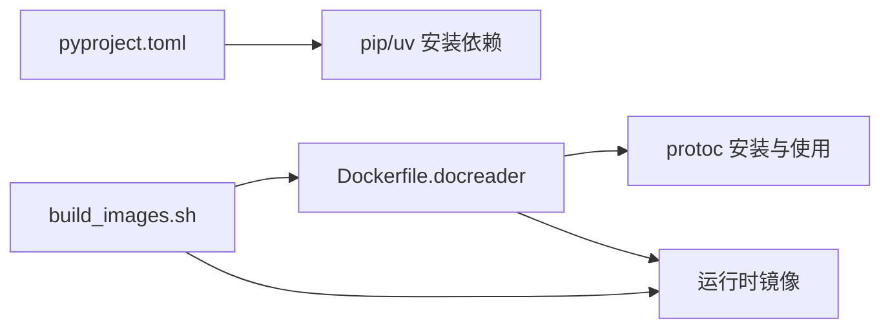
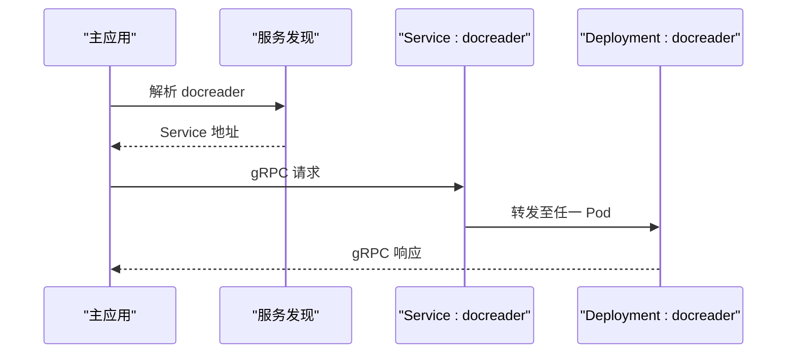
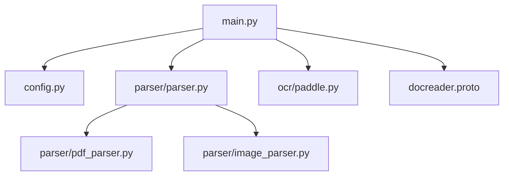

# 文档处理服务部署

<cite>
**本文引用的文件**
- [Dockerfile.docreader](file://docker/Dockerfile.docreader)
- [pyproject.toml](file://docreader/pyproject.toml)
- [main.py](file://docreader/main.py)
- [config.py](file://docreader/config.py)
- [docreader.yaml](file://helm/templates/docreader.yaml)
- [docker-compose.yml](file://docker-compose.yml)
- [docreader.proto](file://docreader/proto/docreader.proto)
- [parser.py](file://docreader/parser/parser.py)
- [pdf_parser.py](file://docreader/parser/pdf_parser.py)
- [image_parser.py](file://docreader/parser/image_parser.py)
- [paddle.py](file://docreader/ocr/paddle.py)
- [tempfile.py](file://docreader/utils/tempfile.py)
- [supervisord.conf](file://docker/config/supervisord.conf)
- [build_images.sh](file://scripts/build_images.sh)
</cite>

## 目录
1. [简介](#简介)
2. [项目结构](#项目结构)
3. [核心组件](#核心组件)
4. [架构总览](#架构总览)
5. [详细组件分析](#详细组件分析)
6. [依赖分析](#依赖分析)
7. [性能考虑](#性能考虑)
8. [故障排除指南](#故障排除指南)
9. [结论](#结论)
10. [附录](#附录)

## 简介
本文件为 WeKnora 文档处理服务（docreader）的完整 Docker 部署与运维指南。重点覆盖：
- Python 文档解析器容器的构建配置与依赖管理
- gRPC 服务部署与健康检查
- OCR 配置、图像处理与多格式支持
- 与主应用的通信机制、服务发现与负载均衡
- 资源限制、并发控制与错误处理
- 性能优化、缓存策略与临时文件管理
- 面向开发者与运维工程师的部署与排障建议

## 项目结构
docreader 服务位于仓库的 docreader 子目录，采用 Python 实现，通过 gRPC 对外提供统一的文档解析能力。其核心目录与文件包括：
- Dockerfile 构建：docker/Dockerfile.docreader
- Python 依赖：docreader/pyproject.toml
- 服务入口与 gRPC：docreader/main.py、docreader/proto/docreader.proto
- 解析引擎与多格式支持：docreader/parser/*、docreader/ocr/*
- 配置与运行参数：docreader/config.py
- Compose/Helm 部署：docker-compose.yml、helm/templates/docreader.yaml
- 临时文件与工具：docreader/utils/tempfile.py

**图表来源**
- [Dockerfile.docreader:1-158](file://docker/Dockerfile.docreader#L1-L158)
- [pyproject.toml:1-40](file://docreader/pyproject.toml#L1-L40)
- [docreader.proto:1-62](file://docreader/proto/docreader.proto#L1-L62)
- [main.py:1-215](file://docreader/main.py#L1-L215)
- [config.py:1-122](file://docreader/config.py#L1-L122)
- [parser.py:1-83](file://docreader/parser/parser.py#L1-L83)
- [pdf_parser.py:1-69](file://docreader/parser/pdf_parser.py#L1-L69)
- [image_parser.py:1-29](file://docreader/parser/image_parser.py#L1-L29)
- [paddle.py:1-176](file://docreader/ocr/paddle.py#L1-L176)
- [tempfile.py:1-78](file://docreader/utils/tempfile.py#L1-L78)
- [docker-compose.yml:173-199](file://docker-compose.yml#L173-L199)
- [docreader.yaml:1-103](file://helm/templates/docreader.yaml#L1-L103)

**章节来源**
- [Dockerfile.docreader:1-158](file://docker/Dockerfile.docreader#L1-L158)
- [pyproject.toml:1-40](file://docreader/pyproject.toml#L1-L40)
- [docreader.proto:1-62](file://docreader/proto/docreader.proto#L1-L62)
- [main.py:1-215](file://docreader/main.py#L1-L215)
- [config.py:1-122](file://docreader/config.py#L1-L122)
- [parser.py:1-83](file://docreader/parser/parser.py#L1-L83)
- [pdf_parser.py:1-69](file://docreader/parser/pdf_parser.py#L1-L69)
- [image_parser.py:1-29](file://docreader/parser/image_parser.py#L1-L29)
- [paddle.py:1-176](file://docreader/ocr/paddle.py#L1-L176)
- [tempfile.py:1-78](file://docreader/utils/tempfile.py#L1-L78)
- [docker-compose.yml:173-199](file://docker-compose.yml#L173-L199)
- [docreader.yaml:1-103](file://helm/templates/docreader.yaml#L1-L103)

## 核心组件
- gRPC 服务与处理器
  - 服务定义：docreader.proto
  - 服务实现：main.py 中的 DocReaderServicer，提供 Read 与 ListEngines RPC
  - 健康检查：内置 HealthServicer，配合 Helm/Compose 的 liveness/readiness 探针
- 解析引擎
  - Parser 门面：根据请求选择具体解析器（PDF、图像、网页等）
  - 多格式支持：PDFScannedParser、ImageParser、WebParser 等
- OCR 与图像处理
  - PaddleOCR 后端：paddle.py，CPU 模式、AVX 检测与兼容模式
  - 图像回退：扫描版 PDF 转图片并返回 base64 引用
- 配置与运行参数
  - config.py 提供 gRPC 并发、消息大小、端口、代理、图片输出目录等
- 临时文件与资源管理
  - utils/tempfile.py 提供临时文件/目录上下文管理
- 编排与部署
  - docker-compose.yml 定义 docreader 服务、端口映射、卷挂载、健康检查
  - helm/templates/docreader.yaml 定义 Deployment/Service 与探针

**章节来源**
- [docreader.proto:1-62](file://docreader/proto/docreader.proto#L1-L62)
- [main.py:98-215](file://docreader/main.py#L98-L215)
- [config.py:48-122](file://docreader/config.py#L48-L122)
- [parser.py:11-83](file://docreader/parser/parser.py#L11-L83)
- [pdf_parser.py:13-69](file://docreader/parser/pdf_parser.py#L13-L69)
- [image_parser.py:11-29](file://docreader/parser/image_parser.py#L11-L29)
- [paddle.py:16-176](file://docreader/ocr/paddle.py#L16-L176)
- [tempfile.py:8-78](file://docreader/utils/tempfile.py#L8-L78)
- [docker-compose.yml:173-199](file://docker-compose.yml#L173-L199)
- [docreader.yaml:36-102](file://helm/templates/docreader.yaml#L36-L102)

## 架构总览
docreader 作为独立 gRPC 服务，被主应用通过环境变量配置连接。Compose/Helm 提供服务发现与负载均衡（副本数可配）。OCR 与图像处理在容器内按需启用。

**图表来源**
- [docker-compose.yml:103-104](file://docker-compose.yml#L103-L104)
- [docker-compose.yml:183-184](file://docker-compose.yml#L183-L184)
- [docker-compose.yml:188-193](file://docker-compose.yml#L188-L193)
- [docreader.yaml:88-102](file://helm/templates/docreader.yaml#L88-L102)
- [docreader.yaml:53-71](file://helm/templates/docreader.yaml#L53-L71)

**章节来源**
- [docker-compose.yml:103-104](file://docker-compose.yml#L103-L104)
- [docker-compose.yml:183-184](file://docker-compose.yml#L183-L184)
- [docker-compose.yml:188-193](file://docker-compose.yml#L188-L193)
- [docreader.yaml:88-102](file://helm/templates/docreader.yaml#L88-L102)
- [docreader.yaml:53-71](file://helm/templates/docreader.yaml#L53-L71)

## 详细组件分析

### gRPC 服务与协议
- 服务接口
  - Read(ReadRequest) -> ReadResponse：支持文件内容或 URL 两种模式
  - ListEngines(ListEnginesRequest) -> ListEnginesResponse：列举可用解析引擎及其支持的文件类型
- 请求/响应结构
  - ReadRequest：file_content/file_name/file_type 或 url/title，以及 ReadConfig（含 parser_engine 与 overrides）
  - ReadResponse：markdown_content、image_refs、image_dir_path、metadata、error
- 服务器配置
  - main.py 中通过 ThreadPoolExecutor 控制并发，gRPC 最大消息长度由 config 注入
  - 监听端口来自配置，未启用 TLS（明文 gRPC）

**图表来源**
- [docreader.proto:7-45](file://docreader/proto/docreader.proto#L7-L45)
- [main.py:103-181](file://docreader/main.py#L103-L181)
- [parser.py:25-83](file://docreader/parser/parser.py#L25-L83)

**章节来源**
- [docreader.proto:1-62](file://docreader/proto/docreader.proto#L1-L62)
- [main.py:98-215](file://docreader/main.py#L98-L215)
- [parser.py:11-83](file://docreader/parser/parser.py#L11-L83)

### 解析引擎与多格式支持
- PDF 解析链
  - PDFParser 使用 FirstParser 链式尝试：MarkitdownParser（首选）、PDFScannedParser（扫描版回退）
  - PDFScannedParser 将每页转 PNG 并以 base64 返回图片引用，供主应用后续 OCR
- 图像解析
  - ImageParser 将单张图片封装为 markdown 引用，并在 images 字典中携带 base64 数据
- 网页解析
  - WebParser 用于 URL 模式，返回网页内容

**图表来源**
- [pdf_parser.py:57-69](file://docreader/parser/pdf_parser.py#L57-L69)
- [pdf_parser.py:13-56](file://docreader/parser/pdf_parser.py#L13-L56)

**章节来源**
- [pdf_parser.py:13-69](file://docreader/parser/pdf_parser.py#L13-L69)
- [image_parser.py:11-29](file://docreader/parser/image_parser.py#L11-L29)

### OCR 配置与图像处理
- PaddleOCR 后端
  - CPU 模式禁用 GPU，强制使用 CPU 设备
  - 检测 CPU 是否支持 AVX，不支持时切换兼容模式
  - 配置项包含检测/识别模型名称、阈值、是否使用膨胀等
- 图像回退路径
  - 扫描版 PDF 通过 PDFScannedParser 转换为 PNG，主应用负责 OCR
- 图片输出目录
  - config.py 提供 image_output_dir，默认 /tmp/docreader，容器内以只读方式挂载

**图表来源**
- [paddle.py:16-176](file://docreader/ocr/paddle.py#L16-L176)
- [pdf_parser.py:13-56](file://docreader/parser/pdf_parser.py#L13-L56)
- [config.py:85-87](file://docreader/config.py#L85-L87)

**章节来源**
- [paddle.py:16-176](file://docreader/ocr/paddle.py#L16-L176)
- [pdf_parser.py:13-56](file://docreader/parser/pdf_parser.py#L13-L56)
- [config.py:85-87](file://docreader/config.py#L85-L87)

### 依赖管理与构建
- Python 依赖
  - pyproject.toml 包含 grpcio、protobuf、paddleocr、pdfplumber、pillow、playwright 等
- 构建阶段
  - Dockerfile.docreader 使用两阶段构建：builder（安装 protoc、生成 pb 代码）与 runner（仅运行时依赖）
  - 安装 grpc_health_probe 用于健康检查
  - Playwright 安装 webkit 以支持网页解析
- 镜像构建脚本
  - scripts/build_images.sh 支持按平台（amd64/arm64）构建 docreader 镜像

**图表来源**
- [pyproject.toml:1-40](file://docreader/pyproject.toml#L1-L40)
- [Dockerfile.docreader:67-77](file://docker/Dockerfile.docreader#L67-L77)
- [Dockerfile.docreader:137-146](file://docker/Dockerfile.docreader#L137-L146)
- [build_images.sh:158-180](file://scripts/build_images.sh#L158-L180)

**章节来源**
- [pyproject.toml:1-40](file://docreader/pyproject.toml#L1-L40)
- [Dockerfile.docreader:67-77](file://docker/Dockerfile.docreader#L67-L77)
- [Dockerfile.docreader:137-146](file://docker/Dockerfile.docreader#L137-L146)
- [build_images.sh:158-180](file://scripts/build_images.sh#L158-L180)

### 与主应用的通信机制、服务发现与负载均衡
- 通信机制
  - 主应用通过环境变量 DOCREADER_ADDR（默认 docreader:50051）与 DOCREADER_TRANSPORT（默认 grpc）连接 docreader
- 服务发现
  - Compose/Helm 中 docreader 服务名为固定值，便于主应用硬编码引用
- 负载均衡
  - Helm Deployment 支持多副本（replicas），通过 Service 暴露 50051 端口，实现副本级负载均衡

**图表来源**
- [docker-compose.yml:103-104](file://docker-compose.yml#L103-L104)
- [docreader.yaml:88-102](file://helm/templates/docreader.yaml#L88-L102)

**章节来源**
- [docker-compose.yml:103-104](file://docker-compose.yml#L103-L104)
- [docreader.yaml:88-102](file://helm/templates/docreader.yaml#L88-L102)

### 资源限制、并发控制与错误处理
- 并发与资源
  - main.py 通过 ThreadPoolExecutor(max_workers=CONFIG.grpc_max_workers) 控制 gRPC 并发
  - gRPC 最大消息长度由 CONFIG.grpc_max_file_size_mb 注入
  - Helm/Compose 提供 resources 与探针，确保健康与弹性
- 错误处理
  - Read 方法捕获异常并返回 ReadResponse(error)
  - ListEngines 返回引擎可用性与原因
  - 日志级别可通过 LOG_LEVEL 环境变量调整

**章节来源**
- [main.py:184-215](file://docreader/main.py#L184-L215)
- [config.py:66-97](file://docreader/config.py#L66-L97)
- [docreader.yaml:51-71](file://helm/templates/docreader.yaml#L51-L71)

### 性能优化、缓存策略与临时文件管理
- 性能优化
  - 使用 uv 与锁定依赖，减少安装时间与体积
  - Playwright webkit 仅安装一次，避免重复下载
  - PDF 解析优先文本，扫描版回退到图片，降低 OCR 成本
- 缓存策略
  - 服务端未内置缓存逻辑；建议在主应用层对解析结果进行缓存
- 临时文件管理
  - utils/tempfile.py 提供临时文件/目录上下文，确保异常时自动清理
  - docreader-tmp 卷挂载为只读，避免容器内写入冲突

**章节来源**
- [Dockerfile.docreader:144-146](file://docker/Dockerfile.docreader#L144-L146)
- [tempfile.py:8-78](file://docreader/utils/tempfile.py#L8-L78)
- [docker-compose.yml:183-184](file://docker-compose.yml#L183-L184)

## 依赖分析
- 组件耦合
  - main.py 依赖 config.py、parser.registry、docreader.proto 生成的服务类
  - parser.Parser 依赖 registry 动态选择解析器
  - pdf_parser 与 image_parser 依赖基础解析器与第三方库
- 外部依赖
  - grpcio、protobuf、paddleocr、pdfplumber、pillow、playwright 等
- 潜在循环依赖
  - 当前模块结构清晰，未发现循环依赖

**图表来源**
- [main.py:1-27](file://docreader/main.py#L1-L27)
- [config.py:1-122](file://docreader/config.py#L1-L122)
- [parser.py:1-83](file://docreader/parser/parser.py#L1-L83)
- [pdf_parser.py:1-69](file://docreader/parser/pdf_parser.py#L1-L69)
- [image_parser.py:1-29](file://docreader/parser/image_parser.py#L1-L29)
- [paddle.py:1-176](file://docreader/ocr/paddle.py#L1-L176)
- [docreader.proto:1-62](file://docreader/proto/docreader.proto#L1-L62)

**章节来源**
- [main.py:1-27](file://docreader/main.py#L1-L27)
- [config.py:1-122](file://docreader/config.py#L1-L122)
- [parser.py:1-83](file://docreader/parser/parser.py#L1-L83)
- [pdf_parser.py:1-69](file://docreader/parser/pdf_parser.py#L1-L69)
- [image_parser.py:1-29](file://docreader/parser/image_parser.py#L1-L29)
- [paddle.py:1-176](file://docreader/ocr/paddle.py#L1-L176)
- [docreader.proto:1-62](file://docreader/proto/docreader.proto#L1-L62)

## 性能考虑
- 并发与吞吐
  - 合理设置 DOCREADER_GRPC_MAX_WORKERS，避免过多线程导致上下文切换开销
  - 控制最大消息大小（DOCREADER_GRPC_MAX_FILE_SIZE_MB），防止内存峰值过高
- I/O 与存储
  - 使用只读卷挂载 /tmp/docreader，避免容器内写盘
  - 扫描版 PDF 仅返回图片引用，将 OCR 放在主应用侧，降低单容器复杂度
- 依赖与镜像
  - 使用 uv 与锁定依赖，缩短构建时间
  - 两阶段构建减少运行时镜像体积

[本节为通用性能建议，无需特定文件引用]

## 故障排除指南
- 服务不可达
  - 检查 DOCREADER_ADDR 与端口映射（默认 50051）
  - 查看 liveness/readiness 探针结果
- OCR 初始化失败
  - PaddleOCR 报错“非法指令”或崩溃：确认 CPU 是否支持 AVX；必要时降级或更换 OCR 后端
- PDF 无文本
  - 扫描版 PDF 将回退为图片；确认主应用是否正确执行 OCR
- 日志与调试
  - 设置 LOG_LEVEL 环境变量调整日志级别
  - 查看容器标准输出日志

**章节来源**
- [docker-compose.yml:103-104](file://docker-compose.yml#L103-L104)
- [docker-compose.yml:188-193](file://docker-compose.yml#L188-L193)
- [paddle.py:95-116](file://docreader/ocr/paddle.py#L95-L116)
- [main.py:44-49](file://docreader/main.py#L44-L49)

## 结论
docreader 服务通过清晰的 gRPC 接口与模块化的解析引擎，提供了稳定高效的文档处理能力。结合 Compose/Helm 的编排与探针机制，可在生产环境中实现高可用与弹性伸缩。建议在主应用层引入解析结果缓存与 OCR 负载分担，进一步提升整体性能与稳定性。

[本节为总结性内容，无需特定文件引用]

## 附录

### 关键环境变量与配置
- gRPC 与并发
  - DOCREADER_GRPC_MAX_WORKERS：gRPC 线程池大小
  - DOCREADER_GRPC_MAX_FILE_SIZE_MB：gRPC 最大消息大小（MB）
  - DOCREADER_GRPC_PORT：监听端口（默认 50051）
- 代理与存储
  - DOCREADER_EXTERNAL_HTTP_PROXY / DOCREADER_EXTERNAL_HTTPS_PROXY：HTTP(S) 代理
  - DOCREADER_IMAGE_OUTPUT_DIR：图片输出目录（默认 /tmp/docreader）
- 服务连接
  - DOCREADER_ADDR：docreader 服务地址（默认 docreader:50051）
  - DOCREADER_TRANSPORT：传输协议（默认 grpc）

**章节来源**
- [config.py:66-97](file://docreader/config.py#L66-L97)
- [docker-compose.yml:103-104](file://docker-compose.yml#L103-L104)

### 部署与构建要点
- 使用 scripts/build_images.sh 构建 docreader 镜像，支持 amd64/arm64
- Compose/Helm 默认暴露 50051 端口并启用健康检查
- docreader-tmp 卷挂载为只读，避免容器内写盘

**章节来源**
- [build_images.sh:158-180](file://scripts/build_images.sh#L158-L180)
- [docker-compose.yml:173-199](file://docker-compose.yml#L173-L199)
- [docreader.yaml:36-102](file://helm/templates/docreader.yaml#L36-L102)