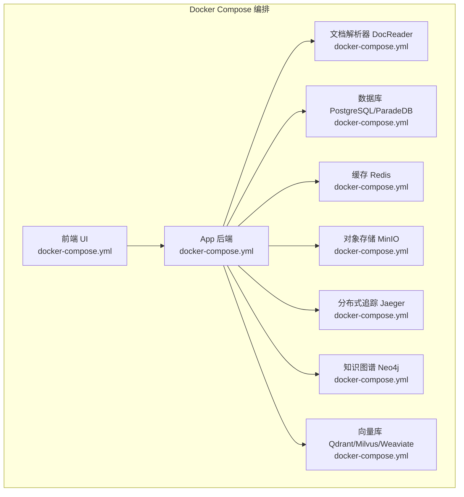
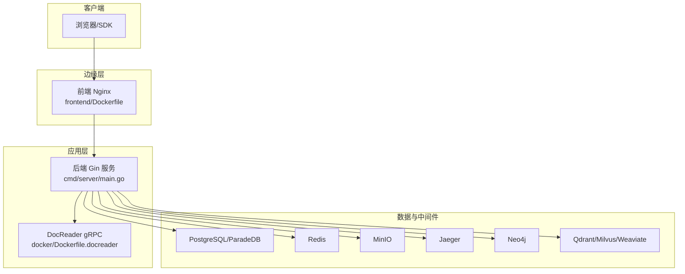
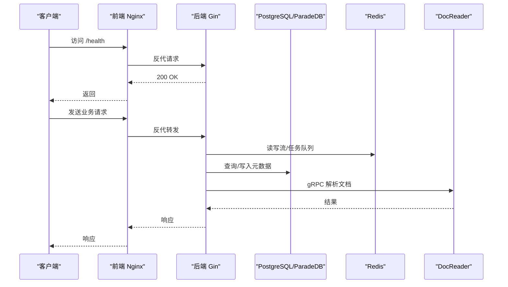
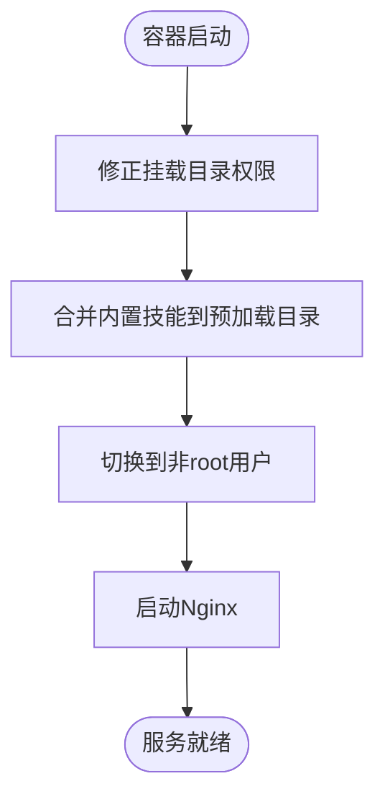
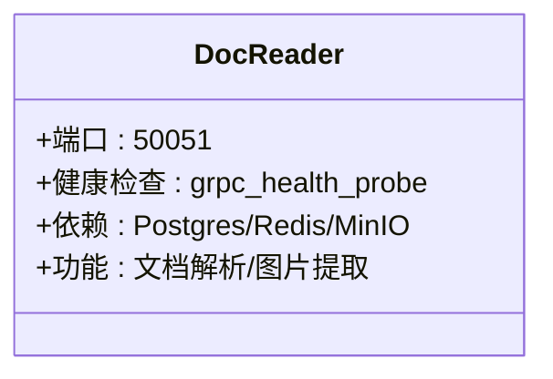
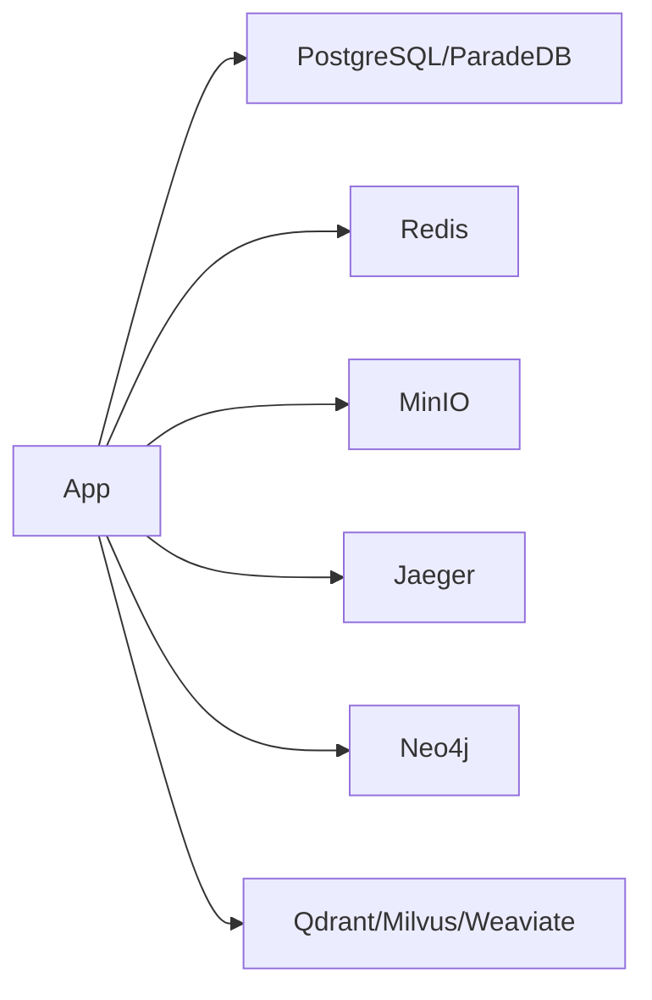
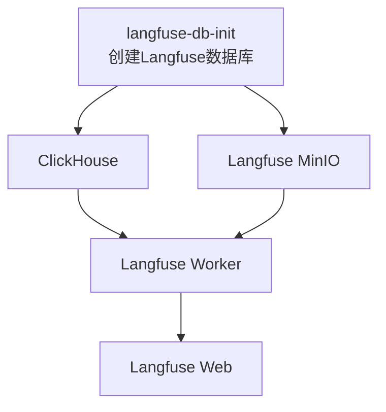

# 服务编排与配置

<cite>
**本文引用的文件**
- [docker-compose.yml](file://docker-compose.yml)
- [docker-compose.dev.yml](file://docker-compose.dev.yml)
- [scripts/build_images.sh](file://scripts/build_images.sh)
- [scripts/start_all.sh](file://scripts/start_all.sh)
- [scripts/docker-entrypoint.sh](file://scripts/docker-entrypoint.sh)
- [docker/Dockerfile.docreader](file://docker/Dockerfile.docreader)
- [docker/Dockerfile.sandbox](file://docker/Dockerfile.sandbox)
- [frontend/Dockerfile](file://frontend/Dockerfile)
- [cmd/server/main.go](file://cmd/server/main.go)
- [helm/Chart.yaml](file://helm/Chart.yaml)
- [helm/values.yaml](file://helm/values.yaml)
</cite>

## 目录
1. [简介](#简介)
2. [项目结构](#项目结构)
3. [核心组件](#核心组件)
4. [架构总览](#架构总览)
5. [详细组件分析](#详细组件分析)
6. [依赖关系分析](#依赖关系分析)
7. [性能考虑](#性能考虑)
8. [故障排查指南](#故障排查指南)
9. [结论](#结论)
10. [附录](#附录)

## 简介
本文件面向DevOps工程师，提供WeKnora服务编排与配置的完整指导。内容覆盖Docker Compose多服务编排、服务依赖与启动顺序、环境变量与配置挂载、服务间通信与可观测性、健康检查与重启策略、资源限制、以及多环境部署与自动化脚本。同时给出与Kubernetes Helm部署的对应关系，便于平滑迁移。

## 项目结构
WeKnora采用多阶段Docker构建与Compose编排，核心目录与文件如下：
- docker-compose.yml：生产级多服务编排，包含App后端、前端、文档解析器、数据库、缓存、对象存储、分布式追踪、知识图谱与向量库等。
- docker-compose.dev.yml：开发环境编排，仅启动基础设施，App与前端在本地运行，便于快速迭代。
- scripts/：自动化脚本，包括镜像构建、一键启动/停止、环境检查、镜像拉取等。
- docker/ 与 frontend/：各组件镜像构建文件。
- cmd/server/main.go：后端服务入口，负责HTTP服务器启动与优雅关闭。
- helm/：Kubernetes Helm Chart，提供与Compose能力对齐的部署规范。

图表来源
- [docker-compose.yml:1-613](file://docker-compose.yml#L1-L613)

章节来源
- [docker-compose.yml:1-613](file://docker-compose.yml#L1-L613)
- [docker-compose.dev.yml:1-420](file://docker-compose.dev.yml#L1-L420)

## 核心组件
- App后端服务：提供API、聊天、知识检索、工具调用、代理执行等能力，内置健康检查与优雅关闭逻辑。
- 前端UI服务：基于Nginx，提供静态页面与反向代理至后端。
- 文档解析器DocReader：gRPC服务，负责文档解析与图片提取。
- 基础设施：PostgreSQL/ParadeDB（向量+BM25）、Redis（流与队列）、MinIO（S3兼容）、Jaeger（链路追踪）、Neo4j（知识图谱）、Qdrant/Milvus/Weaviate（向量库）。
- 可选组件：Langfuse自建可观测栈（ClickHouse、MinIO、Worker、Web）。

章节来源
- [docker-compose.yml:28-170](file://docker-compose.yml#L28-L170)
- [docker-compose.yml:173-364](file://docker-compose.yml#L173-L364)
- [docker-compose.yml:395-594](file://docker-compose.yml#L395-L594)
- [cmd/server/main.go:43-124](file://cmd/server/main.go#L43-L124)

## 架构总览
下图展示WeKnora在Docker环境中的服务交互与数据流：

图表来源
- [docker-compose.yml:2-26](file://docker-compose.yml#L2-L26)
- [docker-compose.yml:28-170](file://docker-compose.yml#L28-L170)
- [docker-compose.yml:173-364](file://docker-compose.yml#L173-L364)
- [frontend/Dockerfile:25-43](file://frontend/Dockerfile#L25-L43)
- [cmd/server/main.go:43-124](file://cmd/server/main.go#L43-L124)

## 详细组件分析

### 后端服务（App）
- 作用：提供REST API、聊天引擎、知识检索、代理与工具调用、文件处理、可观测性集成等。
- 启动顺序：依赖Redis先于健康检查，PostgreSQL健康后启动，DocReader健康后启动。
- 健康检查：/health探活，30s轮询，10s超时，3次重试，60s启动宽限。
- 重启策略：unless-stopped。
- 环境变量：涵盖数据库、存储、向量库、缓存、代理、加密、并发池、LLM调用超时、沙箱模式等。
- 优雅关闭：监听信号，支持二次信号强制关闭，配合shutdown超时清理资源。

图表来源
- [docker-compose.yml:44-49](file://docker-compose.yml#L44-L49)
- [docker-compose.yml:148-157](file://docker-compose.yml#L148-L157)
- [cmd/server/main.go:62-119](file://cmd/server/main.go#L62-L119)

章节来源
- [docker-compose.yml:28-170](file://docker-compose.yml#L28-L170)
- [cmd/server/main.go:43-124](file://cmd/server/main.go#L43-L124)

### 前端服务（UI）
- 作用：静态资源托管与反向代理，将后端API路由到App服务。
- 端口：默认80，可通过环境变量映射。
- 配置挂载：Nginx模板、入口脚本。
- 入口脚本：修正挂载目录权限、合并内置技能到预加载目录、以非root用户运行。

图表来源
- [scripts/docker-entrypoint.sh:11-44](file://scripts/docker-entrypoint.sh#L11-L44)
- [frontend/Dockerfile:33-43](file://frontend/Dockerfile#L33-L43)

章节来源
- [frontend/Dockerfile:1-43](file://frontend/Dockerfile#L1-L43)
- [scripts/docker-entrypoint.sh:1-44](file://scripts/docker-entrypoint.sh#L1-L44)

### 文档解析器（DocReader）
- 作用：gRPC文档解析服务，支持多种格式解析与图片提取。
- 端口：50051。
- 健康检查：grpc_health_probe探测。
- 依赖：PostgreSQL/ParadeDB、Redis、MinIO（按配置）。
- 构建：多阶段构建，分离构建与运行时依赖，减少镜像体积。

图表来源
- [docker-compose.yml:173-199](file://docker-compose.yml#L173-L199)
- [docker/Dockerfile.docreader:1-158](file://docker/Dockerfile.docreader#L1-L158)

章节来源
- [docker-compose.yml:173-199](file://docker-compose.yml#L173-L199)
- [docker/Dockerfile.docreader:1-158](file://docker/Dockerfile.docreader#L1-L158)

### 基础设施组件
- PostgreSQL/ParadeDB：向量检索与全文搜索，健康检查使用pg_isready。
- Redis：键值缓存与流式任务队列。
- MinIO：S3兼容对象存储，提供Web控制台。
- Jaeger：分布式追踪，OTLP/Zipkin等协议。
- Neo4j：知识图谱，GraphRAG可选启用。
- Qdrant/Milvus/Weaviate：向量数据库备选。

图表来源
- [docker-compose.yml:200-364](file://docker-compose.yml#L200-L364)

章节来源
- [docker-compose.yml:200-364](file://docker-compose.yml#L200-L364)

### 可选组件：Langfuse自建可观测栈
- 复用App的PostgreSQL与Redis，新增ClickHouse与MinIO，以及Langfuse Worker与Web。
- 通过profiles启用，数据库初始化容器幂等创建Langfuse专用数据库。
- 环境变量：数据库URL、Redis连接串、S3桶与端点、NextAuth等。

图表来源
- [docker-compose.yml:395-594](file://docker-compose.yml#L395-L594)

章节来源
- [docker-compose.yml:395-594](file://docker-compose.yml#L395-L594)

## 依赖关系分析
- 服务依赖
  - 前端依赖后端健康（depends_on: app condition: service_healthy）。
  - App依赖Redis先启动、PostgreSQL健康、DocReader健康。
  - DocReader依赖PostgreSQL/ParadeDB、Redis、MinIO（按配置）。
- 网络
  - 所有服务位于同一bridge网络，容器间通过服务名互访。
- 存储
  - 使用命名卷持久化数据，如postgres-data、data-files、jaeger_data等。
- 环境变量
  - 通过环境变量统一配置数据库、存储、向量库、缓存、LLM、加密等参数。
- 重启策略
  - unless-stopped用于App、DocReader、PostgreSQL、MinIO、Jaeger、Neo4j、Qdrant、Milvus、Weaviate等。
  - always用于Redis，确保消息队列可用。
- 健康检查
  - App：HTTP /health。
  - DocReader：gRPC健康探针。
  - PostgreSQL：pg_isready。
  - MinIO：/minio/health/live。
  - Jaeger：端口暴露与健康端口。
  - ClickHouse：/ping。
  - Milvus：/healthz。
  - Weaviate：HTTP/GRPC端口。
- 资源限制
  - Compose未显式设置CPU/内存限制；可在生产环境结合Swarm/K8s进行资源约束。
- 启动顺序
  - 通过depends_on与condition实现粗粒度顺序控制；建议在应用内增加重试与退避逻辑以增强健壮性。

章节来源
- [docker-compose.yml:21-26](file://docker-compose.yml#L21-L26)
- [docker-compose.yml:148-157](file://docker-compose.yml#L148-L157)
- [docker-compose.yml:188-193](file://docker-compose.yml#L188-L193)
- [docker-compose.yml:212-217](file://docker-compose.yml#L212-L217)
- [docker-compose.yml:242-247](file://docker-compose.yml#L242-L247)
- [docker-compose.yml:442-447](file://docker-compose.yml#L442-L447)
- [docker-compose.yml:325-331](file://docker-compose.yml#L325-L331)
- [docker-compose.yml:357-362](file://docker-compose.yml#L357-L362)

## 性能考虑
- 向量库选择：根据查询规模与精度需求选择PostgreSQL/pgvector、Elasticsearch、Qdrant、Milvus或Weaviate。
- 缓存策略：Redis用于流与队列，建议合理设置淘汰策略与持久化。
- 存储：MinIO作为S3兼容对象存储，注意桶与对象生命周期管理。
- 日志与追踪：Jaeger收集链路数据，建议按采样率与保留策略优化成本。
- 构建优化：多阶段构建减少镜像体积，按需安装依赖，避免不必要的工具链。

## 故障排查指南
- 健康检查失败
  - 检查App /health端点可达性与内部依赖（DB、Redis、DocReader）。
  - 查看DocReader gRPC健康探针与日志。
  - PostgreSQL/Redis/MinIO健康探针返回失败时，检查容器日志与卷挂载。
- 启动顺序问题
  - 确认depends_on与condition配置正确；必要时在应用侧增加重试与退避。
- 环境变量缺失
  - 确保.env文件存在并包含DB_USER、DB_PASSWORD、DB_NAME、STORAGE_TYPE等关键变量。
- 权限与挂载
  - 使用scripts/docker-entrypoint.sh修正挂载目录权限，避免权限不足导致的读写失败。
- 一键脚本
  - 使用scripts/start_all.sh进行环境检查、拉取镜像、启动/停止服务、列出容器、重启指定容器等。

章节来源
- [scripts/start_all.sh:86-111](file://scripts/start_all.sh#L86-L111)
- [scripts/start_all.sh:268-297](file://scripts/start_all.sh#L268-L297)
- [scripts/docker-entrypoint.sh:11-44](file://scripts/docker-entrypoint.sh#L11-L44)

## 结论
WeKnora提供了完整的Docker Compose编排方案，覆盖企业级知识管理与智能问答所需的全部组件。通过明确的依赖关系、健康检查与重启策略，以及可选的可观测栈，能够在单机或小集群环境中快速落地。建议在生产环境中结合Kubernetes/Helm进行资源治理与高可用部署，并完善Secret管理与网络隔离策略。

## 附录

### 多环境部署方案
- 开发环境：使用docker-compose.dev.yml，仅启动基础设施，App与前端在本地运行，便于调试与热更新。
- 生产环境：使用docker-compose.yml，按需启用profiles（如minio、neo4j、qdrant、jaeger、langfuse等）。
- Kubernetes：使用helm/values.yaml与helm/Chart.yaml，按需启用MinIO、Neo4j、Qdrant、Jaeger等组件，结合Ingress与Secret管理。

章节来源
- [docker-compose.dev.yml:1-420](file://docker-compose.dev.yml#L1-L420)
- [docker-compose.yml:1-613](file://docker-compose.yml#L1-L613)
- [helm/values.yaml:1-493](file://helm/values.yaml#L1-L493)
- [helm/Chart.yaml:1-27](file://helm/Chart.yaml#L1-L27)

### 配置模板与自动化脚本
- 镜像构建：scripts/build_images.sh，支持按模块构建与清理。
- 一键启动/停止：scripts/start_all.sh，支持拉取镜像、启动/停止、环境检查、列出容器、重启指定容器、拉取镜像等。
- 入口脚本：scripts/docker-entrypoint.sh，负责权限修正、内置技能合并与非root运行。

章节来源
- [scripts/build_images.sh:1-393](file://scripts/build_images.sh#L1-L393)
- [scripts/start_all.sh:1-773](file://scripts/start_all.sh#L1-L773)
- [scripts/docker-entrypoint.sh:1-44](file://scripts/docker-entrypoint.sh#L1-L44)

### 服务间通信与网络
- 网络：所有服务位于WeKnora-network桥接网络，容器通过服务名相互访问。
- 端口映射：前端80、App 8080、MinIO 9000/9001、Jaeger多端口、Neo4j 7474/7687、Qdrant 6333/6334、Milvus 19530/9091、Weaviate 8080/50051等。
- 代理：前端Nginx反向代理至App后端，支持文件大小限制等配置。

章节来源
- [docker-compose.yml:596-613](file://docker-compose.yml#L596-L613)
- [docker-compose.yml:9-26](file://docker-compose.yml#L9-L26)
- [docker-compose.yml:36-50](file://docker-compose.yml#L36-L50)
- [frontend/Dockerfile:30-35](file://frontend/Dockerfile#L30-L35)

### 资源限制与安全
- Compose未显式设置CPU/内存限制；建议在Kubernetes中通过requests/limits进行资源治理。
- 安全上下文：全局与容器级安全上下文已在Helm中示例化，Compose中可按需调整。
- Secret管理：Helm中提供secrets配置项，建议使用外部Secret管理工具（如External Secrets Operator、Vault）。

章节来源
- [helm/values.yaml:23-35](file://helm/values.yaml#L23-L35)
- [helm/values.yaml:372-403](file://helm/values.yaml#L372-L403)