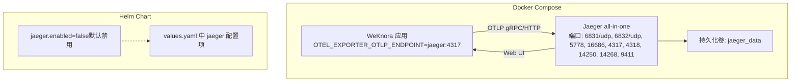
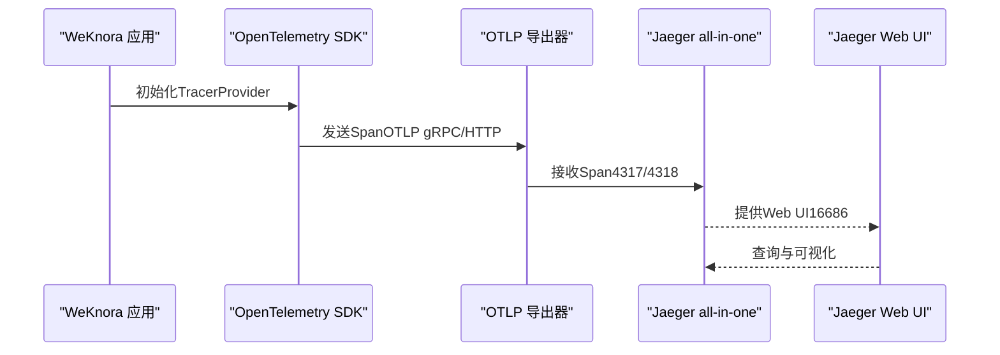
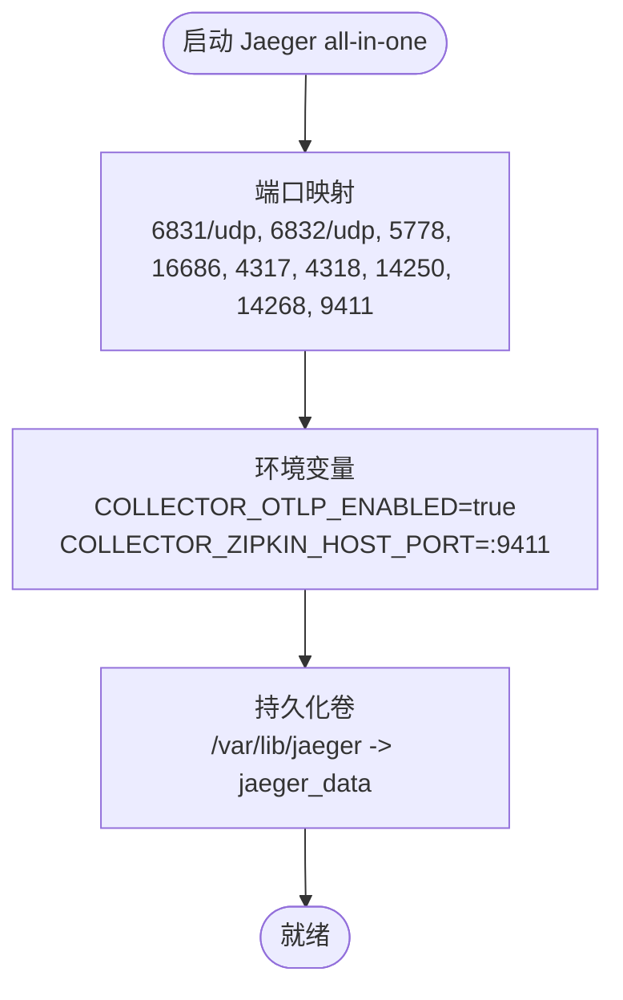
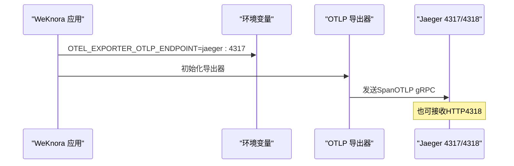
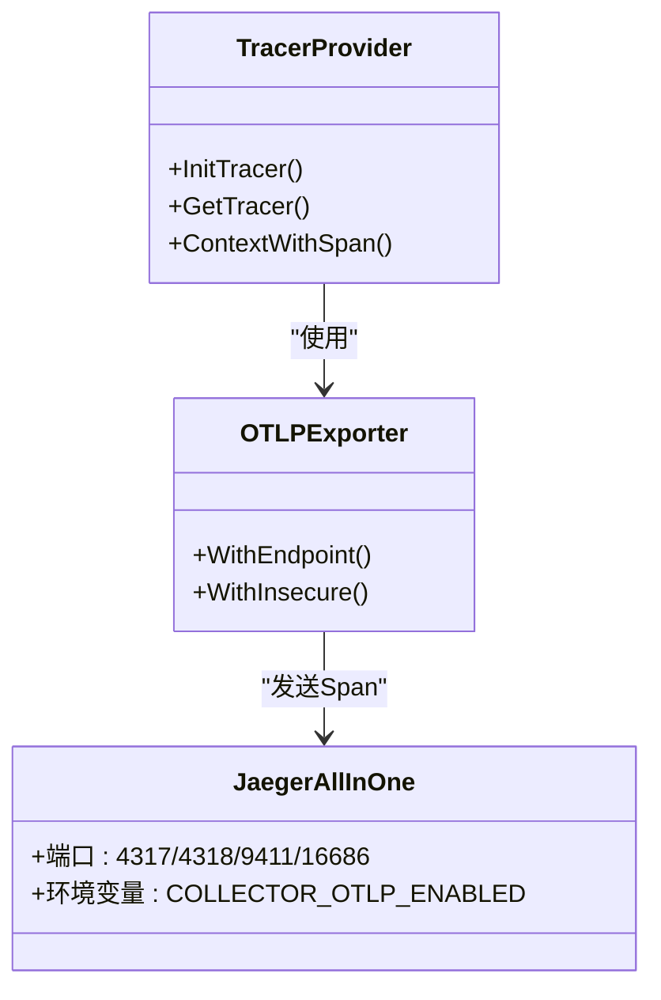
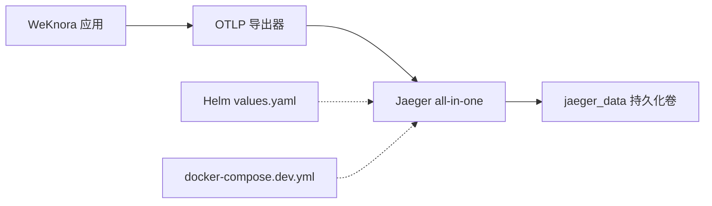

# Jaeger分布式追踪部署

<cite>
**本文引用的文件**
- [docker-compose.yml](file://docker-compose.yml)
- [docker-compose.dev.yml](file://docker-compose.dev.yml)
- [internal/tracing/init.go](file://internal/tracing/init.go)
- [helm/values.yaml](file://helm/values.yaml)
- [docs/Langfuse集成.md](file://docs/Langfuse集成.md)
</cite>

## 目录
1. [简介](#简介)
2. [项目结构](#项目结构)
3. [核心组件](#核心组件)
4. [架构总览](#架构总览)
5. [详细组件分析](#详细组件分析)
6. [依赖分析](#依赖分析)
7. [性能考虑](#性能考虑)
8. [故障排查指南](#故障排查指南)
9. [结论](#结论)
10. [附录](#附录)

## 简介
本文件面向SRE与运维工程师，提供WeKnora项目中Jaeger分布式追踪系统的完整Docker部署指导。内容涵盖：
- Jaeger all-in-one容器的配置参数、端口映射与环境变量
- OTLP gRPC与HTTP接收器配置、Zipkin兼容性端口作用
- Jaeger数据持久化机制、存储卷与数据清理策略
- Jaeger Web UI访问、追踪数据可视化与性能分析
- Jaeger集群部署高可用方案、数据备份恢复与监控告警
- 结合WeKnora应用的OpenTelemetry集成与最佳实践

## 项目结构
WeKnora通过Docker Compose提供一键式Jaeger部署，同时在Helm Chart中提供可选的Jaeger组件配置。应用侧通过OpenTelemetry SDK将追踪数据发送至Jaeger。

**图表来源**
- [docker-compose.yml:253-277](file://docker-compose.yml#L253-L277)
- [helm/values.yaml:485-493](file://helm/values.yaml#L485-L493)

**章节来源**
- [docker-compose.yml:253-277](file://docker-compose.yml#L253-L277)
- [helm/values.yaml:485-493](file://helm/values.yaml#L485-L493)

## 核心组件
- Jaeger all-in-one容器：集成了Collector、Ingester、Query与Storage，适合开发与小规模生产。
- OpenTelemetry SDK（Go）：WeKnora应用在运行时通过OTLP导出器将追踪数据发送到Jaeger。
- 持久化卷：将Jaeger的数据目录挂载到宿主机卷，实现数据持久化与备份。
- 环境变量：控制Jaeger接收器能力与Zipkin兼容端口。

关键要点
- 应用侧通过环境变量配置OTEL_EXPORTER_OTLP_ENDPOINT指向Jaeger的OTLP端口。
- Jaeger容器暴露多个端口，包括OTLP gRPC/HTTP、Zipkin兼容端口与Web UI端口。
- 通过卷挂载实现数据持久化，便于备份与恢复。

**章节来源**
- [docker-compose.yml:69-71](file://docker-compose.yml#L69-L71)
- [docker-compose.yml:253-277](file://docker-compose.yml#L253-L277)
- [internal/tracing/init.go:43-52](file://internal/tracing/init.go#L43-L52)

## 架构总览
WeKnora应用与Jaeger之间的交互路径如下：

**图表来源**
- [internal/tracing/init.go:43-52](file://internal/tracing/init.go#L43-L52)
- [docker-compose.yml:253-277](file://docker-compose.yml#L253-L277)

## 详细组件分析

### Jaeger all-in-one容器配置
- 镜像与端口映射
  - 镜像：jaegertracing/all-in-one
  - 端口映射：6831/udp、6832/udp、5778、16686、4317、4318、14250、14268、9411
- 环境变量
  - COLLECTOR_OTLP_ENABLED=true：启用OTLP接收器
  - COLLECTOR_ZIPKIN_HOST_PORT=:9411：启用Zipkin兼容端口
- 持久化卷
  - 挂载/var/lib/jaeger到宿主机卷，实现数据持久化

**图表来源**
- [docker-compose.yml:253-277](file://docker-compose.yml#L253-L277)

**章节来源**
- [docker-compose.yml:253-277](file://docker-compose.yml#L253-L277)

### OTLP接收器配置（gRPC与HTTP）
- gRPC接收器：4317端口，适用于高性能、低延迟场景
- HTTP接收器：4318端口，便于与HTTP生态集成
- WeKnora应用通过环境变量配置OTEL_EXPORTER_OTLP_ENDPOINT为jaeger:4317，确保应用侧使用gRPC导出

**图表来源**
- [docker-compose.yml:69-71](file://docker-compose.yml#L69-L71)
- [docker-compose.yml:253-277](file://docker-compose.yml#L253-L277)

**章节来源**
- [docker-compose.yml:69-71](file://docker-compose.yml#L69-L71)
- [docker-compose.yml:253-277](file://docker-compose.yml#L253-L277)

### Zipkin兼容性端口
- 端口：9411
- 作用：允许Zipkin客户端或兼容Zipkin的探针将追踪数据发送到Jaeger，便于遗留系统或第三方工具无缝对接

**章节来源**
- [docker-compose.yml:268-268](file://docker-compose.yml#L268-L268)

### Jaeger Web UI访问与可视化
- 端口：16686
- 访问方式：浏览器访问http://<host>:16686
- 功能：查询、过滤、搜索与可视化展示追踪数据，支持性能分析与根因定位

**章节来源**
- [docker-compose.yml:260-260](file://docker-compose.yml#L260-L260)

### 数据持久化与清理策略
- 持久化卷：jaeger_data
- 数据目录：/var/lib/jaeger
- 清理策略建议
  - 定期备份：将jaeger_data卷进行快照或归档
  - 生命周期管理：结合存储卷配额与日志轮转策略
  - 清理操作：停止容器后删除卷前务必备份，避免数据丢失

**章节来源**
- [docker-compose.yml:270-270](file://docker-compose.yml#L270-L270)

### Helm Chart中的Jaeger配置
- 默认状态：jaeger.enabled=false
- 配置项：jaeger.image.repository与jaeger.image.tag
- 启用方式：通过--set或values.yaml调整enabled=true

**章节来源**
- [helm/values.yaml:485-493](file://helm/values.yaml#L485-L493)

### 与OpenTelemetry集成
- 应用侧初始化：通过环境变量OTEL_EXPORTER_OTLP_ENDPOINT指定Jaeger端点
- 导出器：优先使用OTLP gRPC导出器，若未配置则回退到标准输出
- 传播器：设置TraceContext与Baggage传播器

**图表来源**
- [internal/tracing/init.go:43-52](file://internal/tracing/init.go#L43-L52)
- [docker-compose.yml:253-277](file://docker-compose.yml#L253-L277)

**章节来源**
- [internal/tracing/init.go:43-52](file://internal/tracing/init.go#L43-L52)
- [docker-compose.yml:69-71](file://docker-compose.yml#L69-L71)

## 依赖分析
- 应用到Jaeger：通过OTLP导出器建立依赖
- Jaeger到存储：通过持久化卷实现数据依赖
- Helm到Compose：Helm Chart中的jaeger配置与Compose profile保持一致

**图表来源**
- [docker-compose.yml:253-277](file://docker-compose.yml#L253-L277)
- [docker-compose.dev.yml:164-187](file://docker-compose.dev.yml#L164-L187)
- [helm/values.yaml:485-493](file://helm/values.yaml#L485-L493)

**章节来源**
- [docker-compose.yml:253-277](file://docker-compose.yml#L253-L277)
- [docker-compose.dev.yml:164-187](file://docker-compose.dev.yml#L164-L187)
- [helm/values.yaml:485-493](file://helm/values.yaml#L485-L493)

## 性能考虑
- OTLP gRPC vs HTTP：在高吞吐场景优先使用gRPC（4317），HTTP（4318）适合简单集成
- Zipkin兼容端口：仅在需要兼容Zipkin客户端时启用，避免不必要的负载
- 采样策略：应用侧使用AlwaysSample，生产环境建议根据流量与成本调优
- 资源规划：根据预期追踪量与保留周期规划磁盘容量与备份频率

[本节为通用指导，无需特定文件引用]

## 故障排查指南
- 无法连接Jaeger
  - 检查OTEL_EXPORTER_OTLP_ENDPOINT是否指向jaeger:4317
  - 确认容器网络与端口映射
- Web UI无法访问
  - 检查16686端口映射与防火墙
- 数据未显示
  - 确认OTLP导出器初始化成功
  - 检查COLLECTOR_OTLP_ENABLED与Zipkin端口配置
- 数据清理与备份
  - 备份jaeger_data卷后清理
  - 恢复时将备份还原到相同路径

**章节来源**
- [docker-compose.yml:69-71](file://docker-compose.yml#L69-L71)
- [docker-compose.yml:253-277](file://docker-compose.yml#L253-L277)

## 结论
WeKnora通过Docker Compose提供了开箱即用的Jaeger部署方案，结合OpenTelemetry SDK实现了应用侧的追踪数据采集。通过合理的端口映射、环境变量与持久化卷配置，可满足开发与小规模生产的分布式追踪需求。对于更高可用与大规模场景，建议采用Jaeger集群部署方案，并配套完善的数据备份、监控与告警体系。

[本节为总结性内容，无需特定文件引用]

## 附录

### Jaeger端口与用途对照
- 6831/udp：Jaeger Thrift接收器（兼容旧版）
- 6832/udp：Jaeger Thrift接收器（Compact）
- 5778：配置端口
- 16686：Web UI
- 4317：OTLP gRPC接收器
- 4318：OTLP HTTP接收器
- 14250：接收模型端口
- 14268：Jaeger HTTP接收器
- 9411：Zipkin兼容端口

**章节来源**
- [docker-compose.yml:256-265](file://docker-compose.yml#L256-L265)

### 开发与生产差异
- 开发环境：docker-compose.dev.yml同样提供Jaeger profile，便于本地调试
- 生产环境：建议启用Helm Chart中的jaeger组件或独立部署Jaeger集群

**章节来源**
- [docker-compose.dev.yml:164-187](file://docker-compose.dev.yml#L164-L187)
- [helm/values.yaml:485-493](file://helm/values.yaml#L485-L493)

### 与Langfuse集成的对比参考
- Langfuse提供更丰富的观测维度（token用量、流式TTFT等），但Jaeger专注于分布式追踪与性能分析
- 两者可并存：Jaeger负责追踪，Langfuse负责LLM与任务链路观测

**章节来源**
- [docs/Langfuse集成.md:1-14](file://docs/Langfuse集成.md#L1-L14)