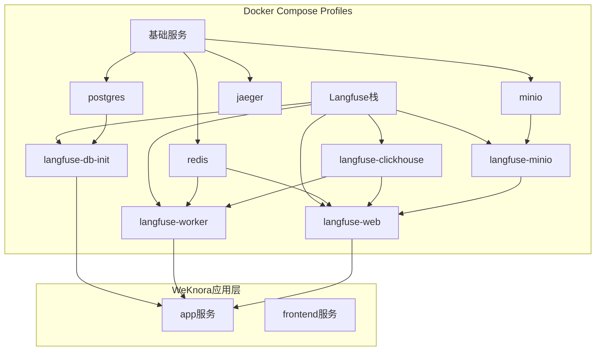
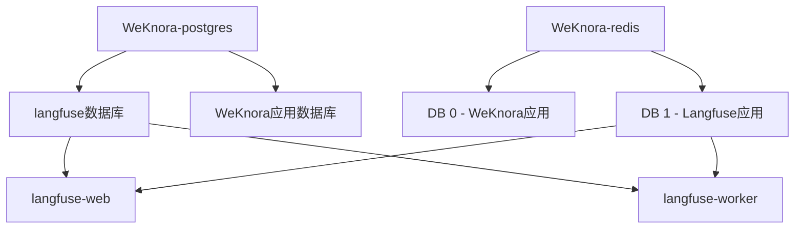
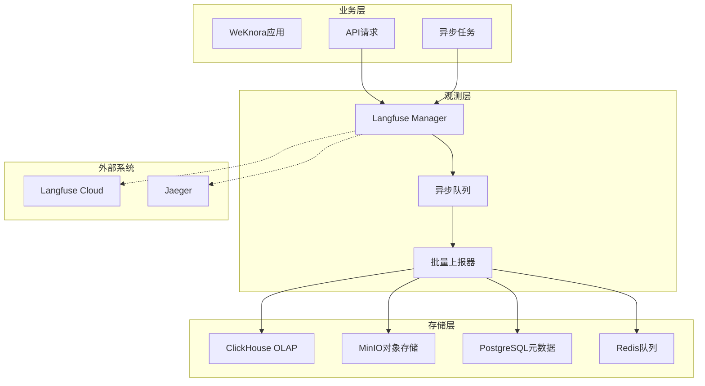
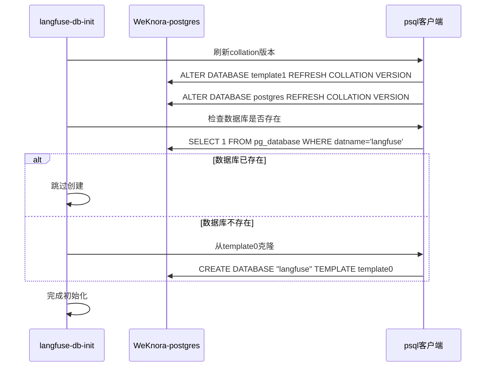
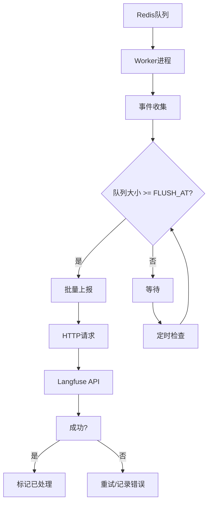
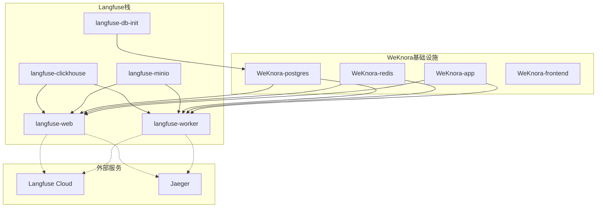
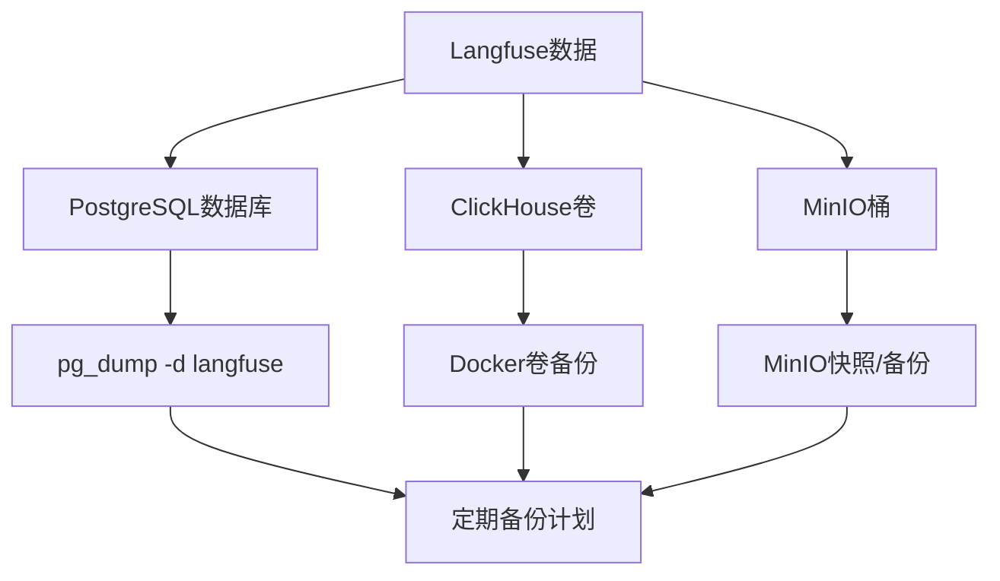

# Langfuse可观测性栈部署

<cite>
**本文档引用的文件**
- [docker-compose.yml](file://docker-compose.yml)
- [docker-compose.dev.yml](file://docker-compose.dev.yml)
- [Langfuse集成.md](file://docs/Langfuse集成.md)
- [container.go](file://internal/container/container.go)
- [init.go](file://internal/tracing/init.go)
- [config.go](file://internal/tracing/langfuse/config.go)
- [manager.go](file://internal/tracing/langfuse/manager.go)
</cite>

## 目录
1. [简介](#简介)
2. [项目结构](#项目结构)
3. [核心组件](#核心组件)
4. [架构概览](#架构概览)
5. [详细组件分析](#详细组件分析)
6. [依赖关系分析](#依赖关系分析)
7. [性能考虑](#性能考虑)
8. [故障排除指南](#故障排除指南)
9. [结论](#结论)
10. [附录](#附录)

## 简介

WeKnora项目集成了Langfuse自建可观测性栈，为AI应用提供全面的链路追踪、令牌使用统计和性能监控能力。该部署方案通过Docker Compose实现了Langfuse Web应用、Worker服务、ClickHouse OLAP数据库和专用MinIO存储的协同部署，同时巧妙地复用了WeKnora现有的PostgreSQL和Redis实例。

Langfuse可观测性栈的核心价值在于：
- **完全可选**：不配置环境变量时，Langfuse相关代码路径为no-op，不影响其他观测组件
- **异步批量上报**：不阻塞业务请求；队列满时静默丢弃，确保用户体验
- **开箱即用**：Docker Compose内置环境变量配置，支持多种部署方式

## 项目结构

WeKnora的Langfuse部署采用模块化设计，通过Docker Compose的profiles功能实现按需启动：



**图表来源**
- [docker-compose.yml:377-594](file://docker-compose.yml#L377-L594)

**章节来源**
- [docker-compose.yml:1-613](file://docker-compose.yml#L1-L613)
- [docker-compose.dev.yml:1-420](file://docker-compose.dev.yml#L1-L420)

## 核心组件

### Langfuse自建栈组件

Langfuse自建栈通过复用WeKnora现有基础设施，实现了资源优化的部署方案：

| 组件 | 来源 | 配置要点 | 资源开销 |
|------|------|----------|----------|
| **langfuse-db-init** | 一次性容器 | 幂等创建langfuse数据库 | - |
| **langfuse-web** | Web应用 | Next.js应用，端口3000 | 300-500MB |
| **langfuse-worker** | Worker服务 | Node.js队列消费者 | 200-400MB |
| **langfuse-clickhouse** | OLAP存储 | ClickHouse 24.8 | 500MB-1GB |
| **langfuse-minio** | 对象存储 | MinIO专用桶 | 100-200MB |

### 数据库复用策略

Langfuse通过以下策略复用WeKnora现有PostgreSQL和Redis实例：



**图表来源**
- [docker-compose.yml:380-383](file://docker-compose.yml#L380-L383)
- [docker-compose.yml:514-518](file://docker-compose.yml#L514-L518)

**章节来源**
- [docker-compose.yml:395-428](file://docker-compose.yml#L395-L428)
- [docker-compose.yml:430-452](file://docker-compose.yml#L430-L452)
- [docker-compose.yml:454-480](file://docker-compose.yml#L454-L480)
- [docker-compose.yml:482-552](file://docker-compose.yml#L482-L552)
- [docker-compose.yml:554-594](file://docker-compose.yml#L554-L594)

## 架构概览

Langfuse可观测性栈采用分层架构设计，实现了业务逻辑与观测系统的解耦：



**图表来源**
- [docker-compose.yml:75-90](file://docker-compose.yml#L75-L90)
- [docker-compose.yml:500-511](file://docker-compose.yml#L500-L511)
- [docker-compose.yml:573-577](file://docker-compose.yml#L573-L577)

## 详细组件分析

### Langfuse数据库初始化

langfuse-db-init容器负责在现有PostgreSQL实例中创建独立的langfuse数据库，采用幂等设计确保重复部署的安全性：



**图表来源**
- [docker-compose.yml:407-422](file://docker-compose.yml#L407-L422)

**章节来源**
- [docker-compose.yml:395-428](file://docker-compose.yml#L395-L428)

### Langfuse Web应用配置

langfuse-web容器提供用户界面和API服务，通过环境变量配置实现灵活的部署选项：

| 环境变量 | 默认值 | 用途 |
|----------|--------|------|
| `LANGFUSE_HOST` | `https://cloud.langfuse.com` | Langfuse实例地址 |
| `LANGFUSE_PUBLIC_KEY` | 无 | 项目Public Key |
| `LANGFUSE_SECRET_KEY` | 无 | 项目Secret Key |
| `NEXTAUTH_URL` | `http://localhost:3000` | 认证回调地址 |
| `NEXTAUTH_SECRET` | 开发占位符 | NextAuth密钥 |
| `TELEMETRY_ENABLED` | `false` | 是否启用遥测 |
| `CLICKHOUSE_URL` | `http://langfuse-clickhouse:8123` | ClickHouse连接地址 |

**章节来源**
- [docker-compose.yml:578-589](file://docker-compose.yml#L578-L589)
- [docker-compose.yml:527-528](file://docker-compose.yml#L527-L528)

### Langfuse Worker服务

langfuse-worker容器负责消费队列中的事件并批量上报到Langfuse服务：



**图表来源**
- [docker-compose.yml:482-511](file://docker-compose.yml#L482-L511)
- [docker-compose.yml:500-511](file://docker-compose.yml#L500-L511)

**章节来源**
- [docker-compose.yml:482-552](file://docker-compose.yml#L482-L552)

### ClickHouse配置

Langfuse使用ClickHouse作为OLAP存储，专门处理事件数据的高效查询：

| 配置项 | 值 | 说明 |
|--------|----|------|
| `CLICKHOUSE_DB` | `default` | 数据库名称 |
| `CLICKHOUSE_USER` | `clickhouse` | 用户名 |
| `CLICKHOUSE_PASSWORD` | `clickhouse` | 密码 |
| `CLICKHOUSE_CLUSTER_ENABLED` | `"false"` | 集群模式禁用 |
| `CLICKHOUSE_MIGRATION_URL` | `clickhouse://langfuse-clickhouse:9000` | 迁移连接 |

**章节来源**
- [docker-compose.yml:435-438](file://docker-compose.yml#L435-L438)
- [docker-compose.yml:528-532](file://docker-compose.yml#L528-L532)

### MinIO存储配置

专用的MinIO实例为Langfuse提供对象存储服务，支持事件和媒体文件的存储：

| 配置项 | 值 | 说明 |
|--------|----|------|
| `LANGFUSE_S3_EVENT_UPLOAD_BUCKET` | `langfuse` | 事件上传桶 |
| `LANGFUSE_S3_MEDIA_UPLOAD_BUCKET` | `langfuse` | 媒体上传桶 |
| `LANGFUSE_S3_EVENT_UPLOAD_ENDPOINT` | `http://langfuse-minio:9000` | 事件上传端点 |
| `LANGFUSE_S3_MEDIA_UPLOAD_ENDPOINT` | `http://localhost:9100` | 媒体上传端点 |

**章节来源**
- [docker-compose.yml:533-547](file://docker-compose.yml#L533-L547)
- [docker-compose.yml:455-480](file://docker-compose.yml#L455-L480)

## 依赖关系分析

Langfuse可观测性栈与WeKnora应用的依赖关系体现了松耦合的设计原则：



**图表来源**
- [docker-compose.yml:395-594](file://docker-compose.yml#L395-L594)

**章节来源**
- [docker-compose.yml:377-594](file://docker-compose.yml#L377-L594)
- [container.go:339-342](file://internal/container/container.go#L339-L342)

## 性能考虑

### 资源开销估算

Langfuse自建栈的资源开销相比完全隔离的部署方案有显著优化：

| 组件 | 典型RSS | 优化收益 |
|------|---------|----------|
| langfuse-db-init | - | 一次性容器，部署后退出 |
| langfuse-web | 300-500MB | Next.js应用 |
| langfuse-worker | 200-400MB | Node.js队列消费者 |
| langfuse-clickhouse | 500MB-1GB | 首次迁移后稳定 |
| langfuse-minio | 100-200MB | 专用存储 |
| **总计** | **≈1.0-1.5GB** | 相比完全隔离方案节省400-500MB |

### 配置调优参数

根据流量规模调整以下关键参数：

| 参数 | 默认值 | 高流量建议 | 说明 |
|------|--------|------------|------|
| `LANGFUSE_FLUSH_AT` | `15` | `50-100` | 批处理大小，降低HTTP调用频率 |
| `LANGFUSE_QUEUE_SIZE` | `2048` | `8192` | 内存队列容量，防止峰值丢弃 |
| `LANGFUSE_SAMPLE_RATE` | `1.0` | `0.1` | 采样率，平衡成本与信噪比 |
| `LANGFUSE_FLUSH_INTERVAL` | `3s` | `5s-1m` | 定时刷新间隔 |

**章节来源**
- [Langfuse集成.md:270-276](file://docs/Langfuse集成.md#L270-L276)
- [docker-compose.yml:209-210](file://docker-compose.yml#L209-L210)

## 故障排除指南

### 常见问题诊断

| 症状 | 可能原因 | 解决方案 |
|------|----------|----------|
| 启动日志无"[Langfuse] enabled"| 缺少LANGFUSE_PUBLIC_KEY/SECRET_KEY | 检查环境变量配置 |
| 控制台无trace显示 | HOST配置错误或网络拦截 | 验证LANGFUSE_HOST可达性 |
| 部分事件丢失 | 队列容量不足 | 调大LANGFUSE_QUEUE_SIZE |
| 令牌数为0 | 模型未返回usage信息 | 启用模型usage统计或配置tokenizer |

### Redis配置优化

为确保Langfuse队列稳定性，建议在Redis中设置：

```bash
# Langfuse建议的Redis配置
maxmemory-policy noeviction
```

**章节来源**
- [Langfuse集成.md:282-289](file://docs/Langfuse集成.md#L282-L289)
- [Langfuse集成.md:116-118](file://docs/Langfuse集成.md#L116-L118)

### 备份策略

Langfuse数据的备份策略：



**图表来源**
- [Langfuse集成.md:118-119](file://docs/Langfuse集成.md#L118-L119)

## 结论

WeKnora的Langfuse可观测性栈部署方案展现了优秀的工程实践：

1. **资源优化**：通过复用现有PostgreSQL和Redis实例，将新增资源开销控制在1.0-1.5GB范围内
2. **部署灵活性**：支持Cloud直连、自建栈、Helm等多种部署方式
3. **性能保障**：异步批量上报机制确保业务性能不受影响
4. **运维友好**：完善的故障排除指南和备份策略

该方案为开发者和SRE团队提供了完整的Langfuse可观测性栈部署指导，既满足了生产环境的性能要求，又保持了部署的简洁性和可维护性。

## 附录

### 部署步骤摘要

1. **准备环境变量**
   - 获取Langfuse Cloud API密钥
   - 配置LANGFUSE_HOST、LANGFUSE_PUBLIC_KEY、LANGFUSE_SECRET_KEY

2. **启动自建栈**
   ```bash
   docker compose --profile langfuse up -d
   ```

3. **初始化数据库**
   - 访问http://localhost:3000注册管理员
   - 在Settings→API Keys生成项目密钥

4. **配置应用**
   ```bash
   # 更新.env文件
   LANGFUSE_HOST=http://langfuse-web:3000
   LANGFUSE_PUBLIC_KEY=your_public_key
   LANGFUSE_SECRET_KEY=your_secret_key
   
   # 重启应用服务
   docker compose up -d app
   ```

### 安全最佳实践

- **密钥管理**：使用密钥管理工具存储LANGFUSE_SECRET_KEY
- **密码强度**：生产环境使用强密码替换默认占位符
- **网络隔离**：考虑将Langfuse组件部署在独立网络中
- **访问控制**：限制对Langfuse UI和API的访问权限