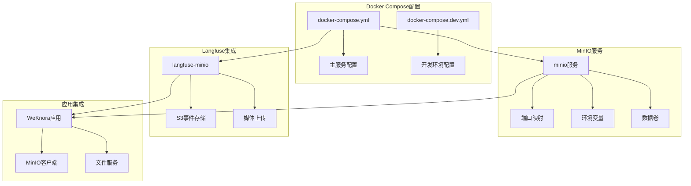
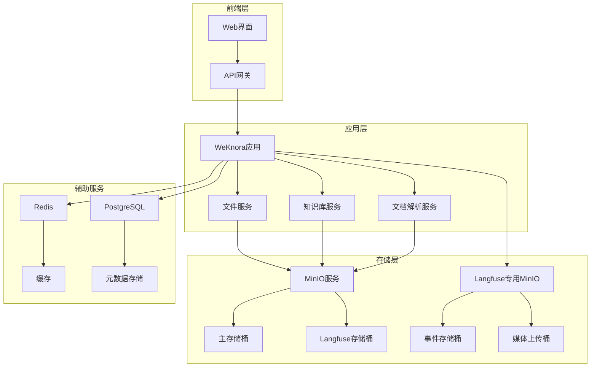
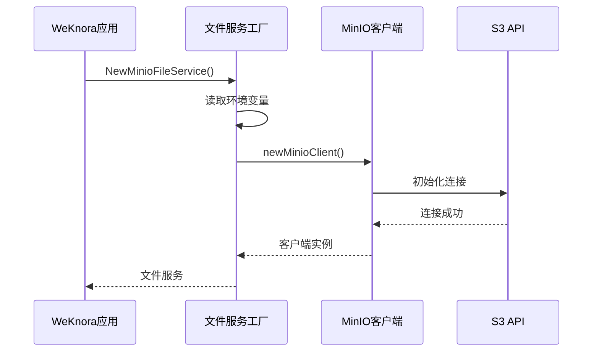
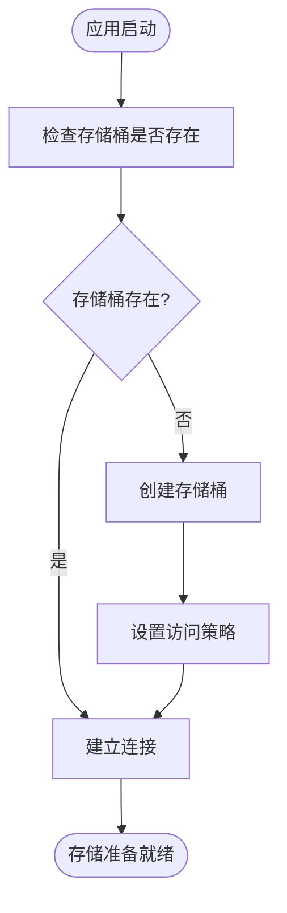
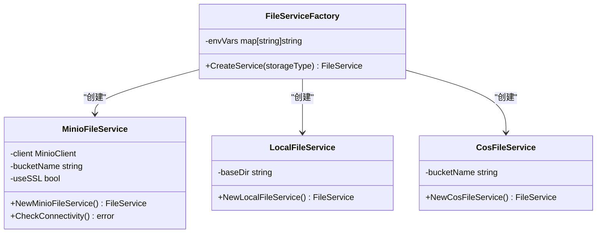
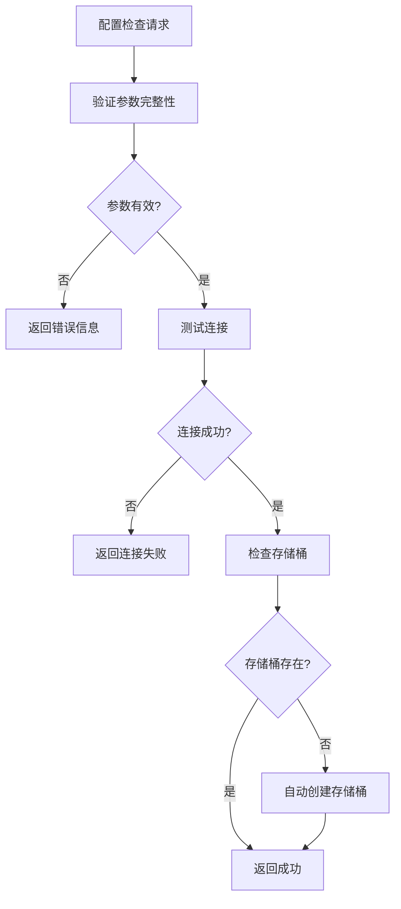
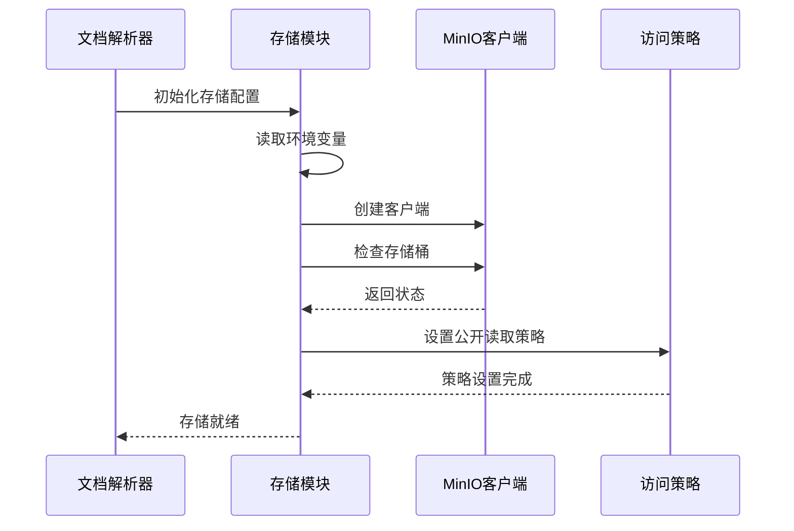
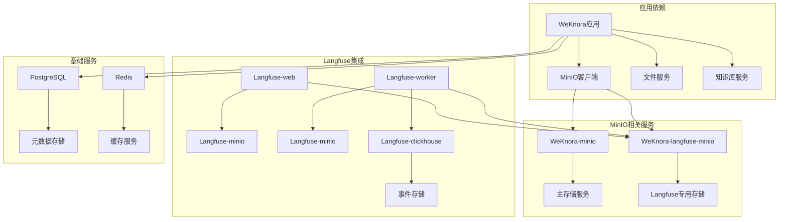
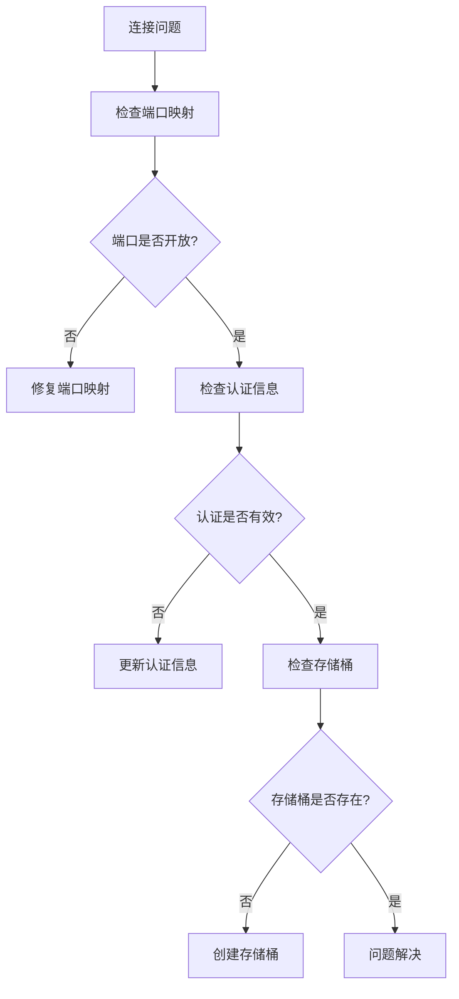

# MinIO对象存储部署

<cite>
**本文档引用的文件**
- [docker-compose.yml](file://docker-compose.yml)
- [docker-compose.dev.yml](file://docker-compose.dev.yml)
- [internal/application/service/file/minio.go](file://internal/application/service/file/minio.go)
- [internal/application/service/file/factory.go](file://internal/application/service/file/factory.go)
- [internal/handler/system.go](file://internal/handler/system.go)
- [frontend/src/views/settings/StorageEngineSettings.vue](file://frontend/src/views/settings/StorageEngineSettings.vue)
- [docreader/parser/storage.py](file://docreader/parser/storage.py)
- [scripts/docker-entrypoint.sh](file://scripts/docker-entrypoint.sh)
- [docs/Langfuse集成.md](file://docs/Langfuse集成.md)
</cite>

## 目录
1. [简介](#简介)
2. [项目结构](#项目结构)
3. [核心组件](#核心组件)
4. [架构概览](#架构概览)
5. [详细组件分析](#详细组件分析)
6. [依赖关系分析](#依赖关系分析)
7. [性能考虑](#性能考虑)
8. [故障排除指南](#故障排除指南)
9. [结论](#结论)
10. [附录](#附录)

## 简介

WeKnora项目中的MinIO对象存储服务提供了容器化的对象存储解决方案，支持多种部署模式和集成场景。本文档详细介绍了MinIO服务容器的配置参数、端口映射、环境变量设置，以及与WeKnora应用的深度集成。

MinIO在WeKnora中扮演着多重角色：
- **文档存储**：支持知识库文档的上传和管理
- **媒体资源**：处理图片、附件等多媒体文件
- **Langfuse集成**：作为事件存储和媒体上传的S3兼容存储
- **分布式部署**：支持集群模式实现高可用

## 项目结构

WeKnora项目采用Docker Compose进行容器编排，MinIO相关的配置分布在多个文件中：

**图表来源**
- [docker-compose.yml:230-251](file://docker-compose.yml#L230-L251)
- [docker-compose.yml:454-480](file://docker-compose.yml#L454-L480)

**章节来源**
- [docker-compose.yml:1-613](file://docker-compose.yml#L1-L613)
- [docker-compose.dev.yml:1-420](file://docker-compose.dev.yml#L1-L420)

## 核心组件

### MinIO服务配置

MinIO服务在生产环境中通过以下关键配置实现：

#### 基础配置
- **镜像版本**：`minio/minio:RELEASE.2025-09-07T16-13-09Z`
- **容器名称**：`WeKnora-minio`
- **数据目录**：`/data`

#### 端口映射
- **S3 API端口**：`${MINIO_PORT:-9000}:9000` (默认9000)
- **控制台端口**：`${MINIO_CONSOLE_PORT:-9001}:9001` (默认9001)

#### 环境变量
- **根用户**：`MINIO_ROOT_USER=${MINIO_ACCESS_KEY_ID:-minioadmin}`
- **根密码**：`MINIO_ROOT_PASSWORD=${MINIO_SECRET_ACCESS_KEY:-minioadmin}`

**章节来源**
- [docker-compose.yml:230-251](file://docker-compose.yml#L230-L251)

### Langfuse专用MinIO配置

为满足Langfuse的独立存储需求，项目提供了专用的MinIO实例：

#### 独立部署
- **镜像版本**：`minio/minio:RELEASE.2025-09-07T16-13-09Z`
- **容器名称**：`WeKnora-langfuse-minio`
- **初始化脚本**：启动前自动创建`langfuse`桶

#### 端口映射
- **S3 API端口**：`${LANGFUSE_MINIO_S3_PORT:-9100}:9000`
- **控制台端口**：`${LANGFUSE_MINIO_CONSOLE_PORT:-9101}:9001`

#### 环境变量
- **用户名**：`${LANGFUSE_MINIO_USER:-langfuseminio}`
- **密码**：`${LANGFUSE_MINIO_PASSWORD:-langfuseminiosecret}`

**章节来源**
- [docker-compose.yml:454-480](file://docker-compose.yml#L454-L480)

## 架构概览

MinIO在WeKnora的整体架构中承担着关键的存储角色：

**图表来源**
- [docker-compose.yml:230-251](file://docker-compose.yml#L230-L251)
- [docker-compose.yml:454-480](file://docker-compose.yml#L454-L480)

## 详细组件分析

### MinIO客户端实现

WeKnora应用通过Go客户端与MinIO进行交互，实现了完整的文件存储功能：

#### 客户端初始化

**图表来源**
- [internal/application/service/file/minio.go:42-61](file://internal/application/service/file/minio.go#L42-L61)

#### 存储桶管理
应用启动时会自动检查和创建必要的存储桶：

**图表来源**
- [internal/application/service/file/minio.go:50-58](file://internal/application/service/file/minio.go#L50-L58)

**章节来源**
- [internal/application/service/file/minio.go:1-100](file://internal/application/service/file/minio.go#L1-L100)

### 配置工厂模式

WeKnora采用了工厂模式来管理不同类型的存储后端：

**图表来源**
- [internal/application/service/file/factory.go:51-70](file://internal/application/service/file/factory.go#L51-L70)

**章节来源**
- [internal/application/service/file/factory.go:1-100](file://internal/application/service/file/factory.go#L1-L100)

### 系统配置检查

应用提供了完整的存储配置检查功能：

#### 配置验证流程

**图表来源**
- [internal/handler/system.go:627-676](file://internal/handler/system.go#L627-L676)

**章节来源**
- [internal/handler/system.go:373-387](file://internal/handler/system.go#L373-L387)
- [internal/handler/system.go:627-676](file://internal/handler/system.go#L627-L676)

### 前端配置界面

前端提供了直观的存储引擎配置界面：

#### 配置模式
- **Docker模式**：自动检测并使用容器内配置
- **远程模式**：手动输入外部MinIO服务信息

#### 关键配置项
- **存储桶名称**：`bucket_name`
- **SSL使用**：`use_ssl`
- **路径前缀**：`path_prefix`
- **端点配置**：`endpoint`
- **访问密钥**：`access_key_id`

**章节来源**
- [frontend/src/views/settings/StorageEngineSettings.vue:146-205](file://frontend/src/views/settings/StorageEngineSettings.vue#L146-L205)

### 文档解析存储集成

文档解析服务同样集成了MinIO存储：

#### Python存储客户端

**图表来源**
- [docreader/parser/storage.py:146-175](file://docreader/parser/storage.py#L146-L175)

**章节来源**
- [docreader/parser/storage.py:146-175](file://docreader/parser/storage.py#L146-L175)

## 依赖关系分析

### 服务依赖图

**图表来源**
- [docker-compose.yml:230-251](file://docker-compose.yml#L230-L251)
- [docker-compose.yml:454-480](file://docker-compose.yml#L454-L480)

### 环境变量依赖

| 环境变量 | 用途 | 默认值 | 必需性 |
|---------|------|--------|--------|
| `MINIO_ENDPOINT` | MinIO服务端点 | `minio:9000` | 是 |
| `MINIO_ACCESS_KEY_ID` | 访问密钥ID | `minioadmin` | 是 |
| `MINIO_SECRET_ACCESS_KEY` | 秘密访问密钥 | `minioadmin` | 是 |
| `MINIO_BUCKET_NAME` | 默认存储桶名称 | 空 | 否 |
| `MINIO_PORT` | S3 API端口 | `9000` | 否 |
| `MINIO_CONSOLE_PORT` | 控制台端口 | `9001` | 否 |

**章节来源**
- [docker-compose.yml:113-116](file://docker-compose.yml#L113-L116)
- [docker-compose.yml:236-238](file://docker-compose.yml#L236-L238)

## 性能考虑

### 存储优化策略

1. **连接池管理**：MinIO客户端支持连接复用，减少连接建立开销
2. **批量操作**：支持批量文件上传和下载，提高传输效率
3. **压缩传输**：可配置GZIP压缩减少网络传输量
4. **缓存策略**：结合Redis实现元数据缓存

### 性能监控指标

- **连接成功率**：监控MinIO连接稳定性
- **传输速率**：监控文件上传下载速度
- **存储桶使用量**：监控存储空间使用情况
- **API响应时间**：监控S3 API调用延迟

## 故障排除指南

### 常见问题诊断

#### 连接问题

#### 配置验证
应用提供了完整的配置检查功能，包括：
- 端点可达性测试
- 认证信息验证
- 存储桶存在性检查
- 自动创建缺失的存储桶

**章节来源**
- [internal/handler/system.go:627-676](file://internal/handler/system.go#L627-L676)

### 日志分析

#### MinIO日志
- **访问日志**：记录所有S3 API调用
- **错误日志**：记录连接和认证失败
- **性能日志**：记录慢查询和超时

#### 应用日志
- **连接日志**：记录MinIO连接状态变化
- **操作日志**：记录文件上传下载操作
- **错误日志**：记录存储操作异常

## 结论

WeKnora项目中的MinIO部署展现了现代容器化应用的最佳实践：

### 核心优势
1. **灵活部署**：支持单机和集群模式
2. **深度集成**：与应用服务无缝集成
3. **多场景支持**：满足文档存储、媒体管理、事件存储等多种需求
4. **高可用性**：提供数据冗余和故障恢复能力

### 最佳实践建议
1. **生产环境配置**：使用强密码和SSL加密
2. **监控告警**：建立完善的监控和告警机制
3. **备份策略**：制定定期备份和灾难恢复计划
4. **性能优化**：根据业务需求调整存储配置

### 未来发展方向
- **集群部署**：实现MinIO集群以提高可用性和性能
- **数据加密**：增强数据传输和静态加密
- **访问控制**：细化用户权限和访问策略
- **成本优化**：实施存储生命周期管理和成本控制

## 附录

### 环境变量完整列表

| 变量名 | 描述 | 示例值 |
|--------|------|--------|
| `MINIO_ROOT_USER` | MinIO根用户 | `minioadmin` |
| `MINIO_ROOT_PASSWORD` | MinIO根密码 | `minioadmin` |
| `MINIO_ENDPOINT` | MinIO服务端点 | `minio:9000` |
| `MINIO_ACCESS_KEY_ID` | 访问密钥ID | `minioadmin` |
| `MINIO_SECRET_ACCESS_KEY` | 秘密访问密钥 | `minioadmin` |
| `MINIO_BUCKET_NAME` | 默认存储桶名称 | `weknora` |
| `MINIO_PORT` | S3 API端口 | `9000` |
| `MINIO_CONSOLE_PORT` | 控制台端口 | `9001` |

### 端口映射说明

| 端口 | 用途 | 协议 | 说明 |
|------|------|------|------|
| `9000` | S3 API | TCP | 对象存储服务 |
| `9001` | MinIO控制台 | TCP | Web管理界面 |
| `9100` | Langfuse S3 API | TCP | 事件存储服务 |
| `9101` | Langfuse控制台 | TCP | Web管理界面 |

### 数据持久化配置

MinIO使用Docker卷进行数据持久化：
- **主MinIO数据**：`minio_data:/data`
- **Langfuse MinIO数据**：`langfuse_minio_data:/data`

**章节来源**
- [docker-compose.yml:600-613](file://docker-compose.yml#L600-L613)