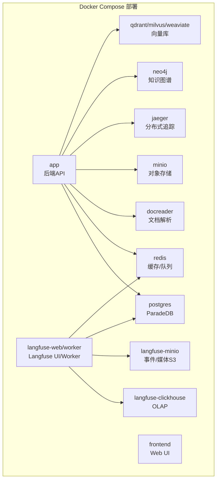
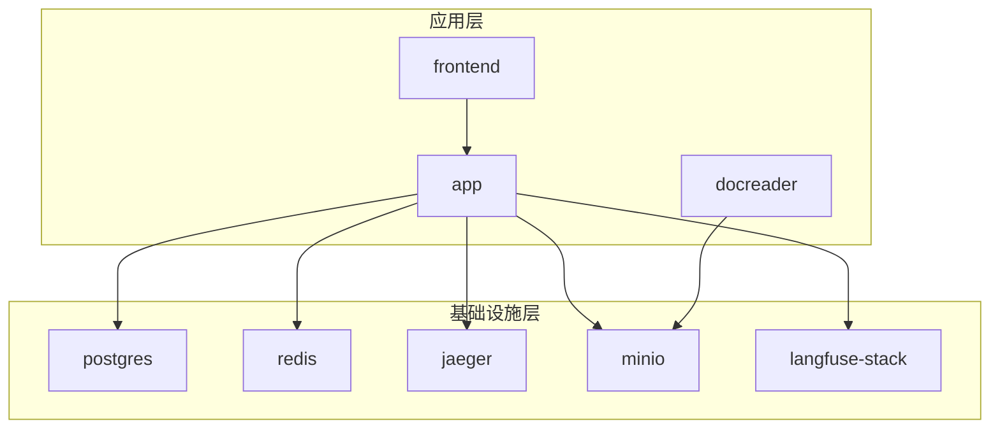
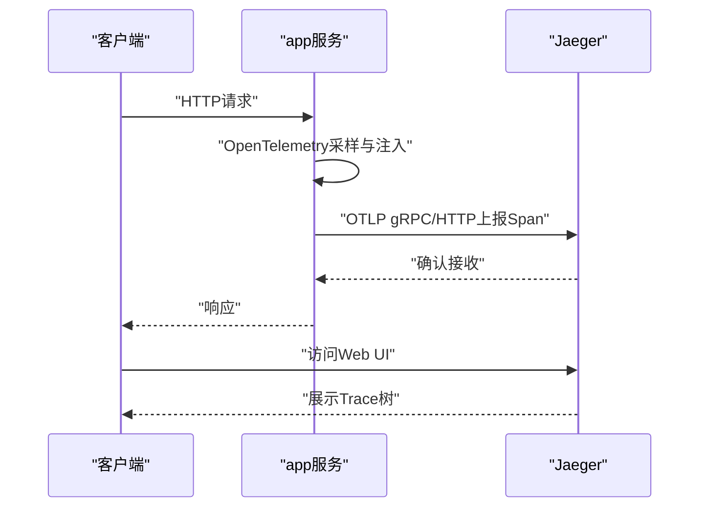
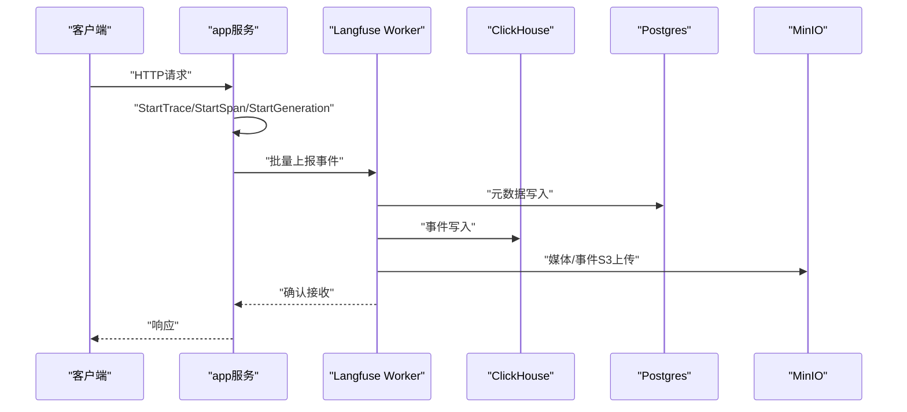
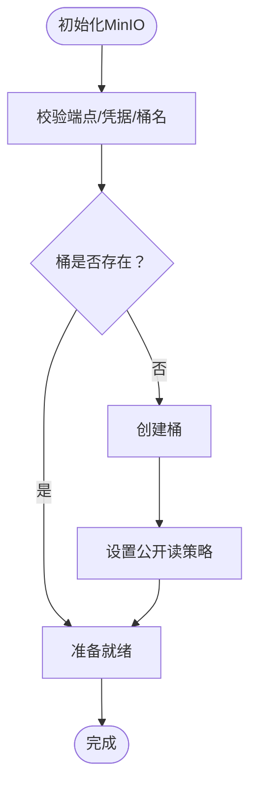
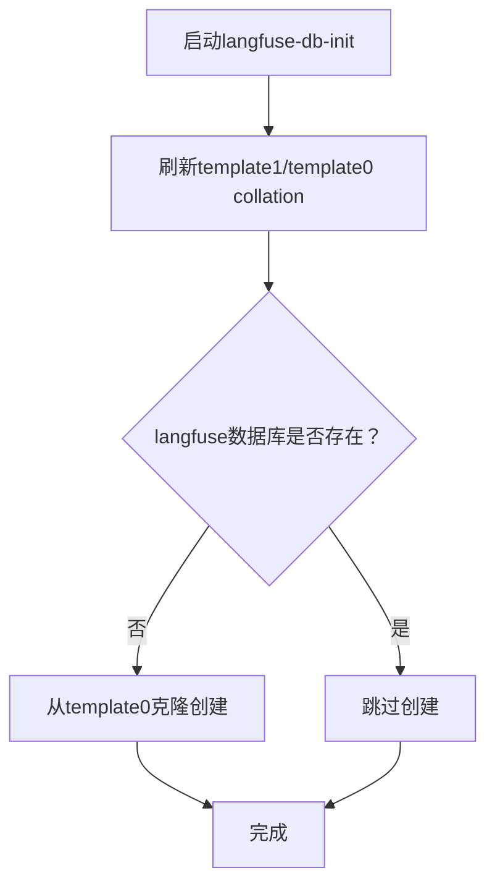
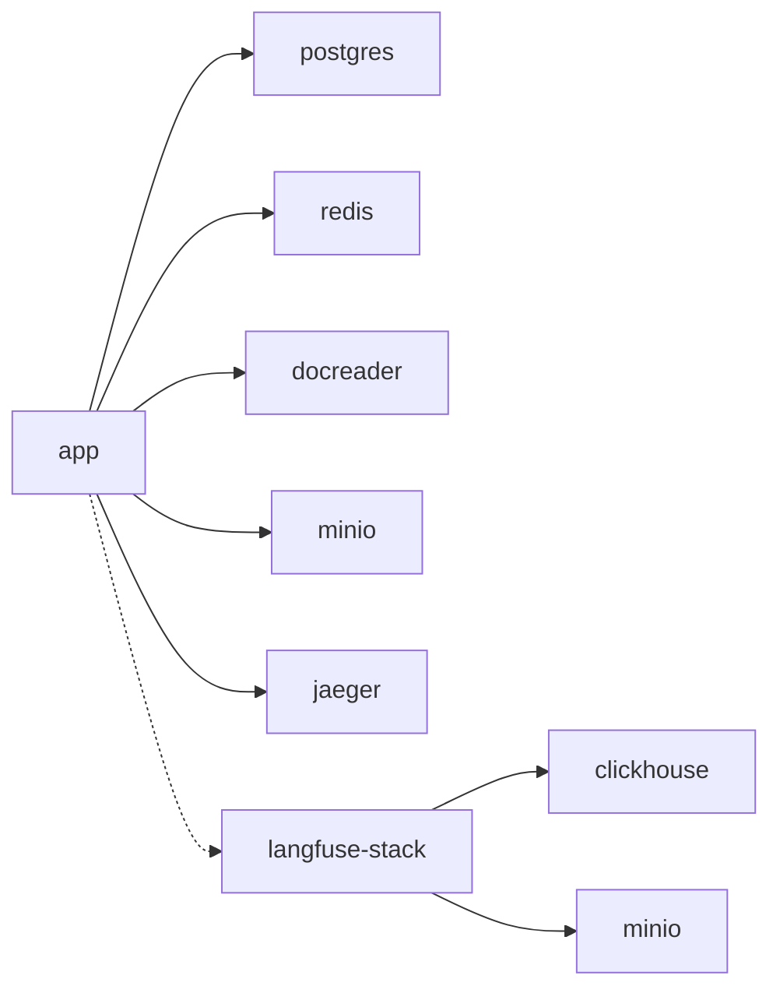

# 监控服务部署

<cite>
**本文引用的文件**
- [docker-compose.yml](file://docker-compose.yml)
- [docker-compose.dev.yml](file://docker-compose.dev.yml)
- [values.yaml](file://helm/values.yaml)
- [Chart.yaml](file://helm/Chart.yaml)
- [init.go](file://internal/tracing/init.go)
- [Langfuse集成.md](file://docs/Langfuse集成.md)
- [minio.go](file://internal/application/service/file/minio.go)
- [storage.py](file://docreader/parser/storage.py)
- [migrate.sh](file://scripts/migrate.sh)
</cite>

## 目录
1. [简介](#简介)
2. [项目结构](#项目结构)
3. [核心组件](#核心组件)
4. [架构总览](#架构总览)
5. [详细组件分析](#详细组件分析)
6. [依赖分析](#依赖分析)
7. [性能考虑](#性能考虑)
8. [故障排查指南](#故障排查指南)
9. [结论](#结论)
10. [附录](#附录)

## 简介
本文件面向运维工程师与SRE团队，提供WeKnora监控服务集群的Docker容器化部署与运维管理方案。重点涵盖：
- Jaeger分布式追踪的部署与配置
- Langfuse可观测性栈的自建与对接
- MinIO对象存储的部署与权限策略
- 监控服务初始化脚本、数据库创建与权限配置
- 监控数据采集机制、存储策略与查询优化
- 高可用部署方案、数据保留策略与告警配置
- 性能调优参数、资源使用优化与故障恢复机制

## 项目结构
WeKnora通过Docker Compose提供一键部署，包含应用服务、前端、文档解析、数据库、缓存、分布式追踪、知识图谱、向量库、对象存储与Langfuse自建栈等组件。Helm Chart提供Kubernetes部署能力。

图表来源
- [docker-compose.yml:1-613](file://docker-compose.yml#L1-L613)

章节来源
- [docker-compose.yml:1-613](file://docker-compose.yml#L1-L613)
- [docker-compose.dev.yml:1-420](file://docker-compose.dev.yml#L1-L420)

## 核心组件
- 应用服务(app)：提供后端API、健康检查、OpenTelemetry追踪导出至Jaeger、可选Langfuse观测、MinIO对象存储集成、Redis队列与流管理、向量库与知识图谱集成。
- 前端(frontend)：Nginx代理静态资源，反向代理后端API。
- 文档解析(docreader)：gRPC服务，负责文档解析与中间产物存储。
- 数据库(postgres)：ParadeDB，提供向量检索与全文搜索能力。
- 缓存与队列(redis)：提供持久化与队列能力，支持Langfuse建议的maxmemory-policy配置。
- 分布式追踪(jaeger)：All-in-one镜像，支持OTLP/Zipkin入口，Web UI可视化。
- 对象存储(minio)：S3兼容，支持桶策略与媒体直传。
- 知识图谱(neo4j)：可选，GraphRAG功能依赖。
- 向量库(qdrant/milvus/weaviate)：可选，多向量库适配。
- Langfuse自建栈(langfuse-web/worker/clickhouse/minio)：可选，复用现有postgres/redis，新增ClickHouse与专用MinIO。

章节来源
- [docker-compose.yml:28-170](file://docker-compose.yml#L28-L170)
- [docker-compose.yml:230-252](file://docker-compose.yml#L230-L252)
- [docker-compose.yml:253-277](file://docker-compose.yml#L253-L277)
- [docker-compose.yml:395-594](file://docker-compose.yml#L395-L594)

## 架构总览
WeKnora监控服务采用“应用层+基础设施层”的双层架构：
- 应用层：app服务承载业务逻辑，集成OpenTelemetry与Langfuse观测，连接数据库、缓存、对象存储与向量库。
- 基础设施层：Jaeger提供分布式追踪，Langfuse自建栈提供可观测性，MinIO提供对象存储，Redis/Postgres提供状态与数据持久化。

图表来源
- [docker-compose.yml:28-170](file://docker-compose.yml#L28-L170)
- [docker-compose.yml:230-277](file://docker-compose.yml#L230-L277)
- [docker-compose.yml:395-594](file://docker-compose.yml#L395-L594)

## 详细组件分析

### Jaeger分布式追踪
- 部署方式：All-in-one镜像，开放OTLP gRPC/HTTP、Zipkin兼容端口与Web UI端口。
- 导出配置：应用服务通过OTEL_EXPORTER_OTLP_ENDPOINT指向jaeger:4317，OTEL_TRACES_EXPORTER=otlp，传播器为tracecontext,baggage。
- 数据持久化：挂载jaeger_data卷，保障重启后UI可查看历史追踪。
- 可视化：Web UI端口16686，支持按服务、操作、标签过滤。

图表来源
- [docker-compose.yml:69-74](file://docker-compose.yml#L69-L74)
- [docker-compose.yml:253-277](file://docker-compose.yml#L253-L277)
- [init.go:44-78](file://internal/tracing/init.go#L44-L78)

章节来源
- [docker-compose.yml:69-74](file://docker-compose.yml#L69-L74)
- [docker-compose.yml:253-277](file://docker-compose.yml#L253-L277)
- [init.go:32-95](file://internal/tracing/init.go#L32-L95)

### Langfuse可观测性栈
- 集成方式：应用服务通过环境变量启用Langfuse，支持Cloud或自建栈。自建栈通过--profile langfuse一键拉起，复用现有postgres/redis，新增ClickHouse与专用MinIO。
- 数据模型：Trace（一次HTTP请求及其触发的任务）、Span（asynq任务/Agent执行/工具调用）、Generation（模型调用）。
- 异步批量上报：通过队列缓冲，避免阻塞业务；队列满时静默丢弃，保障SLA。
- 调优参数：flush_at、flush_interval、queue_size、request_timeout、sample_rate、debug等。
- 安全建议：生产环境替换默认密码与密钥，建议使用maxmemory-policy noeviction。

图表来源
- [docker-compose.yml:75-89](file://docker-compose.yml#L75-L89)
- [docker-compose.yml:395-594](file://docker-compose.yml#L395-L594)
- [Langfuse集成.md:1-309](file://docs/Langfuse集成.md#L1-L309)

章节来源
- [docker-compose.yml:75-89](file://docker-compose.yml#L75-L89)
- [docker-compose.yml:395-594](file://docker-compose.yml#L395-L594)
- [Langfuse集成.md:1-309](file://docs/Langfuse集成.md#L1-L309)

### MinIO对象存储
- 部署方式：S3兼容，提供Web控制台与API端口映射。
- 权限策略：支持桶策略设置，确保对象可公开读取；支持SSL与路径前缀配置。
- 连接性检测：应用侧提供CheckConnectivity方法，验证端点可达与桶存在性。
- 文档解析侧：Python解析器自动创建桶并设置公开读策略。

图表来源
- [docker-compose.yml:230-252](file://docker-compose.yml#L230-L252)
- [minio.go:42-91](file://internal/application/service/file/minio.go#L42-L91)
- [storage.py:146-175](file://docreader/parser/storage.py#L146-L175)

章节来源
- [docker-compose.yml:230-252](file://docker-compose.yml#L230-L252)
- [minio.go:42-91](file://internal/application/service/file/minio.go#L42-L91)
- [storage.py:146-175](file://docreader/parser/storage.py#L146-L175)

### 监控服务初始化脚本与数据库创建
- 初始化脚本：langfuse-db-init容器在启动时刷新模板collation并幂等创建langfuse数据库，避免与宿主ICU版本不匹配导致的创建失败。
- 数据库迁移：提供migrate.sh脚本，支持up/down/create/version/force/goto等命令，自动处理密码URL编码与sslmode配置。
- 权限配置：Langfuse自建栈复用现有postgres/redis，通过独立DB与专用MinIO实现资源隔离。

图表来源
- [docker-compose.yml:397-428](file://docker-compose.yml#L397-L428)
- [migrate.sh:1-122](file://scripts/migrate.sh#L1-L122)

章节来源
- [docker-compose.yml:397-428](file://docker-compose.yml#L397-L428)
- [migrate.sh:1-122](file://scripts/migrate.sh#L1-L122)

### 监控数据收集机制、存储策略与查询优化
- 数据收集：应用服务通过OpenTelemetry自动采样并导出至Jaeger；Langfuse通过异步队列批量上报至ClickHouse与MinIO。
- 存储策略：Langfuse事件主体写入ClickHouse，元数据与任务队列写入Postgres；MinIO存储事件与媒体对象。
- 查询优化：Langfuse提供Sessions视图与按trace/session维度聚合；ClickHouse适合OLAP分析；Redis队列容量与flush策略决定吞吐与延迟权衡。

章节来源
- [Langfuse集成.md:226-268](file://docs/Langfuse集成.md#L226-L268)
- [docker-compose.yml:528-547](file://docker-compose.yml#L528-L547)

### 高可用部署方案、数据保留策略与告警配置
- 高可用：Helm Chart提供副本数配置与探针设置；Redis/Postgres建议使用持久化与主从架构；Jaeger可横向扩展（All-in-one适合小规模，生产建议分离组件）。
- 数据保留：ClickHouse与MinIO卷可通过外部备份策略实现长期保留；Langfuse自建栈支持独立备份。
- 告警配置：结合Prometheus/Grafana或平台原生存活性/就绪探针进行告警；Jaeger UI可用于异常追踪定位。

章节来源
- [values.yaml:57-140](file://helm/values.yaml#L57-L140)
- [docker-compose.yml:212-220](file://docker-compose.yml#L212-L220)

### 性能调优参数、资源使用优化与故障恢复机制
- 性能调优：提高LANGFUSE_FLUSH_AT、增大QUEUE_SIZE、调整SAMPLE_RATE、优化FLUSH_INTERVAL；Redis建议maxmemory-policy noeviction。
- 资源优化：Langfuse自建栈复用现有postgres/redis，新增组件内存开销可控；按需启用profile减少资源占用。
- 故障恢复：Langfuse队列满静默丢弃避免阻塞；应用侧健康检查与优雅停机；数据库迁移脚本支持强制版本与goto迁移。

章节来源
- [Langfuse集成.md:270-277](file://docs/Langfuse集成.md#L270-L277)
- [docker-compose.yml:512-552](file://docker-compose.yml#L512-L552)
- [docker-compose.yml:212-220](file://docker-compose.yml#L212-L220)
- [migrate.sh:95-115](file://scripts/migrate.sh#L95-L115)

## 依赖分析
- 组件耦合：app服务依赖postgres、redis、docreader、minio、jaeger、langfuse（可选）；langfuse-web/worker依赖clickhouse与专用minio。
- 外部依赖：OTLP导出至Jaeger；Langfuse Cloud或自建实例；MinIO S3兼容API。
- 潜在循环依赖：无直接循环，但langfuse与app通过异步队列间接耦合。

图表来源
- [docker-compose.yml:28-170](file://docker-compose.yml#L28-L170)
- [docker-compose.yml:395-594](file://docker-compose.yml#L395-L594)

章节来源
- [docker-compose.yml:28-170](file://docker-compose.yml#L28-L170)
- [docker-compose.yml:395-594](file://docker-compose.yml#L395-L594)

## 性能考虑
- 追踪导出：OTLP gRPC低延迟，建议内网直连；采样策略与批量阈值需根据流量调优。
- Langfuse：队列容量与flush策略决定吞吐与延迟；高流量场景建议降低采样率与提高flush_at。
- 存储：ClickHouse适合高并发写入与复杂查询；MinIO直传媒体可降低应用压力。
- 缓存：Redis建议开启持久化与合理maxmemory策略，避免任务丢失。

## 故障排查指南
- 启动无Langfuse启用日志：检查LANGFUSE_PUBLIC_KEY/SECRET_KEY是否正确注入；容器内使用env过滤验证。
- 控制台无Trace：开启LANGFUSE_DEBUG，检查网络策略与HTTPS访问；确认Secret Key未轮换未更新。
- 部分事件缺失：增大QUEUE_SIZE；检查Langfuse ingest API返回码（429/503）。
- Token为0：模型未返回usage，需在模型侧开启usage统计或在Langfuse配置中提供tokenizer。

章节来源
- [Langfuse集成.md:282-289](file://docs/Langfuse集成.md#L282-L289)

## 结论
WeKnora提供了完善的监控服务容器化部署方案，通过Jaeger实现分布式追踪，通过Langfuse实现端到端可观测性，通过MinIO实现对象存储与媒体直传。结合Helm Chart与Docker Compose，可快速搭建高可用、可扩展的监控体系，并通过参数调优与资源隔离满足生产环境需求。

## 附录
- Helm Chart信息：Chart.yaml描述了应用版本与依赖，values.yaml提供了资源、探针与可选组件配置示例。
- 开发环境：docker-compose.dev.yml提供独立网络与容器命名，便于本地调试与Langfuse自建栈调试。

章节来源
- [Chart.yaml:1-27](file://helm/Chart.yaml#L1-L27)
- [values.yaml:1-493](file://helm/values.yaml#L1-L493)
- [docker-compose.dev.yml:1-420](file://docker-compose.dev.yml#L1-L420)