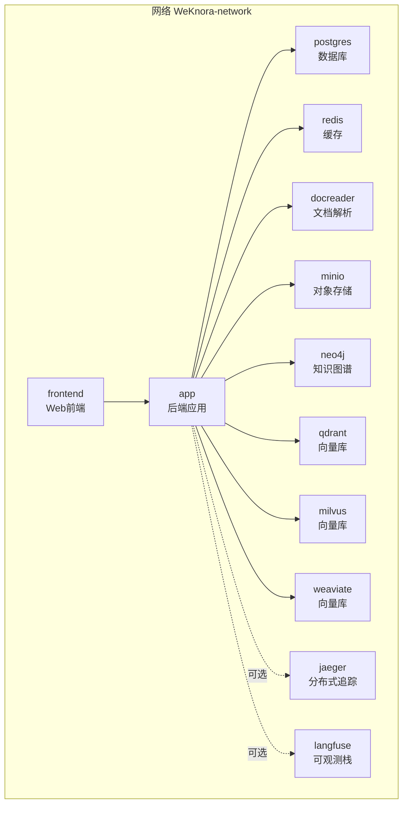
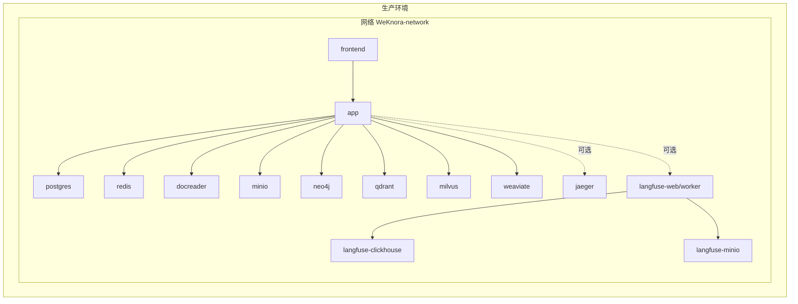
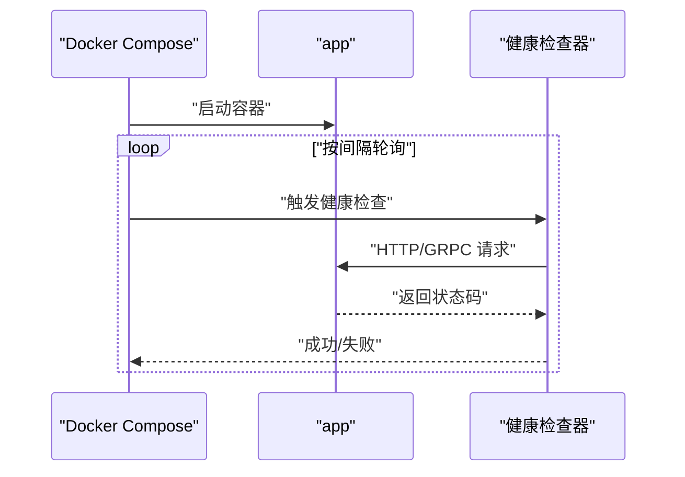
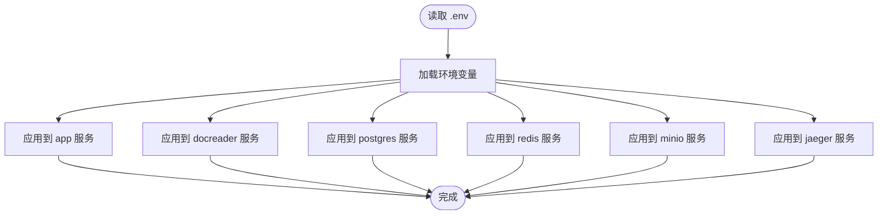
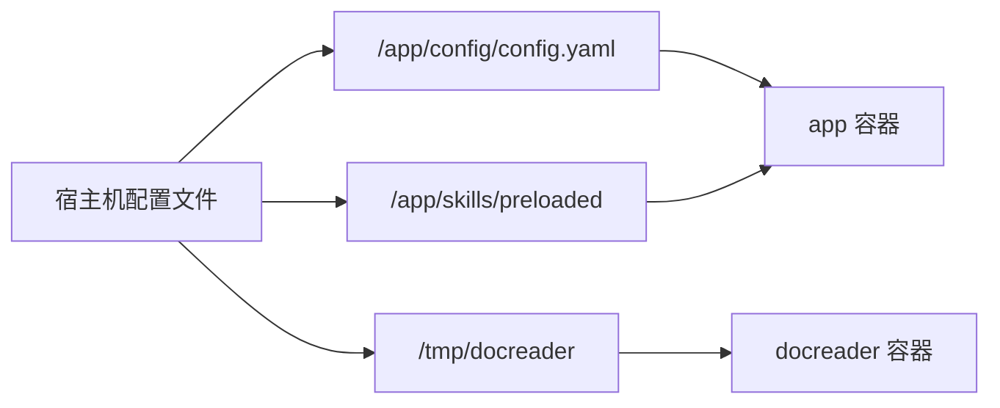
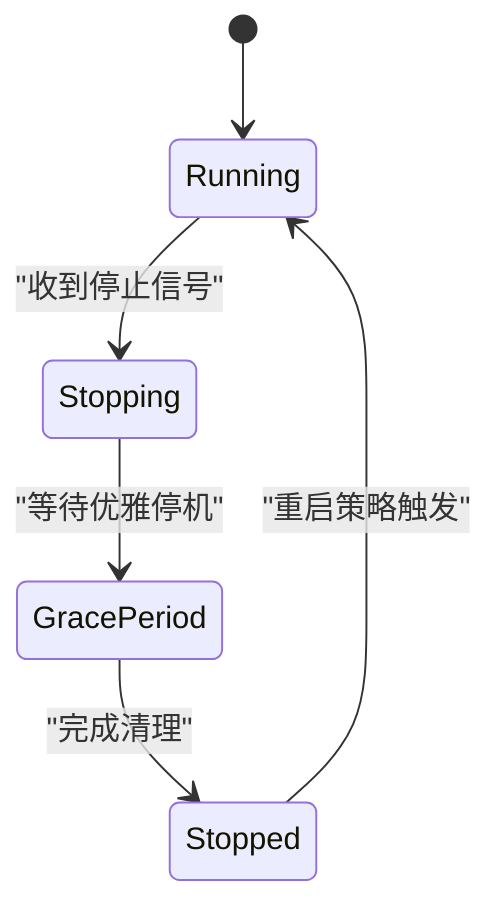
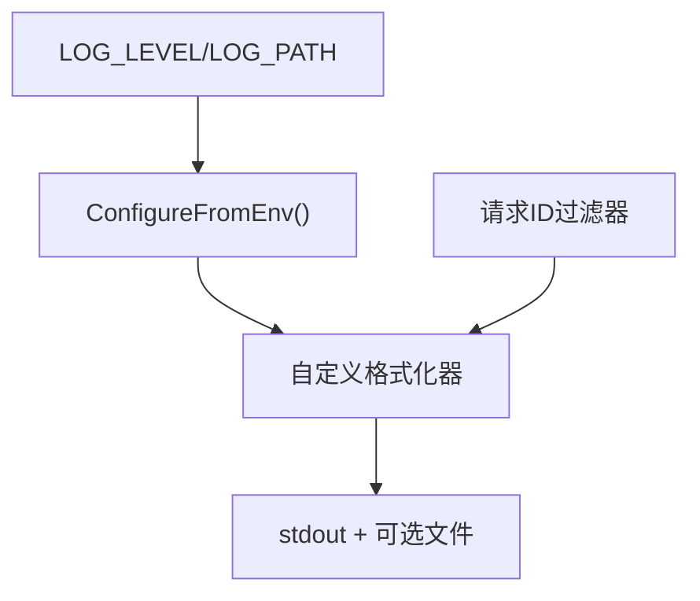
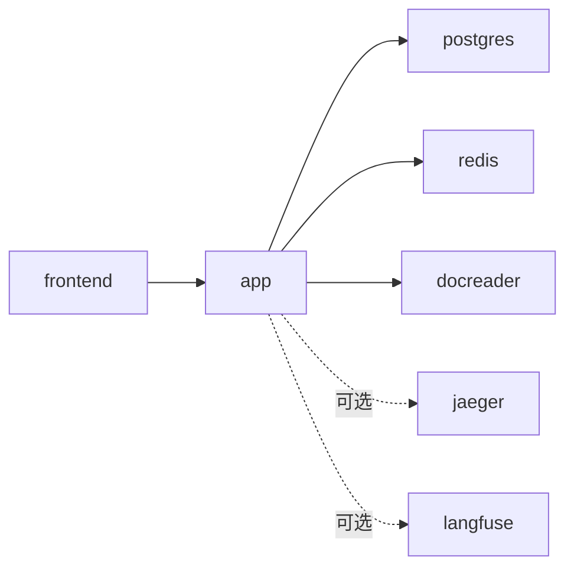

# 监控服务配置管理

<cite>
**本文档引用的文件**
- [docker-compose.yml](file://docker-compose.yml)
- [docker-compose.dev.yml](file://docker-compose.dev.yml)
- [Dockerfile.docreader](file://docker/Dockerfile.docreader)
- [Dockerfile.sandbox](file://docker/Dockerfile.sandbox)
- [supervisord.conf](file://docker/config/supervisord.conf)
- [config.yaml](file://config/config.yaml)
- [README.md](file://README.md)
- [vectorstore_healthcheck.go](file://internal/application/service/vectorstore_healthcheck.go)
- [logger.go](file://internal/logger/logger.go)
- [request.py](file://docreader/utils/request.py)
</cite>

## 目录
1. [简介](#简介)
2. [项目结构](#项目结构)
3. [核心组件](#核心组件)
4. [架构总览](#架构总览)
5. [详细组件分析](#详细组件分析)
6. [依赖关系分析](#依赖关系分析)
7. [性能考虑](#性能考虑)
8. [故障排查指南](#故障排查指南)
9. [结论](#结论)
10. [附录](#附录)

## 简介
本文件面向DevOps工程师，提供WeKnora监控服务的Docker Compose配置管理完整指南。重点涵盖：
- Docker Compose文件结构与服务编排
- 服务间的依赖关系与网络隔离
- 环境变量管理、配置文件挂载与健康检查机制
- 资源限制、重启策略与故障恢复配置
- 性能调优参数、日志配置与调试选项
- 配置模板、环境变量说明与最佳实践

## 项目结构
WeKnora采用多服务Docker Compose编排，核心服务包括Web前端、后端应用、文档解析服务、数据库、缓存、对象存储、分布式追踪与知识图谱等。生产与开发环境分别由两个Compose文件管理，并支持可选特性配置文件（profiles）。

图表来源
- [docker-compose.yml:1-613](file://docker-compose.yml#L1-L613)

章节来源
- [docker-compose.yml:1-613](file://docker-compose.yml#L1-L613)
- [README.md:230-387](file://README.md#L230-L387)

## 核心组件
- 前端服务（frontend）：提供Web界面，反向代理至后端应用。
- 应用服务（app）：核心业务逻辑，负责API、会话、知识库、工具调用等。
- 文档解析服务（docreader）：提供文档解析与图片提取能力。
- 数据库（postgres）：ParadeDB（PostgreSQL 17）作为主数据库。
- 缓存（redis）：提供会话、限流、消息队列等功能。
- 对象存储（minio）：提供S3兼容的对象存储。
- 分布式追踪（jaeger）：可选，提供OTLP/Zipkin接入。
- 知识图谱（neo4j）：可选，提供图数据库能力。
- 向量库（qdrant、milvus、weaviate）：可选，提供向量检索能力。
- Langfuse可观测栈（langfuse-*）：可选，自建可观测栈，复用现有postgres与redis。

章节来源
- [docker-compose.yml:2-170](file://docker-compose.yml#L2-L170)
- [docker-compose.yml:173-364](file://docker-compose.yml#L173-L364)
- [docker-compose.yml:395-594](file://docker-compose.yml#L395-L594)

## 架构总览
下图展示生产环境的典型编排关系，包括服务依赖、网络隔离与可选组件。

图表来源
- [docker-compose.yml:1-613](file://docker-compose.yml#L1-L613)

## 详细组件分析

### 健康检查机制
- 应用服务（app）：HTTP健康检查路径为内部8080端口的健康接口，具备轮询间隔、超时、重试与启动宽限期。
- 文档解析服务（docreader）：gRPC健康探针，检查50051端口。
- 数据库（postgres）：PostgreSQL内置健康检查，轮询间隔、超时、重试与启动宽限期。
- MinIO：HTTP存活检查。
- Jaeger：多端口暴露，支持OTLP与Zipkin。
- Langfuse子系统：ClickHouse与MinIO均配置健康检查。

图表来源
- [docker-compose.yml:44-49](file://docker-compose.yml#L44-L49)
- [docker-compose.yml:188-193](file://docker-compose.yml#L188-L193)
- [docker-compose.yml:212-217](file://docker-compose.yml#L212-L217)
- [docker-compose.yml:242-246](file://docker-compose.yml#L242-L246)
- [docker-compose.yml:325-330](file://docker-compose.yml#L325-L330)

章节来源
- [docker-compose.yml:44-49](file://docker-compose.yml#L44-L49)
- [docker-compose.yml:188-193](file://docker-compose.yml#L188-L193)
- [docker-compose.yml:212-217](file://docker-compose.yml#L212-L217)
- [docker-compose.yml:242-246](file://docker-compose.yml#L242-L246)
- [docker-compose.yml:325-330](file://docker-compose.yml#L325-L330)

### 环境变量管理
- 应用服务（app）：集中于环境变量块，覆盖数据库、缓存、向量库、对象存储、分布式追踪、Langfuse、LLM与安全配置等。
- 文档解析服务（docreader）：图像输出目录与最大文件大小等。
- 数据库（postgres）：用户、密码、数据库名。
- 缓存（redis）：持久化与密码。
- MinIO：根账号与控制台端口。
- Jaeger：OTLP与Zipkin开关。
- Langfuse：数据库、Redis、ClickHouse、MinIO连接参数与S3上传配置。

图表来源
- [docker-compose.yml:50-147](file://docker-compose.yml#L50-L147)
- [docker-compose.yml:185-187](file://docker-compose.yml#L185-L187)
- [docker-compose.yml:204-207](file://docker-compose.yml#L204-L207)
- [docker-compose.yml:225-225](file://docker-compose.yml#L225-L225)
- [docker-compose.yml:236-239](file://docker-compose.yml#L236-L239)
- [docker-compose.yml:266-268](file://docker-compose.yml#L266-L268)
- [docker-compose.yml:512-547](file://docker-compose.yml#L512-L547)

章节来源
- [docker-compose.yml:50-147](file://docker-compose.yml#L50-L147)
- [docker-compose.yml:185-187](file://docker-compose.yml#L185-L187)
- [docker-compose.yml:204-207](file://docker-compose.yml#L204-L207)
- [docker-compose.yml:225-225](file://docker-compose.yml#L225-L225)
- [docker-compose.yml:236-239](file://docker-compose.yml#L236-L239)
- [docker-compose.yml:266-268](file://docker-compose.yml#L266-L268)
- [docker-compose.yml:512-547](file://docker-compose.yml#L512-L547)

### 配置文件挂载
- 应用服务（app）：挂载配置文件与预加载技能目录，便于无需重建镜像即可扩展。
- 文档解析服务（docreader）：挂载临时目录以共享解析结果。
- Supvisord：容器内进程管理配置，确保主进程稳定重启。

图表来源
- [docker-compose.yml:38-43](file://docker-compose.yml#L38-L43)
- [docker-compose.yml:183-184](file://docker-compose.yml#L183-L184)
- [supervisord.conf:10-21](file://docker/config/supervisord.conf#L10-L21)

章节来源
- [docker-compose.yml:38-43](file://docker-compose.yml#L38-L43)
- [docker-compose.yml:183-184](file://docker-compose.yml#L183-L184)
- [supervisord.conf:10-21](file://docker/config/supervisord.conf#L10-L21)

### 重启策略与故障恢复
- 大多数服务采用“除非停止”或“始终”重启策略，确保高可用。
- 数据库配置优雅停机宽限期，减少事务丢失风险。
- Langfuse子系统通过一次性初始化任务确保数据库存在性，再启动Worker与Web。

图表来源
- [docker-compose.yml:157-159](file://docker-compose.yml#L157-L159)
- [docker-compose.yml:219-220](file://docker-compose.yml#L219-L220)
- [docker-compose.yml:397-425](file://docker-compose.yml#L397-L425)

章节来源
- [docker-compose.yml:157-159](file://docker-compose.yml#L157-L159)
- [docker-compose.yml:219-220](file://docker-compose.yml#L219-L220)
- [docker-compose.yml:397-425](file://docker-compose.yml#L397-L425)

### 性能调优参数
- 应用并发池大小：通过环境变量控制并发处理上限。
- 向量库连接参数：集合名、TLS开关、指标类型等。
- LLM调用超时：可配置Agent LLM调用超时。
- 缓存与限流：Redis密码、DB索引与前缀。
- 存储引擎：MinIO端点、桶名与凭据。
- 日志级别与路径：通过环境变量动态调整。

章节来源
- [docker-compose.yml:132-146](file://docker-compose.yml#L132-L146)
- [docker-compose.yml:95-102](file://docker-compose.yml#L95-L102)
- [docker-compose.yml:113-123](file://docker-compose.yml#L113-L123)
- [docker-compose.yml:526-528](file://docker-compose.yml#L526-L528)
- [docker-compose.yml:225-225](file://docker-compose.yml#L225-L225)

### 日志配置与调试
- 应用日志：支持从环境变量读取日志级别与输出路径，容器内自动选择彩色/非彩色输出。
- 文档解析服务：请求ID注入与格式化，便于跨服务追踪。
- 进程管理：Supervisord确保主进程稳定重启与日志落盘。

图表来源
- [logger.go:147-183](file://internal/logger/logger.go#L147-L183)
- [request.py:84-106](file://docreader/utils/request.py#L84-L106)
- [supervisord.conf:10-21](file://docker/config/supervisord.conf#L10-L21)

章节来源
- [logger.go:147-183](file://internal/logger/logger.go#L147-L183)
- [request.py:84-106](file://docreader/utils/request.py#L84-L106)
- [supervisord.conf:10-21](file://docker/config/supervisord.conf#L10-L21)

### 开发环境对比
- 开发环境Compose文件仅启动基础设施，应用与前端在本地运行，便于热更新与调试。
- 开发环境同样支持Langfuse可选栈，但使用独立网络与数据卷，避免与生产冲突。

章节来源
- [docker-compose.dev.yml:1-420](file://docker-compose.dev.yml#L1-L420)

## 依赖关系分析
- 服务依赖：前端依赖后端健康；应用依赖数据库、缓存、文档解析服务健康；可选组件按profile启用。
- 网络隔离：所有服务位于同一桥接网络，便于容器间通信。
- 配置耦合：应用服务对多种外部组件（数据库、缓存、向量库、对象存储、追踪）的连接参数高度耦合，需统一管理。

图表来源
- [docker-compose.yml:21-23](file://docker-compose.yml#L21-L23)
- [docker-compose.yml:148-154](file://docker-compose.yml#L148-L154)

章节来源
- [docker-compose.yml:21-23](file://docker-compose.yml#L21-L23)
- [docker-compose.yml:148-154](file://docker-compose.yml#L148-L154)

## 性能考虑
- 健康检查间隔与超时应结合实际负载与延迟设置，避免误判。
- 数据库与缓存的连接池与超时参数需根据QPS与响应时间调优。
- 向量库的集合名、指标类型与TLS开关直接影响查询性能与安全性。
- 日志级别在生产环境建议提升至INFO，避免过多DEBUG开销。
- 对象存储与MinIO的端口映射与S3兼容性需确保客户端直连稳定性。

## 故障排查指南
- 健康检查失败：检查对应服务的端口映射、探针命令与容器日志。
- 数据库连接问题：确认凭据、网络连通性与版本兼容性。
- 向量库不可用：验证集合存在性、TLS配置与网络策略。
- 日志缺失：确认日志路径与权限，以及容器是否正确输出到标准输出。
- Langfuse初始化失败：确保postgres中langfuse数据库已创建，ClickHouse与MinIO健康。

章节来源
- [docker-compose.yml:44-49](file://docker-compose.yml#L44-L49)
- [docker-compose.yml:188-193](file://docker-compose.yml#L188-L193)
- [docker-compose.yml:212-217](file://docker-compose.yml#L212-L217)
- [docker-compose.yml:442-447](file://docker-compose.yml#L442-L447)
- [docker-compose.yml:471-475](file://docker-compose.yml#L471-L475)
- [vectorstore_healthcheck.go:69-93](file://internal/application/service/vectorstore_healthcheck.go#L69-L93)

## 结论
通过Docker Compose实现WeKnora监控服务的统一编排与管理，关键在于：
- 明确的服务依赖与网络隔离
- 规范的环境变量与配置文件挂载
- 合理的健康检查与重启策略
- 可观测性的可选组件与日志配置
- 面向生产的性能调优与故障恢复机制

## 附录

### 配置模板与环境变量清单
- 应用服务（app）关键变量
  - 数据库：DB_USER、DB_PASSWORD、DB_NAME、DB_HOST、DB_PORT
  - 缓存：REDIS_ADDR、REDIS_USERNAME、REDIS_PASSWORD、REDIS_DB、REDIS_PREFIX
  - 向量库：QDRANT_*、MILVUS_*、WEAVIATE_*、ELASTICSEARCH_*
  - 对象存储：MINIO_ENDPOINT、MINIO_ACCESS_KEY_ID、MINIO_SECRET_ACCESS_KEY、MINIO_BUCKET_NAME
  - 分布式追踪：OTEL_*、JAEGER端口映射
  - Langfuse：LANGFUSE_*、CLICKHOUSE_*、S3上传配置
  - 安全与加密：JWT_SECRET、CRYPTO_MASTER_KEY、CRYPTO_SALT
  - 其他：GIN_MODE、TZ、WEKNORA_LANGUAGE、MAX_FILE_SIZE_MB、WEKNORA_AGENT_LLM_TIMEOUT

- 文档解析服务（docreader）关键变量
  - DOCREADER_IMAGE_OUTPUT_DIR、MAX_FILE_SIZE_MB

- 数据库（postgres）关键变量
  - POSTGRES_USER、POSTGRES_PASSWORD、POSTGRES_DB

- 缓存（redis）关键变量
  - REDIS_PASSWORD

- 对象存储（minio）关键变量
  - MINIO_ROOT_USER、MINIO_ROOT_PASSWORD、MINIO_PORT、MINIO_CONSOLE_PORT

- 分布式追踪（jaeger）关键变量
  - COLLECTOR_OTLP_ENABLED、COLLECTOR_ZIPKIN_HOST_PORT

- Langfuse子系统关键变量
  - LANGFUSE_*、CLICKHOUSE_*、LANGFUSE_S3_*、LANGFUSE_REDIS_DB

章节来源
- [docker-compose.yml:50-147](file://docker-compose.yml#L50-L147)
- [docker-compose.yml:185-187](file://docker-compose.yml#L185-L187)
- [docker-compose.yml:204-207](file://docker-compose.yml#L204-L207)
- [docker-compose.yml:225-225](file://docker-compose.yml#L225-L225)
- [docker-compose.yml:236-239](file://docker-compose.yml#L236-L239)
- [docker-compose.yml:266-268](file://docker-compose.yml#L266-L268)
- [docker-compose.yml:512-547](file://docker-compose.yml#L512-L547)

### 最佳实践
- 使用profiles按需启用可选组件，避免资源浪费。
- 将敏感信息置于环境变量或密钥管理，避免硬编码。
- 为每个服务设置合理的健康检查与重启策略。
- 在生产环境提升日志级别并启用日志轮转。
- 对数据库与缓存进行容量规划与性能基准测试。
- 使用独立网络与数据卷区分开发与生产环境。