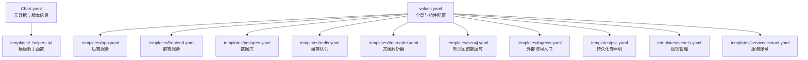
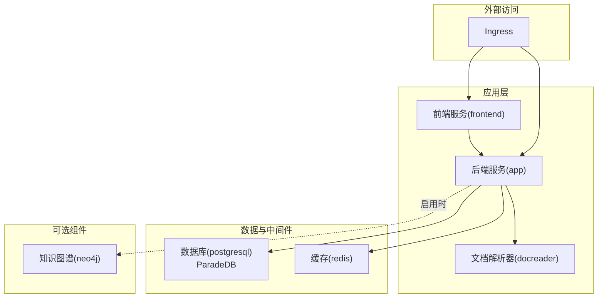
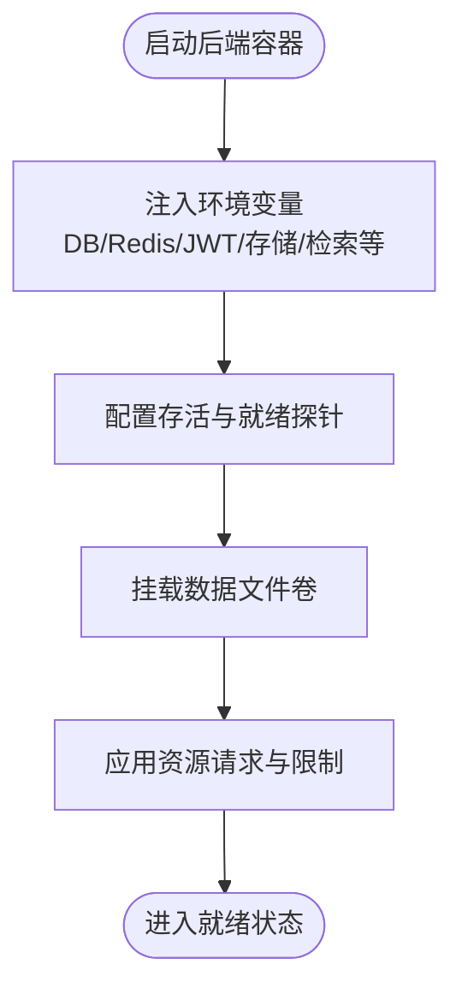
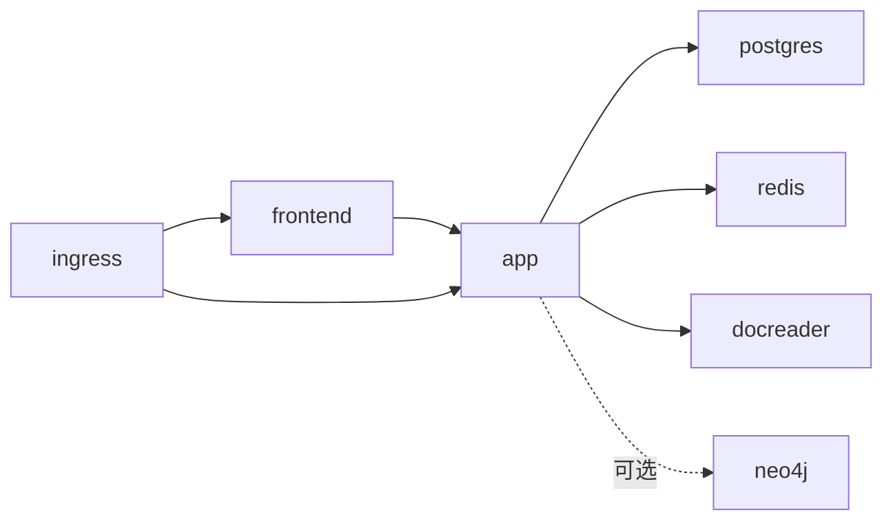

# Helm Chart配置

<cite>
**本文引用的文件**
- [Chart.yaml](file://helm/Chart.yaml)
- [values.yaml](file://helm/values.yaml)
- [_helpers.tpl](file://helm/templates/_helpers.tpl)
- [README.md](file://helm/README.md)
- [app.yaml](file://helm/templates/app.yaml)
- [frontend.yaml](file://helm/templates/frontend.yaml)
- [postgres.yaml](file://helm/templates/postgres.yaml)
- [redis.yaml](file://helm/templates/redis.yaml)
- [docreader.yaml](file://helm/templates/docreader.yaml)
- [neo4j.yaml](file://helm/templates/neo4j.yaml)
- [ingress.yaml](file://helm/templates/ingress.yaml)
- [pvc.yaml](file://helm/templates/pvc.yaml)
- [secrets.yaml](file://helm/templates/secrets.yaml)
- [serviceaccount.yaml](file://helm/templates/serviceaccount.yaml)
</cite>

## 目录
1. [简介](#简介)
2. [项目结构](#项目结构)
3. [核心组件](#核心组件)
4. [架构总览](#架构总览)
5. [详细组件分析](#详细组件分析)
6. [依赖关系分析](#依赖关系分析)
7. [性能与资源建议](#性能与资源建议)
8. [故障排查指南](#故障排查指南)
9. [结论](#结论)
10. [附录：部署场景与示例](#附录部署场景与示例)

## 简介
本文件为 WeKnora 的 Helm Chart 配置与部署指南，面向平台工程师与 DevOps 团队，覆盖 Chart 元数据、values.yaml 参数详解、模板助手函数、通用配置模板、典型部署场景（开发/测试/生产）以及最佳实践与故障排查建议。内容基于仓库中 helm 目录下的 Chart.yaml、values.yaml 及模板文件进行整理与提炼。

## 项目结构
Helm Chart 的关键文件组织如下：
- Chart.yaml：定义 Chart 元数据（名称、版本、Kubernetes 版本要求、图标、关键词、维护者等）
- values.yaml：集中式配置入口，按组件分段定义默认值
- templates/_helpers.tpl：模板助手函数，统一命名、标签、镜像拼接、安全上下文合并等
- templates/*.yaml：各组件的 Kubernetes 清单（Deployment/Service/PVC/Ingress/Secret 等）

图表来源
- [Chart.yaml:1-27](file://helm/Chart.yaml#L1-L27)
- [_helpers.tpl:1-196](file://helm/templates/_helpers.tpl#L1-L196)
- [values.yaml:1-493](file://helm/values.yaml#L1-L493)
- [app.yaml:1-200](file://helm/templates/app.yaml#L1-L200)
- [frontend.yaml:1-113](file://helm/templates/frontend.yaml#L1-L113)
- [postgres.yaml:1-129](file://helm/templates/postgres.yaml#L1-L129)
- [redis.yaml:1-125](file://helm/templates/redis.yaml#L1-L125)
- [docreader.yaml:1-103](file://helm/templates/docreader.yaml#L1-L103)
- [neo4j.yaml:1-137](file://helm/templates/neo4j.yaml#L1-L137)
- [ingress.yaml:1-53](file://helm/templates/ingress.yaml#L1-L53)
- [pvc.yaml:1-82](file://helm/templates/pvc.yaml#L1-L82)
- [secrets.yaml:1-40](file://helm/templates/secrets.yaml#L1-L40)
- [serviceaccount.yaml:1-25](file://helm/templates/serviceaccount.yaml#L1-L25)

章节来源
- [Chart.yaml:1-27](file://helm/Chart.yaml#L1-L27)
- [values.yaml:1-493](file://helm/values.yaml#L1-L493)
- [_helpers.tpl:1-196](file://helm/templates/_helpers.tpl#L1-L196)

## 核心组件
- 全局配置（global）：存储类、镜像拉取密钥、Pod/容器安全上下文
- 服务账号（serviceAccount）：是否创建、名称、注解、标签、自动挂载令牌
- 应用（app）：后端 API 服务，含副本数、镜像、资源、探针、节点选择与亲和性、环境变量
- 前端（frontend）：Web UI，含镜像、资源、探针、节点选择与亲和性
- 文档解析器（docreader）：gRPC 服务，含镜像、资源、探针、节点选择与亲和性
- 数据库（postgresql）：ParadeDB，含镜像、资源、持久化、节点选择与亲和性
- 缓存（redis）：用于流与任务队列，含镜像、资源、持久化、节点选择与亲和性
- 数据文件存储（dataFiles）：上传文件持久化
- Ingress：外部访问入口，路由 /api 到后端、/ 到前端
- Secrets：数据库、Redis、JWT、租户与系统加密密钥；支持现有密钥
- 可选组件：MinIO（对象存储）、Neo4j（知识图谱）、Qdrant（向量库）、Jaeger（分布式追踪）

章节来源
- [values.yaml:11-493](file://helm/values.yaml#L11-L493)

## 架构总览
下图展示 WeKnora 在 Kubernetes 中的典型部署拓扑与组件交互：

图表来源
- [ingress.yaml:1-53](file://helm/templates/ingress.yaml#L1-L53)
- [frontend.yaml:1-113](file://helm/templates/frontend.yaml#L1-L113)
- [app.yaml:1-200](file://helm/templates/app.yaml#L1-L200)
- [docreader.yaml:1-103](file://helm/templates/docreader.yaml#L1-L103)
- [postgres.yaml:1-129](file://helm/templates/postgres.yaml#L1-L129)
- [redis.yaml:1-125](file://helm/templates/redis.yaml#L1-L125)
- [neo4j.yaml:1-137](file://helm/templates/neo4j.yaml#L1-L137)

## 详细组件分析

### Chart 元数据（Chart.yaml）
- 名称与类型：名称为 weknora，类型为 application
- 版本与应用版本：Chart.version 与 Chart.appVersion 分别控制 Chart 发布版本与应用版本
- Kubernetes 版本要求：kubeVersion 指定最低版本
- 描述与关键字：涵盖 RAG、知识库、向量检索、LLM 等关键词
- 维护者与注解：包含维护者信息与 Artifact Hub 许可证标注

章节来源
- [Chart.yaml:1-27](file://helm/Chart.yaml#L1-L27)

### 模板助手函数（_helpers.tpl）
- 名称与标签：提供 chart 名称、完整名称、chart 标签、selector 标签、组件标签
- 服务账号：根据配置决定使用自定义或默认
- 密钥：支持现有密钥或生成新密钥
- 镜像拼接：统一返回各组件镜像（含 tag），app 默认使用 Chart.appVersion
- 安全上下文：合并全局与组件级安全上下文
- 存储类：支持空字符串表示使用集群默认存储类

章节来源
- [_helpers.tpl:1-196](file://helm/templates/_helpers.tpl#L1-L196)

### 应用（后端）组件（app）
- 启用与副本：默认启用，副本数为 1
- 镜像：仓库与 tag（为空则使用 Chart.appVersion），拉取策略
- 资源：CPU/内存请求与限制
- 安全上下文：允许非 root 场景需使用兼容镜像
- 环境变量：运行模式、检索驱动、存储类型、本地存储目录、并发池大小、图谱开关、时区等
- 服务：ClusterIP 类型与端口
- 探针：健康检查路径与节律
- 节点选择与亲和性：空配置，便于在 values 中按需覆盖
- 外部环境变量：通过 extraEnv 注入额外键值对
- 卷挂载：数据文件卷（PVC 或 emptyDir）

图表来源
- [app.yaml:1-200](file://helm/templates/app.yaml#L1-L200)

章节来源
- [values.yaml:53-140](file://helm/values.yaml#L53-L140)
- [app.yaml:1-200](file://helm/templates/app.yaml#L1-L200)

### 前端组件（frontend）
- 启用与副本：默认启用，副本数为 1
- 镜像：仓库与 tag，拉取策略
- 资源：CPU/内存请求与限制
- 安全上下文：默认禁用提权
- 服务：ClusterIP 类型与端口
- 探针：健康检查路径与节律
- 节点选择与亲和性：空配置
- 卷挂载：Nginx 缓存与运行目录（emptyDir）

章节来源
- [values.yaml:144-187](file://helm/values.yaml#L144-L187)
- [frontend.yaml:1-113](file://helm/templates/frontend.yaml#L1-L113)

### 文档解析器（docreader）
- 启用与副本：默认启用，副本数为 1
- 镜像：仓库与 tag，拉取策略
- 资源：CPU/内存请求与限制
- 安全上下文：默认禁用提权
- 服务：ClusterIP 类型与端口
- 探针：gRPC 健康检查
- 节点选择与亲和性：空配置

章节来源
- [values.yaml:191-237](file://helm/values.yaml#L191-L237)
- [docreader.yaml:1-103](file://helm/templates/docreader.yaml#L1-L103)

### 数据库（PostgreSQL，ParadeDB）
- 启用：默认启用
- 镜像：仓库与 tag
- 资源：CPU/内存请求与限制
- 安全上下文：默认禁用提权
- 持久化：默认启用，容量与 PVC 已存在声明
- 节点选择与亲和性：空配置
- 探针：pg_isready 健康检查
- 服务：ClusterIP，端口 5432

章节来源
- [values.yaml:241-283](file://helm/values.yaml#L241-L283)
- [postgres.yaml:1-129](file://helm/templates/postgres.yaml#L1-L129)

### 缓存（Redis）
- 启用：默认启用
- 镜像：仓库与 tag
- 资源：CPU/内存请求与限制
- 安全上下文：默认禁用提权
- 持久化：默认启用，容量与 PVC 已存在声明
- 节点选择与亲和性：空配置
- 探针：redis-cli ping 健康检查
- 服务：ClusterIP，端口 6379

章节来源
- [values.yaml:287-329](file://helm/values.yaml#L287-L329)
- [redis.yaml:1-125](file://helm/templates/redis.yaml#L1-L125)

### 数据文件存储（dataFiles）
- 启用：默认启用
- 持久化：容量与 PVC 已存在声明
- 用途：后端容器挂载的上传文件目录

章节来源
- [values.yaml:333-341](file://helm/values.yaml#L333-L341)
- [app.yaml:161-169](file://helm/templates/app.yaml#L161-L169)

### Ingress
- 启用：默认关闭
- 类名：默认 nginx
- 主机名：默认 weknora.example.com
- TLS：默认关闭，可指定证书密钥
- 注解：代理体大小、连接/读写超时等
- 路由规则：/api -> 后端服务；/ -> 前端服务

章节来源
- [values.yaml:345-370](file://helm/values.yaml#L345-L370)
- [ingress.yaml:1-53](file://helm/templates/ingress.yaml#L1-L53)

### Secrets
- 数据库：用户名、密码、库名
- Redis：用户名（可选）、密码
- 应用：JWT 密钥、租户 AES 密钥、系统 AES 密钥
- 现有密钥：可指定已存在的密钥名称
- 生产建议：不要在 Git 中提交密钥，优先使用外部密管或现有密钥

章节来源
- [values.yaml:382-403](file://helm/values.yaml#L382-L403)
- [secrets.yaml:1-40](file://helm/templates/secrets.yaml#L1-L40)

### 可选组件
- MinIO：S3 兼容对象存储，启用时需要根用户与密码
- Neo4j：知识图谱数据库，启用时需要用户名与密码；与后端联动开启 GraphRAG
- Qdrant：替代向量库（需在后端检索驱动中选择对应实现）
- Jaeger：分布式追踪（需在后端链路中启用）

章节来源
- [values.yaml:410-493](file://helm/values.yaml#L410-L493)

## 依赖关系分析
- 后端依赖：
  - 数据库：通过服务名 postgres 访问
  - 缓存：通过服务名 redis 访问
  - 文档解析器：通过服务名 docreader 访问
  - Neo4j：可选，启用时通过服务名 neo4j 访问
- 前端依赖：通过服务名 app 访问后端 API
- Ingress 依赖：frontend 与 app 服务
- 持久化：PostgreSQL、Redis、Neo4j、数据文件均支持 PVC

图表来源
- [ingress.yaml:32-51](file://helm/templates/ingress.yaml#L32-L51)
- [frontend.yaml:94-112](file://helm/templates/frontend.yaml#L94-L112)
- [app.yaml:182-199](file://helm/templates/app.yaml#L182-L199)
- [postgres.yaml:111-128](file://helm/templates/postgres.yaml#L111-L128)
- [redis.yaml:107-124](file://helm/templates/redis.yaml#L107-L124)
- [docreader.yaml:85-102](file://helm/templates/docreader.yaml#L85-L102)
- [neo4j.yaml:115-136](file://helm/templates/neo4j.yaml#L115-L136)

## 性能与资源建议
- CPU/内存请求与限制应结合业务峰值与并发量设置；生产环境建议提升后端与数据库资源
- 启用 Ingress 并配置合理的代理超时与缓冲大小，避免大文件上传/下载失败
- 对于高并发检索场景，建议评估数据库与向量库的扩展能力（如切换到 Qdrant 或云原生向量库）
- 使用 PVC 并指定合适的存储类，确保 IOPS 与吞吐满足需求

## 故障排查指南
- Pod 处于 Pending：检查 PVC 是否绑定、存储类是否存在
- 连接被拒绝：等待所有 Pod 就绪，检查服务端点
- 数据库连接错误：核对密钥、数据库日志与网络连通性
- 前端无法访问：确认 Ingress 是否启用、主机名与 TLS 配置正确
- 图谱功能异常：确认 Neo4j 已启用且凭据正确

章节来源
- [README.md:282-311](file://helm/README.md#L282-L311)

## 结论
本 Helm Chart 提供了 WeKnora 在 Kubernetes 上的标准化部署方案，通过 values.yaml 集中管理配置，并借助模板助手函数实现命名、标签与安全上下文的统一。建议在生产环境中严格管理密钥、合理规划资源与存储，并结合 Ingress 实现外部访问与 TLS 加密。

## 附录：部署场景与示例

### 开发环境
- 关闭 Ingress，不启用可选组件
- 使用较小的资源请求与副本数
- 本地存储或临时 PVC 即可

章节来源
- [values.yaml:345-370](file://helm/values.yaml#L345-L370)
- [values.yaml:410-493](file://helm/values.yaml#L410-L493)

### 测试环境
- 启用 Ingress 并配置测试域名
- 适度提升资源请求与副本数
- 可启用 Redis 与数据库持久化

章节来源
- [values.yaml:345-370](file://helm/values.yaml#L345-L370)
- [values.yaml:241-283](file://helm/values.yaml#L241-L283)
- [values.yaml:287-329](file://helm/values.yaml#L287-L329)

### 生产环境
- 启用 Ingress 并配置 TLS 证书
- 提升后端与数据库资源请求与副本数
- 使用现有密钥或外部密管
- 指定高性能存储类并扩容 PVC

章节来源
- [README.md:102-141](file://helm/README.md#L102-L141)
- [values.yaml:108-134](file://helm/values.yaml#L108-L134)
- [values.yaml:121-131](file://helm/values.yaml#L121-L131)