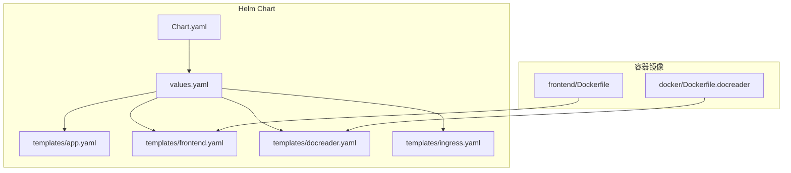
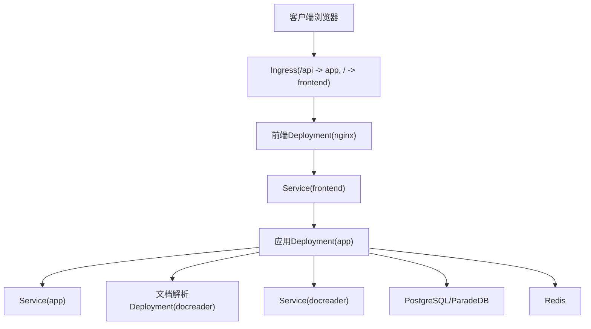
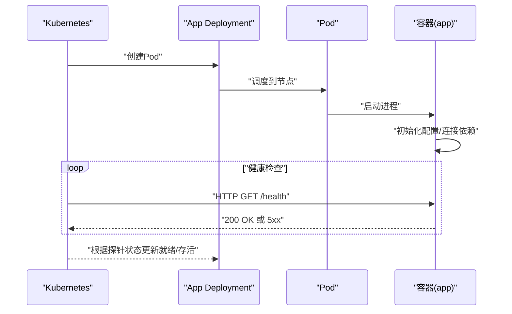
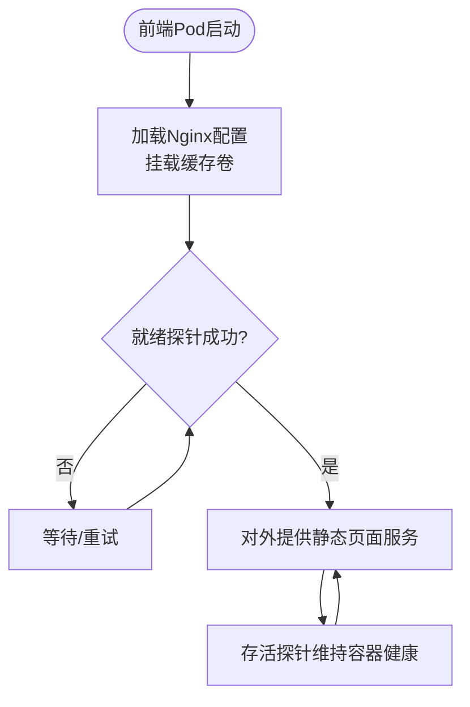
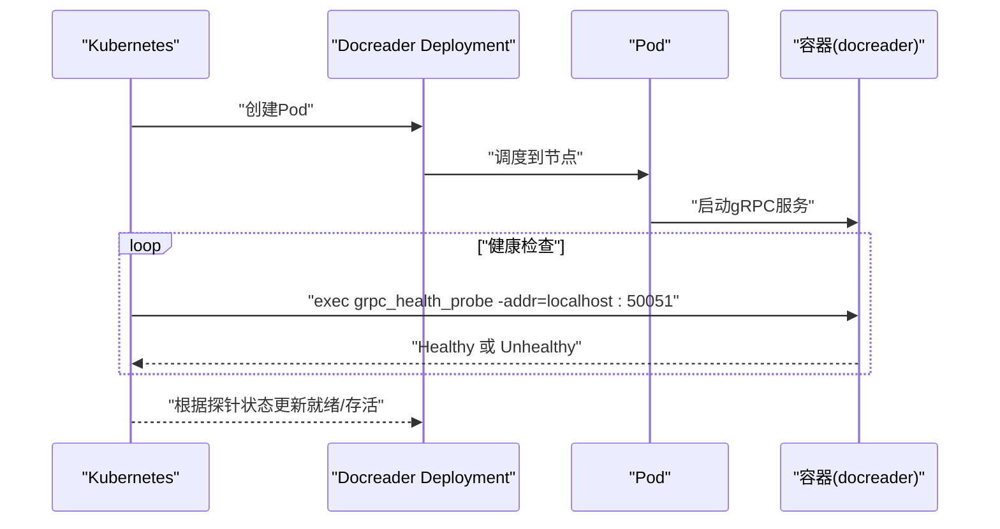
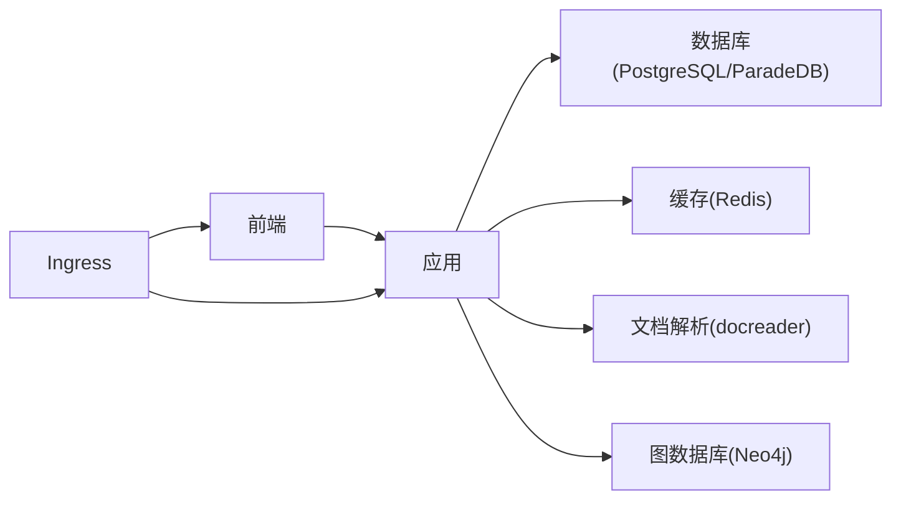

# Deployment配置详解

<cite>
**本文档引用的文件**
- [Chart.yaml](file://helm/Chart.yaml)
- [values.yaml](file://helm/values.yaml)
- [app.yaml](file://helm/templates/app.yaml)
- [frontend.yaml](file://helm/templates/frontend.yaml)
- [docreader.yaml](file://helm/templates/docreader.yaml)
- [ingress.yaml](file://helm/templates/ingress.yaml)
- [Dockerfile.docreader](file://docker/Dockerfile.docreader)
- [frontend/Dockerfile](file://frontend/Dockerfile)
- [docker-compose.yml](file://docker-compose.yml)
- [config.yaml](file://config/config.yaml)
- [weknora-lite.service](file://deploy/weknora-lite.service)
</cite>

## 目录
1. [简介](#简介)
2. [项目结构](#项目结构)
3. [核心组件](#核心组件)
4. [架构总览](#架构总览)
5. [详细组件分析](#详细组件分析)
6. [依赖关系分析](#依赖关系分析)
7. [性能考虑](#性能考虑)
8. [故障排查指南](#故障排查指南)
9. [结论](#结论)

## 简介
本文件面向云原生开发者，系统性阐述WeKnora在Kubernetes上的Deployment配置与最佳实践，覆盖应用服务、前端服务、文档解析服务等组件的副本数、滚动更新策略、容器配置、环境变量管理、Pod安全上下文、资源限制与请求、节点选择器/亲和性/容忍度、健康检查探针等关键要素，并结合Helm模板与Dockerfile给出可操作的配置建议与排错指引。

## 项目结构
WeKnora采用Helm Chart统一管理Kubernetes资源，核心文件位于helm目录，包含Chart元数据、默认values以及各组件的Deployment/Service/Ingress模板；容器镜像通过各自Dockerfile构建，前端基于Nginx，文档解析服务基于Python gRPC。

**图表来源**
- [Chart.yaml:1-27](file://helm/Chart.yaml#L1-L27)
- [values.yaml:1-493](file://helm/values.yaml#L1-L493)
- [app.yaml:1-200](file://helm/templates/app.yaml#L1-200)
- [frontend.yaml:1-113](file://helm/templates/frontend.yaml#L1-113)
- [docreader.yaml:1-103](file://helm/templates/docreader.yaml#L1-103)
- [ingress.yaml:1-53](file://helm/templates/ingress.yaml#L1-53)
- [frontend/Dockerfile:1-43](file://frontend/Dockerfile#L1-43)
- [Dockerfile.docreader:1-158](file://docker/Dockerfile.docreader#L1-158)

**章节来源**
- [Chart.yaml:1-27](file://helm/Chart.yaml#L1-L27)
- [values.yaml:1-493](file://helm/values.yaml#L1-L493)

## 核心组件
- 应用服务（App）：后端API服务器，负责业务逻辑、检索、存储、流式处理等，提供HTTP健康检查端点。
- 前端服务（Frontend）：静态Web UI，基于Nginx，提供根路径代理至后端API。
- 文档解析服务（Docreader）：gRPC文档解析服务，支持多种格式解析与图片提取，提供健康检查。
- 可选组件：PostgreSQL（ParadeDB）、Redis、Ingress等，通过values控制启用与参数。

上述组件均通过Helm模板渲染为Deployment/Service/Ingress资源，values文件提供默认配置与可覆盖项。

**章节来源**
- [app.yaml:1-200](file://helm/templates/app.yaml#L1-200)
- [frontend.yaml:1-113](file://helm/templates/frontend.yaml#L1-113)
- [docreader.yaml:1-103](file://helm/templates/docreader.yaml#L1-103)
- [values.yaml:50-493](file://helm/values.yaml#L50-L493)

## 架构总览
下图展示WeKnora在Kubernetes中的典型部署拓扑：前端通过Ingress路由到后端API，后端再调用文档解析服务；数据库与缓存作为后端依赖。

**图表来源**
- [ingress.yaml:1-53](file://helm/templates/ingress.yaml#L1-53)
- [frontend.yaml:95-113](file://helm/templates/frontend.yaml#L95-113)
- [app.yaml:182-200](file://helm/templates/app.yaml#L182-200)
- [docreader.yaml:85-103](file://helm/templates/docreader.yaml#L85-103)
- [values.yaml:239-329](file://helm/values.yaml#L239-L329)

## 详细组件分析

### 应用服务（App）Deployment配置
- 副本数与滚动更新
  - 默认副本数：1；滚动更新策略为RollingUpdate，maxSurge=1，maxUnavailable=0，确保零停机升级。
- 容器配置
  - 主容器名为app，监听8080端口；挂载数据卷用于文件存储。
  - 环境变量涵盖应用模式、时区、数据库(PostgreSQL)、Redis、检索驱动、存储类型、文档解析地址、并发池大小、是否启用GraphRAG等；敏感信息通过Secret引用。
- 安全上下文
  - 支持全局与组件级Pod/Container安全上下文覆盖，默认启用seccomp RuntimeDefault。
- 资源限制与请求
  - CPU/Memory请求/限制分别配置，满足一般生产需求。
- 健康检查
  - 提供livenessProbe与readinessProbe，均使用HTTP GET /health，可按需调整延迟、周期、超时与失败阈值。
- 节点调度
  - 支持nodeSelector、affinity、tolerations，便于隔离或容灾部署。

**图表来源**
- [app.yaml:15-160](file://helm/templates/app.yaml#L15-160)
- [values.yaml:53-140](file://helm/values.yaml#L53-L140)

**章节来源**
- [app.yaml:15-180](file://helm/templates/app.yaml#L15-180)
- [values.yaml:53-140](file://helm/values.yaml#L53-L140)

### 前端服务（Frontend）Deployment配置
- 副本数与滚动更新
  - 默认副本数：1；滚动更新策略同上。
- 容器配置
  - 主容器名为frontend，基于nginx，监听80端口；通过环境变量APP_HOST/APP_PORT指向后端服务。
  - 挂载nginx缓存与运行目录，满足临时文件写入需求。
- 健康检查
  - 提供HTTP就绪/存活探针，路径为根路径/，适合静态站点健康判断。
- 资源与调度
  - 资源请求/限制较小，适合边缘或低流量场景；支持节点选择与亲和性/容忍度。

**图表来源**
- [frontend.yaml:25-93](file://helm/templates/frontend.yaml#L25-93)
- [frontend/Dockerfile:25-43](file://frontend/Dockerfile#L25-43)

**章节来源**
- [frontend.yaml:25-93](file://helm/templates/frontend.yaml#L25-93)
- [frontend/Dockerfile:1-43](file://frontend/Dockerfile#L1-L43)

### 文档解析服务（Docreader）Deployment配置
- 副本数与滚动更新
  - 默认副本数：1；滚动更新策略同上。
- 容器配置
  - 主容器名为docreader，监听50051端口；通过环境变量控制存储类型。
  - 镜像构建包含grpc_health_probe，便于健康检查。
- 健康检查
  - 使用exec命令执行grpc_health_probe检查本地gRPC端口，适合gRPC服务的健康判定。
- 资源与调度
  - 资源请求/限制适中，支持节点选择与亲和性/容忍度。

**图表来源**
- [docreader.yaml:25-83](file://helm/templates/docreader.yaml#L25-83)
- [Dockerfile.docreader:113-158](file://docker/Dockerfile.docreader#L113-L158)

**章节来源**
- [docreader.yaml:25-83](file://helm/templates/docreader.yaml#L25-83)
- [Dockerfile.docreader:1-158](file://docker/Dockerfile.docreader#L1-L158)

### Ingress路由配置
- 路由规则
  - /api前缀路由到后端app服务；/根路径路由到frontend服务。
- TLS与注解
  - 支持TLS配置与常用NGINX注解（如请求体大小、超时等），便于生产环境优化。
- 类名与主机名
  - 可通过values配置Ingress类名与域名。

**章节来源**
- [ingress.yaml:1-53](file://helm/templates/ingress.yaml#L1-53)
- [values.yaml:344-370](file://helm/values.yaml#L344-L370)

### 环境变量与配置管理
- 应用服务环境变量
  - 关键变量包括GIN_MODE、DB_*、REDIS_*、RETRIEVE_DRIVER、STORAGE_TYPE、LOCAL_STORAGE_BASE_DIR、DOCREADER_ADDR、AUTO_RECOVER_DIRTY、CONCURRENCY_POOL_SIZE、ENABLE_GRAPH_RAG、Neo4j配置等；敏感信息通过Secret引用。
- 前端环境变量
  - APP_HOST与APP_PORT用于反向代理后端；前端Dockerfile定义了MAX_FILE_SIZE_MB默认值。
- 文档解析服务环境变量
  - STORAGE_TYPE用于控制存储类型。
- 配置文件
  - 后端config.yaml定义服务端口、对话与知识库等行为参数。

**章节来源**
- [app.yaml:48-147](file://helm/templates/app.yaml#L48-147)
- [frontend.yaml:44-53](file://helm/templates/frontend.yaml#L44-53)
- [docreader.yaml:48-51](file://helm/templates/docreader.yaml#L48-51)
- [config.yaml:1-113](file://config/config.yaml#L1-L113)
- [frontend/Dockerfile:37-41](file://frontend/Dockerfile#L37-L41)

### Pod安全上下文与容器安全上下文
- 全局安全上下文
  - values中提供global.podSecurityContext与global.containerSecurityContext，建议启用seccomp RuntimeDefault，禁止特权提升。
- 组件级覆盖
  - 各组件可通过app.podSecurityContext/securityContext或docreader/securityContext进行覆盖；注意官方镜像多数以root运行，若使用非root镜像需开启runAsNonRoot并禁用特权提升。
- 文件系统权限
  - 应用服务需要写权限用于文件存储，前端镜像需要写入nginx缓存目录。

**章节来源**
- [values.yaml:13-35](file://helm/values.yaml#L13-L35)
- [app.yaml:32-43](file://helm/templates/app.yaml#L32-43)
- [frontend.yaml:32-43](file://helm/templates/frontend.yaml#L32-43)
- [docreader.yaml:32-43](file://helm/templates/docreader.yaml#L32-43)

### 资源限制与请求配置原则
- 建议原则
  - CPU/Memory请求应基于实际负载压测结果设定；限制略高于请求，留有突发余量。
  - 前端与文档解析服务资源占用较低，可适当降低请求/限制；应用服务根据并发与检索复杂度调整。
- 配置位置
  - values中各组件的resources段提供requests/limits；可在生产环境中按需覆盖。

**章节来源**
- [values.yaml:68-77](file://helm/values.yaml#L68-L77)
- [values.yaml:159-167](file://helm/values.yaml#L159-L167)
- [values.yaml:206-214](file://helm/values.yaml#L206-L214)

### 节点选择器、亲和性与容忍度
- 使用场景
  - 节点选择器：限定特定硬件或区域。
  - 亲和性：将相关组件调度到同一节点或跨节点分散，降低单点风险。
  - 容忍度：允许调度到带污点的节点（如预留资源节点）。
- 配置位置
  - 各组件模板均支持nodeSelector、affinity、tolerations，values中提供空配置以便按需启用。

**章节来源**
- [app.yaml:169-180](file://helm/templates/app.yaml#L169-L180)
- [frontend.yaml:82-93](file://helm/templates/frontend.yaml#L82-L93)
- [docreader.yaml:72-83](file://helm/templates/docreader.yaml#L72-L83)

### 健康检查探针配置方法
- 应用服务（App）
  - HTTP GET /health，适用于提供健康端点的应用。
- 前端服务（Frontend）
  - HTTP GET /，适合静态站点。
- 文档解析服务（Docreader）
  - exec grpc_health_probe -addr=localhost:50051，适合gRPC服务。
- 参数建议
  - initialDelaySeconds：根据启动时间与依赖可用性设置。
  - periodSeconds：常规10-30秒。
  - timeoutSeconds：较短超时，快速失败。
  - failureThreshold：1-3次即可触发重启。

**章节来源**
- [app.yaml:153-160](file://helm/templates/app.yaml#L153-160)
- [frontend.yaml:55-70](file://helm/templates/frontend.yaml#L55-70)
- [docreader.yaml:53-71](file://helm/templates/docreader.yaml#L53-71)

### 单机部署（systemd）参考
- weknora-lite.service
  - 定义用户、工作目录、环境文件、重启策略与安全限制（NoNewPrivileges、ProtectSystem等），适合轻量单机部署或测试环境。

**章节来源**
- [weknora-lite.service:1-24](file://deploy/weknora-lite.service#L1-L24)

## 依赖关系分析
- 组件依赖
  - 前端依赖后端API；后端依赖数据库（PostgreSQL/ParadeDB）、缓存（Redis）、文档解析服务（可选GraphRAG时依赖Neo4j）。
- 服务发现
  - 各组件通过Service名称进行内部通信（如app、frontend、docreader）。
- 外部依赖
  - Ingress提供外部入口；可选MinIO、Qdrant、Jaeger、Langfuse等组件通过values启用。

**图表来源**
- [ingress.yaml:32-51](file://helm/templates/ingress.yaml#L32-51)
- [app.yaml:182-200](file://helm/templates/app.yaml#L182-200)
- [frontend.yaml:95-113](file://helm/templates/frontend.yaml#L95-113)
- [docreader.yaml:85-103](file://helm/templates/docreader.yaml#L85-103)
- [values.yaml:239-472](file://helm/values.yaml#L239-L472)

**章节来源**
- [docker-compose.yml:1-613](file://docker-compose.yml#L1-L613)

## 性能考虑
- 资源规划
  - 前端与文档解析服务资源占用较低，可按需减少请求/限制；应用服务根据检索与并发需求适当提升CPU/内存。
- 更新策略
  - maxSurge=1、maxUnavailable=0确保滚动升级期间无服务中断，适合生产。
- 存储与I/O
  - 应用服务挂载持久化卷用于文件存储，建议使用高性能存储类并合理设置PVC大小。
- 网络与超时
  - Ingress注解可调节代理超时与请求体大小，避免大文件上传或长查询超时。

[本节为通用指导，无需具体文件引用]

## 故障排查指南
- 健康检查失败
  - 检查探针路径与端口是否正确；确认依赖服务（数据库、缓存、文档解析）已就绪且可达。
- 依赖不可达
  - 核对Service名称与端口映射；检查命名空间与DNS解析；验证Secret中的凭据是否正确。
- 资源不足
  - 观察Pod重启与驱逐记录；适当提高requests/limits或优化应用并发参数。
- 升级回滚
  - 利用滚动更新策略的零停机特性；若异常，回滚到上一版本并检查变更点。
- 单机部署问题
  - systemd服务文件中的用户、目录权限与环境文件路径需正确；安全选项（如NoNewPrivileges）可能影响文件写入。

**章节来源**
- [app.yaml:153-160](file://helm/templates/app.yaml#L153-160)
- [frontend.yaml:55-70](file://helm/templates/frontend.yaml#L55-70)
- [docreader.yaml:53-71](file://helm/templates/docreader.yaml#L53-71)
- [weknora-lite.service:1-24](file://deploy/weknora-lite.service#L1-L24)

## 结论
WeKnora的Helm Chart提供了标准化、可配置的Kubernetes部署方案：通过合理的副本数与滚动更新策略、明确的健康检查、灵活的节点调度与安全上下文、以及清晰的环境变量与资源配置，能够满足从开发到生产的多样化部署需求。建议在生产环境中结合监控与日志体系，持续优化资源配额与探针参数，并通过Secret与RBAC强化安全治理。