# Kubernetes资源管理

<cite>
**本文引用的文件**
- [Chart.yaml](file://helm/Chart.yaml)
- [values.yaml](file://helm/values.yaml)
- [app.yaml](file://helm/templates/app.yaml)
- [frontend.yaml](file://helm/templates/frontend.yaml)
- [docreader.yaml](file://helm/templates/docreader.yaml)
- [postgres.yaml](file://helm/templates/postgres.yaml)
- [redis.yaml](file://helm/templates/redis.yaml)
- [neo4j.yaml](file://helm/templates/neo4j.yaml)
- [pvc.yaml](file://helm/templates/pvc.yaml)
- [secrets.yaml](file://helm/templates/secrets.yaml)
- [ingress.yaml](file://helm/templates/ingress.yaml)
- [serviceaccount.yaml](file://helm/templates/serviceaccount.yaml)
- [docker-compose.yml](file://docker-compose.yml)
- [weknora-lite.service](file://deploy/weknora-lite.service)
- [README.md](file://README.md)
- [开发指南.md](file://docs/开发指南.md)
</cite>

## 目录
1. [简介](#简介)
2. [项目结构](#项目结构)
3. [核心组件](#核心组件)
4. [架构总览](#架构总览)
5. [详细组件分析](#详细组件分析)
6. [依赖关系分析](#依赖关系分析)
7. [性能考虑](#性能考虑)
8. [故障排查指南](#故障排查指南)
9. [结论](#结论)
10. [附录](#附录)

## 简介
本文件面向云原生工程师，系统化梳理 WeKnora 在 Kubernetes 环境中的资源管理实践，覆盖 Helm Chart 结构、各组件资源配置（Deployment、Service、ConfigMap、Secret、PersistentVolumeClaim）、资源限制与请求、服务发现与网络策略、健康检查与探针、以及组件间的依赖关系与启动顺序。文档同时结合仓库内的 values.yaml 与模板文件，给出可操作的配置建议与优化方向。

## 项目结构
WeKnora 的 Kubernetes 部署以 Helm Chart 为核心，采用“按组件拆分模板”的方式组织资源清单，便于按需启用/禁用组件与精细化控制参数。Chart 元信息定义于 Chart.yaml，全局与组件级参数集中在 values.yaml，具体资源清单通过 templates/*.yaml 生成。

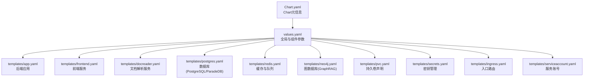

图表来源
- [Chart.yaml:1-27](file://helm/Chart.yaml#L1-L27)
- [values.yaml:1-493](file://helm/values.yaml#L1-L493)
- [app.yaml:1-200](file://helm/templates/app.yaml#L1-L200)
- [frontend.yaml:1-113](file://helm/templates/frontend.yaml#L1-L113)
- [docreader.yaml:1-103](file://helm/templates/docreader.yaml#L1-L103)
- [postgres.yaml:1-129](file://helm/templates/postgres.yaml#L1-L129)
- [redis.yaml:1-125](file://helm/templates/redis.yaml#L1-L125)
- [neo4j.yaml:1-137](file://helm/templates/neo4j.yaml#L1-L137)
- [pvc.yaml:1-82](file://helm/templates/pvc.yaml#L1-L82)
- [secrets.yaml:1-40](file://helm/templates/secrets.yaml#L1-L40)
- [ingress.yaml:1-53](file://helm/templates/ingress.yaml#L1-L53)
- [serviceaccount.yaml:1-25](file://helm/templates/serviceaccount.yaml#L1-L25)

章节来源
- [Chart.yaml:1-27](file://helm/Chart.yaml#L1-L27)
- [values.yaml:1-493](file://helm/values.yaml#L1-L493)

## 核心组件
WeKnora 在 Kubernetes 中的核心组件包括：
- 应用服务（后端 API）：负责业务逻辑、检索驱动、存储与安全配置。
- 前端服务（Web UI）：提供静态资源服务，反向代理至后端 API。
- 文档解析服务（DocReader）：提供 gRPC 文档解析能力，供后端调用。
- 数据库服务（PostgreSQL/ParadeDB）：提供向量检索与全文检索能力。
- 缓存与队列（Redis）：提供流管理与异步任务队列。
- 图数据库（Neo4j，可选）：用于 GraphRAG 的知识图谱存储与查询。
- 存储（PVC）：为数据库、缓存与上传文件提供持久化。
- 密钥（Secrets）：集中管理数据库、Redis、JWT、加密密钥等敏感信息。
- 入口（Ingress）：统一对外访问入口，路由 /api 至后端、/ 至前端。
- 服务账号（ServiceAccount）：为 Pod 提供最小权限的运行身份。

章节来源
- [values.yaml:53-140](file://helm/values.yaml#L53-L140)
- [values.yaml:144-187](file://helm/values.yaml#L144-L187)
- [values.yaml:191-237](file://helm/values.yaml#L191-L237)
- [values.yaml:241-283](file://helm/values.yaml#L241-L283)
- [values.yaml:287-329](file://helm/values.yaml#L287-L329)
- [values.yaml:427-472](file://helm/values.yaml#L427-L472)
- [values.yaml:345-369](file://helm/values.yaml#L345-L369)
- [values.yaml:382-403](file://helm/values.yaml#L382-L403)
- [values.yaml:37-49](file://helm/values.yaml#L37-L49)

## 架构总览
下图展示 WeKnora 在 Kubernetes 中的典型拓扑：前端通过 Service 暴露，Ingress 将 /api 路由到后端 Service，后端通过 Service 访问数据库、缓存与文档解析服务，并根据配置选择是否启用图数据库。

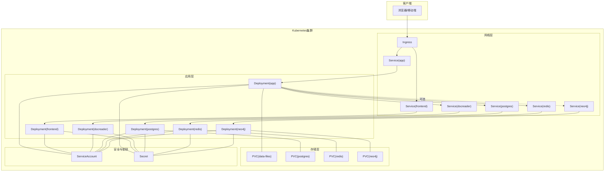

图表来源
- [ingress.yaml:1-53](file://helm/templates/ingress.yaml#L1-L53)
- [app.yaml:182-200](file://helm/templates/app.yaml#L182-L200)
- [frontend.yaml:95-113](file://helm/templates/frontend.yaml#L95-L113)
- [docreader.yaml:85-103](file://helm/templates/docreader.yaml#L85-L103)
- [postgres.yaml:111-129](file://helm/templates/postgres.yaml#L111-L129)
- [redis.yaml:107-125](file://helm/templates/redis.yaml#L107-L125)
- [neo4j.yaml:115-137](file://helm/templates/neo4j.yaml#L115-L137)
- [pvc.yaml:1-82](file://helm/templates/pvc.yaml#L1-L82)
- [secrets.yaml:1-40](file://helm/templates/secrets.yaml#L1-L40)
- [serviceaccount.yaml:1-25](file://helm/templates/serviceaccount.yaml#L1-L25)

## 详细组件分析

### 应用服务（后端 API）
- 组件定位：WeKnora 后端 API，负责业务处理、检索驱动、存储与安全配置。
- 关键配置要点：
  - 副本数与滚动更新策略：支持多副本与零停机升级。
  - 资源请求与限制：CPU/内存配额与请求明确，满足并发场景。
  - 环境变量：数据库、缓存、文档解析、安全与检索驱动等参数集中注入。
  - 探针：HTTP 健康检查端点，延迟与周期合理，适配启动与运行阶段。
  - 存储挂载：上传文件目录挂载至 PVC，保障持久化。
  - 依赖服务：通过 Service 名称访问数据库、缓存、文档解析与可选图数据库。
- 启动顺序：依赖数据库健康检查，文档解析服务健康检查，缓存服务启动。

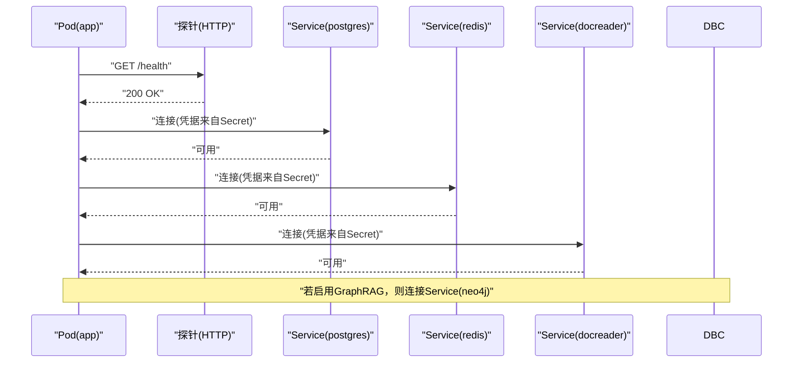

图表来源
- [app.yaml:153-160](file://helm/templates/app.yaml#L153-L160)
- [app.yaml:54-143](file://helm/templates/app.yaml#L54-L143)
- [postgres.yaml:111-129](file://helm/templates/postgres.yaml#L111-L129)
- [redis.yaml:107-125](file://helm/templates/redis.yaml#L107-L125)
- [docreader.yaml:85-103](file://helm/templates/docreader.yaml#L85-L103)
- [secrets.yaml:22-38](file://helm/templates/secrets.yaml#L22-L38)

章节来源
- [app.yaml:1-200](file://helm/templates/app.yaml#L1-L200)
- [values.yaml:53-140](file://helm/values.yaml#L53-L140)

### 前端服务（Web UI）
- 组件定位：提供静态资源与反向代理，将 /api 请求转发至后端。
- 关键配置要点：
  - 副本数与滚动更新策略：保证高可用。
  - 资源请求与限制：轻量级容器，适合边缘节点。
  - 探针：HTTP 就绪与存活探针，路径与延迟合理。
  - 存储：挂载临时目录，满足 Nginx 运行需求。
  - 依赖服务：通过 Service 名称访问后端 API。
- 启动顺序：依赖后端健康检查。

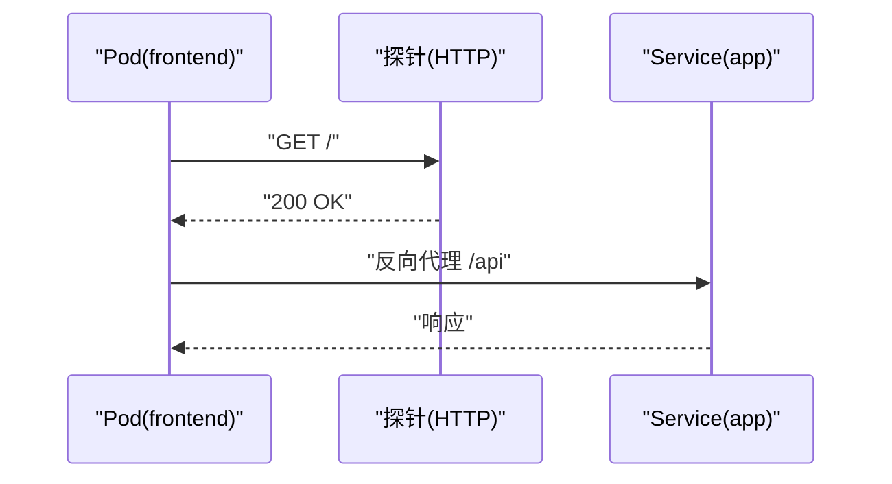

图表来源
- [frontend.yaml:55-71](file://helm/templates/frontend.yaml#L55-L71)
- [frontend.yaml:44-54](file://helm/templates/frontend.yaml#L44-L54)
- [app.yaml:182-200](file://helm/templates/app.yaml#L182-L200)

章节来源
- [frontend.yaml:1-113](file://helm/templates/frontend.yaml#L1-L113)
- [values.yaml:144-187](file://helm/values.yaml#L144-L187)

### 文档解析服务（DocReader）
- 组件定位：提供 gRPC 文档解析能力，供后端调用。
- 关键配置要点：
  - 副本数与滚动更新策略：单副本或小规模副本，保证解析一致性。
  - 资源请求与限制：CPU/内存适中，满足解析任务。
  - 探针：使用 gRPC 健康检查工具，延迟与周期合理。
  - 依赖服务：通过 Service 名称被后端调用。
- 启动顺序：依赖后端健康检查。

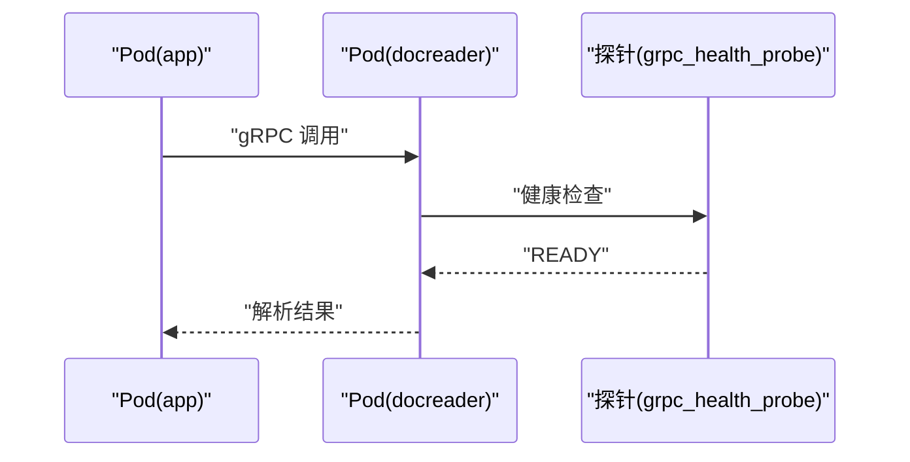

图表来源
- [docreader.yaml:54-71](file://helm/templates/docreader.yaml#L54-L71)
- [docreader.yaml:48-51](file://helm/templates/docreader.yaml#L48-L51)
- [app.yaml:120-121](file://helm/templates/app.yaml#L120-L121)

章节来源
- [docreader.yaml:1-103](file://helm/templates/docreader.yaml#L1-L103)
- [values.yaml:191-237](file://helm/values.yaml#L191-L237)

### 数据库服务（PostgreSQL/ParadeDB）
- 组件定位：提供向量检索与全文检索能力，作为主要数据存储。
- 关键配置要点：
  - 副本数：单副本，使用重建策略避免数据损坏。
  - 资源请求与限制：CPU/内存适中，满足检索与事务。
  - 探针：使用数据库内置工具进行健康检查。
  - 存储：PVC 持久化，容量可配置。
  - 依赖服务：被后端通过 Service 访问。
- 启动顺序：被后端健康检查依赖。

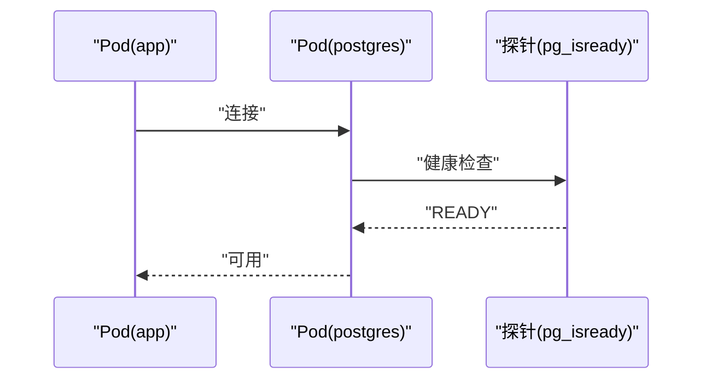

图表来源
- [postgres.yaml:70-89](file://helm/templates/postgres.yaml#L70-L89)
- [postgres.yaml:47-64](file://helm/templates/postgres.yaml#L47-L64)
- [app.yaml:57-61](file://helm/templates/app.yaml#L57-L61)

章节来源
- [postgres.yaml:1-129](file://helm/templates/postgres.yaml#L1-L129)
- [values.yaml:241-283](file://helm/values.yaml#L241-L283)

### 缓存与队列（Redis）
- 组件定位：提供流管理与异步任务队列。
- 关键配置要点：
  - 副本数：单副本，使用重建策略。
  - 资源请求与限制：CPU/内存适中。
  - 探针：使用客户端命令进行健康检查。
  - 存储：PVC 持久化，容量可配置。
  - 依赖服务：被后端通过 Service 访问。
- 启动顺序：被后端启动依赖。

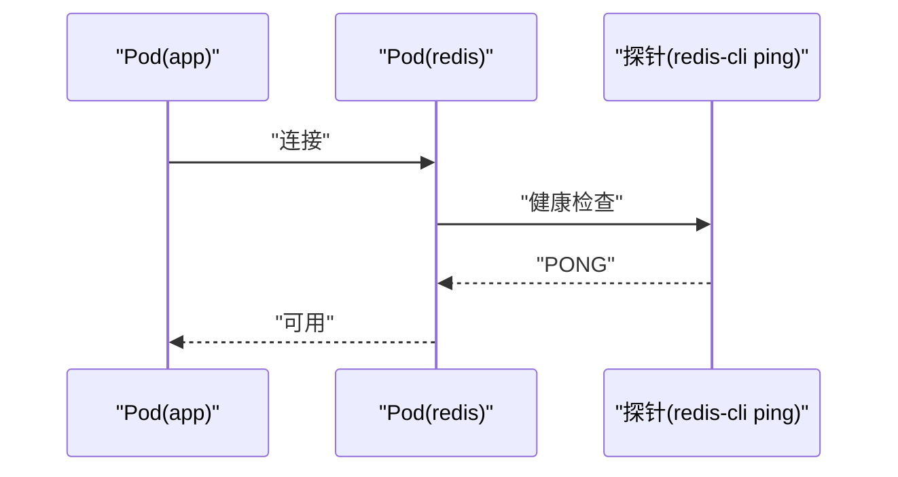

图表来源
- [redis.yaml:66-85](file://helm/templates/redis.yaml#L66-L85)
- [redis.yaml:51-57](file://helm/templates/redis.yaml#L51-L57)
- [app.yaml:76-94](file://helm/templates/app.yaml#L76-L94)

章节来源
- [redis.yaml:1-125](file://helm/templates/redis.yaml#L1-L125)
- [values.yaml:287-329](file://helm/values.yaml#L287-L329)

### 图数据库（Neo4j，可选）
- 组件定位：用于 GraphRAG 的知识图谱存储与查询。
- 关键配置要点：
  - 副本数：单副本，使用重建策略。
  - 资源请求与限制：CPU/内存适中。
  - 探针：HTTP 健康检查。
  - 存储：PVC 持久化，容量可配置。
  - 依赖服务：被后端通过 Service 访问（条件启用）。
- 启动顺序：被后端健康检查依赖（条件启用）。

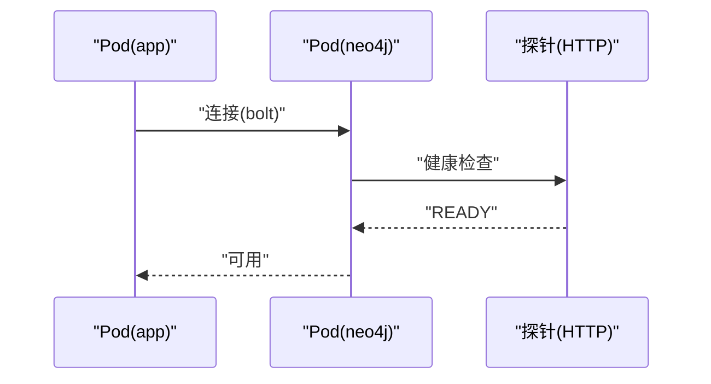

图表来源
- [neo4j.yaml:78-93](file://helm/templates/neo4j.yaml#L78-L93)
- [neo4j.yaml:51-60](file://helm/templates/neo4j.yaml#L51-L60)
- [app.yaml:129-143](file://helm/templates/app.yaml#L129-L143)

章节来源
- [neo4j.yaml:1-137](file://helm/templates/neo4j.yaml#L1-L137)
- [values.yaml:427-472](file://helm/values.yaml#L427-L472)

### 持久卷声明（PVC）
- 组件定位：为数据库、缓存与上传文件提供持久化存储。
- 关键配置要点：
  - 条件创建：仅在启用对应组件且未指定现有 PVC 时创建。
  - 访问模式：读写单节点（RWO）。
  - 存储类：可继承全局存储类配置。
  - 容量：可配置大小。

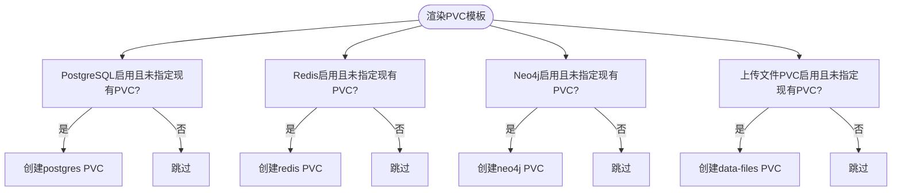

图表来源
- [pvc.yaml:8-25](file://helm/templates/pvc.yaml#L8-L25)
- [pvc.yaml:27-44](file://helm/templates/pvc.yaml#L27-L44)
- [pvc.yaml:46-63](file://helm/templates/pvc.yaml#L46-L63)
- [pvc.yaml:65-82](file://helm/templates/pvc.yaml#L65-L82)

章节来源
- [pvc.yaml:1-82](file://helm/templates/pvc.yaml#L1-L82)
- [values.yaml:266-274](file://helm/values.yaml#L266-L274)
- [values.yaml:312-320](file://helm/values.yaml#L312-L320)
- [values.yaml:455-463](file://helm/values.yaml#L455-L463)
- [values.yaml:333-341](file://helm/values.yaml#L333-L341)

### 密钥（Secrets）
- 组件定位：集中管理数据库、Redis、JWT、加密密钥等敏感信息。
- 关键配置要点：
  - 默认行为：未指定现有密钥时，按 values.yaml 参数创建。
  - 必填项：生产环境必须提供数据库密码、Redis 密码、JWT 密钥等。
  - 可选项：当启用图数据库时，需提供图数据库密码。

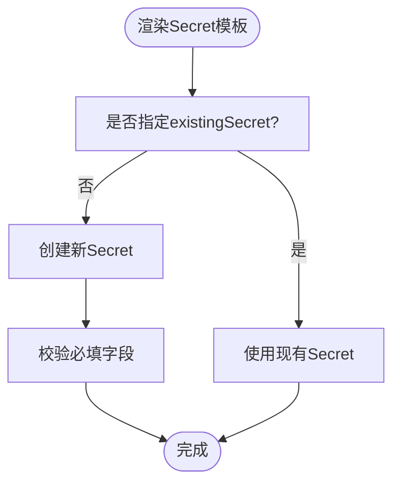

图表来源
- [secrets.yaml:13-40](file://helm/templates/secrets.yaml#L13-L40)
- [values.yaml:382-403](file://helm/values.yaml#L382-L403)

章节来源
- [secrets.yaml:1-40](file://helm/templates/secrets.yaml#L1-L40)
- [values.yaml:382-403](file://helm/values.yaml#L382-L403)

### 入口（Ingress）
- 组件定位：统一对外访问入口，将 /api 路由到后端，/ 路由到前端。
- 关键配置要点：
  - 路由规则：优先匹配 /api，再匹配 /。
  - TLS：可选开启，支持自定义证书名称。
  - 注解：可配置代理缓冲区、超时等参数。

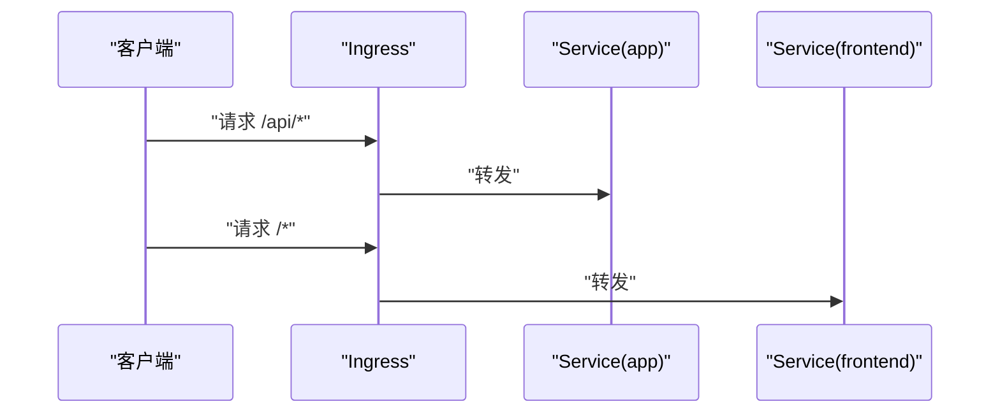

图表来源
- [ingress.yaml:32-52](file://helm/templates/ingress.yaml#L32-L52)
- [app.yaml:182-200](file://helm/templates/app.yaml#L182-L200)
- [frontend.yaml:95-113](file://helm/templates/frontend.yaml#L95-L113)

章节来源
- [ingress.yaml:1-53](file://helm/templates/ingress.yaml#L1-L53)
- [values.yaml:345-369](file://helm/values.yaml#L345-L369)

### 服务账号（ServiceAccount）
- 组件定位：为 Pod 提供最小权限的运行身份。
- 关键配置要点：
  - 可选创建：可按需启用。
  - 标签与注解：可附加标签与注解。
  - 自动挂载：可配置是否自动挂载 API 凭据。

章节来源
- [serviceaccount.yaml:1-25](file://helm/templates/serviceaccount.yaml#L1-L25)
- [values.yaml:37-49](file://helm/values.yaml#L37-L49)

## 依赖关系分析
- 组件依赖：
  - 前端依赖后端健康检查。
  - 后端依赖数据库、缓存、文档解析服务健康检查；可选依赖图数据库。
  - 数据库、缓存、图数据库均为单副本，使用重建策略。
- 启动顺序：
  - 数据库 → 缓存 → 文档解析 → 后端 → 前端。
- 网络策略：
  - 通过 Service 名称进行服务发现，端口命名清晰，便于 Ingress 与探针配置。
  - Ingress 将 /api 与 / 路由至不同 Service，实现前后端分离。

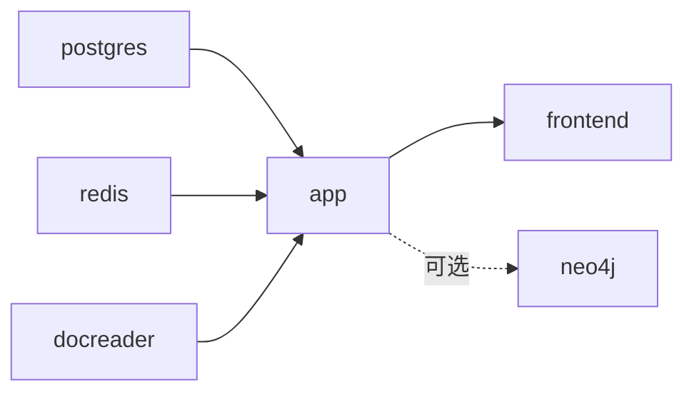

图表来源
- [app.yaml:57-61](file://helm/templates/app.yaml#L57-L61)
- [app.yaml:76-94](file://helm/templates/app.yaml#L76-L94)
- [app.yaml:120-121](file://helm/templates/app.yaml#L120-L121)
- [app.yaml:129-143](file://helm/templates/app.yaml#L129-L143)
- [frontend.yaml:44-48](file://helm/templates/frontend.yaml#L44-L48)

章节来源
- [app.yaml:1-200](file://helm/templates/app.yaml#L1-L200)
- [frontend.yaml:1-113](file://helm/templates/frontend.yaml#L1-L113)
- [docreader.yaml:1-103](file://helm/templates/docreader.yaml#L1-L103)
- [postgres.yaml:1-129](file://helm/templates/postgres.yaml#L1-L129)
- [redis.yaml:1-125](file://helm/templates/redis.yaml#L1-L125)
- [neo4j.yaml:1-137](file://helm/templates/neo4j.yaml#L1-L137)

## 性能考虑
- 资源规划：
  - CPU/内存请求与限制应结合实际负载与并发峰值评估，逐步调优。
  - 对于数据库与缓存，建议单独节点亲和或隔离，避免资源争抢。
- 存储：
  - PVC 容量与 IOPS 需满足检索与写入压力，必要时选择更高性能的存储类。
- 探针：
  - 探针的初始延迟、周期与超时应与组件启动时间匹配，避免误判。
- 网络：
  - Ingress 注解可调整代理缓冲与超时，提升大文件上传与长连接稳定性。
- 可观测性：
  - 可结合 Jaeger/Tracing 与日志采集，定位性能瓶颈。

## 故障排查指南
- 健康检查失败：
  - 检查探针配置与端口映射是否一致。
  - 查看容器日志与事件，确认依赖服务是否可用。
- 依赖服务不可达：
  - 确认 Service 名称与端口正确，DNS 解析正常。
  - 检查 Secret 是否正确注入，凭据是否匹配。
- 存储问题：
  - 检查 PVC 绑定状态与存储类配置，确认容量与访问模式。
- Ingress 异常：
  - 检查路由规则与注解配置，确认 TLS 证书与域名解析。
- 启动顺序异常：
  - 确认后端对数据库、缓存、文档解析的健康检查依赖配置正确。

章节来源
- [app.yaml:153-160](file://helm/templates/app.yaml#L153-L160)
- [frontend.yaml:55-71](file://helm/templates/frontend.yaml#L55-L71)
- [docreader.yaml:54-71](file://helm/templates/docreader.yaml#L54-L71)
- [postgres.yaml:70-89](file://helm/templates/postgres.yaml#L70-L89)
- [redis.yaml:66-85](file://helm/templates/redis.yaml#L66-L85)
- [ingress.yaml:1-53](file://helm/templates/ingress.yaml#L1-L53)
- [secrets.yaml:1-40](file://helm/templates/secrets.yaml#L1-L40)

## 结论
WeKnora 的 Helm Chart 通过模块化的模板与参数化配置，提供了面向生产的 Kubernetes 部署方案。通过合理的资源限制与请求、完善的健康检查与探针、清晰的服务发现与网络策略，以及可选的图数据库支持，能够满足企业级知识管理与智能问答场景的需求。建议在生产环境中结合业务负载与资源池策略，持续优化资源配置与存储性能，并完善可观测性与安全策略。

## 附录
- 与本地开发/单机部署对照：
  - 本地 docker-compose 提供了与 Kubernetes 类似的组件与依赖关系，可作为理解组件交互的参考。
- 单机服务单元（Lite）：
  - 提供 systemd 服务单元示例，便于在非容器环境下运行 WeKnora。

章节来源
- [docker-compose.yml:1-613](file://docker-compose.yml#L1-L613)
- [weknora-lite.service:1-24](file://deploy/weknora-lite.service#L1-L24)
- [README.md:226-261](file://README.md#L226-L261)
- [开发指南.md:1-286](file://docs/开发指南.md#L1-L286)