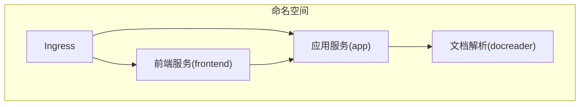
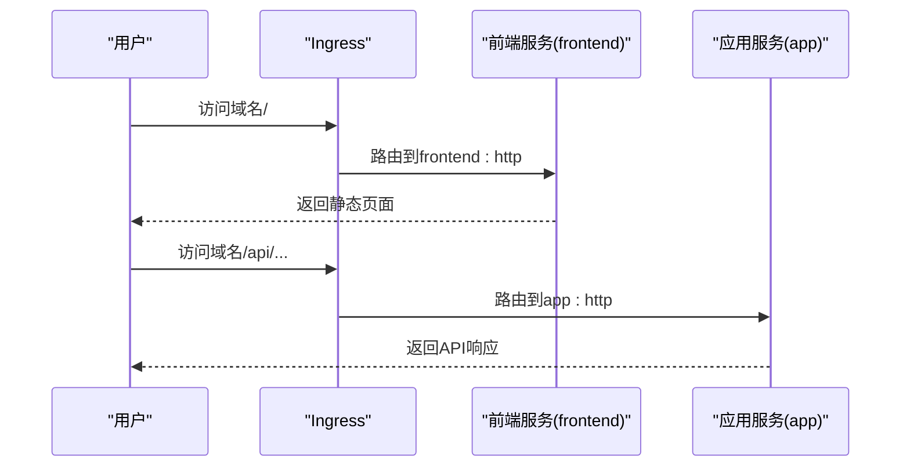
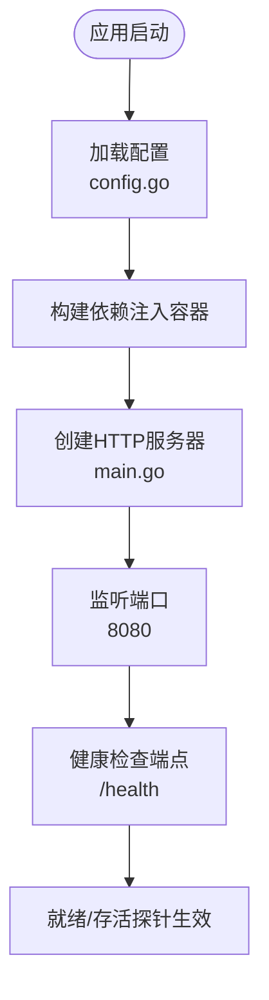
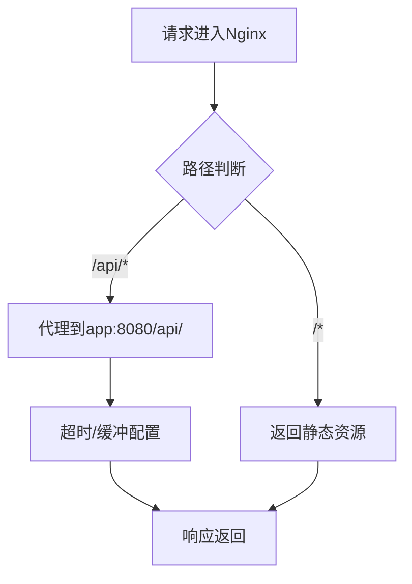
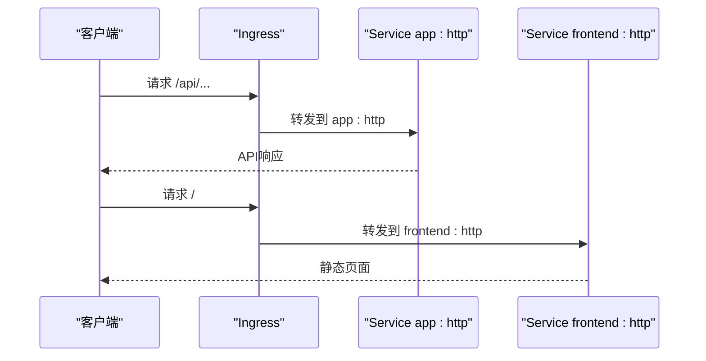
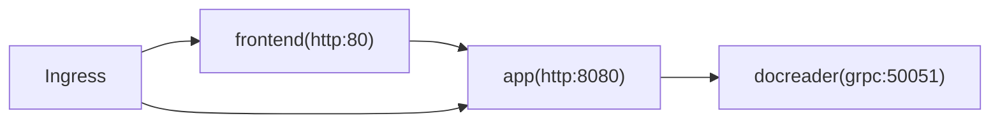

# Service与网络配置

<cite>
**本文档引用的文件**
- [helm/templates/app.yaml](file://helm/templates/app.yaml)
- [helm/templates/frontend.yaml](file://helm/templates/frontend.yaml)
- [helm/templates/docreader.yaml](file://helm/templates/docreader.yaml)
- [helm/templates/ingress.yaml](file://helm/templates/ingress.yaml)
- [helm/templates/secrets.yaml](file://helm/templates/secrets.yaml)
- [helm/values.yaml](file://helm/values.yaml)
- [frontend/nginx.conf](file://frontend/nginx.conf)
- [cmd/server/main.go](file://cmd/server/main.go)
- [internal/config/config.go](file://internal/config/config.go)
- [docker-compose.yml](file://docker-compose.yml)
- [internal/utils/security.go](file://internal/utils/security.go)
</cite>

## 目录
1. [简介](#简介)
2. [项目结构](#项目结构)
3. [核心组件](#核心组件)
4. [架构总览](#架构总览)
5. [详细组件分析](#详细组件分析)
6. [依赖关系分析](#依赖关系分析)
7. [性能考虑](#性能考虑)
8. [故障排除指南](#故障排除指南)
9. [结论](#结论)

## 简介
本文件面向DevOps工程师，系统性梳理WeKnora在Kubernetes环境下的Service与网络配置，覆盖以下主题：
- 不同类型Service的配置与使用场景（ClusterIP、NodePort、LoadBalancer）
- 服务发现机制、端口映射与流量路由
- Ingress控制器配置（TLS证书与路由规则）
- 网络策略与安全防护（SSRF、IP白名单、端口限制）
- 负载均衡与高可用部署最佳实践

## 项目结构
WeKnora采用Helm Chart进行统一编排，核心网络组件包括：
- 后端应用服务（app）：提供API能力，使用ClusterIP暴露
- 前端服务（frontend）：通过Nginx提供静态资源与反向代理，使用ClusterIP
- 文档解析服务（docreader）：gRPC服务，使用ClusterIP
- Ingress：统一入口，将/api路由至后端，/路由至前端
- Secret：集中管理数据库、Redis、JWT等敏感信息

**图表来源**
- [helm/templates/app.yaml:182-199](file://helm/templates/app.yaml#L182-L199)
- [helm/templates/frontend.yaml:95-112](file://helm/templates/frontend.yaml#L95-L112)
- [helm/templates/docreader.yaml:85-102](file://helm/templates/docreader.yaml#L85-L102)
- [helm/templates/ingress.yaml:32-51](file://helm/templates/ingress.yaml#L32-L51)

**章节来源**
- [helm/templates/app.yaml:182-199](file://helm/templates/app.yaml#L182-L199)
- [helm/templates/frontend.yaml:95-112](file://helm/templates/frontend.yaml#L95-L112)
- [helm/templates/docreader.yaml:85-102](file://helm/templates/docreader.yaml#L85-L102)
- [helm/templates/ingress.yaml:32-51](file://helm/templates/ingress.yaml#L32-L51)

## 核心组件
- 应用服务（app）
  - 服务类型：ClusterIP
  - 端口：8080（targetPort: http）
  - 用途：承载业务API、健康检查、探针
- 前端服务（frontend）
  - 服务类型：ClusterIP
  - 端口：80（targetPort: http）
  - 用途：静态资源、反向代理至后端API
- 文档解析服务（docreader）
  - 服务类型：ClusterIP
  - 端口：50051（targetPort: grpc）
  - 用途：文档解析（gRPC）
- Ingress
  - 路由规则：/api → app:http；/ → frontend:http
  - TLS：可选，支持证书注入
- Secret
  - 存储：DB_USER、DB_PASSWORD、DB_NAME、REDIS_USERNAME、REDIS_PASSWORD、JWT_SECRET、TENANT_AES_KEY、SYSTEM_AES_KEY
  - 用途：被各组件以环境变量或密文形式挂载

**章节来源**
- [helm/values.yaml:107-130](file://helm/values.yaml#L107-L130)
- [helm/values.yaml:174-186](file://helm/values.yaml#L174-L186)
- [helm/values.yaml:224-236](file://helm/values.yaml#L224-L236)
- [helm/templates/ingress.yaml:32-51](file://helm/templates/ingress.yaml#L32-L51)
- [helm/templates/secrets.yaml:22-38](file://helm/templates/secrets.yaml#L22-L38)

## 架构总览
WeKnora的网络架构遵循Kubernetes标准实践：
- 内部服务间通过ClusterIP与Service名称进行服务发现
- 前端Nginx作为统一入口，将/api转发至后端服务，/转发至前端静态资源
- Ingress负责外部TLS终止与路由分发
- Secret集中管理敏感配置，避免硬编码

**图表来源**
- [helm/templates/ingress.yaml:32-51](file://helm/templates/ingress.yaml#L32-L51)
- [frontend/nginx.conf:36-57](file://frontend/nginx.conf#L36-L57)

**章节来源**
- [helm/templates/ingress.yaml:32-51](file://helm/templates/ingress.yaml#L32-L51)
- [frontend/nginx.conf:36-57](file://frontend/nginx.conf#L36-L57)

## 详细组件分析

### 应用服务（app）配置
- 服务类型：ClusterIP
- 端口映射：port=8080 → targetPort=http
- 健康检查：/health（liveness/readiness）
- 环境变量：数据库、Redis、JWT、检索驱动、存储类型等
- 资源限制：requests/limits
- 探针：健康检查路径与参数

**图表来源**
- [cmd/server/main.go:62-115](file://cmd/server/main.go#L62-L115)
- [internal/config/config.go:144-150](file://internal/config/config.go#L144-L150)

**章节来源**
- [helm/templates/app.yaml:182-199](file://helm/templates/app.yaml#L182-L199)
- [helm/values.yaml:107-130](file://helm/values.yaml#L107-L130)
- [cmd/server/main.go:62-115](file://cmd/server/main.go#L62-L115)
- [internal/config/config.go:144-150](file://internal/config/config.go#L144-L150)

### 前端服务（frontend）配置
- 服务类型：ClusterIP
- 端口映射：port=80 → targetPort=http
- 反向代理：将/api/代理到后端app（支持SSE、长连接）
- Nginx配置：超时、缓冲、缓存、安全头
- 环境变量：APP_HOST、APP_PORT、APP_SCHEME

**图表来源**
- [frontend/nginx.conf:36-57](file://frontend/nginx.conf#L36-L57)

**章节来源**
- [helm/templates/frontend.yaml:95-112](file://helm/templates/frontend.yaml#L95-L112)
- [frontend/nginx.conf:36-57](file://frontend/nginx.conf#L36-L57)

### 文档解析服务（docreader）配置
- 服务类型：ClusterIP
- 端口映射：port=50051 → targetPort=grpc
- 健康检查：grpc_health_probe
- 环境变量：STORAGE_TYPE
- 资源限制：requests/limits

**章节来源**
- [helm/templates/docreader.yaml:85-102](file://helm/templates/docreader.yaml#L85-L102)
- [helm/values.yaml:224-236](file://helm/values.yaml#L224-L236)

### Ingress控制器配置
- 路由规则：
  - /api → backend: app:http
  - / → backend: frontend:http
- TLS：
  - enabled: false（默认关闭）
  - host: weknora.example.com
  - secretName: TLS证书密文名称
- 注解：代理超时、缓冲、连接数等优化

**图表来源**
- [helm/templates/ingress.yaml:32-51](file://helm/templates/ingress.yaml#L32-L51)

**章节来源**
- [helm/templates/ingress.yaml:32-51](file://helm/templates/ingress.yaml#L32-L51)
- [helm/values.yaml:345-369](file://helm/values.yaml#L345-L369)

### Secret与安全配置
- Secret内容：DB_USER、DB_PASSWORD、DB_NAME、REDIS_USERNAME、REDIS_PASSWORD、JWT_SECRET、TENANT_AES_KEY、SYSTEM_AES_KEY
- 生产建议：使用外部密管（External Secrets Operator、Vault）或现有Secret
- SSRF防护：URL白名单、禁止直接IP访问、阻断内部端口、DNS解析验证

**章节来源**
- [helm/templates/secrets.yaml:22-38](file://helm/templates/secrets.yaml#L22-L38)
- [internal/utils/security.go:373-480](file://internal/utils/security.go#L373-L480)

## 依赖关系分析
- 服务发现链路：
  - 前端Nginx → Service frontend → Pod frontend
  - 前端Nginx → Service app → Pod app
  - app → Service docreader → Pod docreader
- Ingress → Service（app或frontend）

**图表来源**
- [helm/templates/frontend.yaml:104-111](file://helm/templates/frontend.yaml#L104-L111)
- [helm/templates/app.yaml:191-198](file://helm/templates/app.yaml#L191-L198)
- [helm/templates/docreader.yaml:94-101](file://helm/templates/docreader.yaml#L94-L101)
- [helm/templates/ingress.yaml:39-50](file://helm/templates/ingress.yaml#L39-L50)

**章节来源**
- [helm/templates/frontend.yaml:104-111](file://helm/templates/frontend.yaml#L104-L111)
- [helm/templates/app.yaml:191-198](file://helm/templates/app.yaml#L191-L198)
- [helm/templates/docreader.yaml:94-101](file://helm/templates/docreader.yaml#L94-L101)
- [helm/templates/ingress.yaml:39-50](file://helm/templates/ingress.yaml#L39-L50)

## 性能考虑
- 超时与缓冲
  - Nginx代理超时（proxy_read_timeout、proxy_send_timeout）适合长连接与SSE
  - 建议根据业务峰值调整，避免上游超时导致的连接中断
- 连接与重试
  - proxy_next_upstream与重试次数控制，提升稳定性
- 资源与探针
  - 为各组件设置合理的requests/limits与探针参数，确保快速故障恢复
- Ingress优化
  - 合理设置注解（如代理大小、超时），结合后端限流与队列策略

[本节为通用指导，无需特定文件引用]

## 故障排除指南
- 健康检查失败
  - 检查liveness/readiness探针路径与参数
  - 确认应用端口与targetPort一致
- Ingress无法访问
  - 确认Ingress启用、className正确、TLS配置与证书匹配
  - 检查路由规则优先级（/api更具体）
- SSRF相关问题
  - 禁止直接IP访问，使用域名或白名单
  - 检查DNS解析结果是否为受限IP
  - 禁用内部端口直连，避免内网探测
- 前端静态资源或API异常
  - 检查Nginx代理配置（APP_HOST、APP_PORT、APP_SCHEME）
  - 确认后端服务可达且健康

**章节来源**
- [helm/values.yaml:112-130](file://helm/values.yaml#L112-L130)
- [helm/templates/ingress.yaml:24-31](file://helm/templates/ingress.yaml#L24-L31)
- [frontend/nginx.conf:36-57](file://frontend/nginx.conf#L36-L57)
- [internal/utils/security.go:373-480](file://internal/utils/security.go#L373-L480)

## 结论
WeKnora的Service与网络配置遵循Kubernetes最佳实践，通过ClusterIP实现内部服务发现，借助Ingress统一入口与TLS终止，配合Nginx实现API与静态资源的高效路由。生产部署应重点关注：
- Ingress TLS与路由规则的正确配置
- Secret的安全管理与密钥轮换
- SSRF防护与网络访问控制
- 资源与探针的合理设置，保障高可用与稳定性