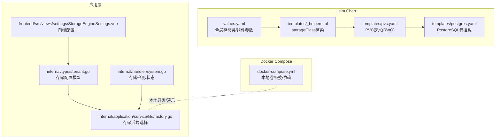
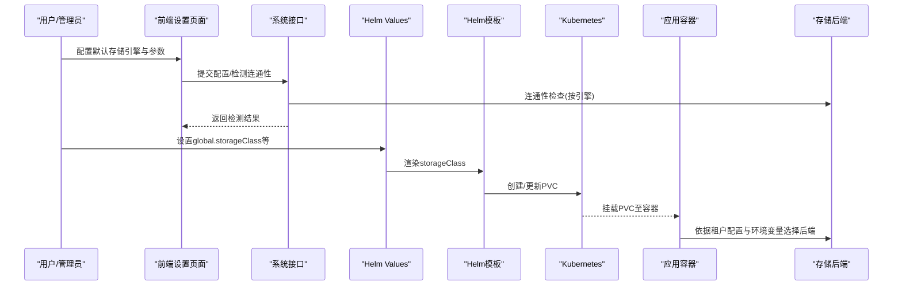
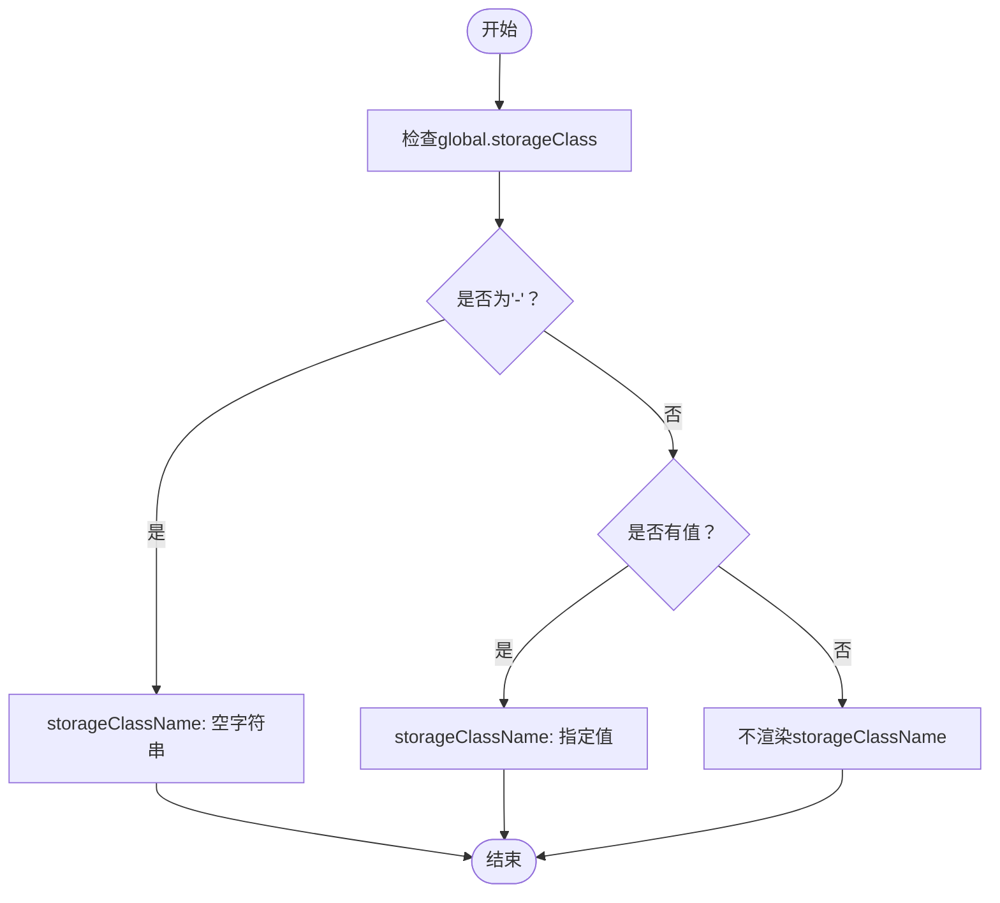
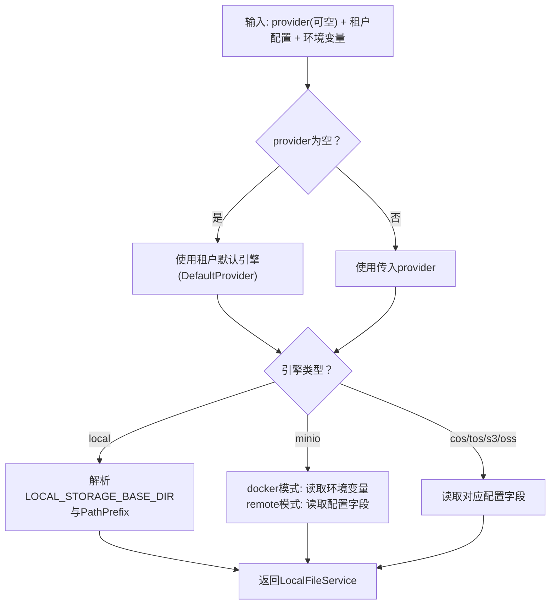
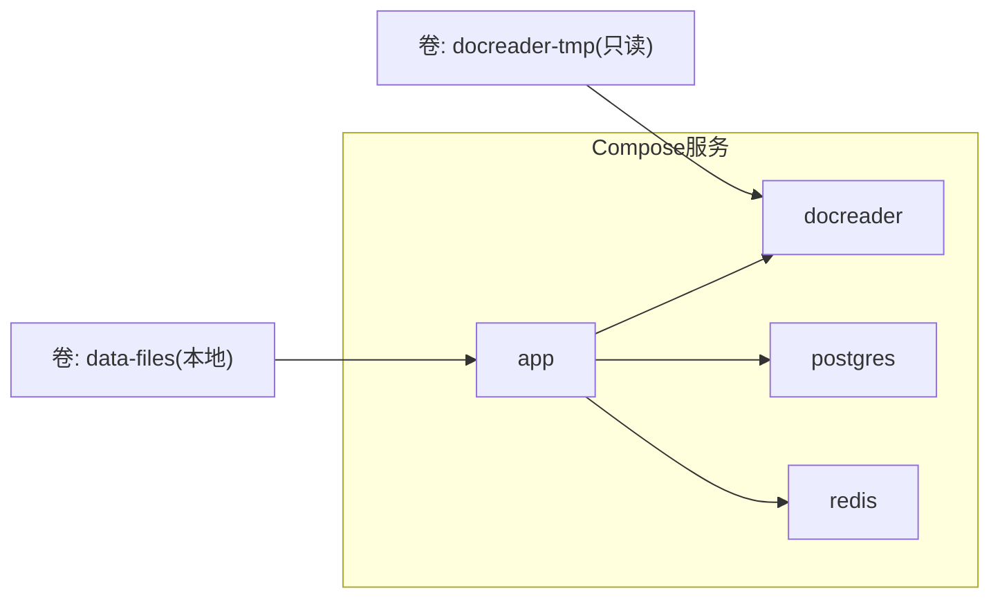
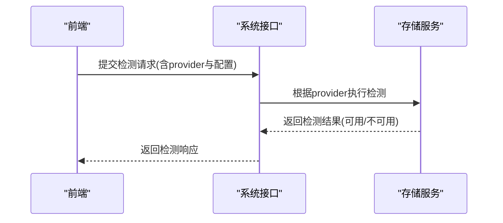
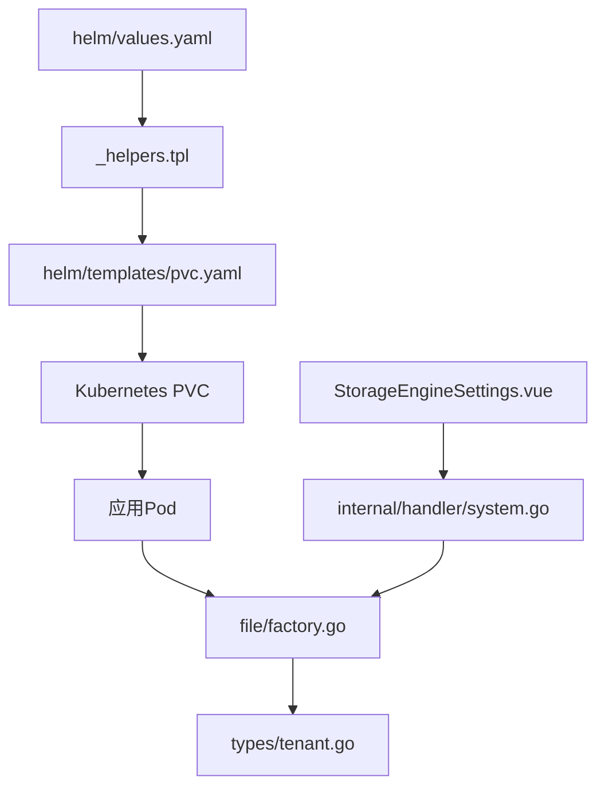

# 存储与持久化

<cite>
**本文引用的文件**
- [values.yaml](file://helm/values.yaml)
- [pvc.yaml](file://helm/templates/pvc.yaml)
- [_helpers.tpl](file://helm/templates/_helpers.tpl)
- [postgres.yaml](file://helm/templates/postgres.yaml)
- [docker-compose.yml](file://docker-compose.yml)
- [factory.go](file://internal/application/service/file/factory.go)
- [tenant.go](file://internal/types/tenant.go)
- [StorageEngineSettings.vue](file://frontend/src/views/settings/StorageEngineSettings.vue)
- [system.go](file://internal/handler/system.go)
- [README.md](file://helm/README.md)
</cite>

## 目录
1. [简介](#简介)
2. [项目结构](#项目结构)
3. [核心组件](#核心组件)
4. [架构总览](#架构总览)
5. [详细组件分析](#详细组件分析)
6. [依赖分析](#依赖分析)
7. [性能考虑](#性能考虑)
8. [故障排查指南](#故障排查指南)
9. [结论](#结论)
10. [附录](#附录)

## 简介
本章节面向系统管理员，提供WeKnora在Kubernetes与Docker Compose两种部署形态下的存储与持久化配置完整指南。内容涵盖：
- PersistentVolume与PersistentVolumeClaim的配置与动态供应
- 存储类选择与集群默认策略
- 不同存储后端（本地、MinIO/S3兼容、COS、TOS、S3、OSS）的配置要点
- 卷挂载策略、访问模式与容量管理
- 数据备份与恢复策略（快照与复制）
- 存储性能优化与监控建议

## 项目结构
WeKnora通过Helm Chart与Docker Compose分别提供Kubernetes与单机/轻量级部署的存储配置能力。关键位置如下：
- Helm Chart Values与模板：定义全局存储类、各组件PVC与挂载策略
- Docker Compose：定义本地卷与服务间依赖，便于本地开发与演示
- 文件存储工厂：根据租户配置与环境变量选择具体存储后端
- 前端设置界面：可视化配置存储引擎与路径前缀
- 系统接口：提供存储引擎可用性检测与状态查询

**图表来源**
- [values.yaml:14-16](file://helm/values.yaml#L14-L16)
- [_helpers.tpl:163-171](file://helm/templates/_helpers.tpl#L163-L171)
- [pvc.yaml:18-23](file://helm/templates/pvc.yaml#L18-L23)
- [postgres.yaml:90-97](file://helm/templates/postgres.yaml#L90-L97)
- [factory.go:14-131](file://internal/application/service/file/factory.go#L14-L131)
- [tenant.go:390-458](file://internal/types/tenant.go#L390-L458)
- [StorageEngineSettings.vue:1-146](file://frontend/src/views/settings/StorageEngineSettings.vue#L1-L146)
- [system.go:467-482](file://internal/handler/system.go#L467-L482)

**章节来源**
- [values.yaml:14-16](file://helm/values.yaml#L14-L16)
- [pvc.yaml:18-23](file://helm/templates/pvc.yaml#L18-L23)
- [docker-compose.yml:38-43](file://docker-compose.yml#L38-L43)

## 核心组件
- 全局存储类与安全上下文
  - 全局storageClass用于为所有PVC注入storageClassName，支持“使用集群默认”或指定存储类名
  - 默认安全上下文限制特权提升，确保容器非root运行（如镜像支持）
- PostgreSQL/Redis/Neo4j/PVC
  - 统一采用ReadWriteOnce访问模式，满足单副本写入需求
  - PVC大小按组件需求独立配置，支持复用已有PVC
- 文件存储后端
  - 支持本地、MinIO/S3兼容、COS、TOS、S3、OSS
  - 通过租户配置与环境变量驱动，具备路径前缀与桶名等差异化参数
- 前端与系统接口
  - 前端提供默认引擎选择与各后端参数配置
  - 系统接口提供可用性检测与状态查询

**章节来源**
- [values.yaml:13-35](file://helm/values.yaml#L13-L35)
- [pvc.yaml:18-23](file://helm/templates/pvc.yaml#L18-L23)
- [factory.go:14-131](file://internal/application/service/file/factory.go#L14-L131)
- [tenant.go:390-458](file://internal/types/tenant.go#L390-L458)
- [StorageEngineSettings.vue:1-146](file://frontend/src/views/settings/StorageEngineSettings.vue#L1-L146)
- [system.go:467-482](file://internal/handler/system.go#L467-L482)

## 架构总览
下图展示从Helm Chart到应用层存储后端选择的整体流程。

**图表来源**
- [StorageEngineSettings.vue:1-146](file://frontend/src/views/settings/StorageEngineSettings.vue#L1-L146)
- [system.go:467-482](file://internal/handler/system.go#L467-L482)
- [values.yaml:14-16](file://helm/values.yaml#L14-L16)
- [_helpers.tpl:163-171](file://helm/templates/_helpers.tpl#L163-L171)
- [pvc.yaml:18-23](file://helm/templates/pvc.yaml#L18-L23)

## 详细组件分析

### Kubernetes持久化：PVC与存储类
- 存储类选择
  - 全局storageClass为空字符串表示使用集群默认存储类；设置为“-”将渲染storageClassName为空字符串，显式使用默认
- PVC访问模式与容量
  - 访问模式统一为ReadWriteOnce，适用于PostgreSQL、Redis、Neo4j与数据文件卷
  - 容量按组件独立配置，支持existingClaim复用已有PVC
- 渲染逻辑
  - 模板通过“storageClass”辅助函数注入storageClassName，未设置时不渲染该项

**图表来源**
- [_helpers.tpl:163-171](file://helm/templates/_helpers.tpl#L163-L171)
- [pvc.yaml:18-23](file://helm/templates/pvc.yaml#L18-L23)

**章节来源**
- [values.yaml:14-16](file://helm/values.yaml#L14-L16)
- [_helpers.tpl:163-171](file://helm/templates/_helpers.tpl#L163-L171)
- [pvc.yaml:18-23](file://helm/templates/pvc.yaml#L18-L23)

### 文件存储后端配置与选择
- 支持的后端类型
  - 本地(local)、MinIO(minio)、COS(cos)、TOS(tos)、S3(s3)、OSS(oss)
- 选择逻辑
  - 优先使用租户配置中的DefaultProvider；若为空则回退到环境变量STORAGE_TYPE
  - 本地：使用LOCAL_STORAGE_BASE_DIR与路径前缀
  - MinIO：支持“docker”模式（从环境变量读取）与“remote”模式（从配置读取）
  - 其他云存储：均从租户配置读取必要参数（Endpoint/Region/AccessKey/SecretKey/BucketName/PathPrefix等）

**图表来源**
- [factory.go:14-131](file://internal/application/service/file/factory.go#L14-L131)
- [tenant.go:390-458](file://internal/types/tenant.go#L390-L458)

**章节来源**
- [factory.go:14-131](file://internal/application/service/file/factory.go#L14-L131)
- [tenant.go:390-458](file://internal/types/tenant.go#L390-L458)
- [StorageEngineSettings.vue:1-146](file://frontend/src/views/settings/StorageEngineSettings.vue#L1-L146)

### Docker Compose本地存储与卷挂载
- 本地卷
  - 应用容器挂载本地卷“data-files”，用于存放上传文件
  - docreader容器挂载只读临时目录“docreader-tmp”
- 服务依赖
  - app依赖postgres、redis、docreader健康状态
- 环境变量
  - STORAGE_TYPE、LOCAL_STORAGE_BASE_DIR等控制存储行为

**图表来源**
- [docker-compose.yml:38-43](file://docker-compose.yml#L38-L43)
- [docker-compose.yml:148-157](file://docker-compose.yml#L148-L157)

**章节来源**
- [docker-compose.yml:38-43](file://docker-compose.yml#L38-L43)
- [docker-compose.yml:148-157](file://docker-compose.yml#L148-L157)

### 存储引擎可用性检测与状态
- 可用性检测
  - 支持对MinIO、COS、TOS、S3、OSS进行连通性测试，不保存配置
  - 本地引擎无需检测
- 状态查询
  - 返回各引擎可用性与描述信息，前端据此启用/禁用配置项

**图表来源**
- [system.go:593-625](file://internal/handler/system.go#L593-L625)

**章节来源**
- [system.go:467-482](file://internal/handler/system.go#L467-L482)
- [system.go:593-625](file://internal/handler/system.go#L593-L625)

## 依赖分析
- Helm Chart与Kubernetes
  - values.yaml定义全局storageClass；_helpers.tpl渲染storageClassName；pvc.yaml声明PVC；postgres.yaml挂载PVC
- 应用层与存储后端
  - factory.go根据租户配置与环境变量选择具体存储实现
- 前端与后端
  - StorageEngineSettings.vue提交配置；system.go提供检测与状态

**图表来源**
- [values.yaml:14-16](file://helm/values.yaml#L14-L16)
- [_helpers.tpl:163-171](file://helm/templates/_helpers.tpl#L163-L171)
- [pvc.yaml:18-23](file://helm/templates/pvc.yaml#L18-L23)
- [factory.go:14-131](file://internal/application/service/file/factory.go#L14-L131)
- [tenant.go:390-458](file://internal/types/tenant.go#L390-L458)
- [StorageEngineSettings.vue:1-146](file://frontend/src/views/settings/StorageEngineSettings.vue#L1-L146)
- [system.go:467-482](file://internal/handler/system.go#L467-L482)

**章节来源**
- [values.yaml:14-16](file://helm/values.yaml#L14-L16)
- [_helpers.tpl:163-171](file://helm/templates/_helpers.tpl#L163-L171)
- [pvc.yaml:18-23](file://helm/templates/pvc.yaml#L18-L23)
- [factory.go:14-131](file://internal/application/service/file/factory.go#L14-L131)
- [tenant.go:390-458](file://internal/types/tenant.go#L390-L458)
- [StorageEngineSettings.vue:1-146](file://frontend/src/views/settings/StorageEngineSettings.vue#L1-L146)
- [system.go:467-482](file://internal/handler/system.go#L467-L482)

## 性能考虑
- 存储类与IOPS/吞吐
  - 为数据库与缓存组件选择高性能存储类，确保RWO访问模式下的稳定写入
- PVC容量规划
  - 根据业务规模与增长预期预留充足容量，避免频繁扩容
- 本地部署优化
  - Docker Compose场景下，合理设置max_open_files与磁盘队列深度，避免I/O瓶颈
- 对象存储性能
  - S3兼容/云厂商对象存储建议开启分片上传与断点续传，结合路径前缀实现命名空间隔离
- 监控建议
  - 结合Prometheus/Grafana采集PVC使用率、I/O等待时间与对象存储请求延迟
  - 关注应用侧日志中的存储错误与重试次数

[本节为通用指导，不直接分析具体文件]

## 故障排查指南
- PVC无法绑定/扩容失败
  - 检查storageClass是否正确，确认集群默认存储类可用
  - 核对PVC访问模式与存储后端支持情况（RWO/RWX差异）
- 存储后端连通性问题
  - 使用系统接口的“存储引擎检测”功能验证配置
  - 对比租户配置与环境变量，确认参数一致
- 本地路径前缀安全
  - 确保LOCAL_STORAGE_BASE_DIR与PathPrefix拼接后仍位于允许的基础目录内
- MinIO远程模式
  - 确认remote模式下Endpoint/AccessKey/SecretKey/BucketName完整；docker模式下需确保环境变量正确注入

**章节来源**
- [system.go:593-625](file://internal/handler/system.go#L593-L625)
- [factory.go:30-74](file://internal/application/service/file/factory.go#L30-L74)
- [docker-compose.yml:110-117](file://docker-compose.yml#L110-L117)

## 结论
WeKnora提供了灵活的存储与持久化方案：在Kubernetes上通过Helm Chart统一管理PVC与存储类，在应用层通过租户配置与环境变量选择多种存储后端。结合前端配置界面与系统接口检测能力，管理员可以快速完成从存储类选择、PVC创建到后端连通性的全链路配置与验证。建议在生产环境中优先采用高性能存储类、合理的容量规划与完善的监控告警体系，以保障数据可靠性与系统稳定性。

[本节为总结性内容，不直接分析具体文件]

## 附录

### 生产安装示例与参数说明
- 生产安装建议
  - 明确global.storageClass，设置合适的副本数与资源配额
  - 为PostgreSQL/Redis/Neo4j与数据文件卷设置充足的容量
  - 使用外部Secret管理敏感信息，避免明文注入
- 参数对照
  - 全局参数：storageClass、imagePullSecrets、pod/container安全上下文
  - 组件参数：replicaCount、resources、persistence.size、existingClaim
  - Ingress：enabled、host、tls、annotations

**章节来源**
- [README.md:102-160](file://helm/README.md#L102-L160)
- [values.yaml:13-35](file://helm/values.yaml#L13-L35)
- [values.yaml:266-274](file://helm/values.yaml#L266-L274)
- [values.yaml:312-319](file://helm/values.yaml#L312-L319)
- [values.yaml:455-462](file://helm/values.yaml#L455-L462)