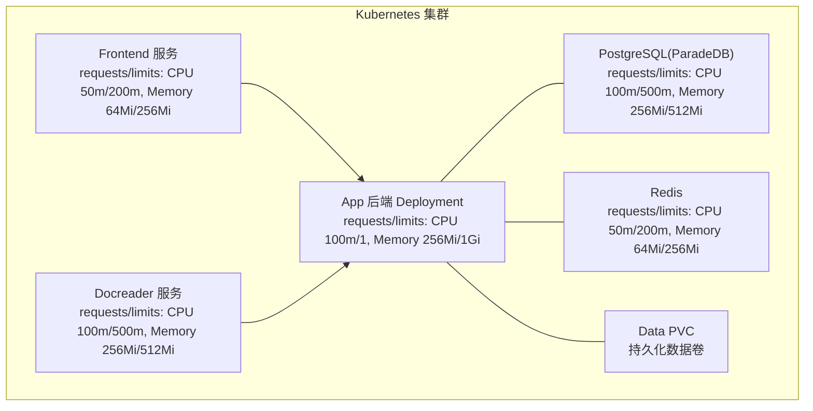
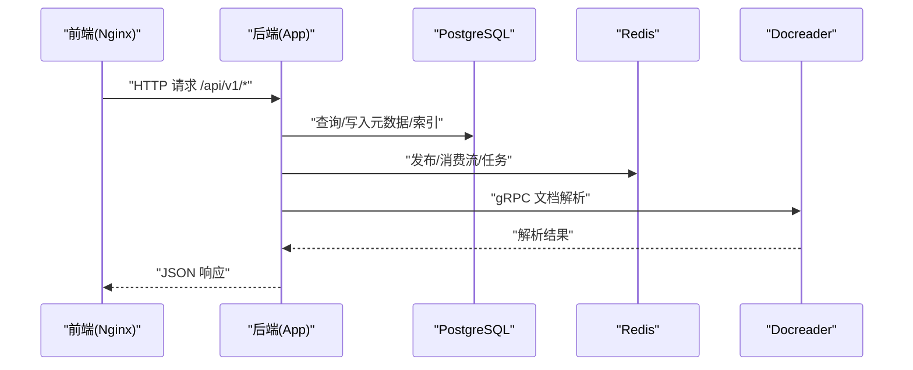
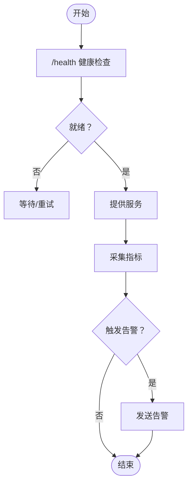
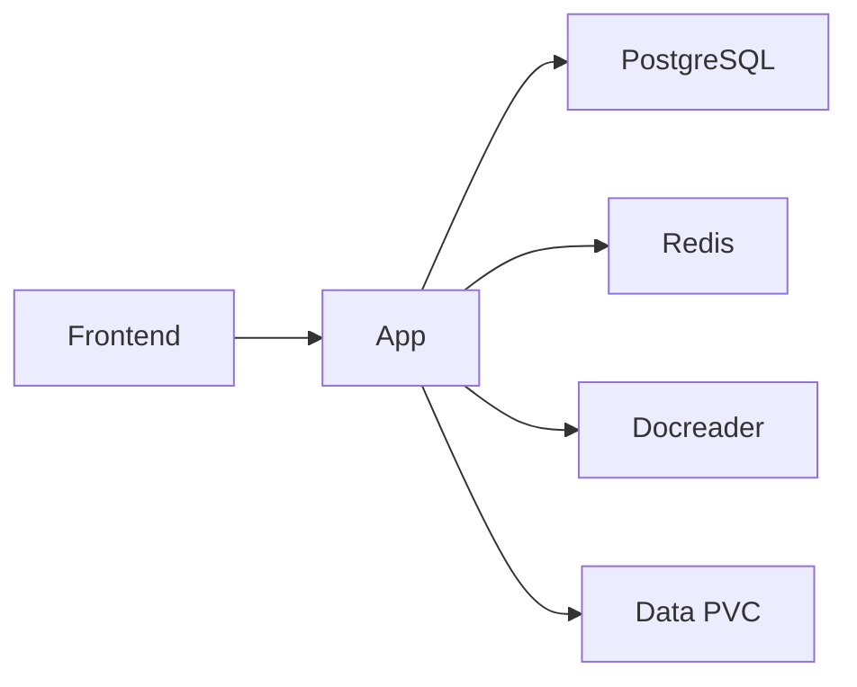

# 资源限制与优化

<cite>
**本文引用的文件**
- [values.yaml](file://helm/values.yaml)
- [app.yaml](file://helm/templates/app.yaml)
- [Dockerfile.docreader](file://docker/Dockerfile.docreader)
- [Dockerfile.sandbox](file://docker/Dockerfile.sandbox)
- [frontend/Dockerfile](file://frontend/Dockerfile)
- [main.go](file://cmd/server/main.go)
- [config.go](file://internal/config/config.go)
- [router.go](file://internal/router/router.go)
- [metric_hook.go](file://internal/application/service/metric_hook.go)
- [common.go](file://internal/application/service/metric/common.go)
- [docker-compose.yml](file://docker-compose.yml)
</cite>

## 目录
1. [简介](#简介)
2. [项目结构](#项目结构)
3. [核心组件](#核心组件)
4. [架构总览](#架构总览)
5. [详细组件分析](#详细组件分析)
6. [依赖分析](#依赖分析)
7. [性能考量](#性能考量)
8. [故障排查指南](#故障排查指南)
9. [结论](#结论)
10. [附录](#附录)

## 简介
本文件面向平台工程师，系统化梳理 WeKnora 在 Kubernetes 环境中的资源限制与优化配置策略，覆盖 CPU 与内存 requests/limits 的设定原则、不同工作负载（有状态/无状态）的资源分配差异、HPA/VPA 的配置思路、监控与告警（含 Prometheus 集成与自定义指标）、以及容器镜像与运行时配置的优化建议。文档以 Helm values 与模板为核心依据，并结合后端配置与运行时行为进行深入解读。

## 项目结构
WeKnora 采用 Helm Chart 管理多组件部署，核心组件包括：
- 后端 API 服务（App）
- 前端 Web UI
- 文档解析服务（Docreader）
- 数据库（PostgreSQL，ParadeDB）
- 缓存（Redis）
- 可选组件（Neo4j、MinIO、Jaeger 等）

图表来源
- [values.yaml:53-140](file://helm/values.yaml#L53-L140)
- [values.yaml:144-187](file://helm/values.yaml#L144-L187)
- [values.yaml:191-237](file://helm/values.yaml#L191-L237)
- [values.yaml:241-283](file://helm/values.yaml#L241-L283)
- [values.yaml:287-329](file://helm/values.yaml#L287-L329)

章节来源
- [values.yaml:53-140](file://helm/values.yaml#L53-L140)
- [values.yaml:144-187](file://helm/values.yaml#L144-L187)
- [values.yaml:191-237](file://helm/values.yaml#L191-L237)
- [values.yaml:241-283](file://helm/values.yaml#L241-L283)
- [values.yaml:287-329](file://helm/values.yaml#L287-L329)

## 核心组件
- App 后端：负责业务逻辑、会话、知识库、评估、系统初始化等 API。Helm 中定义了 CPU/内存 requests/limits、探针、安全上下文、环境变量等。
- Frontend：静态资源服务，通过 Nginx 提供 Web UI。
- Docreader：文档解析服务，提供 gRPC 接口，独立部署。
- PostgreSQL（ParadeDB）：向量检索与全文检索的后端存储。
- Redis：流与任务队列，支持内存与持久化。
- Data PVC：用于上传文件与临时解析输出的持久化存储。

章节来源
- [app.yaml:15-181](file://helm/templates/app.yaml#L15-L181)
- [values.yaml:53-140](file://helm/values.yaml#L53-L140)
- [values.yaml:144-187](file://helm/values.yaml#L144-L187)
- [values.yaml:191-237](file://helm/values.yaml#L191-L237)
- [values.yaml:241-283](file://helm/values.yaml#L241-L283)
- [values.yaml:287-329](file://helm/values.yaml#L287-L329)

## 架构总览
后端 App 作为核心协调者，通过环境变量连接数据库、缓存、文档解析服务，并挂载数据卷。Frontend 通过 Nginx 代理访问后端 API；Docreader 作为独立服务被后端调用；PostgreSQL 与 Redis 提供有状态数据支撑。

图表来源
- [docker-compose.yml:28-158](file://docker-compose.yml#L28-L158)
- [docker-compose.yml:173-199](file://docker-compose.yml#L173-L199)
- [docker-compose.yml:200-221](file://docker-compose.yml#L200-L221)
- [docker-compose.yml:222-227](file://docker-compose.yml#L222-L227)

章节来源
- [docker-compose.yml:28-158](file://docker-compose.yml#L28-L158)
- [docker-compose.yml:173-199](file://docker-compose.yml#L173-L199)
- [docker-compose.yml:200-221](file://docker-compose.yml#L200-L221)
- [docker-compose.yml:222-227](file://docker-compose.yml#L222-L227)

## 详细组件分析

### CPU 与内存 requests/limits 设定原则
- 保守的 requests：确保调度器认为 Pod 具备“最低可用”资源，避免频繁抢占与 OOM。
- 合理的 limits：防止突发流量导致资源挤占，保障集群稳定性。
- 有状态组件（数据库、缓存）通常 requests/limits 更高，且更关注内存稳定性。
- 无状态组件（App、Frontend、Docreader）requests 相对较低，可通过 HPA 基于 CPU/内存利用率弹性扩容。

章节来源
- [values.yaml:70-77](file://helm/values.yaml#L70-L77)
- [values.yaml:159-167](file://helm/values.yaml#L159-L167)
- [values.yaml:206-214](file://helm/values.yaml#L206-L214)
- [values.yaml:251-259](file://helm/values.yaml#L251-L259)
- [values.yaml:297-305](file://helm/values.yaml#L297-L305)

### 不同工作负载类型的资源分配策略
- 无状态应用（App、Frontend、Docreader）
  - 优先设置 requests，limits 留有余量，便于 HPA 弹性伸缩。
  - Frontend 作为静态服务，资源占用极低，requests 可进一步下调。
- 有状态应用（PostgreSQL、Redis）
  - requests/limits 更高，内存需稳定，避免抖动。
  - 需要持久化卷（PVC），并考虑备份与快照策略。
  - 建议单独节点亲和或隔离，避免与其他有状态组件互相影响。

章节来源
- [values.yaml:53-140](file://helm/values.yaml#L53-L140)
- [values.yaml:144-187](file://helm/values.yaml#L144-L187)
- [values.yaml:191-237](file://helm/values.yaml#L191-L237)
- [values.yaml:241-283](file://helm/values.yaml#L241-L283)
- [values.yaml:287-329](file://helm/values.yaml#L287-L329)

### 水平Pod自动扩缩容（HPA）配置思路
- 基于 CPU 使用率：适用于 CPU 密集型或请求量波动明显的场景。
- 基于内存使用率：适用于内存敏感型应用。
- 基于自定义指标：如每实例请求数、队列长度等。
- 配置要点：
  - 设置稳定的 requests，避免 HPA 误判。
  - 合理的最小/最大副本数，避免过度伸缩。
  - 结合 Pod 滚动更新策略（RollingUpdate）降低扩缩容对服务的影响。

章节来源
- [app.yaml:20-25](file://helm/templates/app.yaml#L20-L25)
- [values.yaml:57-58](file://helm/values.yaml#L57-L58)
- [values.yaml:148-149](file://helm/values.yaml#L148-L149)
- [values.yaml:195-196](file://helm/values.yaml#L195-L196)
- [values.yaml:242-243](file://helm/values.yaml#L242-L243)
- [values.yaml:288-289](file://helm/values.yaml#L288-L289)

### 垂直Pod自动扩缩容（VPA）配置思路
- 适用于 requests/limits 不明确或需要动态优化的场景。
- 建议先用 VPA 进行推荐，再将推荐值固化到 Deployment 的 requests/limits。
- 注意：VPA 不改变 Pod 的已有资源，需配合 Pod 重建生效。

章节来源
- [app.yaml:151-152](file://helm/templates/app.yaml#L151-L152)
- [values.yaml:68-77](file://helm/values.yaml#L68-L77)

### 资源监控与告警机制（Prometheus 集成与自定义指标）
- 健康检查端点：/health，用于存活与就绪探针。
- 自定义指标：项目内置检索与生成指标计算模块，可用于评估与监控。
- Prometheus 集成建议：
  - 将 /metrics 或自定义指标端点暴露为 Service，Prometheus 抓取。
  - 针对 App、Docreader、Frontend、数据库与缓存分别建立监控面板。
  - 告警规则：CPU/内存使用率阈值、Pod 重启频率、健康检查失败、数据库连接异常等。

图表来源
- [router.go:94-96](file://internal/router/router.go#L94-L96)
- [docker-compose.yml:44-49](file://docker-compose.yml#L44-L49)
- [docker-compose.yml:188-193](file://docker-compose.yml#L188-L193)

章节来源
- [router.go:94-96](file://internal/router/router.go#L94-L96)
- [docker-compose.yml:44-49](file://docker-compose.yml#L44-L49)
- [docker-compose.yml:188-193](file://docker-compose.yml#L188-L193)
- [metric_hook.go:18-50](file://internal/application/service/metric_hook.go#L18-L50)
- [common.go:39-99](file://internal/application/service/metric/common.go#L39-L99)

### 容器镜像优化与运行时配置
- 后端 App（Go）：二进制体积小，建议使用精简基础镜像，开启只读根文件系统与非 root 运行（如镜像支持）。
- 前端（Nginx）：静态资源体积小，注意最大上传大小与超时配置。
- Docreader（Python）：多阶段构建减少体积，仅保留必要运行时依赖，避免 OCR/VLM 依赖以降低资源占用。
- Sandbox（Python+Node）：多阶段构建，仅安装必要工具，使用非 root 用户执行。

章节来源
- [Dockerfile.docreader:1-158](file://docker/Dockerfile.docreader#L1-L158)
- [Dockerfile.sandbox:1-31](file://docker/Dockerfile.sandbox#L1-L31)
- [frontend/Dockerfile:1-43](file://frontend/Dockerfile#L1-L43)

### 运行时配置与优雅停机
- 后端通过信号处理实现优雅停机，关闭监听器、释放端口、清理资源。
- 配置 ShutdownTimeout，确保在扩缩容或滚动更新时有足够时间完成请求处理。

章节来源
- [main.go:72-110](file://cmd/server/main.go#L72-L110)
- [config.go:144-150](file://internal/config/config.go#L144-L150)

## 依赖分析
- App 依赖 PostgreSQL（数据库）、Redis（缓存）、Docreader（文档解析）、可选 Neo4j（知识图谱）。
- Frontend 依赖 App 提供的 API。
- Docreader 独立部署，通过 gRPC 与 App 交互。
- 数据持久化依赖 PVC（数据文件与数据库）。

图表来源
- [docker-compose.yml:2-158](file://docker-compose.yml#L2-L158)
- [docker-compose.yml:173-199](file://docker-compose.yml#L173-L199)
- [docker-compose.yml:200-221](file://docker-compose.yml#L200-L221)
- [docker-compose.yml:222-227](file://docker-compose.yml#L222-L227)

章节来源
- [docker-compose.yml:2-158](file://docker-compose.yml#L2-L158)
- [docker-compose.yml:173-199](file://docker-compose.yml#L173-L199)
- [docker-compose.yml:200-221](file://docker-compose.yml#L200-L221)
- [docker-compose.yml:222-227](file://docker-compose.yml#L222-L227)

## 性能考量
- 资源预留与限制：确保 requests 与 limits 合理，避免 OOM 与调度失败。
- HPA 与 VPA：结合业务特征选择合适的扩缩容策略，避免抖动。
- 存储与 IO：数据库与缓存的 IO 敏感度较高，建议使用高性能存储类与合适的 PVC 参数。
- 网络与延迟：Frontend 与 App 之间的网络延迟应尽量降低，必要时使用 Ingress/NLB。
- 日志与追踪：开启必要的日志与追踪（如 Jaeger），但注意控制采样率以避免额外开销。

## 故障排查指南
- 健康检查失败：检查 /health 端点与探针配置，确认数据库、缓存、Docreader 是否正常。
- Pod 频繁重启：检查 OOM、探针超时、配置错误等问题。
- 资源不足：观察 requests/limits 与实际使用，必要时提升 limits 或启用 HPA。
- 指标缺失：确认指标端点暴露与抓取配置，检查防火墙与 RBAC。

章节来源
- [router.go:94-96](file://internal/router/router.go#L94-L96)
- [docker-compose.yml:44-49](file://docker-compose.yml#L44-L49)
- [docker-compose.yml:188-193](file://docker-compose.yml#L188-L193)

## 结论
通过合理的 requests/limits 设定、针对不同工作负载的差异化资源策略、HPA/VPA 的弹性伸缩、完善的监控与告警体系，以及镜像与运行时的持续优化，WeKnora 可在 Kubernetes 环境中实现稳定、高效、可运维的资源管理。建议在生产环境中逐步引入 VPA 推荐值、完善自定义指标与告警规则，并结合业务峰值与 SLA 调整扩缩容策略。

## 附录
- 关键配置位置参考：
  - App 资源与探针：[values.yaml:68-131](file://helm/values.yaml#L68-L131)
  - Frontend 资源与服务：[values.yaml:159-187](file://helm/values.yaml#L159-L187)
  - Docreader 资源与服务：[values.yaml:206-237](file://helm/values.yaml#L206-L237)
  - PostgreSQL 资源与持久化：[values.yaml:251-283](file://helm/values.yaml#L251-L283)
  - Redis 资源与持久化：[values.yaml:297-329](file://helm/values.yaml#L297-L329)
  - 健康检查与路由：[router.go:94-96](file://internal/router/router.go#L94-L96)
  - 优雅停机与信号处理：[main.go:72-110](file://cmd/server/main.go#L72-L110)
  - 指标计算与聚合：[metric_hook.go:18-82](file://internal/application/service/metric_hook.go#L18-L82)