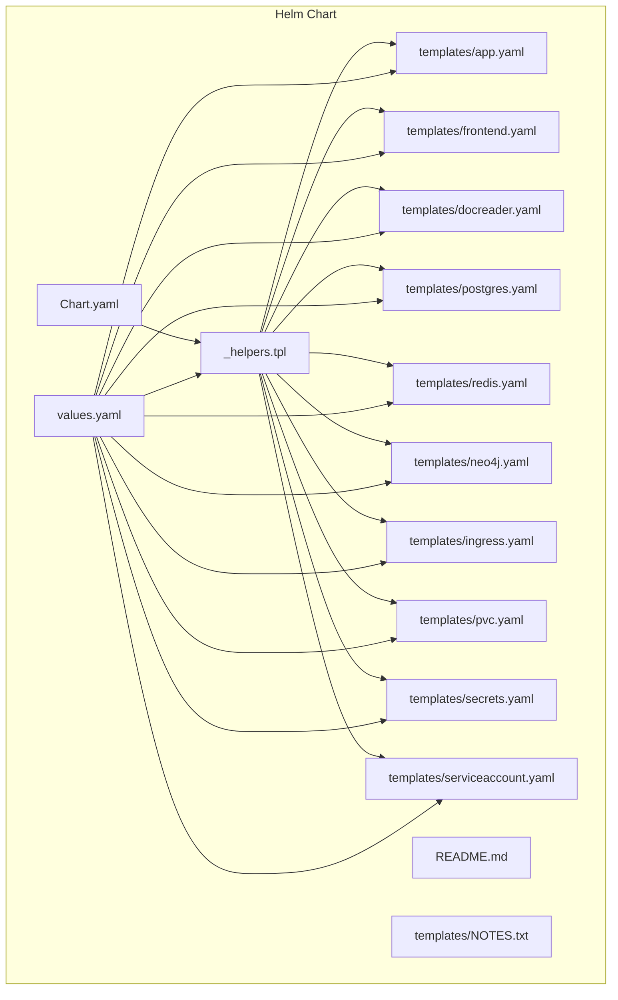
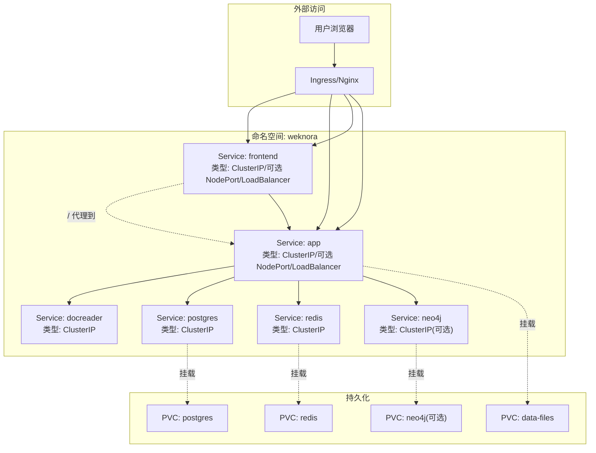
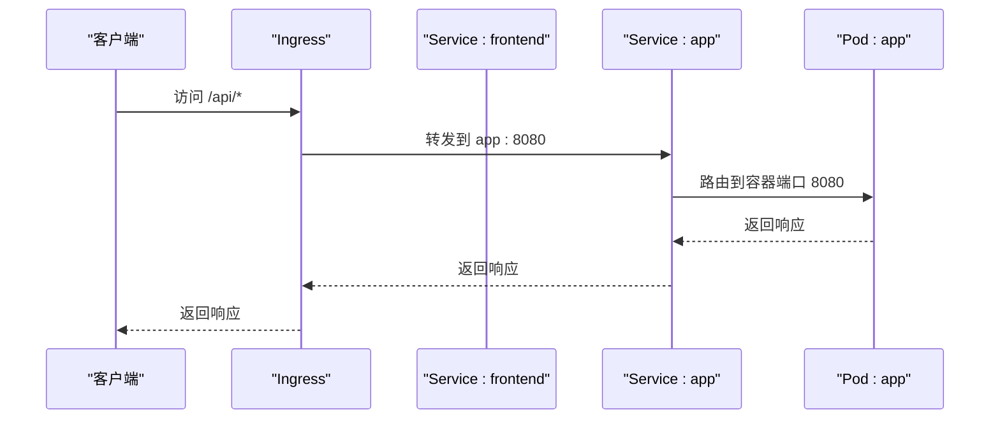
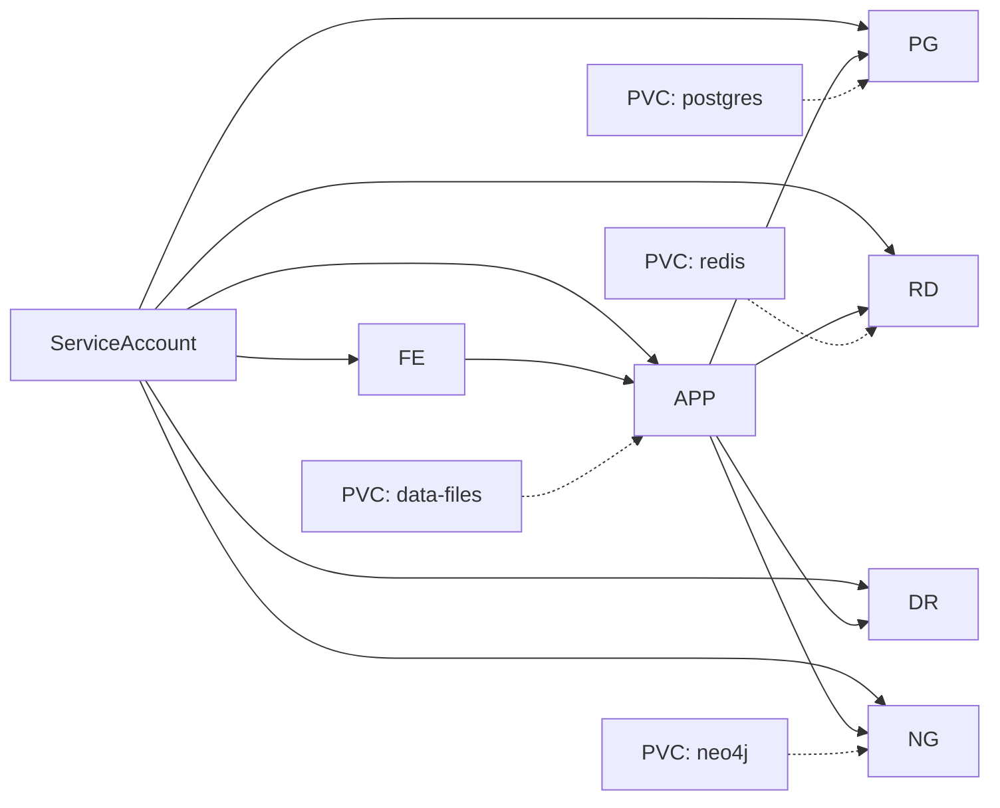

# Kubernetes部署

<cite>
**本文引用的文件**   
- [Chart.yaml](file://helm/Chart.yaml)
- [values.yaml](file://helm/values.yaml)
- [README.md](file://helm/README.md)
- [_helpers.tpl](file://helm/templates/_helpers.tpl)
- [app.yaml](file://helm/templates/app.yaml)
- [frontend.yaml](file://helm/templates/frontend.yaml)
- [docreader.yaml](file://helm/templates/docreader.yaml)
- [postgres.yaml](file://helm/templates/postgres.yaml)
- [redis.yaml](file://helm/templates/redis.yaml)
- [neo4j.yaml](file://helm/templates/neo4j.yaml)
- [ingress.yaml](file://helm/templates/ingress.yaml)
- [pvc.yaml](file://helm/templates/pvc.yaml)
- [secrets.yaml](file://helm/templates/secrets.yaml)
- [serviceaccount.yaml](file://helm/templates/serviceaccount.yaml)
- [NOTES.txt](file://helm/templates/NOTES.txt)
</cite>

## 目录
1. [简介](#简介)
2. [项目结构](#项目结构)
3. [核心组件](#核心组件)
4. [架构总览](#架构总览)
5. [详细组件分析](#详细组件分析)
6. [依赖关系分析](#依赖关系分析)
7. [性能与可扩展性](#性能与可扩展性)
8. [故障排查指南](#故障排查指南)
9. [结论](#结论)
10. [附录：Values参数与最佳实践](#附录values参数与最佳实践)

## 简介
本文件为 WeKnora 在 Kubernetes 上的 Helm 部署与运维指南，覆盖 Helm Chart 的配置结构、Values 参数、模板渲染机制，以及 Deployment、Service、Ingress 等资源对象的配置策略。文档同时提供 NodePort、LoadBalancer、ClusterIP 等 Service 类型的部署方案建议，涵盖副本数、滚动更新策略、Pod 资源限制、持久化（PVC）、Secrets、ConfigMap 的使用方式，并给出集群内服务发现、网络策略与安全配置思路，以及监控、日志与告警的集成建议。目标读者为云原生工程师与平台团队。

## 项目结构
WeKnora 的 Helm Chart 位于 helm 目录，采用“按组件拆分模板”的结构，便于维护与复用。关键文件包括：
- Chart.yaml：Chart 元数据与版本信息
- values.yaml：默认配置与参数说明
- README.md：安装、配置、升级与故障排查指引
- templates/_helpers.tpl：命名、标签、镜像、存储类等通用模板函数
- 各组件模板：app.yaml、frontend.yaml、docreader.yaml、postgres.yaml、redis.yaml、neo4j.yaml、ingress.yaml、pvc.yaml、secrets.yaml、serviceaccount.yaml
- NOTES.txt：安装后提示信息

**图表来源**
- [Chart.yaml](file://helm/Chart.yaml)
- [values.yaml](file://helm/values.yaml)
- [_helpers.tpl](file://helm/templates/_helpers.tpl)
- [app.yaml](file://helm/templates/app.yaml)
- [frontend.yaml](file://helm/templates/frontend.yaml)
- [docreader.yaml](file://helm/templates/docreader.yaml)
- [postgres.yaml](file://helm/templates/postgres.yaml)
- [redis.yaml](file://helm/templates/redis.yaml)
- [neo4j.yaml](file://helm/templates/neo4j.yaml)
- [ingress.yaml](file://helm/templates/ingress.yaml)
- [pvc.yaml](file://helm/templates/pvc.yaml)
- [secrets.yaml](file://helm/templates/secrets.yaml)
- [serviceaccount.yaml](file://helm/templates/serviceaccount.yaml)
- [NOTES.txt](file://helm/templates/NOTES.txt)

**章节来源**
- [Chart.yaml](file://helm/Chart.yaml)
- [values.yaml](file://helm/values.yaml)
- [README.md](file://helm/README.md)

## 核心组件
WeKnora Helm Chart 默认启用以下核心组件：
- 应用后端（App）：Go/Gin 编写的 API 服务，负责业务逻辑、检索驱动、流式任务队列、文件存储等
- 前端（UI）：Nginx 托管的 Vue.js Web UI
- 文档解析器（Docreader）：gRPC 服务，提供文档解析能力
- 数据库（PostgreSQL/ParadeDB）：提供向量检索与 BM25 混合搜索
- 缓存（Redis）：用于流式管理与异步任务队列
- 可选组件：MinIO（S3兼容存储）、Neo4j（知识图谱）、Qdrant（向量数据库）、Jaeger（分布式追踪）

各组件通过 Kubernetes Service 实现内部通信，前端通过 Nginx 将 /api 路由到后端，/ 路由到前端；可选 Ingress 对外暴露服务。

**章节来源**
- [values.yaml](file://helm/values.yaml)
- [app.yaml](file://helm/templates/app.yaml)
- [frontend.yaml](file://helm/templates/frontend.yaml)
- [docreader.yaml](file://helm/templates/docreader.yaml)
- [postgres.yaml](file://helm/templates/postgres.yaml)
- [redis.yaml](file://helm/templates/redis.yaml)
- [neo4j.yaml](file://helm/templates/neo4j.yaml)
- [ingress.yaml](file://helm/templates/ingress.yaml)
- [pvc.yaml](file://helm/templates/pvc.yaml)
- [secrets.yaml](file://helm/templates/secrets.yaml)
- [serviceaccount.yaml](file://helm/templates/serviceaccount.yaml)

## 架构总览
下图展示 WeKnora 在 Kubernetes 中的典型部署拓扑与流量路径：

**图表来源**
- [ingress.yaml](file://helm/templates/ingress.yaml)
- [frontend.yaml](file://helm/templates/frontend.yaml)
- [app.yaml](file://helm/templates/app.yaml)
- [docreader.yaml](file://helm/templates/docreader.yaml)
- [postgres.yaml](file://helm/templates/postgres.yaml)
- [redis.yaml](file://helm/templates/redis.yaml)
- [neo4j.yaml](file://helm/templates/neo4j.yaml)
- [pvc.yaml](file://helm/templates/pvc.yaml)

## 详细组件分析

### Helm Chart 元数据与模板助手
- Chart.yaml：定义 Chart 名称、版本、应用版本、Kubernetes 版本要求、图标与关键词等
- _helpers.tpl：提供命名规范、标签体系、镜像拼接、存储类处理、安全上下文合并等通用函数，被各组件模板复用

这些模板函数确保了：
- 组件名称与实例名一致，避免冲突
- 标签遵循推荐规范，便于选择器匹配
- 镜像仓库与标签拼装统一
- 存储类与 PVC 创建逻辑一致

**章节来源**
- [Chart.yaml](file://helm/Chart.yaml)
- [_helpers.tpl](file://helm/templates/_helpers.tpl)

### 应用后端（App）
- Deployment：副本数可配置，默认 1；滚动更新策略为最大并发 1，不可用为 0，保证升级期间服务连续性
- Service：默认 ClusterIP，端口 8080；可通过 values 调整为 NodePort 或 LoadBalancer
- 探针：HTTP 探针 /health，分别配置启动延迟、周期、超时与失败阈值
- 安全上下文：默认允许非 root 用户运行，禁用特权提升
- 环境变量：数据库、Redis、JWT、存储类型、并发池大小、是否启用 GraphRAG 等
- 卷挂载：/data/files，支持 PVC 或 emptyDir
- 资源请求/限制：CPU 与内存配额可调

**图表来源**
- [ingress.yaml](file://helm/templates/ingress.yaml)
- [app.yaml](file://helm/templates/app.yaml)

**章节来源**
- [app.yaml](file://helm/templates/app.yaml)
- [values.yaml](file://helm/values.yaml)

### 前端（UI）
- Deployment：副本数可配置，默认 1；滚动更新策略同上
- Service：默认 ClusterIP，端口 80；Nginx 配置需要写入缓存目录，因此挂载 emptyDir
- 探针：HTTP 探针 /
- 环境变量：APP_HOST/APP_PORT 指向后端服务
- 资源请求/限制：CPU 与内存配额可调

**章节来源**
- [frontend.yaml](file://helm/templates/frontend.yaml)
- [values.yaml](file://helm/values.yaml)

### 文档解析器（Docreader）
- Deployment：副本数可配置，默认 1；滚动更新策略同上
- Service：默认 ClusterIP，端口 50051（gRPC）
- 探针：grpc_health_probe 健康检查
- 环境变量：存储类型等
- 资源请求/限制：CPU 与内存配额可调

**章节来源**
- [docreader.yaml](file://helm/templates/docreader.yaml)
- [values.yaml](file://helm/values.yaml)

### 数据库（PostgreSQL/ParadeDB）
- Deployment：副本 1；重建策略（Recreate），避免数据损坏
- Service：ClusterIP，端口 5432
- 探针：pg_isready
- 环境变量：POSTGRES_USER/PASSWORD/DB，PGDATA
- 卷：/var/lib/postgresql/data，支持 PVC 或 emptyDir
- 资源请求/限制：CPU 与内存配额可调

**章节来源**
- [postgres.yaml](file://helm/templates/postgres.yaml)
- [values.yaml](file://helm/values.yaml)

### 缓存（Redis）
- Deployment：副本 1；重建策略（Recreate）
- Service：ClusterIP，端口 6379
- 探针：redis-cli ping
- 命令行参数：requirepass、appendonly、dir
- 环境变量：REDIS_PASSWORD
- 卷：/data，支持 PVC 或 emptyDir
- 资源请求/限制：CPU 与内存配额可调

**章节来源**
- [redis.yaml](file://helm/templates/redis.yaml)
- [values.yaml](file://helm/values.yaml)

### 可选组件：Neo4j（知识图谱）
- Deployment：副本 1；重建策略（Recreate）
- Service：ClusterIP，端口 7474（HTTP）、7687（Bolt）
- 探针：HTTP /
- 环境变量：NEO4J_PASSWORD、NEO4J_AUTH、APOC 插件配置、禁用严格校验以避免与 K8s 注入环境冲突
- 卷：/data，支持 PVC 或 emptyDir
- 资源请求/限制：CPU 与内存配额可调

**章节来源**
- [neo4j.yaml](file://helm/templates/neo4j.yaml)
- [values.yaml](file://helm/values.yaml)

### Ingress
- 支持启用/禁用；可配置类名、主机名、TLS 与注解
- 路由规则：/api 前缀转发至 app；/ 路由转发至 frontend
- 注解示例：代理体大小、连接/读取/发送超时等

**章节来源**
- [ingress.yaml](file://helm/templates/ingress.yaml)
- [values.yaml](file://helm/values.yaml)

### PVC（持久卷声明）
- 自动生成 PostgreSQL、Redis、Neo4j、数据文件（/data/files）的 PVC
- 支持指定存储类、容量与复用现有 PVC

**章节来源**
- [pvc.yaml](file://helm/templates/pvc.yaml)
- [values.yaml](file://helm/values.yaml)

### Secrets（密钥）
- 默认在安装时创建包含数据库、Redis、JWT、AES 密钥等的 Secret
- 生产环境建议使用外部密钥管理（如 External Secrets Operator、Sealed Secrets）或提供已存在的 Secret
- Neo4j 启用时会注入用户名/密码

**章节来源**
- [secrets.yaml](file://helm/templates/secrets.yaml)
- [values.yaml](file://helm/values.yaml)

### ServiceAccount
- 可创建独立 ServiceAccount 并控制自动挂载 Token 行为
- 适用于 RBAC 最小权限场景

**章节来源**
- [serviceaccount.yaml](file://helm/templates/serviceaccount.yaml)
- [values.yaml](file://helm/values.yaml)

## 依赖关系分析
- 组件间依赖
  - app 依赖 postgres、redis、docreader（可选 neo4j）
  - frontend 依赖 app
  - 可选组件（minio、neo4j、qdrant、jaeger）按需启用
- 服务发现
  - 各组件通过稳定 Service 名称进行内部 DNS 解析
  - app 通过固定 Service 名称访问 postgres、redis、docreader、neo4j（当启用时）
- 模板耦合
  - _helpers.tpl 提供统一命名、标签、镜像与存储类逻辑，降低重复与出错概率

**图表来源**
- [serviceaccount.yaml](file://helm/templates/serviceaccount.yaml)
- [app.yaml](file://helm/templates/app.yaml)
- [frontend.yaml](file://helm/templates/frontend.yaml)
- [docreader.yaml](file://helm/templates/docreader.yaml)
- [postgres.yaml](file://helm/templates/postgres.yaml)
- [redis.yaml](file://helm/templates/redis.yaml)
- [neo4j.yaml](file://helm/templates/neo4j.yaml)
- [pvc.yaml](file://helm/templates/pvc.yaml)

**章节来源**
- [app.yaml](file://helm/templates/app.yaml)
- [frontend.yaml](file://helm/templates/frontend.yaml)
- [docreader.yaml](file://helm/templates/docreader.yaml)
- [postgres.yaml](file://helm/templates/postgres.yaml)
- [redis.yaml](file://helm/templates/redis.yaml)
- [neo4j.yaml](file://helm/templates/neo4j.yaml)
- [pvc.yaml](file://helm/templates/pvc.yaml)

## 性能与可扩展性
- 副本数与资源
  - app、frontend、docreader 均支持多副本；建议根据负载与 CPU/内存配额调整副本数
  - 数据库与缓存默认单副本，若需高可用，应结合外部托管或主从架构（本 Chart 默认单副本）
- 滚动更新策略
  - app、frontend、docreader 使用 maxSurge=1、maxUnavailable=0，确保升级过程不中断
- 存储与 IO
  - PostgreSQL/Redis/Neo4j/数据文件均支持 PVC；生产建议使用高性能存储类并设置合理容量
- 网络与 Ingress
  - Ingress 注解可优化代理超时与缓冲区大小；根据上传/下载需求调整代理体大小
- LLM 外部集成
  - 通过 app.extraEnv 注入外部 LLM（如 Ollama）地址与模型名，实现弹性扩展

**章节来源**
- [values.yaml](file://helm/values.yaml)
- [app.yaml](file://helm/templates/app.yaml)
- [frontend.yaml](file://helm/templates/frontend.yaml)
- [docreader.yaml](file://helm/templates/docreader.yaml)
- [postgres.yaml](file://helm/templates/postgres.yaml)
- [redis.yaml](file://helm/templates/redis.yaml)
- [neo4j.yaml](file://helm/templates/neo4j.yaml)
- [ingress.yaml](file://helm/templates/ingress.yaml)

## 故障排查指南
- 常见问题定位
  - Pod 处于 Pending：检查 PVC 是否绑定、存储类是否存在
  - 连接被拒绝：等待所有 Pod 就绪，检查 Service Endpoints
  - 数据库连接错误：核对 Secret 内容与数据库日志
- 日志与状态
  - 查看 Pod 列表与日志
  - 安装后 NOTES 提示中包含常用命令与访问方式
- 升级与卸载
  - 升级：使用 helm upgrade 并复用已有 values
  - 卸载：helm uninstall；可选删除 PVC

**章节来源**
- [README.md](file://helm/README.md)
- [NOTES.txt](file://helm/templates/NOTES.txt)

## 结论
WeKnora 的 Helm Chart 提供了开箱即用的多组件编排方案，具备清晰的模板分层与参数化配置。通过合理的副本数、资源配额、滚动更新策略与持久化设计，可在 Kubernetes 上稳定运行。建议在生产环境中配合外部密钥管理、Ingress 控制器与监控/日志/告警体系，进一步提升安全性与可观测性。

## 附录：Values 参数与最佳实践

### Values 参数总览与说明
- 全局参数
  - storageClass：PVC 存储类；设为 "-" 使用集群默认
  - imagePullSecrets：私有镜像仓库凭据
  - podSecurityContext/containerSecurityContext：全局安全上下文
- ServiceAccount
  - create/name/annotations/labels/automountServiceAccountToken：RBAC 与最小权限
- App（后端）
  - enabled、replicaCount、image、resources、env、extraEnv、service、probes、nodeSelector/affinity/tolerations
- Frontend（UI）
  - enabled、replicaCount、image、resources、service、probes、nodeSelector/affinity/tolerations
- Docreader（gRPC）
  - enabled、replicaCount、image、resources、env、service、probes、nodeSelector/affinity/tolerations
- PostgreSQL（ParadeDB）
  - enabled、image、resources、securityContext、persistence、nodeSelector/affinity/tolerations
- Redis
  - enabled、image、resources、securityContext、persistence、nodeSelector/affinity/tolerations
- Data Files（/data/files）
  - persistence.enabled、size、existingClaim
- Ingress
  - enabled、className、host、tls.enabled、tls.secretName、annotations
- Secrets
  - dbUser/dbPassword/dbName、redisUsername/redisPassword、jwtSecret、tenantAesKey、systemAesKey、existingSecret
- 可选组件
  - minio.enabled、neo4j.enabled、qdrant.enabled、jaeger.enabled；各组件均有对应 image、persistence、resources 等

**章节来源**
- [values.yaml](file://helm/values.yaml)

### Service 类型部署方案建议
- ClusterIP（默认）
  - 仅集群内部访问，适合与 Ingress/LoadBalancer 配合
- NodePort
  - 通过节点端口暴露服务，适合测试或边缘环境
- LoadBalancer
  - 由云厂商负载均衡器分配公网 IP，适合直接对外暴露

注意：Service 类型在各组件的 service.type 字段中配置，Frontend 与 App 均支持该字段。

**章节来源**
- [values.yaml](file://helm/values.yaml)
- [frontend.yaml](file://helm/templates/frontend.yaml)
- [app.yaml](file://helm/templates/app.yaml)

### Pod 资源限制、副本数与滚动更新
- 资源请求/限制：在各组件 resources 下配置
- 副本数：各组件 replicaCount
- 滚动更新：strategy 使用 RollingUpdate，maxSurge=1、maxUnavailable=0，确保升级无损

**章节来源**
- [app.yaml](file://helm/templates/app.yaml)
- [frontend.yaml](file://helm/templates/frontend.yaml)
- [docreader.yaml](file://helm/templates/docreader.yaml)

### ConfigMap、Secret 与 PersistentVolume 使用
- ConfigMap：本 Chart 未显式生成 ConfigMap；如需注入配置，可自行创建并在 Pod 中挂载
- Secret：通过 secrets.yaml 生成或使用 existingSecret；生产务必使用外部密钥管理
- PersistentVolume：通过 pvc.yaml 生成或复用 existingClaim；建议为数据库与缓存开启持久化

**章节来源**
- [secrets.yaml](file://helm/templates/secrets.yaml)
- [pvc.yaml](file://helm/templates/pvc.yaml)
- [values.yaml](file://helm/values.yaml)

### 集群内服务发现、网络策略与安全
- 服务发现：通过稳定 Service 名称（如 app、frontend、postgres、redis、docreader、neo4j）进行 DNS 解析
- 网络策略：建议在生产环境启用 NetworkPolicy，限制入站/出站流量
- 安全：启用非 root、只读根文件系统（如镜像支持）、丢弃多余 capability、使用 seccomp

**章节来源**
- [app.yaml](file://helm/templates/app.yaml)
- [frontend.yaml](file://helm/templates/frontend.yaml)
- [postgres.yaml](file://helm/templates/postgres.yaml)
- [redis.yaml](file://helm/templates/redis.yaml)
- [neo4j.yaml](file://helm/templates/neo4j.yaml)
- [values.yaml](file://helm/values.yaml)

### 监控、日志与告警集成建议
- 监控：Prometheus Exporter（如应用自带指标端点）、自定义探针与告警规则
- 日志：集中采集（如 Fluent Bit/Fluentd）、结构化输出、日志轮转
- 告警：基于阈值与异常模式（如 Pod 重启率、探针失败率、磁盘/内存使用率）触发
- 本 Chart 未内置监控/日志/告警组件，建议通过独立 Helm Chart 或 GitOps 工具链集成

[本节为通用实践建议，不直接分析具体文件]