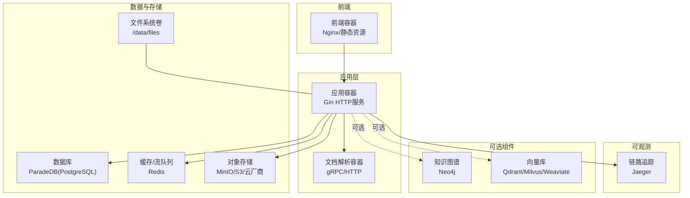
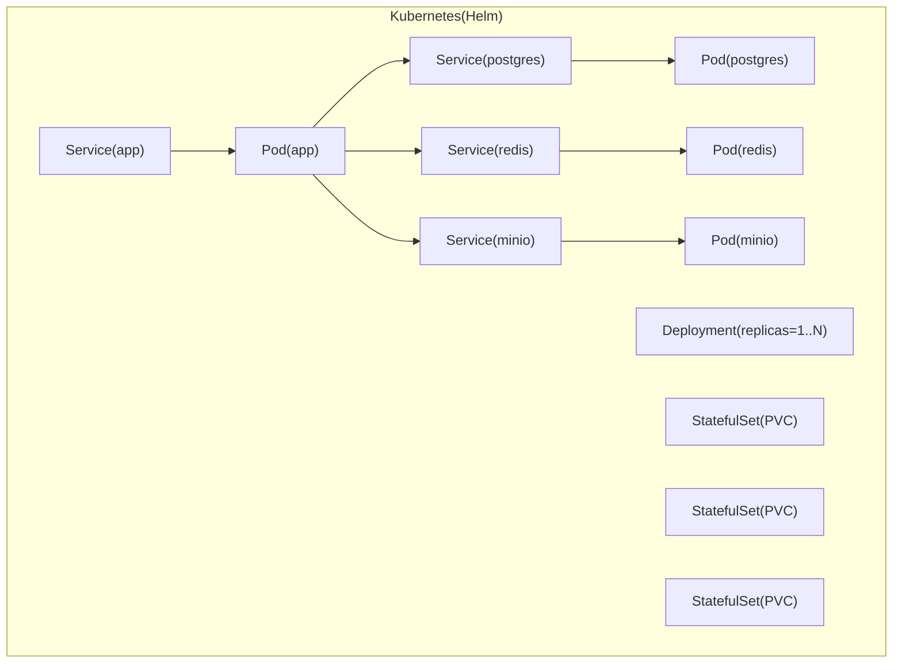
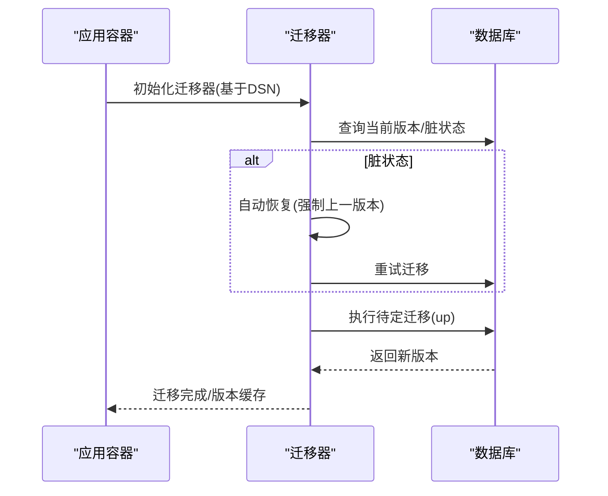
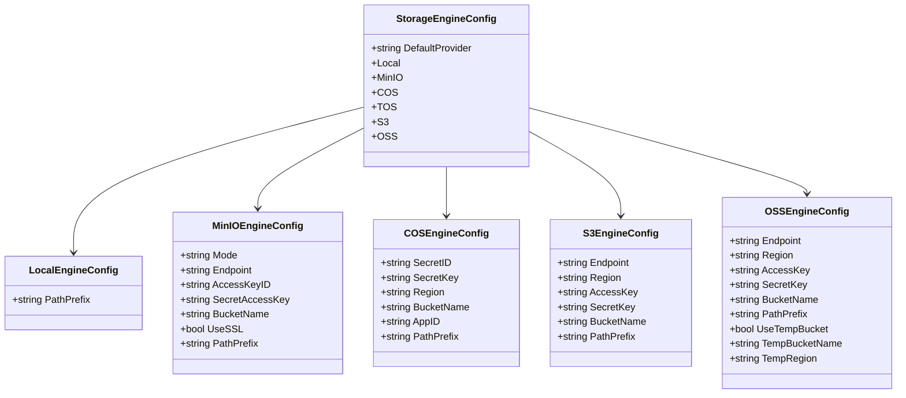
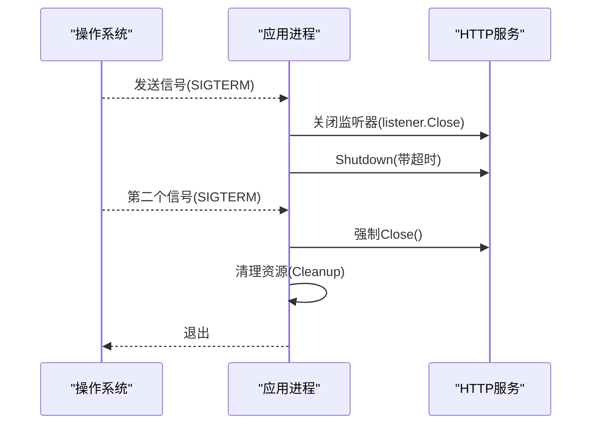
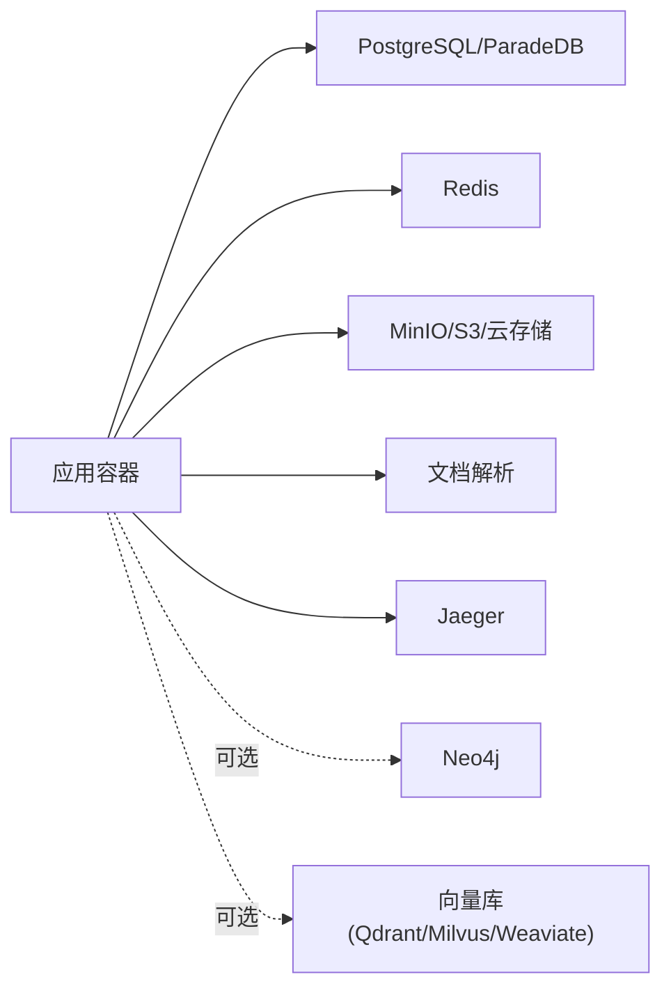

# 备份恢复与高可用

<cite>
**本文引用的文件**
- [docker-compose.yml](file://docker-compose.yml)
- [values.yaml](file://helm/values.yaml)
- [main.go](file://cmd/server/main.go)
- [config.go](file://internal/config/config.go)
- [config.yaml](file://config/config.yaml)
- [migration.go](file://internal/database/migration.go)
- [migrate.sh](file://scripts/migrate.sh)
- [tenant.go](file://internal/types/tenant.go)
- [storage.py](file://docreader/parser/storage.py)
- [start_all.sh](file://scripts/start_all.sh)
- [weknora-lite.service](file://deploy/weknora-lite.service)
</cite>

## 目录
1. [简介](#简介)
2. [项目结构](#项目结构)
3. [核心组件](#核心组件)
4. [架构总览](#架构总览)
5. [详细组件分析](#详细组件分析)
6. [依赖分析](#依赖分析)
7. [性能考虑](#性能考虑)
8. [故障排查指南](#故障排查指南)
9. [结论](#结论)
10. [附录](#附录)

## 简介
本文件面向运维团队，提供WeKnora的备份恢复与高可用运维指导。内容覆盖：
- 数据备份策略：数据库、对象存储、配置文件
- 灾难恢复计划、故障切换机制与数据一致性保障
- 高可用架构设计、主从复制与集群故障转移
- 滚动更新、蓝绿部署与金丝雀发布实践
- 容量规划、性能调优与成本优化建议
- 备份验证、恢复测试与业务连续性保障

## 项目结构
WeKnora采用多组件协作架构：应用服务、文档解析服务、数据库（ParadeDB）、缓存（Redis）、对象存储（MinIO/S3兼容）、可观测性（Jaeger）以及可选的知识图谱（Neo4j）与向量库（Qdrant/Milvus/Weaviate）。部署形态支持Docker Compose与Helm。

图表来源
- [docker-compose.yml:1-613](file://docker-compose.yml#L1-L613)
- [values.yaml:50-493](file://helm/values.yaml#L50-L493)

章节来源
- [docker-compose.yml:1-613](file://docker-compose.yml#L1-L613)
- [values.yaml:50-493](file://helm/values.yaml#L50-L493)

## 核心组件
- 应用服务：HTTP API、健康检查、优雅停机、信号处理
- 数据库：ParadeDB（PostgreSQL兼容），支持迁移与版本控制
- 缓存与流队列：Redis，支持持久化与任务队列
- 对象存储：MinIO（S3兼容），支持多种云厂商对象存储
- 文档解析：独立容器，支持gRPC/HTTP
- 可观测：Jaeger链路追踪
- 可选：Neo4j（知识图谱）、Qdrant/Milvus/Weaviate（向量库）

章节来源
- [docker-compose.yml:28-171](file://docker-compose.yml#L28-L171)
- [values.yaml:50-493](file://helm/values.yaml#L50-L493)
- [main.go:43-124](file://cmd/server/main.go#L43-L124)
- [migration.go:39-208](file://internal/database/migration.go#L39-L208)

## 架构总览
WeKnora在Docker Compose中以服务形式编排，应用容器通过环境变量连接数据库、缓存、对象存储与文档解析服务。Helm Chart提供Kubernetes部署能力，定义副本数、资源限制、探针与持久化卷。

图表来源
- [values.yaml:50-493](file://helm/values.yaml#L50-L493)

章节来源
- [values.yaml:50-493](file://helm/values.yaml#L50-L493)

## 详细组件分析

### 数据库与迁移（PostgreSQL/ParadeDB）
- 运行时迁移：应用启动时执行数据库迁移，支持脏状态自动恢复与强制回滚
- 迁移工具：golang-migrate，支持PostgreSQL与SQLite3
- 迁移脚本：版本化迁移位于migrations/versioned，初始化脚本位于migrations/sqlite与paradedb
- 健康检查：PostgreSQL容器健康检查，确保启动完成

图表来源
- [migration.go:39-208](file://internal/database/migration.go#L39-L208)
- [migrate.sh:26-120](file://scripts/migrate.sh#L26-L120)

章节来源
- [migration.go:39-208](file://internal/database/migration.go#L39-L208)
- [migrate.sh:26-120](file://scripts/migrate.sh#L26-L120)
- [docker-compose.yml:200-221](file://docker-compose.yml#L200-L221)

### 对象存储与文件存储
- 存储引擎配置：支持local、MinIO、COS、TOS、S3、OSS
- 配置项：默认提供者、Endpoint、Region、AccessKey、SecretKey、BucketName、PathPrefix、SSL开关
- 文档解析存储：OSS实现示例，展示桶初始化与错误处理

图表来源
- [tenant.go:390-478](file://internal/types/tenant.go#L390-L478)

章节来源
- [tenant.go:390-478](file://internal/types/tenant.go#L390-L478)
- [storage.py:237-265](file://docreader/parser/storage.py#L237-L265)

### 缓存与流队列（Redis）
- 用途：流管理器、任务队列、分布式锁与限流
- 配置：地址、用户名、密码、DB索引、键前缀、TTL
- Helm：定义副本、持久化卷与探针

章节来源
- [config.go:312-327](file://internal/config/config.go#L312-L327)
- [values.yaml:287-329](file://helm/values.yaml#L287-L329)

### 应用服务（优雅停机与健康检查）
- 健康检查：/health端点，容器级别健康检查
- 优雅停机：捕获信号，关闭监听器，执行资源清理，支持二次信号强制退出
- 信号处理：统一的优雅关闭流程，确保流量切换期间无损

图表来源
- [main.go:72-110](file://cmd/server/main.go#L72-L110)

章节来源
- [main.go:43-124](file://cmd/server/main.go#L43-L124)

### 配置与提示词模板
- 配置加载：Viper解析YAML，支持环境变量注入与模板ID解析
- 提示词模板：从目录加载，支持多语言与默认模板选择

章节来源
- [config.go:341-438](file://internal/config/config.go#L341-L438)
- [config.yaml:1-113](file://config/config.yaml#L1-L113)

## 依赖分析
- 组件耦合
  - 应用容器依赖数据库、缓存、对象存储、文档解析服务
  - Helm部署通过Service名称硬编码引用，要求命名一致（如postgres、redis、minio）
- 外部依赖
  - golang-migrate用于数据库迁移
  - Docker Compose/Helm用于编排
  - 可选组件（Neo4j、向量库）按需启用

图表来源
- [docker-compose.yml:28-171](file://docker-compose.yml#L28-L171)
- [values.yaml:50-493](file://helm/values.yaml#L50-L493)

章节来源
- [docker-compose.yml:28-171](file://docker-compose.yml#L28-L171)
- [values.yaml:50-493](file://helm/values.yaml#L50-L493)

## 性能考虑
- 资源配额：Helm Values中为各组件设置requests/limits，建议结合监控指标调整
- 存储I/O：对象存储与数据库均使用PVC，注意存储类与IOPS性能
- 缓存命中：合理设置Redis TTL与键前缀，避免键冲突
- 迁移性能：大表迁移时建议离峰执行，关注锁竞争与索引重建

## 故障排查指南
- 数据库迁移失败
  - 症状：启动时报脏状态或迁移中断
  - 处理：启用AutoRecoverDirty或使用脚本强制版本，再重启应用
- 对象存储连接异常
  - 症状：上传/下载失败、桶不存在
  - 处理：核对Endpoint/Region/AccessKey/SecretKey/BucketName，确认网络可达
- 缓存不可用
  - 症状：任务堆积、限流失效
  - 处理：检查Redis健康检查、密码、网络连通性
- 应用无法启动
  - 症状：健康检查失败、优雅停机异常
  - 处理：查看日志，确认信号处理与资源清理流程

章节来源
- [migration.go:110-187](file://internal/database/migration.go#L110-L187)
- [migrate.sh:95-120](file://scripts/migrate.sh#L95-L120)
- [tenant.go:390-478](file://internal/types/tenant.go#L390-L478)
- [main.go:72-110](file://cmd/server/main.go#L72-L110)

## 结论
WeKnora提供了完善的多组件架构与运维工具链。通过合理的备份策略、迁移与健康检查机制、以及可选的高可用组件，可在单机与Kubernetes环境中实现稳定可靠的备份恢复与高可用运行。

## 附录

### 备份策略清单
- 数据库备份
  - 方案：逻辑备份（SQL导出）+物理备份（PVC快照）
  - 频率：每日增量 + 周/月全量
  - 存储：异地对象存储归档
- 对象存储备份
  - 方案：跨区域复制或生命周期策略
  - 验证：定期校验桶内对象完整性
- 配置文件备份
  - 方案：版本化管理（Git）+ 密钥安全存储
  - 验证：配置变更审计与回滚演练

### 灾难恢复计划
- RTO/RPO目标：依据业务SLA设定
- 恢复步骤：
  - 评估影响范围与数据丢失量
  - 恢复数据库与对象存储至最近可用版本
  - 重建应用与依赖服务，执行健康检查
  - 验证业务功能与数据一致性
- 通知与升级：按预案触发沟通与升级流程

### 高可用与故障切换
- Kubernetes部署：通过replicas与滚动更新实现高可用
- 故障切换：利用探针与滚动更新，确保流量平滑切换
- 数据一致性：迁移阶段避免写入，或使用只读副本

### 滚动更新与发布策略
- 滚动更新：逐步替换Pod，维持服务可用
- 蓝绿部署：准备两套完全相同的环境，切换流量
- 金丝雀发布：小流量灰度验证，逐步扩大

### 容量规划与成本优化
- 容量规划：基于峰值QPS、并发连接数、存储增长趋势
- 成本优化：选择合适实例规格、启用压缩与去重、按需弹性扩缩容

### 备份验证与恢复测试
- 验证：定期抽样恢复测试，验证备份可用性与恢复时间
- 测试：模拟故障场景，记录RTO/RPO达成情况