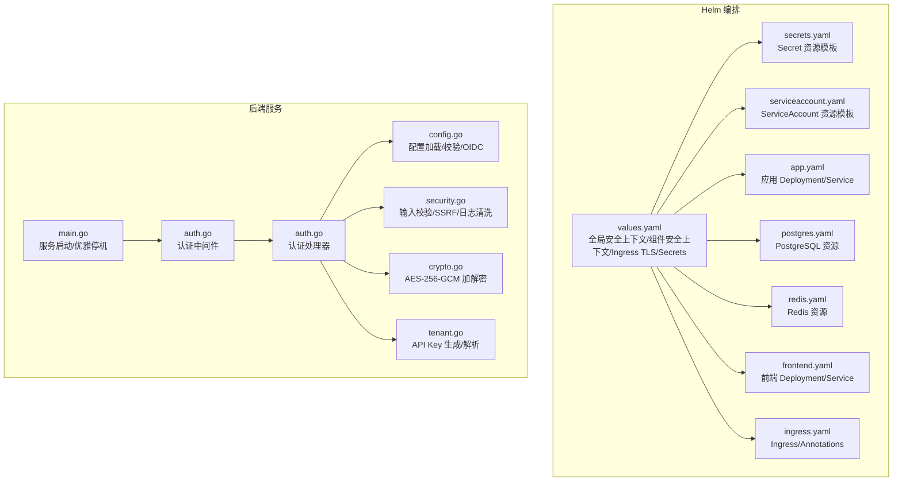
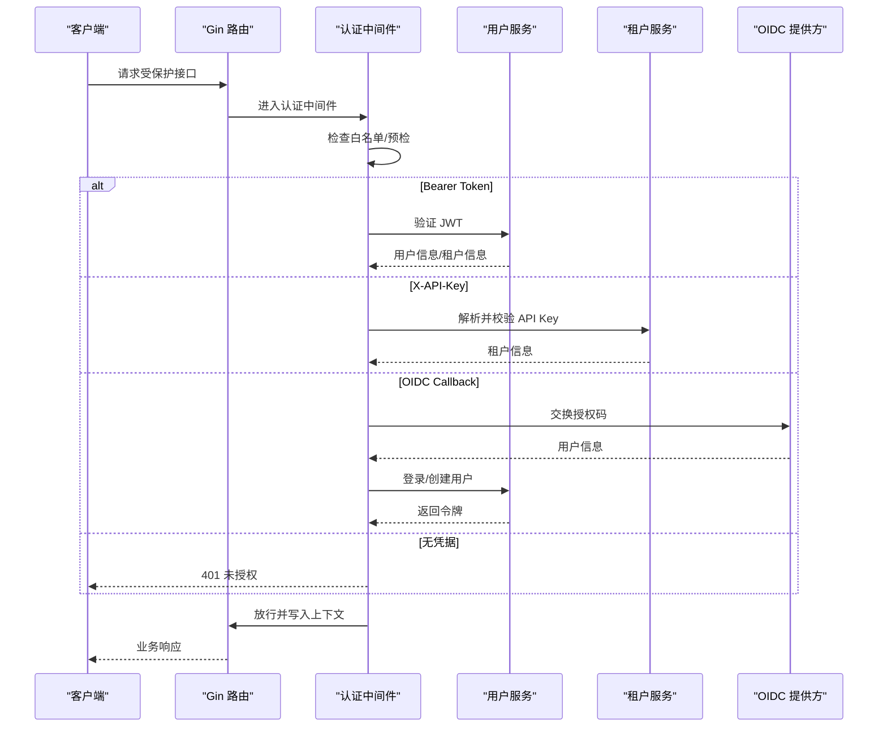
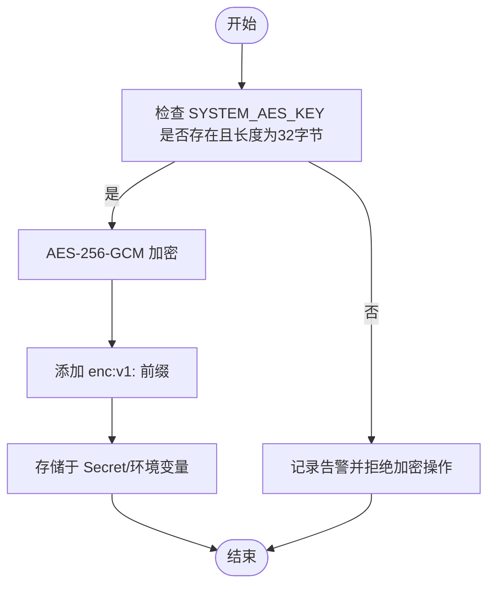
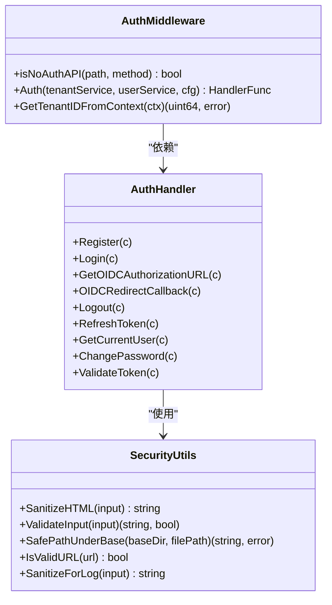
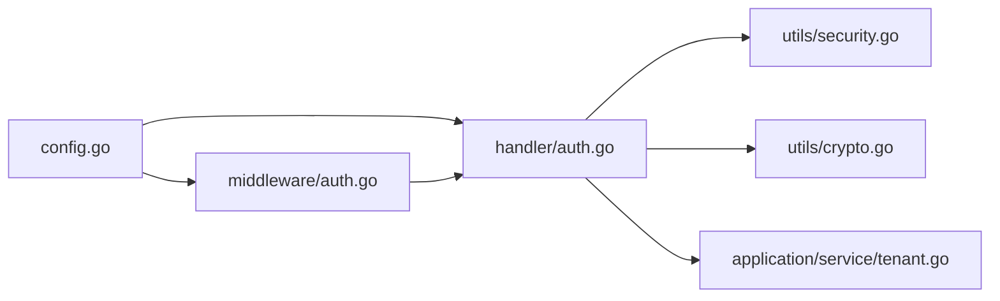

# 安全策略与权限管理

<cite>
**本文档引用的文件**
- [SECURITY.md](file://SECURITY.md)
- [secrets.yaml](file://helm/templates/secrets.yaml)
- [serviceaccount.yaml](file://helm/templates/serviceaccount.yaml)
- [dex-config.yaml](file://misc/dex-config.yaml)
- [values.yaml](file://helm/values.yaml)
- [security.go](file://internal/utils/security.go)
- [auth.go](file://internal/middleware/auth.go)
- [auth.go](file://internal/handler/auth.go)
- [main.go](file://cmd/server/main.go)
- [config.go](file://internal/config/config.go)
- [crypto.go](file://internal/utils/crypto.go)
- [tenant.go](file://internal/application/service/tenant.go)
</cite>

## 目录
1. [简介](#简介)
2. [项目结构](#项目结构)
3. [核心组件](#核心组件)
4. [架构总览](#架构总览)
5. [详细组件分析](#详细组件分析)
6. [依赖关系分析](#依赖关系分析)
7. [性能考虑](#性能考虑)
8. [故障排除指南](#故障排除指南)
9. [结论](#结论)

## 简介
本文件面向安全工程师与运维团队，系统化梳理 WeKnora 在 Kubernetes 环境下的安全策略与权限管理实践，覆盖以下方面：
- Secret 管理机制：敏感数据加密存储、密钥轮换策略、访问控制
- ServiceAccount 权限配置：RBAC 规则定义、安全上下文设置
- Pod 安全策略、网络策略与准入控制器配置建议
- 证书管理、TLS 配置与传输加密实施方案
- 审计日志、安全扫描与合规性检查流程
- 身份认证集成：OIDC、JWT、API Key 与会话管理策略

## 项目结构
WeKnora 采用 Helm Chart 进行多组件编排，安全相关的关键位置如下：
- Helm Values：全局安全上下文、组件安全上下文、Ingress TLS、Secrets 配置
- Helm Templates：Secret、ServiceAccount、应用、数据库等资源清单
- 后端服务：认证中间件、安全工具函数、配置加载与校验
- 辅助工具：本地 OIDC 示例配置（用于开发测试）

图表来源
- [values.yaml:23-35](file://helm/values.yaml#L23-L35)
- [secrets.yaml:13-39](file://helm/templates/secrets.yaml#L13-L39)
- [serviceaccount.yaml:8-24](file://helm/templates/serviceaccount.yaml#L8-L24)
- [main.go:43-123](file://cmd/server/main.go#L43-L123)
- [config.go:342-438](file://internal/config/config.go#L342-L438)
- [auth.go:65-228](file://internal/middleware/auth.go#L65-L228)
- [auth.go:22-633](file://internal/handler/auth.go#L22-L633)
- [security.go:44-186](file://internal/utils/security.go#L44-L186)
- [crypto.go:17-89](file://internal/utils/crypto.go#L17-L89)
- [tenant.go:273-298](file://internal/application/service/tenant.go#L273-L298)

章节来源
- [values.yaml:23-35](file://helm/values.yaml#L23-L35)
- [secrets.yaml:13-39](file://helm/templates/secrets.yaml#L13-L39)
- [serviceaccount.yaml:8-24](file://helm/templates/serviceaccount.yaml#L8-L24)
- [main.go:43-123](file://cmd/server/main.go#L43-L123)
- [config.go:342-438](file://internal/config/config.go#L342-L438)

## 核心组件
- 认证中间件与处理器：统一处理 Bearer JWT、X-API-Key、OIDC 回调与令牌刷新
- 安全工具集：输入校验、XSS/SSRF 防护、日志清洗、路径遍历防护
- 密钥与 API Key：基于 AES-256-GCM 的敏感数据加密存储与 API Key 生成/解析
- Helm 安全基线：全局与组件级安全上下文、ServiceAccount 控制、Ingress TLS

章节来源
- [auth.go:65-228](file://internal/middleware/auth.go#L65-L228)
- [auth.go:22-633](file://internal/handler/auth.go#L22-L633)
- [security.go:44-186](file://internal/utils/security.go#L44-L186)
- [crypto.go:17-89](file://internal/utils/crypto.go#L17-L89)
- [tenant.go:273-298](file://internal/application/service/tenant.go#L273-L298)

## 架构总览
下图展示认证与授权在系统中的交互流程，涵盖 JWT、API Key、OIDC 三种认证方式及会话管理要点。

图表来源
- [auth.go:65-228](file://internal/middleware/auth.go#L65-L228)
- [auth.go:164-276](file://internal/handler/auth.go#L164-L276)

## 详细组件分析

### Secret 管理机制
- 敏感数据加密存储
  - 系统级 AES-256-GCM 密钥通过环境变量 SYSTEM_AES_KEY 注入，密钥长度必须为 32 字节
  - API Key 采用 AES-256-GCM 加密，密文前缀标识，避免明文泄露
  - 数据库连接串、Redis 凭据、JWT 密钥等通过 Helm Secret 管理
- 密钥轮换策略
  - 建议通过滚动更新 Secret 并配合应用重新加载配置实现平滑轮换
  - 对于 API Key，采用加密存储后无法直接“解密”，需通过系统接口重新生成
- 访问控制
  - Secret 仅授予必要命名空间与 ServiceAccount
  - 生产环境推荐使用 External Secrets Operator 或 Sealed Secrets

图表来源
- [crypto.go:17-89](file://internal/utils/crypto.go#L17-L89)
- [tenant.go:273-298](file://internal/application/service/tenant.go#L273-L298)
- [secrets.yaml:22-33](file://helm/templates/secrets.yaml#L22-L33)

章节来源
- [crypto.go:17-89](file://internal/utils/crypto.go#L17-L89)
- [tenant.go:273-298](file://internal/application/service/tenant.go#L273-L298)
- [secrets.yaml:22-33](file://helm/templates/secrets.yaml#L22-L33)

### ServiceAccount 权限配置与 RBAC
- ServiceAccount
  - 默认关闭 automountServiceAccountToken，最小权限原则
  - 可通过注解/标签进行分类与审计
- RBAC
  - 建议为各组件创建独立 Role/ClusterRole，并绑定至相应 ServiceAccount
  - 限制对 Secrets、ConfigMap 的只读权限，避免横向移动
- 安全上下文
  - 全局与组件级 securityContext 已在 Values 中配置，确保不允许提权

章节来源
- [serviceaccount.yaml:8-24](file://helm/templates/serviceaccount.yaml#L8-L24)
- [values.yaml:37-48](file://helm/values.yaml#L37-L48)
- [values.yaml:78-85](file://helm/values.yaml#L78-L85)

### Pod 安全策略、网络策略与准入控制器
- Pod 安全
  - 全局 seccomp 使用 RuntimeDefault，allowPrivilegeEscalation=false
  - 组件级 securityContext 明确禁止提权
- 网络策略
  - 建议为数据库、缓存、应用分别配置 NetworkPolicy，限制入站/出站
  - Ingress 仅暴露必要端口，内部组件间通过 ClusterIP 通信
- 准入控制器
  - 建议启用 PodSecurity/OPA/Gatekeeper 等策略引擎
  - 镜像拉取使用 imagePullSecrets，限制私有仓库访问

章节来源
- [values.yaml:23-35](file://helm/values.yaml#L23-L35)
- [values.yaml:78-85](file://helm/values.yaml#L78-L85)
- [values.yaml:345-369](file://helm/values.yaml#L345-L369)

### 证书管理、TLS 配置与传输加密
- Ingress TLS
  - Values 中提供 TLS 开关与 Secret 名称配置项，生产环境务必开启并配置有效证书
- 传输加密
  - 所有外部通信建议强制 HTTPS，内部组件间可通过 mTLS（如 Istio）增强
- 本地开发
  - 提供 Dex 示例配置，便于本地 OIDC 调试

章节来源
- [values.yaml:355-361](file://helm/values.yaml#L355-L361)
- [dex-config.yaml:1-21](file://misc/dex-config.yaml#L1-L21)

### 审计日志、安全扫描与合规性检查
- 审计日志
  - 输入日志清洗函数可移除换行符与控制字符，防止日志注入
  - 建议集中采集并脱敏处理，保留关键字段（用户ID、租户ID、操作类型）
- 安全扫描
  - CI/CD 集成 SAST/DAST、容器镜像漏洞扫描
  - Helm Chart 使用静态分析工具检查模板安全性
- 合规性
  - 遵循最小权限、职责分离、数据最小化原则
  - 定期审查 Secret 访问日志与 RBAC 授权变更

章节来源
- [security.go:531-572](file://internal/utils/security.go#L531-L572)
- [SECURITY.md:1-47](file://SECURITY.md#L1-L47)

### 身份认证集成、授权机制与会话管理
- 认证方式
  - Bearer JWT：标准 OAuth2 令牌，支持刷新
  - X-API-Key：租户级 API Key，格式为 sk- 加密串
  - OIDC：可配置提供商发现地址与用户信息映射
- 授权机制
  - 租户维度隔离，支持跨租户访问开关
  - 用户角色与权限在前端界面中体现（管理端）
- 会话管理
  - 令牌有效期与刷新策略由服务端配置
  - 退出登录时撤销令牌，避免会话劫持

图表来源
- [auth.go:65-228](file://internal/middleware/auth.go#L65-L228)
- [auth.go:22-633](file://internal/handler/auth.go#L22-L633)
- [security.go:44-186](file://internal/utils/security.go#L44-L186)

章节来源
- [auth.go:65-228](file://internal/middleware/auth.go#L65-L228)
- [auth.go:22-633](file://internal/handler/auth.go#L22-L633)
- [config.go:180-192](file://internal/config/config.go#L180-L192)

## 依赖关系分析
- 认证链路依赖
  - 中间件依赖用户/租户服务接口，处理器依赖配置与安全工具
  - OIDC 配置来源于配置文件与环境变量覆盖
- 安全工具链
  - 输入校验与 URL/路径安全检查贯穿处理器与服务层
  - 加密工具为 API Key 与系统级密钥提供统一加解密能力

图表来源
- [config.go:342-438](file://internal/config/config.go#L342-L438)
- [auth.go:65-228](file://internal/middleware/auth.go#L65-L228)
- [auth.go:22-633](file://internal/handler/auth.go#L22-L633)
- [security.go:44-186](file://internal/utils/security.go#L44-L186)
- [crypto.go:17-89](file://internal/utils/crypto.go#L17-L89)
- [tenant.go:273-298](file://internal/application/service/tenant.go#L273-L298)

章节来源
- [config.go:342-438](file://internal/config/config.go#L342-L438)
- [auth.go:65-228](file://internal/middleware/auth.go#L65-L228)
- [auth.go:22-633](file://internal/handler/auth.go#L22-L633)

## 性能考虑
- 认证中间件尽量减少数据库查询次数，结合缓存与上下文传递
- SSRF 客户端限制重定向次数与超时，避免长时间阻塞
- 日志清洗与输入校验应避免过度正则匹配，控制复杂度

## 故障排除指南
- 未授权访问
  - 检查 Authorization 头格式与 Bearer 令牌有效性
  - 确认 X-API-Key 格式与租户 ID 解析
- OIDC 登录失败
  - 校验 discovery_url 与 endpoint 配置，确认回调地址正确
- SSRF/路径遍历
  - 检查 URL 协议与主机名白名单，确认路径解析函数未被绕过
- 密钥问题
  - 确认 SYSTEM_AES_KEY 长度为 32 字节，API Key 生成/解析流程正常

章节来源
- [auth.go:65-228](file://internal/middleware/auth.go#L65-L228)
- [auth.go:164-276](file://internal/handler/auth.go#L164-L276)
- [security.go:373-480](file://internal/utils/security.go#L373-L480)
- [crypto.go:17-89](file://internal/utils/crypto.go#L17-L89)

## 结论
WeKnora 在 Helm 层提供了安全基线，在后端实现了严格的认证授权与输入安全控制。建议在生产环境中：
- 强制启用 Ingress TLS 并使用可信 CA
- 使用外部 Secret 管理与 RBAC 最小权限
- 部署网络策略与准入控制器
- 建立密钥轮换与审计追踪流程
- 持续进行安全扫描与合规检查