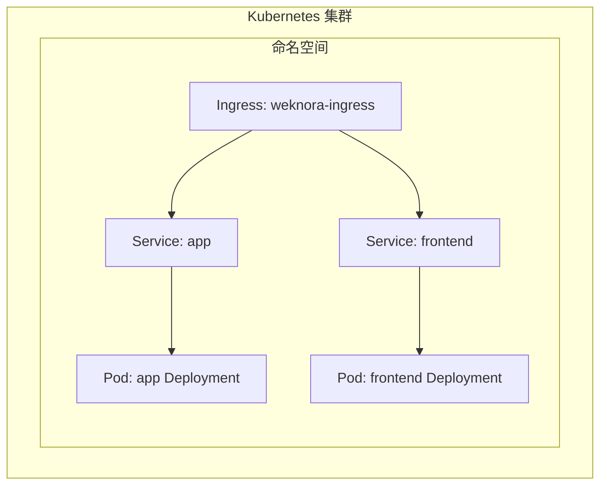
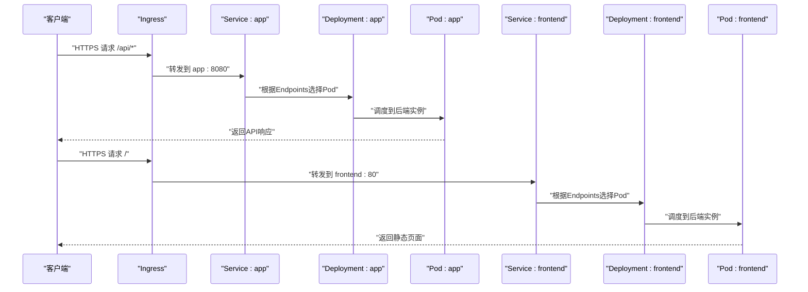
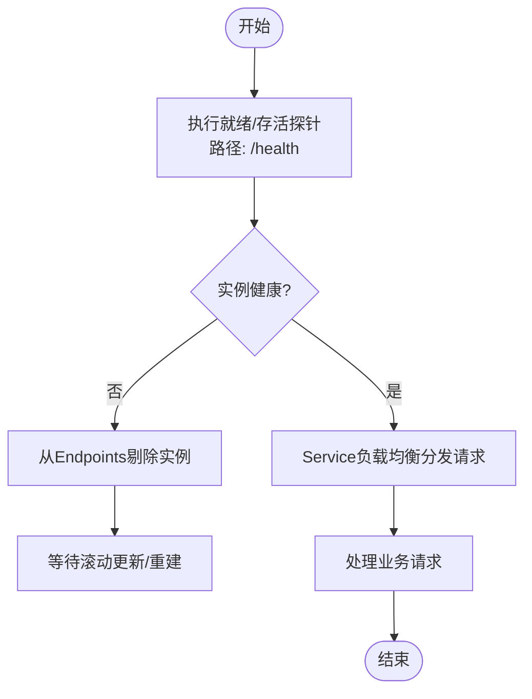
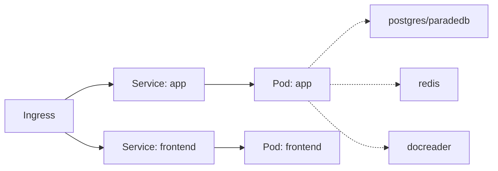

# 服务发现与负载均衡

<cite>
**本文引用的文件**   
- [helm/templates/ingress.yaml](file://helm/templates/ingress.yaml)
- [helm/templates/app.yaml](file://helm/templates/app.yaml)
- [helm/templates/frontend.yaml](file://helm/templates/frontend.yaml)
- [helm/values.yaml](file://helm/values.yaml)
- [docker-compose.yml](file://docker-compose.yml)
- [cmd/server/main.go](file://cmd/server/main.go)
- [internal/router/router.go](file://internal/router/router.go)
- [config/config.yaml](file://config/config.yaml)
- [docs/swagger.yaml](file://docs/swagger.yaml)
</cite>

## 目录
1. [简介](#简介)
2. [项目结构](#项目结构)
3. [核心组件](#核心组件)
4. [架构总览](#架构总览)
5. [详细组件分析](#详细组件分析)
6. [依赖关系分析](#依赖关系分析)
7. [性能考量](#性能考量)
8. [故障排查指南](#故障排查指南)
9. [结论](#结论)
10. [附录](#附录)

## 简介
本运维文档聚焦WeKnora的服务发现与负载均衡实践，覆盖Kubernetes Service配置、ClusterIP与LoadBalancer类型的选择与边界、Ingress控制器的路径路由与TLS策略、服务间网络通信、Pod亲和性与反亲和性、健康检查与故障转移、以及服务网格与流量治理建议。文档以仓库中的Helm模板与配置为依据，结合应用启动与路由实现，给出可操作的运维指导。

## 项目结构
WeKnora采用Helm Chart进行Kubernetes部署，核心包含以下与服务发现/负载均衡直接相关的部分：
- Helm模板：定义了后端API、前端UI、文档解析器、数据库与缓存等组件的Deployment与Service，并提供Ingress模板用于外部流量接入。
- Helm Values：集中管理各组件的副本数、资源、探针、亲和性、Service类型、Ingress开关与TLS等。
- 应用路由与健康检查：后端服务在启动时创建HTTP服务器并注册/health健康端点；前端Nginx作为静态资源服务，配合Ingress进行路径转发。

图表来源
- [helm/templates/ingress.yaml:32-51](file://helm/templates/ingress.yaml#L32-L51)
- [helm/templates/app.yaml:182-199](file://helm/templates/app.yaml#L182-L199)
- [helm/templates/frontend.yaml:95-112](file://helm/templates/frontend.yaml#L95-L112)

章节来源
- [helm/templates/ingress.yaml:1-53](file://helm/templates/ingress.yaml#L1-L53)
- [helm/templates/app.yaml:1-200](file://helm/templates/app.yaml#L1-L200)
- [helm/templates/frontend.yaml:1-113](file://helm/templates/frontend.yaml#L1-L113)
- [helm/values.yaml:1-493](file://helm/values.yaml#L1-L493)

## 核心组件
- 后端API服务（app）
  - Service类型默认为ClusterIP，端口8080，健康检查路径为/health。
  - 支持滚动更新策略，副本数可配置。
  - 通过环境变量连接数据库、Redis、文档解析器等依赖。
- 前端UI服务（frontend）
  - Service类型默认为ClusterIP，端口80，内置Nginx提供静态资源。
  - 通过环境变量APP_HOST/APP_PORT指向后端服务。
- Ingress
  - 默认关闭，可通过values启用；支持TLS与注解配置。
  - 将/api前缀路由至app Service，根路径/路由至frontend Service。

章节来源
- [helm/templates/app.yaml:108-130](file://helm/templates/app.yaml#L108-L130)
- [helm/templates/frontend.yaml:175-177](file://helm/templates/frontend.yaml#L175-L177)
- [helm/templates/ingress.yaml:32-51](file://helm/templates/ingress.yaml#L32-L51)
- [helm/values.yaml:345-369](file://helm/values.yaml#L345-L369)

## 架构总览
WeKnora在Kubernetes中的服务发现与负载均衡路径如下：
- 外部流量经Ingress进入集群，按路径规则分发到后端app或前端frontend。
- Service负责Pod级别的负载均衡与稳定网络标识。
- 应用内部通过Service DNS名称访问下游依赖（如postgres、redis、docreader）。

图表来源
- [helm/templates/ingress.yaml:32-51](file://helm/templates/ingress.yaml#L32-L51)
- [helm/templates/app.yaml:182-199](file://helm/templates/app.yaml#L182-L199)
- [helm/templates/frontend.yaml:95-112](file://helm/templates/frontend.yaml#L95-L112)

## 详细组件分析

### Kubernetes Service与Service类型
- app Service
  - 类型：ClusterIP（默认），端口8080，目标端口http。
  - 适合集群内部访问，若需公网直连可改为LoadBalancer（需云厂商支持）。
- frontend Service
  - 类型：ClusterIP（默认），端口80，目标端口http。
  - 由Ingress统一对外暴露，无需直接暴露到公网。
- docreader Service
  - 类型：ClusterIP（默认），端口50051，用于后端与文档解析器的gRPC通信。

章节来源
- [helm/templates/app.yaml:182-199](file://helm/templates/app.yaml#L182-L199)
- [helm/templates/frontend.yaml:95-112](file://helm/templates/frontend.yaml#L95-L112)
- [helm/values.yaml:190-237](file://helm/values.yaml#L190-L237)

### Ingress控制器配置策略
- 启用与类名
  - ingress.enabled=false（默认关闭），需显式开启。
  - ingress.className=nginx（示例类名），需与集群IngressClass一致。
- 主机名与TLS
  - ingress.host配置域名；tls.enabled控制是否启用TLS；tls.secretName指定证书密文。
- 路径路由规则
  - /api -> backend app Service（优先级更高，更具体）。
  - / -> backend frontend Service（通配路径）。
- 注解与性能
  - 提供proxy-body-size、proxy-connect/read/send-timeout等注解，用于大文件上传与长连接稳定性。

章节来源
- [helm/templates/ingress.yaml:8-51](file://helm/templates/ingress.yaml#L8-L51)
- [helm/values.yaml:345-369](file://helm/values.yaml#L345-L369)

### 服务间网络通信机制
- 后端app通过环境变量连接下游组件：
  - 数据库：DB_HOST/DB_PORT/DB_USER/DB_PASSWORD/DB_NAME。
  - 缓存：REDIS_ADDR/USERNAME/PASSWORD/DB/PREFIX。
  - 文档解析器：DOCREADER_ADDR。
- 前端frontend通过APP_HOST/APP_PORT指向后端服务，实现反向代理。
- docker-compose中展示了容器网络与服务依赖顺序，Kubernetes中通过Service DNS替代容器网络。

章节来源
- [helm/templates/app.yaml:54-121](file://helm/templates/app.yaml#L54-L121)
- [helm/templates/frontend.yaml:44-48](file://helm/templates/frontend.yaml#L44-L48)
- [docker-compose.yml:50-132](file://docker-compose.yml#L50-L132)

### Pod亲和性与反亲和性
- Helm Values提供affinity、tolerations、nodeSelector等字段，可在values.yaml中按需配置。
- 实践建议：
  - 将高流量的app与frontend部署在同一节点或同区域，降低跨节点延迟。
  - 对关键组件（如数据库、缓存）设置反亲和，避免单点故障。
  - 结合污点与容忍，隔离不同业务或环境。

章节来源
- [helm/values.yaml:138-139](file://helm/values.yaml#L138-L139)
- [helm/values.yaml:185-186](file://helm/values.yaml#L185-L186)
- [helm/values.yaml:235-236](file://helm/values.yaml#L235-L236)

### 健康检查与故障转移
- 后端应用
  - /health健康检查端点由路由层注册，探针配置位于values.yaml。
  - livenessProbe/readinessProbe均指向/health，初始延迟、周期、超时、失败阈值可调。
- 前端Nginx
  - 提供对/的就绪与存活探测，确保Ingress仅将流量转发到健康实例。
- 故障转移
  - Service基于Endpoints实现Pod级负载均衡；滚动更新时通过探针与滚动策略保障平滑切换。
  - Ingress与Service共同实现“就近”与“可用”的流量分发。

图表来源
- [helm/templates/app.yaml:113-130](file://helm/templates/app.yaml#L113-L130)
- [helm/templates/frontend.yaml:55-70](file://helm/templates/frontend.yaml#L55-L70)
- [internal/router/router.go:93-96](file://internal/router/router.go#L93-L96)

章节来源
- [helm/templates/app.yaml:113-130](file://helm/templates/app.yaml#L113-L130)
- [helm/templates/frontend.yaml:55-70](file://helm/templates/frontend.yaml#L55-L70)
- [internal/router/router.go:93-96](file://internal/router/router.go#L93-L96)

### 负载均衡算法与健康检查
- Service层面
  - 默认轮询（round-robin）算法，适用于大多数场景。
  - 可通过注解或Ingress控制器特性调整算法（需Ingress控制器支持）。
- 探针与健康检查
  - 使用HTTP GET /health，结合初始延迟、周期、超时与失败阈值，平衡收敛速度与抖动。
- 故障转移
  - 当实例不健康时，Endpoints自动剔除，Ingress与Service共同完成故障隔离与转移。

章节来源
- [helm/templates/app.yaml:113-130](file://helm/templates/app.yaml#L113-L130)
- [helm/templates/frontend.yaml:55-70](file://helm/templates/frontend.yaml#L55-L70)
- [internal/router/router.go:93-96](file://internal/router/router.go#L93-L96)

### 服务网格与流量管理（建议）
- Istio/Linkerd等服务网格可提供更细粒度的流量治理（金丝雀发布、熔断、超时与重试策略）。
- 与现有Helm部署兼容：通过Sidecar注入与DestinationRule/MeshPolicy等资源实现。
- 本仓库未包含服务网格配置，此处为通用运维建议。

（本节为概念性内容，不直接分析具体文件）

### 服务质量保障方案（建议）
- 资源限制与HPA：为关键组件设置requests/limits，并结合HorizontalPodAutoscaler实现弹性扩缩容。
- 熔断与重试：在网关或服务网格中配置熔断与指数退避重试，提升系统韧性。
- 链路追踪与日志：结合OpenTelemetry/Jaeger与日志聚合，定位性能瓶颈与异常路径。

（本节为概念性内容，不直接分析具体文件）

## 依赖关系分析
- Ingress依赖两个Service：app与frontend。
- app依赖数据库、缓存、文档解析器等后端服务（通过环境变量配置）。
- 前端依赖后端API（通过APP_HOST/APP_PORT）。

图表来源
- [helm/templates/ingress.yaml:32-51](file://helm/templates/ingress.yaml#L32-L51)
- [helm/templates/app.yaml:54-121](file://helm/templates/app.yaml#L54-L121)
- [helm/templates/frontend.yaml:44-48](file://helm/templates/frontend.yaml#L44-L48)

章节来源
- [helm/templates/ingress.yaml:32-51](file://helm/templates/ingress.yaml#L32-L51)
- [helm/templates/app.yaml:54-121](file://helm/templates/app.yaml#L54-L121)
- [helm/templates/frontend.yaml:44-48](file://helm/templates/frontend.yaml#L44-L48)

## 性能考量
- Ingress注解优化
  - 合理设置proxy-body-size、proxy-connect-timeout、proxy-read-timeout、proxy-send-timeout，满足大文件上传与长连接需求。
- Service与Pod
  - 为高并发的app增加副本数与资源上限，避免CPU/内存争抢。
  - 使用滚动更新策略与探针，减少更新过程中的抖动。
- 存储与网络
  - 将数据卷与缓存部署在高性能存储上，缩短I/O延迟。
  - 将前端与后端尽量部署在同一可用区，降低跨区网络时延。

章节来源
- [helm/values.yaml:364-368](file://helm/values.yaml#L364-L368)
- [helm/templates/app.yaml:16-25](file://helm/templates/app.yaml#L16-L25)
- [helm/templates/app.yaml:151-160](file://helm/templates/app.yaml#L151-L160)

## 故障排查指南
- 健康检查失败
  - 检查/health端点是否可达，确认livenessProbe/readinessProbe配置。
  - 查看Pod日志与事件，定位依赖（数据库、缓存、文档解析器）连接问题。
- Ingress无法访问
  - 确认ingress.enabled=true且className正确。
  - 校验host与TLS secretName配置，检查Ingress控制器状态。
- 路由不生效
  - 确认Ingress规则中/api优先于/；检查Service名称与端口映射。
- 前端静态资源异常
  - 检查frontend Service与Pod健康状态，确认Nginx就绪探针配置。

章节来源
- [internal/router/router.go:93-96](file://internal/router/router.go#L93-L96)
- [helm/templates/ingress.yaml:32-51](file://helm/templates/ingress.yaml#L32-L51)
- [helm/templates/frontend.yaml:55-70](file://helm/templates/frontend.yaml#L55-L70)
- [helm/values.yaml:345-369](file://helm/values.yaml#L345-L369)

## 结论
WeKnora在Kubernetes中的服务发现与负载均衡以Helm模板为核心，通过Ingress实现外部流量接入，Service实现Pod级负载均衡。结合健康检查与滚动更新策略，可实现稳定的故障转移与平滑升级。运维侧应重点关注Ingress配置、Service类型选择、探针参数与亲和性策略，必要时引入服务网格与HPA以进一步提升可用性与弹性。

## 附录
- API基础路径与文档
  - 基础路径：/api/v1；Swagger文档在非生产模式下可访问。
- 应用启动与监听
  - 服务监听配置来源于config/config.yaml，启动时创建HTTP服务器并注册/health端点。

章节来源
- [docs/swagger.yaml:1-1](file://docs/swagger.yaml#L1-L1)
- [config/config.yaml:2-4](file://config/config.yaml#L2-L4)
- [cmd/server/main.go:62-67](file://cmd/server/main.go#L62-L67)
- [internal/router/router.go:93-96](file://internal/router/router.go#L93-L96)