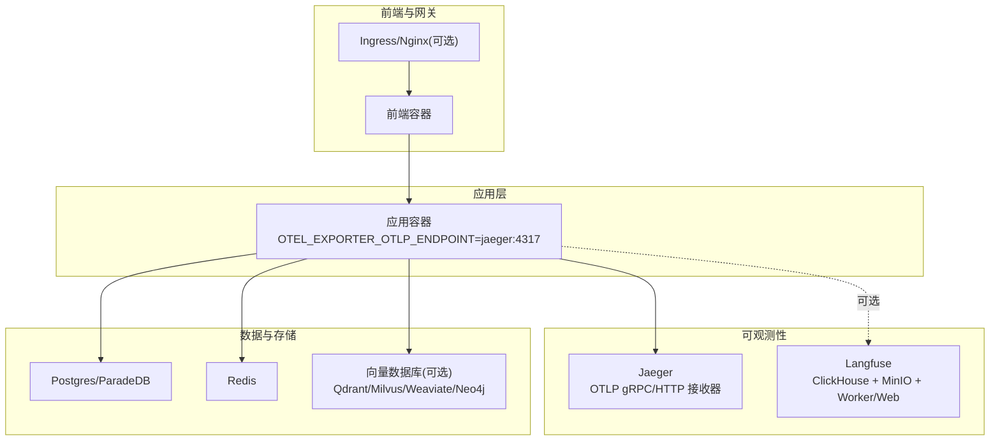
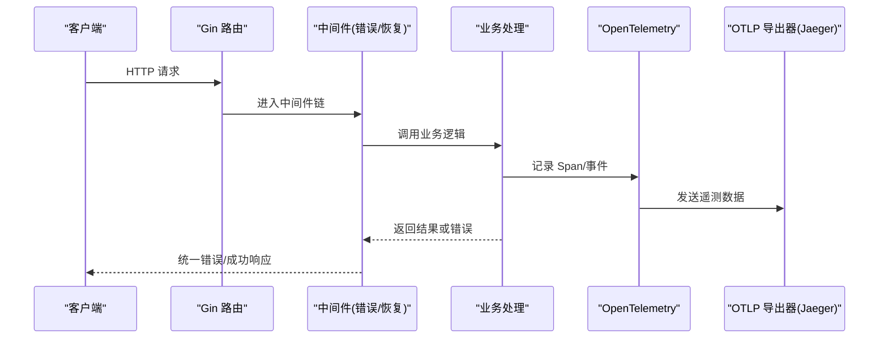
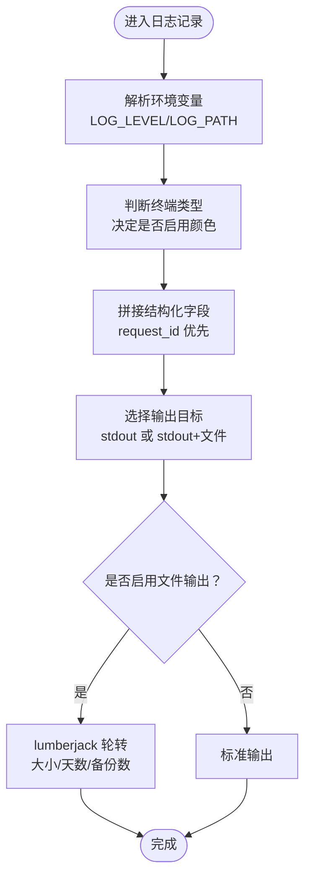
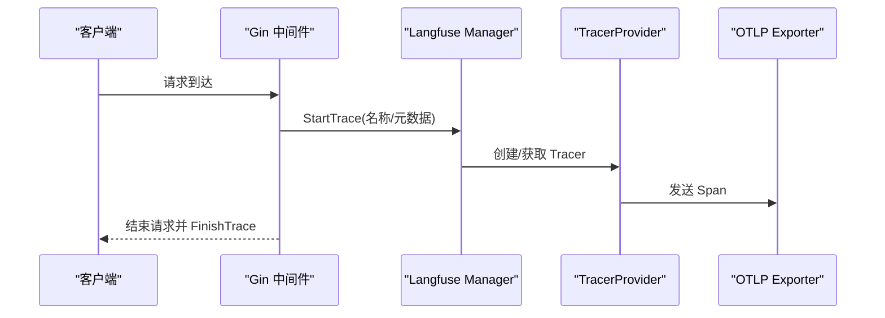
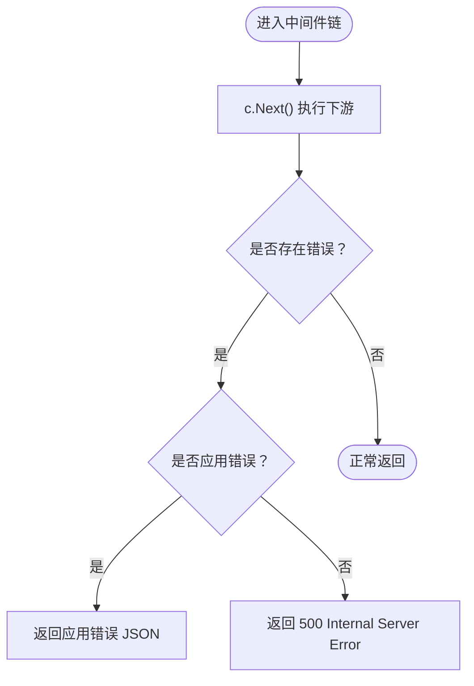
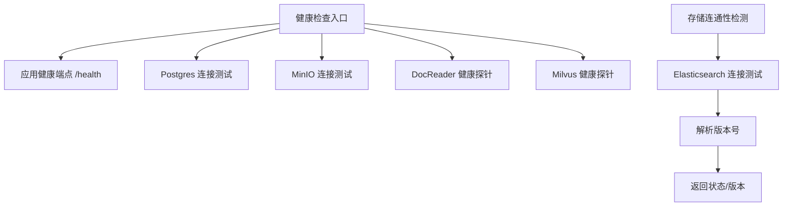
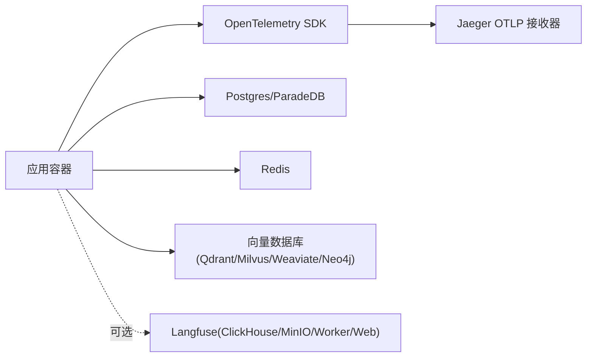

# 监控告警与日志管理

<cite>
**本文引用的文件**
- [logger.go](file://internal/logger/logger.go)
- [init.go](file://internal/tracing/init.go)
- [middleware.go](file://internal/tracing/langfuse/middleware.go)
- [tracer.go](file://internal/tracing/langfuse/tracer.go)
- [docker-compose.yml](file://docker-compose.yml)
- [values.yaml](file://helm/values.yaml)
- [Chart.yaml](file://helm/Chart.yaml)
- [error_handler.go](file://internal/middleware/error_handler.go)
- [recovery.go](file://internal/middleware/recovery.go)
- [vectorstore_healthcheck.go](file://internal/application/service/vectorstore_healthcheck.go)
- [system.go](file://internal/handler/system.go)
- [README.md](file://helm/README.md)
</cite>

## 目录
1. [简介](#简介)
2. [项目结构](#项目结构)
3. [核心组件](#核心组件)
4. [架构总览](#架构总览)
5. [详细组件分析](#详细组件分析)
6. [依赖分析](#依赖分析)
7. [性能考虑](#性能考虑)
8. [故障排查指南](#故障排查指南)
9. [结论](#结论)
10. [附录](#附录)

## 简介
本文件面向运维工程师，围绕 WeKnora 的监控告警与日志管理提供完整实践指导。内容涵盖：
- 日志体系：结构化日志格式、日志轮转策略、请求级关联与上下文传递
- 分布式追踪：OpenTelemetry 集成、Jaeger 导出、Langfuse 观测栈可选启用
- 健康检查与告警：容器健康探针、存储引擎连通性检测、错误处理与恢复
- 监控与告警：Prometheus/Grafana 面板与告警规则建议、阈值与恢复策略
- 性能与容量：资源使用监控、容量规划与优化建议
- APM 与用户体验：错误追踪、用户行为与性能指标采集

## 项目结构
WeKnora 提供 Docker Compose 与 Helm 两种部署形态，均内置可观测性组件（Jaeger、Langfuse 等）作为可选组件，便于快速搭建端到端观测链路。

图表来源
- [docker-compose.yml:28-177](file://docker-compose.yml#L28-L177)
- [docker-compose.yml:253-277](file://docker-compose.yml#L253-L277)
- [docker-compose.yml:378-594](file://docker-compose.yml#L378-L594)

章节来源
- [docker-compose.yml:1-613](file://docker-compose.yml#L1-L613)
- [Chart.yaml:1-27](file://helm/Chart.yaml#L1-L27)

## 核心组件
- 日志系统：基于 logrus 的结构化日志，支持请求级 request_id 关联、彩色终端输出、文件落盘与自动轮转
- 分布式追踪：OpenTelemetry SDK 初始化，支持 OTLP gRPC 导出至 Jaeger 或标准输出
- 错误处理与恢复：Gin 中间件统一错误返回与 panic 恢复，记录堆栈与请求上下文
- 健康检查：容器健康探针覆盖应用、数据库、对象存储、文档解析服务等
- 可选 APM：Langfuse 观测栈通过独立服务复用共享的 Postgres/Redis，提供体验与错误追踪

章节来源
- [logger.go:140-184](file://internal/logger/logger.go#L140-L184)
- [init.go:31-95](file://internal/tracing/init.go#L31-L95)
- [error_handler.go:11-46](file://internal/middleware/error_handler.go#L11-L46)
- [recovery.go:12-39](file://internal/middleware/recovery.go#L12-L39)
- [docker-compose.yml:44-49](file://docker-compose.yml#L44-L49)
- [docker-compose.yml:212-217](file://docker-compose.yml#L212-L217)

## 架构总览
WeKnora 的可观测性采用“应用内初始化 + 外部导出器”的模式：
- 应用启动时根据环境变量决定是否启用 OTLP 导出器（默认连接 Jaeger）
- 日志通过 logrus 结构化输出，结合请求级上下文字段实现跨服务串联
- 错误与恢复中间件确保异常被记录并返回标准化错误响应

图表来源
- [init.go:31-95](file://internal/tracing/init.go#L31-L95)
- [error_handler.go:11-46](file://internal/middleware/error_handler.go#L11-L46)
- [recovery.go:12-39](file://internal/middleware/recovery.go#L12-L39)

## 详细组件分析

### 日志系统（结构化、轮转、请求关联）
- 结构化字段：日志格式包含时间戳、级别、请求 ID、调用者位置与自定义字段，便于检索与聚合
- 彩色输出：终端环境启用 ANSI 颜色，容器/非交互环境自动关闭颜色，避免日志污染
- 文件落盘与轮转：使用 lumberjack 实现按大小与天数的滚动备份，保留历史版本
- 请求级关联：通过 WithRequestID/WithField 将 request_id 注入日志上下文，贯穿请求生命周期
- 上下文透传：CloneContext 保持日志、租户、请求 ID、Langfuse 跟踪等关键上下文

图表来源
- [logger.go:145-184](file://internal/logger/logger.go#L145-L184)
- [logger.go:276-290](file://internal/logger/logger.go#L276-L290)

章节来源
- [logger.go:58-138](file://internal/logger/logger.go#L58-L138)
- [logger.go:145-184](file://internal/logger/logger.go#L145-L184)
- [logger.go:276-290](file://internal/logger/logger.go#L276-L290)
- [logger.go:309-324](file://internal/logger/logger.go#L309-L324)
- [logger.go:387-413](file://internal/logger/logger.go#L387-L413)

### 分布式追踪（OpenTelemetry + Jaeger）
- 初始化：根据 OTEL_EXPORTER_OTLP_ENDPOINT 是否设置选择 OTLP gRPC 导出器或标准输出
- 采样策略：AlwaysSample（便于演示与诊断），生产可根据流量与成本调整
- 全局传播：TraceContext/Baggage 传播头，确保跨服务链路可见
- Langfuse 集成：通过中间件开启/结束 Trace，并在 HTTP 层注入请求级元数据

图表来源
- [init.go:31-95](file://internal/tracing/init.go#L31-L95)
- [middleware.go:43-58](file://internal/tracing/langfuse/middleware.go#L43-L58)
- [tracer.go:70-94](file://internal/tracing/langfuse/tracer.go#L70-L94)

章节来源
- [init.go:31-95](file://internal/tracing/init.go#L31-L95)
- [middleware.go:43-58](file://internal/tracing/langfuse/middleware.go#L43-L58)
- [tracer.go:70-94](file://internal/tracing/langfuse/tracer.go#L70-L94)

### 错误处理与恢复（统一错误返回与 panic 恢复）
- 错误处理中间件：捕获 Gin 错误队列中的应用错误，返回结构化错误响应
- panic 恢复中间件：捕获运行时 panic，记录请求 ID 与堆栈，返回 500
- 日志记录：错误日志包含 request_id、stacktrace 等关键字段，便于定位

图表来源
- [error_handler.go:11-46](file://internal/middleware/error_handler.go#L11-L46)
- [recovery.go:12-39](file://internal/middleware/recovery.go#L12-L39)

章节来源
- [error_handler.go:11-46](file://internal/middleware/error_handler.go#L11-L46)
- [recovery.go:12-39](file://internal/middleware/recovery.go#L12-L39)

### 健康检查与存储连通性检测
- 容器健康探针：应用、Postgres、MinIO、DocReader、Milvus 等均配置健康检查
- 存储引擎连通性：提供统一的存储引擎连通性检测接口，返回连通状态与消息
- Elasticsearch 版本探测：连通性测试中解析版本号，便于诊断兼容性问题

图表来源
- [docker-compose.yml:44-49](file://docker-compose.yml#L44-L49)
- [docker-compose.yml:212-217](file://docker-compose.yml#L212-L217)
- [docker-compose.yml:242-247](file://docker-compose.yml#L242-L247)
- [docker-compose.yml:188-193](file://docker-compose.yml#L188-L193)
- [docker-compose.yml:325-331](file://docker-compose.yml#L325-L331)
- [vectorstore_healthcheck.go:69-93](file://internal/application/service/vectorstore_healthcheck.go#L69-L93)

章节来源
- [docker-compose.yml:44-49](file://docker-compose.yml#L44-L49)
- [docker-compose.yml:212-217](file://docker-compose.yml#L212-L217)
- [docker-compose.yml:242-247](file://docker-compose.yml#L242-L247)
- [docker-compose.yml:188-193](file://docker-compose.yml#L188-L193)
- [docker-compose.yml:325-331](file://docker-compose.yml#L325-L331)
- [vectorstore_healthcheck.go:69-93](file://internal/application/service/vectorstore_healthcheck.go#L69-L93)

### Langfuse 观测栈（可选）
- 复用共享 Postgres/Redis，新增 ClickHouse（OLAP）与 MinIO（事件/媒体 S3）
- 通过 Docker Compose profile 启用，支持一键部署与 UI 访问
- 与应用容器通过环境变量对接，自动启用/禁用

章节来源
- [docker-compose.yml:378-594](file://docker-compose.yml#L378-L594)
- [README.md:203-256](file://helm/README.md#L203-L256)

## 依赖分析
- 运行时依赖：OpenTelemetry SDK、Jaeger（OTLP）、可选 Langfuse（ClickHouse/MinIO/Worker/Web）
- 存储依赖：Postgres/ParadeDB、Redis、向量数据库（Qdrant/Milvus/Weaviate/Neo4j）
- 健康检查：各服务均提供健康端点，便于编排平台进行存活/就绪判定

图表来源
- [docker-compose.yml:28-177](file://docker-compose.yml#L28-L177)
- [docker-compose.yml:253-277](file://docker-compose.yml#L253-L277)
- [docker-compose.yml:378-594](file://docker-compose.yml#L378-L594)

章节来源
- [docker-compose.yml:1-613](file://docker-compose.yml#L1-L613)

## 性能考虑
- 日志性能：lumberjack 轮转按大小与时间控制，避免单文件过大影响 IO；建议在高吞吐场景下适当增大 MaxSize 与延长 MaxAge
- 追踪采样：演示环境使用 AlwaysSample，生产建议根据流量与成本调整采样率或动态采样
- 健康检查频率：合理设置 interval/timeout/retries，避免过度探针压力
- 容器资源：为 Jaeger/Langfuse/ClickHouse/MinIO 等可选组件预留足够 CPU/内存，避免与应用争抢资源

## 故障排查指南
- 日志检索：优先使用 request_id 进行跨服务串联查询；若日志未落盘，检查 LOG_PATH 与权限
- 追踪链路：确认 OTEL_EXPORTER_OTLP_ENDPOINT 指向正确地址；若为空则退化为标准输出
- 错误定位：查看统一错误响应中的 code/message/details；panic 场景检查 stacktrace 字段
- 存储连通：使用存储连通性检测接口验证 ES/PG/S3 等连接；关注版本兼容性提示
- 健康状态：检查各服务健康探针返回，定位启动慢或连接失败的服务

章节来源
- [logger.go:226-245](file://internal/logger/logger.go#L226-L245)
- [init.go:41-59](file://internal/tracing/init.go#L41-L59)
- [error_handler.go:23-43](file://internal/middleware/error_handler.go#L23-L43)
- [recovery.go:24-27](file://internal/middleware/recovery.go#L24-L27)
- [vectorstore_healthcheck.go:69-93](file://internal/application/service/vectorstore_healthcheck.go#L69-L93)
- [docker-compose.yml:44-49](file://docker-compose.yml#L44-L49)

## 结论
WeKnora 提供开箱即用的可观测性能力：结构化日志、OpenTelemetry 追踪与健康检查，辅以可选的 Langfuse 观测栈。通过合理的日志轮转、请求级关联与统一错误处理，能够显著提升问题定位效率。建议在生产环境中结合 Prometheus/Grafana 进行指标可视化与告警，并根据业务流量与成本策略优化追踪采样与日志保留策略。

## 附录

### Prometheus 监控指标采集建议
- 应用指标：暴露 HTTP 请求耗时、请求数、错误率、并发连接数等
- 追踪指标：从 Jaeger 导出器统计链路耗时分布、错误率
- 健康指标：容器健康探针状态、存储引擎连通性
- APM 指标：Langfuse 事件/媒体上传、ClickHouse 表大小、MinIO 存储用量

### Grafana 仪表板配置建议
- 请求面板：按端点/方法/状态码分组展示成功率与 P95/P99 延迟
- 错误面板：panic 次数、应用错误分类统计
- 追踪面板：链路耗时分布、慢调用 TopN
- 健康面板：各服务存活率、探针失败率
- APM 面板：Langfuse 事件速率、媒体上传体积、ClickHouse/MinIO 使用率

### 告警规则与阈值建议
- HTTP 错误率：5 分钟窗口内错误率超过阈值触发告警
- 延迟尖峰：P95/P99 超过阈值持续一段时间触发告警
- 追踪错误：链路错误率异常升高触发告警
- 健康探针：连续失败超过阈值触发告警
- APM 异常：Langfuse 事件/媒体上传失败率升高触发告警

### 故障自动恢复策略
- 健康探针失败：自动重启容器或触发扩缩容
- 追踪导出失败：切换导出器或降级为标准输出
- 日志轮转异常：检查磁盘配额与权限，必要时降低保留天数
- 存储连通失败：自动重试与熔断，必要时切换备用存储