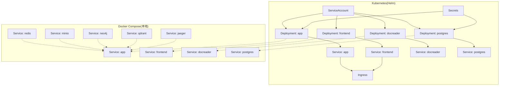
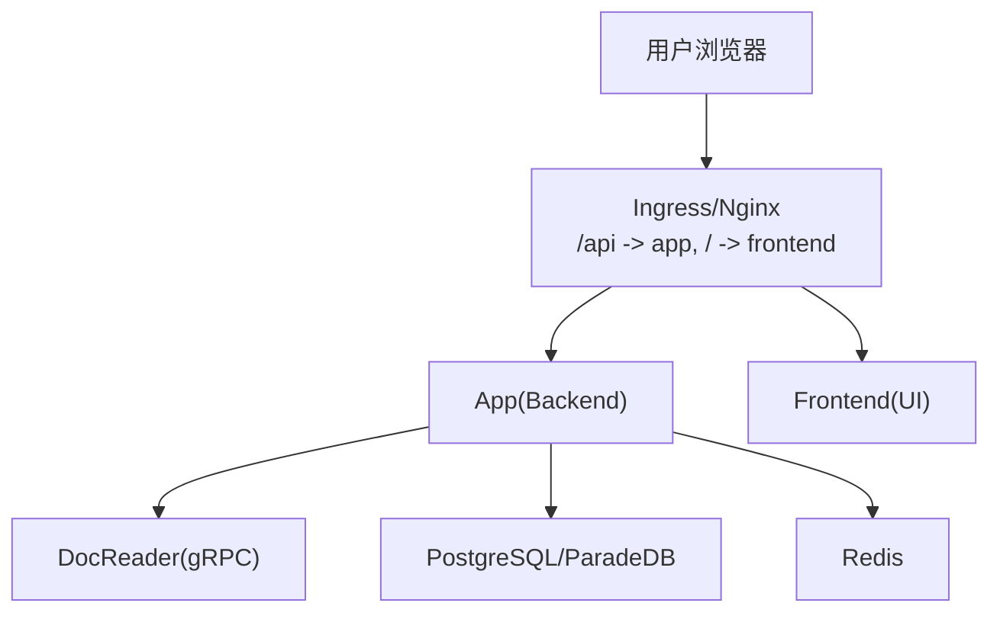
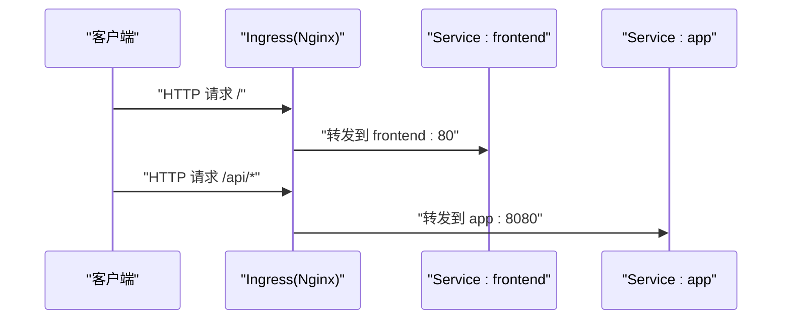
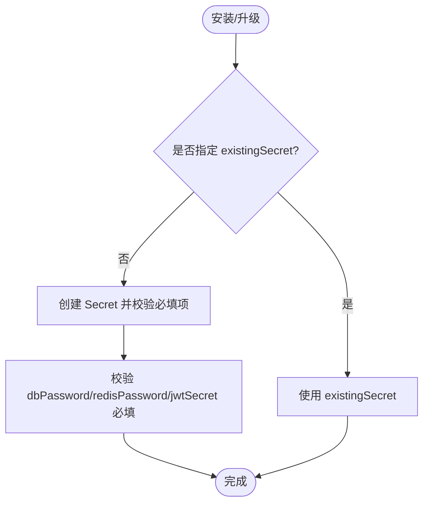
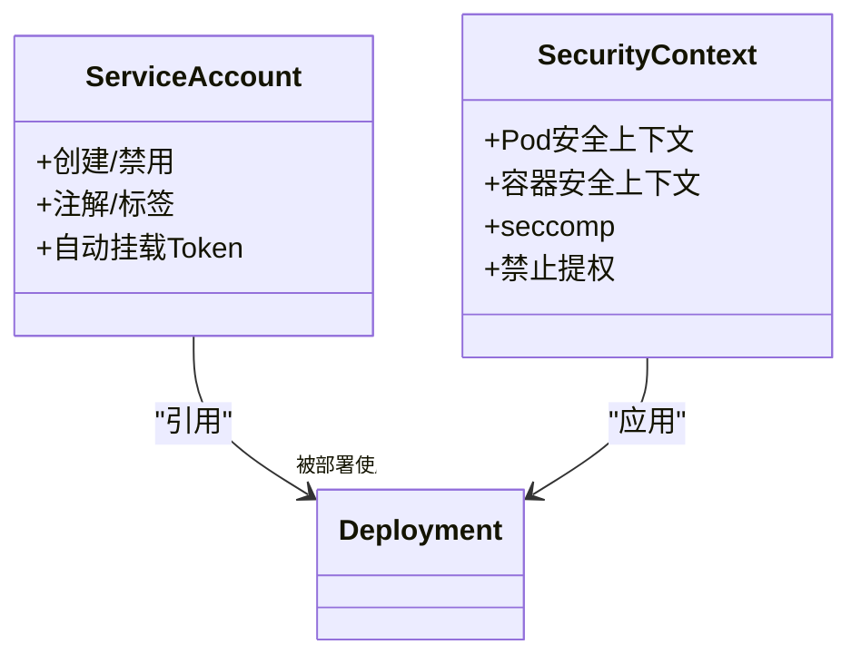
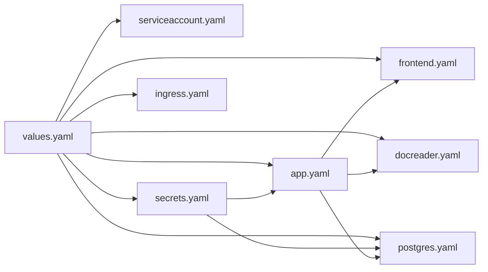

# 集群运维管理

<cite>
**本文引用的文件**
- [Chart.yaml](file://helm/Chart.yaml)
- [values.yaml](file://helm/values.yaml)
- [ingress.yaml](file://helm/templates/ingress.yaml)
- [secrets.yaml](file://helm/templates/secrets.yaml)
- [serviceaccount.yaml](file://helm/templates/serviceaccount.yaml)
- [app.yaml](file://helm/templates/app.yaml)
- [frontend.yaml](file://helm/templates/frontend.yaml)
- [docreader.yaml](file://helm/templates/docreader.yaml)
- [postgres.yaml](file://helm/templates/postgres.yaml)
- [docker-compose.yml](file://docker-compose.yml)
- [dex-config.yaml](file://misc/dex-config.yaml)
- [start_all.sh](file://scripts/start_all.sh)
- [migrate.sh](file://scripts/migrate.sh)
- [build_images.sh](file://scripts/build_images.sh)
- [config.yaml](file://config/config.yaml)
</cite>

## 目录
1. [简介](#简介)
2. [项目结构](#项目结构)
3. [核心组件](#核心组件)
4. [架构总览](#架构总览)
5. [详细组件分析](#详细组件分析)
6. [依赖关系分析](#依赖关系分析)
7. [性能考虑](#性能考虑)
8. [故障排查指南](#故障排查指南)
9. [结论](#结论)
10. [附录](#附录)

## 简介
本文件面向运维工程师与平台团队，提供WeKnora集群的完整运维管理指南。内容涵盖服务发现、Ingress控制器配置与域名解析策略、Secret管理与证书配置、安全策略（ServiceAccount、RBAC、安全上下文）、监控与日志、告警、滚动更新与蓝绿/金丝雀发布实践、备份与灾难恢复、高可用配置、性能调优与容量规划、成本优化建议等。

## 项目结构
WeKnora提供两套部署形态：
- Kubernetes Helm Chart：生产级编排与配置管理，包含应用、前端、文档读取器、PostgreSQL（ParadeDB）、Redis、Ingress、Secrets、ServiceAccount等模板。
- Docker Compose：单机/本地开发与演示，包含应用、前端、文档读取器、PostgreSQL、Redis、MinIO、Neo4j、Qdrant、Jaeger、Langfuse等服务。

图表来源
- [app.yaml:1-200](file://helm/templates/app.yaml#L1-L200)
- [frontend.yaml:1-113](file://helm/templates/frontend.yaml#L1-L113)
- [docreader.yaml:1-103](file://helm/templates/docreader.yaml#L1-L103)
- [postgres.yaml:1-129](file://helm/templates/postgres.yaml#L1-L129)
- [ingress.yaml:1-53](file://helm/templates/ingress.yaml#L1-L53)
- [docker-compose.yml:1-613](file://docker-compose.yml#L1-L613)

章节来源
- [Chart.yaml:1-27](file://helm/Chart.yaml#L1-L27)
- [values.yaml:1-493](file://helm/values.yaml#L1-L493)
- [docker-compose.yml:1-613](file://docker-compose.yml#L1-L613)

## 核心组件
- 应用服务（App）：后端API，负责对话、知识库检索、向量化存储、文件存储、流式任务队列等。
- 前端服务（UI）：静态Web页面，通过Nginx代理后端API。
- 文档读取器（DocReader）：gRPC服务，负责文档解析与分块。
- 数据库（PostgreSQL/ParadeDB）：提供结构化数据与向量搜索能力。
- 缓存（Redis）：流式任务队列与会话状态管理。
- 可选组件：MinIO（对象存储）、Neo4j（知识图谱）、Qdrant/Weaviate/Milvus（向量数据库）、Jaeger（链路追踪）、Langfuse（可观测性）。
- 认证：内置Dex示例配置，支持OIDC回调。

章节来源
- [app.yaml:1-200](file://helm/templates/app.yaml#L1-L200)
- [frontend.yaml:1-113](file://helm/templates/frontend.yaml#L1-L113)
- [docreader.yaml:1-103](file://helm/templates/docreader.yaml#L1-L103)
- [postgres.yaml:1-129](file://helm/templates/postgres.yaml#L1-L129)
- [docker-compose.yml:28-157](file://docker-compose.yml#L28-L157)

## 架构总览
WeKnora在Kubernetes中通过Helm模板部署，采用滚动更新策略确保零停机升级；Ingress统一入口，路由/api至后端，/至前端；Secret集中管理数据库、Redis、JWT、AES密钥等；ServiceAccount与安全上下文限制容器权限；Prometheus/Grafana/ELK等监控体系可按需接入。

图表来源
- [ingress.yaml:32-51](file://helm/templates/ingress.yaml#L32-L51)
- [app.yaml:182-200](file://helm/templates/app.yaml#L182-L200)
- [frontend.yaml:95-113](file://helm/templates/frontend.yaml#L95-L113)
- [docreader.yaml:85-103](file://helm/templates/docreader.yaml#L85-L103)
- [postgres.yaml:111-129](file://helm/templates/postgres.yaml#L111-L129)

## 详细组件分析

### 服务发现与Ingress
- Ingress启用开关与类名：通过values中的ingress.enabled与className控制。
- 主机名与TLS：host与tls.secretName定义域名与证书。
- 路由规则：/api前缀路由到app服务，/路由到frontend服务。
- 注解：支持Nginx代理大小、连接/读写超时等。

图表来源
- [ingress.yaml:32-51](file://helm/templates/ingress.yaml#L32-L51)

章节来源
- [values.yaml:343-370](file://helm/values.yaml#L343-L370)
- [ingress.yaml:1-53](file://helm/templates/ingress.yaml#L1-L53)

### Secret管理与证书配置
- Secret创建策略：默认由Helm模板创建，包含DB_USER/PASSWORD/NAME、REDIS_USERNAME/PASSWORD、JWT_SECRET、TENANT_AES_KEY、SYSTEM_AES_KEY；当neo4j.enabled时包含NEO4J_USERNAME/PASSWORD。
- 生产建议：使用existingSecret或外部密管（External Secrets Operator、Vault、Sealed Secrets）注入。
- 证书：TLS开关与secretName由values控制，Ingress模板按配置渲染。

图表来源
- [secrets.yaml:13-39](file://helm/templates/secrets.yaml#L13-L39)
- [values.yaml:372-403](file://helm/values.yaml#L372-L403)

章节来源
- [secrets.yaml:1-40](file://helm/templates/secrets.yaml#L1-L40)
- [values.yaml:372-403](file://helm/values.yaml#L372-L403)

### 安全策略（RBAC与安全上下文）
- ServiceAccount：可创建独立SA，可配置注解与标签，可关闭自动挂载token。
- 全局与容器安全上下文：默认启用seccomp(RuntimeDefault)，禁止特权提升；允许按组件覆盖。
- Pod/容器安全上下文：全局与各组件可分别设置，确保最小权限原则。

图表来源
- [serviceaccount.yaml:8-24](file://helm/templates/serviceaccount.yaml#L8-L24)
- [values.yaml:13-48](file://helm/values.yaml#L13-L48)
- [app.yaml:32-43](file://helm/templates/app.yaml#L32-L43)

章节来源
- [serviceaccount.yaml:1-25](file://helm/templates/serviceaccount.yaml#L1-L25)
- [values.yaml:13-48](file://helm/values.yaml#L13-L48)
- [app.yaml:32-43](file://helm/templates/app.yaml#L32-L43)

### 认证与OIDC（Dex）
- Dex示例配置：内存存储、客户端ID/回调URI、跳过审批页等。
- 建议：生产使用外部身份提供商（如企业AD/LDAP/Okta），并结合RBAC与网络策略。

章节来源
- [dex-config.yaml:1-21](file://misc/dex-config.yaml#L1-L21)

### 滚动更新与发布策略
- 应用/前端/文档读取器均采用RollingUpdate，maxSurge=1，maxUnavailable=0，确保零停机。
- 数据库使用Recreate策略，避免数据损坏风险。
- 建议：结合探针（liveness/readiness）与HPA实现弹性伸缩。

章节来源
- [app.yaml:20-24](file://helm/templates/app.yaml#L20-L24)
- [frontend.yaml:20-24](file://helm/templates/frontend.yaml#L20-L24)
- [docreader.yaml:20-24](file://helm/templates/docreader.yaml#L20-L24)
- [postgres.yaml:21-23](file://helm/templates/postgres.yaml#L21-L23)

### 蓝绿与金丝雀发布实践
- 蓝绿：通过两套Deployment（如app-v1与app-v2）配合Ingress切换；Ingress指向新版本后逐步切流量。
- 金丝雀：利用Service权重或Ingress注解（如Nginx Canary）将小部分流量引入新版本，观察指标与日志后再扩大。
- 建议：结合Prometheus/Grafana与ELK进行A/B测试与回归验证。

[本节为通用实践说明，不直接分析具体文件]

### 备份与灾难恢复
- 数据库备份：PostgreSQL/ParadeDB使用PVC持久化，建议定期快照或逻辑导出；结合RDS/托管DB可启用自动备份。
- 对象存储：MinIO/外部S3需开启版本化与跨区域复制。
- 配置备份：Secrets、ConfigMaps、Helm values均需纳入GitOps管理。
- 灾难恢复：演练跨区/跨集群恢复流程，验证RTO/RPO目标。

[本节为通用实践说明，不直接分析具体文件]

### 高可用配置
- 多副本：app/frontend/docreader默认1副本，建议至少2副本以提升可用性。
- 节点亲和与容忍：通过values中的nodeSelector/affinity/tolerations分散Pod。
- 存储：PVC使用高可靠存储类，开启快照与备份。
- Ingress高可用：多副本Ingress Controller与健康检查。

章节来源
- [values.yaml:57-139](file://helm/values.yaml#L57-L139)
- [postgres.yaml:98-109](file://helm/templates/postgres.yaml#L98-L109)

### 监控、日志与告警
- 链路追踪：Jaeger（OTLP/HTTP/UDP端口），App通过环境变量启用。
- 可观测性：Langfuse（ClickHouse/MinIO），复用现有PostgreSQL/Redis。
- 日志：容器标准输出，建议对接ELK/Fluentd/Vector；Ingress可记录访问日志。
- 告警：基于Prometheus/Grafana阈值告警（CPU/内存/磁盘/连接数/错误率）。

章节来源
- [docker-compose.yml:253-277](file://docker-compose.yml#L253-L277)
- [docker-compose.yml:378-594](file://docker-compose.yml#L378-L594)

### 性能调优与容量规划
- 资源请求/限制：根据负载压测调整CPU/内存；避免过度限制导致排队。
- 存储：评估文件上传峰值与向量索引规模，预留充足PVC空间。
- 缓存：Redis内存与持久化策略需与业务峰值匹配。
- 网络：Ingress超时参数与代理缓冲需结合大文件上传/长轮询场景调优。

章节来源
- [values.yaml:68-139](file://helm/values.yaml#L68-L139)
- [values.yaml:241-328](file://helm/values.yaml#L241-L328)
- [values.yaml:141-186](file://helm/values.yaml#L141-L186)

### 成本优化建议
- 镜像：使用多阶段构建与精简基础镜像，减少镜像体积与扫描时间。
- 资源：启用HPA与自动扩缩容，避免长期闲置资源。
- 存储：冷热分层与生命周期策略，及时清理临时文件。
- 计费：按需启用可选组件（如Langfuse、Neo4j、Qdrant），避免不必要的资源占用。

[本节为通用实践说明，不直接分析具体文件]

## 依赖关系分析

图表来源
- [values.yaml:1-493](file://helm/values.yaml#L1-L493)
- [serviceaccount.yaml:1-25](file://helm/templates/serviceaccount.yaml#L1-L25)
- [secrets.yaml:1-40](file://helm/templates/secrets.yaml#L1-L40)
- [ingress.yaml:1-53](file://helm/templates/ingress.yaml#L1-L53)
- [app.yaml:1-200](file://helm/templates/app.yaml#L1-L200)
- [frontend.yaml:1-113](file://helm/templates/frontend.yaml#L1-L113)
- [docreader.yaml:1-103](file://helm/templates/docreader.yaml#L1-L103)
- [postgres.yaml:1-129](file://helm/templates/postgres.yaml#L1-L129)

章节来源
- [values.yaml:1-493](file://helm/values.yaml#L1-L493)

## 性能考虑
- 探针配置：健康检查与就绪检查间隔与超时需结合实际响应延迟调整。
- 更新策略：滚动更新参数需平衡可用性与资源消耗。
- 存储I/O：PVC类型与卷大小直接影响数据库与文件服务性能。
- 网络路径：Ingress到后端的链路应尽量短，避免多层代理带来的额外延迟。

[本节为通用指导，不直接分析具体文件]

## 故障排查指南
- 启动脚本：start_all.sh提供一键启动/停止、环境检查、日志跟踪、镜像拉取等功能，便于快速定位问题。
- 迁移工具：migrate.sh封装数据库迁移命令，支持up/down/create/version/force/goto等。
- 构建脚本：build_images.sh支持多镜像构建与清理，便于本地验证与CI流水线集成。
- 配置参考：config.yaml定义服务端口、对话与知识库参数，有助于定位业务侧异常。

章节来源
- [start_all.sh:1-773](file://scripts/start_all.sh#L1-L773)
- [migrate.sh:1-122](file://scripts/migrate.sh#L1-L122)
- [build_images.sh:1-393](file://scripts/build_images.sh#L1-L393)
- [config.yaml:1-113](file://config/config.yaml#L1-L113)

## 结论
WeKnora提供了从本地开发到生产部署的完整工具链。通过Helm模板实现标准化编排，配合严格的Secret管理、安全上下文与ServiceAccount策略，可在Kubernetes上实现高可用、可观测与可演进的AI知识平台。建议结合业务负载进行容量规划与性能调优，并建立完善的备份与灾备流程，确保平台稳定运行。

## 附录
- Docker Compose服务依赖关系与环境变量可作为本地调试与问题定位的重要参考。
- Dex配置可用于快速搭建OIDC认证，生产环境建议替换为更安全的身份提供商。

章节来源
- [docker-compose.yml:1-613](file://docker-compose.yml#L1-L613)
- [dex-config.yaml:1-21](file://misc/dex-config.yaml#L1-L21)