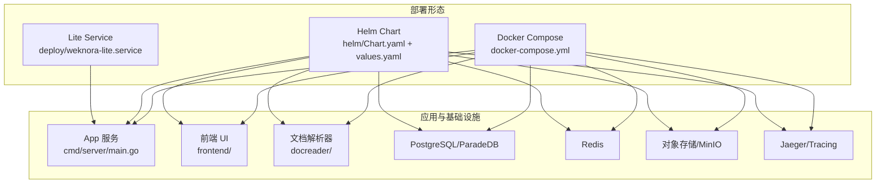
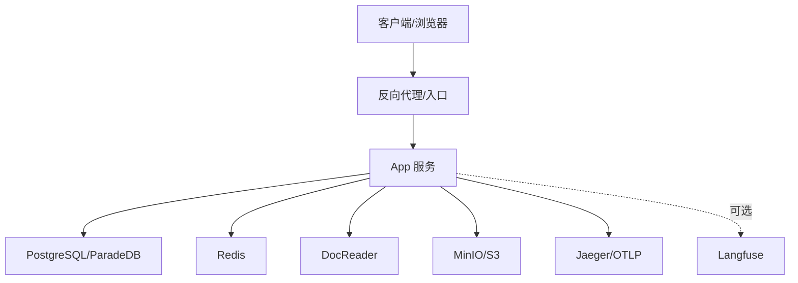
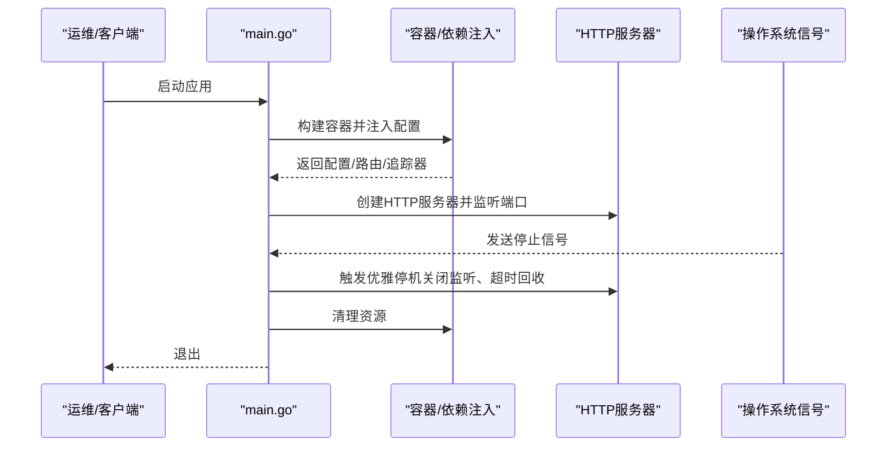
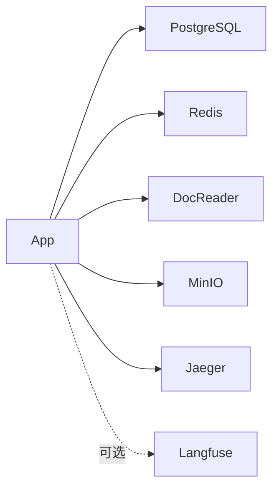
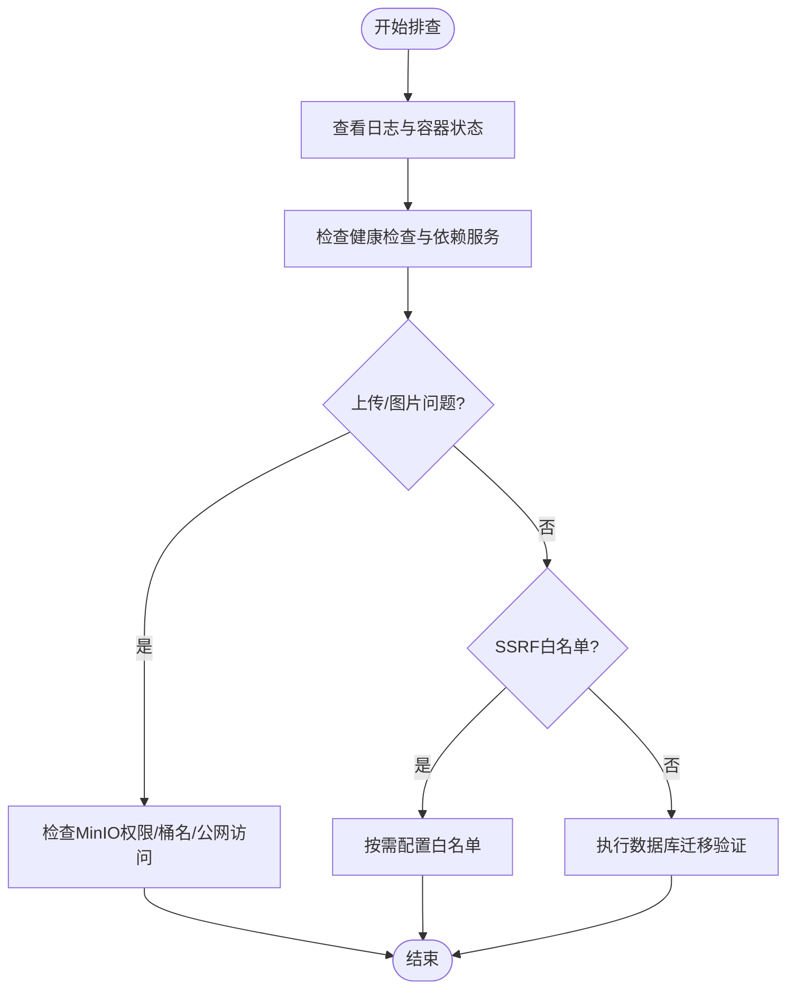

# 生产环境运维

<cite>
**本文引用的文件**
- [docker-compose.yml](file://docker-compose.yml)
- [helm/values.yaml](file://helm/values.yaml)
- [helm/Chart.yaml](file://helm/Chart.yaml)
- [deploy/weknora-lite.service](file://deploy/weknora-lite.service)
- [scripts/migrate.sh](file://scripts/migrate.sh)
- [config/config.yaml](file://config/config.yaml)
- [cmd/server/main.go](file://cmd/server/main.go)
- [internal/config/config.go](file://internal/config/config.go)
- [docs/wiki/运维排障/常见问题.md](file://docs/wiki/运维排障/常见问题.md)
- [docs/Langfuse集成.md](file://docs/Langfuse集成.md)
- [scripts/start_all.sh](file://scripts/start_all.sh)
- [scripts/build_images.sh](file://scripts/build_images.sh)
</cite>

## 目录
1. [简介](#简介)
2. [项目结构](#项目结构)
3. [核心组件](#核心组件)
4. [架构总览](#架构总览)
5. [详细组件分析](#详细组件分析)
6. [依赖关系分析](#依赖关系分析)
7. [性能考量](#性能考量)
8. [故障排查指南](#故障排查指南)
9. [结论](#结论)
10. [附录](#附录)

## 简介
本文件面向运维工程师与平台管理员，提供WeKnora生产环境的运维指导，涵盖部署最佳实践、性能调优、监控告警、备份恢复、灾难恢复、高可用、负载均衡与自动扩缩容、资源优化、安全加固、访问控制与审计、CI/CD流水线与自动化部署回滚、性能基准与容量规划、成本优化、应急响应与排障工具使用等内容。

## 项目结构
WeKnora提供多套生产部署形态：
- Docker Compose：单机/小规模集群，适合演示与小规模生产
- Helm Chart：Kubernetes生产级部署，支持高可用与弹性伸缩
- Lite Service：单机服务化部署，适合边缘或轻量化场景
- 文档与脚本：包含数据库迁移、镜像构建、一键启停等运维脚本

**图表来源**
- [docker-compose.yml](file://docker-compose.yml)
- [helm/Chart.yaml](file://helm/Chart.yaml)
- [helm/values.yaml](file://helm/values.yaml)
- [deploy/weknora-lite.service](file://deploy/weknora-lite.service)

**章节来源**
- [docker-compose.yml](file://docker-compose.yml)
- [helm/Chart.yaml](file://helm/Chart.yaml)
- [helm/values.yaml](file://helm/values.yaml)
- [deploy/weknora-lite.service](file://deploy/weknora-lite.service)

## 核心组件
- 应用服务（App）：HTTP服务入口，负责路由、鉴权、业务编排、可观测性集成
- 前端UI：静态资源与反向代理
- 文档解析器（DocReader）：gRPC/HTTP文档解析服务
- 数据库：PostgreSQL（ParadeDB）用于结构化数据与向量检索
- 缓存队列：Redis用于流式管理、任务队列与分布式锁
- 对象存储：MinIO/S3兼容存储用于文件与媒体
- 链路追踪：Jaeger/OTLP
- 可选可观测：Langfuse（可选）

**章节来源**
- [cmd/server/main.go](file://cmd/server/main.go)
- [docker-compose.yml](file://docker-compose.yml)
- [helm/values.yaml](file://helm/values.yaml)

## 架构总览
WeKnora生产环境采用“应用+前端+文档解析+基础设施”的容器化架构，支持通过Docker Compose或Helm部署。应用层通过健康检查、优雅停机、探针与可观测性实现高可用与可维护性。

**图表来源**
- [docker-compose.yml](file://docker-compose.yml)
- [docs/Langfuse集成.md](file://docs/Langfuse集成.md)

## 详细组件分析

### 应用服务（App）
- 启动流程：设置运行模式、构建依赖注入容器、创建HTTP服务器、监听端口、信号处理与优雅停机
- 健康检查：/health探活
- 配置来源：环境变量与配置文件（config.yaml），支持模板与提示词目录
- 安全与审计：支持OIDC、JWT、SSRF白名单、AES加密等

**图表来源**
- [cmd/server/main.go](file://cmd/server/main.go)

**章节来源**
- [cmd/server/main.go](file://cmd/server/main.go)
- [internal/config/config.go](file://internal/config/config.go)
- [config/config.yaml](file://config/config.yaml)

### 前端与入口
- 前端镜像与反向代理：通过Compose/Helm暴露Web UI与API
- 端口映射与健康检查：支持按需调整端口与超时

**章节来源**
- [docker-compose.yml](file://docker-compose.yml)
- [helm/values.yaml](file://helm/values.yaml)

### 文档解析器（DocReader）
- gRPC/HTTP解析服务，支持健康检查与文件大小限制
- 与应用服务通过环境变量对接

**章节来源**
- [docker-compose.yml](file://docker-compose.yml)

### 数据库与向量存储
- PostgreSQL（ParadeDB）：结构化+向量检索，支持持久化卷
- 可选向量库：Qdrant、Milvus、Weaviate、Elasticsearch（通过配置与脚本支持）

**章节来源**
- [docker-compose.yml](file://docker-compose.yml)
- [scripts/migrate.sh](file://scripts/migrate.sh)

### 缓存与队列（Redis）
- 任务队列、流式管理、分布式锁
- 支持持久化与密码保护

**章节来源**
- [docker-compose.yml](file://docker-compose.yml)
- [helm/values.yaml](file://helm/values.yaml)

### 对象存储（MinIO）
- 文件上传、媒体存储、桶权限与公网访问配置
- Lite模式可切换为本地存储

**章节来源**
- [docker-compose.yml](file://docker-compose.yml)
- [deploy/weknora-lite.service](file://deploy/weknora-lite.service)

### 链路追踪与可观测
- Jaeger（OTLP/HTTP/UDP）与Langfuse（可选）双栈
- 支持采样、批量、队列与调试开关

**章节来源**
- [docker-compose.yml](file://docker-compose.yml)
- [docs/Langfuse集成.md](file://docs/Langfuse集成.md)

## 依赖关系分析
- 组件耦合：App依赖PG、Redis、DocReader、MinIO；可选Langfuse/Tracing
- 外部依赖：Docker、Compose、Kubernetes、Helm、Git、Go、Python
- 环境变量与配置文件：统一通过环境变量与config.yaml驱动

**图表来源**
- [docker-compose.yml](file://docker-compose.yml)
- [docs/Langfuse集成.md](file://docs/Langfuse集成.md)

**章节来源**
- [docker-compose.yml](file://docker-compose.yml)

## 性能考量
- 资源配额与探针：合理设置requests/limits与liveness/readiness探针
- 连接池与并发：CONCURRENCY_POOL_SIZE、Redis连接与TTL
- 向量检索：Driver选择与索引策略（PostgreSQL/ParadeDB、Qdrant、Milvus、Weaviate、Elasticsearch）
- 模型调用：LLM/Rerank/Embedding/VLM/ASR的超时与采样
- I/O与存储：MinIO/本地存储的吞吐与延迟
- 观测与采样：Langfuse采样率、批量阈值与队列容量

[本节为通用指导，无需特定文件引用]

## 故障排查指南
- 日志与状态
  - 使用Compose日志与一键启停脚本定位异常
  - 健康检查失败时检查依赖服务（PG/Redis/DocReader）
- 常见问题
  - 上传失败：检查模型配置、MinIO权限与桶名
  - 图片无效：确认多模态开关与MinIO可用
  - SSRF白名单：按需配置精确域名/通配/IPv4/IPv6/CIDR
- 迁移与数据库
  - 使用迁移脚本执行up/down/create/version/force/goto
- 启停与环境
  - 使用start_all.sh进行环境检查、拉取镜像、启动/停止、列出容器、重启单容器

**图表来源**
- [docs/wiki/运维排障/常见问题.md](file://docs/wiki/运维排障/常见问题.md)
- [scripts/start_all.sh](file://scripts/start_all.sh)
- [scripts/migrate.sh](file://scripts/migrate.sh)

**章节来源**
- [docs/wiki/运维排障/常见问题.md](file://docs/wiki/运维排障/常见问题.md)
- [scripts/start_all.sh](file://scripts/start_all.sh)
- [scripts/migrate.sh](file://scripts/migrate.sh)

## 结论
WeKnora提供了从单机到Kubernetes的完整生产部署路径，配合完善的健康检查、优雅停机、可观测与运维脚本，能够满足中小规模到中等规模生产的运维需求。建议结合业务流量与数据规模，制定资源规划、备份策略与灾备演练，持续优化模型与检索策略，确保稳定与高性能。

[本节为总结，无需特定文件引用]

## 附录

### 部署最佳实践
- Docker Compose
  - 使用环境变量与卷持久化，启用健康检查与重启策略
  - 按需启用Langfuse/Jaeger，控制采样与批量
- Helm（Kubernetes）
  - 使用values.yaml设置副本数、资源配额、探针与持久化
  - 通过Secret管理敏感配置（DB/Redis/JWT/AES）
  - Ingress启用TLS与代理超时参数
- Lite服务
  - systemd服务文件限制文件句柄、只读路径与安全上下文

**章节来源**
- [docker-compose.yml](file://docker-compose.yml)
- [helm/values.yaml](file://helm/values.yaml)
- [helm/Chart.yaml](file://helm/Chart.yaml)
- [deploy/weknora-lite.service](file://deploy/weknora-lite.service)

### 性能调优策略
- 资源与探针：合理设置requests/limits与探针阈值
- 并发与队列：调整CONCURRENCY_POOL_SIZE与Redis TTL
- 检索与模型：选择合适Driver与超时，控制采样率
- I/O与存储：优化MinIO/本地存储的吞吐与延迟

**章节来源**
- [internal/config/config.go](file://internal/config/config.go)
- [config/config.yaml](file://config/config.yaml)

### 监控告警配置
- 健康检查：/health端点与探针
- 链路追踪：Jaeger UI与OTLP
- 可观测：Langfuse（采样/批量/队列）
- 日志：集中化收集与保留策略

**章节来源**
- [docker-compose.yml](file://docker-compose.yml)
- [docs/Langfuse集成.md](file://docs/Langfuse集成.md)

### 数据备份与恢复
- 数据库：PostgreSQL/ParadeDB逻辑备份与恢复
- 对象存储：MinIO快照或S3兼容备份
- 配置与密钥：Secret/环境变量管理与版本化
- 迁移：使用迁移脚本进行版本控制与回滚

**章节来源**
- [scripts/migrate.sh](file://scripts/migrate.sh)
- [docker-compose.yml](file://docker-compose.yml)

### 灾难恢复计划
- 多地备份：数据库与对象存储异地备份
- 降级策略：禁用Langfuse/降采样、禁用非关键组件
- 恢复演练：定期演练恢复流程与RTO/RPO指标

[本节为通用指导，无需特定文件引用]

### 高可用与弹性
- 副本与探针：Kubernetes副本数与探针配置
- 负载均衡：Ingress/NLB/SLB
- 自动扩缩容：HPA/ARO（按CPU/内存/自定义指标）
- 存储：持久化卷与多副本对象存储

**章节来源**
- [helm/values.yaml](file://helm/values.yaml)

### 安全加固与访问控制
- 网络：Ingress/TLS、防火墙、SSRF白名单
- 认证：OIDC/JWT、API Key、租户隔离
- 加密：AES密钥管理、传输加密
- 审计：日志采集、访问审计、变更审计

**章节来源**
- [internal/config/config.go](file://internal/config/config.go)
- [config/config.yaml](file://config/config.yaml)

### CI/CD与自动化
- 镜像构建：build_images.sh统一构建
- 一键启停：start_all.sh环境检查、拉取、启动/停止
- 迁移：migrate.sh版本化迁移
- Helm发布：Chart与values管理

**章节来源**
- [scripts/build_images.sh](file://scripts/build_images.sh)
- [scripts/start_all.sh](file://scripts/start_all.sh)
- [scripts/migrate.sh](file://scripts/migrate.sh)
- [helm/Chart.yaml](file://helm/Chart.yaml)
- [helm/values.yaml](file://helm/values.yaml)

### 性能基准与容量规划
- 基准测试：吞吐、延迟、并发、资源占用
- 容量规划：CPU/内存/存储/IOPS/网络带宽
- 成本优化：资源配额、自动扩缩容、冷热分层、对象存储生命周期

[本节为通用指导，无需特定文件引用]

### 应急响应与运维工具
- 应急流程：分级响应、升级机制、回滚策略
- 运维工具：日志、监控、链路追踪、数据库与对象存储管理
- 回滚策略：镜像版本回滚、配置回滚、数据库迁移回滚

**章节来源**
- [scripts/start_all.sh](file://scripts/start_all.sh)
- [scripts/migrate.sh](file://scripts/migrate.sh)