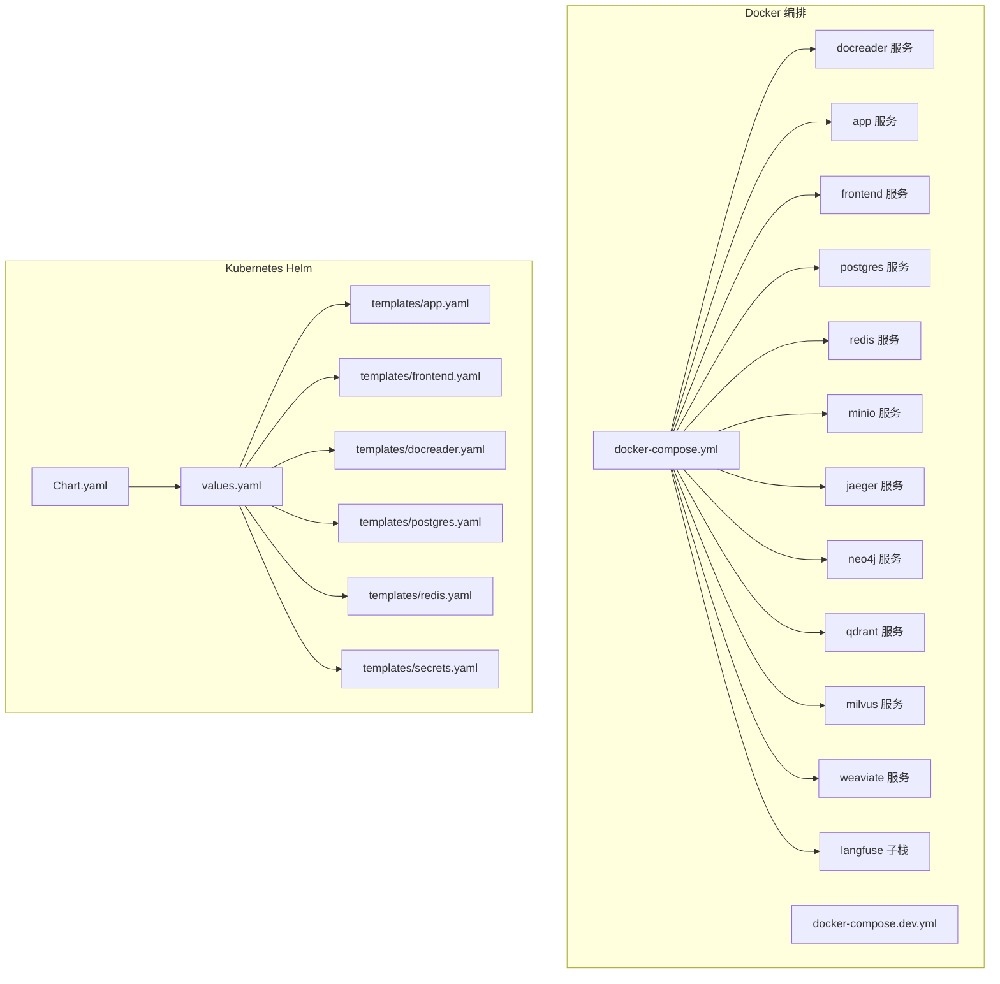
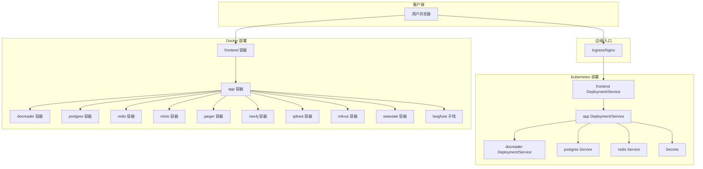
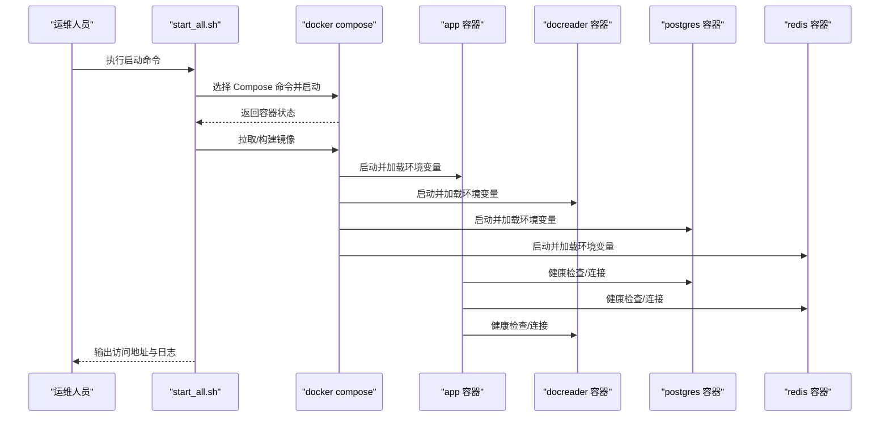
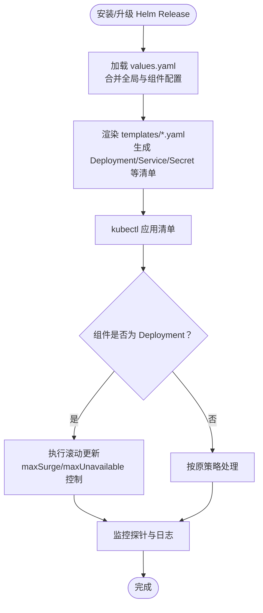
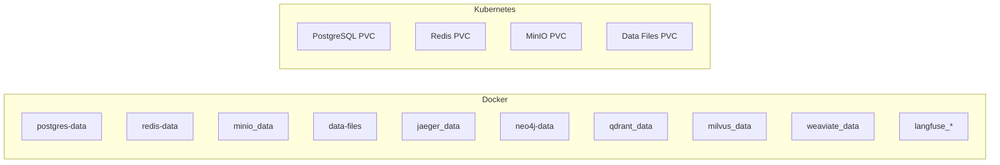
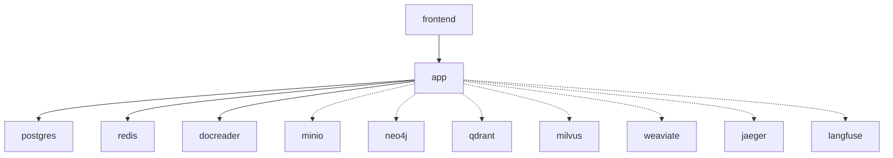

# 部署与运维

<cite>
**本文引用的文件**   
- [docker-compose.yml](file://docker-compose.yml)
- [docker-compose.dev.yml](file://docker-compose.dev.yml)
- [docker/Dockerfile.docreader](file://docker/Dockerfile.docreader)
- [docker/Dockerfile.sandbox](file://docker/Dockerfile.sandbox)
- [docker/config/supervisord.conf](file://docker/config/supervisord.conf)
- [helm/Chart.yaml](file://helm/Chart.yaml)
- [helm/values.yaml](file://helm/values.yaml)
- [helm/templates/app.yaml](file://helm/templates/app.yaml)
- [helm/templates/frontend.yaml](file://helm/templates/frontend.yaml)
- [helm/templates/docreader.yaml](file://helm/templates/docreader.yaml)
- [helm/templates/postgres.yaml](file://helm/templates/postgres.yaml)
- [helm/templates/redis.yaml](file://helm/templates/redis.yaml)
- [helm/templates/secrets.yaml](file://helm/templates/secrets.yaml)
- [scripts/build_images.sh](file://scripts/build_images.sh)
- [scripts/start_all.sh](file://scripts/start_all.sh)
- [scripts/migrate.sh](file://scripts/migrate.sh)
</cite>

## 目录
1. [简介](#简介)
2. [项目结构](#项目结构)
3. [核心组件](#核心组件)
4. [架构总览](#架构总览)
5. [详细组件分析](#详细组件分析)
6. [依赖关系分析](#依赖关系分析)
7. [性能考量](#性能考量)
8. [故障排除指南](#故障排除指南)
9. [结论](#结论)
10. [附录](#附录)

## 简介
本文件为 WeKnora 的部署与运维技术文档，覆盖 Docker 与 Kubernetes（Helm）两种部署形态，重点包括：
- Docker 单机/多服务编排与环境变量管理
- Kubernetes/Helm Chart 的组件拆分、资源配置与滚动更新策略
- 数据持久化、备份与恢复、滚动更新策略
- 生产部署最佳实践、性能调优与故障排除
- 容器化优势、微服务运维要点与自动化运维工具链

## 项目结构
WeKnora 提供两套主要部署方式：
- Docker Compose：单机/多服务一体化编排，适合开发测试与小规模生产
- Helm Chart：面向 Kubernetes 的声明式部署，支持滚动更新、资源隔离与可观察性

图表来源
- [docker-compose.yml:1-613](file://docker-compose.yml#L1-L613)
- [docker-compose.dev.yml:1-420](file://docker-compose.dev.yml#L1-L420)
- [helm/Chart.yaml:1-27](file://helm/Chart.yaml#L1-L27)
- [helm/values.yaml:1-493](file://helm/values.yaml#L1-L493)
- [helm/templates/app.yaml:1-200](file://helm/templates/app.yaml#L1-L200)
- [helm/templates/frontend.yaml:1-113](file://helm/templates/frontend.yaml#L1-L113)
- [helm/templates/docreader.yaml:1-103](file://helm/templates/docreader.yaml#L1-L103)
- [helm/templates/postgres.yaml:1-129](file://helm/templates/postgres.yaml#L1-L129)
- [helm/templates/redis.yaml:1-125](file://helm/templates/redis.yaml#L1-L125)
- [helm/templates/secrets.yaml:1-40](file://helm/templates/secrets.yaml#L1-L40)

章节来源
- [docker-compose.yml:1-613](file://docker-compose.yml#L1-L613)
- [docker-compose.dev.yml:1-420](file://docker-compose.dev.yml#L1-L420)
- [helm/Chart.yaml:1-27](file://helm/Chart.yaml#L1-L27)
- [helm/values.yaml:1-493](file://helm/values.yaml#L1-L493)

## 核心组件
- 应用服务（App）：后端 API 服务器，负责业务逻辑、消息处理、检索与存储对接、可观测性集成等
- 前端服务（Frontend）：静态 Web UI，通过 Nginx 暴露，反向代理至后端服务
- 文档解析服务（DocReader）：gRPC 文档解析与图片提取服务
- 数据库（PostgreSQL/ParadeDB）：提供向量检索与全文检索能力
- 缓存队列（Redis）：流管理与异步任务队列
- 对象存储（MinIO）：S3 兼容的对象存储，用于文件与媒体
- 可观测性（Jaeger）：分布式链路追踪
- 图数据库（Neo4j）：可选的知识图谱能力
- 向量库（Qdrant/Milvus/Weaviate）：可选的向量检索后端
- Langfuse：可选的自建可观测栈（复用现有 Postgres/Redis）

章节来源
- [docker-compose.yml:28-157](file://docker-compose.yml#L28-L157)
- [docker-compose.yml:173-199](file://docker-compose.yml#L173-L199)
- [docker-compose.yml:200-221](file://docker-compose.yml#L200-L221)
- [docker-compose.yml:222-227](file://docker-compose.yml#L222-L227)
- [docker-compose.yml:230-252](file://docker-compose.yml#L230-L252)
- [docker-compose.yml:253-277](file://docker-compose.yml#L253-L277)
- [docker-compose.yml:278-298](file://docker-compose.yml#L278-L298)
- [docker-compose.yml:299-313](file://docker-compose.yml#L299-L313)
- [docker-compose.yml:314-341](file://docker-compose.yml#L314-L341)
- [docker-compose.yml:342-362](file://docker-compose.yml#L342-L362)
- [docker-compose.yml:365-376](file://docker-compose.yml#L365-L376)
- [docker-compose.yml:395-428](file://docker-compose.yml#L395-L428)
- [docker-compose.yml:430-481](file://docker-compose.yml#L430-L481)
- [docker-compose.yml:482-595](file://docker-compose.yml#L482-L595)

## 架构总览
下图展示 WeKnora 的典型部署拓扑与交互关系，涵盖 Docker 与 Kubernetes 两种形态的关键组件。

图表来源
- [helm/templates/frontend.yaml:1-113](file://helm/templates/frontend.yaml#L1-L113)
- [helm/templates/app.yaml:1-200](file://helm/templates/app.yaml#L1-L200)
- [helm/templates/docreader.yaml:1-103](file://helm/templates/docreader.yaml#L1-L103)
- [helm/templates/postgres.yaml:1-129](file://helm/templates/postgres.yaml#L1-L129)
- [helm/templates/redis.yaml:1-125](file://helm/templates/redis.yaml#L1-L125)
- [helm/templates/secrets.yaml:1-40](file://helm/templates/secrets.yaml#L1-L40)
- [docker-compose.yml:28-157](file://docker-compose.yml#L28-L157)
- [docker-compose.yml:173-199](file://docker-compose.yml#L173-L199)
- [docker-compose.yml:200-221](file://docker-compose.yml#L200-L221)
- [docker-compose.yml:222-227](file://docker-compose.yml#L222-L227)
- [docker-compose.yml:230-252](file://docker-compose.yml#L230-L252)
- [docker-compose.yml:253-277](file://docker-compose.yml#L253-L277)
- [docker-compose.yml:278-298](file://docker-compose.yml#L278-L298)
- [docker-compose.yml:299-313](file://docker-compose.yml#L299-L313)
- [docker-compose.yml:314-341](file://docker-compose.yml#L314-L341)
- [docker-compose.yml:342-362](file://docker-compose.yml#L342-L362)
- [docker-compose.yml:365-376](file://docker-compose.yml#L365-L376)
- [docker-compose.yml:395-428](file://docker-compose.yml#L395-L428)
- [docker-compose.yml:430-481](file://docker-compose.yml#L430-L481)
- [docker-compose.yml:482-595](file://docker-compose.yml#L482-L595)

## 详细组件分析

### Docker 部署流程与环境变量管理
- 启动脚本：提供一键启动/停止、拉取镜像、检查环境、列出容器、重启指定容器等能力
- 编排文件：定义服务、网络、卷、健康检查、依赖顺序与环境变量
- 环境变量：集中于 docker-compose.yml 的 environment 字段，覆盖数据库、缓存、存储、向量库、可观测性、安全与功能开关等

图表来源
- [scripts/start_all.sh:340-388](file://scripts/start_all.sh#L340-L388)
- [docker-compose.yml:44-49](file://docker-compose.yml#L44-L49)
- [docker-compose.yml:188-193](file://docker-compose.yml#L188-L193)
- [docker-compose.yml:212-217](file://docker-compose.yml#L212-L217)
- [docker-compose.yml:148-154](file://docker-compose.yml#L148-L154)

章节来源
- [scripts/start_all.sh:1-773](file://scripts/start_all.sh#L1-L773)
- [docker-compose.yml:1-613](file://docker-compose.yml#L1-L613)

### Kubernetes/Helm 部署与滚动更新策略
- Chart 结构：Chart.yaml 定义元信息；values.yaml 定义全局与各组件的资源、安全上下文、环境变量、持久化与可选组件；templates 下为各组件清单
- 滚动更新：Deployment 默认使用 RollingUpdate，maxSurge 与 maxUnavailable 参数控制滚动过程中的并发度与可用性
- 资源与安全：各组件提供 requests/limits、Pod/Container 安全上下文、探针配置与亲和/反亲和、容忍与节点选择器
- 可选组件：通过 profiles/values 中的 enabled 字段启用/禁用 MinIO、Neo4j、Qdrant、Jaeger 等

图表来源
- [helm/Chart.yaml:1-27](file://helm/Chart.yaml#L1-L27)
- [helm/values.yaml:1-493](file://helm/values.yaml#L1-L493)
- [helm/templates/app.yaml:20-24](file://helm/templates/app.yaml#L20-L24)
- [helm/templates/frontend.yaml:20-24](file://helm/templates/frontend.yaml#L20-L24)
- [helm/templates/docreader.yaml:20-24](file://helm/templates/docreader.yaml#L20-L24)

章节来源
- [helm/Chart.yaml:1-27](file://helm/Chart.yaml#L1-L27)
- [helm/values.yaml:1-493](file://helm/values.yaml#L1-L493)
- [helm/templates/app.yaml:1-200](file://helm/templates/app.yaml#L1-L200)
- [helm/templates/frontend.yaml:1-113](file://helm/templates/frontend.yaml#L1-L113)
- [helm/templates/docreader.yaml:1-103](file://helm/templates/docreader.yaml#L1-L103)
- [helm/templates/postgres.yaml:1-129](file://helm/templates/postgres.yaml#L1-L129)
- [helm/templates/redis.yaml:1-125](file://helm/templates/redis.yaml#L1-L125)
- [helm/templates/secrets.yaml:1-40](file://helm/templates/secrets.yaml#L1-L40)

### 数据持久化策略
- Docker：通过 named volumes 持久化数据库、缓存、对象存储、日志与数据文件
- Kubernetes：PostgreSQL/Redis/MinIO 等通过 PVC 持久化；App 的数据文件通过 PVC 或 emptyDir/HostPath（按需配置）

图表来源
- [docker-compose.yml:600-613](file://docker-compose.yml#L600-L613)
- [helm/values.yaml:266-282](file://helm/values.yaml#L266-L282)
- [helm/values.yaml:312-329](file://helm/values.yaml#L312-L329)
- [helm/values.yaml:420-423](file://helm/values.yaml#L420-L423)
- [helm/templates/postgres.yaml:90-98](file://helm/templates/postgres.yaml#L90-L98)
- [helm/templates/redis.yaml:86-94](file://helm/templates/redis.yaml#L86-L94)

章节来源
- [docker-compose.yml:600-613](file://docker-compose.yml#L600-L613)
- [helm/values.yaml:266-282](file://helm/values.yaml#L266-L282)
- [helm/values.yaml:312-329](file://helm/values.yaml#L312-L329)
- [helm/values.yaml:420-423](file://helm/values.yaml#L420-L423)
- [helm/templates/postgres.yaml:90-98](file://helm/templates/postgres.yaml#L90-L98)
- [helm/templates/redis.yaml:86-94](file://helm/templates/redis.yaml#L86-L94)

### 备份与恢复机制
- 数据库迁移：提供 migrate.sh，支持 up/down/create/version/force/goto 等命令，便于版本化迁移与回滚
- 对象存储：MinIO 提供 S3 兼容接口，可结合外部备份策略（如快照、跨区域复制）
- 建议：定期导出数据库快照、备份 PVC、记录当前 Helm values 与 Secret 内容，验证恢复流程

章节来源
- [scripts/migrate.sh:1-122](file://scripts/migrate.sh#L1-L122)

### 滚动更新策略
- Kubernetes：Deployment 默认滚动更新，建议结合 Readiness Probe 与探针阈值，确保流量切换平滑
- Docker：Compose 通过重建与重启实现更新，建议配合健康检查与依赖顺序，避免级联失败

章节来源
- [helm/templates/app.yaml:153-160](file://helm/templates/app.yaml#L153-L160)
- [helm/templates/docreader.yaml:53-71](file://helm/templates/docreader.yaml#L53-L71)
- [docker-compose.yml:44-49](file://docker-compose.yml#L44-L49)
- [docker-compose.yml:188-193](file://docker-compose.yml#L188-L193)

### 生产环境部署最佳实践
- 密钥与敏感信息：使用 Secret/External Secrets/Sealed Secrets 管理，避免明文注入
- 资源配额：为各组件设置合理的 requests/limits，并结合 HPA/HPA-like 策略
- 网络与安全：启用 PodSecurityContext/ContainerSecurityContext，限制特权提升；Ingress 配置 TLS 与限流
- 可观测性：开启探针、日志聚合与指标采集；Jaeger/Langfuse 可选启用
- 存储：为数据库与对象存储配置持久化与快照策略；监控容量与 IO

章节来源
- [helm/templates/secrets.yaml:1-40](file://helm/templates/secrets.yaml#L1-L40)
- [helm/values.yaml:372-403](file://helm/values.yaml#L372-L403)
- [helm/values.yaml:344-370](file://helm/values.yaml#L344-L370)
- [docker-compose.yml:69-89](file://docker-compose.yml#L69-L89)

### 性能调优指南
- 资源：根据负载调整 CPU/内存 requests/limits；对高并发组件（如 app、docreader）适度扩容副本
- 连接池：合理配置数据库与缓存连接池大小，避免过度连接
- 检索：选择合适的向量库与检索驱动（Postgres/Qdrant/Milvus/Weaviate），并优化索引与查询参数
- I/O：对象存储与数据文件挂载使用高性能存储类；减少大文件频繁写入

章节来源
- [helm/values.yaml:68-77](file://helm/values.yaml#L68-L77)
- [helm/values.yaml:206-214](file://helm/values.yaml#L206-L214)
- [docker-compose.yml:95-101](file://docker-compose.yml#L95-L101)

### 自动化运维工具
- 镜像构建：build_images.sh 支持多平台、多镜像构建与清理
- 启停与诊断：start_all.sh 支持启动/停止、拉取镜像、检查环境、列出容器、重启指定容器、日志跟踪
- 迁移：migrate.sh 支持版本化迁移与回滚

章节来源
- [scripts/build_images.sh:1-393](file://scripts/build_images.sh#L1-L393)
- [scripts/start_all.sh:1-773](file://scripts/start_all.sh#L1-L773)
- [scripts/migrate.sh:1-122](file://scripts/migrate.sh#L1-L122)

## 依赖关系分析
- 组件耦合：App 依赖 Postgres、Redis、DocReader；Frontend 依赖 App；可选组件（MinIO、Neo4j、Qdrant、Milvus、Weaviate、Jaeger、Langfuse）按需启用
- 依赖链：App 启动前需 Postgres/Redis 就绪；DocReader 需对象存储（MinIO）以支持图片/文件处理（可选）

图表来源
- [docker-compose.yml:148-154](file://docker-compose.yml#L148-L154)
- [docker-compose.yml:173-199](file://docker-compose.yml#L173-L199)
- [docker-compose.yml:200-221](file://docker-compose.yml#L200-L221)
- [docker-compose.yml:222-227](file://docker-compose.yml#L222-L227)
- [docker-compose.yml:230-252](file://docker-compose.yml#L230-L252)
- [docker-compose.yml:253-277](file://docker-compose.yml#L253-L277)
- [docker-compose.yml:278-298](file://docker-compose.yml#L278-L298)
- [docker-compose.yml:299-313](file://docker-compose.yml#L299-L313)
- [docker-compose.yml:314-341](file://docker-compose.yml#L314-L341)
- [docker-compose.yml:342-362](file://docker-compose.yml#L342-L362)
- [docker-compose.yml:365-376](file://docker-compose.yml#L365-L376)
- [docker-compose.yml:395-428](file://docker-compose.yml#L395-L428)
- [docker-compose.yml:430-481](file://docker-compose.yml#L430-L481)
- [docker-compose.yml:482-595](file://docker-compose.yml#L482-L595)

章节来源
- [docker-compose.yml:1-613](file://docker-compose.yml#L1-L613)

## 性能考量
- 资源规划：根据并发与吞吐需求设定 requests/limits；对高负载组件（如 app、docreader、postgres）预留充足资源
- 存储性能：为数据库与对象存储配置 SSD/高性能存储类；避免小文件风暴
- 网络与延迟：将相关组件部署在同一可用区/拓扑，降低跨区网络开销
- 缓存策略：合理利用 Redis 缓存热点数据与会话状态
- 检索优化：针对向量库与全文检索后端，优化索引参数与查询策略

## 故障排除指南
- 健康检查失败：检查探针配置与依赖服务状态；查看容器日志定位异常
- 端口冲突：确认宿主机端口映射与容器端口配置
- 权限与密钥：核对 Secret 内容与权限；确保环境变量正确注入
- 存储问题：检查 PVC 绑定、存储类与容量；必要时扩容或更换存储
- 可观测性：通过 Jaeger/Langfuse 查看链路与指标，定位瓶颈

章节来源
- [docker-compose.yml:44-49](file://docker-compose.yml#L44-L49)
- [docker-compose.yml:188-193](file://docker-compose.yml#L188-L193)
- [docker-compose.yml:212-217](file://docker-compose.yml#L212-L217)
- [scripts/start_all.sh:530-610](file://scripts/start_all.sh#L530-L610)

## 结论
WeKnora 提供从 Docker 到 Kubernetes 的完整部署路径，具备清晰的组件边界与可插拔的可选能力。通过合理的资源规划、持久化与备份策略、滚动更新与可观测性配置，可在生产环境中稳定运行。建议结合自动化脚本与 GitOps 工具链，实现持续交付与快速恢复。

## 附录
- 镜像构建：build_images.sh 支持多平台与多镜像构建，便于本地与 CI 场景
- 启停与诊断：start_all.sh 提供一站式运维能力，覆盖启动、停止、拉取、检查、重启与日志
- 迁移：migrate.sh 提供版本化迁移与回滚能力，保障数据库演进安全

章节来源
- [scripts/build_images.sh:1-393](file://scripts/build_images.sh#L1-L393)
- [scripts/start_all.sh:1-773](file://scripts/start_all.sh#L1-L773)
- [scripts/migrate.sh:1-122](file://scripts/migrate.sh#L1-L122)