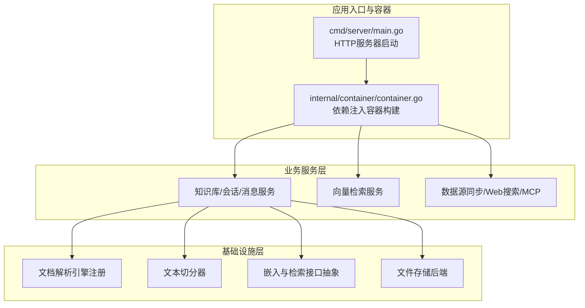
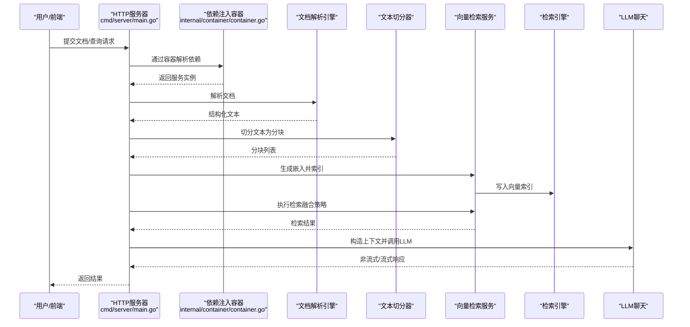
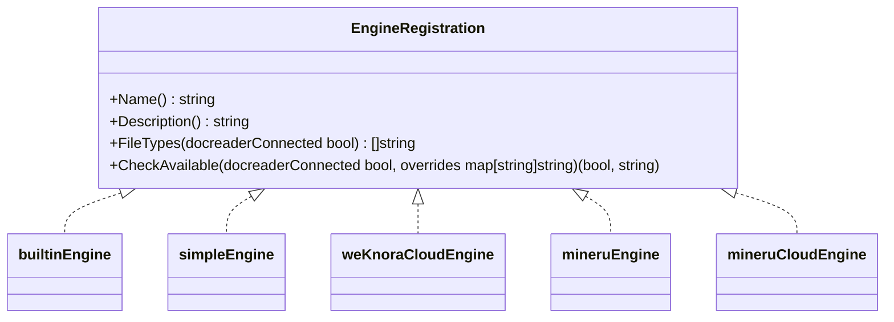
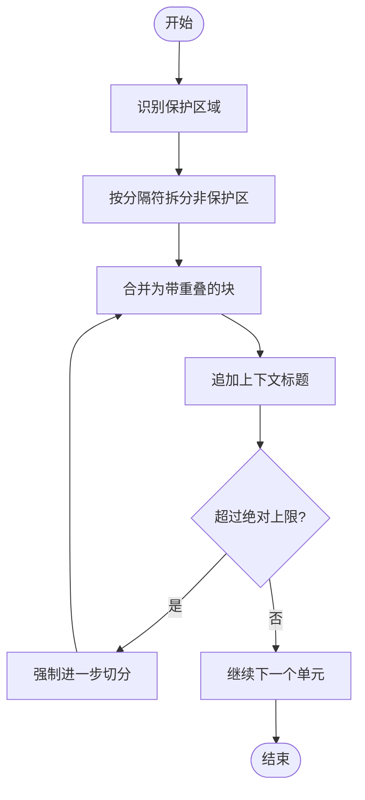
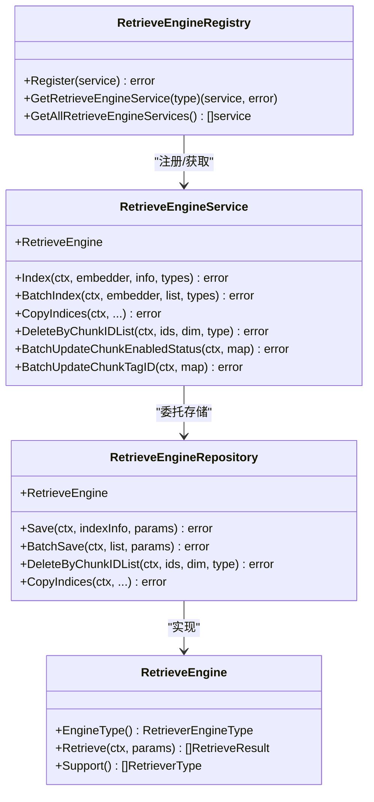
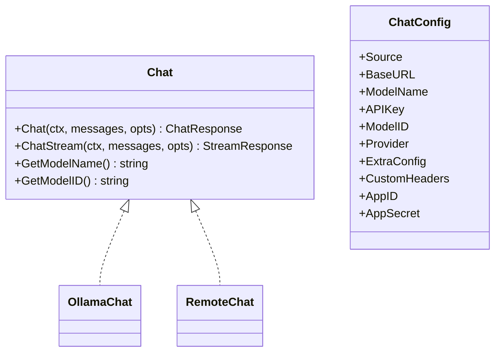
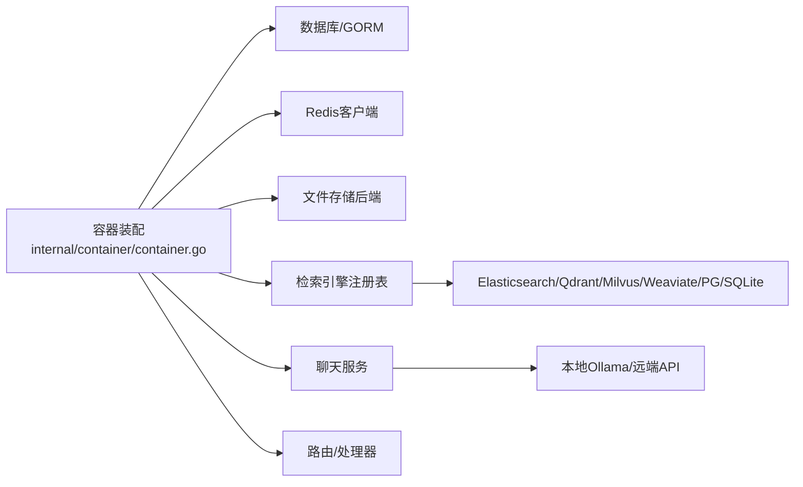

# 技术架构概览

<cite>
**本文引用的文件**
- [cmd/server/main.go](file://cmd/server/main.go)
- [internal/container/container.go](file://internal/container/container.go)
- [internal/models/chat/chat.go](file://internal/models/chat/chat.go)
- [internal/application/repository/vectorstore.go](file://internal/application/repository/vectorstore.go)
- [internal/infrastructure/chunker/splitter.go](file://internal/infrastructure/chunker/splitter.go)
- [internal/types/embedding.go](file://internal/types/embedding.go)
- [internal/types/interfaces/retriever.go](file://internal/types/interfaces/retriever.go)
- [internal/infrastructure/docparser/engine_registry.go](file://internal/infrastructure/docparser/engine_registry.go)
</cite>

## 目录
1. [简介](#简介)
2. [项目结构](#项目结构)
3. [核心组件](#核心组件)
4. [架构总览](#架构总览)
5. [详细组件分析](#详细组件分析)
6. [依赖关系分析](#依赖关系分析)
7. [性能考量](#性能考量)
8. [故障排查指南](#故障排查指南)
9. [结论](#结论)
10. [附录](#附录)

## 简介
本文件面向WeKnora项目的整体技术架构，围绕“文档解析—向量化—检索—LLM推理”的完整模块化处理管线进行系统化梳理。重点阐述：
- 各子系统的职责边界与交互关系
- 数据在系统中的流向与转换
- 可插拔设计（LLM提供商、向量数据库、存储后端）
- 性能、可扩展性与安全性的设计权衡
- 异步任务管理、缓存策略、负载均衡等关键技术点

## 项目结构
WeKnora采用分层与模块化结合的组织方式：
- 应用入口与容器装配：服务启动、依赖注入、路由与任务队列初始化
- 业务域：知识库、会话、消息、向量检索、数据源同步、Web搜索、MCP服务等
- 基础设施：文档解析引擎注册与选择、文本切分器、嵌入与检索接口抽象、文件存储后端
- 类型与接口：统一的数据模型、检索接口契约、嵌入与检索枚举

**图表来源**
- [cmd/server/main.go:43-123](file://cmd/server/main.go#L43-L123)
- [internal/container/container.go:93-311](file://internal/container/container.go#L93-L311)

**章节来源**
- [cmd/server/main.go:43-123](file://cmd/server/main.go#L43-L123)
- [internal/container/container.go:93-311](file://internal/container/container.go#L93-L311)

## 核心组件
- 服务器与容器
  - 通过依赖注入容器集中装配服务、仓库、处理器与外部客户端，支持多数据库、多向量引擎、多存储后端的动态切换
- 文档解析与切分
  - 解析引擎注册与可用性检查；基于保护区域与分隔符的递归切分，支持父子级分块与图像引用提取
- 向量检索与嵌入
  - 统一的检索接口契约，支持多种检索引擎（PostgreSQL、Elasticsearch、Qdrant、Milvus、Weaviate、SQLite等），并提供批量嵌入与索引复制能力
- LLM推理与聊天
  - 支持本地Ollama与远端兼容API，提供非流式与流式对话接口，并具备调试包装与链路追踪封装
- 文件存储后端
  - 支持本地、MinIO、COS、S3、OSS等多种对象存储，按租户隔离与路径前缀管理

**章节来源**
- [internal/container/container.go:118-262](file://internal/container/container.go#L118-L262)
- [internal/infrastructure/chunker/splitter.go:142-571](file://internal/infrastructure/chunker/splitter.go#L142-L571)
- [internal/types/interfaces/retriever.go:10-133](file://internal/types/interfaces/retriever.go#L10-L133)
- [internal/models/chat/chat.go:132-177](file://internal/models/chat/chat.go#L132-L177)
- [internal/container/container.go:639-747](file://internal/container/container.go#L639-L747)

## 架构总览
WeKnora的处理管线以“文档解析—向量化—检索—LLM推理”为主线，贯穿以下关键阶段：
- 文档解析：根据文件类型与可用性选择解析引擎（本地或云端），输出结构化文本与元信息
- 文本切分：依据保护区域与分隔符生成带重叠的分块，支持父子分块增强上下文
- 向量化与索引：对分块生成嵌入向量并写入检索引擎（可按引擎类型选择），支持批量与复制
- 检索融合：结合关键词、嵌入、历史、图谱、数据分析等多路结果进行融合排序
- LLM推理：将上下文与工具调用注入模型，支持非流式与流式响应

**图表来源**
- [cmd/server/main.go:43-123](file://cmd/server/main.go#L43-L123)
- [internal/container/container.go:93-311](file://internal/container/container.go#L93-L311)
- [internal/infrastructure/docparser/engine_registry.go:140-193](file://internal/infrastructure/docparser/engine_registry.go#L140-L193)
- [internal/infrastructure/chunker/splitter.go:142-377](file://internal/infrastructure/chunker/splitter.go#L142-L377)
- [internal/types/interfaces/retriever.go:77-133](file://internal/types/interfaces/retriever.go#L77-L133)
- [internal/models/chat/chat.go:132-177](file://internal/models/chat/chat.go#L132-L177)

## 详细组件分析

### 1) 文档解析与引擎注册
- 功能要点
  - 本地引擎注册：内置、简单引擎、WeKnoraCloud、MinerU、MinerU Cloud
  - 可用性检查：根据连接状态与配置项判断是否可用
  - 远程引擎合并：与DocReader服务发现的远程引擎合并，优先采用远程能力描述
- 关键接口
  - EngineRegistration：引擎名称、描述、文件类型、可用性检查
  - ListAllEngines：合并本地与远程引擎，返回可用列表

**图表来源**
- [internal/infrastructure/docparser/engine_registry.go:9-193](file://internal/infrastructure/docparser/engine_registry.go#L9-L193)

**章节来源**
- [internal/infrastructure/docparser/engine_registry.go:140-193](file://internal/infrastructure/docparser/engine_registry.go#L140-L193)

### 2) 文本切分与父子分块
- 功能要点
  - 保护区域识别：公式、图片、链接、表格、代码块等不可分割片段
  - 分隔符优先级：段落、换行、中文句号等
  - 重叠拼接：控制块大小与重叠长度，避免语义断裂
  - 父子分块：先大窗口父块再小窗口子块，便于检索与回溯
  - 图像引用提取：用于后续多媒体处理
- 复杂度与优化
  - 时间复杂度近似线性于文本长度，受保护区域数量影响
  - 通过绝对最大块限制与头部上下文预拼接，平衡下游API限制与上下文完整性

**图表来源**
- [internal/infrastructure/chunker/splitter.go:142-377](file://internal/infrastructure/chunker/splitter.go#L142-L377)

**章节来源**
- [internal/infrastructure/chunker/splitter.go:142-571](file://internal/infrastructure/chunker/splitter.go#L142-L571)

### 3) 向量检索与嵌入接口
- 接口抽象
  - RetrieveEngine：检索执行、支持类型、引擎类型
  - RetrieveEngineRepository：索引保存、批量保存、删除、复制索引、更新状态
  - RetrieveEngineRegistry/Service：注册检索服务、批量索引、估算存储、复制索引
- 支持的检索引擎
  - PostgreSQL、Elasticsearch v7/v8、Qdrant、Milvus、Weaviate、SQLite等
- 嵌入与索引
  - 支持批量嵌入与跨知识库索引复制，减少重复计算成本

**图表来源**
- [internal/types/interfaces/retriever.go:10-133](file://internal/types/interfaces/retriever.go#L10-L133)

**章节来源**
- [internal/types/interfaces/retriever.go:10-133](file://internal/types/interfaces/retriever.go#L10-L133)
- [internal/application/repository/vectorstore.go:17-102](file://internal/application/repository/vectorstore.go#L17-L102)
- [internal/container/container.go:759-820](file://internal/container/container.go#L759-L820)

### 4) LLM聊天与推理
- 聊天接口
  - Chat接口：非流式与流式对话、模型名称与ID获取
  - ChatConfig：模型来源（本地/远端）、基础地址、API Key、提供商、额外配置、自定义头部
- 实例创建
  - NewChat根据来源选择本地Ollama或远端兼容API，并包裹调试与链路追踪
- 远端适配
  - 基于提供商规范定制请求、端点与头部，提升兼容性

**图表来源**
- [internal/models/chat/chat.go:81-177](file://internal/models/chat/chat.go#L81-L177)

**章节来源**
- [internal/models/chat/chat.go:132-177](file://internal/models/chat/chat.go#L132-L177)

### 5) 文件存储后端
- 支持类型
  - MinIO、COS、TOS、S3、OSS、本地、Dummy
- 初始化逻辑
  - 读取环境变量，校验必要参数，构造对应文件服务实例
- 隔离与前缀
  - 按租户隔离，支持路径前缀，便于多租户与多版本共存

**章节来源**
- [internal/container/container.go:639-747](file://internal/container/container.go#L639-L747)

## 依赖关系分析
- 容器装配
  - 通过BuildContainer集中注册数据库、检索引擎注册表、文件服务、聊天与检索服务、处理器与路由等
  - 支持异步任务队列（Asynq）与同步执行两种模式，依据Redis可用性自动切换
- 服务耦合与内聚
  - 服务层通过接口与仓库层解耦，检索引擎通过注册表实现可插拔
  - 文档解析与切分作为独立基础设施，被知识服务复用
- 外部依赖
  - 向量数据库与搜索引擎客户端、Redis、数据库驱动、对象存储SDK等均通过容器注入

**图表来源**
- [internal/container/container.go:93-311](file://internal/container/container.go#L93-L311)

**章节来源**
- [internal/container/container.go:93-311](file://internal/container/container.go#L93-L311)

## 性能考量
- 并发与连接池
  - 数据库连接池参数按驱动类型设置，SQLite限制并发写入以避免锁冲突
- 异步任务
  - Asynq分布式队列与同步执行双模，Lite模式下自动清理挂起任务，降低重启抖动
- 缓存与上下文
  - Redis上下文存储与内存回退，避免频繁重建上下文
- 检索效率
  - 多引擎注册与融合策略，结合关键词、嵌入、历史与图谱结果，提升召回质量
- 文本切分
  - 保护区域与绝对上限控制，兼顾下游API限制与上下文完整性

**章节来源**
- [internal/container/container.go:514-526](file://internal/container/container.go#L514-L526)
- [internal/container/container.go:583-628](file://internal/container/container.go#L583-L628)
- [internal/container/container.go:370-380](file://internal/container/container.go#L370-L380)
- [internal/infrastructure/chunker/splitter.go:263-377](file://internal/infrastructure/chunker/splitter.go#L263-L377)

## 故障排查指南
- 启动与优雅停机
  - 信号监听与二次信号强制关闭，确保资源清理与端口释放
- 数据库迁移
  - 自动迁移可禁用，脏库可自动恢复；序列同步避免主键冲突
- 任务状态异常
  - Lite模式重启后重置挂起任务状态，避免无限卡死
- 存储后端
  - 缺少必要配置将直接报错，便于快速定位
- 检索引擎
  - 注册失败日志记录，确认连接参数与可用性

**章节来源**
- [cmd/server/main.go:72-119](file://cmd/server/main.go#L72-L119)
- [internal/container/container.go:477-507](file://internal/container/container.go#L477-L507)
- [internal/container/container.go:556-581](file://internal/container/container.go#L556-L581)
- [internal/container/container.go:583-628](file://internal/container/container.go#L583-L628)
- [internal/container/container.go:639-747](file://internal/container/container.go#L639-L747)
- [internal/container/container.go:759-820](file://internal/container/container.go#L759-L820)

## 结论
WeKnora通过容器化装配与接口抽象实现了高度可插拔的模块化架构。从文档解析到向量化、检索再到LLM推理，系统在保证扩展性的同时兼顾性能与稳定性：多引擎检索、异步任务、缓存与上下文管理、严格的错误处理与可观测性，共同构成可运维、可演进的知识处理平台。

## 附录
- 关键枚举与类型
  - 源类型与匹配类型：用于区分索引来源与检索算法
  - 检索引擎类型与检索类型：统一检索接口契约，便于扩展新引擎

**章节来源**
- [internal/types/embedding.go:28-42](file://internal/types/embedding.go#L28-L42)
- [internal/types/interfaces/retriever.go:67-75](file://internal/types/interfaces/retriever.go#L67-L75)