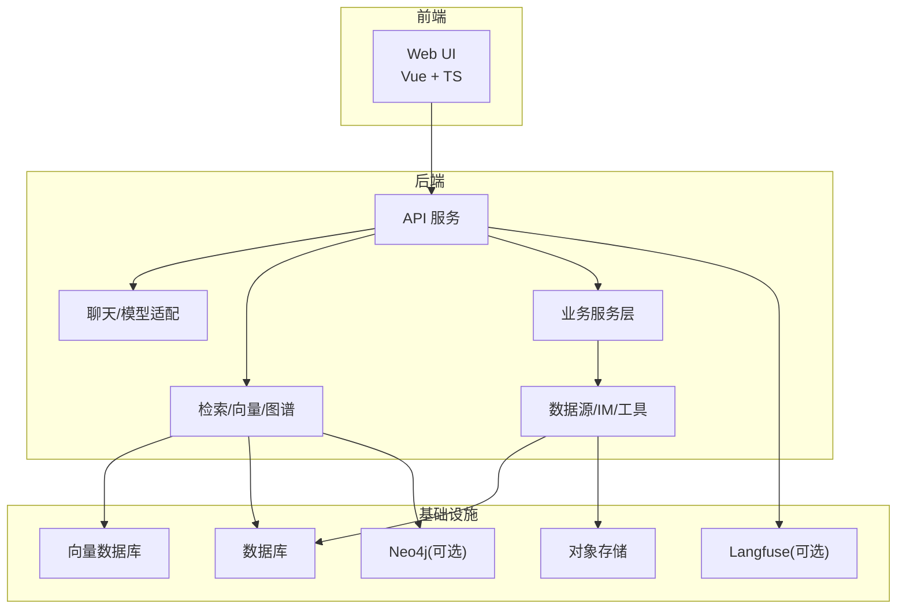
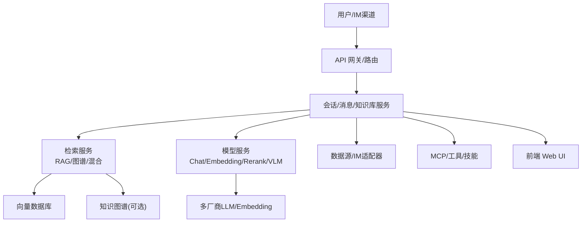
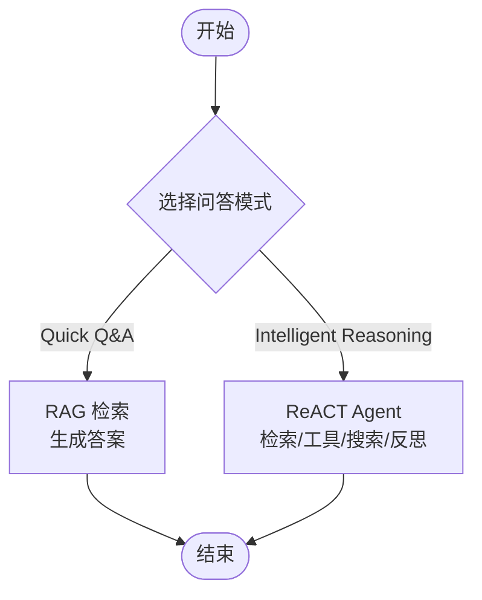
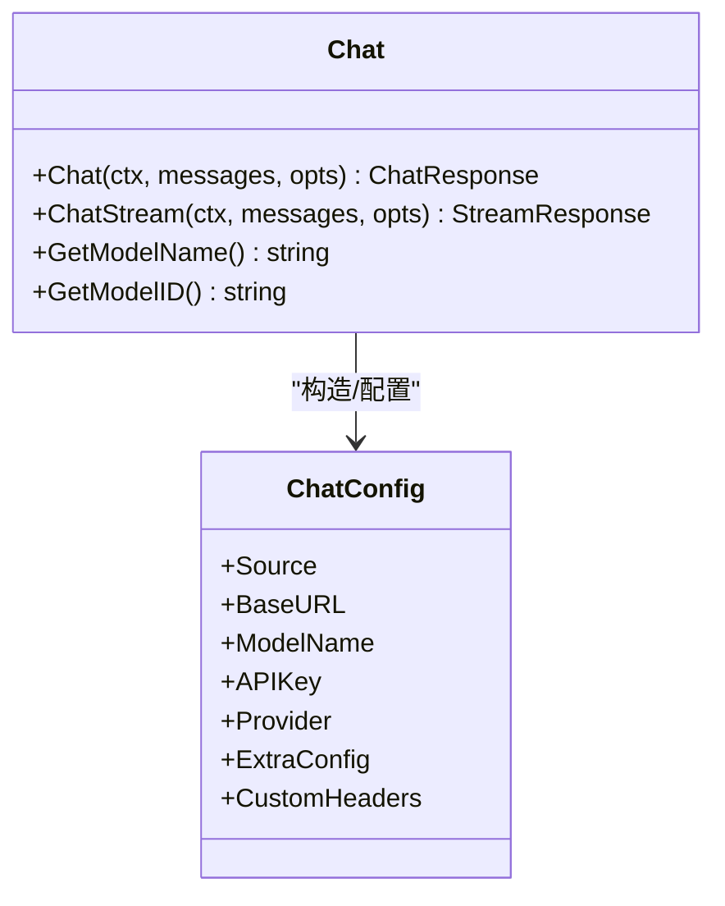
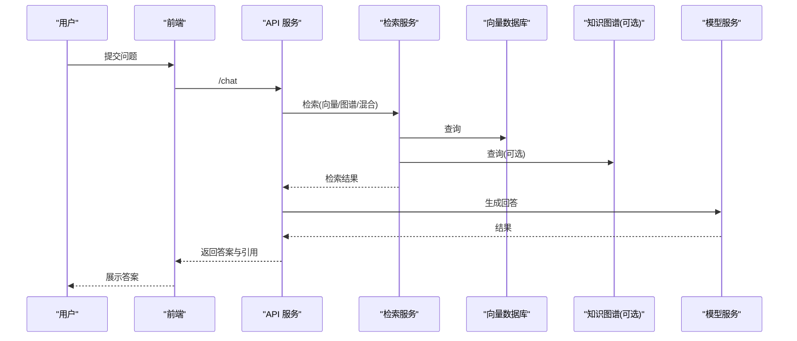
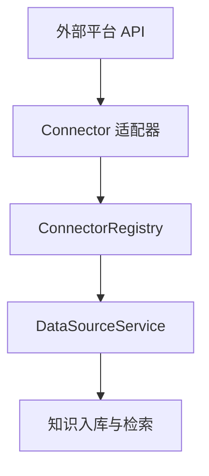
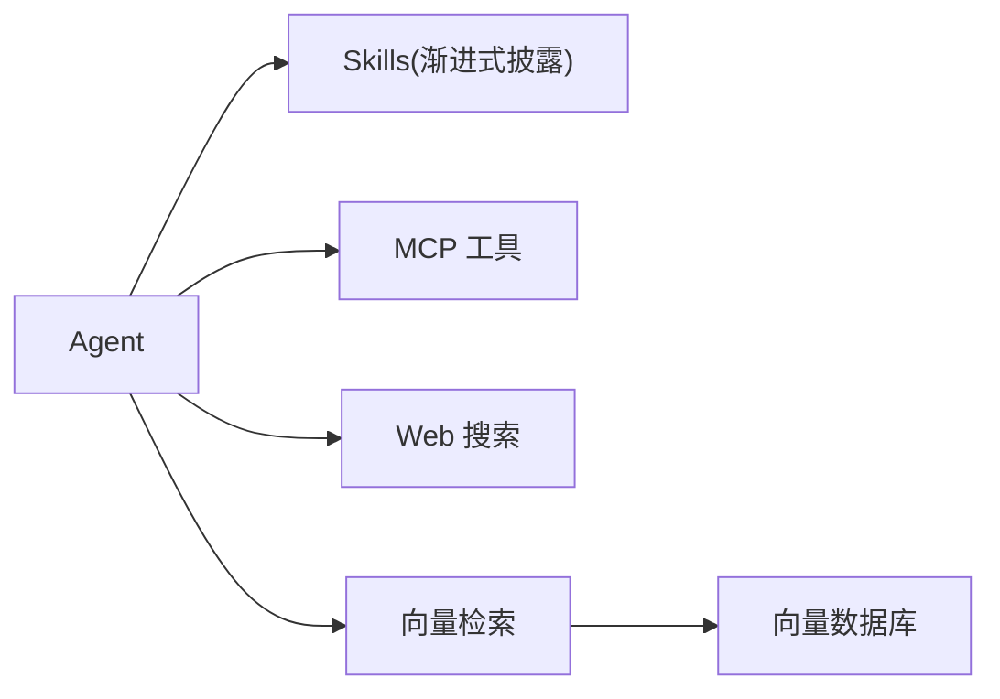
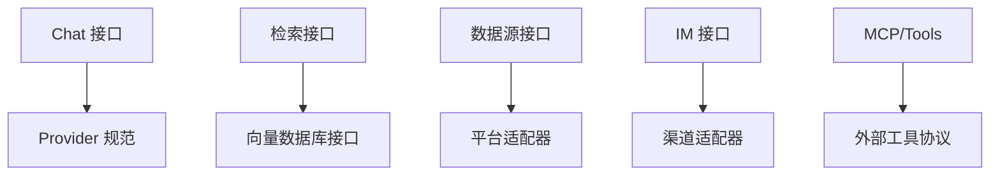

# 核心价值与定位

<cite>
**本文引用的文件**
- [README_CN.md](file://README_CN.md)
- [README.md](file://README.md)
- [config.yaml](file://config/config.yaml)
- [chat.go](file://internal/models/chat/chat.go)
- [chat.go](file://internal/types/chat.go)
- [Agent技能系统.md](file://docs/wiki/核心功能/Agent技能系统.md)
- [知识图谱.md](file://docs/wiki/核心功能/知识图谱.md)
- [开启知识图谱功能.md](file://docs/wiki/核心功能/开启知识图谱功能.md)
- [内置模型管理.md](file://docs/wiki/核心功能/内置模型管理.md)
- [数据源导入开发.md](file://docs/wiki/集成扩展/数据源导入开发.md)
- [集成向量数据库.md](file://docs/wiki/集成扩展/集成向量数据库.md)
- [evaluation.md](file://docs/api/evaluation.md)
- [evaluation.go](file://client/evaluation.go)
- [mrr.go](file://internal/application/service/metric/mrr.go)
- [metric_hook.go](file://internal/application/service/metric_hook.go)
- [settings.ts](file://frontend/src/stores/settings.ts)
- [values.yaml](file://helm/values.yaml)
- [README.md](file://helm/README.md)
- [Langfuse集成.md](file://docs/Langfuse集成.md)
</cite>

## 目录
1. [简介](#简介)
2. [项目结构](#项目结构)
3. [核心组件](#核心组件)
4. [架构总览](#架构总览)
5. [详细组件分析](#详细组件分析)
6. [依赖分析](#依赖分析)
7. [性能考量](#性能考量)
8. [故障排查指南](#故障排查指南)
9. [结论](#结论)
10. [附录](#附录)

## 简介
WeKnora 是一款面向企业级场景的 LLM 驱动智能知识管理与问答框架，聚焦“文档理解 + 语义检索”，提供两大问答模式：Quick Q&A（RAG 快速问答）与 Intelligent Reasoning（ReACT 智能推理）。其核心价值在于：
- 解决企业知识孤岛与检索效率低下的痛点，通过多模态解析、向量检索、图谱增强与工具编排，显著提升知识获取与决策效率。
- 以模块化设计实现“可替换、可扩展、可治理”的全链路能力，支持本地/私有云部署，保障数据主权。
- 面向不同行业与规模的企业，提供从“快速问答”到“复杂推理+工具编排”的灵活方案。

## 项目结构
WeKnora 采用前后端分离与多模块协同的工程组织方式，核心模块包括：
- 后端服务与核心业务：internal/（聊天、检索、知识库、数据源、IM、MCP、模型与向量等）
- 前端应用：frontend/（Vue + TS，提供 Web UI 与交互）
- 配置与模板：config/（系统配置、提示词模板）
- 文档与 Wiki：docs/（API、集成、运维、功能说明）
- Helm 与部署：helm/（Kubernetes 部署清单）
- 辅助工具：client/（Go 客户端）、docreader/（文档解析子项目）

**图表来源**
- [README_CN.md:162-166](file://README_CN.md#L162-L166)
- [README.md:164-168](file://README.md#L164-L168)

**章节来源**
- [README_CN.md:338-353](file://README_CN.md#L338-L353)
- [README.md:333-348](file://README.md#L333-L348)

## 核心组件
- 问答模式与对话管线
  - Quick Q&A：基于 RAG 的快速检索与生成，适合日常知识查询。
  - Intelligent Reasoning：ReACT Agent 引擎，支持知识检索、MCP 工具与网络搜索的渐进式编排，适合复杂任务与多源合成。
- 模型与提示词体系
  - 支持多厂商 LLM、Embedding、Rerank、VLM，统一通过 Chat 接口抽象与 Provider 规范化适配。
  - 提示词模板集中管理，支持会话标题生成、摘要生成、重写、意图识别等。
- 检索与知识图谱
  - 多种检索策略（BM25、Dense、GraphRAG、父子分块、多维索引）与向量数据库可插拔。
  - 知识图谱（Neo4j）可选启用，实现实体/关系抽取与检索增强。
- 数据源与 IM 集成
  - 飞书、Notion 等外部平台自动同步；IM 渠道（企业微信、飞书、Slack、Telegram、钉钉、Mattermost、微信）直连问答。
- 模块化与扩展
  - 向量数据库、存储后端、模型供应商均可替换；MCP 与 Skills 机制支持工具与能力扩展。

**章节来源**
- [README_CN.md:47](file://README_CN.md#L47)
- [README.md:47](file://README.md#L47)
- [config.yaml:1-113](file://config/config.yaml#L1-L113)
- [知识图谱.md:1-51](file://docs/wiki/核心功能/知识图谱.md#L1-L51)
- [集成向量数据库.md:1-78](file://docs/wiki/集成扩展/集成向量数据库.md#L1-L78)
- [数据源导入开发.md:1-88](file://docs/wiki/集成扩展/数据源导入开发.md#L1-L88)

## 架构总览
WeKnora 的整体架构强调“模块化、可替换、可观测”。从文档解析、向量化、检索到 LLM 推理，全链路可插拔；前端提供零门槛 Web UI，后端通过统一 API 与服务层承接业务。

**图表来源**
- [README_CN.md:162-166](file://README_CN.md#L162-L166)
- [README.md:164-168](file://README.md#L164-L168)

## 详细组件分析

### 两大问答模式的设计理念与差异
- Quick Q&A（RAG 快速问答）
  - 设计理念：以“高吞吐、低延迟”为目标，通过向量检索与提示词模板快速生成答案，适合高频、标准问答场景。
  - 技术优势：检索阈值、重排、摘要生成、兜底策略等参数化配置，兼顾准确性与稳定性。
- Intelligent Reasoning（智能推理）
  - 设计理念：以“强推理、可编排”为目标，ReACT Agent 通过多轮检索、工具调用与反思逐步逼近结论，适合复杂任务与多源融合。
  - 技术优势：支持 MCP 工具、Web 搜索、Skills 扩展、并行工具调用、思考模式与反射输出，提升复杂问题的解决能力。
- 适用场景差异
  - Quick Q&A：制度查询、操作手册、FAQ、政策解读等。
  - Intelligent Reasoning：竞品分析、合规审查、研发设计、跨部门协作等。

**图表来源**
- [README_CN.md:47](file://README_CN.md#L47)
- [README.md:47](file://README.md#L47)

**章节来源**
- [README_CN.md:47](file://README_CN.md#L47)
- [README.md:47](file://README.md#L47)
- [settings.ts:363-385](file://frontend/src/stores/settings.ts#L363-L385)

### 模型与提示词体系
- Chat 接口抽象
  - 统一的 Chat 接口封装本地 Ollama 与远程 LLM（OpenAI、Azure OpenAI、Qwen、Gemini 等），支持温度、采样、工具调用、并行工具调用、格式化输出等参数。
- 提示词模板
  - 会话标题生成、摘要生成、重写、意图识别、图谱抽取等模板集中管理，支持按 ID 动态加载。
- 内置模型管理
  - 系统级内置模型对所有租户可见，参数自动隐藏与只读保护，便于统一默认配置与合规管理。

**图表来源**
- [chat.go:82-94](file://internal/models/chat/chat.go#L82-L94)
- [chat.go:96-130](file://internal/models/chat/chat.go#L96-L130)

**章节来源**
- [chat.go:1-177](file://internal/models/chat/chat.go#L1-L177)
- [config.yaml:1-113](file://config/config.yaml#L1-L113)
- [内置模型管理.md:1-84](file://docs/wiki/核心功能/内置模型管理.md#L1-L84)

### 检索与知识图谱
- 检索策略
  - 支持 BM25、Dense、GraphRAG、父子分块、多维索引等策略；向量数据库可插拔（PostgreSQL/pgvector、Elasticsearch、Milvus、Weaviate、Qdrant 等）。
- 知识图谱
  - 可选启用 Neo4j，支持实体/关系抽取与检索增强；前端提供可视化入口，对话时自动查询并补充信息。

**图表来源**
- [知识图谱.md:27-37](file://docs/wiki/核心功能/知识图谱.md#L27-L37)
- [开启知识图谱功能.md:18-95](file://docs/wiki/核心功能/开启知识图谱功能.md#L18-L95)

**章节来源**
- [集成向量数据库.md:14-78](file://docs/wiki/集成扩展/集成向量数据库.md#L14-L78)
- [知识图谱.md:1-51](file://docs/wiki/核心功能/知识图谱.md#L1-L51)
- [开启知识图谱功能.md:1-105](file://docs/wiki/核心功能/开启知识图谱功能.md#L1-L105)

### 数据源与 IM 集成
- 数据源导入
  - 通过 Connector 适配器与 Registry 模式对接飞书、Notion 等平台，支持增量/全量同步与冲突策略；凭证加密存储。
- IM 渠道
  - 支持企业微信、飞书、Slack、Telegram、钉钉、Mattermost、微信等，提供引用回复、线程会话、斜杠命令与队列管理。

**图表来源**
- [数据源导入开发.md:32-46](file://docs/wiki/集成扩展/数据源导入开发.md#L32-L46)

**章节来源**
- [数据源导入开发.md:1-88](file://docs/wiki/集成扩展/数据源导入开发.md#L1-L88)

### 模块化与扩展机制
- MCP 与 Skills
  - MCP 支持外部工具协议调用；Skills 通过 Prompt 注入实现“渐进式披露”，按需加载指令与资源，脚本在沙箱中安全执行。
- 向量数据库与存储后端
  - 通过标准化接口与注册机制，可快速接入新后端，满足不同规模与合规需求。

**图表来源**
- [Agent技能系统.md:23-45](file://docs/wiki/核心功能/Agent技能系统.md#L23-L45)

**章节来源**
- [Agent技能系统.md:1-111](file://docs/wiki/核心功能/Agent技能系统.md#L1-L111)
- [集成向量数据库.md:14-78](file://docs/wiki/集成扩展/集成向量数据库.md#L14-L78)

## 依赖分析
- 组件耦合与内聚
  - Chat 接口与 Provider 规范降低模型侧耦合；检索服务与向量数据库通过接口解耦；数据源与 IM 适配器通过 Registry/Adapter 模式实现高内聚低耦合。
- 外部依赖与集成点
  - LLM/Embedding/Rerank/VLM 多厂商适配；向量数据库与对象存储可替换；IM 与数据源通过协议/SDK 集成。
- 可能的循环依赖
  - 通过接口抽象与分层（types/interfaces/repository/service/handler）避免循环依赖；MCP 与 Skills 通过独立模块扩展。

**图表来源**
- [chat.go:82-94](file://internal/models/chat/chat.go#L82-L94)
- [集成向量数据库.md:14-24](file://docs/wiki/集成扩展/集成向量数据库.md#L14-L24)
- [数据源导入开发.md:32-36](file://docs/wiki/集成扩展/数据源导入开发.md#L32-L36)

**章节来源**
- [chat.go:1-177](file://internal/models/chat/chat.go#L1-L177)
- [集成向量数据库.md:14-78](file://docs/wiki/集成扩展/集成向量数据库.md#L14-L78)
- [数据源导入开发.md:32-46](file://docs/wiki/集成扩展/数据源导入开发.md#L32-L46)

## 性能考量
- 检索性能
  - 混合检索（向量+关键词）与重排（Rerank）可提升命中率与排序质量；父子分块与多维索引有助于上下文完整性与召回率。
- 推理性能
  - 并行工具调用（errgroup）与工具缓存可缩短复杂任务耗时；思考模式与反射输出减少无效往返。
- 成本与资源
  - 通过本地 Ollama 与多厂商 LLM 选择平衡成本；Langfuse 可按 tokens/分钟计量，辅助成本核算与优化。

**章节来源**
- [README_CN.md:186-188](file://README_CN.md#L186-L188)
- [README.md:189-191](file://README.md#L189-L191)
- [Langfuse集成.md:258-269](file://docs/Langfuse集成.md#L258-L269)

## 故障排查指南
- 检索与评估
  - 使用评估 API 提交任务，配置检索阈值、重排模型与摘要参数，获取任务状态与结果；通过 MRR、BLEU/ROUGE 等指标评估召回与生成质量。
- 常见问题
  - 向量数据库/嵌入模型配置错误、知识图谱连接失败、IM 引用标签清理、MCP 重连与并发工具调用异常等均有对应排查指引。

**章节来源**
- [evaluation.md:111-155](file://docs/api/evaluation.md#L111-L155)
- [evaluation.go:76-113](file://client/evaluation.go#L76-L113)
- [mrr.go:1-48](file://internal/application/service/metric/mrr.go#L1-L48)
- [metric_hook.go:65-113](file://internal/application/service/metric_hook.go#L65-L113)

## 结论
WeKnora 以“模块化、可替换、可治理”为核心设计原则，围绕企业知识管理与智能问答场景，提供从快速问答到复杂推理的全栈能力。其差异化优势体现在：
- 两大问答模式覆盖不同复杂度与性能需求；
- 检索策略与知识图谱增强提升问答质量；
- 模块化与 MCP/Skills 扩展机制满足定制化；
- 多厂商模型与多后端可插拔，兼顾成本与合规。

## 附录

### 业务价值量化与 ROI 评估
- 业务价值量化指标（示例）
  - 检索命中率（MRR）、平均会话时长、首次解决率（First Call Resolution）、用户满意度（CSAT）、知识库利用率、人工客服节省工时。
- 实施成本分析（示例）
  - 硬件/云资源：CPU/内存/存储/向量数据库/对象存储/Neo4j（可选）。
  - 订阅与许可：模型服务（如 OpenAI/Azure OpenAI/Qwen 等）按 tokens/分钟计费；Langfuse 可视化与追踪。
  - 人力成本：部署与运维、模型与检索参数调优、数据源同步与 IM 渠道对接。
- ROI 评估思路
  - 以“节省的人工成本 + 提升的运营效率”折算为年收益，结合“一次性部署成本 + 年度订阅成本”计算回收周期。

**章节来源**
- [Langfuse集成.md:258-269](file://docs/Langfuse集成.md#L258-L269)
- [README_CN.md:186-188](file://README_CN.md#L186-L188)

### 面向不同行业与规模企业的定制化应用案例
- 企业知识管理
  - 场景：制度查询、操作手册、FAQ 管理。
  - 方案：Quick Q&A + 多模态文档解析 + 多维索引；IM 渠道直连。
- 学术研究分析
  - 场景：论文检索、研究综述、文献整理。
  - 方案：混合检索 + 知识图谱实体/关系抽取 + 摘要生成。
- 产品技术支持
  - 场景：产品手册问答、技术文档检索、故障排查。
  - 方案：Quick Q&A + VLM 图片识别 + MCP 工具调用。
- 法务/合规审查
  - 场景：合同条款检索、监管政策查询、案例分析。
  - 方案：Intelligent Reasoning + 多源搜索 + Skills 编排。
- 医疗知识支持
  - 场景：医学文献检索、诊疗指南查询、病历分析。
  - 方案：混合检索 + 知识图谱 + 摘要与引用生成。

**章节来源**
- [README_CN.md:169-178](file://README_CN.md#L169-L178)
- [README.md:169-178](file://README.md#L169-L178)

### 部署与运维要点
- 部署方式
  - Docker Compose（本地/私有云）、Helm Chart（Kubernetes）；支持私有化与离线部署。
- 关键配置
  - 向量数据库驱动、对象存储、IM 与数据源凭证、Langfuse 集成、Neo4j（可选）。
- 运维建议
  - 使用 Kubernetes Secret 管理密钥；启用审计与访问控制；定期迁移与备份；监控检索与生成指标。

**章节来源**
- [README_CN.md:224-267](file://README_CN.md#L224-L267)
- [README.md:226-270](file://README.md#L226-L270)
- [values.yaml:1-415](file://helm/values.yaml#L1-L415)
- [README.md:13-23](file://helm/README.md#L13-L23)