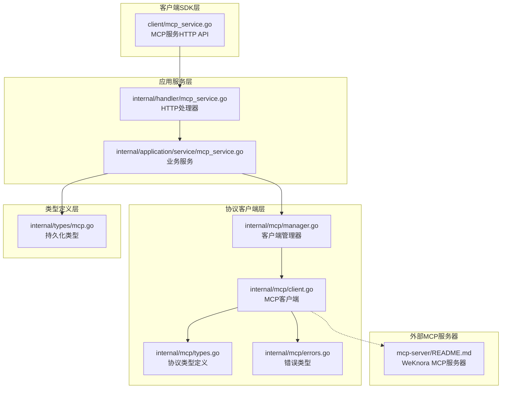
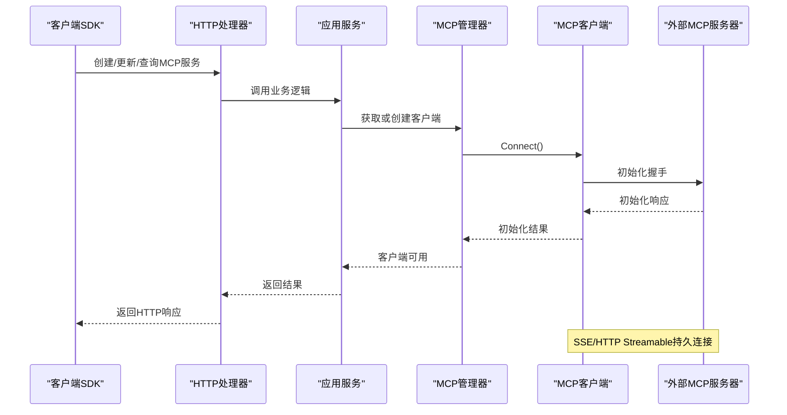
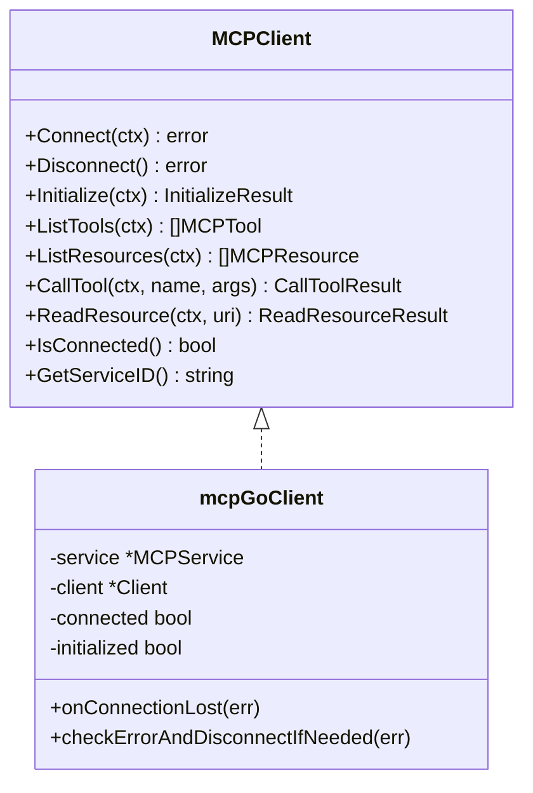
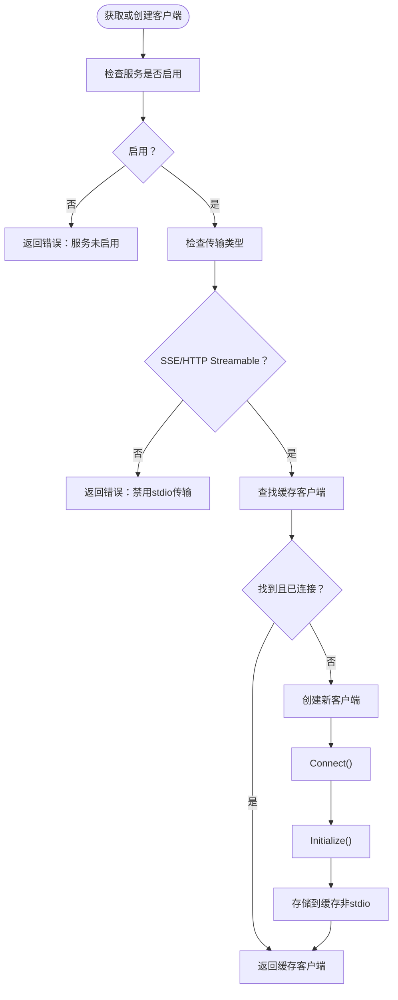
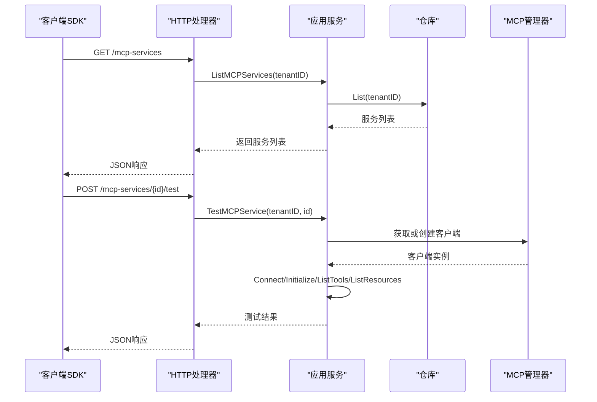
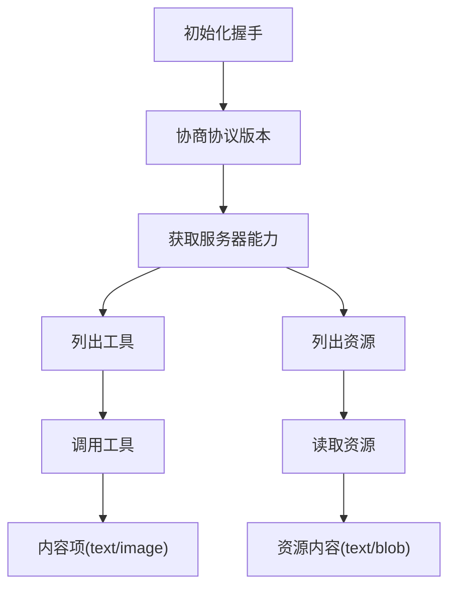
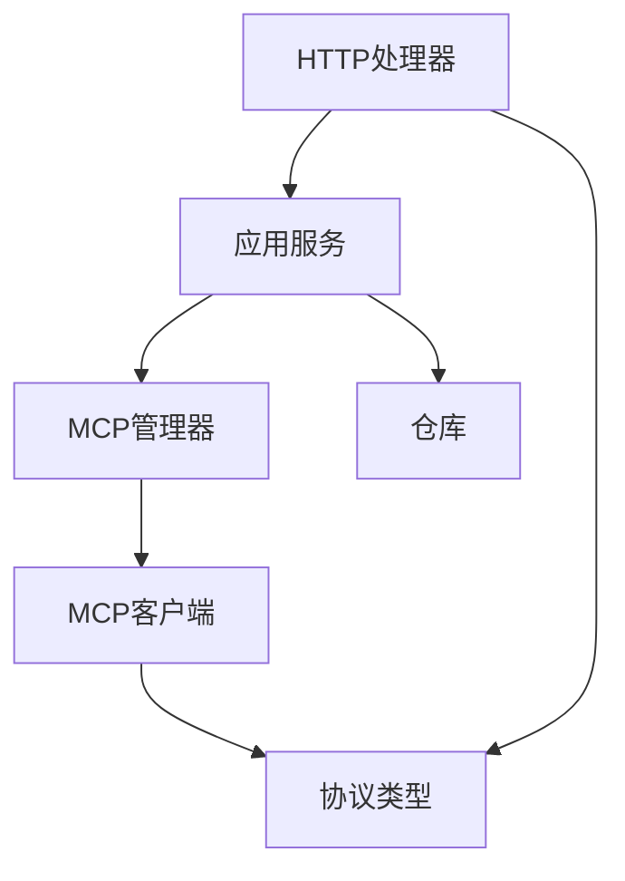

# MCP协议实现

<cite>
**本文档引用的文件**
- [internal/mcp/client.go](file://internal/mcp/client.go)
- [internal/mcp/types.go](file://internal/mcp/types.go)
- [internal/mcp/errors.go](file://internal/mcp/errors.go)
- [internal/mcp/manager.go](file://internal/mcp/manager.go)
- [internal/types/mcp.go](file://internal/types/mcp.go)
- [client/mcp_service.go](file://client/mcp_service.go)
- [internal/handler/mcp_service.go](file://internal/handler/mcp_service.go)
- [internal/application/service/mcp_service.go](file://internal/application/service/mcp_service.go)
- [mcp-server/README.md](file://mcp-server/README.md)
</cite>

## 目录
1. [简介](#简介)
2. [项目结构](#项目结构)
3. [核心组件](#核心组件)
4. [架构总览](#架构总览)
5. [详细组件分析](#详细组件分析)
6. [依赖关系分析](#依赖关系分析)
7. [性能考虑](#性能考虑)
8. [故障排除指南](#故障排除指南)
9. [结论](#结论)
10. [附录](#附录)

## 简介
本文件面向WeKnora MCP协议实现，系统性阐述MCP协议的核心概念与通信机制，包括协议版本、消息格式与传输方式；深入解析MCP客户端实现原理（连接建立、消息序列化与反序列化）；文档化协议错误处理机制（错误码定义、异常情况处理与恢复策略）；解释MCP协议的安全机制（身份验证、授权检查与数据保护）；提供协议调试工具与测试方法；最后展示协议扩展的可能性与最佳实践。

## 项目结构
WeKnora的MCP实现采用分层设计：
- 协议客户端层：封装mark3labs/mcp-go客户端，负责连接、初始化握手、工具与资源列表查询、工具调用与资源读取。
- 管理器层：负责客户端生命周期管理、连接复用、超时控制与空闲清理。
- 类型与错误层：统一定义MCP服务、工具、资源的数据结构与错误类型。
- 应用服务层：提供HTTP接口的业务逻辑，包含MCP服务的增删改查、连通性测试、工具与资源查询。
- 客户端SDK层：提供对外HTTP API，便于上层应用或前端调用。
- MCP服务器：提供WeKnora知识管理API的MCP适配，供外部MCP客户端消费。



**图表来源**
- [internal/mcp/client.go:1-379](file://internal/mcp/client.go#L1-L379)
- [internal/mcp/manager.go:1-226](file://internal/mcp/manager.go#L1-L226)
- [internal/mcp/types.go:1-67](file://internal/mcp/types.go#L1-L67)
- [internal/mcp/errors.go:1-33](file://internal/mcp/errors.go#L1-L33)
- [internal/types/mcp.go:1-243](file://internal/types/mcp.go#L1-L243)
- [client/mcp_service.go:1-208](file://client/mcp_service.go#L1-L208)
- [internal/handler/mcp_service.go:1-448](file://internal/handler/mcp_service.go#L1-L448)
- [internal/application/service/mcp_service.go:1-408](file://internal/application/service/mcp_service.go#L1-L408)
- [mcp-server/README.md:1-143](file://mcp-server/README.md#L1-L143)

**章节来源**
- [internal/mcp/client.go:1-379](file://internal/mcp/client.go#L1-L379)
- [internal/mcp/manager.go:1-226](file://internal/mcp/manager.go#L1-L226)
- [internal/mcp/types.go:1-67](file://internal/mcp/types.go#L1-L67)
- [internal/mcp/errors.go:1-33](file://internal/mcp/errors.go#L1-L33)
- [internal/types/mcp.go:1-243](file://internal/types/mcp.go#L1-L243)
- [client/mcp_service.go:1-208](file://client/mcp_service.go#L1-L208)
- [internal/handler/mcp_service.go:1-448](file://internal/handler/mcp_service.go#L1-L448)
- [internal/application/service/mcp_service.go:1-408](file://internal/application/service/mcp_service.go#L1-L408)
- [mcp-server/README.md:1-143](file://mcp-server/README.md#L1-L143)

## 核心组件
- MCP客户端接口与实现：封装底层mcp-go客户端，提供连接、初始化、工具与资源查询、工具调用、资源读取等能力。
- MCP管理器：负责客户端生命周期管理、连接复用、超时控制与空闲清理。
- 类型与错误：统一定义协议结果、内容项、资源内容以及错误类型。
- 应用服务：提供HTTP接口，完成MCP服务的CRUD、连通性测试、工具与资源查询。
- 客户端SDK：封装HTTP API，供上层调用。
- 外部MCP服务器：提供WeKnora知识管理API的MCP适配。

**章节来源**
- [internal/mcp/client.go:19-47](file://internal/mcp/client.go#L19-L47)
- [internal/mcp/manager.go:13-35](file://internal/mcp/manager.go#L13-L35)
- [internal/mcp/types.go:3-67](file://internal/mcp/types.go#L3-L67)
- [internal/mcp/errors.go:5-32](file://internal/mcp/errors.go#L5-L32)
- [internal/application/service/mcp_service.go:15-30](file://internal/application/service/mcp_service.go#L15-L30)
- [client/mcp_service.go:19-71](file://client/mcp_service.go#L19-L71)

## 架构总览
MCP协议在WeKnora中的实现遵循“客户端-管理器-服务-处理器”的分层架构。客户端通过SSE或HTTP Streamable传输与外部MCP服务器建立持久连接，完成初始化握手后，可查询工具与资源列表，并按需调用工具或读取资源。管理器负责连接复用与生命周期管理，服务层提供HTTP接口与安全校验，客户端SDK封装API调用。



**图表来源**
- [internal/handler/mcp_service.go:39-76](file://internal/handler/mcp_service.go#L39-L76)
- [internal/application/service/mcp_service.go:261-334](file://internal/application/service/mcp_service.go#L261-L334)
- [internal/mcp/manager.go:40-96](file://internal/mcp/manager.go#L40-L96)
- [internal/mcp/client.go:163-231](file://internal/mcp/client.go#L163-L231)

**章节来源**
- [internal/handler/mcp_service.go:39-76](file://internal/handler/mcp_service.go#L39-L76)
- [internal/application/service/mcp_service.go:261-334](file://internal/application/service/mcp_service.go#L261-L334)
- [internal/mcp/manager.go:40-96](file://internal/mcp/manager.go#L40-L96)
- [internal/mcp/client.go:163-231](file://internal/mcp/client.go#L163-L231)

## 详细组件分析

### MCP客户端实现
- 连接建立：根据传输类型选择SSE或HTTP Streamable，构造HTTP客户端与头部，启动客户端并记录连接状态。
- 初始化握手：发送Initialize请求，携带协议版本与客户端信息，接收服务器返回的协议版本与服务器信息。
- 工具与资源：支持列出工具与资源，内部将服务器返回的结构转换为WeKnora类型。
- 工具调用与资源读取：封装CallTool与ReadResource请求，处理返回内容（文本、图片、资源内容）。
- 错误处理：识别传输错误（如会话无效），必要时断开连接以触发重建。



**图表来源**
- [internal/mcp/client.go:19-47](file://internal/mcp/client.go#L19-L47)
- [internal/mcp/client.go:54-60](file://internal/mcp/client.go#L54-L60)

**章节来源**
- [internal/mcp/client.go:62-135](file://internal/mcp/client.go#L62-L135)
- [internal/mcp/client.go:163-196](file://internal/mcp/client.go#L163-L196)
- [internal/mcp/client.go:198-231](file://internal/mcp/client.go#L198-L231)
- [internal/mcp/client.go:233-285](file://internal/mcp/client.go#L233-L285)
- [internal/mcp/client.go:287-368](file://internal/mcp/client.go#L287-L368)

### MCP管理器
- 客户端缓存：基于服务ID缓存已连接的客户端，SSE/HTTP Streamable传输类型支持复用。
- 生命周期管理：提供获取/创建、关闭特定客户端、关闭全部、优雅关停与空闲清理。
- 初始化流程：为每个客户端设置超时上下文，确保初始化在限定时间内完成。
- 并发安全：使用互斥锁保护客户端映射表。



**图表来源**
- [internal/mcp/manager.go:40-96](file://internal/mcp/manager.go#L40-L96)
- [internal/mcp/manager.go:98-120](file://internal/mcp/manager.go#L98-L120)

**章节来源**
- [internal/mcp/manager.go:13-35](file://internal/mcp/manager.go#L13-L35)
- [internal/mcp/manager.go:40-96](file://internal/mcp/manager.go#L40-L96)
- [internal/mcp/manager.go:98-120](file://internal/mcp/manager.go#L98-L120)
- [internal/mcp/manager.go:171-197](file://internal/mcp/manager.go#L171-L197)

### 类型与错误
- 协议结果类型：InitializeResult、CallToolResult、ReadResourceResult及其子类型（内容项、资源内容）。
- 传输与认证：MCPTransportType枚举（sse、http-streamable、stdio），MCPAuthConfig（API Key、Token、自定义头部）。
- 错误类型：不支持的传输、未连接、已连接、初始化失败、工具/资源未找到、无效响应、超时、连接关闭等。

```mermaid
classDiagram
class InitializeResult {
+string protocolVersion
+ServerCapabilities capabilities
+ServerInfo serverInfo
}
class ServerCapabilities {
+ToolsCapability tools
+ResourcesCapability resources
+PromptsCapability prompts
+map[string]interface{} logging
+map[string]interface{} experimental
}
class CallToolResult {
+[]ContentItem content
+bool isError
}
class ReadResourceResult {
+[]ResourceContent contents
}
class ContentItem {
+string type
+string text
+string data
+string mimeType
}
class ResourceContent {
+string uri
+string mimeType
+string text
+string blob
}
```

**图表来源**
- [internal/mcp/types.go:3-67](file://internal/mcp/types.go#L3-L67)

**章节来源**
- [internal/mcp/types.go:3-67](file://internal/mcp/types.go#L3-L67)
- [internal/mcp/errors.go:5-32](file://internal/mcp/errors.go#L5-L32)
- [internal/types/mcp.go:12-80](file://internal/types/mcp.go#L12-L80)

### 应用服务与HTTP接口
- HTTP处理器：提供创建、查询、更新、删除MCP服务的REST接口，包含SSRF安全校验与敏感信息隐藏。
- 业务服务：实现MCP服务的CRUD、连通性测试、工具与资源查询；根据配置变更关闭旧连接并触发重建。
- 客户端SDK：封装HTTP API，提供MCP服务的增删改查、测试、工具与资源查询。



**图表来源**
- [internal/handler/mcp_service.go:78-110](file://internal/handler/mcp_service.go#L78-L110)
- [internal/handler/mcp_service.go:332-375](file://internal/handler/mcp_service.go#L332-L375)
- [internal/application/service/mcp_service.go:75-93](file://internal/application/service/mcp_service.go#L75-L93)
- [internal/application/service/mcp_service.go:261-334](file://internal/application/service/mcp_service.go#L261-L334)

**章节来源**
- [internal/handler/mcp_service.go:39-76](file://internal/handler/mcp_service.go#L39-L76)
- [internal/handler/mcp_service.go:112-152](file://internal/handler/mcp_service.go#L112-L152)
- [internal/handler/mcp_service.go:154-294](file://internal/handler/mcp_service.go#L154-L294)
- [internal/handler/mcp_service.go:296-330](file://internal/handler/mcp_service.go#L296-L330)
- [internal/handler/mcp_service.go:332-375](file://internal/handler/mcp_service.go#L332-L375)
- [internal/handler/mcp_service.go:377-411](file://internal/handler/mcp_service.go#L377-L411)
- [internal/handler/mcp_service.go:413-447](file://internal/handler/mcp_service.go#L413-L447)
- [internal/application/service/mcp_service.go:32-54](file://internal/application/service/mcp_service.go#L32-L54)
- [internal/application/service/mcp_service.go:114-231](file://internal/application/service/mcp_service.go#L114-L231)
- [internal/application/service/mcp_service.go:233-259](file://internal/application/service/mcp_service.go#L233-L259)
- [internal/application/service/mcp_service.go:261-334](file://internal/application/service/mcp_service.go#L261-L334)
- [internal/application/service/mcp_service.go:336-394](file://internal/application/service/mcp_service.go#L336-L394)
- [client/mcp_service.go:81-96](file://client/mcp_service.go#L81-L96)
- [client/mcp_service.go:98-130](file://client/mcp_service.go#L98-L130)
- [client/mcp_service.go:132-156](file://client/mcp_service.go#L132-L156)
- [client/mcp_service.go:158-173](file://client/mcp_service.go#L158-L173)
- [client/mcp_service.go:175-207](file://client/mcp_service.go#L175-L207)

### 协议版本、消息格式与传输方式
- 协议版本：客户端在初始化时使用最新协议版本常量，服务器返回实际支持的协议版本。
- 消息格式：工具调用返回内容项（文本、图片），资源读取返回资源内容（文本、二进制，二进制以Base64编码）。
- 传输方式：支持SSE与HTTP Streamable；stdio传输出于安全原因被禁用。



**图表来源**
- [internal/mcp/client.go:198-231](file://internal/mcp/client.go#L198-L231)
- [internal/mcp/client.go:287-327](file://internal/mcp/client.go#L287-L327)
- [internal/mcp/client.go:329-368](file://internal/mcp/client.go#L329-L368)
- [internal/mcp/types.go:41-67](file://internal/mcp/types.go#L41-L67)

**章节来源**
- [internal/mcp/client.go:198-231](file://internal/mcp/client.go#L198-L231)
- [internal/mcp/types.go:41-67](file://internal/mcp/types.go#L41-L67)
- [internal/types/mcp.go:12-19](file://internal/types/mcp.go#L12-L19)

### 安全机制
- 认证与授权：支持API Key与Bearer Token两种认证方式，可附加自定义头部；内置MCP服务在前端显示时会隐藏敏感信息。
- SSRF防护：HTTP处理器对MCP服务URL进行SSRF校验，防止内网探测与越权访问。
- 传输安全：建议使用HTTPS；stdio传输被禁用以避免命令注入风险。
- 数据保护：敏感字段在列表与内置服务展示时进行掩码处理。

**章节来源**
- [internal/types/mcp.go:44-49](file://internal/types/mcp.go#L44-L49)
- [internal/handler/mcp_service.go:57-64](file://internal/handler/mcp_service.go#L57-L64)
- [internal/types/mcp.go:209-234](file://internal/types/mcp.go#L209-L234)
- [mcp-server/README.md:14-27](file://mcp-server/README.md#L14-L27)

### 协议错误处理机制
- 错误类型：不支持的传输、未连接、已连接、初始化失败、工具/资源未找到、无效响应、超时、连接关闭等。
- 异常处理：客户端在发生传输错误时检查错误内容，若检测到会话无效则主动断开连接。
- 恢复策略：管理器定期清理断开连接；后续调用将重新创建客户端并重建连接。

**章节来源**
- [internal/mcp/errors.go:5-32](file://internal/mcp/errors.go#L5-L32)
- [internal/mcp/client.go:143-161](file://internal/mcp/client.go#L143-L161)
- [internal/mcp/manager.go:171-197](file://internal/mcp/manager.go#L171-L197)

### 协议调试工具与测试方法
- 连通性测试：通过HTTP接口对指定MCP服务进行测试，返回连接状态、服务器信息、可用工具与资源列表。
- 日志记录：连接、初始化、工具与资源查询均记录详细日志，便于定位问题。
- 外部MCP服务器：提供WeKnora知识管理API的MCP适配，便于验证协议交互。

**章节来源**
- [internal/handler/mcp_service.go:332-375](file://internal/handler/mcp_service.go#L332-L375)
- [internal/application/service/mcp_service.go:261-334](file://internal/application/service/mcp_service.go#L261-L334)
- [mcp-server/README.md:1-143](file://mcp-server/README.md#L1-L143)

### 协议扩展的可能性与最佳实践
- 扩展点：可在类型定义中增加新的能力字段与内容类型；在客户端中添加新的请求/响应处理逻辑。
- 最佳实践：优先使用SSE或HTTP Streamable传输；为每个服务配置合理的超时与重试；严格进行SSRF校验；对敏感信息进行掩码与隐藏；在管理器层面统一处理连接复用与清理。

**章节来源**
- [internal/mcp/types.go:10-33](file://internal/mcp/types.go#L10-L33)
- [internal/mcp/client.go:98-127](file://internal/mcp/client.go#L98-L127)
- [internal/handler/mcp_service.go:57-64](file://internal/handler/mcp_service.go#L57-L64)
- [internal/types/mcp.go:209-234](file://internal/types/mcp.go#L209-L234)
- [internal/mcp/manager.go:171-197](file://internal/mcp/manager.go#L171-L197)

## 依赖关系分析
- 组件耦合：应用服务依赖MCP管理器与仓库；HTTP处理器依赖应用服务；客户端SDK依赖HTTP接口。
- 外部依赖：使用mark3labs/mcp-go作为底层MCP客户端库；使用Gin作为HTTP框架；使用GORM进行数据持久化。
- 循环依赖：未发现循环依赖，层次清晰。



**图表来源**
- [internal/handler/mcp_service.go:15-25](file://internal/handler/mcp_service.go#L15-L25)
- [internal/application/service/mcp_service.go:15-30](file://internal/application/service/mcp_service.go#L15-L30)
- [internal/mcp/manager.go:13-35](file://internal/mcp/manager.go#L13-L35)
- [internal/mcp/client.go:54-60](file://internal/mcp/client.go#L54-L60)
- [internal/mcp/types.go:3-67](file://internal/mcp/types.go#L3-L67)

**章节来源**
- [internal/handler/mcp_service.go:15-25](file://internal/handler/mcp_service.go#L15-L25)
- [internal/application/service/mcp_service.go:15-30](file://internal/application/service/mcp_service.go#L15-L30)
- [internal/mcp/manager.go:13-35](file://internal/mcp/manager.go#L13-L35)
- [internal/mcp/client.go:54-60](file://internal/mcp/client.go#L54-L60)
- [internal/mcp/types.go:3-67](file://internal/mcp/types.go#L3-L67)

## 性能考虑
- 连接复用：SSE/HTTP Streamable传输类型支持客户端复用，减少频繁建立连接的开销。
- 超时控制：初始化与测试阶段设置合理超时，避免阻塞；HTTP客户端超时用于连接超时控制。
- 清理策略：管理器定期清理断开连接，释放资源，避免内存泄漏。
- 并发安全：使用互斥锁保护客户端映射表，避免并发写入导致的竞争条件。

**章节来源**
- [internal/mcp/manager.go:171-197](file://internal/mcp/manager.go#L171-L197)
- [internal/mcp/manager.go:98-120](file://internal/mcp/manager.go#L98-L120)
- [internal/mcp/manager.go:171-179](file://internal/mcp/manager.go#L171-L179)

## 故障排除指南
- 连接失败：检查URL、认证信息与网络连通性；查看日志中的连接错误信息。
- 初始化失败：确认服务器支持的协议版本；检查客户端信息与头部配置。
- 工具/资源未找到：确认服务器已正确暴露对应工具与资源；检查过滤条件与权限。
- 会话无效：客户端会在检测到会话无效时主动断开连接，后续调用将重建连接。
- SSRF校验失败：确保MCP服务URL符合预期，避免内网地址与非法协议。

**章节来源**
- [internal/mcp/errors.go:5-32](file://internal/mcp/errors.go#L5-L32)
- [internal/mcp/client.go:143-161](file://internal/mcp/client.go#L143-L161)
- [internal/handler/mcp_service.go:57-64](file://internal/handler/mcp_service.go#L57-L64)

## 结论
WeKnora的MCP协议实现通过清晰的分层架构与严格的错误处理机制，提供了稳定可靠的MCP客户端能力。SSE与HTTP Streamable传输方式满足大多数场景需求，stdio传输出于安全考虑被禁用。结合连通性测试、日志记录与SSRF防护，开发者可以高效地集成与调试MCP服务。

## 附录
- 外部MCP服务器：提供WeKnora知识管理API的MCP适配，便于验证协议交互与功能完整性。

**章节来源**
- [mcp-server/README.md:1-143](file://mcp-server/README.md#L1-L143)