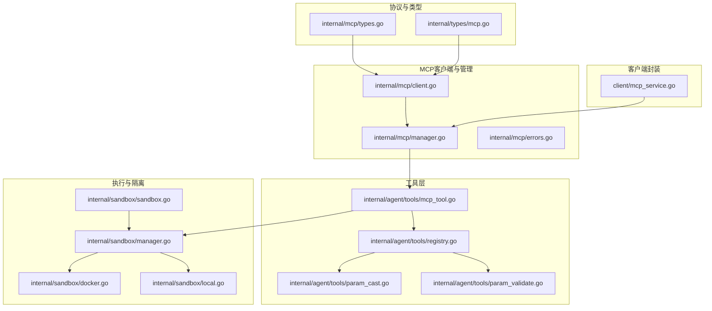
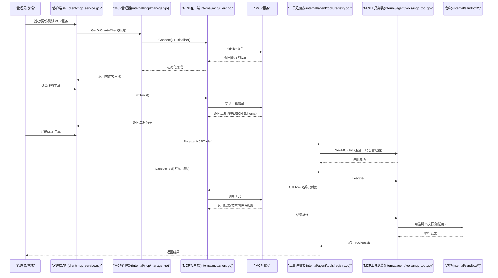
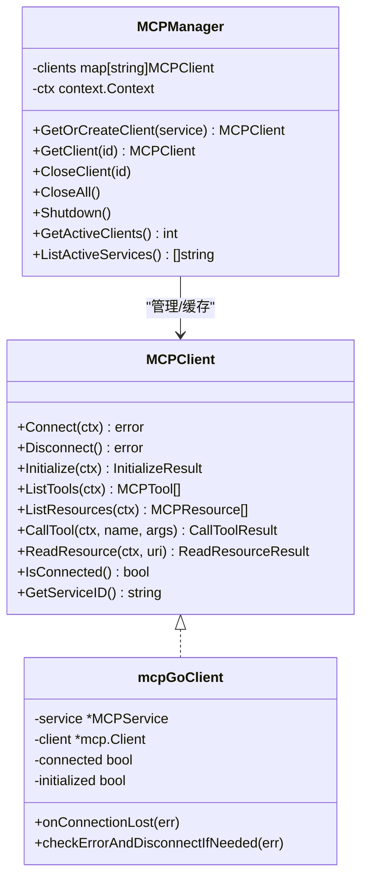
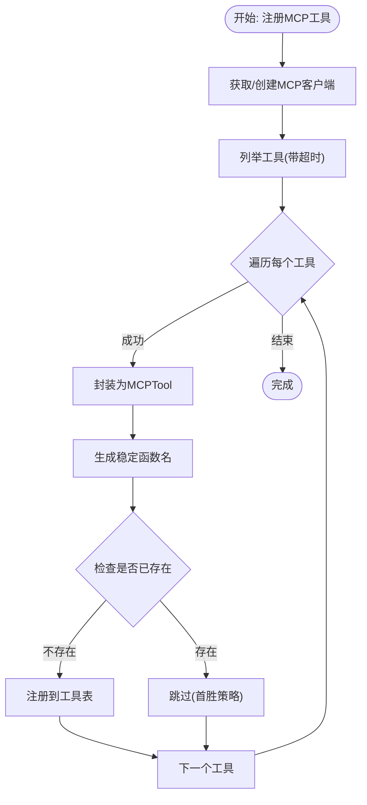
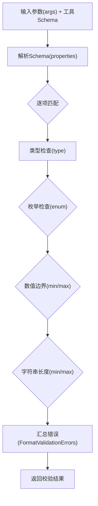
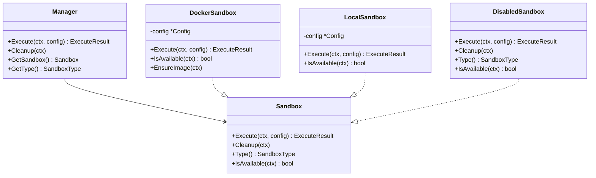
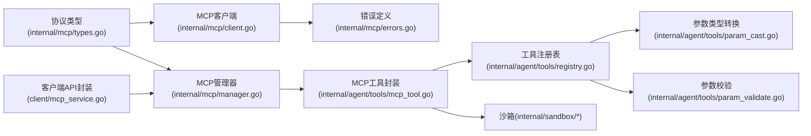

# MCP工具集成

<cite>
**本文档引用的文件**
- [internal/mcp/types.go](file://internal/mcp/types.go)
- [internal/mcp/client.go](file://internal/mcp/client.go)
- [internal/mcp/manager.go](file://internal/mcp/manager.go)
- [internal/mcp/errors.go](file://internal/mcp/errors.go)
- [client/mcp_service.go](file://client/mcp_service.go)
- [internal/types/mcp.go](file://internal/types/mcp.go)
- [internal/agent/tools/mcp_tool.go](file://internal/agent/tools/mcp_tool.go)
- [internal/agent/tools/registry.go](file://internal/agent/tools/registry.go)
- [internal/agent/tools/param_cast.go](file://internal/agent/tools/param_cast.go)
- [internal/agent/tools/param_validate.go](file://internal/agent/tools/param_validate.go)
- [internal/sandbox/manager.go](file://internal/sandbox/manager.go)
- [internal/sandbox/docker.go](file://internal/sandbox/docker.go)
- [internal/sandbox/local.go](file://internal/sandbox/local.go)
- [internal/sandbox/sandbox.go](file://internal/sandbox/sandbox.go)
</cite>

## 目录
1. [简介](#简介)
2. [项目结构](#项目结构)
3. [核心组件](#核心组件)
4. [架构总览](#架构总览)
5. [详细组件分析](#详细组件分析)
6. [依赖分析](#依赖分析)
7. [性能考虑](#性能考虑)
8. [故障排查指南](#故障排查指南)
9. [结论](#结论)
10. [附录](#附录)

## 简介
本文件面向WeKnora的MCP（Model Context Protocol）工具集成功能，系统化阐述MCP工具的注册机制与调用流程、工具能力声明与验证机制、执行环境与隔离策略、异步处理与错误恢复机制，并提供工具开发指南与实际使用场景。文档基于仓库内现有代码实现进行分析与总结，帮助开发者与运维人员正确配置、扩展与维护MCP工具。

## 项目结构
围绕MCP工具集成的关键模块分布如下：
- 协议与类型定义：internal/mcp/types.go、internal/types/mcp.go
- MCP客户端与连接管理：internal/mcp/client.go、internal/mcp/manager.go、internal/mcp/errors.go
- 工具封装与注册：internal/agent/tools/mcp_tool.go、internal/agent/tools/registry.go
- 参数类型转换与校验：internal/agent/tools/param_cast.go、internal/agent/tools/param_validate.go
- 执行环境与隔离：internal/sandbox/* 以及 mcp-server 目录（Python侧）
- 客户端API封装：client/mcp_service.go

**图表来源**
- [internal/mcp/types.go:1-67](file://internal/mcp/types.go#L1-L67)
- [internal/types/mcp.go:1-243](file://internal/types/mcp.go#L1-L243)
- [internal/mcp/client.go:1-379](file://internal/mcp/client.go#L1-L379)
- [internal/mcp/manager.go:1-226](file://internal/mcp/manager.go#L1-L226)
- [internal/mcp/errors.go:1-33](file://internal/mcp/errors.go#L1-L33)
- [internal/agent/tools/mcp_tool.go:1-479](file://internal/agent/tools/mcp_tool.go#L1-L479)
- [internal/agent/tools/registry.go:1-171](file://internal/agent/tools/registry.go#L1-L171)
- [internal/agent/tools/param_cast.go:1-134](file://internal/agent/tools/param_cast.go#L1-L134)
- [internal/agent/tools/param_validate.go:1-235](file://internal/agent/tools/param_validate.go#L1-L235)
- [internal/sandbox/manager.go:1-258](file://internal/sandbox/manager.go#L1-L258)
- [internal/sandbox/docker.go:1-219](file://internal/sandbox/docker.go#L1-L219)
- [internal/sandbox/local.go:1-253](file://internal/sandbox/local.go#L1-L253)
- [internal/sandbox/sandbox.go:1-245](file://internal/sandbox/sandbox.go#L1-L245)
- [client/mcp_service.go:1-208](file://client/mcp_service.go#L1-L208)

**章节来源**
- [internal/mcp/types.go:1-67](file://internal/mcp/types.go#L1-L67)
- [internal/types/mcp.go:1-243](file://internal/types/mcp.go#L1-L243)
- [internal/mcp/client.go:1-379](file://internal/mcp/client.go#L1-L379)
- [internal/mcp/manager.go:1-226](file://internal/mcp/manager.go#L1-L226)
- [internal/mcp/errors.go:1-33](file://internal/mcp/errors.go#L1-L33)
- [internal/agent/tools/mcp_tool.go:1-479](file://internal/agent/tools/mcp_tool.go#L1-L479)
- [internal/agent/tools/registry.go:1-171](file://internal/agent/tools/registry.go#L1-L171)
- [internal/agent/tools/param_cast.go:1-134](file://internal/agent/tools/param_cast.go#L1-L134)
- [internal/agent/tools/param_validate.go:1-235](file://internal/agent/tools/param_validate.go#L1-L235)
- [internal/sandbox/manager.go:1-258](file://internal/sandbox/manager.go#L1-L258)
- [internal/sandbox/docker.go:1-219](file://internal/sandbox/docker.go#L1-L219)
- [internal/sandbox/local.go:1-253](file://internal/sandbox/local.go#L1-L253)
- [internal/sandbox/sandbox.go:1-245](file://internal/sandbox/sandbox.go#L1-L245)
- [client/mcp_service.go:1-208](file://client/mcp_service.go#L1-L208)

## 核心组件
- MCP协议类型与结果结构：定义初始化响应、服务器能力、工具与资源能力、工具调用结果、资源读取结果等。
- MCP客户端：封装mark3labs/mcp-go客户端，支持SSE与HTTP Streamable传输，负责握手、列举工具/资源、调用工具、读取资源，并内置会话失效检测与断线回调。
- MCP管理器：连接池与复用、初始化超时控制、定时清理断开连接、活跃客户端统计与服务列表。
- 工具封装与注册：将MCP工具包装为统一Tool接口，生成稳定函数名，执行前参数类型转换与校验，执行后内容提取与图像处理，错误路径提示与输出截断。
- 参数转换与校验：基于JSON Schema进行类型安全转换与参数校验，格式化错误消息。
- 执行环境与隔离：通过Sandbox管理器选择Docker或本地沙箱，提供资源限制、网络隔离、只读根文件系统、命令白名单、超时控制等安全策略。
- 客户端API封装：对外暴露MCP服务的增删改查、测试连通性、列举工具与资源等REST接口。

**章节来源**
- [internal/mcp/types.go:1-67](file://internal/mcp/types.go#L1-L67)
- [internal/mcp/client.go:1-379](file://internal/mcp/client.go#L1-L379)
- [internal/mcp/manager.go:1-226](file://internal/mcp/manager.go#L1-L226)
- [internal/agent/tools/mcp_tool.go:1-479](file://internal/agent/tools/mcp_tool.go#L1-L479)
- [internal/agent/tools/registry.go:1-171](file://internal/agent/tools/registry.go#L1-L171)
- [internal/agent/tools/param_cast.go:1-134](file://internal/agent/tools/param_cast.go#L1-L134)
- [internal/agent/tools/param_validate.go:1-235](file://internal/agent/tools/param_validate.go#L1-L235)
- [internal/sandbox/manager.go:1-258](file://internal/sandbox/manager.go#L1-L258)
- [internal/sandbox/docker.go:1-219](file://internal/sandbox/docker.go#L1-L219)
- [internal/sandbox/local.go:1-253](file://internal/sandbox/local.go#L1-L253)
- [internal/sandbox/sandbox.go:1-245](file://internal/sandbox/sandbox.go#L1-L245)
- [client/mcp_service.go:1-208](file://client/mcp_service.go#L1-L208)

## 架构总览
下图展示了MCP工具从注册到执行的总体流程，以及与参数校验、类型转换、沙箱隔离的关系。

**图表来源**
- [client/mcp_service.go:81-208](file://client/mcp_service.go#L81-L208)
- [internal/mcp/manager.go:37-96](file://internal/mcp/manager.go#L37-L96)
- [internal/mcp/client.go:163-327](file://internal/mcp/client.go#L163-L327)
- [internal/agent/tools/mcp_tool.go:89-184](file://internal/agent/tools/mcp_tool.go#L89-L184)
- [internal/agent/tools/registry.go:87-159](file://internal/agent/tools/registry.go#L87-L159)
- [internal/sandbox/manager.go:82-111](file://internal/sandbox/manager.go#L82-L111)

## 详细组件分析

### MCP客户端与管理器
- 传输类型支持：SSE与HTTP Streamable；显式禁用stdio以避免命令注入风险。
- 连接与初始化：长连接复用（SSE/HTTP Streamable），初始化带超时控制，失败时主动断开并可重试。
- 错误处理：识别会话失效错误（如无效会话ID、无活动连接），触发断开以强制重建连接。
- 客户端缓存：按服务ID缓存连接，定时清理断开连接，统计活跃客户端数量。

**图表来源**
- [internal/mcp/client.go:19-47](file://internal/mcp/client.go#L19-L47)
- [internal/mcp/client.go:54-135](file://internal/mcp/client.go#L54-L135)
- [internal/mcp/manager.go:13-35](file://internal/mcp/manager.go#L13-L35)
- [internal/mcp/manager.go:37-96](file://internal/mcp/manager.go#L37-L96)

**章节来源**
- [internal/mcp/client.go:1-379](file://internal/mcp/client.go#L1-L379)
- [internal/mcp/manager.go:1-226](file://internal/mcp/manager.go#L1-L226)
- [internal/mcp/errors.go:1-33](file://internal/mcp/errors.go#L1-L33)

### 工具注册与调用流程
- 名称生成：基于服务名与工具名生成稳定且符合外部工具命名规范的函数名，长度限制与截断策略确保兼容性。
- 描述与参数：工具描述包含外部来源标识，参数Schema为空时提供默认空对象Schema。
- 执行流程：解析参数、获取/创建客户端、调用工具、错误标志处理、内容提取与图像处理、输出前缀以降低间接提示注入风险、结构化数据脱敏存储。
- 注册策略：首次注册生效（first-wins），防止同名冲突导致的劫持；支持批量注册与信息查询。

**图表来源**
- [internal/agent/tools/mcp_tool.go:323-415](file://internal/agent/tools/mcp_tool.go#L323-L415)
- [internal/agent/tools/registry.go:43-54](file://internal/agent/tools/registry.go#L43-L54)

**章节来源**
- [internal/agent/tools/mcp_tool.go:1-479](file://internal/agent/tools/mcp_tool.go#L1-L479)
- [internal/agent/tools/registry.go:1-171](file://internal/agent/tools/registry.go#L1-L171)

### 参数类型转换与校验
- 类型转换：根据Schema对字符串布尔、整数、数字、数组等进行安全转换，修正LLM常见返回错误类型。
- 参数校验：支持required、type、enum、minimum/maximum、minLength/maxLength等规则，格式化错误消息便于提示重试。

**图表来源**
- [internal/agent/tools/param_cast.go:9-65](file://internal/agent/tools/param_cast.go#L9-L65)
- [internal/agent/tools/param_validate.go:15-81](file://internal/agent/tools/param_validate.go#L15-L81)

**章节来源**
- [internal/agent/tools/param_cast.go:1-134](file://internal/agent/tools/param_cast.go#L1-L134)
- [internal/agent/tools/param_validate.go:1-235](file://internal/agent/tools/param_validate.go#L1-L235)

### 执行环境与隔离策略
- 沙箱类型：Docker、Local、Disabled三类，支持自动回退。
- Docker特性：非root运行、丢弃全部能力、可选只读根文件系统+临时目录、内存/CPU限制、禁用网络、进程数限制、安全选项。
- Local特性：命令白名单、工作目录限制、最小环境变量、超时与进程组清理。
- 管理器职责：配置校验、可用性检测、执行前安全校验（脚本、参数、stdin）、执行结果封装。

**图表来源**
- [internal/sandbox/manager.go:11-41](file://internal/sandbox/manager.go#L11-L41)
- [internal/sandbox/sandbox.go:44-73](file://internal/sandbox/sandbox.go#L44-L73)
- [internal/sandbox/docker.go:13-43](file://internal/sandbox/docker.go#L13-L43)
- [internal/sandbox/local.go:15-45](file://internal/sandbox/local.go#L15-L45)
- [internal/sandbox/sandbox.go:206-223](file://internal/sandbox/sandbox.go#L206-L223)

**章节来源**
- [internal/sandbox/manager.go:1-258](file://internal/sandbox/manager.go#L1-L258)
- [internal/sandbox/docker.go:1-219](file://internal/sandbox/docker.go#L1-L219)
- [internal/sandbox/local.go:1-253](file://internal/sandbox/local.go#L1-L253)
- [internal/sandbox/sandbox.go:1-245](file://internal/sandbox/sandbox.go#L1-L245)

### 工具能力声明与验证机制
- 能力声明：服务器能力包含tools、resources、prompts等字段，客户端在初始化时接收并记录。
- 输入输出规范：工具参数Schema由服务端提供，客户端在注册阶段保存；执行阶段通过CastParams与ValidateParams保证类型与约束。
- 类型转换与数据校验：CastParams在执行前进行类型修复；ValidateParams在执行前进行Schema校验，失败即早返回。
- 结果处理：统一转换为CallToolResult，提取文本与图像数据URI，对大图像进行脱敏存储，输出前添加“不受信任外部来源”前缀。

**章节来源**
- [internal/mcp/types.go:10-66](file://internal/mcp/types.go#L10-L66)
- [internal/agent/tools/mcp_tool.go:77-184](file://internal/agent/tools/mcp_tool.go#L77-L184)
- [internal/agent/tools/param_cast.go:14-65](file://internal/agent/tools/param_cast.go#L14-L65)
- [internal/agent/tools/param_validate.go:24-81](file://internal/agent/tools/param_validate.go#L24-L81)

### 异步处理与错误恢复机制
- 连接复用与断线回调：连接丢失时记录日志并断开，后续操作触发重建。
- 会话失效检测：识别特定错误消息（如无效会话ID、无活动连接）后主动断开。
- 重连与重试：工具调用失败时（非stdio）先断开再重建连接并重试一次；列举工具失败时同样采用一次性重试。
- 超时控制：初始化超时上限60秒，客户端HTTP超时可配置；执行阶段遵循上下文超时。
- 降级方案：stdio传输被禁用；Docker不可用时可回退至Local沙箱；沙箱禁用时拒绝执行。

**章节来源**
- [internal/mcp/client.go:137-161](file://internal/mcp/client.go#L137-L161)
- [internal/mcp/manager.go:98-120](file://internal/mcp/manager.go#L98-L120)
- [internal/agent/tools/mcp_tool.go:125-148](file://internal/agent/tools/mcp_tool.go#L125-L148)
- [internal/sandbox/manager.go:43-80](file://internal/sandbox/manager.go#L43-L80)

### 工具开发指南
- 接口规范：工具名称需稳定且符合外部工具命名要求；参数Schema应完整描述输入；工具描述应明确用途。
- 最佳实践：提供清晰的输入Schema，避免复杂嵌套；对敏感参数使用enum限制；在工具描述中标注外部来源属性。
- 性能优化：合理设置超时与重试；避免返回超大数据（图像将被脱敏存储）；减少不必要的网络请求。
- 安全建议：避免使用stdio传输；在Docker沙箱中启用只读根文件系统与网络隔离；严格限制内存/CPU配额。

**章节来源**
- [internal/agent/tools/mcp_tool.go:33-75](file://internal/agent/tools/mcp_tool.go#L33-L75)
- [internal/agent/tools/param_validate.go:15-81](file://internal/agent/tools/param_validate.go#L15-L81)
- [internal/sandbox/docker.go:103-170](file://internal/sandbox/docker.go#L103-L170)

### 实际案例与使用场景
- 外部工具集成：通过SSE/HTTP Streamable连接第三方MCP服务，自动列举工具并注册到Agent工具表，供对话过程中调用。
- 资源访问：列举并读取远程资源，支持文本与二进制资源，统一转换为内部结构以便后续处理。
- 图像与多模态：从工具结果中提取图像数据URI，进行大小与MIME类型校验，超过阈值的图像将被跳过但保留占位符。
- 脚本执行：在受控沙箱中执行技能脚本，结合Docker或Local沙箱的安全策略，实现资源限制与隔离。

**章节来源**
- [internal/mcp/client.go:260-368](file://internal/mcp/client.go#L260-L368)
- [internal/agent/tools/mcp_tool.go:186-303](file://internal/agent/tools/mcp_tool.go#L186-L303)
- [internal/sandbox/manager.go:82-111](file://internal/sandbox/manager.go#L82-L111)

## 依赖分析
- 组件耦合：MCP管理器持有客户端实例，工具封装依赖管理器获取客户端；注册表统一调度工具执行；参数校验与类型转换贯穿执行前后。
- 外部依赖：mcp-go客户端库用于SSE/HTTP Streamable通信；Docker CLI用于容器执行；脚本安全校验器用于沙箱前置校验。
- 循环依赖：未发现循环依赖；各模块职责清晰，接口边界明确。

**图表来源**
- [internal/mcp/types.go:1-67](file://internal/mcp/types.go#L1-L67)
- [internal/mcp/client.go:1-379](file://internal/mcp/client.go#L1-L379)
- [internal/mcp/manager.go:1-226](file://internal/mcp/manager.go#L1-L226)
- [internal/agent/tools/mcp_tool.go:1-479](file://internal/agent/tools/mcp_tool.go#L1-L479)
- [internal/agent/tools/registry.go:1-171](file://internal/agent/tools/registry.go#L1-L171)
- [internal/agent/tools/param_cast.go:1-134](file://internal/agent/tools/param_cast.go#L1-L134)
- [internal/agent/tools/param_validate.go:1-235](file://internal/agent/tools/param_validate.go#L1-L235)
- [internal/sandbox/manager.go:1-258](file://internal/sandbox/manager.go#L1-L258)
- [internal/mcp/errors.go:1-33](file://internal/mcp/errors.go#L1-L33)
- [client/mcp_service.go:1-208](file://client/mcp_service.go#L1-L208)

**章节来源**
- [internal/mcp/types.go:1-67](file://internal/mcp/types.go#L1-L67)
- [internal/mcp/client.go:1-379](file://internal/mcp/client.go#L1-L379)
- [internal/mcp/manager.go:1-226](file://internal/mcp/manager.go#L1-L226)
- [internal/agent/tools/mcp_tool.go:1-479](file://internal/agent/tools/mcp_tool.go#L1-L479)
- [internal/agent/tools/registry.go:1-171](file://internal/agent/tools/registry.go#L1-L171)
- [internal/agent/tools/param_cast.go:1-134](file://internal/agent/tools/param_cast.go#L1-L134)
- [internal/agent/tools/param_validate.go:1-235](file://internal/agent/tools/param_validate.go#L1-L235)
- [internal/sandbox/manager.go:1-258](file://internal/sandbox/manager.go#L1-L258)
- [internal/mcp/errors.go:1-33](file://internal/mcp/errors.go#L1-L33)
- [client/mcp_service.go:1-208](file://client/mcp_service.go#L1-L208)

## 性能考虑
- 连接复用：SSE/HTTP Streamable持久连接减少握手开销；定时清理断开连接避免资源泄漏。
- 超时控制：初始化与工具调用均设置超时，避免阻塞；Docker执行设置默认超时与资源限制。
- 输出截断：注册表对超长工具输出进行截断，防止上下文窗口污染。
- 图像处理：限制最大图像数量与大小，避免内存膨胀；对图像数据进行脱敏存储。

**章节来源**
- [internal/mcp/manager.go:171-197](file://internal/mcp/manager.go#L171-L197)
- [internal/mcp/manager.go:98-120](file://internal/mcp/manager.go#L98-L120)
- [internal/agent/tools/registry.go:129-133](file://internal/agent/tools/registry.go#L129-L133)
- [internal/agent/tools/mcp_tool.go:186-193](file://internal/agent/tools/mcp_tool.go#L186-L193)

## 故障排查指南
- 连接失败：检查URL与传输类型；确认SSE/HTTP Streamable可用；查看会话失效错误并等待自动断开与重建。
- 初始化超时：调整服务高级配置中的超时时间；确认MCP服务可达与响应正常。
- 工具调用失败：查看错误消息与重试日志；对于stdio传输，确认命令与参数；检查工具Schema与参数类型。
- 沙箱执行失败：检查Docker可用性与镜像预拉取；调整资源限制与网络隔离设置；必要时切换到Local沙箱。
- 参数校验失败：根据格式化错误消息修正参数；确保必填字段与类型匹配。

**章节来源**
- [internal/mcp/errors.go:1-33](file://internal/mcp/errors.go#L1-L33)
- [internal/mcp/client.go:137-161](file://internal/mcp/client.go#L137-L161)
- [internal/agent/tools/param_validate.go:224-235](file://internal/agent/tools/param_validate.go#L224-L235)
- [internal/sandbox/manager.go:113-174](file://internal/sandbox/manager.go#L113-L174)

## 结论
WeKnora的MCP工具集成功能在协议层面严格遵循MCP规范，在工程上实现了连接复用、初始化超时、会话失效检测与自动重连、参数类型转换与Schema校验、输出脱敏与截断、以及Docker/Local双轨沙箱隔离。该体系既保证了工具调用的稳定性与安全性，也为扩展更多外部工具提供了清晰的接口与最佳实践。

## 附录
- MCP服务配置关键字段：传输类型、URL、头部、鉴权、高级配置（超时/重试）、stdio配置、环境变量、内置标记等。
- 工具结果序列化：支持错误消息与结构化数据的友好展示，便于调试与用户反馈。

**章节来源**
- [client/mcp_service.go:19-71](file://client/mcp_service.go#L19-L71)
- [internal/types/mcp.go:21-88](file://internal/types/mcp.go#L21-L88)
- [internal/agent/tools/mcp_tool.go:455-479](file://internal/agent/tools/mcp_tool.go#L455-L479)