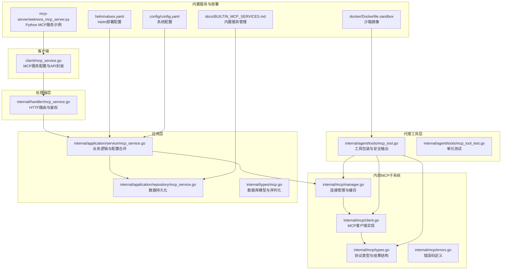
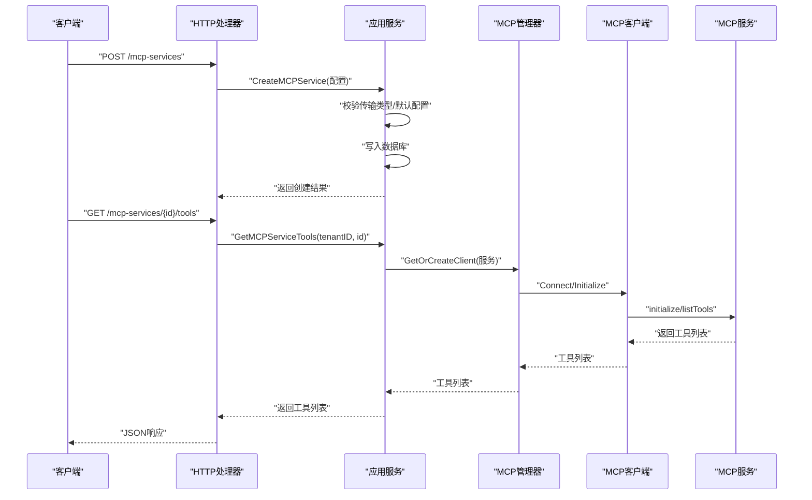
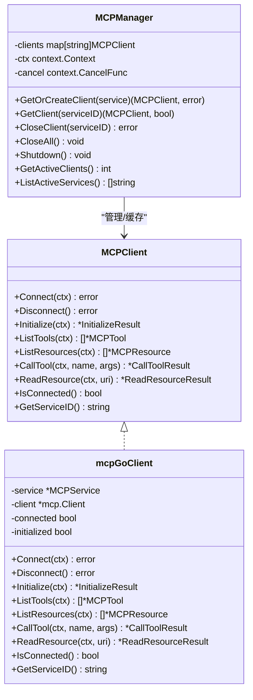
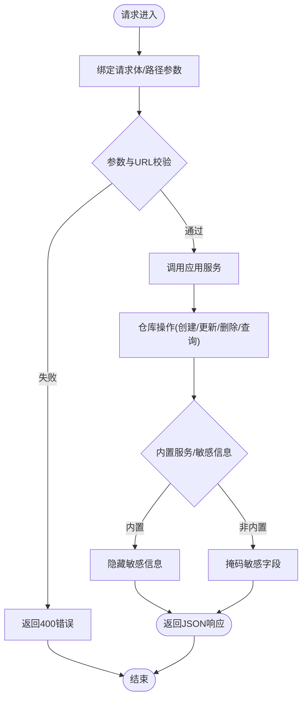
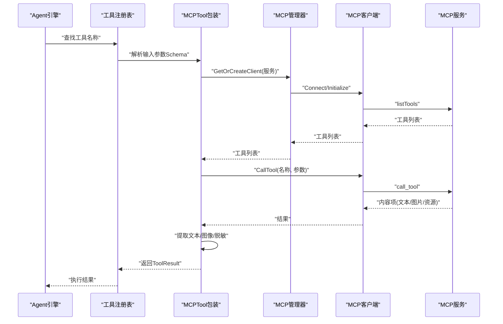
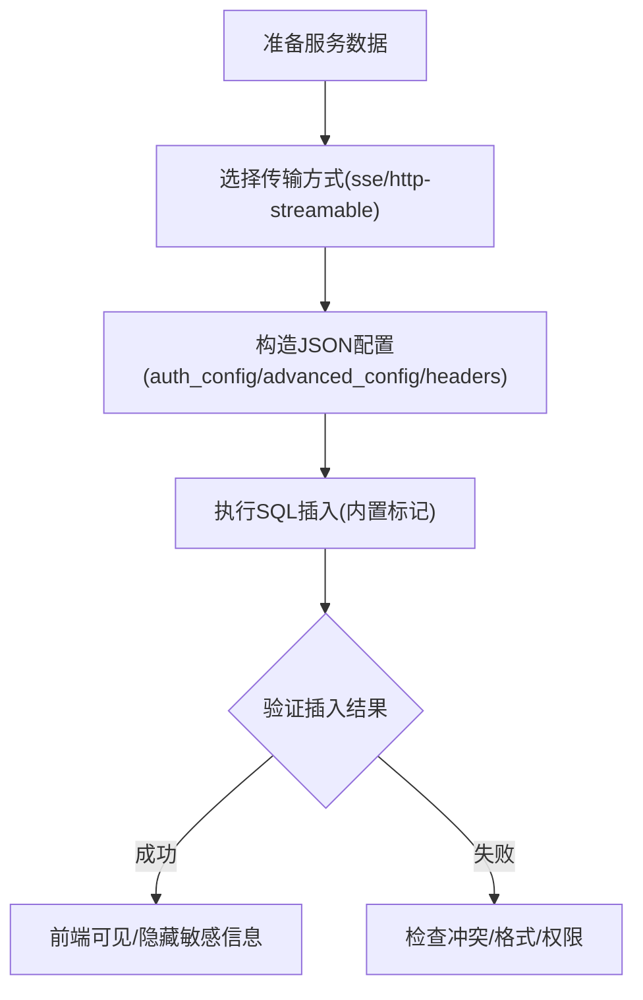
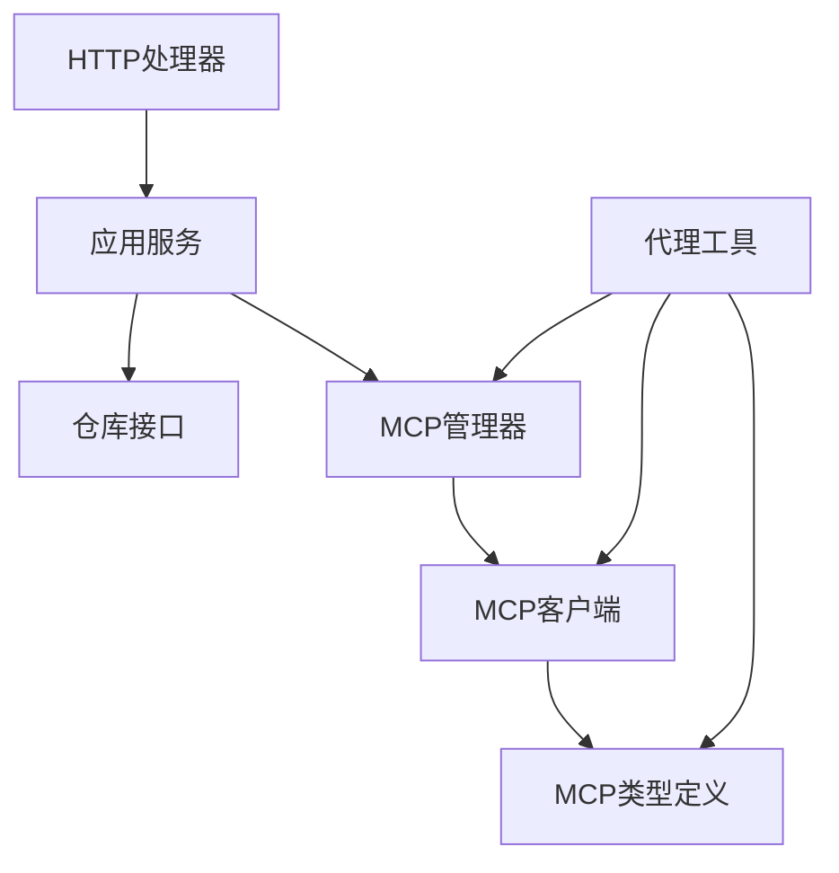

# MCP服务开发

<cite>
**本文档引用的文件**
- [mcp_service.go](file://client/mcp_service.go)
- [types.go](file://internal/mcp/types.go)
- [manager.go](file://internal/mcp/manager.go)
- [client.go](file://internal/mcp/client.go)
- [mcp_service.go](file://internal/application/service/mcp_service.go)
- [mcp_service.go](file://internal/application/repository/mcp_service.go)
- [mcp_service.go](file://internal/handler/mcp_service.go)
- [mcp.go](file://internal/types/mcp.go)
- [mcp_tool.go](file://internal/agent/tools/mcp_tool.go)
- [mcp_tool_test.go](file://internal/agent/tools/mcp_tool_test.go)
- [errors.go](file://internal/mcp/errors.go)
- [weknora_mcp_server.py](file://mcp-server/weknora_mcp_server.py)
- [BUILTIN_MCP_SERVICES.md](file://docs/BUILTIN_MCP_SERVICES.md)
- [values.yaml](file://helm/values.yaml)
- [Dockerfile.sandbox](file://docker/Dockerfile.sandbox)
- [config.yaml](file://config/config.yaml)
</cite>

## 目录
1. [简介](#简介)
2. [项目结构](#项目结构)
3. [核心组件](#核心组件)
4. [架构总览](#架构总览)
5. [详细组件分析](#详细组件分析)
6. [依赖关系分析](#依赖关系分析)
7. [性能考量](#性能考量)
8. [故障排查指南](#故障排查指南)
9. [结论](#结论)
10. [附录](#附录)

## 简介
本文件面向WeKnora MCP（Model Context Protocol）服务开发，系统性阐述MCP服务的开发框架、实现模式与最佳实践。内容覆盖服务接口定义、消息处理与状态管理、配置与部署方法、内置MCP服务示例、扩展与自定义开发、测试与调试工具，以及性能优化与常见问题解决方案。目标是帮助开发者快速理解并高效构建、集成与运维MCP服务。

## 项目结构
WeKnora采用分层架构，围绕MCP服务的生命周期管理（配置、存储、服务层、HTTP处理、客户端交互、代理工具集成）进行组织：

- 客户端SDK：定义MCP服务配置、工具与资源的数据结构及HTTP接口封装
- 内部MCP子系统：抽象MCP客户端、连接管理、类型定义与错误码
- 应用层：服务与仓库接口，负责业务逻辑与配置合并、敏感信息掩码、内置服务保护
- 处理器层：HTTP路由与鉴权，暴露REST API
- 代理工具层：将MCP工具注册为Agent可用函数，实现安全输出与图像处理
- 内置MCP服务：系统级默认服务，统一接入与安全保护
- 部署与配置：Helm值文件、Docker镜像、Python MCP服务示例

**图表来源**
- [mcp_service.go:1-208](file://client/mcp_service.go#L1-L208)
- [types.go:1-67](file://internal/mcp/types.go#L1-L67)
- [manager.go:1-226](file://internal/mcp/manager.go#L1-L226)
- [client.go:1-379](file://internal/mcp/client.go#L1-L379)
- [mcp_service.go:1-408](file://internal/application/service/mcp_service.go#L1-L408)
- [mcp_service.go:1-147](file://internal/application/repository/mcp_service.go#L1-L147)
- [mcp_service.go:1-448](file://internal/handler/mcp_service.go#L1-L448)
- [mcp.go:1-243](file://internal/types/mcp.go#L1-L243)
- [mcp_tool.go:1-479](file://internal/agent/tools/mcp_tool.go#L1-L479)
- [mcp_tool_test.go:1-302](file://internal/agent/tools/mcp_tool_test.go#L1-L302)
- [BUILTIN_MCP_SERVICES.md:1-145](file://docs/BUILTIN_MCP_SERVICES.md#L1-L145)
- [values.yaml:1-493](file://helm/values.yaml#L1-L493)
- [Dockerfile.sandbox:1-31](file://docker/Dockerfile.sandbox#L1-L31)
- [weknora_mcp_server.py:1-847](file://mcp-server/weknora_mcp_server.py#L1-L847)
- [config.yaml:1-113](file://config/config.yaml#L1-L113)

**章节来源**
- [mcp_service.go:1-208](file://client/mcp_service.go#L1-L208)
- [types.go:1-67](file://internal/mcp/types.go#L1-L67)
- [manager.go:1-226](file://internal/mcp/manager.go#L1-L226)
- [client.go:1-379](file://internal/mcp/client.go#L1-L379)
- [mcp_service.go:1-408](file://internal/application/service/mcp_service.go#L1-L408)
- [mcp_service.go:1-147](file://internal/application/repository/mcp_service.go#L1-L147)
- [mcp_service.go:1-448](file://internal/handler/mcp_service.go#L1-L448)
- [mcp.go:1-243](file://internal/types/mcp.go#L1-L243)
- [mcp_tool.go:1-479](file://internal/agent/tools/mcp_tool.go#L1-L479)
- [mcp_tool_test.go:1-302](file://internal/agent/tools/mcp_tool_test.go#L1-L302)
- [BUILTIN_MCP_SERVICES.md:1-145](file://docs/BUILTIN_MCP_SERVICES.md#L1-L145)
- [values.yaml:1-493](file://helm/values.yaml#L1-L493)
- [Dockerfile.sandbox:1-31](file://docker/Dockerfile.sandbox#L1-L31)
- [weknora_mcp_server.py:1-847](file://mcp-server/weknora_mcp_server.py#L1-L847)
- [config.yaml:1-113](file://config/config.yaml#L1-L113)

## 核心组件
- MCP服务配置模型：包含传输类型（SSE/HTTP Streamable/Stdio）、认证配置、高级配置、环境变量、内置标记等
- MCP客户端接口与实现：封装连接、初始化握手、工具与资源列表、工具调用、资源读取、连接状态与断线检测
- MCP管理器：连接缓存、复用、清理、优雅关闭；支持SSE/HTTP Streamable长连接
- 应用服务：创建/更新/删除/测试MCP服务；合并更新字段；敏感信息掩码；内置服务保护
- HTTP处理器：REST API路由、鉴权、SSRF校验、响应封装
- 代理工具：将MCP工具注册为Agent函数，安全输出、图像提取与脱敏、名称规范化
- 内置MCP服务：系统级默认服务，统一接入与安全保护
- 部署与配置：Helm值文件、Docker镜像、Python MCP服务示例

**章节来源**
- [mcp.go:12-88](file://internal/types/mcp.go#L12-L88)
- [client.go:19-47](file://internal/mcp/client.go#L19-L47)
- [manager.go:13-96](file://internal/mcp/manager.go#L13-L96)
- [mcp_service.go:15-54](file://internal/application/service/mcp_service.go#L15-L54)
- [mcp_service.go:15-76](file://internal/handler/mcp_service.go#L15-L76)
- [mcp_tool.go:17-31](file://internal/agent/tools/mcp_tool.go#L17-L31)
- [BUILTIN_MCP_SERVICES.md:1-24](file://docs/BUILTIN_MCP_SERVICES.md#L1-L24)

## 架构总览
下图展示了从HTTP请求到MCP服务调用的完整链路，包括连接管理、工具注册与安全输出。

**图表来源**
- [mcp_service.go:27-76](file://internal/handler/mcp_service.go#L27-L76)
- [mcp_service.go:32-54](file://internal/application/service/mcp_service.go#L32-L54)
- [manager.go:37-96](file://internal/mcp/manager.go#L37-L96)
- [client.go:163-231](file://internal/mcp/client.go#L163-L231)

## 详细组件分析

### MCP客户端与管理器
- 接口设计：统一的MCPClient接口，封装连接、初始化、工具/资源操作与连接状态
- 传输支持：SSE与HTTP Streamable；Stdio出于安全考虑被禁用
- 连接管理：缓存与复用SSE/HTTP Streamable连接；定期清理断开连接；优雅关闭
- 错误处理：区分连接丢失、会话失效、超时等场景，必要时主动断开以触发重建

**图表来源**
- [client.go:19-135](file://internal/mcp/client.go#L19-L135)
- [manager.go:13-96](file://internal/mcp/manager.go#L13-L96)

**章节来源**
- [client.go:19-379](file://internal/mcp/client.go#L19-L379)
- [manager.go:13-226](file://internal/mcp/manager.go#L13-L226)
- [errors.go:1-33](file://internal/mcp/errors.go#L1-L33)

### 应用服务与HTTP处理器
- 应用服务：创建/更新/删除/测试MCP服务；合并更新字段；内置服务保护；敏感信息掩码；连接变更时的连接关闭策略
- HTTP处理器：REST API路由、鉴权、SSRF校验、响应封装；支持分页与条件查询

**图表来源**
- [mcp_service.go:27-110](file://internal/handler/mcp_service.go#L27-L110)
- [mcp_service.go:32-93](file://internal/application/service/mcp_service.go#L32-L93)
- [mcp_service.go:22-95](file://internal/application/repository/mcp_service.go#L22-L95)

**章节来源**
- [mcp_service.go:15-448](file://internal/handler/mcp_service.go#L15-L448)
- [mcp_service.go:15-408](file://internal/application/service/mcp_service.go#L15-L408)
- [mcp_service.go:12-147](file://internal/application/repository/mcp_service.go#L12-L147)

### 代理工具集成与安全输出
- 工具包装：将MCP工具注册为Agent函数，名称规范化与长度控制，避免UUID污染
- 安全输出：对MCP输出添加前缀，提示作为不受信任数据；图像数据脱敏
- 图像处理：白名单MIME类型、大小限制、数量限制；生成data URI供多模态处理
- 名称冲突：首胜策略，防止后续服务覆盖已注册工具

**图表来源**
- [mcp_tool.go:89-184](file://internal/agent/tools/mcp_tool.go#L89-L184)
- [mcp_tool.go:323-415](file://internal/agent/tools/mcp_tool.go#L323-L415)

**章节来源**
- [mcp_tool.go:17-479](file://internal/agent/tools/mcp_tool.go#L17-L479)
- [mcp_tool_test.go:1-302](file://internal/agent/tools/mcp_tool_test.go#L1-L302)

### 内置MCP服务管理
- 特性：对所有租户可见、隐藏敏感信息、只读保护、统一管理
- 添加流程：通过数据库直接插入，遵循ID命名规范与JSON格式要求
- 迁移与移除：支持将现有服务设为内置或移除内置标记

**图表来源**
- [BUILTIN_MCP_SERVICES.md:25-145](file://docs/BUILTIN_MCP_SERVICES.md#L25-L145)

**章节来源**
- [BUILTIN_MCP_SERVICES.md:1-145](file://docs/BUILTIN_MCP_SERVICES.md#L1-L145)

### Python MCP服务示例
- 服务端点：提供工具清单与工具执行，封装WeKnora API调用
- 配置：从环境变量读取基础URL与API Key
- 工具分类：租户管理、知识库管理、知识管理、模型管理、会话管理、聊天、块管理等

**章节来源**
- [weknora_mcp_server.py:1-847](file://mcp-server/weknora_mcp_server.py#L1-L847)

## 依赖关系分析
- 组件耦合：应用服务依赖仓库接口与MCP管理器；HTTP处理器依赖应用服务；代理工具依赖MCP管理器与客户端
- 外部依赖：mark3labs/mcp-go客户端库、GORM数据库ORM、Gin HTTP框架、requests网络库
- 循环依赖：未发现循环依赖，层次清晰

**图表来源**
- [mcp_service.go:15-25](file://internal/handler/mcp_service.go#L15-L25)
- [mcp_service.go:15-30](file://internal/application/service/mcp_service.go#L15-L30)
- [mcp_tool.go:17-31](file://internal/agent/tools/mcp_tool.go#L17-L31)

**章节来源**
- [mcp_service.go:15-448](file://internal/handler/mcp_service.go#L15-L448)
- [mcp_service.go:15-408](file://internal/application/service/mcp_service.go#L15-L408)
- [mcp_tool.go:17-479](file://internal/agent/tools/mcp_tool.go#L17-L479)

## 性能考量
- 连接复用：SSE/HTTP Streamable连接在管理器中缓存复用，减少握手开销
- 超时控制：连接与初始化超时可按服务配置调整，最长不超过60秒
- 清理策略：定时清理断开连接，避免内存泄漏
- 工具列表缓存：注册MCP工具时使用合理超时，避免阻塞
- 图像处理：限制最大数量与大小，避免大对象传输与日志膨胀

**章节来源**
- [manager.go:98-120](file://internal/mcp/manager.go#L98-L120)
- [manager.go:171-197](file://internal/mcp/manager.go#L171-L197)
- [mcp_tool.go:186-202](file://internal/agent/tools/mcp_tool.go#L186-L202)

## 故障排查指南
- 连接失败：检查URL、认证头、超时配置；确认服务端支持的传输类型
- 初始化失败：查看协议版本兼容性与服务端能力声明
- 工具调用错误：检查工具名称、参数Schema、会话有效性；Stdio传输被禁用
- 断线重连：管理器会自动断开无效会话并重建连接
- 单元测试：覆盖工具名称规范化、描述拼接、参数Schema、注册冲突与内容提取

**章节来源**
- [errors.go:1-33](file://internal/mcp/errors.go#L1-L33)
- [mcp_tool_test.go:1-302](file://internal/agent/tools/mcp_tool_test.go#L1-L302)

## 结论
WeKnora的MCP服务开发框架提供了从配置、存储、服务层到HTTP处理与代理工具集成的完整闭环。通过连接管理、安全输出与图像处理、内置服务保护与统一管理，开发者可以快速构建稳定、安全、可扩展的MCP服务。结合Helm部署与Python示例，能够满足多样化场景下的集成需求。

## 附录

### 配置与部署
- Helm部署：通过values.yaml配置应用、前端、数据库、Redis、Ingress与Secrets等
- 环境变量：APP容器支持GIN_MODE、RETRIEVE_DRIVER、STORAGE_TYPE、STREAM_MANAGER_TYPE等
- Docker镜像：沙箱镜像预装Node.js与常用CLI工具，适合执行Agent技能脚本

**章节来源**
- [values.yaml:88-106](file://helm/values.yaml#L88-L106)
- [values.yaml:141-187](file://helm/values.yaml#L141-L187)
- [values.yaml:238-329](file://helm/values.yaml#L238-L329)
- [values.yaml:372-403](file://helm/values.yaml#L372-L403)
- [Dockerfile.sandbox:1-31](file://docker/Dockerfile.sandbox#L1-L31)

### 客户端SDK与API
- 客户端SDK：提供创建、列出、获取、更新、删除、测试、工具与资源查询等方法
- API端点：REST风格，支持鉴权与错误处理

**章节来源**
- [mcp_service.go:81-208](file://client/mcp_service.go#L81-L208)
- [mcp_service.go:27-448](file://internal/handler/mcp_service.go#L27-L448)

### 数据模型与序列化
- 数据库模型：MCPService、MCPTool、MCPResource、MCPTestResult等
- JSON序列化：自定义Value/Scan实现，支持复杂字段的数据库存储

**章节来源**
- [mcp.go:21-88](file://internal/types/mcp.go#L21-L88)
- [mcp.go:90-243](file://internal/types/mcp.go#L90-L243)