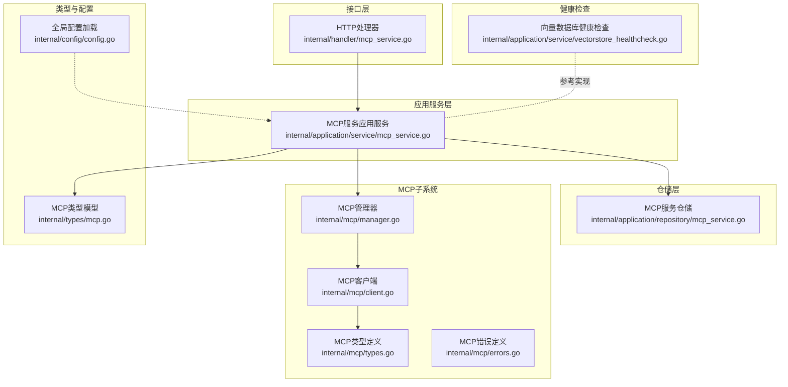
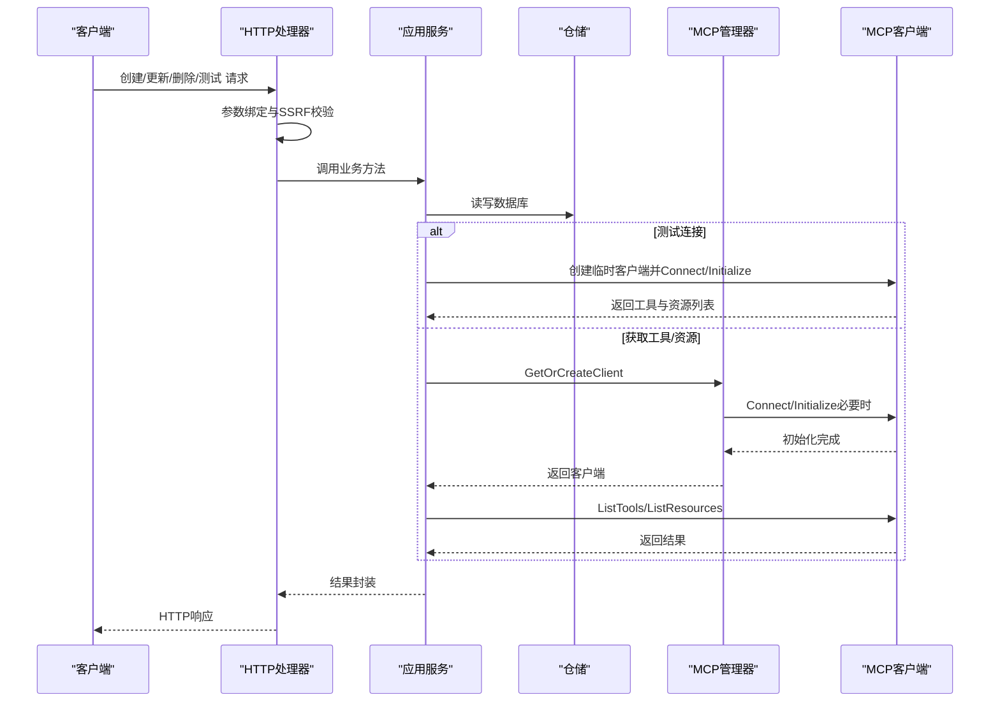
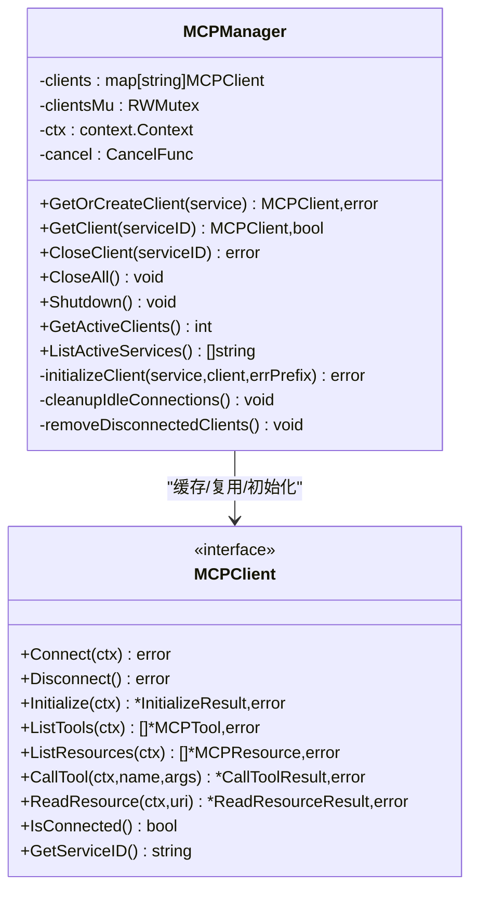
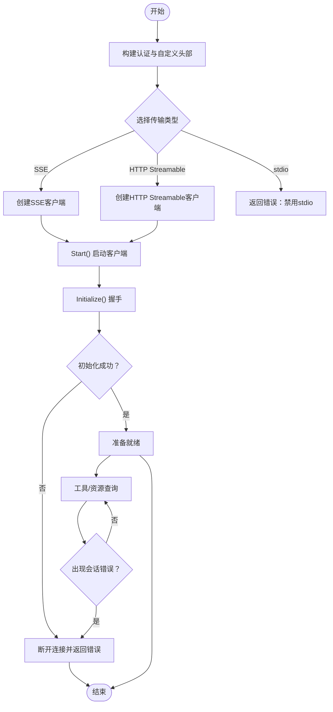
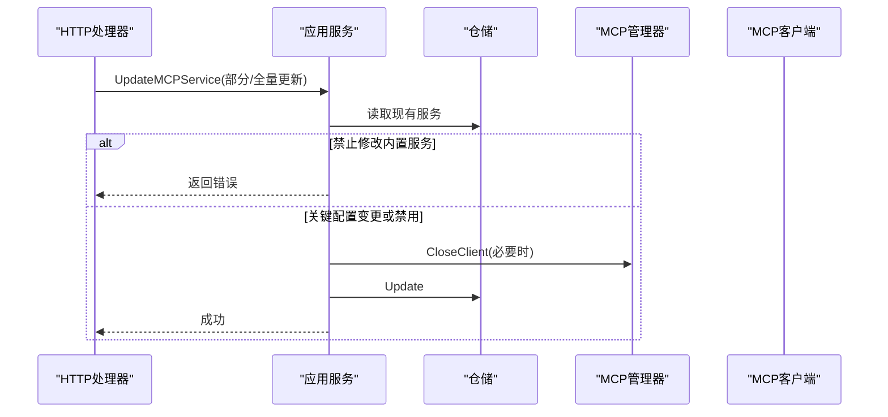
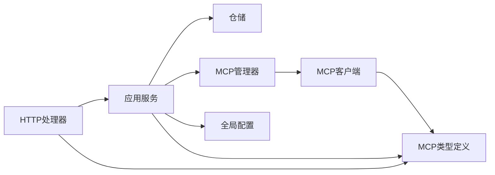

# MCP服务管理

<cite>
**本文档引用的文件**
- [internal/mcp/manager.go](file://internal/mcp/manager.go)
- [internal/mcp/client.go](file://internal/mcp/client.go)
- [internal/mcp/types.go](file://internal/mcp/types.go)
- [internal/mcp/errors.go](file://internal/mcp/errors.go)
- [internal/times/mcp.go](file://internal/types/mcp.go)
- [internal/application/service/mcp_service.go](file://internal/application/service/mcp_service.go)
- [internal/application/repository/mcp_service.go](file://internal/application/repository/mcp_service.go)
- [internal/handler/mcp_service.go](file://internal/handler/mcp_service.go)
- [client/mcp_service.go](file://client/mcp_service.go)
- [internal/application/service/vectorstore_healthcheck.go](file://internal/application/service/vectorstore_healthcheck.go)
- [internal/config/config.go](file://internal/config/config.go)
- [docs/BUILTIN_MCP_SERVICES.md](file://docs/BUILTIN_MCP_SERVICES.md)
</cite>

## 目录
1. [简介](#简介)
2. [项目结构](#项目结构)
3. [核心组件](#核心组件)
4. [架构总览](#架构总览)
5. [详细组件分析](#详细组件分析)
6. [依赖关系分析](#依赖关系分析)
7. [性能考虑](#性能考虑)
8. [故障排查指南](#故障排查指南)
9. [结论](#结论)
10. [附录](#附录)

## 简介
本文件面向WeKnora的MCP（Model Context Protocol）服务管理功能，系统性阐述其设计架构与实现原理，覆盖客户端生命周期管理、连接池机制与资源回收策略；服务发现与注册流程（含配置验证、动态加载与热更新）；监控与健康检查能力（连接状态跟踪、性能指标与故障告警）；配置管理（文件格式、参数校验与默认值处理）；以及最佳实践（并发控制、资源限制与故障恢复）与扩展点。

## 项目结构
围绕MCP服务管理的关键模块分布如下：
- 接口层：HTTP处理器负责请求路由与参数绑定，调用应用服务层
- 应用服务层：封装业务规则，协调仓库层与MCP管理器
- 仓储层：基于GORM的数据持久化，支持内置服务可见性与软删除
- MCP子系统：管理MCP客户端生命周期、连接池与初始化握手
- 类型与配置：统一的服务配置模型、默认配置与敏感信息掩码
- 健康检查：向量数据库健康检查作为系统健康监控的参考实现

**图表来源**
- [internal/handler/mcp_service.go:1-448](file://internal/handler/mcp_service.go#L1-L448)
- [internal/application/service/mcp_service.go:1-408](file://internal/application/service/mcp_service.go#L1-L408)
- [internal/application/repository/mcp_service.go:1-147](file://internal/application/repository/mcp_service.go#L1-L147)
- [internal/mcp/manager.go:1-226](file://internal/mcp/manager.go#L1-L226)
- [internal/mcp/client.go:1-379](file://internal/mcp/client.go#L1-L379)
- [internal/mcp/types.go:1-67](file://internal/mcp/types.go#L1-L67)
- [internal/mcp/errors.go:1-33](file://internal/mcp/errors.go#L1-L33)
- [internal/types/mcp.go:1-243](file://internal/types/mcp.go#L1-L243)
- [internal/config/config.go:1-758](file://internal/config/config.go#L1-L758)
- [internal/application/service/vectorstore_healthcheck.go:1-229](file://internal/application/service/vectorstore_healthcheck.go#L1-L229)

**章节来源**
- [internal/handler/mcp_service.go:1-448](file://internal/handler/mcp_service.go#L1-L448)
- [internal/application/service/mcp_service.go:1-408](file://internal/application/service/mcp_service.go#L1-L408)
- [internal/application/repository/mcp_service.go:1-147](file://internal/application/repository/mcp_service.go#L1-L147)
- [internal/mcp/manager.go:1-226](file://internal/mcp/manager.go#L1-L226)
- [internal/mcp/client.go:1-379](file://internal/mcp/client.go#L1-L379)
- [internal/mcp/types.go:1-67](file://internal/mcp/types.go#L1-L67)
- [internal/mcp/errors.go:1-33](file://internal/mcp/errors.go#L1-L33)
- [internal/types/mcp.go:1-243](file://internal/types/mcp.go#L1-L243)
- [internal/config/config.go:1-758](file://internal/config/config.go#L1-L758)
- [internal/application/service/vectorstore_healthcheck.go:1-229](file://internal/application/service/vectorstore_healthcheck.go#L1-L229)

## 核心组件
- MCP管理器（MCPManager）：负责客户端生命周期管理、连接池缓存、初始化握手、资源回收与定期清理
- MCP客户端（MCPClient）：封装mark3labs/mcp-go客户端，实现连接、初始化、工具与资源查询、会话失效检测与断开
- MCP服务应用服务（mcpServiceService）：处理CRUD、测试连接、工具与资源列表获取、内置服务可见性与敏感信息掩码
- MCP服务仓储（mcpServiceRepository）：基于GORM的持久化，支持内置服务可见性、启用状态筛选与软删除
- 类型与配置：统一的MCP服务模型、默认高级配置、敏感信息掩码、内置服务标记
- HTTP处理器（MCPServiceHandler）：请求绑定、SSRF校验、响应封装与错误处理

**章节来源**
- [internal/mcp/manager.go:13-226](file://internal/mcp/manager.go#L13-L226)
- [internal/mcp/client.go:19-379](file://internal/mcp/client.go#L19-L379)
- [internal/application/service/mcp_service.go:15-408](file://internal/application/service/mcp_service.go#L15-L408)
- [internal/application/repository/mcp_service.go:12-147](file://internal/application/repository/mcp_service.go#L12-L147)
- [internal/types/mcp.go:21-243](file://internal/types/mcp.go#L21-L243)
- [internal/handler/mcp_service.go:15-448](file://internal/handler/mcp_service.go#L15-L448)

## 架构总览
MCP服务管理采用典型的三层架构：
- 接口层：接收HTTP请求，进行参数绑定与安全校验（如SSRF），调用应用服务层
- 应用服务层：执行业务逻辑（创建/更新/删除/测试）、合并与验证配置、触发MCP管理器的连接与初始化
- 仓储层：数据持久化，内置服务可见性与软删除
- MCP子系统：客户端连接复用、初始化握手、会话失效检测与资源回收

**图表来源**
- [internal/handler/mcp_service.go:39-375](file://internal/handler/mcp_service.go#L39-L375)
- [internal/application/service/mcp_service.go:261-394](file://internal/application/service/mcp_service.go#L261-L394)
- [internal/mcp/manager.go:40-96](file://internal/mcp/manager.go#L40-L96)
- [internal/mcp/client.go:163-231](file://internal/mcp/client.go#L163-L231)

## 详细组件分析

### MCP管理器（连接池与生命周期）
- 客户端缓存：以服务ID为键缓存已建立且连接正常的客户端，避免重复连接
- 连接复用：对于SSE/HTTP Streamable传输，优先复用已有连接；stdio传输因安全原因被禁用
- 初始化握手：支持超时控制，默认30秒，最大不超过60秒；可通过高级配置调整
- 资源回收：提供CloseClient与CloseAll；定期清理断开连接；关闭时释放上下文
- 并发安全：读写锁保护客户端映射；活跃客户端计数与活动服务ID列表查询

**图表来源**
- [internal/mcp/manager.go:14-226](file://internal/mcp/manager.go#L14-L226)
- [internal/mcp/client.go:19-47](file://internal/mcp/client.go#L19-L47)

**章节来源**
- [internal/mcp/manager.go:37-226](file://internal/mcp/manager.go#L37-L226)

### MCP客户端（连接与初始化）
- 传输选择：SSE与HTTP Streamable；stdio因安全原因禁用
- 认证头注入：支持API Key与Bearer Token，以及自定义头部
- 初始化握手：协议版本与客户端信息上报；初始化失败自动断开
- 工具与资源：封装工具列表与资源列表查询；内容类型转换
- 会话失效检测：识别特定传输错误（如无效会话ID、无活动连接），主动断开以触发重建

**图表来源**
- [internal/mcp/client.go:62-135](file://internal/mcp/client.go#L62-L135)
- [internal/mcp/client.go:198-327](file://internal/mcp/client.go#L198-L327)
- [internal/mcp/client.go:143-161](file://internal/mcp/client.go#L143-L161)

**章节来源**
- [internal/mcp/client.go:62-379](file://internal/mcp/client.go#L62-L379)

### 应用服务（CRUD、测试、工具与资源）
- 创建：禁用stdio；设置默认高级配置；记录创建与更新时间
- 列表：内置服务对所有租户可见；列表视图掩码敏感信息
- 更新：禁止修改内置服务；支持部分更新；关键配置变更（URL/Stdio/传输/认证）触发连接关闭
- 删除：禁止删除内置服务；删除时关闭连接
- 测试：临时创建客户端，Connect/Initialize后列出工具与资源
- 工具与资源：通过MCP管理器获取或创建客户端后查询

**图表来源**
- [internal/application/service/mcp_service.go:114-231](file://internal/application/service/mcp_service.go#L114-L231)
- [internal/application/repository/mcp_service.go:97-139](file://internal/application/repository/mcp_service.go#L97-L139)

**章节来源**
- [internal/application/service/mcp_service.go:32-394](file://internal/application/service/mcp_service.go#L32-L394)
- [internal/application/repository/mcp_service.go:22-147](file://internal/application/repository/mcp_service.go#L22-L147)

### 仓储层（内置服务与软删除）
- 内置服务可见性：内置服务对所有租户可见，普通服务仅对所属租户可见
- 启用状态筛选：支持按租户与启用状态查询
- 软删除：使用gorm.DeletedAt字段实现软删除
- 部分更新：仅更新非零字段（除enabled需显式更新）

**章节来源**
- [internal/application/repository/mcp_service.go:27-95](file://internal/application/repository/mcp_service.go#L27-L95)
- [internal/types/mcp.go:21-39](file://internal/types/mcp.go#L21-L39)

### 类型与配置（模型与默认值）
- MCP服务模型：包含ID、租户ID、名称、描述、启用状态、传输类型、URL、头部、认证配置、高级配置、Stdio配置、环境变量、内置标记、时间戳等
- 默认高级配置：超时30秒、重试次数3次、重试间隔1秒
- 敏感信息掩码：列表视图与内置服务响应中隐藏敏感字段
- 内置服务：is_builtin字段标识，迁移脚本支持添加与索引

**章节来源**
- [internal/types/mcp.go:21-243](file://internal/types/mcp.go#L21-L243)
- [docs/BUILTIN_MCP_SERVICES.md:104-145](file://docs/BUILTIN_MCP_SERVICES.md#L104-L145)

### HTTP处理器（请求绑定与安全）
- 参数绑定：使用Gin的ShouldBindJSON进行结构化绑定
- SSRF校验：对MCP服务URL进行SSRF安全校验
- 响应封装：统一success/data结构
- 错误处理：结合应用错误类型与日志记录

**章节来源**
- [internal/handler/mcp_service.go:39-448](file://internal/handler/mcp_service.go#L39-L448)

### 健康检查（系统健康监控参考）
- 向量数据库健康检查作为系统健康监控的参考实现，展示连接测试、版本检测与错误处理模式
- MCP服务本身未直接实现健康检查，可借鉴其错误处理与超时控制模式

**章节来源**
- [internal/application/service/vectorstore_healthcheck.go:25-229](file://internal/application/service/vectorstore_healthcheck.go#L25-L229)

## 依赖关系分析

**图表来源**
- [internal/handler/mcp_service.go:15-448](file://internal/handler/mcp_service.go#L15-L448)
- [internal/application/service/mcp_service.go:15-408](file://internal/application/service/mcp_service.go#L15-L408)
- [internal/application/repository/mcp_service.go:12-147](file://internal/application/repository/mcp_service.go#L12-L147)
- [internal/mcp/manager.go:13-226](file://internal/mcp/manager.go#L13-L226)
- [internal/mcp/client.go:19-379](file://internal/mcp/client.go#L19-L379)
- [internal/mcp/types.go:1-67](file://internal/mcp/types.go#L1-67)
- [internal/types/mcp.go:1-243](file://internal/types/mcp.go#L1-L243)
- [internal/config/config.go:341-438](file://internal/config/config.go#L341-L438)

**章节来源**
- [internal/handler/mcp_service.go:15-448](file://internal/handler/mcp_service.go#L15-L448)
- [internal/application/service/mcp_service.go:15-408](file://internal/application/service/mcp_service.go#L15-L408)
- [internal/application/repository/mcp_service.go:12-147](file://internal/application/repository/mcp_service.go#L12-L147)
- [internal/mcp/manager.go:13-226](file://internal/mcp/manager.go#L13-L226)
- [internal/mcp/client.go:19-379](file://internal/mcp/client.go#L19-L379)
- [internal/mcp/types.go:1-67](file://internal/mcp/types.go#L1-67)
- [internal/types/mcp.go:1-243](file://internal/types/mcp.go#L1-L243)
- [internal/config/config.go:341-438](file://internal/config/config.go#L341-L438)

## 性能考虑
- 连接复用：通过MCP管理器缓存客户端，减少重复连接与初始化开销
- 超时控制：初始化握手支持超时上限（默认30秒，最大60秒），避免阻塞
- 定期清理：每5分钟清理断开连接，降低内存占用与资源泄漏风险
- 并发安全：读写锁保护客户端映射，避免竞态条件
- 高级配置：可通过AdvancedConfig调整超时、重试次数与重试间隔，平衡可靠性与性能

[本节为通用指导，无需具体文件分析]

## 故障排查指南
- 常见错误类型：不支持的传输类型、未连接、已连接、初始化握手失败、工具/资源未找到、无效响应、超时、连接意外关闭
- 连接丢失处理：当检测到会话失效错误时，主动断开连接以触发重建
- 日志记录：各层均记录关键操作与错误信息，便于定位问题
- SSRF防护：HTTP处理器对MCP服务URL进行SSRF校验，防止内网探测与SSRF攻击
- 内置服务安全：内置服务在前端响应中隐藏敏感信息，数据库中仍保留原始数据，需谨慎管理数据库访问权限

**章节来源**
- [internal/mcp/errors.go:5-33](file://internal/mcp/errors.go#L5-L33)
- [internal/mcp/client.go:143-161](file://internal/mcp/client.go#L143-L161)
- [internal/handler/mcp_service.go:57-64](file://internal/handler/mcp_service.go#L57-L64)
- [docs/BUILTIN_MCP_SERVICES.md:115-122](file://docs/BUILTIN_MCP_SERVICES.md#L115-L122)

## 结论
WeKnora的MCP服务管理通过清晰的分层架构与严格的生命周期管理，实现了安全、高效、可维护的服务接入与运维能力。连接池与初始化超时控制确保了稳定性，内置服务与敏感信息掩码提升了安全性与可用性。建议在生产环境中结合健康检查与日志监控，持续优化超时与重试策略，并严格遵循SSRF与权限控制最佳实践。

[本节为总结性内容，无需具体文件分析]

## 附录

### 服务发现与注册流程（配置验证、动态加载与热更新）
- 服务发现：仓储层支持按租户与启用状态查询，内置服务对所有租户可见
- 注册流程：应用服务在Agent启动时按配置模式（全部/选择/禁用）加载启用的服务，并通过MCP管理器注册工具
- 动态加载：Agent服务根据配置选择启用的服务集合，动态注册工具
- 热更新：关键配置变更（URL/Stdio/传输/认证）触发连接关闭，后续访问时重建连接

**章节来源**
- [internal/application/repository/mcp_service.go:45-73](file://internal/application/repository/mcp_service.go#L45-L73)
- [internal/application/service/agent_service.go:189-229](file://internal/application/service/agent_service.go#L189-L229)
- [internal/application/service/mcp_service.go:191-227](file://internal/application/service/mcp_service.go#L191-L227)

### 服务监控与健康检查
- 连接状态跟踪：MCP管理器提供活跃客户端计数与活动服务ID列表
- 性能指标：可通过日志与外部监控系统采集连接建立、初始化耗时、工具/资源查询耗时等
- 故障告警：结合日志与错误类型，对初始化失败、连接丢失、超时等事件进行告警

**章节来源**
- [internal/mcp/manager.go:199-225](file://internal/mcp/manager.go#L199-L225)
- [internal/mcp/errors.go:5-33](file://internal/mcp/errors.go#L5-L33)

### 服务配置管理（文件格式、参数验证与默认值）
- 配置文件格式：YAML为主，支持环境变量替换与模板加载
- 参数验证：全局配置加载时进行基础校验（范围、必填项等）
- 默认值处理：MCP服务高级配置提供默认值（超时、重试次数、重试间隔）
- 内置服务：is_builtin字段支持内置服务标记与索引

**章节来源**
- [internal/config/config.go:341-495](file://internal/config/config.go#L341-L495)
- [internal/types/mcp.go:200-207](file://internal/types/mcp.go#L200-L207)
- [docs/BUILTIN_MCP_SERVICES.md:104-145](file://docs/BUILTIN_MCP_SERVICES.md#L104-L145)

### 最佳实践（并发控制、资源限制与故障恢复）
- 并发控制：使用读写锁保护客户端映射；合理设置初始化超时
- 资源限制：定期清理断开连接；限制初始化超时上限
- 故障恢复：会话失效时主动断开；关键配置变更触发重建；SSRF校验与错误日志

**章节来源**
- [internal/mcp/manager.go:171-197](file://internal/mcp/manager.go#L171-L197)
- [internal/mcp/client.go:143-161](file://internal/mcp/client.go#L143-L161)
- [internal/handler/mcp_service.go:57-64](file://internal/handler/mcp_service.go#L57-L64)

### 扩展点与自定义选项
- 自定义传输：当前禁用stdio，可扩展其他传输类型（需评估安全影响）
- 自定义认证：支持API Key、Bearer Token与自定义头部
- 自定义初始化：可扩展初始化握手参数与能力声明
- 自定义健康检查：可借鉴向量数据库健康检查模式，扩展MCP服务健康检查

**章节来源**
- [internal/mcp/client.go:80-93](file://internal/mcp/client.go#L80-L93)
- [internal/application/service/vectorstore_healthcheck.go:25-229](file://internal/application/service/vectorstore_healthcheck.go#L25-L229)