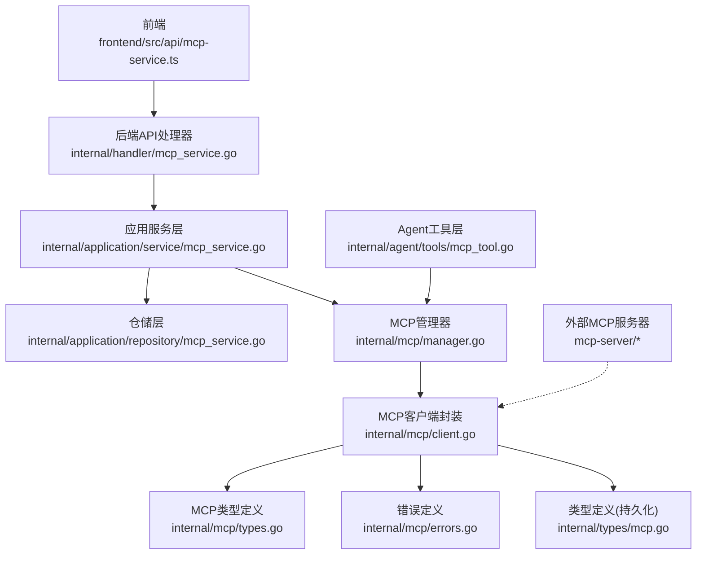
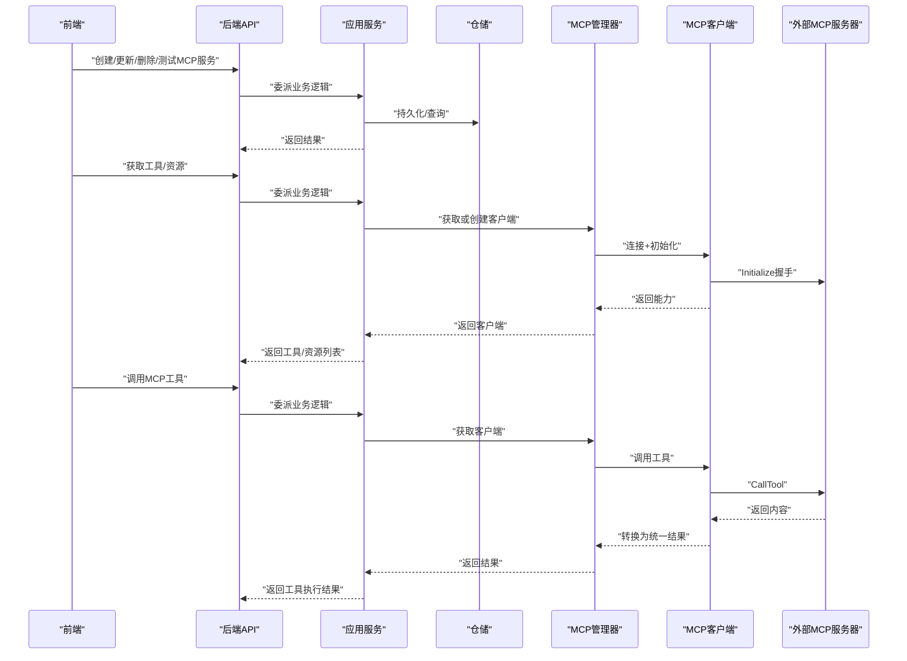
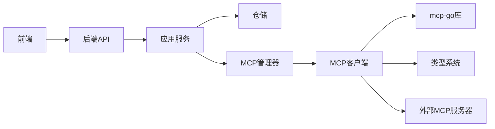

# MCP服务集成

<cite>
**本文引用的文件**
- [client/mcp_service.go](file://client/mcp_service.go)
- [internal/mcp/client.go](file://internal/mcp/client.go)
- [internal/mcp/manager.go](file://internal/mcp/manager.go)
- [internal/mcp/types.go](file://internal/mcp/types.go)
- [internal/mcp/errors.go](file://internal/mcp/errors.go)
- [internal/times/mcp.go](file://internal/types/mcp.go)
- [internal/application/service/mcp_service.go](file://internal/application/service/mcp_service.go)
- [internal/application/repository/mcp_service.go](file://internal/application/repository/mcp_service.go)
- [internal/agent/tools/mcp_tool.go](file://internal/agent/agent/tools/mcp_tool.go)
- [frontend/src/api/mcp-service.ts](file://frontend/src/api/mcp-service.ts)
- [mcp-server/README.md](file://mcp-server/README.md)
- [mcp-server/EXAMPLES.md](file://mcp-server/EXAMPLES.md)
- [mcp-server/MCP_CONFIG.md](file://mcp-server/MCP_CONFIG.md)
</cite>

## 目录
1. [简介](#简介)
2. [项目结构](#项目结构)
3. [核心组件](#核心组件)
4. [架构总览](#架构总览)
5. [详细组件分析](#详细组件分析)
6. [依赖分析](#依赖分析)
7. [性能考虑](#性能考虑)
8. [故障排查指南](#故障排查指南)
9. [结论](#结论)
10. [附录](#附录)

## 简介
本文件面向WeKnora平台的MCP（Model Context Protocol）服务集成，系统性阐述MCP协议在WeKnora中的实现原理、通信机制、服务发现与工具注册、连接管理策略（含自动重连、超时与错误恢复）、外部工具集成（参数校验、类型转换、结果处理）、开发与部署指南、调用流程与性能优化、扩展能力（自定义工具与第三方服务集成），以及安全机制与访问控制策略。文档同时提供代码级架构图与序列图，帮助读者快速理解与落地。

## 项目结构
WeKnora的MCP集成横跨前端、后端应用层、内部mcp子系统、Agent工具层与Python MCP服务器端，形成“前端配置—后端服务—MCP客户端—外部MCP服务器”的完整链路。

图表来源
- [frontend/src/api/mcp-service.ts](file://frontend/src/api/mcp-service.ts)
- [internal/application/service/mcp_service.go](file://internal/application/service/mcp_service.go)
- [internal/application/repository/mcp_service.go](file://internal/application/repository/mcp_service.go)
- [internal/mcp/manager.go](file://internal/mcp/manager.go)
- [internal/mcp/client.go](file://internal/mcp/client.go)
- [internal/mcp/types.go](file://internal/mcp/types.go)
- [internal/mcp/errors.go](file://internal/mcp/errors.go)
- [internal/types/mcp.go](file://internal/types/mcp.go)
- [internal/agent/tools/mcp_tool.go](file://internal/agent/tools/mcp_tool.go)
- [mcp-server/README.md](file://mcp-server/README.md)

章节来源
- [frontend/src/api/mcp-service.ts](file://frontend/src/api/mcp-service.ts)
- [internal/application/service/mcp_service.go](file://internal/application/service/mcp_service.go)
- [internal/application/repository/mcp_service.go](file://internal/application/repository/mcp_service.go)
- [internal/mcp/manager.go](file://internal/mcp/manager.go)
- [internal/mcp/client.go](file://internal/mcp/client.go)
- [internal/mcp/types.go](file://internal/mcp/types.go)
- [internal/mcp/errors.go](file://internal/mcp/errors.go)
- [internal/types/mcp.go](file://internal/types/mcp.go)
- [internal/agent/tools/mcp_tool.go](file://internal/agent/tools/mcp_tool.go)
- [mcp-server/README.md](file://mcp-server/README.md)

## 核心组件
- 前端API封装：提供MCP服务的增删改查、测试连接、列出工具与资源等接口定义与类型声明。
- 应用服务层：负责业务规则、权限与配置合并、连接变更后的客户端生命周期管理。
- 仓储层：提供MCP服务的持久化读写与查询（包含内置服务可见性规则）。
- MCP管理器：统一管理MCP客户端连接、复用与清理，支持SSE/HTTP Streamable传输。
- MCP客户端封装：基于第三方mcp-go库封装，实现初始化握手、工具列表、资源读取、工具调用与错误处理。
- 类型系统：前后端一致的MCP服务、工具、资源、测试结果等数据结构与数据库映射。
- Agent工具层：将MCP工具包装为可被Agent引擎使用的工具，负责参数校验、类型转换与结果处理。
- 外部MCP服务器：WeKnora MCP服务器示例，提供知识管理、会话、模型等工具。

章节来源
- [frontend/src/api/mcp-service.ts](file://frontend/src/api/mcp-service.ts)
- [internal/application/service/mcp_service.go](file://internal/application/service/mcp_service.go)
- [internal/application/repository/mcp_service.go](file://internal/application/repository/mcp_service.go)
- [internal/mcp/manager.go](file://internal/mcp/manager.go)
- [internal/mcp/client.go](file://internal/mcp/client.go)
- [internal/mcp/types.go](file://internal/mcp/types.go)
- [internal/types/mcp.go](file://internal/types/mcp.go)
- [internal/agent/tools/mcp_tool.go](file://internal/agent/tools/mcp_tool.go)
- [mcp-server/README.md](file://mcp-server/README.md)

## 架构总览
下图展示了MCP服务从配置到调用的端到端流程，涵盖服务发现、连接建立、初始化握手、工具与资源枚举、工具调用与结果处理。

图表来源
- [internal/application/service/mcp_service.go](file://internal/application/service/mcp_service.go)
- [internal/application/repository/mcp_service.go](file://internal/application/repository/mcp_service.go)
- [internal/mcp/manager.go](file://internal/mcp/manager.go)
- [internal/mcp/client.go](file://internal/mcp/client.go)
- [mcp-server/README.md](file://mcp-server/README.md)

## 详细组件分析

### 1) MCP协议实现与通信机制
- 协议栈：基于第三方mcp-go库，支持Initialize握手、ListTools、ListResources、CallTool、ReadResource等标准RPC。
- 传输类型：
  - SSE：适用于长连接，适合持续订阅与流式响应。
  - HTTP Streamable：通过HTTP流适配器实现，便于在受限环境中使用。
  - Stdio：出于安全考虑，默认禁用，防止命令注入风险。
- 初始化握手：客户端以固定协议版本与空能力集发起Initialize，记录服务器能力与版本信息。
- 错误处理：对传输层错误进行解析，识别会话失效场景（如无效会话ID、无活跃连接）并主动断开以触发重建。

章节来源
- [internal/mcp/client.go](file://internal/mcp/client.go)
- [internal/mcp/types.go](file://internal/mcp/types.go)
- [internal/mcp/errors.go](file://internal/mcp/errors.go)

### 2) 服务发现与工具注册系统
- 服务发现：
  - 仓储层支持按租户查询，内置服务对所有租户可见；启用状态与时间戳管理。
  - 列表接口对内置服务隐藏敏感字段，普通服务显示掩码后的敏感信息。
- 工具注册：
  - 应用服务在测试或使用前，通过MCP管理器获取/创建客户端并完成Initialize，随后拉取工具与资源清单。
  - Agent工具层将MCP工具包装为统一工具接口，命名采用“mcp_{service_name}_{tool_name}”以保证稳定且满足外部工具命名约束。

章节来源
- [internal/application/repository/mcp_service.go](file://internal/application/repository/mcp_service.go)
- [internal/application/service/mcp_service.go](file://internal/application/service/mcp_service.go)
- [internal/agent/tools/mcp_tool.go](file://internal/agent/tools/mcp_tool.go)

### 3) 连接管理策略（自动重连、超时与错误恢复）
- 连接复用：SSE/HTTP Streamable传输在管理器内按服务ID缓存客户端实例，避免重复握手与资源浪费。
- 生命周期：
  - 创建：管理器在后台启动清理协程，定期移除断开连接。
  - 关闭：显式CloseClient或Shutdown时断开并清空缓存。
  - 清理：周期性扫描断开连接并移除。
- 自动重连：
  - 工具调用失败时（非Stdio），管理器会断开并重建客户端，再重试一次调用。
  - 会话失效检测：当收到特定传输错误时主动断开，确保后续调用能建立新鲜会话。
- 超时控制：
  - 客户端HTTP超时由服务高级配置决定，最大不超过60秒。
  - 初始化阶段使用独立上下文超时，避免阻塞管理器生命周期。

章节来源
- [internal/mcp/manager.go](file://internal/mcp/manager.go)
- [internal/mcp/client.go](file://internal/mcp/client.go)

### 4) 外部工具集成（参数验证、类型转换、结果处理）
- 参数验证与类型转换：
  - Agent工具层负责将输入参数映射到MCP工具期望的JSON Schema，必要时进行类型转换与清洗。
  - 对Stdio传输，工具调用后会主动断开以降低长期占用风险。
- 结果处理：
  - 统一将服务器返回内容转换为文本/图片等通用结构，便于上层渲染与后续处理。
  - 若工具返回错误标记，提取文本内容作为错误消息返回给调用方。

章节来源
- [internal/agent/tools/mcp_tool.go](file://internal/agent/tools/mcp_tool.go)
- [internal/mcp/client.go](file://internal/mcp/client.go)

### 5) MCP服务开发指南（创建、配置与部署）
- 服务创建与配置：
  - 支持SSE与HTTP Streamable两种传输；Stdio默认禁用。
  - 高级配置包含超时、重试次数与重试间隔；未提供时使用默认值。
  - 认证支持API Key、Bearer Token与自定义头部。
- 前端集成：
  - 提供MCP服务的增删改查、测试连接、工具与资源列举接口。
- 后端集成：
  - 应用服务负责配置合并、内置服务限制、启用状态变更与连接关闭策略。
- 外部MCP服务器：
  - WeKnora MCP服务器示例提供知识库、知识、会话、模型等工具。
  - 支持通过uv运行，便于在不同MCP客户端中配置与启动。

章节来源
- [client/mcp_service.go](file://client/mcp_service.go)
- [internal/application/service/mcp_service.go](file://internal/application/service/mcp_service.go)
- [internal/types/mcp.go](file://internal/types/mcp.go)
- [frontend/src/api/mcp-service.ts](file://frontend/src/api/mcp-service.ts)
- [mcp-server/README.md](file://mcp-server/README.md)
- [mcp-server/EXAMPLES.md](file://mcp-server/EXAMPLES.md)
- [mcp-server/MCP_CONFIG.md](file://mcp-server/MCP_CONFIG.md)

### 6) MCP工具调用流程与性能优化
- 调用流程：
  - 前端提交工具调用请求，后端应用服务获取MCP客户端，执行CallTool，返回统一结果。
- 性能优化：
  - 连接复用与延迟初始化：仅在需要时建立连接，减少资源占用。
  - 批量与缓存：结合业务场景进行批量操作与合理缓存策略。
  - 会话管理：及时清理不再使用的会话，释放资源。

章节来源
- [internal/application/service/mcp_service.go](file://internal/application/service/mcp_service.go)
- [internal/mcp/manager.go](file://internal/mcp/manager.go)
- [mcp-server/EXAMPLES.md](file://mcp-server/EXAMPLES.md)

### 7) 扩展能力（自定义工具与第三方服务集成）
- 自定义工具开发：
  - 在Agent工具层新增MCP工具包装，遵循统一命名与参数规范。
  - 通过工具输入Schema与类型转换，确保与外部MCP服务器参数一致。
- 第三方服务集成：
  - 通过SSE/HTTP Streamable传输接入第三方MCP服务器，遵循Initialize与工具/资源枚举协议。
  - 配置认证头与超时策略，确保稳定性与安全性。

章节来源
- [internal/agent/tools/mcp_tool.go](file://internal/agent/tools/mcp_tool.go)
- [internal/mcp/client.go](file://internal/mcp/client.go)
- [mcp-server/README.md](file://mcp-server/README.md)

### 8) 安全机制与访问控制
- 传输安全：
  - SSE/HTTP Streamable传输需在受信网络中使用，建议配合TLS与反向代理。
  - Stdio传输默认禁用，避免命令注入风险。
- 认证与授权：
  - 支持API Key与Bearer Token认证，可附加自定义头部。
  - 内置MCP服务对所有租户可见但不暴露敏感配置；普通服务列表中敏感信息被掩码。
- 连接有效性：
  - 对会话失效类错误进行主动断开，避免使用过期会话造成安全风险。
- 最佳实践：
  - 严格限制MCP服务器的访问范围与认证策略。
  - 定期轮换API Key与Token，最小权限原则配置头部。

章节来源
- [internal/mcp/client.go](file://internal/mcp/client.go)
- [internal/types/mcp.go](file://internal/types/mcp.go)
- [internal/application/service/mcp_service.go](file://internal/application/service/mcp_service.go)

## 依赖分析
- 组件耦合：
  - 应用服务依赖仓储与MCP管理器；MCP管理器依赖MCP客户端封装；客户端依赖mcp-go库与类型系统。
- 外部依赖：
  - mcp-go库提供MCP协议实现；前端通过HTTP API与后端交互；外部MCP服务器通过SSE/HTTP Streamable提供工具与资源。
- 循环依赖：
  - 未发现循环依赖；类型定义位于独立包，避免双向引用。

图表来源
- [internal/application/service/mcp_service.go](file://internal/application/service/mcp_service.go)
- [internal/application/repository/mcp_service.go](file://internal/application/repository/mcp_service.go)
- [internal/mcp/manager.go](file://internal/mcp/manager.go)
- [internal/mcp/client.go](file://internal/mcp/client.go)
- [frontend/src/api/mcp-service.ts](file://frontend/src/api/mcp-service.ts)

章节来源
- [internal/application/service/mcp_service.go](file://internal/application/service/mcp_service.go)
- [internal/application/repository/mcp_service.go](file://internal/application/repository/mcp_service.go)
- [internal/mcp/manager.go](file://internal/mcp/manager.go)
- [internal/mcp/client.go](file://internal/mcp/client.go)
- [frontend/src/api/mcp-service.ts](file://frontend/src/api/mcp-service.ts)

## 性能考虑
- 连接复用：SSE/HTTP Streamable传输在管理器内缓存客户端，显著降低握手成本。
- 超时与重试：合理的超时与重试策略避免长时间阻塞；对会话失效错误主动断开，减少无效重试。
- 清理策略：定时清理断开连接，避免内存泄漏与资源浪费。
- 批量与缓存：结合业务场景进行批量操作与缓存，提升整体吞吐。

[本节为通用指导，无需具体文件分析]

## 故障排查指南
- 常见错误与定位：
  - 不支持的传输类型：确认传输类型为SSE或HTTP Streamable。
  - 未连接：确保已完成Initialize握手后再调用工具/资源接口。
  - 工具未找到：检查工具名称与输入Schema是否匹配。
  - 资源未找到：确认URI与MIME类型正确。
  - 无效响应：检查服务器返回格式与内容类型。
  - 操作超时：调整高级配置中的超时与重试参数。
  - 连接关闭：关注会话失效错误，管理器会自动断开并重建。
- 外部MCP服务器问题：
  - 确认WEKNORA_BASE_URL与WEKNORA_API_KEY配置正确。
  - 使用--check-only与--verbose进行诊断。
- 建议排查步骤：
  - 先进行服务测试连接，确认Initialize与工具/资源枚举成功。
  - 观察管理器日志与客户端回调，定位会话失效与断线原因。
  - 对工具调用失败进行一次自动重试，若仍失败检查参数与Schema。

章节来源
- [internal/mcp/errors.go](file://internal/mcp/errors.go)
- [internal/mcp/client.go](file://internal/mcp/client.go)
- [internal/application/service/mcp_service.go](file://internal/application/service/mcp_service.go)
- [mcp-server/README.md](file://mcp-server/README.md)

## 结论
WeKnora的MCP服务集成功以清晰的分层架构与严格的连接管理策略为基础，实现了与外部MCP服务器的稳定交互。通过服务发现、工具注册、参数校验与结果统一封装，平台既保障了易用性，也兼顾了安全性与可扩展性。建议在生产环境中结合TLS、最小权限认证与合理的超时/重试策略，确保系统的可靠性与性能。

[本节为总结，无需具体文件分析]

## 附录
- 外部MCP服务器示例与配置参考：
  - 服务器功能与工具清单参见示例文档。
  - 客户端配置（Claude Desktop/Cursor/KiloCode等）参见配置文档。
- 前端API类型与接口：
  - MCP服务、工具、资源与测试结果的类型定义与接口路径。

章节来源
- [mcp-server/README.md](file://mcp-server/README.md)
- [mcp-server/EXAMPLES.md](file://mcp-server/EXAMPLES.md)
- [mcp-server/MCP_CONFIG.md](file://mcp-server/MCP_CONFIG.md)
- [frontend/src/api/mcp-service.ts](file://frontend/src/api/mcp-service.ts)