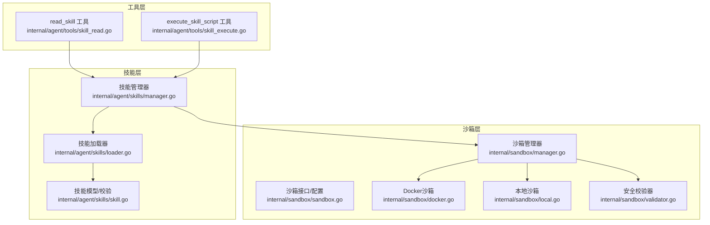
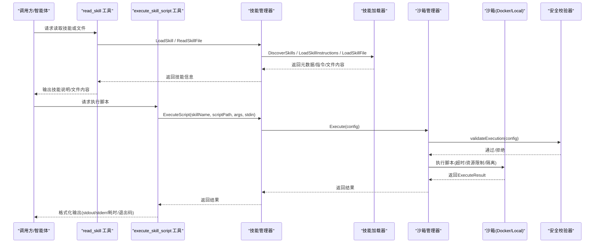
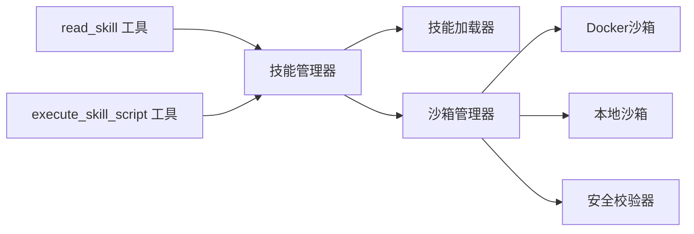

# 代理技能系统

<cite>
**本文引用的文件**
- [internal/agent/skills/manager.go](file://internal/agent/skills/manager.go)
- [internal/agent/skills/loader.go](file://internal/agent/skills/loader.go)
- [internal/agent/skills/skill.go](file://internal/agent/skills/skill.go)
- [internal/agent/tools/skill_execute.go](file://internal/agent/tools/skill_execute.go)
- [internal/agent/tools/skill_read.go](file://internal/agent/tools/skill_read.go)
- [internal/sandbox/manager.go](file://internal/sandbox/manager.go)
- [internal/sandbox/sandbox.go](file://internal/sandbox/sandbox.go)
- [internal/sandbox/docker.go](file://internal/sandbox/docker.go)
- [internal/sandbox/local.go](file://internal/sandbox/local.go)
- [internal/sandbox/validator.go](file://internal/sandbox/validator.go)
- [skills/preloaded/data-processor/scripts/analyze.py](file://skills/preloaded/data-processor/scripts/analyze.py)
- [skills/preloaded/citation-generator/SKILL.md](file://skills/preloaded/citation-generator/SKILL.md)
</cite>

## 目录
1. [简介](#简介)
2. [项目结构](#项目结构)
3. [核心组件](#核心组件)
4. [架构总览](#架构总览)
5. [详细组件分析](#详细组件分析)
6. [依赖分析](#依赖分析)
7. [性能考虑](#性能考虑)
8. [故障排查指南](#故障排查指南)
9. [结论](#结论)
10. [附录](#附录)

## 简介
本文件面向WeKnora代理技能系统，系统性阐述技能管理器的设计与实现、技能加载机制、沙箱执行环境的安全隔离与资源限制策略，并对预加载技能（文档处理、数据分析、文献管理）进行文档化说明。同时给出参数验证与错误处理机制、技能开发规范、测试与部署流程，以及扩展能力与性能监控调试建议。

## 项目结构
WeKnora的技能系统由“技能管理器”“技能加载器”“工具层”“沙箱执行器”四部分组成，采用分层设计与职责分离：
- 技能管理器：负责发现、缓存、白名单过滤、元数据暴露、脚本执行调度。
- 技能加载器：负责从文件系统扫描、解析SKILL.md、按需加载指令与附加文件。
- 工具层：对外暴露read_skill与execute_skill_script两个工具，供智能体按需调用。
- 沙箱执行器：统一抽象Docker/本地沙箱，提供安全校验、资源限制、超时控制与结果封装。

图表来源
- [internal/agent/skills/manager.go:1-284](file://internal/agent/skills/manager.go#L1-L284)
- [internal/agent/skills/loader.go:1-309](file://internal/agent/skills/loader.go#L1-L309)
- [internal/agent/skills/skill.go:1-219](file://internal/agent/skills/skill.go#L1-L219)
- [internal/agent/tools/skill_read.go:1-166](file://internal/agent/tools/skill_read.go#L1-L166)
- [internal/agent/tools/skill_execute.go:1-191](file://internal/agent/tools/skill_execute.go#L1-L191)
- [internal/sandbox/manager.go:1-258](file://internal/sandbox/manager.go#L1-L258)
- [internal/sandbox/sandbox.go:1-245](file://internal/sandbox/sandbox.go#L1-L245)
- [internal/sandbox/docker.go:1-219](file://internal/sandbox/docker.go#L1-L219)
- [internal/sandbox/local.go:1-253](file://internal/sandbox/local.go#L1-L253)
- [internal/sandbox/validator.go:1-507](file://internal/sandbox/validator.go#L1-L507)

章节来源
- [internal/agent/skills/manager.go:1-284](file://internal/agent/skills/manager.go#L1-L284)
- [internal/agent/skills/loader.go:1-309](file://internal/agent/skills/loader.go#L1-L309)
- [internal/agent/skills/skill.go:1-219](file://internal/agent/skills/skill.go#L1-L219)
- [internal/agent/tools/skill_read.go:1-166](file://internal/agent/tools/skill_read.go#L1-L166)
- [internal/agent/tools/skill_execute.go:1-191](file://internal/agent/tools/skill_execute.go#L1-L191)
- [internal/sandbox/manager.go:1-258](file://internal/sandbox/manager.go#L1-L258)
- [internal/sandbox/sandbox.go:1-245](file://internal/sandbox/sandbox.go#L1-L245)
- [internal/sandbox/docker.go:1-219](file://internal/sandbox/docker.go#L1-L219)
- [internal/sandbox/local.go:1-253](file://internal/sandbox/local.go#L1-L253)
- [internal/sandbox/validator.go:1-507](file://internal/sandbox/validator.go#L1-L507)

## 核心组件
- 技能管理器（Manager）
  - 负责初始化（发现并缓存元数据）、白名单过滤、按需加载指令、读取附加文件、执行脚本、刷新缓存、清理资源。
  - 对外提供GetAllMetadata、LoadSkill、ReadSkillFile、ListSkillFiles、ExecuteScript、GetSkillInfo、Reload、Cleanup等方法。
- 技能加载器（Loader）
  - 轻量级发现：扫描技能目录，解析SKILL.md前端YAML，仅提取元数据（Level 1）。
  - 指令加载：按需读取SKILL.md正文（Level 2）。
  - 文件读取：按相对路径读取技能目录内文件，防路径穿越（Level 3）。
  - 列表枚举：遍历技能目录，返回相对路径列表。
- 技能模型与校验（Skill）
  - 定义Skill/SkillMetadata/SkillFile结构，提供ParseSkillFile/ParseSkillMetadata、IsScript/GetScriptLanguage、Validate等。
  - 名称长度、字符集、保留词、XML标签、描述长度等约束。
- 工具层（read_skill / execute_skill_script）
  - read_skill：按需读取技能说明或指定文件，返回结构化输出。
  - execute_skill_script：在沙箱中执行脚本，收集stdout/stderr/退出码/耗时/是否被终止等结果。
- 沙箱执行器（Sandbox Manager）
  - 统一入口：根据配置选择Docker或本地沙箱；支持禁用；支持回退。
  - 安全校验：对脚本内容、参数、stdin进行注入检测与危险模式识别。
  - 资源限制：超时、内存、CPU、只读根文件系统、网络隔离、命令白名单等。
  - 结果封装：统一的ExecuteResult结构，含成功判定、输出拼装等。

章节来源
- [internal/agent/skills/manager.go:1-284](file://internal/agent/skills/manager.go#L1-L284)
- [internal/agent/skills/loader.go:1-309](file://internal/agent/skills/loader.go#L1-L309)
- [internal/agent/skills/skill.go:1-219](file://internal/agent/skills/skill.go#L1-L219)
- [internal/agent/tools/skill_read.go:1-166](file://internal/agent/tools/skill_read.go#L1-L166)
- [internal/agent/tools/skill_execute.go:1-191](file://internal/agent/tools/skill_execute.go#L1-L191)
- [internal/sandbox/manager.go:1-258](file://internal/sandbox/manager.go#L1-L258)
- [internal/sandbox/sandbox.go:1-245](file://internal/sandbox/sandbox.go#L1-L245)

## 架构总览
下图展示了从工具调用到脚本执行的关键链路，以及安全校验与资源限制的介入点。

图表来源
- [internal/agent/tools/skill_read.go:57-160](file://internal/agent/tools/skill_read.go#L57-L160)
- [internal/agent/tools/skill_execute.go:64-191](file://internal/agent/tools/skill_execute.go#L64-L191)
- [internal/agent/skills/manager.go:174-215](file://internal/agent/skills/manager.go#L174-L215)
- [internal/sandbox/manager.go:82-174](file://internal/sandbox/manager.go#L82-L174)
- [internal/sandbox/validator.go:48-191](file://internal/sandbox/validator.go#L48-L191)
- [internal/sandbox/docker.go:45-101](file://internal/sandbox/docker.go#L45-L101)
- [internal/sandbox/local.go:47-132](file://internal/sandbox/local.go#L47-L132)

## 详细组件分析

### 技能管理器（Manager）
- 初始化与缓存
  - DiscoverSkills：扫描多个技能目录，解析SKILL.md前端元数据，构建元数据缓存。
  - Initialize/Reload：支持白名单过滤与缓存刷新。
- 元数据与指令
  - GetAllMetadata：返回浅拷贝的元数据列表，用于系统提示注入。
  - LoadSkill：按需加载SKILL.md正文（Level 2）。
- 文件与脚本
  - ReadSkillFile：读取技能目录内的任意文件（Level 3），防路径穿越。
  - ListSkillFiles：枚举技能目录下的文件。
  - ExecuteScript：在沙箱中执行脚本，准备ExecuteConfig并调用沙箱管理器。
- 安全与可用性
  - 启用开关与白名单检查贯穿所有操作。
  - 依赖沙箱管理器，若未配置则拒绝执行。

章节来源
- [internal/agent/skills/manager.go:56-284](file://internal/agent/skills/manager.go#L56-L284)

### 技能加载器（Loader）
- 发现与解析
  - DiscoverSkills：遍历skillDirs，查找每个子目录中的SKILL.md，解析前端元数据，缓存Skill对象。
- 指令加载
  - LoadSkillInstructions：优先从缓存命中，否则在各目录中定位并解析SKILL.md。
- 文件读取与安全
  - LoadSkillFile：对相对路径进行清洗与绝对路径校验，防止越权访问；返回SkillFile（含IsScript标记）。
  - ListSkillFiles：遍历技能目录，返回相对路径列表。
- 路径与缓存
  - GetSkillByName/GetSkillBasePath：提供缓存查询与绝对路径解析。

章节来源
- [internal/agent/skills/loader.go:28-309](file://internal/agent/skills/loader.go#L28-L309)

### 技能模型与校验（Skill）
- 结构与元数据
  - Skill：包含名称、描述、文件系统路径、指令正文与加载状态。
  - SkillMetadata：轻量元数据，用于系统提示注入。
  - SkillFile：附加文件的元信息与内容。
- 解析与校验
  - ParseSkillFile：解析YAML前端与正文，设置Loaded=true并执行Validate。
  - Validate：名称/描述长度、字符集、保留词、XML标签、非法字符等。
  - IsScript/GetScriptLanguage：基于扩展名判断脚本类型与解释器。
- 使用场景
  - Level 1：DiscoverSkills仅解析前端元数据。
  - Level 2：LoadSkillInstructions加载正文。
  - Level 3：LoadSkillFile读取附加文件。

章节来源
- [internal/agent/skills/skill.go:32-219](file://internal/agent/skills/skill.go#L32-L219)

### 工具层（read_skill / execute_skill_script）
- read_skill
  - 输入：skill_name（必填），file_path（可选）。
  - 行为：若file_path为空，加载SKILL.md正文与描述；否则读取指定文件内容。
  - 输出：结构化文本与数据（含长度、文件列表等）。
- execute_skill_script
  - 输入：skill_name、script_path、args、input（stdin）。
  - 行为：调用Manager.ExecuteScript，在沙箱中执行脚本，收集结果并格式化输出。
  - 错误：参数校验失败、技能未启用、脚本执行失败均以ToolResult返回错误信息。

章节来源
- [internal/agent/tools/skill_read.go:57-160](file://internal/agent/tools/skill_read.go#L57-L160)
- [internal/agent/tools/skill_execute.go:64-191](file://internal/agent/tools/skill_execute.go#L64-L191)

### 沙箱执行器（Manager/Sandbox/Validator）
- 管理器
  - NewManager：根据配置选择Docker或Local沙箱；支持禁用；支持回退。
  - Execute：前置安全校验，再委派给具体沙箱执行。
  - GetSandbox/GetType：运行时查询当前沙箱类型。
- Docker沙箱
  - 通过docker run执行，非root、丢弃全部能力、只读根文件系统、网络隔离、PID限制、内存/CPU限制、工作目录映射为只读。
  - 预拉取镜像以降低首次延迟。
- 本地沙箱
  - 命令白名单、工作目录限制、超时、最小化环境变量、进程组清理。
- 安全校验器
  - ValidateScript：危险命令、危险正则、网络访问、反连模式检测。
  - ValidateArgs/ValidateStdin：参数注入、命令替换、stdin嵌入式命令检测。
  - 统一返回ValidationResult，包含错误集合。

章节来源
- [internal/sandbox/manager.go:20-258](file://internal/sandbox/manager.go#L20-L258)
- [internal/sandbox/sandbox.go:11-245](file://internal/sandbox/sandbox.go#L11-L245)
- [internal/sandbox/docker.go:13-219](file://internal/sandbox/docker.go#L13-L219)
- [internal/sandbox/local.go:15-253](file://internal/sandbox/local.go#L15-L253)
- [internal/sandbox/validator.go:38-507](file://internal/sandbox/validator.go#L38-L507)

### 预加载技能文档化
- 文档处理技能（示例：PDF处理）
  - 位置：skills/preloaded/pdf-processing/
  - 说明：包含FORMS.md与脚本，用于表单抽取与文本分析。
  - 参考：[examples/skills/pdf-processing/FORMS.md](file://examples/skills/pdf-processing/FORMS.md)、[examples/skills/pdf-processing/scripts/analyze_form.py](file://examples/skills/pdf-processing/scripts/analyze_form.py)、[examples/skills/pdf-processing/scripts/extract_text.py](file://examples/skills/pdf-processing/scripts/extract_text.py)
- 数据分析技能
  - 位置：skills/preloaded/data-processor/scripts/
  - 脚本：analyze.py（数值/文本/混合/字典列表分析，支持stdin或--file，自动类型推断）
  - 示例：[skills/preloaded/data-processor/scripts/analyze.py](file://skills/preloaded/data-processor/scripts/analyze.py)
- 文献管理技能
  - 位置：skills/preloaded/citation-generator/
  - 技能说明：引用生成器，支持简化格式与APA等格式，包含来源标注与参考文献列表格式。
  - 示例：[skills/preloaded/citation-generator/SKILL.md](file://skills/preloaded/citation-generator/SKILL.md)

章节来源
- [skills/preloaded/data-processor/scripts/analyze.py:1-251](file://skills/preloaded/data-processor/scripts/analyze.py#L1-L251)
- [skills/preloaded/citation-generator/SKILL.md:1-59](file://skills/preloaded/citation-generator/SKILL.md#L1-L59)

### 参数验证与错误处理机制
- 工具层参数校验
  - read_skill：skill_name必填；若未启用或找不到技能，返回错误ToolResult。
  - execute_skill_script：skill_name、script_path必填；args/input按Schema校验；执行失败统一包装为ToolResult。
- 沙箱安全校验
  - ValidateScript/Args/Stdin三段式校验，覆盖危险命令、注入模式、网络访问、反连等。
  - 失败时返回ValidationResult，首个错误作为拒绝依据。
- 执行结果
  - ExecuteResult包含stdout/stderr/exitCode/duration/killed/error，IsSuccess用于快速判定。

章节来源
- [internal/agent/tools/skill_read.go:71-160](file://internal/agent/tools/skill_read.go#L71-L160)
- [internal/agent/tools/skill_execute.go:78-191](file://internal/agent/tools/skill_execute.go#L78-L191)
- [internal/sandbox/validator.go:48-191](file://internal/sandbox/validator.go#L48-L191)
- [internal/sandbox/sandbox.go:118-150](file://internal/sandbox/sandbox.go#L118-L150)

### 技能开发指南
- 目录与文件
  - 每个技能为独立目录，包含SKILL.md（前端YAML + 正文）与可选的附加文件/脚本。
  - 脚本扩展名支持：.py/.sh/.bash/.js/.ts/.rb/.pl/.php。
- 规范
  - SKILL.md必须以“---”开头的YAML前端，包含name与description；正文为技能说明。
  - 名称长度与字符集限制、禁止保留词与XML标签。
  - 脚本路径使用相对路径，避免硬编码绝对路径。
- 测试
  - 单元测试：可参考工具层的参数校验与错误处理测试思路。
  - 集成测试：通过工具层调用read_skill与execute_skill_script，验证加载与执行。
- 部署
  - 将技能目录置于技能搜索路径（ManagerConfig.SkillDirs）。
  - 通过AllowedSkills进行白名单控制，确保仅启用受信任技能。
  - 生产环境建议启用Docker沙箱并开启网络隔离与只读根文件系统。

章节来源
- [internal/agent/skills/skill.go:67-100](file://internal/agent/skills/skill.go#L67-L100)
- [internal/agent/skills/skill.go:111-183](file://internal/agent/skills/skill.go#L111-L183)
- [internal/agent/skills/loader.go:194-243](file://internal/agent/skills/loader.go#L194-L243)
- [internal/agent/tools/skill_read.go:57-160](file://internal/agent/tools/skill_read.go#L57-L160)
- [internal/agent/tools/skill_execute.go:64-191](file://internal/agent/tools/skill_execute.go#L64-L191)

### 扩展能力与第三方技能集成
- 自定义技能
  - 新建目录，编写SKILL.md与所需脚本，放置于技能搜索路径。
  - 通过AllowedSkills精确控制启用范围。
- 第三方技能
  - 通过外部目录挂载或打包方式引入，确保路径安全与权限控制。
  - 建议配合白名单与沙箱策略，限制其访问范围与能力。
- MCP服务集成
  - 系统同时支持MCP服务，可作为技能的补充或替代执行通道，详见相关文档。

章节来源
- [internal/agent/skills/manager.go:18-49](file://internal/agent/skills/manager.go#L18-L49)
- [internal/sandbox/manager.go:20-80](file://internal/sandbox/manager.go#L20-L80)

### 性能监控与调试工具
- 性能指标
  - ExecuteResult.Duration：脚本实际执行时间。
  - ExitCode/Killed/Error：执行状态与异常类型。
- 调试建议
  - 使用execute_skill_script工具的详细输出（stdout/stderr/args/duration/killed）。
  - 在沙箱配置中调整超时、内存/CPU上限，观察Killed与Error。
  - 通过日志模块记录工具执行开始/结束与错误详情。

章节来源
- [internal/agent/tools/skill_execute.go:105-191](file://internal/agent/tools/skill_execute.go#L105-L191)
- [internal/sandbox/sandbox.go:118-150](file://internal/sandbox/sandbox.go#L118-L150)

## 依赖分析
- 组件耦合
  - 工具层依赖技能管理器；技能管理器依赖技能加载器与沙箱管理器。
  - 沙箱管理器依赖Docker/Local沙箱与安全校验器。
- 关键依赖链
  - read_skill → Manager.LoadSkill → Loader.LoadSkillInstructions → Skill.ParseSkillFile
  - execute_skill_script → Manager.ExecuteScript → SandboxManager.Execute → Sandbox.Execute
- 潜在风险
  - 路径穿越防护：Loader.LoadSkillFile对相对路径进行清洗与绝对路径校验。
  - 白名单与启用开关：Manager在多处进行技能可用性检查，避免越权执行。

图表来源
- [internal/agent/tools/skill_read.go:57-160](file://internal/agent/tools/skill_read.go#L57-L160)
- [internal/agent/tools/skill_execute.go:64-191](file://internal/agent/tools/skill_execute.go#L64-L191)
- [internal/agent/skills/manager.go:174-215](file://internal/agent/skills/manager.go#L174-L215)
- [internal/sandbox/manager.go:82-174](file://internal/sandbox/manager.go#L82-L174)
- [internal/sandbox/docker.go:45-101](file://internal/sandbox/docker.go#L45-L101)
- [internal/sandbox/local.go:47-132](file://internal/sandbox/local.go#L47-L132)
- [internal/sandbox/validator.go:48-191](file://internal/sandbox/validator.go#L48-L191)

章节来源
- [internal/agent/skills/manager.go:1-284](file://internal/agent/skills/manager.go#L1-L284)
- [internal/agent/skills/loader.go:1-309](file://internal/agent/skills/loader.go#L1-L309)
- [internal/agent/tools/skill_read.go:1-166](file://internal/agent/tools/skill_read.go#L1-L166)
- [internal/agent/tools/skill_execute.go:1-191](file://internal/agent/tools/skill_execute.go#L1-L191)
- [internal/sandbox/manager.go:1-258](file://internal/sandbox/manager.go#L1-L258)

## 性能考虑
- 缓存策略
  - Manager与Loader均维护缓存：Manager缓存元数据，Loader缓存已解析的Skill对象，减少重复I/O与解析开销。
- 轻量发现
  - DiscoverSkills仅解析前端元数据，避免加载大体量正文，适合系统提示注入场景。
- 资源限制
  - Docker沙箱默认只读根文件系统、禁用网络、限制内存/CPU、限制PID数量；本地沙箱通过命令白名单与最小环境变量实现基础隔离。
- 超时控制
  - 默认超时60秒，可通过配置调整；超时将导致Killed标志与错误信息。

章节来源
- [internal/agent/skills/manager.go:56-78](file://internal/agent/skills/manager.go#L56-L78)
- [internal/agent/skills/loader.go:31-44](file://internal/agent/skills/loader.go#L31-L44)
- [internal/sandbox/sandbox.go:23-29](file://internal/sandbox/sandbox.go#L23-L29)
- [internal/sandbox/docker.go:103-170](file://internal/sandbox/docker.go#L103-L170)
- [internal/sandbox/local.go:134-171](file://internal/sandbox/local.go#L134-L171)

## 故障排查指南
- 常见错误
  - “技能未启用/技能不允许”：检查Manager.IsEnabled与AllowedSkills配置。
  - “脚本未找到/路径无效”：确认脚本路径为绝对路径且在技能目录内，避免路径穿越。
  - “安全校验失败/注入检测”：检查脚本内容、参数与stdin是否包含危险模式或注入字符。
  - “Docker不可用/镜像拉取失败”：确认Docker守护进程可用，或启用回退至本地沙箱。
- 排查步骤
  - 使用read_skill读取SKILL.md与可用文件列表，确认技能存在且可枚举。
  - 使用execute_skill_script执行脚本，查看stdout/stderr/exitCode/duration/killed。
  - 检查沙箱类型与配置，必要时调整超时、内存/CPU限制与网络隔离策略。
- 日志与可观测性
  - 工具层与沙箱管理器均记录执行开始/结束与错误详情，便于定位问题。

章节来源
- [internal/agent/tools/skill_read.go:57-160](file://internal/agent/tools/skill_read.go#L57-L160)
- [internal/agent/tools/skill_execute.go:64-191](file://internal/agent/tools/skill_execute.go#L64-L191)
- [internal/sandbox/manager.go:82-174](file://internal/sandbox/manager.go#L82-L174)
- [internal/sandbox/validator.go:113-174](file://internal/sandbox/validator.go#L113-L174)

## 结论
WeKnora代理技能系统通过“发现-缓存-按需加载-沙箱执行”的分层架构，实现了安全、可控、可扩展的技能执行能力。技能管理器与加载器遵循Claude的渐进披露模式，工具层提供明确的API，沙箱层提供强隔离与资源限制，安全校验器覆盖注入与危险行为检测。预加载技能覆盖文档处理、数据分析与文献管理等典型场景，为实际应用提供了即插即用的能力基座。

## 附录
- 预加载技能清单
  - 文档处理：pdf-processing（表单抽取与文本分析）
  - 数据分析：data-processor（数值/文本/混合/字典列表分析）
  - 文献管理：citation-generator（APA/简化格式引用与参考文献）
- 相关文件
  - [skills/preloaded/data-processor/scripts/analyze.py:1-251](file://skills/preloaded/data-processor/scripts/analyze.py#L1-L251)
  - [skills/preloaded/citation-generator/SKILL.md:1-59](file://skills/preloaded/citation-generator/SKILL.md#L1-L59)