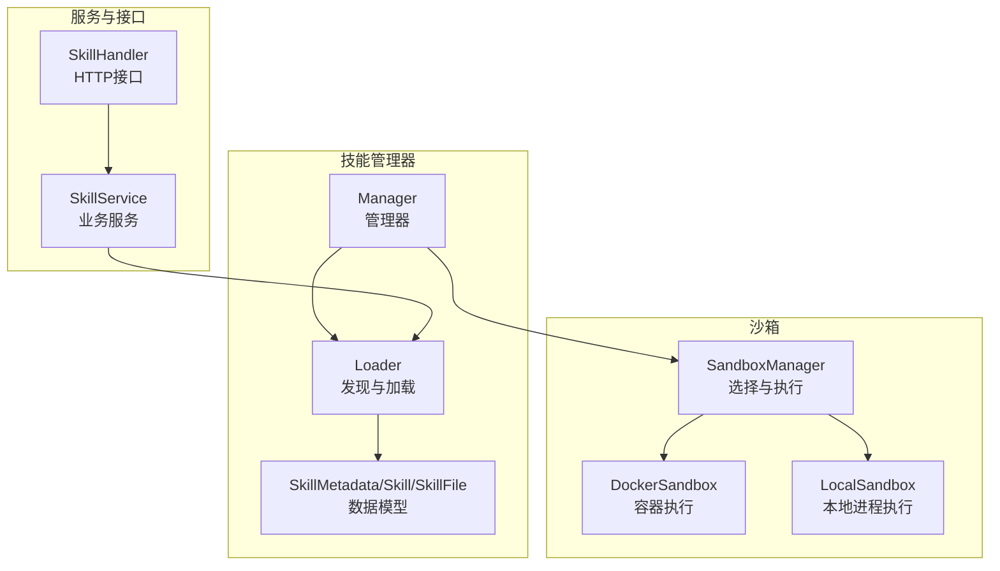
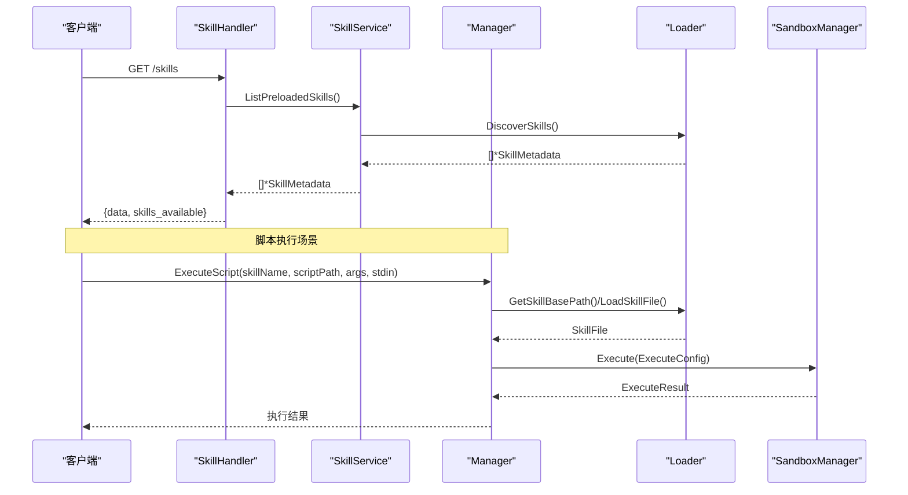
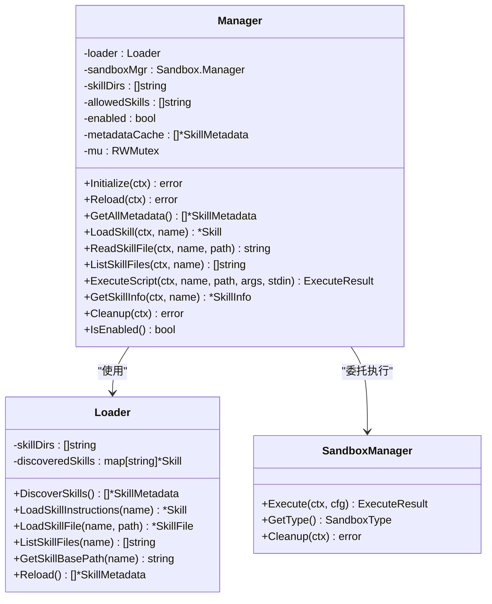
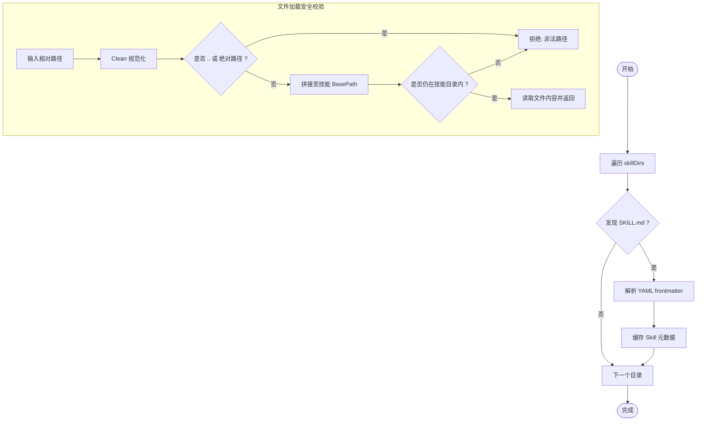
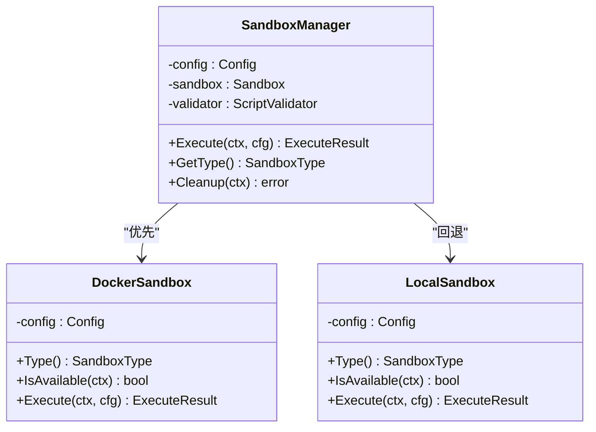
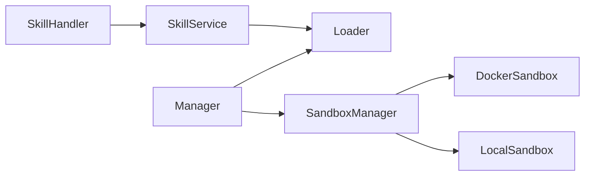

# 技能管理器

<cite>
**本文引用的文件**
- [internal/agent/skills/manager.go](file://internal/agent/skills/manager.go)
- [internal/agent/skills/loader.go](file://internal/agent/skills/loader.go)
- [internal/agent/skills/skill.go](file://internal/agent/skills/skill.go)
- [internal/sandbox/manager.go](file://internal/sandbox/manager.go)
- [internal/sandbox/docker.go](file://internal/sandbox/docker.go)
- [internal/sandbox/local.go](file://internal/sandbox/local.go)
- [internal/sandbox/sandbox.go](file://internal/sandbox/sandbox.go)
- [internal/application/service/skill_service.go](file://internal/application/service/skill_service.go)
- [internal/handler/skill_handler.go](file://internal/handler/skill_handler.go)
- [internal/application/service/session_agent_qa.go](file://internal/application/service/session_agent_qa.go)
- [internal/agent/tools/skill_execute.go](file://internal/agent/tools/skill_execute.go)
- [examples/skills/pdf-processing/SKILL.md](file://examples/skills/pdf-processing/SKILL.md)
- [examples/skills/pdf-processing/scripts/analyze_form.py](file://examples/skills/pdf-processing/scripts/analyze_form.py)
- [skills/preloaded/citation-generator/SKILL.md](file://skills/preloaded/citation-generator/SKILL.md)
</cite>

## 目录
1. [简介](#简介)
2. [项目结构](#项目结构)
3. [核心组件](#核心组件)
4. [架构总览](#架构总览)
5. [详细组件分析](#详细组件分析)
6. [依赖分析](#依赖分析)
7. [性能考虑](#性能考虑)
8. [故障排查指南](#故障排查指南)
9. [结论](#结论)
10. [附录](#附录)

## 简介
本文件面向WeKnora技能管理器，系统性阐述其核心架构设计、Loader与Sandbox的协调机制、技能发现与加载流程、缓存策略、白名单过滤与权限控制、并发安全与内存管理、配置项说明、API接口使用方法以及错误处理与性能优化建议。目标是帮助开发者与运维人员快速理解并正确使用技能系统。

## 项目结构
技能管理器位于internal/agent/skills目录，围绕“发现-加载-执行”三阶段构建，并通过Sandbox提供隔离执行环境；同时配合Service层与Handler层对外暴露API与配置入口。

**图表来源**
- [internal/agent/skills/manager.go:11-25](file://internal/agent/skills/manager.go#L11-L25)
- [internal/agent/skills/loader.go:10-18](file://internal/agent/skills/loader.go#L10-L18)
- [internal/sandbox/manager.go:11-18](file://internal/sandbox/manager.go#L11-L18)
- [internal/application/service/skill_service.go:18-24](file://internal/application/service/skill_service.go#L18-L24)
- [internal/handler/skill_handler.go:13-23](file://internal/handler/skill_handler.go#L13-L23)

**章节来源**
- [internal/agent/skills/manager.go:11-49](file://internal/agent/skills/manager.go#L11-L49)
- [internal/agent/skills/loader.go:10-26](file://internal/agent/skills/loader.go#L10-L26)
- [internal/sandbox/manager.go:11-41](file://internal/sandbox/manager.go#L11-L41)
- [internal/application/service/skill_service.go:18-35](file://internal/application/service/skill_service.go#L18-L35)
- [internal/handler/skill_handler.go:13-23](file://internal/handler/skill_handler.go#L13-L23)

## 核心组件
- Manager：统一协调Loader与Sandbox，负责初始化、缓存、白名单过滤、脚本执行与资源清理。
- Loader：扫描技能目录，解析SKILL.md，按需加载技能指令与附加文件，提供路径校验与安全限制。
- Skill数据模型：SkillMetadata（轻量元数据）、Skill（含指令）、SkillFile（附加文件）。
- SandboxManager：根据配置选择Docker或Local沙箱，执行前进行安全校验与超时控制。
- SkillService：封装预装技能目录探测、初始化与发现逻辑。
- SkillHandler：对外提供技能列表查询等HTTP接口，结合环境变量控制前端UI显示。

**章节来源**
- [internal/agent/skills/manager.go:11-49](file://internal/agent/skills/manager.go#L11-L49)
- [internal/agent/skills/loader.go:10-26](file://internal/agent/skills/loader.go#L10-L26)
- [internal/agent/skills/skill.go:32-65](file://internal/agent/skills/skill.go#L32-L65)
- [internal/sandbox/manager.go:11-41](file://internal/sandbox/manager.go#L11-L41)
- [internal/application/service/skill_service.go:18-35](file://internal/application/service/skill_service.go#L18-L35)
- [internal/handler/skill_handler.go:13-23](file://internal/handler/skill_handler.go#L13-L23)

## 架构总览
技能管理器采用“发现-加载-执行”的分层设计，遵循Claude的渐进披露模式（Level 1：元数据；Level 2：指令；Level 3：附加文件）。Manager作为编排者，Loader负责文件系统操作，Sandbox提供隔离执行环境。Service与Handler分别承担业务与接口职责。

**图表来源**
- [internal/handler/skill_handler.go:31-72](file://internal/handler/skill_handler.go#L31-L72)
- [internal/application/service/skill_service.go:94-112](file://internal/application/service/skill_service.go#L94-L112)
- [internal/agent/skills/manager.go:174-215](file://internal/agent/skills/manager.go#L174-L215)
- [internal/agent/skills/loader.go:290-302](file://internal/agent/skills/loader.go#L290-L302)
- [internal/sandbox/manager.go:82-96](file://internal/sandbox/manager.go#L82-L96)

## 详细组件分析

### Manager组件分析
- 职责边界：集中管理技能生命周期，协调Loader与Sandbox，提供白名单过滤与并发安全缓存。
- 关键方法：
  - Initialize/Reload：发现并缓存元数据，支持白名单过滤。
  - GetAllMetadata：返回轻量元数据副本，用于系统提示注入。
  - LoadSkill/ReadSkillFile/ListSkillFiles：按需加载指令与附加文件。
  - ExecuteScript：在Sandbox中执行脚本，前置路径与类型校验。
  - GetSkillInfo：聚合技能信息（含文件清单）。
  - Cleanup：释放Sandbox资源。
- 并发与缓存：
  - RWMutex保护metadataCache，GetAllMetadata返回副本避免外部修改。
  - Reload写入新缓存并替换旧引用，确保一致性。
- 白名单与权限：
  - isSkillAllowed基于配置allowedSkills进行过滤。
  - 所有公开方法均检查enabled与allow规则，未允许的请求直接返回错误。

**图表来源**
- [internal/agent/skills/manager.go:11-25](file://internal/agent/skills/manager.go#L11-L25)
- [internal/agent/skills/loader.go:10-18](file://internal/agent/skills/loader.go#L10-L18)
- [internal/sandbox/manager.go:11-18](file://internal/sandbox/manager.go#L11-L18)

**章节来源**
- [internal/agent/skills/manager.go:56-283](file://internal/agent/skills/manager.go#L56-L283)

### Loader组件分析
- 发现策略：遍历skillDirs，扫描子目录中的SKILL.md，解析元数据并缓存。
- 指令加载：按需加载完整指令体，支持缓存复用。
- 文件加载与安全：
  - LoadSkillFile对相对路径进行Clean与安全校验（禁止上溯与绝对路径），并验证文件位于技能根目录内。
  - 返回SkillFile包含是否脚本类型标记，供执行前校验。
- 路径与基础目录：
  - GetSkillBasePath始终返回绝对路径，保证Sandbox工作目录一致。
- 列表与重载：
  - ListSkillFiles递归枚举技能目录下所有文件（相对路径）。
  - Reload清空缓存并重新发现。

**图表来源**
- [internal/agent/skills/loader.go:28-104](file://internal/agent/skills/loader.go#L28-L104)
- [internal/agent/skills/loader.go:194-243](file://internal/agent/skills/loader.go#L194-L243)

**章节来源**
- [internal/agent/skills/loader.go:28-309](file://internal/agent/skills/loader.go#L28-L309)

### Sandbox组件分析
- 选择与回退：
  - 根据配置优先尝试Docker，若不可用且允许回退则使用Local。
  - 支持异步预拉取镜像以提升首次执行性能。
- 执行流程：
  - Execute前进行安全校验（如命令白名单、路径合法性等），随后设置超时上下文并执行。
  - LocalSandbox提供基本隔离（命令白名单、工作目录限制、超时、环境变量过滤）。
  - DockerSandbox通过容器执行，具备更强隔离性。
- 结果与类型：
  - ExecuteResult包含stdout/stderr、退出码、耗时、是否被杀、错误信息等。
  - GetType返回当前沙箱类型，Disabled时拒绝执行。

**图表来源**
- [internal/sandbox/manager.go:43-80](file://internal/sandbox/manager.go#L43-L80)
- [internal/sandbox/docker.go:36-43](file://internal/sandbox/docker.go#L36-L43)
- [internal/sandbox/local.go:41-45](file://internal/sandbox/local.go#L41-L45)
- [internal/sandbox/sandbox.go:117-168](file://internal/sandbox/sandbox.go#L117-L168)

**章节来源**
- [internal/sandbox/manager.go:43-204](file://internal/sandbox/manager.go#L43-L204)
- [internal/sandbox/docker.go:36-61](file://internal/sandbox/docker.go#L36-L61)
- [internal/sandbox/local.go:41-58](file://internal/sandbox/local.go#L41-L58)
- [internal/sandbox/sandbox.go:117-168](file://internal/sandbox/sandbox.go#L117-L168)

### 数据模型与脚本识别
- SkillMetadata：仅包含name/description/basePath，用于轻量级元数据缓存。
- Skill：包含指令体与Loaded标记，支持按需加载。
- SkillFile：附加文件抽象，包含是否脚本类型判断。
- IsScript：基于扩展名判断脚本类型，支持Python、Shell、JS、Ruby、Perl、PHP等。

**章节来源**
- [internal/agent/skills/skill.go:32-65](file://internal/agent/skills/skill.go#L32-L65)
- [internal/agent/skills/skill.go:175-219](file://internal/agent/skills/skill.go#L175-L219)

### Service与Handler
- SkillService：
  - 自动探测预装技能目录（支持环境变量覆盖），初始化Loader并缓存。
  - ListPreloadedSkills：发现并返回元数据；GetSkillByName：按需加载完整指令。
- SkillHandler：
  - 提供GET /skills接口，返回技能列表与skills_available标志位（由WEKNORA_SANDBOX_MODE决定）。

**章节来源**
- [internal/application/service/skill_service.go:37-130](file://internal/application/service/skill_service.go#L37-L130)
- [internal/handler/skill_handler.go:31-72](file://internal/handler/skill_handler.go#L31-L72)

### 工具链与脚本执行
- ExecuteSkillScriptTool：
  - 输入参数校验（skill_name/script_path必须），技能启用状态检查。
  - 调用Manager.ExecuteScript执行脚本，记录日志与错误。

**章节来源**
- [internal/agent/tools/skill_execute.go:64-104](file://internal/agent/tools/skill_execute.go#L64-L104)

## 依赖分析
- Manager依赖Loader与SandboxManager，形成清晰的编排关系。
- Loader内部维护discoveredSkills缓存，避免重复磁盘访问。
- SandboxManager根据配置动态选择具体沙箱实现，屏蔽上层差异。
- Service与Handler解耦业务与接口，便于测试与扩展。

**图表来源**
- [internal/agent/skills/manager.go:11-16](file://internal/agent/skills/manager.go#L11-L16)
- [internal/sandbox/manager.go:11-18](file://internal/sandbox/manager.go#L11-L18)
- [internal/application/service/skill_service.go:18-24](file://internal/application/service/skill_service.go#L18-L24)
- [internal/handler/skill_handler.go:13-23](file://internal/handler/skill_handler.go#L13-L23)

**章节来源**
- [internal/agent/skills/manager.go:11-49](file://internal/agent/skills/manager.go#L11-L49)
- [internal/sandbox/manager.go:11-41](file://internal/sandbox/manager.go#L11-L41)
- [internal/application/service/skill_service.go:18-35](file://internal/application/service/skill_service.go#L18-L35)
- [internal/handler/skill_handler.go:13-23](file://internal/handler/skill_handler.go#L13-L23)

## 性能考虑
- 缓存策略：
  - Manager对元数据使用RWMutex保护，GetAllMetadata返回副本，降低锁竞争与外部污染风险。
  - Loader对已发现技能进行内存缓存，减少重复解析与磁盘IO。
- 轻量发现：
  - 发现阶段仅解析frontmatter，避免加载大体量指令文本。
- 沙箱预热：
  - Docker沙箱在初始化时异步预拉取镜像，降低首次执行延迟。
- I/O与遍历：
  - ListSkillFiles使用filepath.Walk递归枚举，注意在大型技能目录下的开销，建议按需调用。
- 超时与隔离：
  - Execute统一设置超时，防止长时间阻塞；Docker提供更强隔离，Local提供基础隔离。

[本节为通用指导，无需特定文件引用]

## 故障排查指南
- 技能未显示或禁用：
  - 检查WEKNORA_SANDBOX_MODE是否为空或disabled，前端据此隐藏Skills UI。
  - 确认Manager.Enabled与AllowedSkills配置，必要时调用Reload刷新缓存。
- 路径错误或权限问题：
  - Loader对相对路径进行安全校验，非法路径会报错；确认传入路径不包含“..”或绝对路径。
- 脚本非可执行：
  - ExecuteScript前会校验IsScript，确保扩展名为受支持的脚本类型。
- Docker不可用：
  - SandboxManager会回退到LocalSandbox（若启用），否则返回禁用错误。
- 服务端错误：
  - Handler在失败时返回500与错误信息，查看日志定位具体原因。

**章节来源**
- [internal/handler/skill_handler.go:61-71](file://internal/handler/skill_handler.go#L61-L71)
- [internal/agent/skills/manager.go:174-215](file://internal/agent/skills/manager.go#L174-L215)
- [internal/agent/skills/loader.go:194-243](file://internal/agent/skills/loader.go#L194-L243)
- [internal/sandbox/manager.go:43-80](file://internal/sandbox/manager.go#L43-L80)

## 结论
WeKnora技能管理器通过Manager-Loader-Sandbox三层协作，实现了从技能发现、缓存、白名单过滤到脚本安全执行的完整闭环。其渐进披露的数据模型与严格的路径安全校验，既保证了灵活性，也兼顾了安全性与可维护性。结合Service与Handler的清晰边界，系统易于扩展与集成。

[本节为总结性内容，无需特定文件引用]

## 附录

### 配置选项说明
- ManagerConfig
  - SkillDirs：技能目录列表（数组），用于发现与加载。
  - AllowedSkills：允许的技能白名单（数组），留空表示允许全部。
  - Enabled：是否启用技能功能。
- SandboxManager配置（环境变量与配置文件）
  - WEKNORA_SANDBOX_MODE：控制前端是否显示Skills UI（非空且非disabled时显示）。
  - WEKNORA_SKILLS_DIR：预装技能目录（可选），用于覆盖默认路径。
  - 其他沙箱配置（如Docker镜像、回退开关、默认超时等）由SandboxManager读取。

**章节来源**
- [internal/agent/skills/manager.go:27-32](file://internal/agent/skills/manager.go#L27-L32)
- [internal/application/service/skill_service.go:37-65](file://internal/application/service/skill_service.go#L37-L65)
- [internal/handler/skill_handler.go:61-71](file://internal/handler/skill_handler.go#L61-L71)
- [internal/application/service/session_agent_qa.go:313-343](file://internal/application/service/session_agent_qa.go#L313-L343)

### API接口使用方法
- GET /skills
  - 功能：获取预装技能列表与skills_available标志位。
  - 响应字段：success、data（包含name/description）、skills_available。
  - 权限：Bearer与ApiKeyAuth。
- 执行脚本（工具链）
  - 通过ExecuteSkillScriptTool调用Manager.ExecuteScript，传入skill_name、script_path、args、stdin等。
  - 前置条件：技能启用、白名单允许、Sandbox可用。

**章节来源**
- [internal/handler/skill_handler.go:31-72](file://internal/handler/skill_handler.go#L31-L72)
- [internal/agent/tools/skill_execute.go:64-104](file://internal/agent/tools/skill_execute.go#L64-L104)

### 示例技能
- PDF处理技能：包含SKILL.md与脚本示例，演示如何声明技能与编写脚本。
- 引用生成器：中文示例，展示技能文档结构与能力说明。

**章节来源**
- [examples/skills/pdf-processing/SKILL.md:1-41](file://examples/skills/pdf-processing/SKILL.md#L1-L41)
- [examples/skills/pdf-processing/scripts/analyze_form.py:1-47](file://examples/skills/pdf-processing/scripts/analyze_form.py#L1-L47)
- [skills/preloaded/citation-generator/SKILL.md:1-59](file://skills/preloaded/citation-generator/SKILL.md#L1-L59)