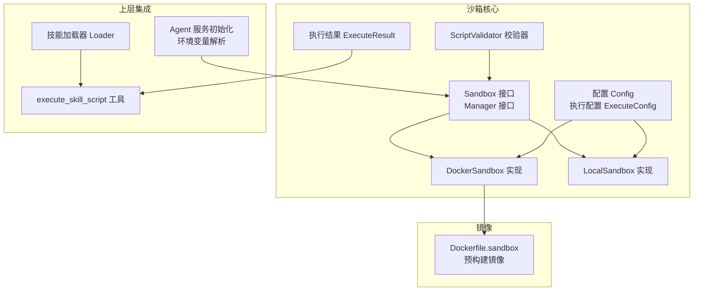
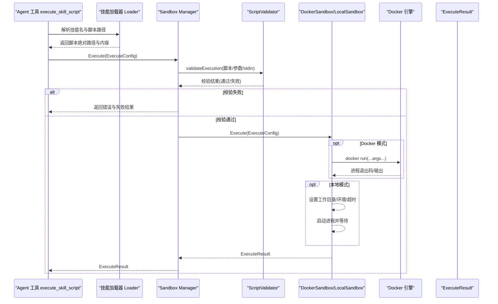
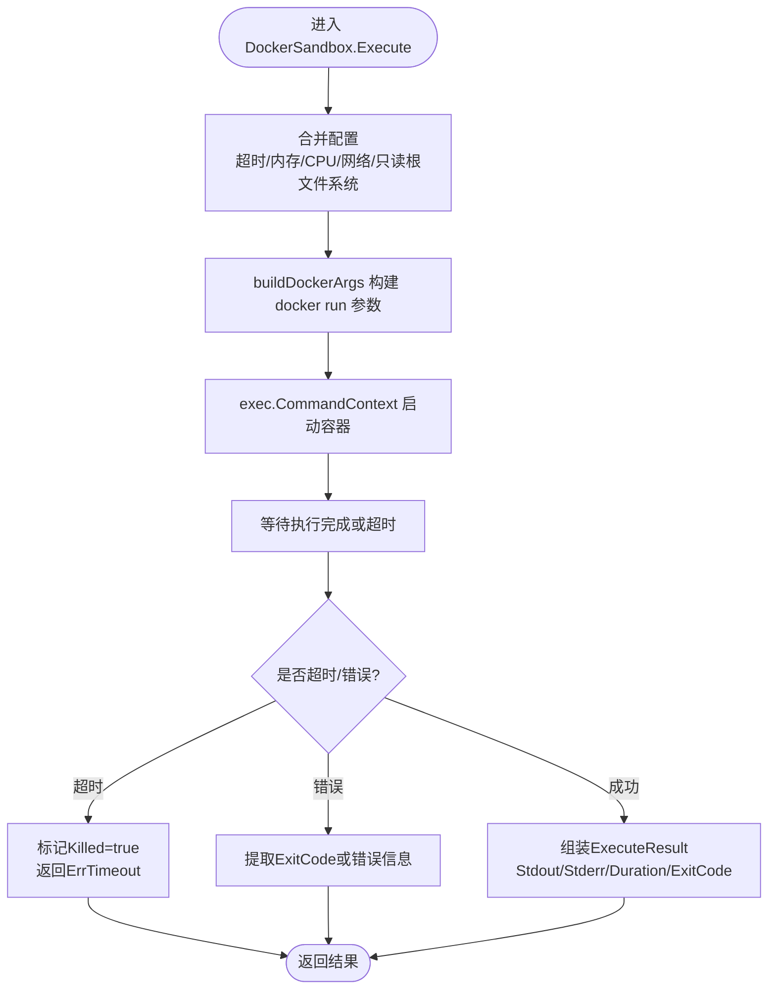
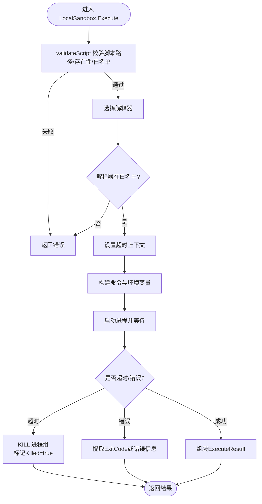
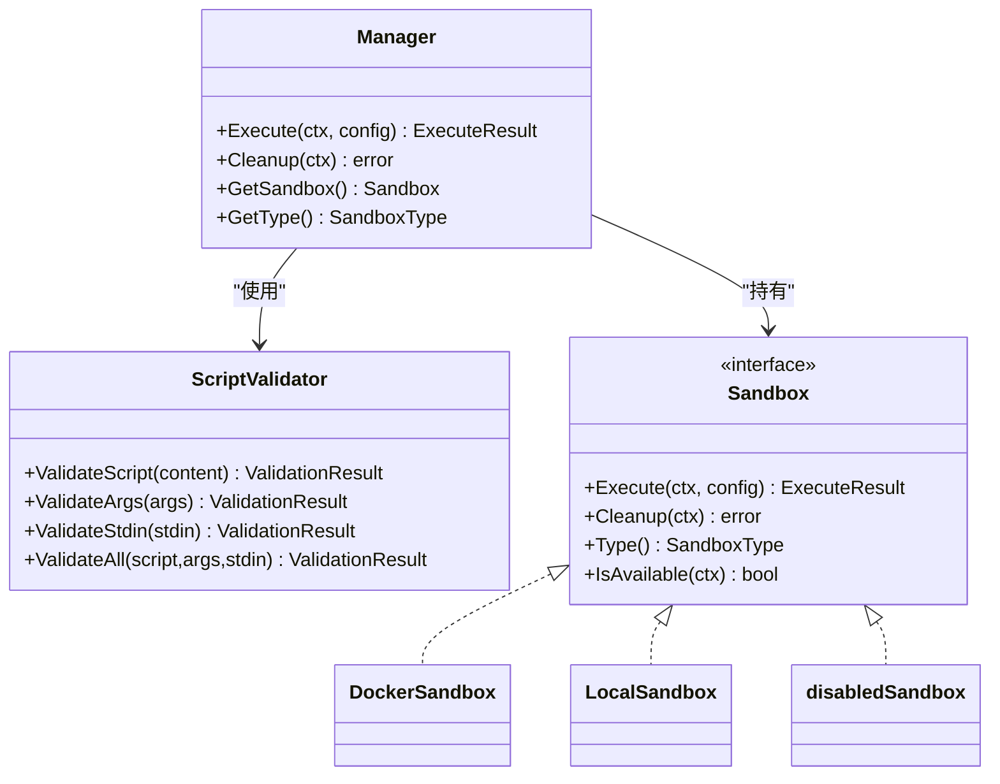
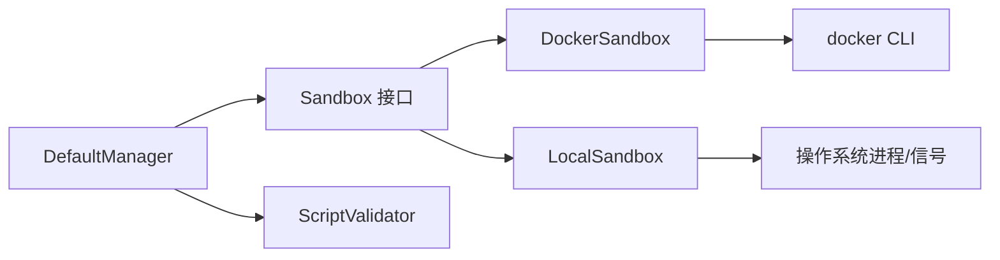

# 沙箱执行环境

<cite>
**本文档引用的文件**
- [internal/sandbox/sandbox.go](file://internal/sandbox/sandbox.go)
- [internal/sandbox/docker.go](file://internal/sandbox/docker.go)
- [internal/sandbox/local.go](file://internal/sandbox/local.go)
- [internal/sandbox/manager.go](file://internal/sandbox/manager.go)
- [internal/sandbox/validator.go](file://internal/sandbox/validator.go)
- [internal/sandbox/sandbox_test.go](file://internal/sandbox/sandbox_test.go)
- [internal/sandbox/validator_test.go](file://internal/sandbox/validator_test.go)
- [docker/Dockerfile.sandbox](file://docker/Dockerfile.sandbox)
- [internal/application/service/agent_service.go](file://internal/application/service/agent_service.go)
- [internal/agent/tools/skill_execute.go](file://internal/agent/tools/skill_execute.go)
- [internal/agent/skills/loader.go](file://internal/agent/skills/loader.go)
- [examples/skills/pdf-processing/scripts/analyze_form.py](file://examples/skills/pdf-processing/scripts/analyze_form.py)
- [examples/skills/pdf-processing/scripts/extract_text.py](file://examples/skills/pdf-processing/scripts/extract_text.py)
- [docs/agent-skills.md](file://docs/agent-skills.md)
</cite>

## 目录
1. [简介](#简介)
2. [项目结构](#项目结构)
3. [核心组件](#核心组件)
4. [架构总览](#架构总览)
5. [详细组件分析](#详细组件分析)
6. [依赖分析](#依赖分析)
7. [性能考虑](#性能考虑)
8. [故障排查指南](#故障排查指南)
9. [结论](#结论)
10. [附录](#附录)

## 简介
本文件面向WeKnora的沙箱执行环境，系统性阐述其安全隔离机制、资源限制策略、Docker与本地两种执行模式的实现差异、脚本生命周期管理（工作目录、标准输入输出、超时控制）、资源配额（CPU、内存、磁盘）、最佳实践与安全建议、执行结果处理与错误恢复、以及调试与性能监控方法。目标是帮助开发者与运维人员正确配置与使用沙箱，确保在多语言脚本执行场景下的安全性与稳定性。

## 项目结构
WeKnora的沙箱能力位于internal/sandbox目录，围绕统一接口Sandbox与Manager抽象，分别提供Docker与本地两种实现；同时内置ScriptValidator进行安全校验。上层Agent工具通过技能加载器定位脚本文件，最终交由沙箱执行。

**图表来源**
- [internal/sandbox/sandbox.go:44-73](file://internal/sandbox/sandbox.go#L44-L73)
- [internal/sandbox/docker.go:13-29](file://internal/sandbox/docker.go#L13-L29)
- [internal/sandbox/local.go:15-34](file://internal/sandbox/local.go#L15-L34)
- [internal/sandbox/validator.go:9-46](file://internal/sandbox/validator.go#L9-L46)
- [internal/application/service/agent_service.go:280-304](file://internal/application/service/agent_service.go#L280-L304)
- [internal/agent/tools/skill_execute.go:17-40](file://internal/agent/tools/skill_execute.go#L17-L40)
- [internal/agent/skills/loader.go:10-26](file://internal/agent/skills/loader.go#L10-L26)
- [docker/Dockerfile.sandbox:1-31](file://docker/Dockerfile.sandbox#L1-L31)

**章节来源**
- [internal/sandbox/sandbox.go:1-245](file://internal/sandbox/sandbox.go#L1-L245)
- [internal/sandbox/docker.go:1-219](file://internal/sandbox/docker.go#L1-L219)
- [internal/sandbox/local.go:1-253](file://internal/sandbox/local.go#L1-L253)
- [internal/sandbox/manager.go:1-258](file://internal/sandbox/manager.go#L1-L258)
- [internal/sandbox/validator.go:1-507](file://internal/sandbox/validator.go#L1-L507)
- [internal/application/service/agent_service.go:280-304](file://internal/application/service/agent_service.go#L280-L304)
- [internal/agent/tools/skill_execute.go:17-40](file://internal/agent/tools/skill_execute.go#L17-L40)
- [internal/agent/skills/loader.go:10-26](file://internal/agent/skills/loader.go#L10-L26)
- [docker/Dockerfile.sandbox:1-31](file://docker/Dockerfile.sandbox#L1-L31)

## 核心组件
- Sandbox接口：统一的脚本执行抽象，定义Execute、Cleanup、Type、IsAvailable等方法。
- Manager接口：负责沙箱选择、回退逻辑、安全校验与执行。
- DockerSandbox：基于Docker容器的强隔离实现，支持只读根文件系统、资源限制、网络隔离、非root用户等。
- LocalSandbox：本地进程隔离实现，通过命令白名单、工作目录限制、最小环境变量集、进程组清理等方式提供基础安全。
- ScriptValidator：对脚本内容、参数与stdin进行注入检测与危险模式识别。
- 执行配置ExecuteConfig与执行结果ExecuteResult：标准化输入输出与状态表达。
- 配置Config：集中管理沙箱类型、回退开关、默认超时、Docker镜像、允许命令与路径、最大CPU/内存等。

**章节来源**
- [internal/sandbox/sandbox.go:44-177](file://internal/sandbox/sandbox.go#L44-L177)
- [internal/sandbox/docker.go:13-219](file://internal/sandbox/docker.go#L13-L219)
- [internal/sandbox/local.go:15-253](file://internal/sandbox/local.go#L15-L253)
- [internal/sandbox/manager.go:11-80](file://internal/sandbox/manager.go#L11-L80)
- [internal/sandbox/validator.go:9-507](file://internal/sandbox/validator.go#L9-L507)

## 架构总览
下图展示了从Agent工具到沙箱执行的整体流程，包括安全校验、沙箱选择、资源限制与结果返回。

**图表来源**
- [internal/agent/tools/skill_execute.go:65-104](file://internal/agent/tools/skill_execute.go#L65-L104)
- [internal/agent/skills/loader.go:194-243](file://internal/agent/skills/loader.go#L194-L243)
- [internal/sandbox/manager.go:82-111](file://internal/sandbox/manager.go#L82-L111)
- [internal/sandbox/validator.go:48-191](file://internal/sandbox/validator.go#L48-L191)
- [internal/sandbox/docker.go:45-101](file://internal/sandbox/docker.go#L45-L101)
- [internal/sandbox/local.go:47-132](file://internal/sandbox/local.go#L47-L132)

## 详细组件分析

### Docker沙箱实现
- 隔离与安全
  - 非root用户执行（UID/GID 1000），降低权限风险。
  - 完全丢弃Linux Capabilities，禁用特权模式，限制PID数量，禁止新权限提升。
  - 只读根文件系统（可选），挂载脚本所在目录为只读，必要时在容器内创建临时可写目录。
  - 网络隔离：默认关闭网络，除非显式允许。
- 资源限制
  - 内存限制：通过--memory与--memory-swap配合，禁用swap以避免OOM扩散。
  - CPU限制：通过--cpus限制可用CPU核数。
- 工作目录与输入输出
  - 将宿主机脚本目录挂载到容器/workspace并设置工作目录。
  - 支持Stdin作为标准输入注入。
- 镜像与可用性
  - 默认镜像名称可配置；启动时异步拉取镜像以减少首次延迟。
  - 可检测Docker可用性与镜像存在性。

**图表来源**
- [internal/sandbox/docker.go:45-101](file://internal/sandbox/docker.go#L45-L101)
- [internal/sandbox/docker.go:103-170](file://internal/sandbox/docker.go#L103-L170)
- [internal/sandbox/docker.go:191-211](file://internal/sandbox/docker.go#L191-L211)

**章节来源**
- [internal/sandbox/docker.go:13-219](file://internal/sandbox/docker.go#L13-L219)
- [docker/Dockerfile.sandbox:25-31](file://docker/Dockerfile.sandbox#L25-L31)

### 本地沙箱实现
- 隔离与安全
  - 绝对路径校验与允许路径白名单，防止路径穿越与越权访问。
  - 命令白名单校验，仅允许预设安全命令。
  - 最小化环境变量，过滤危险变量（如LD_PRELOAD、PYTHONPATH等）。
  - 进程组（Setpgid）用于超时后清理子进程。
- 资源限制
  - 本地模式不直接提供CPU/内存/磁盘限额；主要通过超时与命令白名单实现软限制。
- 工作目录与输入输出
  - 支持指定WorkDir或默认使用脚本所在目录。
  - 支持Stdin注入与标准输出/错误收集。

**图表来源**
- [internal/sandbox/local.go:47-132](file://internal/sandbox/local.go#L47-L132)
- [internal/sandbox/local.go:134-171](file://internal/sandbox/local.go#L134-L171)
- [internal/sandbox/local.go:194-213](file://internal/sandbox/local.go#L194-L213)
- [internal/sandbox/local.go:215-246](file://internal/sandbox/local.go#L215-L246)

**章节来源**
- [internal/sandbox/local.go:15-253](file://internal/sandbox/local.go#L15-L253)

### 沙箱管理器与安全校验
- Manager职责
  - 根据配置选择Docker或Local沙箱；Docker不可用时按需回退至Local（若启用）。
  - 在执行前进行安全校验（脚本、参数、stdin），拒绝高危输入。
  - 提供统一的Execute与Cleanup接口。
- ScriptValidator规则
  - 危险命令黑名单（如rm -rf、shutdown、docker、kubectl等）。
  - 危险正则模式（base64解码、eval/exec、反向shell、pickle unsafe load等）。
  - 注入检测（命令拼接、子命令替换、重定向、路径穿越等）。
  - 网络访问与反向shell模式识别。

**图表来源**
- [internal/sandbox/manager.go:11-80](file://internal/sandbox/manager.go#L11-L80)
- [internal/sandbox/validator.go:9-46](file://internal/sandbox/validator.go#L9-L46)
- [internal/sandbox/sandbox.go:44-73](file://internal/sandbox/sandbox.go#L44-L73)
- [internal/sandbox/docker.go:13-29](file://internal/sandbox/docker.go#L13-L29)
- [internal/sandbox/local.go:15-34](file://internal/sandbox/local.go#L15-L34)
- [internal/sandbox/manager.go:206-223](file://internal/sandbox/manager.go#L206-L223)

**章节来源**
- [internal/sandbox/manager.go:11-258](file://internal/sandbox/manager.go#L11-L258)
- [internal/sandbox/validator.go:9-507](file://internal/sandbox/validator.go#L9-L507)

### 脚本生命周期管理
- 工作目录设置
  - Docker模式：将宿主机脚本目录挂载到容器/workspace并设置工作目录。
  - 本地模式：优先使用配置的WorkDir，否则使用脚本所在目录。
- 标准输入输出处理
  - 支持Stdin注入；标准输出与标准错误分别收集。
- 超时控制
  - 所有执行均在带超时的context中运行；Docker模式依赖docker命令超时；本地模式超时后会尝试KILL进程组。
- 结果与状态
  - ExecuteResult包含ExitCode、Duration、Killed、Error与输出字符串；提供IsSuccess与GetOutput辅助方法。

**章节来源**
- [internal/sandbox/docker.go:64-101](file://internal/sandbox/docker.go#L64-L101)
- [internal/sandbox/local.go:77-132](file://internal/sandbox/local.go#L77-L132)
- [internal/sandbox/sandbox.go:118-151](file://internal/sandbox/sandbox.go#L118-L151)

### 资源配额管理
- Docker模式
  - 内存：--memory与--memory-swap限制，禁用swap。
  - CPU：--cpus限制可用核数。
  - 磁盘：通过tmpfs为临时目录提供有限大小的可写空间。
- 本地模式
  - 不直接提供CPU/内存/磁盘硬限制；通过命令白名单与超时实现软限制。

**章节来源**
- [internal/sandbox/docker.go:120-136](file://internal/sandbox/docker.go#L120-L136)
- [internal/sandbox/docker.go:113-118](file://internal/sandbox/docker.go#L113-L118)
- [internal/sandbox/local.go:194-213](file://internal/sandbox/local.go#L194-L213)

### 配置与环境变量
- 环境变量
  - WEKNORA_SANDBOX_MODE：docker/local/disabled
  - WEKNORA_SANDBOX_TIMEOUT：秒级超时
  - WEKNORA_SANDBOX_DOCKER_IMAGE：自定义镜像
- 初始化流程
  - Agent服务启动时读取环境变量，创建Manager并注册工具；Docker模式自动预拉取镜像。

**章节来源**
- [docs/agent-skills.md:125-142](file://docs/agent-skills.md#L125-L142)
- [internal/application/service/agent_service.go:280-304](file://internal/application/service/agent_service.go#L280-L304)

### 执行示例与脚本位置
- 技能脚本示例位于examples/skills/pdf-processing/scripts，包含Python脚本用于演示文本抽取与表单分析。
- Agent工具execute_skill_script支持在沙箱中执行这些脚本，并通过stdin传递数据或通过参数传递文件路径。

**章节来源**
- [examples/skills/pdf-processing/scripts/analyze_form.py:1-47](file://examples/skills/pdf-processing/scripts/analyze_form.py#L1-L47)
- [examples/skills/pdf-processing/scripts/extract_text.py:1-55](file://examples/skills/pdf-processing/scripts/extract_text.py#L1-L55)
- [internal/agent/tools/skill_execute.go:17-40](file://internal/agent/tools/skill_execute.go#L17-L40)
- [internal/agent/skills/loader.go:194-243](file://internal/agent/skills/loader.go#L194-L243)

## 依赖分析
- 组件耦合
  - Manager聚合Sandbox与ScriptValidator，耦合度适中，便于替换实现。
  - DockerSandbox依赖Docker CLI；LocalSandbox依赖系统进程与环境变量。
- 外部依赖
  - Docker引擎（DockerSandbox）。
  - 操作系统进程与信号（LocalSandbox）。
- 回退策略
  - Docker不可用时可回退至LocalSandbox（取决于配置）。

**图表来源**
- [internal/sandbox/manager.go:43-80](file://internal/sandbox/manager.go#L43-L80)
- [internal/sandbox/docker.go:36-43](file://internal/sandbox/docker.go#L36-L43)
- [internal/sandbox/local.go:41-45](file://internal/sandbox/local.go#L41-L45)

**章节来源**
- [internal/sandbox/manager.go:43-80](file://internal/sandbox/manager.go#L43-L80)

## 性能考虑
- 预拉取镜像：Docker模式在初始化阶段异步拉取镜像，减少首次执行延迟。
- 超时控制：统一的超时上下文保证长时间阻塞脚本不会占用资源。
- 资源限制：Docker模式通过内存/CPU限制避免资源争用；本地模式通过命令白名单与超时实现软限制。
- I/O与网络：Docker模式默认关闭网络，减少外部I/O开销；本地模式通过最小环境变量减少不必要的库加载。

[本节为通用指导，无需具体文件引用]

## 故障排查指南
- 常见错误
  - ErrSandboxDisabled：沙箱被禁用或初始化失败。
  - ErrTimeout：脚本执行超过超时。
  - ErrScriptNotFound/ErrInvalidScript：脚本路径无效或不是文件。
  - ErrSecurityViolation/ErrDangerousCommand/ErrArgInjection/ErrStdinInjection：安全校验失败。
- 定位步骤
  - 检查环境变量WEKNORA_SANDBOX_MODE与WEKNORA_SANDBOX_TIMEOUT。
  - 查看Manager初始化日志与Docker可用性检查结果。
  - 分析ExecuteResult的ExitCode、Error与Killed标志。
  - 若为Docker模式，确认镜像存在且可拉取。
- 单元测试参考
  - 本地沙箱执行、超时、Python脚本执行、禁用模式等均有覆盖。

**章节来源**
- [internal/sandbox/sandbox.go:31-42](file://internal/sandbox/sandbox.go#L31-L42)
- [internal/sandbox/manager.go:43-80](file://internal/sandbox/manager.go#L43-L80)
- [internal/sandbox/sandbox_test.go:11-276](file://internal/sandbox/sandbox_test.go#L11-L276)
- [internal/sandbox/validator_test.go:1-362](file://internal/sandbox/validator_test.go#L1-L362)

## 结论
WeKnora的沙箱执行环境通过统一接口与双模式实现，在Docker模式下提供强隔离与资源限制，在本地模式下提供基础隔离与可控超时。结合全面的安全校验与清晰的生命周期管理，能够在多语言脚本执行场景中平衡安全性与易用性。建议生产环境优先采用Docker模式并合理配置资源上限与网络策略，同时严格控制允许命令与路径白名单。

[本节为总结，无需具体文件引用]

## 附录

### 最佳实践与安全建议
- 优先使用Docker模式，启用只读根文件系统与网络隔离。
- 明确设置内存/CPU上限，避免资源滥用。
- 严格维护命令白名单，定期审计危险命令。
- 限制允许访问的文件路径，防止路径穿越。
- 通过环境变量统一配置超时与镜像，避免硬编码。
- 对可信脚本可考虑SkipValidation（谨慎使用）。

**章节来源**
- [internal/sandbox/docker.go:107-145](file://internal/sandbox/docker.go#L107-L145)
- [internal/sandbox/local.go:134-171](file://internal/sandbox/local.go#L134-L171)
- [internal/sandbox/manager.go:98-108](file://internal/sandbox/manager.go#L98-L108)

### 调试与性能监控
- 调试
  - 启用详细日志，观察安全校验失败原因与Docker镜像拉取状态。
  - 使用单元测试验证脚本行为与超时处理。
- 性能监控
  - 关注ExecuteResult.Duration与Killed标志，评估脚本执行效率。
  - Docker模式下可通过容器资源使用指标进一步观测内存/CPU占用。

**章节来源**
- [internal/sandbox/manager.go:54-61](file://internal/sandbox/manager.go#L54-L61)
- [internal/sandbox/sandbox.go:118-151](file://internal/sandbox/sandbox.go#L118-L151)
- [internal/sandbox/sandbox_test.go:73-123](file://internal/sandbox/sandbox_test.go#L73-L123)