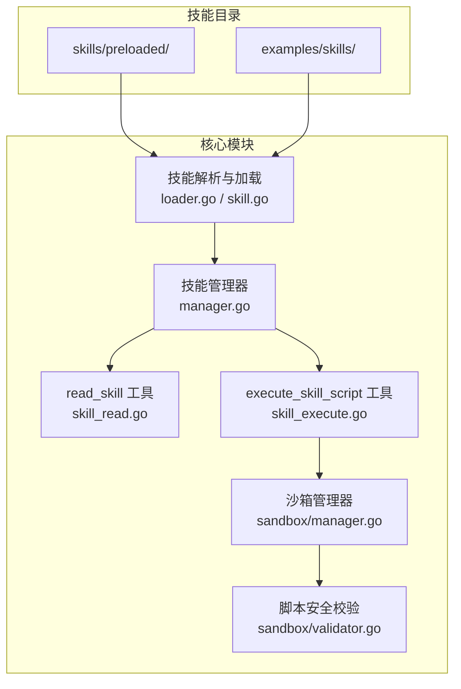
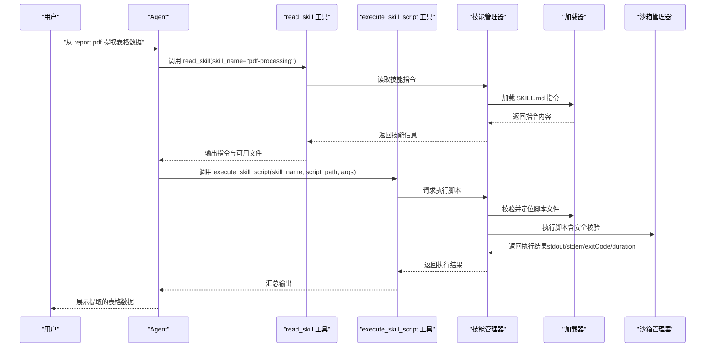
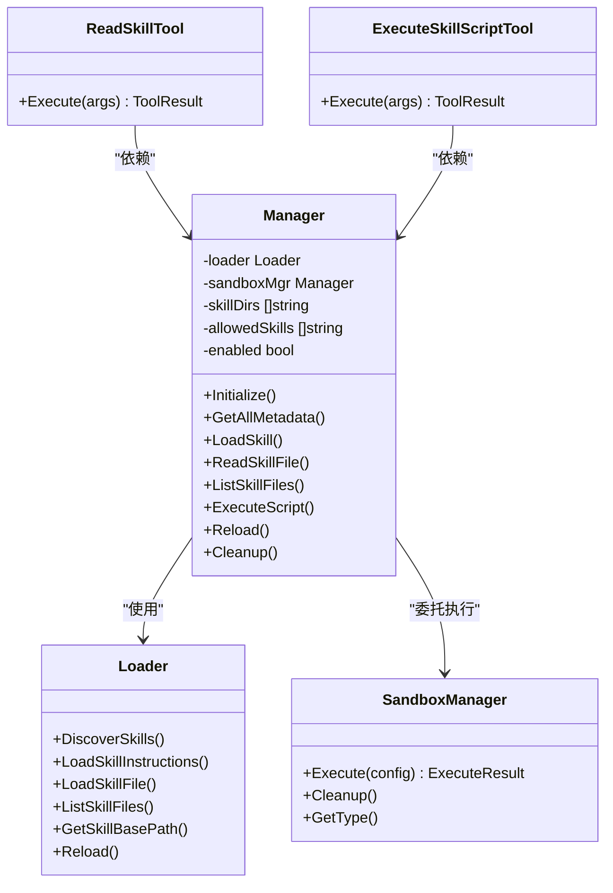

# 自定义技能开发

<cite>
**本文引用的文件**
- [examples/README.md](file://examples/skills/README.md)
- [examples/pdf-processing/SKILL.md](file://examples/skills/pdf-processing/SKILL.md)
- [examples/pdf-processing/FORMS.md](file://examples/skills/pdf-processing/FORMS.md)
- [internal/agent/skills/skill.go](file://internal/agent/skills/skill.go)
- [internal/agent/skills/loader.go](file://internal/agent/skills/loader.go)
- [internal/agent/skills/manager.go](file://internal/agent/skills/manager.go)
- [internal/agent/tools/skill_read.go](file://internal/agent/tools/skill_read.go)
- [internal/agent/tools/skill_execute.go](file://internal/agent/tools/skill_execute.go)
- [internal/agent/tools/registry.go](file://internal/agent/tools/registry.go)
- [docs/agent-skills.md](file://docs/agent-skills.md)
- [internal/sandbox/validator.go](file://internal/sandbox/validator.go)
- [internal/sandbox/manager.go](file://internal/sandbox/manager.go)
</cite>

## 目录
1. [简介](#简介)
2. [项目结构](#项目结构)
3. [核心组件](#核心组件)
4. [架构总览](#架构总览)
5. [详细组件分析](#详细组件分析)
6. [依赖关系分析](#依赖关系分析)
7. [性能考量](#性能考量)
8. [故障排查指南](#故障排查指南)
9. [结论](#结论)
10. [附录](#附录)

## 简介
本指南面向希望基于 WeKnora 自定义与扩展 Agent 能力的开发者，聚焦“技能（Skill）”体系的设计与实现。WeKnora 的技能系统采用渐进式披露（Progressive Disclosure）理念：系统提示中仅注入技能元数据（Level 1），在用户请求匹配时按需加载技能指令（Level 2），必要时再读取附加资源或执行沙箱脚本（Level 3）。该机制在保持 LLM 上下文可控的同时，最大化扩展性与安全性。

## 项目结构
技能系统主要由以下模块构成：
- 技能文件与目录规范：以 SKILL.md 为主文件，配合可选的脚本与文档资源。
- 技能解析与加载：负责扫描目录、解析元数据、按需加载指令与资源。
- 工具接口：read_skill 与 execute_skill_script 两大工具，驱动技能的按需使用。
- 沙箱执行与安全：统一的脚本执行入口与安全校验，保障脚本在受控环境中运行。
- 文档与示例：官方文档与示例技能，提供最佳实践与参考。

**图表来源**
- [internal/agent/skills/loader.go:1-309](file://internal/agent/skills/loader.go#L1-L309)
- [internal/agent/skills/skill.go:1-219](file://internal/agent/skills/skill.go#L1-L219)
- [internal/agent/skills/manager.go:1-284](file://internal/agent/skills/manager.go#L1-L284)
- [internal/agent/tools/skill_read.go:1-166](file://internal/agent/tools/skill_read.go#L1-L166)
- [internal/agent/tools/skill_execute.go:1-191](file://internal/agent/tools/skill_execute.go#L1-L191)
- [internal/sandbox/manager.go:1-197](file://internal/sandbox/manager.go#L1-L197)
- [internal/sandbox/validator.go:1-43](file://internal/sandbox/validator.go#L1-L43)

**章节来源**
- [docs/agent-skills.md:44-57](file://docs/agent-skills.md#L44-L57)
- [examples/skills/README.md:1-93](file://examples/skills/README.md#L1-L93)

## 核心组件
- 技能元数据与指令
  - 元数据：name、description，来自 SKILL.md 的 YAML frontmatter。
  - 指令：SKILL.md 主体内容，按需加载。
- 技能文件系统抽象
  - Skill：封装元数据、文件路径、指令与加载状态。
  - SkillMetadata：轻量元数据，用于系统提示注入。
  - SkillFile：技能目录下的附加文件，含是否为脚本的标记。
- 加载器（Loader）
  - 发现技能：扫描配置目录，解析 SKILL.md，缓存元数据。
  - 加载指令：按名称加载完整指令。
  - 读取资源：按相对路径读取技能目录内的文件。
  - 列出文件：枚举技能目录下所有文件。
- 管理器（Manager）
  - 生命周期：初始化、缓存、刷新。
  - 权限控制：白名单过滤允许的技能。
  - 执行脚本：在沙箱中执行指定脚本，支持 stdin 与 args。
- 工具接口
  - read_skill：读取技能指令或指定文件内容。
  - execute_skill_script：在沙箱中执行脚本，返回标准输出、错误与退出码。
- 沙箱与安全
  - 沙箱管理器：选择 Docker/Local/Disabled 模式，执行前安全校验，回退策略。
  - 脚本校验器：危险命令、危险模式、参数注入、stdin 注入等检测。

**章节来源**
- [internal/agent/skills/skill.go:32-100](file://internal/agent/skills/skill.go#L32-L100)
- [internal/agent/skills/loader.go:10-44](file://internal/agent/skills/loader.go#L10-L44)
- [internal/agent/skills/manager.go:11-54](file://internal/agent/skills/manager.go#L11-L54)
- [internal/agent/tools/skill_read.go:17-55](file://internal/agent/tools/skill_read.go#L17-L55)
- [internal/agent/tools/skill_execute.go:17-62](file://internal/agent/tools/skill_execute.go#L17-L62)
- [internal/sandbox/manager.go:11-41](file://internal/sandbox/manager.go#L11-L41)
- [internal/sandbox/validator.go:9-43](file://internal/sandbox/validator.go#L9-L43)

## 架构总览
技能系统围绕“按需加载 + 沙箱执行”的核心思想展开，工具通过技能管理器协调文件系统与沙箱执行，确保安全与性能平衡。

**图表来源**
- [internal/agent/tools/skill_read.go:57-160](file://internal/agent/tools/skill_read.go#L57-L160)
- [internal/agent/tools/skill_execute.go:64-191](file://internal/agent/tools/skill_execute.go#L64-L191)
- [internal/agent/skills/manager.go:174-215](file://internal/agent/skills/manager.go#L174-L215)
- [internal/sandbox/manager.go:98-111](file://internal/sandbox/manager.go#L98-L111)

## 详细组件分析

### 技能目录结构与文件组织规范
- 目录命名：技能目录名即技能标识，建议使用小写字母、数字与连字符的组合。
- 主文件：SKILL.md 必须包含 YAML frontmatter（name、description），其后为技能指令正文。
- 可选资源：
  - 文档：如 FORMS.md、REFERENCE.md 等。
  - 脚本：scripts/ 目录下放置可执行脚本，支持 Python、Shell、JavaScript、Ruby、Go 等。
- 示例参考：
  - 示例技能 pdf-processing 的目录结构与 frontmatter 写法。
  - FORMS.md 提供脚本使用指南与最佳实践。

**章节来源**
- [docs/agent-skills.md:44-57](file://docs/agent-skills.md#L44-L57)
- [examples/skills/README.md:54-93](file://examples/skills/README.md#L54-L93)
- [examples/skills/pdf-processing/SKILL.md:1-41](file://examples/skills/pdf-processing/SKILL.md#L1-L41)
- [examples/skills/pdf-processing/FORMS.md:1-45](file://examples/skills/pdf-processing/FORMS.md#L1-L45)

### 技能元数据文件编写规范
- YAML frontmatter 必须以三横线开头与结尾包裹，包含 name 与 description。
- 元数据验证规则：
  - name：长度限制、字符集限制、保留词禁止、XML 标签禁止。
  - description：长度限制、XML 标签禁止。
- 元数据用于系统提示注入（Level 1），仅包含技能名称与简短描述，避免泄露细节。

**章节来源**
- [internal/agent/skills/skill.go:67-100](file://internal/agent/skills/skill.go#L67-L100)
- [internal/agent/skills/skill.go:111-183](file://internal/agent/skills/skill.go#L111-L183)
- [docs/agent-skills.md:87-96](file://docs/agent-skills.md#L87-L96)

### 技能脚本编写规范
- 支持的脚本类型与解释器映射：
  - .py → python；.sh/.bash → bash；.js → node；.ts → ts-node；.rb → ruby；.pl → perl；.php → php。
- 运行时环境：
  - Docker 沙箱：预置 Python 3.11、Node.js 20、常用 CLI 工具与常用库。
  - Local 沙箱：命令白名单（python、node、bash、ruby、go run 等），工作目录限制，路径遍历防护。
- 依赖管理：
  - Docker 模式：镜像预拉取，避免首次执行等待。
  - Local 模式：需在宿主机安装相应解释器与依赖。
- 输入输出：
  - 支持通过 args 传参与 stdin 注入数据。
  - 执行结果包含 stdout、stderr、退出码与耗时。

**章节来源**
- [internal/agent/skills/skill.go:185-219](file://internal/agent/skills/skill.go#L185-L219)
- [docs/agent-skills.md:125-142](file://docs/agent-skills.md#L125-L142)
- [docs/agent-skills.md:470-534](file://docs/agent-skills.md#L470-L534)
- [docs/agent-skills.md:517-534](file://docs/agent-skills.md#L517-L534)

### 参数验证与错误处理最佳实践
- 工具参数验证：
  - 工具注册表在执行前对参数进行 JSON Schema 校验与类型强制转换，减少无效调用。
  - 参数错误时返回可指导重试的提示信息。
- 脚本安全校验：
  - 危险命令检测、危险模式匹配、网络访问检测、反向 Shell 检测、参数注入检测、stdin 注入检测。
  - 校验失败返回结构化错误，包含类型、匹配模式、上下文与人类可读描述。
- 执行结果判定：
  - 以退出码作为成功与否的主要依据；若脚本被终止（超时/杀死）会标注警告。
  - 输出截断策略避免污染上下文窗口。

**章节来源**
- [internal/agent/tools/registry.go:87-159](file://internal/agent/tools/registry.go#L87-L159)
- [internal/sandbox/validator.go:19-43](file://internal/sandbox/validator.go#L19-L43)
- [internal/sandbox/manager.go:113-174](file://internal/sandbox/manager.go#L113-L174)
- [internal/agent/tools/skill_execute.go:155-184](file://internal/agent/tools/skill_execute.go#L155-L184)

### 技能测试与调试方法
- 目录发现与元数据验证：
  - 使用示例 demo 验证目录结构与 frontmatter 格式。
- 脚本执行验证：
  - Docker 模式：确认 Docker 服务运行、镜像预拉取。
  - Local 模式：确认解释器安装与命令白名单。
- 日志与输出：
  - 工具执行日志包含工具名、参数、成功/失败与错误信息。
  - 脚本执行日志包含安全校验结果与执行详情。

**章节来源**
- [docs/agent-skills.md:622-648](file://docs/agent-skills.md#L622-L648)
- [internal/agent/tools/registry.go:92-159](file://internal/agent/tools/registry.go#L92-L159)
- [internal/sandbox/manager.go:98-111](file://internal/sandbox/manager.go#L98-L111)

### 技能部署与发布流程
- 目录配置：
  - 在 Agent 配置中设置 skill_dirs 与 allowed_skills，决定扫描范围与白名单。
- 预加载技能：
  - 系统内置预加载技能位于 skills/preloaded/，可直接使用。
- 发布策略：
  - 将自定义技能目录加入 skill_dirs，确保 frontmatter 规范与脚本安全。
  - 生产环境优先使用 Docker 沙箱，提前预拉取镜像以降低首次延迟。

**章节来源**
- [docs/agent-skills.md:97-124](file://docs/agent-skills.md#L97-L124)
- [docs/agent-skills.md:195-332](file://docs/agent-skills.md#L195-L332)

### 示例与实战案例
- 示例技能 pdf-processing：
  - SKILL.md：包含 YAML frontmatter 与技能说明。
  - FORMS.md：提供表单填充脚本的使用指南。
  - scripts/：包含 analyze_form.py 与 extract_text.py 等脚本。
- 完整工作流：
  - 用户请求 → Agent 匹配技能 → read_skill 加载指令 → execute_skill_script 执行脚本 → 返回结果。

**章节来源**
- [examples/skills/README.md:58-93](file://examples/skills/README.md#L58-L93)
- [examples/skills/pdf-processing/SKILL.md:1-41](file://examples/skills/pdf-processing/SKILL.md#L1-L41)
- [examples/skills/pdf-processing/FORMS.md:1-45](file://examples/skills/pdf-processing/FORMS.md#L1-L45)
- [docs/agent-skills.md:595-621](file://docs/agent-skills.md#L595-L621)

## 依赖关系分析
技能系统内部模块耦合清晰，职责分离明确：
- Loader 与 Manager：Loader 负责文件系统操作，Manager 负责生命周期与权限控制，并协调沙箱执行。
- Tools：read_skill 与 execute_skill_script 通过 Manager 接口访问技能与脚本。
- Sandbox：统一的安全校验与执行入口，屏蔽 Docker/Local/Disabled 差异。

**图表来源**
- [internal/agent/skills/loader.go:10-44](file://internal/agent/skills/loader.go#L10-L44)
- [internal/agent/skills/manager.go:11-54](file://internal/agent/skills/manager.go#L11-L54)
- [internal/agent/tools/skill_read.go:43-55](file://internal/agent/tools/skill_read.go#L43-L55)
- [internal/agent/tools/skill_execute.go:50-62](file://internal/agent/tools/skill_execute.go#L50-L62)
- [internal/sandbox/manager.go:59-73](file://internal/sandbox/manager.go#L59-L73)

**章节来源**
- [internal/agent/skills/loader.go:1-309](file://internal/agent/skills/loader.go#L1-L309)
- [internal/agent/skills/manager.go:1-284](file://internal/agent/skills/manager.go#L1-L284)
- [internal/agent/tools/skill_read.go:1-166](file://internal/agent/tools/skill_read.go#L1-L166)
- [internal/agent/tools/skill_execute.go:1-191](file://internal/agent/tools/skill_execute.go#L1-L191)
- [internal/sandbox/manager.go:1-197](file://internal/sandbox/manager.go#L1-L197)

## 性能考量
- 渐进式披露（Progressive Disclosure）：仅在需要时加载指令与资源，降低 Token 使用与延迟。
- 缓存策略：Manager 维护元数据缓存，避免重复扫描；Loader 缓存已加载技能对象。
- 输出截断：工具注册表对大输出进行截断，防止上下文窗口溢出。
- 沙箱预热：Docker 模式支持镜像预拉取，减少首次执行等待。

**章节来源**
- [docs/agent-skills.md:11-13](file://docs/agent-skills.md#L11-L13)
- [internal/agent/skills/manager.go:56-98](file://internal/agent/skills/manager.go#L56-L98)
- [internal/agent/tools/registry.go:29-41](file://internal/agent/tools/registry.go#L29-L41)
- [docs/agent-skills.md:486-496](file://docs/agent-skills.md#L486-L496)

## 故障排查指南
- 技能未被发现
  - 检查 skill_dirs 配置与目录权限。
  - 确认 SKILL.md 存在且 frontmatter 格式正确。
- 脚本执行失败
  - Docker 模式：检查 Docker 服务与镜像可用性。
  - Local 模式：确认解释器安装与命令白名单。
  - 检查 args 与 stdin 是否包含危险模式或注入。
- 元数据验证错误
  - 常见错误：名称过长、非法字符、保留词、描述过长、XML 标签等。

**章节来源**
- [docs/agent-skills.md:622-648](file://docs/agent-skills.md#L622-L648)
- [internal/agent/skills/skill.go:67-100](file://internal/agent/skills/skill.go#L67-L100)
- [internal/sandbox/manager.go:113-174](file://internal/sandbox/manager.go#L113-L174)

## 结论
WeKnora 的技能系统通过“元数据 + 指令 + 资源/脚本”的三层结构与严格的沙箱安全机制，实现了可扩展、可维护、可审计的 Agent 能力增强方案。开发者可按照本文档的目录结构、元数据规范与脚本编写指南，快速构建高质量的自定义技能，并结合工具与沙箱的最佳实践，确保在生产环境中的稳定与安全。

## 附录
- 预加载技能清单与能力概览：引用生成器、数据处理器、文档协作、文档分析器等。
- API 参考：Manager 接口、Skill 结构、ExecuteResult 结构与工具参数定义。

**章节来源**
- [docs/agent-skills.md:195-332](file://docs/agent-skills.md#L195-L332)
- [docs/agent-skills.md:535-593](file://docs/agent-skills.md#L535-L593)