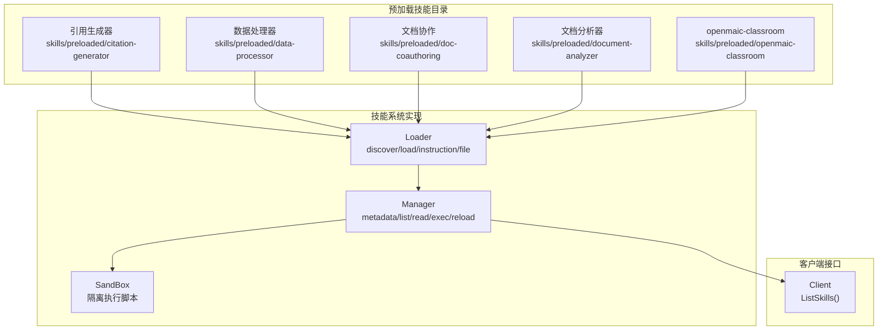
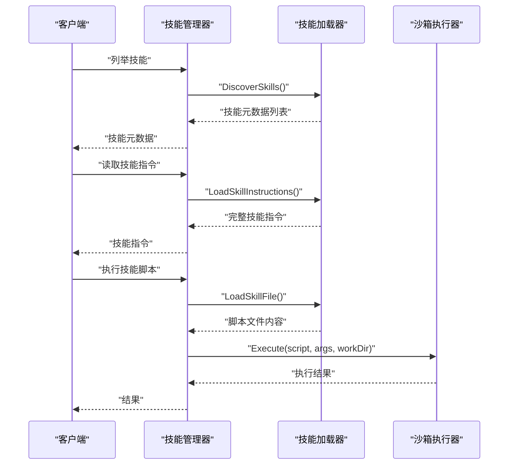
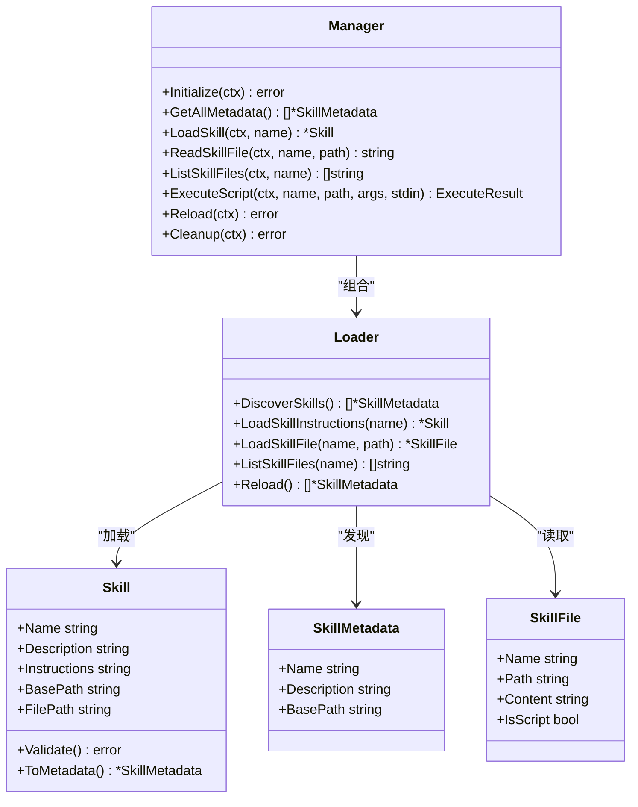

# 预加载技能

<cite>
**本文引用的文件**
- [skills\preloaded\citation-generator\SKILL.md](file://skills\preloaded\citation-generator\SKILL.md)
- [skills\preloaded\doc-coauthoring\SKILL.md](file://skills\preloaded\doc-coauthoring\SKILL.md)
- [skills\preloaded\document-analyzer\SKILL.md](file://skills\preloaded\document-analyzer\SKILL.md)
- [skills\preloaded\openmaic-classroom\SKILL.md](file://skills\preloaded\openmaic-classroom\SKILL.md)
- [internal\agent\skills\loader.go](file://internal\agent\skills\loader.go)
- [internal\agent\skills\manager.go](file://internal\agent\skills\manager.go)
- [internal\agent\skills\skill.go](file://internal\agent\skills\skill.go)
- [client\skill.go](file://client\skill.go)
- [examples\skills\pdf-processing\SKILL.md](file://examples\skills\pdf-processing\SKILL.md)
- [examples\skills\pdf-processing\scripts\analyze_form.py](file://examples\skills\pdf-processing\scripts\analyze_form.py)
- [examples\skills\pdf-processing\scripts\extract_text.py](file://examples\skills\pdf-processing\scripts\extract_text.py)
- [docs\agent-skills.md](file://docs\agent-skills.md)
- [docs\wiki\核心功能\Agent技能系统.md](file://docs\wiki\核心功能\Agent技能系统.md)
</cite>

## 目录
1. [简介](#简介)
2. [项目结构](#项目结构)
3. [核心组件](#核心组件)
4. [架构总览](#架构总览)
5. [详细组件分析](#详细组件分析)
6. [依赖分析](#依赖分析)
7. [性能考虑](#性能考虑)
8. [故障排查指南](#故障排查指南)
9. [结论](#结论)
10. [附录](#附录)

## 简介
本文件面向WeKnora的“预加载技能”子系统，系统性阐述其设计理念、分类体系与实现机制，并围绕三大核心预加载技能（引用生成器、数据处理器、文档协作）提供功能说明、使用示例与配置方法。同时，文档覆盖技能的更新机制、版本兼容性管理策略，以及技能开发模板与最佳实践，帮助开发者与运维人员高效扩展与维护技能生态。

## 项目结构
WeKnora的预加载技能位于skills/preloaded目录下，每个技能以独立子目录组织，包含技能说明文件SKILL.md及可选的脚本与资源文件。技能系统的核心实现位于internal/agent/skills包中，负责发现、加载、缓存与执行技能及其资源文件；客户端通过HTTP接口暴露技能元数据与能力。

图表来源
- [internal\agent\skills\loader.go:10-104](file://internal\agent\skills\loader.go#L10-L104)
- [internal\agent\skills\manager.go:11-49](file://internal\agent\skills\manager.go#L11-L49)
- [client\skill.go:21-34](file://client\skill.go#L21-L34)

章节来源
- [internal\agent\skills\loader.go:10-104](file://internal\agent\skills\loader.go#L10-L104)
- [internal\agent\skills\manager.go:11-49](file://internal\agent\skills\manager.go#L11-L49)
- [client\skill.go:8-34](file://client\skill.go#L8-L34)

## 核心组件
- 渐进式披露（Progressive Disclosure）：技能系统遵循三级加载策略，仅在需要时向LLM注入详细指令与资源，降低token占用与上下文污染风险。
- 发现与加载（Loader）：扫描技能目录，解析SKILL.md的YAML前置元数据，缓存技能元信息；按需加载完整指令与附加资源。
- 生命周期管理（Manager）：统一管理技能的发现、缓存、白名单过滤、脚本执行与重载；协调沙箱执行环境。
- 客户端接口：提供列举技能、读取技能文件、执行脚本等能力，便于前端与外部系统集成。

章节来源
- [internal\agent\skills\loader.go:10-104](file://internal\agent\skills\loader.go#L10-L104)
- [internal\agent\skills\manager.go:11-49](file://internal\agent\skills\manager.go#L11-L49)
- [internal\agent\skills\skill.go:32-100](file://internal\agent\skills\skill.go#L32-L100)
- [docs\agent-skills.md:15-42](file://docs\agent-skills.md#L15-L42)
- [docs\wiki\核心功能\Agent技能系统.md:23-45](file://docs\wiki\核心功能\Agent技能系统.md#L23-L45)

## 架构总览
技能系统采用“发现-缓存-按需加载-沙箱执行”的架构，确保安全与性能平衡。

图表来源
- [internal\agent\skills\manager.go:56-175](file://internal\agent\skills\manager.go#L56-L175)
- [internal\agent\skills\loader.go:28-192](file://internal\agent\skills\loader.go#L28-L192)

## 详细组件分析

### 引用生成器（Citation Generator）
- 设计理念：为检索结果与知识库内容提供规范引用格式，支持APA、MLA、Chicago与简化格式；强调来源标注与参考文献列表生成。
- 功能要点
  - 来源标注：在知识点后即时标注文档名与页码/段落编号。
  - 多格式支持：内置APA、MLA、Chicago与简化格式模板。
  - 参考文献汇总：在回答末尾生成有序参考文献列表。
- 使用示例
  - 检索到知识库内容后，在回答中按“简化格式”标注来源，并在文末生成参考文献列表。
  - 当用户要求APA格式时，自动转换为APA引用样式。
- 配置与注意事项
  - 若缺少页码，使用分块或段落编号替代。
  - 同一文档多次引用可合并为一条条目。
  - 引用必须与原文严格对应，不得虚构来源。

章节来源
- [skills\preloaded\citation-generator\SKILL.md:1-59](file://skills\preloaded\citation-generator\SKILL.md#L1-L59)

### 数据处理器（Data Processor）
- 设计理念：提供多格式数据转换能力，支持数据分析、信息抽取与格式转换，满足不同业务场景的数据处理需求。
- 功能要点
  - 多格式输入：支持Excel、CSV、JSON等多种数据源。
  - 数据分析：提供统计摘要、异常检测、趋势分析等能力。
  - 信息抽取：从非结构化文本中抽取结构化字段。
  - 格式转换：将数据转换为标准格式（如CSV/JSON/Markdown表格）。
- 使用示例
  - 上传Excel文件后，系统自动识别表头与数据类型，生成统计摘要与可视化建议。
  - 从PDF中抽取表格数据，转换为CSV并输出下载链接。
- 配置与注意事项
  - 确保数据源格式正确，避免空表头与缺失值过多导致分析失败。
  - 对于大文件，建议分批处理以控制内存占用。
  - 转换过程中的编码与分隔符需与目标格式匹配。

章节来源
- [examples\skills\pdf-processing\SKILL.md:1-41](file://examples\skills\pdf-processing\SKILL.md#L1-L41)
- [examples\skills\pdf-processing\scripts\analyze_form.py:1-47](file://examples\skills\pdf-processing\scripts\analyze_form.py#L1-L47)
- [examples\skills\pdf-processing\scripts\extract_text.py:1-55](file://examples\skills\pdf-processing\scripts\extract_text.py#L1-L55)

### 文档协作（Doc Co-Authoring）
- 设计理念：通过结构化工作流引导用户完成文档创作，包含上下文收集、细化与结构、读者测试三个阶段，提升文档质量与可读性。
- 功能要点
  - 上下文收集：通过问答与模板引导用户提供背景、受众、影响与约束。
  - 细化与结构：逐节构建内容，进行头脑风暴、筛选与草稿撰写。
  - 读者测试：模拟“无上下文”的读者视角，预测问题并反馈改进。
- 使用示例
  - 用户提及“写个提案/技术规范/决策文档”，系统主动提供三阶段工作流。
  - 在“读者测试”阶段，系统模拟读者提问并给出改进建议。
- 配置与注意事项
  - 使用“创建工件/文件”作为草稿载体，避免直接编辑全文。
  - 保持迭代节奏，连续多次小幅改进优于一次性大幅修改。
  - 对图片无替代文本的情况，提示补充alt-text以提升可访问性。

章节来源
- [skills\preloaded\doc-coauthoring\SKILL.md:1-376](file://skills\preloaded\doc-coauthoring\SKILL.md#L1-L376)

### 文档分析器（Document Analyzer）
- 设计理念：对知识库文档进行深度结构分析与内容理解，辅助用户把握文档组织方式与核心信息。
- 功能要点
  - 结构分析：识别章节层级与组织架构。
  - 关键信息提取：提取核心主题、关键论点、支撑数据与结论建议。
  - 文档类型识别：判断报告、手册、论文、合同等类型。
  - 质量评估：从完整性、一致性、清晰度维度评估文档质量。
- 使用示例
  - 输入文档后，系统输出结构层级、核心内容与分析结论，便于快速掌握文档要点。
- 配置与注意事项
  - 保持客观中立，区分事实与观点。
  - 标注信息来源位置，避免断章取义。

章节来源
- [skills\preloaded\document-analyzer\SKILL.md:1-81](file://skills\preloaded\document-analyzer\SKILL.md#L1-L81)

### openmaic-classroom（OpenMAIC 互动课程）
- 设计理念：将RAG检索结果或文档内容转换为OpenMAIC互动课程，支持托管模式与本地模式两种使用方式。
- 能力边界
  - 通过WeKnora注册的mcp_api_requester MCP工具调用OpenMAIC API，禁止使用curl等外部命令。
  - Docker容器内需使用host.docker.internal访问宿主机服务。
- 使用场景
  - 将知识库内容、检索结果或上传PDF转换为教学课件/互动课堂。
- 工作流程
  - 确认输入源（纯需求/检索结果/PDF）。
  - 构建生成请求体，按需启用网络搜索、图像/视频生成、TTS等功能。
  - 通过MCP工具调用API，查询任务进度，最终返回课程URL。
- 配置与注意事项
  - 未检测到mcp_api_requester MCP服务时，需先部署并注册该服务。
  - 托管模式每日配额有限，本地模式需自行部署实例。
  - 单次生成任务约2-10分钟，避免并发提交任务。

章节来源
- [skills\preloaded\openmaic-classroom\SKILL.md:1-273](file://skills\preloaded\openmaic-classroom\SKILL.md#L1-L273)

## 依赖分析
技能系统内部依赖关系清晰，职责分离明确：

图表来源
- [internal\agent\skills\loader.go:10-104](file://internal\agent\skills\loader.go#L10-L104)
- [internal\agent\skills\manager.go:11-49](file://internal\agent\skills\manager.go#L11-L49)
- [internal\agent\skills\skill.go:32-100](file://internal\agent\skills\skill.go#L32-L100)

章节来源
- [internal\agent\skills\loader.go:10-104](file://internal\agent\skills\loader.go#L10-L104)
- [internal\agent\skills\manager.go:11-49](file://internal\agent\skills\manager.go#L11-L49)
- [internal\agent\skills\skill.go:32-100](file://internal\agent\skills\skill.go#L32-L100)

## 性能考虑
- 渐进式披露降低token占用：仅在用户请求匹配时加载技能指令，避免将大量技能细节注入系统提示词。
- 缓存与白名单：Manager维护元数据缓存并支持技能白名单，减少不必要的IO与解析开销。
- 脚本执行隔离：通过沙箱执行脚本，限制资源消耗与权限范围，防止恶意脚本影响系统稳定性。
- I/O与路径安全：Loader在读取附加文件时进行路径清理与越权检查，避免路径穿越与越权访问。

章节来源
- [docs\agent-skills.md:15-42](file://docs\agent-skills.md#L15-L42)
- [internal\agent\skills\manager.go:56-98](file://internal\agent\skills\manager.go#L56-L98)
- [internal\agent\skills\loader.go:194-243](file://internal\agent\skills\loader.go#L194-L243)

## 故障排查指南
- 技能未显示或不可用
  - 检查技能目录是否存在且包含合法的SKILL.md（YAML前置元数据闭合）。
  - 确认Manager初始化已完成，且技能未被白名单过滤。
- 执行脚本失败
  - 确认脚本文件扩展名为允许的脚本类型（Python/Bash/Node/Ruby/Perl/PHP等）。
  - 检查沙箱是否配置并可用；确认脚本路径相对技能根目录有效且未越权。
- openmaic-classroom调用失败
  - 确认已注册mcp_api_requester MCP工具；若未检测到，按指引部署并注册。
  - 托管模式需提供有效的访问码；本地模式需确保Base URL正确并映射到host.docker.internal。
  - 遵循任务查询规则：提交后仅查询一次，用户询问进度时也仅查询一次，避免并发冲突。
- PDF处理相关问题
  - 确保PDF文件可读且未加密；对扫描版PDF需先OCR处理。
  - 使用示例脚本进行功能验证，逐步定位问题。

章节来源
- [internal\agent\skills\loader.go:194-243](file://internal\agent\skills\loader.go#L194-L243)
- [internal\agent\skills\manager.go:174-215](file://internal\agent\skills\manager.go#L174-L215)
- [skills\preloaded\openmaic-classroom\SKILL.md:194-273](file://skills\preloaded\openmaic-classroom\SKILL.md#L194-L273)
- [examples\skills\pdf-processing\SKILL.md:1-41](file://examples\skills\pdf-processing\SKILL.md#L1-L41)

## 结论
WeKnora的预加载技能系统以渐进式披露为核心设计原则，结合发现-缓存-按需加载-沙箱执行的架构，实现了高安全性与高性能的技能扩展能力。三大核心预加载技能分别覆盖学术规范引用、多格式数据处理与结构化文档协作，满足多样化业务场景。通过标准化的开发模板与严格的配置校验，系统具备良好的可维护性与可演进性。

## 附录

### 更新机制与版本兼容性管理
- 元数据变更：仅更新SKILL.md的前置元数据（名称、描述），不影响指令与脚本内容。
- 指令升级：修改SKILL.md主体内容时，需确保与现有脚本与工具调用保持兼容；必要时提供迁移说明。
- 脚本演进：新增或变更脚本需通过Manager的ExecuteScript接口进行测试；避免破坏既有工作流。
- 白名单与灰度：通过Manager的AllowedSkills配置实现灰度发布，逐步扩大覆盖范围。
- 缓存刷新：使用Manager.Reload()重新发现技能并更新缓存，确保系统感知最新变更。

章节来源
- [internal\agent\skills\manager.go:255-275](file://internal\agent\skills\manager.go#L255-L275)
- [internal\agent\skills\loader.go:304-309](file://internal\agent\skills\loader.go#L304-L309)

### 技能开发模板与最佳实践
- 目录结构
  - 技能根目录包含SKILL.md与可选的scripts/与resources/子目录。
  - SKILL.md必须包含合法的YAML前置元数据与正文内容。
- 前置元数据规范
  - name：长度不超过64字符，仅包含Unicode字母、数字与连字符，不可包含保留字（如anthropic、claude）。
  - description：长度不超过1024字符，简洁明了地描述技能用途。
- 指令编写
  - 明确触发条件、核心能力、使用步骤与注意事项。
  - 对于API调用，优先通过MCP工具实现，避免硬编码外部命令。
- 脚本开发
  - 支持Python/Bash/Node/Ruby/Perl/PHP等脚本语言；确保在沙箱环境中可执行。
  - 对输入参数进行严格校验与错误处理；输出结构化结果以便上层消费。
- 最佳实践
  - 保持单一职责：一个技能聚焦一类能力，避免过度聚合。
  - 提供最小可行示例：在SKILL.md中给出简短使用示例与配置要点。
  - 文档与代码同步：变更脚本时同步更新SKILL.md中的说明与参数列表。
  - 安全优先：拒绝路径穿越与越权访问；对敏感参数进行脱敏处理。

章节来源
- [internal\agent\skills\skill.go:16-100](file://internal\agent\skills\skill.go#L16-L100)
- [internal\agent\skills\skill.go:175-219](file://internal\agent\skills\skill.go#L175-L219)
- [skills\preloaded\openmaic-classroom\SKILL.md:18-26](file://skills\preloaded\openmaic-classroom\SKILL.md#L18-L26)
- [examples\skills\pdf-processing\SKILL.md:32-41](file://examples\skills\pdf-processing\SKILL.md#L32-L41)