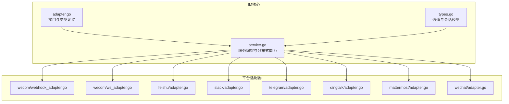
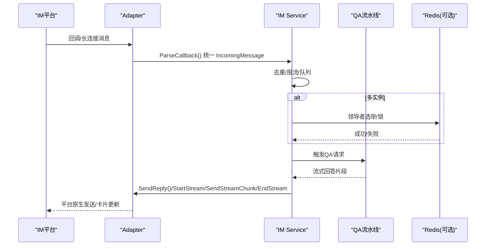
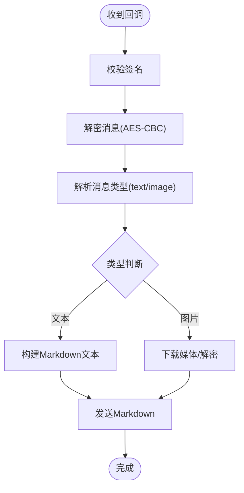
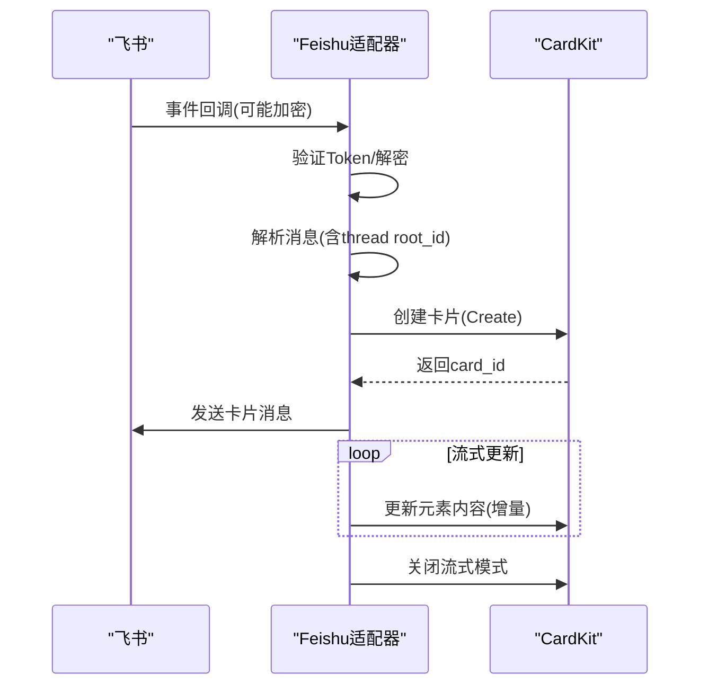
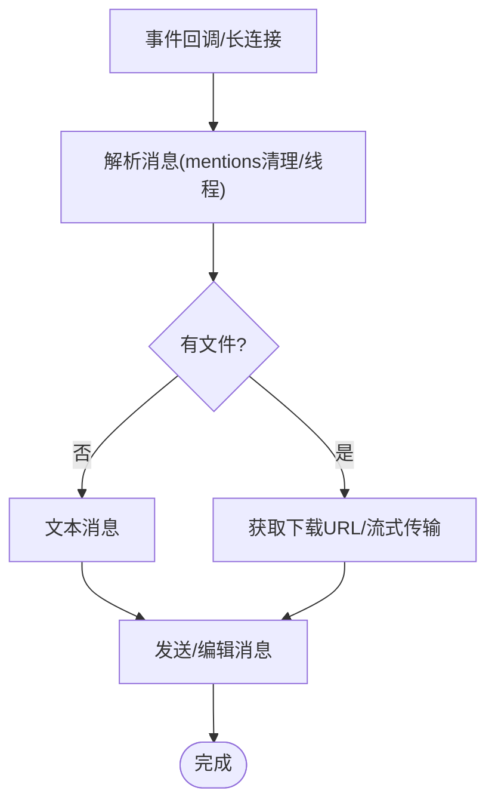
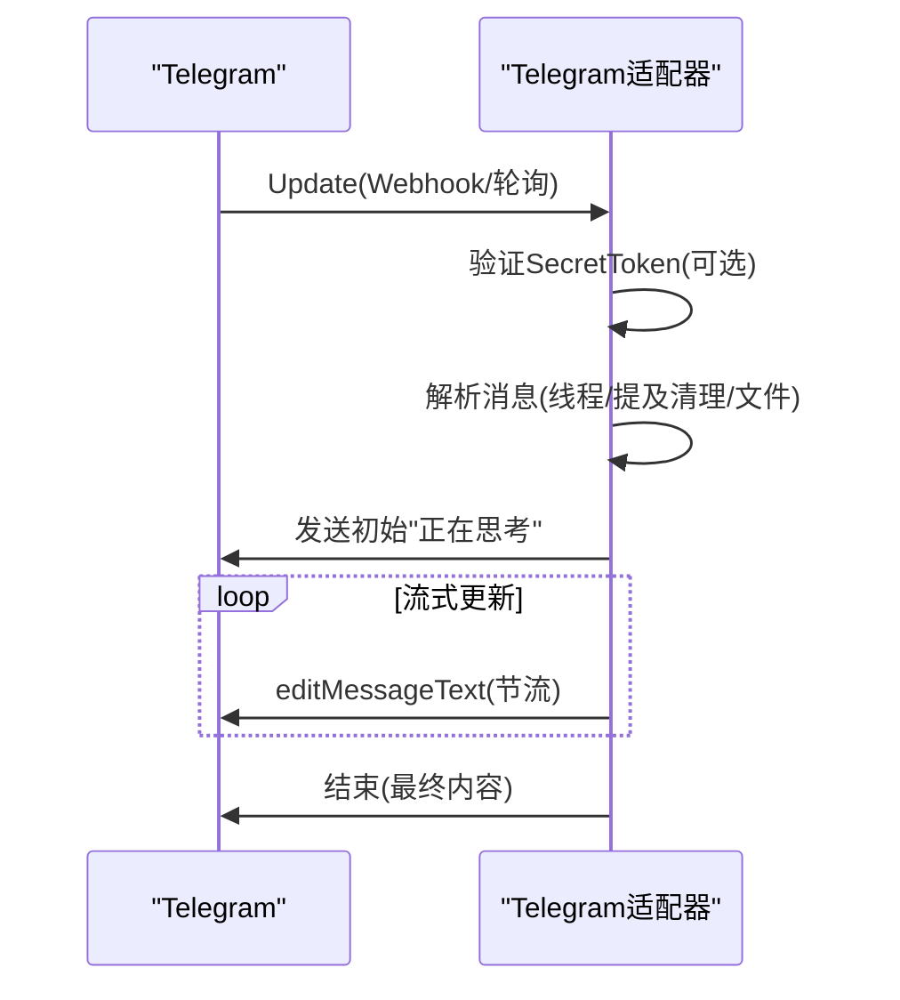
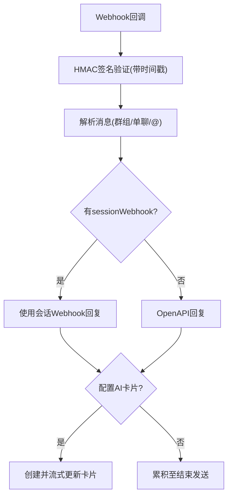
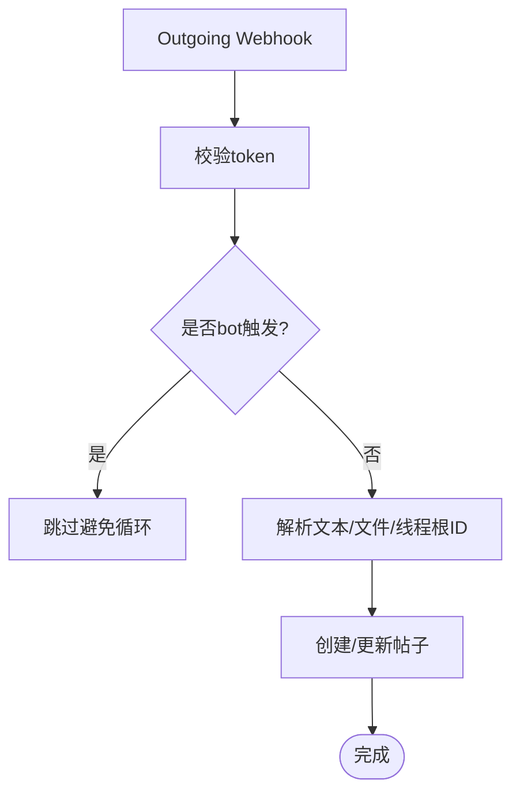
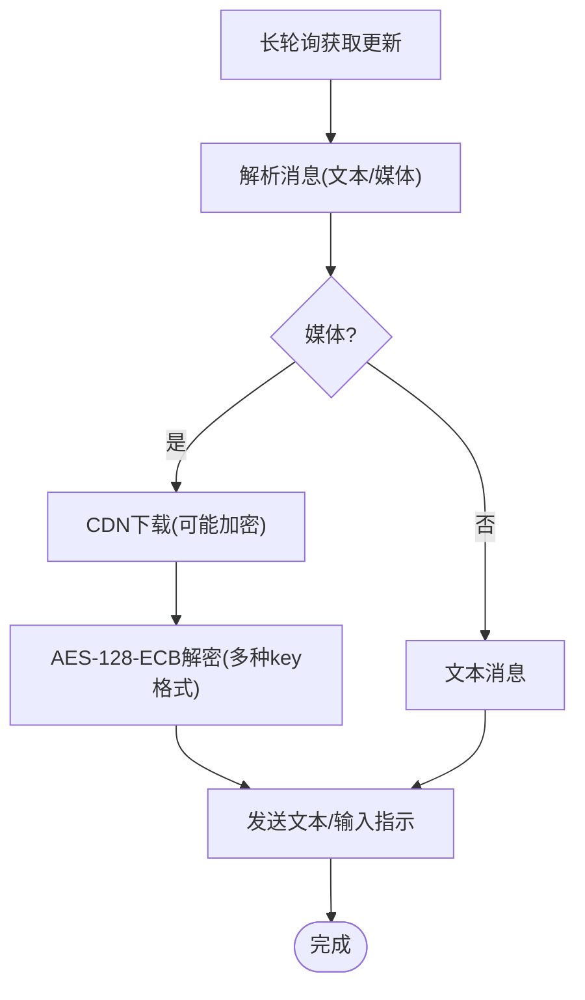
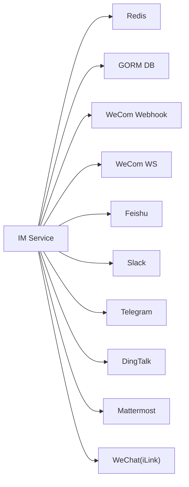

# IM平台适配器

<cite>
**本文档引用的文件**
- [internal/im/adapter.go](file://internal/im/adapter.go)
- [internal/im/types.go](file://internal/im/types.go)
- [internal/im/service.go](file://internal/im/service.go)
- [internal/im/wecom/webhook_adapter.go](file://internal/im/wecom/webhook_adapter.go)
- [internal/im/wecom/ws_adapter.go](file://internal/im/wecom/ws_adapter.go)
- [internal/im/feishu/adapter.go](file://internal/im/feishu/adapter.go)
- [internal/im/slack/adapter.go](file://internal/im/slack/adapter.go)
- [internal/im/telegram/adapter.go](file://internal/im/telegram/adapter.go)
- [internal/im/dingtalk/adapter.go](file://internal/im/dingtalk/adapter.go)
- [internal/im/mattermost/adapter.go](file://internal/im/mattermost/adapter.go)
- [internal/im/wechat/adapter.go](file://internal/im/wechat/adapter.go)
</cite>

## 目录
1. [简介](#简介)
2. [项目结构](#项目结构)
3. [核心组件](#核心组件)
4. [架构总览](#架构总览)
5. [详细组件分析](#详细组件分析)
6. [依赖关系分析](#依赖关系分析)
7. [性能考虑](#性能考虑)
8. [故障排查指南](#故障排查指南)
9. [结论](#结论)
10. [附录](#附录)

## 简介
本文件系统性梳理 WeKnora 的 IM 平台适配器实现，覆盖企业微信、飞书、Slack、Telegram、钉钉、Mattermost 和微信（个人号 iLink）七类平台。重点阐述消息接收与解析、消息发送与流式输出、文件下载与解密、长连接与轮询机制、平台特定认证与签名验证、API 调用限制与错误处理策略，并给出配置参数说明、最佳实践以及平台间差异对比与迁移指南。

## 项目结构
IM 适配器位于 internal/im 目录下，采用“统一接口 + 平台适配器”的分层设计：
- 接口与类型定义：统一的 IncomingMessage/ReplyMessage、平台枚举、会话模式、消息类型等
- 服务编排：IM Service 负责通道生命周期、去重、限流、队列、跨实例协作、命令处理与流式输出
- 平台适配器：各平台独立实现 Adapter/StreamSender/FileDownloader 接口，支持 Webhook/长连接/轮询等模式

图表来源
- [internal/im/adapter.go:1-165](file://internal/im/adapter.go#L1-L165)
- [internal/im/types.go:1-179](file://internal/im/types.go#L1-L179)
- [internal/im/service.go:1-800](file://internal/im/service.go#L1-L800)

章节来源
- [internal/im/adapter.go:1-165](file://internal/im/adapter.go#L1-L165)
- [internal/im/types.go:1-179](file://internal/im/types.go#L1-L179)
- [internal/im/service.go:1-800](file://internal/im/service.go#L1-L800)

## 核心组件
- 统一接口与类型
  - 平台枚举：wecom、feishu、slack、telegram、dingtalk、mattermost、wechat
  - 会话模式：user（按用户+聊天）与 thread（按线程）
  - 消息类型：text、file、image
  - IncomingMessage/ReplyMessage：统一入参与出参结构
  - Adapter/StreamSender/FileDownloader：适配器需实现的可选接口
- 通道与会话
  - IMChannel：数据库持久化通道配置（平台、凭证、模式、会话模式、输出模式、知识库绑定等）
  - ChannelSession：IM 通道到 WeKnora 会话映射，用于对话连续性
- 服务编排
  - 分布式去重、限流、队列、跨实例停止检测、WebSocket 领导者选举、流式卡片/消息更新

章节来源
- [internal/im/adapter.go:10-165](file://internal/im/adapter.go#L10-L165)
- [internal/im/types.go:14-179](file://internal/im/types.go#L14-L179)
- [internal/im/service.go:101-800](file://internal/im/service.go#L101-L800)

## 架构总览
IM 服务通过 AdapterFactory 注册各平台适配器，根据通道配置选择模式（websocket/webhook/longpoll），并基于 Redis 实现多实例一致性与领导者选举。消息从平台回调/长连接进入，经统一解析后进入 WeKnora QA 流水线，再由适配器以平台原生方式发送或流式更新。

图表来源
- [internal/im/service.go:390-800](file://internal/im/service.go#L390-L800)
- [internal/im/adapter.go:120-165](file://internal/im/adapter.go#L120-L165)

## 详细组件分析

### 企业微信（WeCom）
- 模式支持
  - Webhook 模式：事件回调 + 解密 + 发送 Markdown
  - WebSocket 模式：长连接，支持流式卡片与文件解密
- 认证与安全
  - 回调签名验证（token+时间戳+nonce+加密体）
  - AES-256-CBC 解密（webhook）、每消息 AES 密钥（aibot 长连接）
  - 自定义 API 基础地址校验与 SSRF 白名单
- 文件处理
  - Webhook：临时媒体下载或直链下载；自动推断文件名与扩展名
  - 长连接：下载加密内容并 AES-CBC 解密
- 流式输出
  - Webhook：Markdown 即时响应
  - 长连接：CardKit 卡片流式更新
- 关键接口路径
  - Webhook 适配器：[internal/im/wecom/webhook_adapter.go](file://internal/im/wecom/webhook_adapter.go)
  - WebSocket 适配器：[internal/im/wecom/ws_adapter.go](file://internal/im/wecom/ws_adapter.go)

图表来源
- [internal/im/wecom/webhook_adapter.go:133-269](file://internal/im/wecom/webhook_adapter.go#L133-L269)

章节来源
- [internal/im/wecom/webhook_adapter.go:1-697](file://internal/im/wecom/webhook_adapter.go#L1-L697)
- [internal/im/wecom/ws_adapter.go:1-174](file://internal/im/wecom/ws_adapter.go#L1-L174)

### 飞书（Feishu）
- 模式支持：事件订阅（Webhook）+ CardKit 卡片流式更新
- 认证与安全
  - 事件回调签名验证（Verification Token）
  - 可选事件体加密（Encrypt 字段），需解密后再验证
- 消息解析
  - 支持 text、file、image、post 富文本（抽取纯文本）
  - 线程 ID 使用 root_id 或消息自身 ID
- 文件处理
  - 通过 GetMessageResource API 下载文件/图片，自动提取原始文件名
- 流式输出
  - CardKit v1：创建卡片实体 → 发送卡片 → 元素增量更新 → 关闭流式模式
- 关键接口路径
  - [internal/im/feishu/adapter.go](file://internal/im/feishu/adapter.go)

图表来源
- [internal/im/feishu/adapter.go:434-800](file://internal/im/feishu/adapter.go#L434-L800)

章节来源
- [internal/im/feishu/adapter.go:1-1006](file://internal/im/feishu/adapter.go#L1-L1006)

### Slack
- 模式支持：Socket Mode（长连接）+ Events API（Webhook）
- 认证与安全
  - Webhook：Secrets Verifier（X-Slack-Signature）
  - Socket Mode：通过客户端处理事件
- 消息解析
  - 支持 @ 提及清理、群组/私聊识别、线程 ts
  - 文件消息：优先图片（最大分辨率）、其次文件
- 文件处理
  - 通过 Slack API 获取文件下载链接并流式传输
- 流式输出
  - 初始发送“正在思考”消息，随后以 editMessageText 增量更新
  - 速率限制：最小编辑间隔约 500ms
- 关键接口路径
  - [internal/im/slack/adapter.go](file://internal/im/slack/adapter.go)

图表来源
- [internal/im/slack/adapter.go:125-339](file://internal/im/slack/adapter.go#L125-L339)

章节来源
- [internal/im/slack/adapter.go:1-339](file://internal/im/slack/adapter.go#L1-L339)

### Telegram
- 模式支持：长连接（轮询）+ Webhook
- 认证与安全
  - Webhook：X-Telegram-Bot-Api-Secret-Token 校验
- 消息解析
  - 支持 Forum Topics 线程（message_thread_id）
  - 群组消息去除 @bot 提及前缀
  - 图片取最大分辨率缩略图，文档作为文件
- 文件处理
  - 通过 getFile 获取 file_path 后直链下载
- 流式输出
  - 初始发送“正在思考”消息，随后以 editMessageText 增量更新
  - 速率限制：最小编辑间隔约 500ms
- 关键接口路径
  - [internal/im/telegram/adapter.go](file://internal/im/telegram/adapter.go)

图表来源
- [internal/im/telegram/adapter.go:115-486](file://internal/im/telegram/adapter.go#L115-L486)

章节来源
- [internal/im/telegram/adapter.go:1-486](file://internal/im/telegram/adapter.go#L1-L486)

### 钉钉（DingTalk）
- 模式支持：Webhook（会话回调）+ OpenAPI + AI 卡片流式
- 认证与安全
  - Webhook：HMAC-SHA256 时间戳签名，1 小时有效期
- 消息解析
  - 群组/单聊识别，@ 用户信息
- 回复策略
  - 优先使用 sessionWebhook（若存在）；否则走 OpenAPI
  - 支持 AI 卡片模板（需配置 cardTemplateID）
- 流式输出
  - 若配置卡片模板：创建并投递 AI 卡片，定时节流更新
  - 无卡片模板：累积至 EndStream 一次性发送
- 关键接口路径
  - [internal/im/dingtalk/adapter.go](file://internal/im/dingtalk/adapter.go)

图表来源
- [internal/im/dingtalk/adapter.go:141-599](file://internal/im/dingtalk/adapter.go#L141-L599)

章节来源
- [internal/im/dingtalk/adapter.go:1-599](file://internal/im/dingtalk/adapter.go#L1-L599)

### Mattermost
- 模式支持：Outgoing Webhook（入站）+ REST（出站）
- 认证与安全
  - Outgoing Webhook 校验 token
  - 可配置 bot_user_id 避免自回复循环
- 消息解析
  - 支持空文本但有文件的情况；可解析多个 file_ids
  - 线程根 ID 解析（支持主时间线或线程内回复）
- 文件处理
  - 通过客户端查询文件元数据并获取文件流
- 流式输出
  - 创建初始“正在思考”帖子，随后 Patch 更新
- 关键接口路径
  - [internal/im/mattermost/adapter.go](file://internal/im/mattermost/adapter.go)

图表来源
- [internal/im/mattermost/adapter.go:89-350](file://internal/im/mattermost/adapter.go#L89-L350)

章节来源
- [internal/im/mattermost/adapter.go:1-350](file://internal/im/mattermost/adapter.go#L1-L350)

### 微信（个人号 iLink）
- 模式支持：HTTP 长轮询（无 WebSocket/Webhook）
- 认证与安全
  - Bearer Token（QR 登录获取）
  - 请求头包含随机 X-WECHAT-UIN
- 消息解析
  - 文本消息；支持媒体（图片/语音/视频）下载
- 文件处理
  - CDN 加密媒体下载；支持 AES-128-ECB 解密（多种 key 格式）
- 发送与输入指示
  - 通过 /ilink/bot/sendmessage 发送文本
  - 通过 /ilink/bot/sendtyping 发送输入指示
- 关键接口路径
  - [internal/im/wechat/adapter.go](file://internal/im/wechat/adapter.go)

图表来源
- [internal/im/wechat/adapter.go:95-323](file://internal/im/wechat/adapter.go#L95-L323)

章节来源
- [internal/im/wechat/adapter.go:1-323](file://internal/im/wechat/adapter.go#L1-L323)

## 依赖关系分析
- 适配器对平台 SDK/HTTP 客户端的依赖
  - Slack：slack-go/slack
  - Telegram：官方 Bot API
  - 飞书：CardKit/IM API
  - 企业微信：自实现 AES 解密与 API 调用
  - 钉钉：OpenAPI + 可选 AI 卡片
  - Mattermost：自定义 Client
  - 微信 iLink：自定义 HTTP 客户端与加密
- 服务层对 Redis 的依赖
  - 去重、限流、领导者选举、跨实例停止标记、流式回收器
- 服务层对数据库的依赖
  - IMChannel/ChannelSession 的持久化与查询

图表来源
- [internal/im/service.go:107-800](file://internal/im/service.go#L107-L800)

章节来源
- [internal/im/service.go:107-800](file://internal/im/service.go#L107-L800)

## 性能考虑
- 去重与限流
  - Redis SetNX 去重（TTL 5 分钟），失败关闭策略避免重复处理
  - 滑动窗口限流（可选 Redis ZSET，降级本地滑窗）
- 队列与并发
  - 有界队列与工作池，背压保护下游 LLM
  - 全局限流与每用户限流，避免资源耗尽
- 流式输出节流
  - Slack/Telegram/Mattermost/DingTalk/AI 卡片均设置最小更新间隔
- 文件下载
  - 优先直链下载；必要时通过平台 API 获取；注意 Content-Disposition 与扩展名推断
- 多实例一致性
  - WebSocket 领导者选举（Redis 锁），失败快速重试，避免双写

章节来源
- [internal/im/service.go:30-800](file://internal/im/service.go#L30-L800)

## 故障排查指南
- 通用
  - 查看日志中 [平台] 前缀标识，定位具体适配器
  - 检查去重键是否存在（im:dedup:），确认 TTL 是否过期
  - 多实例场景检查领导者锁（im:ws:leader:）是否被正确持有/释放
- 企业微信
  - 回调签名失败：核对 token、时间戳、nonce、加密体顺序与排序
  - AES 解密失败：确认编码格式（base64/padding）、corp_id 匹配
  - 文件下载失败：检查临时媒体 API 与 SSRF 白名单
- 飞书
  - 事件体加密：确保解密后再进行 Token 校验
  - 卡片流式异常：检查 orphan 回收器是否清理过早
- Slack
  - editMessageText 429/限流：降低更新频率或增加节流间隔
  - 文件下载：确认 URLPrivateDownload 可用或回退 GetFileInfo
- Telegram
  - editMessageText 速率限制：默认约 500ms 最小间隔
  - 文件下载：getFile 成功后直链下载
- 钉钉
  - 签名验证失败：检查 Timestamp 与 Secret 的 HMAC-SHA256
  - AI 卡片流式：检查 cardTemplateID 与回调类型 STREAM
- Mattermost
  - token 校验失败：确认 Outgoing Webhook Token
  - 自回复循环：配置 bot_user_id
- 微信 iLink
  - 下载加密媒体：确认 aes_key 格式（base64/raw hex），正确 AES-128-ECB 解密

章节来源
- [internal/im/wecom/webhook_adapter.go:133-492](file://internal/im/wecom/webhook_adapter.go#L133-L492)
- [internal/im/feishu/adapter.go:105-800](file://internal/im/feishu/adapter.go#L105-L800)
- [internal/im/slack/adapter.go:100-339](file://internal/im/slack/adapter.go#L100-L339)
- [internal/im/telegram/adapter.go:62-486](file://internal/im/telegram/adapter.go#L62-L486)
- [internal/im/dingtalk/adapter.go:82-599](file://internal/im/dingtalk/adapter.go#L82-L599)
- [internal/im/mattermost/adapter.go:70-350](file://internal/im/mattermost/adapter.go#L70-L350)
- [internal/im/wechat/adapter.go:95-323](file://internal/im/wechat/adapter.go#L95-L323)

## 结论
WeKnora 的 IM 适配器体系以统一接口抽象平台差异，结合服务层的分布式能力与流式输出机制，实现了跨平台一致的消息体验。通过严格的认证、解密与安全校验，以及针对各平台 API 的优化与限流策略，保证了稳定性与性能。迁移与扩展新平台时，遵循 Adapter/StreamSender/FileDownloader 接口约定与服务层的统一编排，可快速落地。

## 附录

### 配置参数与最佳实践
- 通道配置（IMChannel）
  - platform：平台名称（wecom/feishu/slack/telegram/dingtalk/mattermost/wechat）
  - mode：websocket/webhook/longpoll（部分平台默认值不同）
  - output_mode：stream（默认）或非流式
  - session_mode：user/thread
  - credentials：平台凭据（如 app_id/app_secret、bot_token、client_id/secret、outgoing_token 等）
  - knowledge_base_id：绑定知识库（启用文件下载时）
  - bot_identity：唯一身份标识（由平台+凭据派生）
- 最佳实践
  - 优先使用长连接/轮询模式以降低回调延迟
  - 启用 Redis 以获得多实例一致性与领导者选举
  - 对高并发平台（Telegram/Slack）开启流式输出并设置合理节流
  - 对文件型消息，优先直链下载，必要时通过平台 API 获取
  - 严格校验回调签名与时间戳，防止重放攻击

章节来源
- [internal/im/types.go:14-179](file://internal/im/types.go#L14-L179)

### 平台差异对比与迁移指南
- 差异对比
  - 认证方式：飞书/钉钉/微信（Bearer Token/iLink） vs Slack（Secrets Verifier）vs 企业微信（AES 解密）
  - 消息类型：飞书支持富文本 post；钉钉支持 @ 用户；Telegram 支持 Forum Topics；Mattermost 支持多文件
  - 流式输出：飞书/钉钉（卡片流式）；Slack/Telegram（消息编辑流式）；WeCom（卡片/Markdown）；Mattermost（帖子 Patch）
  - 文件下载：平台 API 直链优先；必要时通过平台 API 获取；微信 iLink 支持多种 AES key 格式
- 迁移指南
  - 新增平台时，实现 Adapter/StreamSender/FileDownloader 接口
  - 在服务层注册工厂函数，处理通道加载与启动
  - 针对平台特性补充安全校验、限流与流式节流
  - 编写单元测试覆盖回调解析、签名验证与流式更新

章节来源
- [internal/im/adapter.go:120-165](file://internal/im/adapter.go#L120-L165)
- [internal/im/service.go:352-451](file://internal/im/service.go#L352-L451)