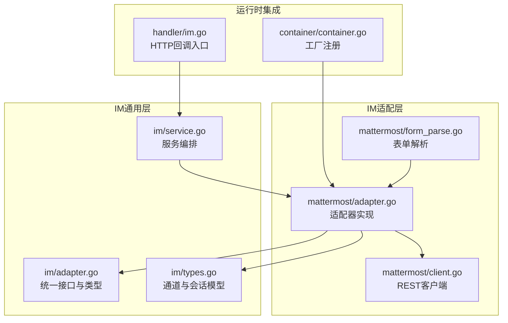
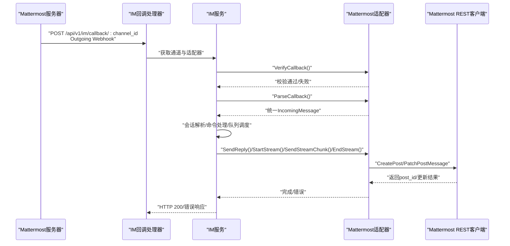
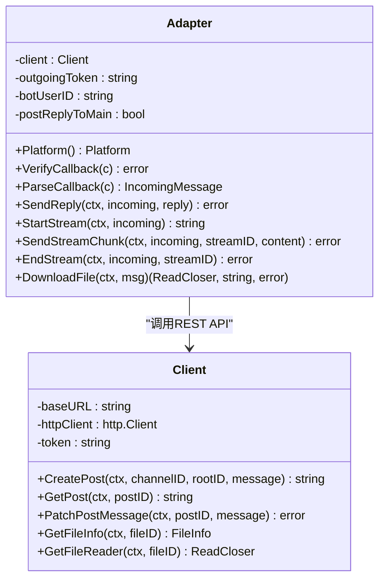
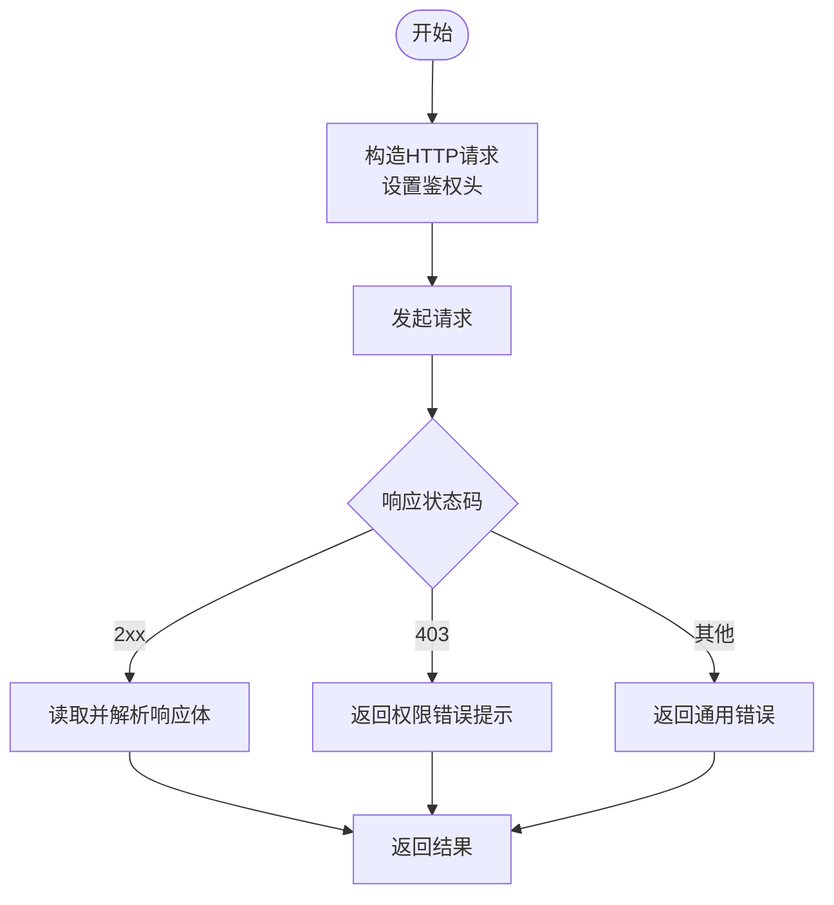
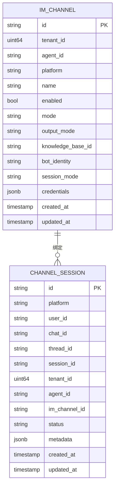
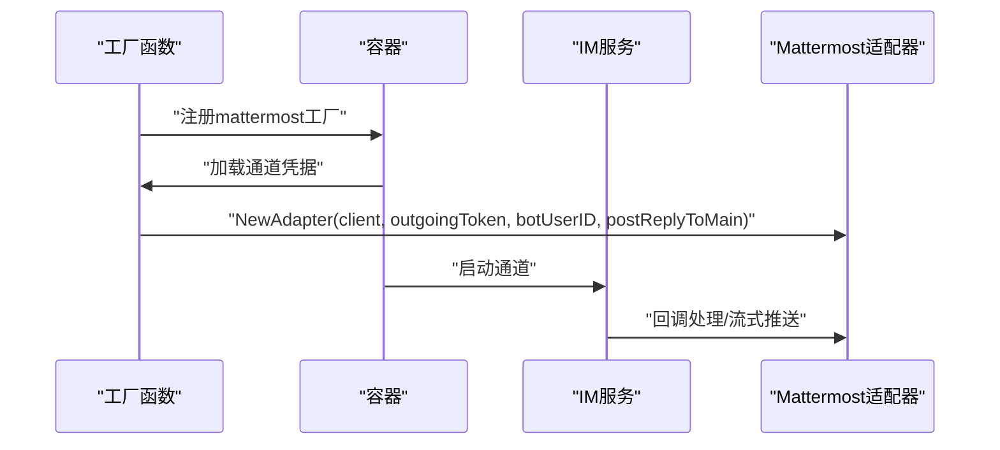
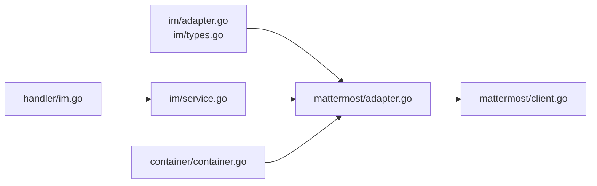

# Mattermost适配器

<cite>
**本文档引用的文件**
- [adapter.go](file://internal/im/mattermost/adapter.go)
- [client.go](file://internal/im/mattermost/client.go)
- [form_parse.go](file://internal/im/mattermost/form_parse.go)
- [types.go](file://internal/im/types.go)
- [adapter.go](file://internal/im/adapter.go)
- [service.go](file://internal/im/service.go)
- [container.go](file://internal/container/container.go)
- [im.go](file://internal/handler/im.go)
- [adapter_test.go](file://internal/im/mattermost/adapter_test.go)
</cite>

## 目录
1. [简介](#简介)
2. [项目结构](#项目结构)
3. [核心组件](#核心组件)
4. [架构总览](#架构总览)
5. [详细组件分析](#详细组件分析)
6. [依赖关系分析](#依赖关系分析)
7. [性能考量](#性能考量)
8. [故障排查指南](#故障排查指南)
9. [结论](#结论)
10. [附录](#附录)

## 简介
本文件面向Mattermost平台的适配器实现，系统性阐述WeKnora在Mattermost上的消息处理机制与集成方式。重点覆盖以下方面：
- 私有部署与Webhook回调接入
- 回复策略（线程内回复 vs 主时间线回复）
- 文件消息解析与下载
- 流式回复与实时消息推送
- Bot账户创建与权限配置要点
- 服务器配置、通道绑定与消息路由
- 平台特有消息格式转换、权限校验与团队成员管理

该适配器采用“出站Webhook入站 + REST出站”的组合模式：通过Mattermost的Outgoing Webhook接收消息，再以Bot Token调用REST API进行回复与流式更新。

## 项目结构
Mattermost适配器位于内部IM子系统中，核心文件组织如下：
- 适配器入口与业务逻辑：internal/im/mattermost/adapter.go
- Mattermost REST客户端：internal/im/mattermost/client.go
- 表单解析工具：internal/im/mattermost/form_parse.go
- IM通用类型与通道模型：internal/im/adapter.go、internal/im/types.go
- 服务编排与工厂注册：internal/container/container.go、internal/im/service.go
- HTTP回调处理：internal/handler/im.go
- 单元测试：internal/im/mattermost/adapter_test.go

**图表来源**
- [adapter.go:1-350](file://internal/im/mattermost/adapter.go#L1-L350)
- [client.go:1-229](file://internal/im/mattermost/client.go#L1-L229)
- [form_parse.go:1-28](file://internal/im/mattermost/form_parse.go#L1-L28)
- [adapter.go:1-165](file://internal/im/adapter.go#L1-L165)
- [types.go:1-179](file://internal/im/types.go#L1-L179)
- [service.go:1-200](file://internal/im/service.go#L1-L200)
- [container.go:1390-1422](file://internal/container/container.go#L1390-L1422)
- [im.go:249-327](file://internal/handler/im.go#L249-L327)

**章节来源**
- [adapter.go:1-350](file://internal/im/mattermost/adapter.go#L1-L350)
- [client.go:1-229](file://internal/im/mattermost/client.go#L1-L229)
- [form_parse.go:1-28](file://internal/im/mattermost/form_parse.go#L1-L28)
- [adapter.go:1-165](file://internal/im/adapter.go#L1-L165)
- [types.go:1-179](file://internal/im/types.go#L1-L179)
- [service.go:1-200](file://internal/im/service.go#L1-L200)
- [container.go:1390-1422](file://internal/container/container.go#L1390-L1422)
- [im.go:249-327](file://internal/handler/im.go#L249-L327)

## 核心组件
- Mattermost适配器（Adapter）：实现IM统一接口，负责Webhook回调验证、消息解析、回复发送、流式推送与文件下载。
- Mattermost REST客户端（Client）：封装/api/v4的REST调用，支持创建帖子、获取帖子根ID、更新帖子、获取文件元数据与下载文件。
- 通道模型（IMChannel）：数据库持久化存储通道配置，包含平台、模式、输出模式、会话模式、Bot身份标识与凭据。
- 服务编排（Service）：统一调度消息处理、会话解析、命令分发、流式写入与去重控制。
- 工厂注册（container）：按平台注册适配器工厂，解析凭据并实例化适配器。
- HTTP回调入口（handler）：接收来自Mattermost的回调请求，转发至对应通道的适配器。

关键职责与交互：
- 出站Webhook入站：解析JSON或表单参数，校验令牌，过滤空消息与自触发回复，构建统一消息对象。
- 回复策略：根据postReplyToMain决定回复是线程内还是主时间线；必要时通过GetPost解析实际根ID。
- 流式回复：创建初始占位帖子，维护流状态，周期性Patch更新，结束时完成最终更新。
- 文件处理：解析file_ids，获取文件元数据与下载流，用于知识库入库或本地处理。

**章节来源**
- [adapter.go:62-155](file://internal/im/mattermost/adapter.go#L62-L155)
- [client.go:45-219](file://internal/im/mattermost/client.go#L45-L219)
- [types.go:14-145](file://internal/im/types.go#L14-L145)
- [service.go:101-200](file://internal/im/service.go#L101-L200)
- [container.go:1390-1422](file://internal/container/container.go#L1390-L1422)

## 架构总览
下图展示了从Mattermost回调到WeKnora处理再到Mattermost回复的整体流程：

**图表来源**
- [im.go:249-327](file://internal/handler/im.go#L249-L327)
- [service.go:101-200](file://internal/im/service.go#L101-L200)
- [adapter.go:70-155](file://internal/im/mattermost/adapter.go#L70-L155)
- [client.go:45-219](file://internal/im/mattermost/client.go#L45-L219)

## 详细组件分析

### 组件A：Mattermost适配器（Adapter）
- 职责
  - 平台标识与回调验证：校验Outgoing Webhook令牌，避免自触发循环。
  - 消息解析：支持JSON与表单两种Content-Type，解析文本与文件ID列表，确定消息类型与线程根ID。
  - 回复发送：根据通道与线程根ID创建或更新帖子。
  - 流式推送：维护流状态，定时刷新占位内容，结束时完成最终更新。
  - 文件下载：获取文件元数据与下载流，供知识库或后续处理使用。
- 关键字段
  - outgoingToken：Webhook令牌，用于回调验证。
  - botUserID：Bot用户ID，用于跳过自触发回复。
  - postReplyToMain：是否将回复发布到主时间线而非线程内。
- 处理逻辑要点
  - 空消息与自触发保护：空文本且无文件ID时忽略；sender与botUserID一致时忽略。
  - 线程根ID解析：优先使用payload.root_id；若为空则查询post获取实际root_id；否则使用post_id作为根。
  - 文件消息：当存在file_ids时标记为MessageTypeFile，并记录首个文件ID与完整列表。
  - 流式状态：以channelID:postID为键维护流状态，支持并发安全。

**图表来源**
- [adapter.go:30-350](file://internal/im/mattermost/adapter.go#L30-L350)
- [client.go:14-229](file://internal/im/mattermost/client.go#L14-L229)

**章节来源**
- [adapter.go:30-350](file://internal/im/mattermost/adapter.go#L30-L350)
- [adapter_test.go:1-154](file://internal/im/mattermost/adapter_test.go#L1-L154)

### 组件B：Mattermost REST客户端（Client）
- 职责
  - 封装/api/v4的REST端点：创建帖子、获取帖子、更新帖子、获取文件元数据、下载文件。
  - 统一鉴权头：设置Bearer Token与Content-Type。
  - 错误处理：对非2xx响应返回结构化错误，包含状态码与响应体片段。
- 关键方法
  - CreatePost：支持root_id（线程根）。
  - GetPost：返回root_id，用于线程根解析。
  - PatchPostMessage：增量更新消息内容。
  - GetFileInfo/GetFileReader：文件元数据与下载流。

**图表来源**
- [client.go:45-219](file://internal/im/mattermost/client.go#L45-L219)

**章节来源**
- [client.go:14-229](file://internal/im/mattermost/client.go#L14-L229)

### 组件C：通道模型与会话解析（IMChannel/ChannelSession）
- IMChannel
  - 平台、模式、输出模式、会话模式、Bot身份标识与凭据。
  - Mattermost默认模式为webhook，输出模式为stream，会话模式支持user与thread。
  - computeBotIdentity基于outgoing_token生成唯一标识，便于去重与匹配。
- ChannelSession
  - 维持平台、用户、聊天与线程维度的会话映射，支持跨实例一致性。

**图表来源**
- [types.go:14-179](file://internal/im/types.go#L14-L179)

**章节来源**
- [types.go:14-179](file://internal/im/types.go#L14-L179)

### 组件D：服务编排与工厂注册
- 工厂注册
  - 仅支持mattermost的webhook模式；解析site_url、bot_token、outgoing_token、bot_user_id等凭据。
  - 支持post_to_main配置，控制回复策略。
- 服务编排
  - 统一处理消息去重、速率限制、队列与流式管理，按会话模式解析用户/线程维度。

**图表来源**
- [container.go:1390-1422](file://internal/container/container.go#L1390-L1422)
- [service.go:101-200](file://internal/im/service.go#L101-L200)

**章节来源**
- [container.go:1390-1422](file://internal/container/container.go#L1390-L1422)
- [service.go:101-200](file://internal/im/service.go#L101-L200)

## 依赖关系分析
- 适配器依赖IM通用接口与类型，确保不同平台的一致行为。
- 适配器依赖REST客户端进行平台交互。
- 服务层依赖工厂注册与通道模型，实现动态加载与会话管理。
- HTTP层负责路由到具体通道的适配器。

**图表来源**
- [adapter.go:1-350](file://internal/im/mattermost/adapter.go#L1-L350)
- [client.go:1-229](file://internal/im/mattermost/client.go#L1-L229)
- [adapter.go:1-165](file://internal/im/adapter.go#L1-L165)
- [types.go:1-179](file://internal/im/types.go#L1-L179)
- [service.go:1-200](file://internal/im/service.go#L1-L200)
- [container.go:1390-1422](file://internal/container/container.go#L1390-L1422)
- [im.go:249-327](file://internal/handler/im.go#L249-L327)

**章节来源**
- [adapter.go:1-350](file://internal/im/mattermost/adapter.go#L1-L350)
- [client.go:1-229](file://internal/im/mattermost/client.go#L1-L229)
- [adapter.go:1-165](file://internal/im/adapter.go#L1-L165)
- [types.go:1-179](file://internal/im/types.go#L1-L179)
- [service.go:1-200](file://internal/im/service.go#L1-L200)
- [container.go:1390-1422](file://internal/container/container.go#L1390-L1422)
- [im.go:249-327](file://internal/handler/im.go#L249-L327)

## 性能考量
- 流式刷新间隔：服务层定义了流式刷新的时间间隔，兼顾API限流与延迟感知。
- 去重与速率限制：通过Redis键空间实现消息ID去重与滑动窗口限流，避免重复处理与过载。
- 并发与锁：流式状态使用互斥锁保护，确保同一流的串行更新。
- 错误短路：回调验证失败、权限不足等场景快速返回，减少无效调用。

**章节来源**
- [service.go:30-80](file://internal/im/service.go#L30-L80)
- [adapter.go:279-323](file://internal/im/mattermost/adapter.go#L279-L323)

## 故障排查指南
- 回调验证失败
  - 确认Outgoing Webhook令牌与配置一致；检查Content-Type是否为application/json或application/x-www-form-urlencoded。
  - 参考路径：[adapter.go:70-87](file://internal/im/mattermost/adapter.go#L70-L87)
- 自触发循环
  - 当sender与bot_user_id一致时会被忽略；检查bot_user_id配置。
  - 参考路径：[adapter.go:101-104](file://internal/im/mattermost/adapter.go#L101-L104)
- 权限不足（403）
  - 未将Bot加入目标频道；根据错误提示添加Bot到频道成员。
  - 参考路径：[client.go:76-80](file://internal/im/mattermost/client.go#L76-L80)
- 线程根ID异常
  - 若root_id为空，将回退到post_id；必要时调用GetPost解析真实根ID。
  - 参考路径：[adapter.go:111-126](file://internal/im/mattermost/adapter.go#L111-L126)
- 流式更新失败
  - PatchPostMessage失败时记录警告日志；检查网络与令牌有效性。
  - 参考路径：[adapter.go:297-299](file://internal/im/mattermost/adapter.go#L297-L299)
- 文件下载失败
  - 校验file_key与文件元数据；确认Bot对文件有访问权限。
  - 参考路径：[adapter.go:325-349](file://internal/im/mattermost/adapter.go#L325-L349)，[client.go:165-219](file://internal/im/mattermost/client.go#L165-L219)

**章节来源**
- [adapter.go:70-155](file://internal/im/mattermost/adapter.go#L70-L155)
- [client.go:76-219](file://internal/im/mattermost/client.go#L76-L219)

## 结论
Mattermost适配器通过Webhook入站与REST出站的组合，实现了对Mattermost平台消息的统一处理与回复。其设计强调：
- 明确的回调验证与自触发防护
- 灵活的回复策略（线程内/主时间线）
- 完整的流式与文件处理能力
- 与服务层的解耦与可扩展性

在私有部署环境下，正确配置站点URL、Bot Token、Outgoing Webhook令牌与Bot用户ID是成功集成的关键。

## 附录

### A. Mattermost Bot账户创建与权限配置
- 创建Bot账户
  - 在Mattermost系统管理后台创建Bot用户，获取Bot Token。
- 配置Outgoing Webhook
  - 在目标频道中创建Outgoing Webhook，设置令牌与回调URL。
- 授权与成员管理
  - 将Bot用户添加到需要监听的频道成员中，确保可读取消息与创建帖子。
- 会话模式与线程
  - 根据需求选择会话模式（user/thread），线程模式下Top-Level消息将开启新会话。

**章节来源**
- [container.go:1405-1421](file://internal/container/container.go#L1405-L1421)
- [client.go:76-80](file://internal/im/mattermost/client.go#L76-L80)

### B. Mattermost Webhook使用与消息推送
- 回调验证
  - VerifyCallback校验Outgoing Webhook令牌，避免伪造请求。
- 消息推送
  - SendReply/CreatePost用于创建回复；StartStream/SendStreamChunk/EndStream用于流式推送。
- 文件消息
  - 解析file_ids，调用DownloadFile获取文件流，结合知识库ID可自动入库。

**章节来源**
- [adapter.go:70-155](file://internal/im/mattermost/adapter.go#L70-L155)
- [adapter.go:225-349](file://internal/im/mattermost/adapter.go#L225-L349)

### C. 服务器配置、Bot集成与消息路由
- 通道创建
  - 通过IM通道API创建mattermost通道，设置mode为webhook，output_mode为stream。
- 凭据配置
  - site_url、bot_token、outgoing_token、bot_user_id、post_to_main等。
- 消息路由
  - handler根据channel_id定位适配器，服务层进行会话解析与命令处理。

**章节来源**
- [im.go:80-112](file://internal/handler/im.go#L80-L112)
- [container.go:1390-1422](file://internal/container/container.go#L1390-L1422)
- [service.go:101-200](file://internal/im/service.go#L101-L200)

### D. 多种消息格式与文件上传/预览
- 文本消息
  - 标准文本内容，按线程策略回复。
- 文件消息
  - 支持多文件ID列表；解析首个文件ID作为消息主体，其余ID放入Extra。
- 图片/媒体
  - 通过文件元数据与下载流处理，结合知识库进行索引或预览。

**章节来源**
- [adapter.go:143-152](file://internal/im/mattermost/adapter.go#L143-L152)
- [client.go:158-219](file://internal/im/mattermost/client.go#L158-L219)

### E. 平台特有消息格式转换与权限验证
- 格式转换
  - JSON与表单两种回调格式均支持；file_ids支持数组或逗号分隔字符串。
- 权限验证
  - 403错误明确提示需将Bot加入频道；令牌不匹配将被拒绝。
- 团队成员管理
  - 通过频道成员界面添加Bot用户，确保Bot具备相应权限。

**章节来源**
- [adapter.go:157-196](file://internal/im/mattermost/adapter.go#L157-L196)
- [client.go:76-80](file://internal/im/mattermost/client.go#L76-L80)