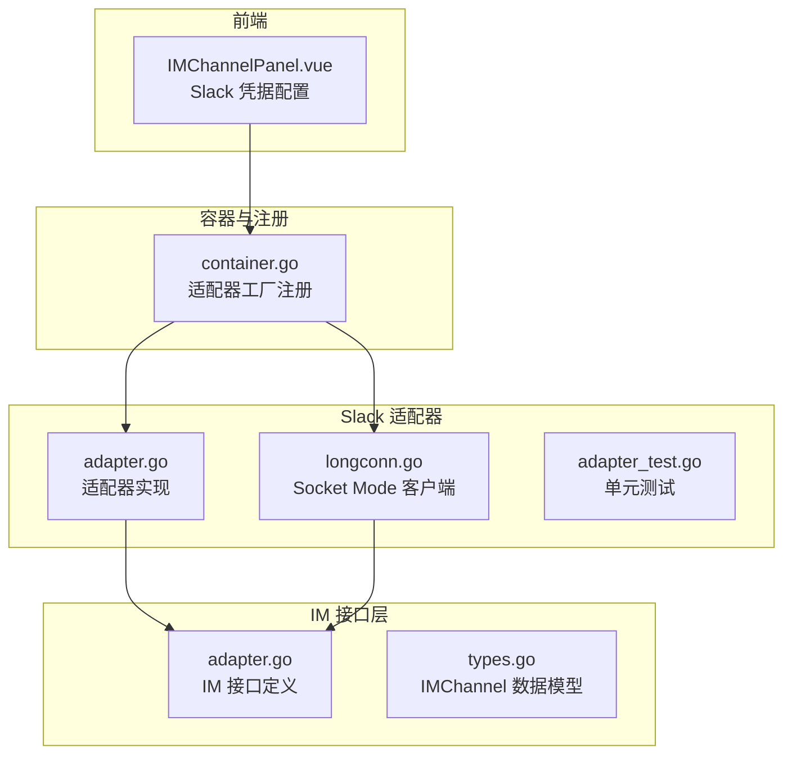
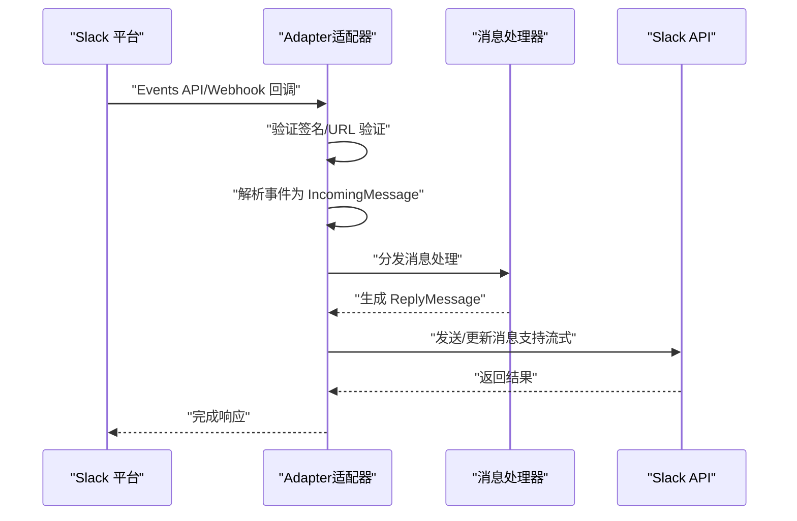
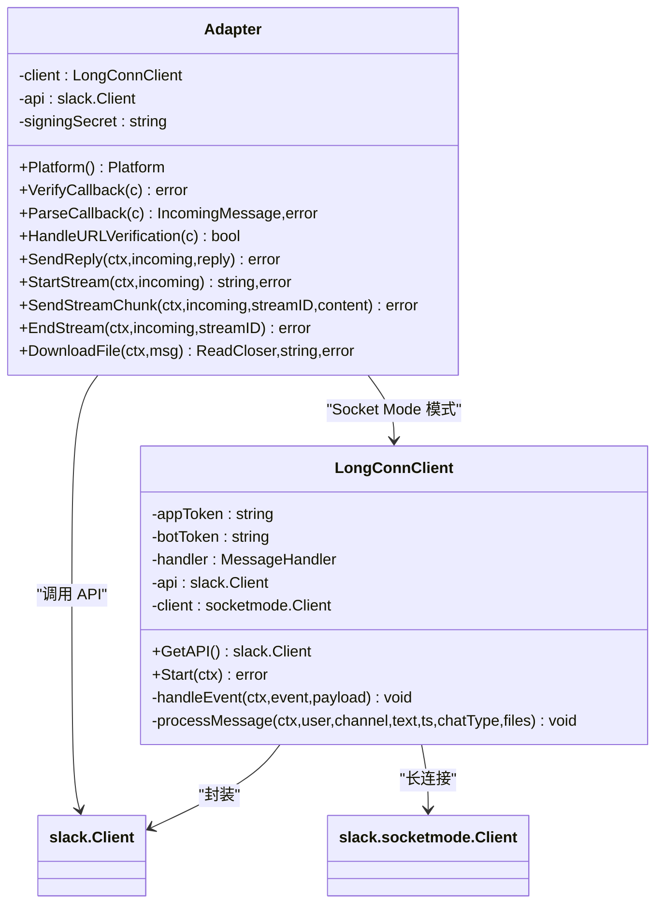
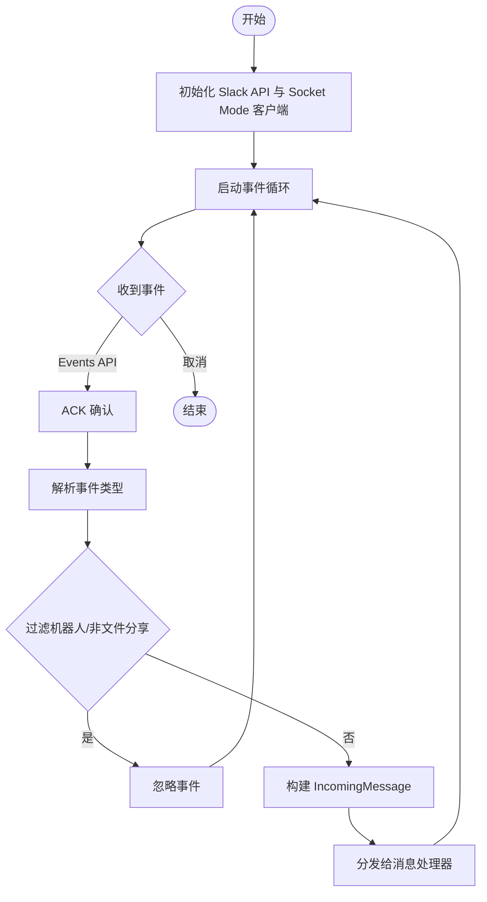
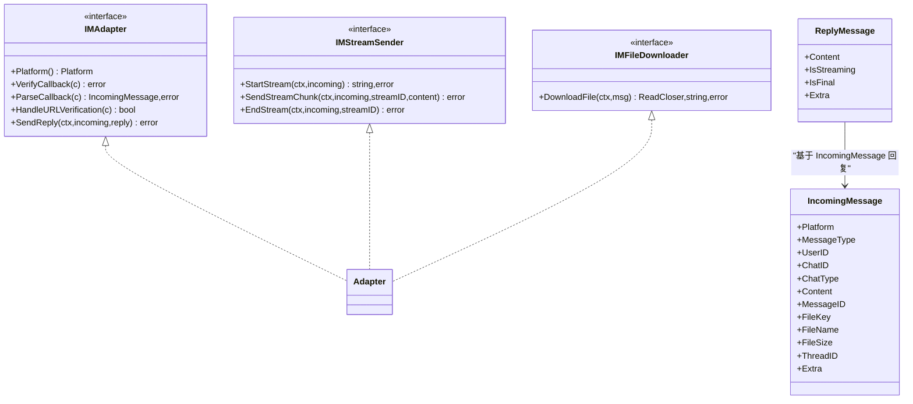
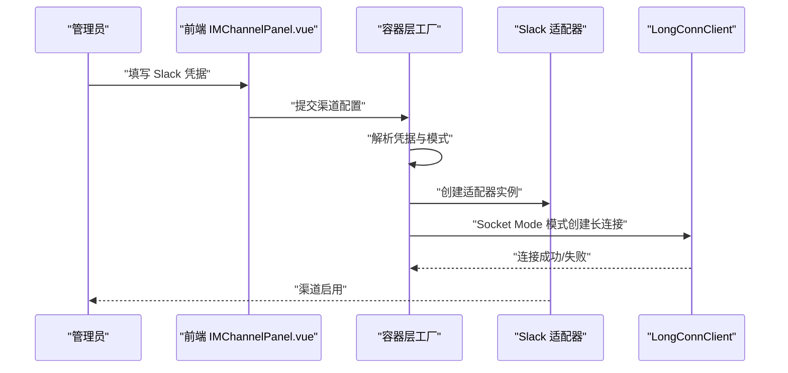
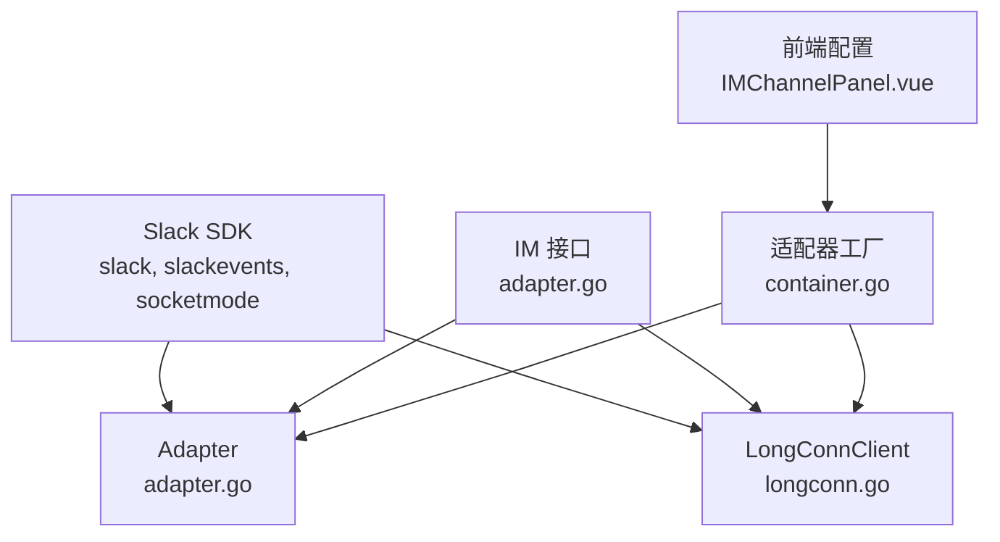

# Slack适配器

<cite>
**本文档引用的文件**
- [adapter.go](file://internal/im/slack/adapter.go)
- [longconn.go](file://internal/im/slack/longconn.go)
- [adapter_test.go](file://internal/im/slack/adapter_test.go)
- [adapter.go](file://internal/im/adapter.go)
- [types.go](file://internal/im/types.go)
- [container.go](file://internal/container/container.go)
- [IMChannelPanel.vue](file://frontend/src/components/IMChannelPanel.vue)
</cite>

## 目录
1. [简介](#简介)
2. [项目结构](#项目结构)
3. [核心组件](#核心组件)
4. [架构总览](#架构总览)
5. [详细组件分析](#详细组件分析)
6. [依赖关系分析](#依赖关系分析)
7. [性能考虑](#性能考虑)
8. [故障排除指南](#故障排除指南)
9. [结论](#结论)
10. [附录](#附录)

## 简介
本文件为 WeKnora 项目中的 Slack 适配器提供全面的技术文档。Slack 适配器负责在 Slack 平台上接收和发送消息，支持两种接入方式：Socket Mode（长连接）与 Events API（Webhook）。适配器实现了统一的 IM 接口，能够处理实时消息、频道管理、私信、文件下载、流式回复等功能，并对 Slack 的复杂消息格式（如 Markdown、@提及、文件分享）进行解析与渲染。

## 项目结构
Slack 适配器位于 internal/im/slack 目录下，主要由以下文件组成：
- adapter.go：Slack 适配器实现，支持 Webhook 和 Socket Mode 两种模式
- longconn.go：Slack Socket Mode 长连接客户端，负责事件监听与转发
- adapter_test.go：单元测试，覆盖消息解析与线程 ID 处理逻辑

此外，适配器通过内部 IM 接口与服务层集成，前端通过 IMChannelPanel.vue 提供 Slack 凭据配置界面。

**图表来源**
- [adapter.go:1-339](file://internal/im/slack/adapter.go#L1-L339)
- [longconn.go:1-149](file://internal/im/slack/longconn.go#L1-L149)
- [adapter.go:1-165](file://internal/im/adapter.go#L1-L165)
- [types.go:1-179](file://internal/im/types.go#L1-L179)
- [container.go:1272-1311](file://internal/container/container.go#L1272-L1311)
- [IMChannelPanel.vue:240-271](file://frontend/src/components/IMChannelPanel.vue#L240-L271)

**章节来源**
- [adapter.go:1-339](file://internal/im/slack/adapter.go#L1-L339)
- [longconn.go:1-149](file://internal/im/slack/longconn.go#L1-L149)
- [adapter.go:1-165](file://internal/im/adapter.go#L1-L165)
- [types.go:1-179](file://internal/im/types.go#L1-L179)
- [container.go:1272-1311](file://internal/container/container.go#L1272-L1311)
- [IMChannelPanel.vue:240-271](file://frontend/src/components/IMChannelPanel.vue#L240-L271)

## 核心组件
- Adapter（适配器）
  - 支持两种模式：
    - Webhook 模式：通过 Events API 接收回调，需要签名密钥进行校验
    - Socket Mode 模式：通过长连接接收事件，需要 App Token 与 Bot Token
  - 实现 IM 接口：平台标识、回调验证、消息解析、URL 验证、发送回复、流式回复、文件下载
- LongConnClient（长连接客户端）
  - 封装 Slack Socket Mode 客户端，监听事件并分发到上层处理器
  - 自动 ACK 事件，避免重复消费
- IM 接口与数据模型
  - 统一 IncomingMessage/ReplyMessage 结构，支持文本、文件、图片类型
  - IMChannel 数据模型用于存储渠道配置与凭据

**章节来源**
- [adapter.go:28-98](file://internal/im/slack/adapter.go#L28-L98)
- [longconn.go:18-52](file://internal/im/slack/longconn.go#L18-L52)
- [adapter.go:120-165](file://internal/im/adapter.go#L120-L165)
- [types.go:14-36](file://internal/im/types.go#L14-L36)

## 架构总览
Slack 适配器采用“适配器 + 长连接客户端”的双层架构：
- Webhook 模式：HTTP 回调 → 适配器解析 → 业务处理
- Socket Mode 模式：长连接事件 → 长连接客户端 → 适配器解析 → 业务处理
- 流式回复：先发送占位消息，再增量更新消息内容
- 文件下载：根据文件 ID 获取下载链接并异步读取

**图表来源**
- [adapter.go:100-194](file://internal/im/slack/adapter.go#L100-L194)
- [adapter.go:196-212](file://internal/im/slack/adapter.go#L196-L212)
- [adapter.go:227-307](file://internal/im/slack/adapter.go#L227-L307)

## 详细组件分析

### Adapter（适配器）
Adapter 实现了 IM 接口，负责：
- 平台标识：返回 PlatformSlack
- 回调验证：Webhook 模式使用签名密钥进行校验
- 消息解析：从 Events API 事件中提取用户、频道、文本、时间戳、文件信息
- URL 验证：处理 Slack 的 url_verification 挑战
- 发送回复：支持直接回复与按时间戳回复
- 流式回复：维护每条流的状态，增量更新消息
- 文件下载：根据文件 ID 获取下载链接并返回可读流

关键特性：
- 群聊 @ 提及去除：在群聊场景自动去除开头的 @U... 提及标记，保留纯文本
- 线程 ID 映射：Slack 使用 thread_ts 作为线程标识，顶层消息使用自身时间戳
- 文件类型识别：根据 MIME 类型判断图片或普通文件

**图表来源**
- [adapter.go:28-50](file://internal/im/slack/adapter.go#L28-L50)
- [longconn.go:18-47](file://internal/im/slack/longconn.go#L18-L47)

**章节来源**
- [adapter.go:52-94](file://internal/im/slack/adapter.go#L52-L94)
- [adapter.go:100-194](file://internal/im/slack/adapter.go#L100-L194)
- [adapter.go:196-307](file://internal/im/slack/adapter.go#L196-L307)
- [adapter.go:309-338](file://internal/im/slack/adapter.go#L309-L338)

### LongConnClient（长连接客户端）
LongConnClient 负责：
- 初始化 Slack API 客户端与 Socket Mode 客户端
- 启动长连接循环，监听事件
- 对 Events API 事件进行 ACK 确认
- 解析事件类型（AppMention、Message），过滤机器人消息与非文件分享事件
- 将消息转换为 IncomingMessage 并交由上层处理器处理

**图表来源**
- [longconn.go:54-89](file://internal/im/slack/longconn.go#L54-L89)
- [longconn.go:91-149](file://internal/im/slack/longconn.go#L91-L149)

**章节来源**
- [longconn.go:18-52](file://internal/im/slack/longconn.go#L18-L52)
- [longconn.go:54-89](file://internal/im/slack/longconn.go#L54-L89)
- [longconn.go:91-149](file://internal/im/slack/longconn.go#L91-L149)

### IM 接口与数据模型
- IM 接口定义了平台抽象、回调验证、消息解析、URL 验证、回复发送、流式处理、文件下载等能力
- IncomingMessage/ReplyMessage 统一了消息结构，支持文本、文件、图片类型
- IMChannel 数据模型用于存储渠道配置、模式（websocket/webhook）、输出模式（stream）、会话模式（user/thread）、Bot Identity 等

**图表来源**
- [adapter.go:120-165](file://internal/im/adapter.go#L120-L165)
- [adapter.go:42-118](file://internal/im/adapter.go#L42-L118)

**章节来源**
- [adapter.go:10-165](file://internal/im/adapter.go#L10-L165)
- [types.go:14-36](file://internal/im/types.go#L14-L36)
- [types.go:85-145](file://internal/im/types.go#L85-L145)

### 适配器工厂与前端配置
- 容器层注册 Slack 适配器工厂，根据渠道配置选择 Webhook 或 Socket Mode
- 前端 IMChannelPanel.vue 提供 Slack 凭据输入界面，支持 App Token/Bot Token 与 Signing Secret

**图表来源**
- [container.go:1272-1311](file://internal/container/container.go#L1272-L1311)
- [IMChannelPanel.vue:240-271](file://frontend/src/components/IMChannelPanel.vue#L240-L271)

**章节来源**
- [container.go:1272-1311](file://internal/container/container.go#L1272-L1311)
- [IMChannelPanel.vue:240-271](file://frontend/src/components/IMChannelPanel.vue#L240-L271)

## 依赖关系分析
- 适配器依赖 Slack 官方 SDK（slack、slackevents、socketmode）
- 适配器实现 IM 接口，向上提供统一的消息处理能力
- 长连接客户端封装 Socket Mode，向下对接 Slack 事件
- 容器层负责凭据解析与适配器实例化
- 前端负责凭据收集与展示

**图表来源**
- [adapter.go:3-19](file://internal/im/slack/adapter.go#L3-L19)
- [longconn.go:3-13](file://internal/im/slack/longconn.go#L3-L13)
- [adapter.go:10-19](file://internal/im/adapter.go#L10-L19)
- [container.go:1272-1311](file://internal/container/container.go#L1272-L1311)

**章节来源**
- [adapter.go:3-19](file://internal/im/slack/adapter.go#L3-L19)
- [longconn.go:3-13](file://internal/im/slack/longconn.go#L3-L13)
- [adapter.go:10-19](file://internal/im/adapter.go#L10-L19)
- [container.go:1272-1311](file://internal/container/container.go#L1272-L1311)

## 性能考虑
- 流式更新存在速率限制：适配器在更新消息时记录错误但不中断流程，遵循 Slack 速率限制建议
- 长连接事件 ACK：确保事件只被处理一次，避免重复消费
- 文件下载采用管道异步读取，避免阻塞主线程
- 群聊 @ 提及去除仅在必要时进行字符串处理，减少不必要的计算

优化建议：
- 在高并发场景下，合理控制流式更新频率，避免触发速率限制
- 对于大文件下载，建议结合知识库存储策略，避免频繁拉取
- 长连接断线重连应具备指数退避策略，降低服务器压力

**章节来源**
- [adapter.go:274-282](file://internal/im/slack/adapter.go#L274-L282)
- [longconn.go:78-83](file://internal/im/slack/longconn.go#L78-L83)

## 故障排除指南
常见问题与排查步骤：
- 回调签名验证失败（Webhook 模式）
  - 检查 Signing Secret 是否正确配置
  - 确认请求头包含正确的签名信息
- 无法接收 Socket Mode 事件
  - 检查 App Token 与 Bot Token 是否正确
  - 确认应用已启用 Socket Mode 并正确订阅事件
- 流式更新失败
  - 查看日志中关于速率限制的警告
  - 适当降低更新频率或合并更新批次
- 文件下载失败
  - 确认文件 ID 有效且有下载权限
  - 检查文件是否仍存在于 Slack

**章节来源**
- [adapter.go:100-123](file://internal/im/slack/adapter.go#L100-L123)
- [adapter.go:309-338](file://internal/im/slack/adapter.go#L309-L338)
- [adapter.go:274-282](file://internal/im/slack/adapter.go#L274-L282)

## 结论
Slack 适配器通过清晰的接口设计与双模式支持，实现了对 Slack 平台消息的高效处理。其长连接与 Webhook 两种接入方式满足不同部署场景的需求；流式回复与文件下载能力提升了用户体验。配合容器层的工厂注册与前端配置界面，开发者可以快速完成 Slack 渠道的接入与运维。

## 附录

### Slack Bot OAuth 认证与权限配置
- OAuth 流程
  - 在 Slack 应用后台创建应用并配置 Bot 权限
  - 通过 OAuth 授权页面引导用户授权，获取访问令牌
  - 将 Bot Token 存入 IMChannel 凭据中
- Scopes 权限
  - 根据功能需求授予相应权限（如 chat:write、channels:read、groups:read、files:read 等）
  - Socket Mode 需要额外的 Socket Mode 权限
- App 安装
  - 在工作区安装应用并授予 Bot 用户权限
  - 确保 Bot 可以加入目标频道并接收事件

### Slack RTM（Real Time Messaging）API 使用说明
- RTM 已被 Slack 官方推荐替换为 Socket Mode（Events API + Socket Mode）
- Socket Mode 通过长连接接收事件，适合实时消息处理
- 适配器已内置 Socket Mode 客户端，无需手动实现 RTM

### 事件订阅与回调设置
- 事件订阅
  - 在 Slack 应用后台启用 Events API
  - 订阅所需事件（如 App Mention、Message、file_share 等）
- 回调 URL
  - Webhook 模式需配置回调 URL 并处理 url_verification 挑战
  - 设置 Signing Secret 并在适配器中启用签名验证

### 复杂消息格式处理
- Markdown 渲染
  - 适配器默认使用纯文本，可在上层逻辑中进行 Markdown 渲染
- Block Kit
  - 通过 Slack API 的 Block Kit 能力发送富文本消息
- @ 提及
  - 群聊场景自动去除开头的 @U... 提及标记，保留纯文本内容

### 文件上传与预览
- 文件上传
  - 使用 Slack API 的文件上传接口，支持多种文件类型
- 文件预览
  - 通过文件 ID 获取下载链接，支持图片与文档预览
- 文件下载
  - 适配器提供 DownloadFile 接口，返回可读流与文件名

### 平台特有事件与权限验证
- 平台特有事件
  - AppMentionEvent：@bot 提及事件
  - MessageEvent：普通消息与文件分享事件
  - 非 file_share 子类型的事件会被过滤
- 权限验证
  - Socket Mode 需要 App Token 与 Bot Token
  - Webhook 模式需要 Bot Token 与 Signing Secret
  - 确保 Bot 用户在目标频道具有相应权限

**章节来源**
- [adapter.go:147-167](file://internal/im/slack/adapter.go#L147-L167)
- [adapter.go:114-123](file://internal/im/slack/adapter.go#L114-L123)
- [adapter.go:309-338](file://internal/im/slack/adapter.go#L309-L338)
- [IMChannelPanel.vue:240-271](file://frontend/src/components/IMChannelPanel.vue#L240-L271)